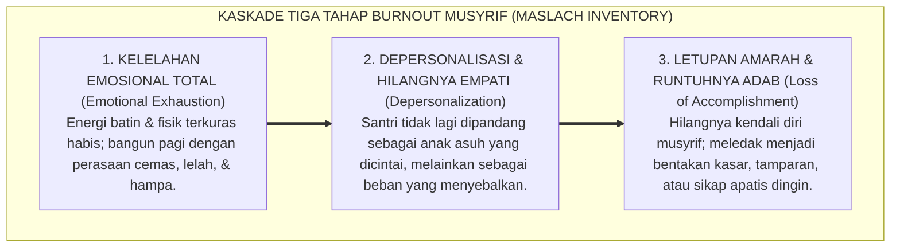
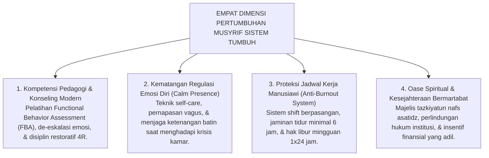
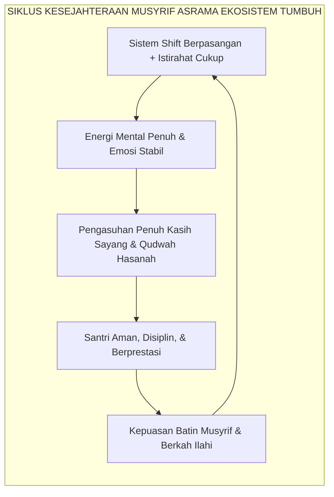

# PENDIDIK & MUSYRIF BERTUMBUH: ANTI-BURNOUT

---
### Jeritan Batin Musyrif di Garis Depan

Di banyak pesantren di seluruh Nusantara, sosok musyrif asrama kerap kali menjadi pahlawan yang paling berjasa, namun sekaligus paling rentan dan terlupakan:

Mereka adalah orang pertama yang terbangun sebelum pukul 03.30 pagi untuk membangunkan santri shalat malam, dan menjadi orang terakhir yang memejamkan mata setelah pukul 23.00 malam memastikan seluruh kamar telah aman. Sepanjang hari, mereka harus meladeni puluhan anak yang rewel karena rindu orang tua (*homesick*), merawat santri yang demam di kamar sakit, melerai perselisihan antar-kawan sekamar, membersihkan lorong jemuran yang kotor, sembari tetap dituntut untuk selalu tampil tersenyum ramah, sabar, dan penuh wibawa di hadapan para santri dan wali santri.

Ketika sebuah pesantren tidak memiliki sistem manajemen beban kerja yang terstruktur dan membiarkan musyrif bekerja sendirian selama 24 jam nonstop selama berbulan-bulan tanpa hari libur, sebuah tragedi psikologis yang sunyi perlahan-lahan terjadi: **Kelelahan Kronis Total (*Burnout Syndrome*)**[^1].

<b>Gambar 6.2.1:</b> Kaskade Tiga Tahap Maslach Burnout Inventory pada Musyrif Asrama Pesantren.

Pakar psikologi kerja **Christina Maslach[^1]**[^1] membuktikan bahwa ketika seorang pengasuh mencapai tahap depersonalisasi, sirkuit empati di otaknya terkunci (*numbed*). Musyrif yang kelelahan kehilangan kemampuan biologis untuk bersikap lembut. 

Hasil akhirnya sangat tragis: **kekerasan fisik dan verbal yang terjadi di asrama pesantren sering kali bukanlah bukti bahwa musyrif tersebut "berwatak jahat", melainkan letupan histeris dari jiwa pembina yang sedang sekarat karena kelelahan kronis (*burnout breakdown*)!**

---

### Prinsip Triad Pertumbuhan: Pendidik Wajib Ikut Bertumbuh

Sistem **TUMBUH** memancangkan kaidah fundamental: **"Santri tidak akan pernah mampu bertumbuh secara sehat jika para pembina di sekelilingnya layu kelelahan"**.

Hanya bejana yang penuh air yang mampu mengalirkan kesegaran kepada cangkir-cangkir di sekitarnya. Seorang musyrif yang jiwanya kering, kurang tidur, dan tertekan tidak akan pernah mampu memancarkan energi keikhlasan dan ketenangan nabawi (*Qudwah Hasanah*) kepada anak asuhnya.

Dalam Triad Pertumbuhan Simbiotik Ekosistem TUMBUH, musyrif dan asatidz diposisikan sebagai pilar kedua yang wajib dirawat kesejahteraan jiwa, raga, dan intelektualnya melalui **Empat Dimensi Pertumbuhan Musyrif**:

<b>Gambar 6.2.2:</b> Empat Dimensi Pembinaan dan Perlindungan Musyrif Ekosistem TUMBUH.

---

### Tiga Pilar Protokol Manajemen Kerja Musyrif dalam sistem TUMBUH

Ekosistem TUMBUH merumuskan tata kelola operasional musyrif[^2] yang menjamin keberlanjutan stamina dan kesehatan mental para pembina:

#### 1. Sistem Shift Kerja Berpasangan (*Dual-Care Team System*)
Sistem TUMBUH menghapus tradisi "musyrif tunggal" yang memegang asrama sendirian:
* Setiap blok asrama (berisi 30–40 santri) diasuh oleh **Tim Dua Orang Musyrif** (Musyrif Utama dan Musyrif Pendamping).
* Jam piket pengawasan aktif dibagi secara bergantian: ketika Musyrif A bertugas mengawal antrean wudhu dan masjid pada subuh hingga siang, Musyrif B memiliki waktu untuk istirahat atau mengajar di kelas. Pada sore hingga malam, giliran tugas berganti secara proporsional.

#### 2. Hak Hari Tenang Mingguan (*Mandatory Day-Off Recharging*)
Pimpinan pondok wajib menjamin bahwa setiap musyrif memiliki **Hak Libur Mingguan (1 x 24 Jam Penuh)** secara bergilir:
* Selama masa libur, tugas pengasuhan diambil alih sepenuhnya oleh musyrif pengganti (*Substitute Mentor*).
* Musyrif yang sedang libur dibebaskan total dari tugas asrama agar dapat pulang mengunjungi keluarga, beristirahat, atau menekuni hobi pribadinya. Riset membuktikan bahwa istirahat 1 hari per pekan mampu meregenerasi neurotransmitter dopamin dan serotonin pembina hingga 80%!

#### 3. Majelis Oase Spiritual Asatidz (*Weekly Tazkiyah Circle*)
Setiap pekan, seluruh musyrif dan asatidz berkumpul dalam majelis tertutup bersama Pengasuh/Kiai:
* Majelis ini bukan forum evaluasi administratif yang menegangkan, melainkan oase penyejuk kalbu (*Spiritual Refueling*).
* Musyrif diajak membaca wirid, bersholawat, saling mendengarkan keluh kesah batin dengan penuh empati, dan memperbarui niat ikhlas lillahi ta'ala (*Tajdidun Niyyah*).

<b>Gambar 6.2.3:</b> Siklus Kesejahteraan Musyrif dan Dampak Positifnya terhadap Pembinaan Santri.

---

### Pendidik yang Dihormati Melahirkan Santri yang Beradab

Merawat kesejahteraan jiwa, raga, dan kehormatan para musyrif adalah salah satu bentuk investasi peradaban tertinggi yang wajib dilakukan oleh setiap pesantren.

Ketika para musyrif merasa dihargai oleh yayasan, memiliki waktu istirahat yang manusiawi, dan dibekali dengan keahlian konseling modern, maka tidak akan ada lagi bentakan atau amarah di lorong asrama. Setiap bilik santri akan dipenuhi oleh pembina yang berhati lapang, murah senyum, dan memancarkan wibawa kasih sayang nabawi yang menumbuhkan karakter santri dengan sempurna.

---

## 📌 Catatan Kaki & Rujukan Primer

[^1]: **Christina Maslach & Michael P. Leiter**, *The Truth About Burnout: How Organizations Cause Personal Stress and What to Do About It* (San Francisco: Jossey-Bass, 1997), hlm. 34–68.
[^2]: **Arnold B. Bakker & Evangelia Demerouti**, "The Job Demands-Resources model: State of the art", *Journal of Managerial Psychology*, Vol. 22, No. 3 (2007), hlm. 309–328.

---

### IV. Eksplanasi Filosofis Lanjutan & Hermeneutika Nilai Pendidik & Musyrif Bertumbuh: Anti-Burnout

Penyelidikan mendalam terhadap tema **PENDIDIK & MUSYRIF BERTUMBUH: ANTI-BURNOUT** menuntut pemahaman integral atas relasi antara *Ontologi Fitrah* dan *Sosiologi Pembelajaran Pesantren*. Ketika seorang santri memasuki ekosistem pendidikan, ia membawa amanah perjanjian primordial (*Mithaq*) yang menuntut ruang tumbuh yang aman dari distorsi psikologis.

1. **Dialektika Keikhlasan (*Shidq an-Niyyah*) vs Formalisme Perilaku**:
   Dalam pandangan *Hujjatul Islam* Al-Imam Al-Ghazali dalam *Ihya 'Ulumiddin*, pembentukan karakter yang sejati bermula dari pembersihan batin (*Thaharatul Batin*). Ketika sebuah institusi mereduksi adab menjadi kepatuhan semu di hadapan figur otoritas, yang sesungguhnya terjadi adalah pelemahan integritas diri (*Nifaq Tarbawi*). Sistem TUMBUH menegaskan bahwa kesalehan sejati harus lahir dari kemerdekaan batin yang disinari oleh cinta kepada Allah (*Mahabbatullah*) dan kesadaran pengawasan-Nya (*Muraqabatullah*).

2. **Dinamika Neuroplastisitas & Internalisasi Nilai Ruhiyyah**:
   Sains kognitif kontemporer membuktikan bahwa pembiasaan nilai yang disertai rasa takut ekstrem mengaktifkan poros *HPA (Hypothalamic-Pituitary-Adrenal)* dan membanjiri otak dengan hormon kortisol. Kondisi ini membekukan kemampuan *Prefrontal Cortex* untuk merefleksikan nilai secara mandiri. Sebaliknya, ketika nilai **PENDIDIK & MUSYRIF BERTUMBUH: ANTI-BURNOUT** disampaikan dalam suasana pengasuhan yang hangat (*Warm Presence*), otak santri melepaskan *oksitosin* dan *dopamin* yang mempercepat konsolidasi sinaptik dan pembentukan memori jangka panjang (*Long-Term Potentiation*).

3. **Matriks Transformasi Praksis Pembinaan**:

| Dimensi Pengasuhan | Pola Lama (Mekanistis-Punitif) | Pola Rekonstruksi Ekosistem TUMBUH |
| :--- | :--- | :--- |
| **Sumber Motivasi** | Tekanan eksternal dan rasa takut akan sanksi fisik. | Kesadaran fitrah internal dan kerinduan pada rida ilahi. |
| **Relasi Musyrif-Santri** | Pengawasan hierarkis intimidatif (panoptikon). | Keteladanan hidup (*Qudwah Hasanah*) dan pendampingan empatik. |
| **Ketahanan Karakter** | Runtuh ketika pengawasan ditiadakan (liburan/lulus). | Melekat kokoh sebagai kompas moral seumur hidup (*Insan Adabi*). |

---

### V. Refleksi Pedagogis & Rekomendasi Aksi Lembaga

Penerapan prinsip **PENDIDIK & MUSYRIF BERTUMBUH: ANTI-BURNOUT** di lingkungan pesantren menuntut komitmen kelembagaan yang terstruktur:
* **Audit Budaya Pengasuhan**: Pimpinan pesantren wajib melakukan refleksi berkala atas seluruh interaksi antara asatidz, musyrif, dan santri guna memastikan tidak ada celah bagi masuknya feodalisme atau kekerasan terselubung.
* **Penguatan Kapasitas Pendidik**: Setiap pembina asrama difasilitasi dengan pelatihan literasi psikologi perkembangan dan konseling Islam agar memiliki kematangan emosi dalam menghadapi dinamika santri.
* **Integrasi Ruhiyyah 24 Jam**: Memastikan bahwa setiap detik kehidupan santri di pondok—mulai dari bangun tidur, halaqah Qur'an, mudzakarah ilmu, hingga istirahat malam—selalu dinaungi oleh nilai keikhlasan dan ukhuwah yang tulus.
