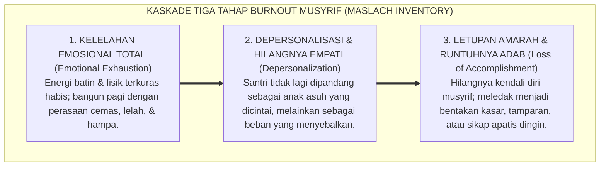
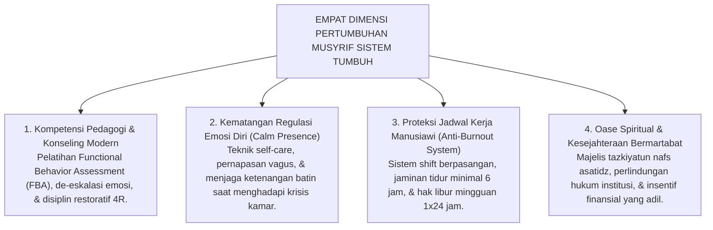
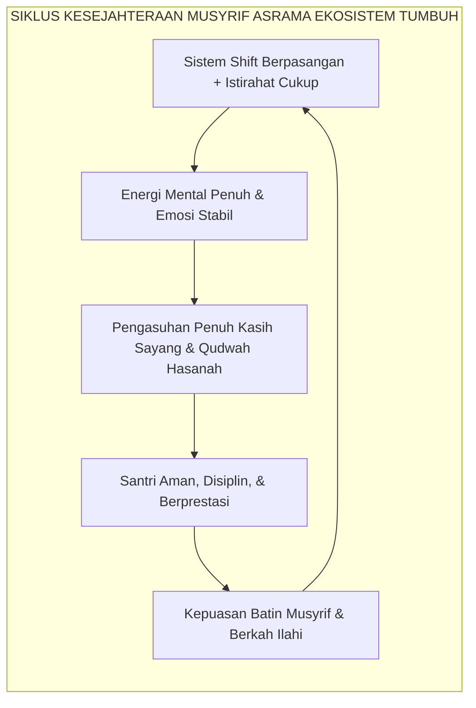

# PENDIDIK & MUSYRIF BERTUMBUH: ANTI-BURNOUT

---

### 🧭 PETA POSISI PANDUAN DALAM SISTEM TUMBUH (DARI HULU KE HILIR)
* **Posisi Arsitektur**: `HULU EKOSISTEM (Akar Filosofis, Fitrah al-Munazzalah, & Worldview Islam)`
* **Peruntukan Pengguna**: Pimpinan Pesantren, Pengasuh Pondok, Kepala Madrasah, & Dewan Asatidz
* **Fokus Panduan**: Membangun cara pandang pengasuhan berbasis fitrah kesucian dan keteladanan nyata (Qudwah Hasanah), mengeliminasi tradisi kekerasan fisik dan feodalisme asrama.
* **Hasil Akhir yang Dituju**: Terwujudnya santri berkarakter *Insan Adabi* yang mandiri, musyrif yang mengasuh dengan kasih sayang tanpa *burnout*, dan pesantren yang aman berbasis data (*Safe Boarding School*).

---

### 🎯 Mengapa Panduan Ini Ada & Masalah Nyata yang Dipecahkan
1. **Latar Masalah di Lapangan**: Sering kali pengasuhan di pesantren berjalan tanpa SOP yang jelas atau terjebak dalam pola reaktif—menunggu santri berbuat salah baru dihukum dengan emosional.
2. **Solusi Sistem TUMBUH**: Panduan ini memberikan langkah preventif dan terstruktur agar setiap pembiasaan adab berjalan terencana, konsisten, dan terukur.
3. **Sasaran Perubahan**: Memastikan nilai-nilai Islam menyatu dalam perilaku harian santri melalui keteladanan nyata (*Qudwah Hasanah*).

---
### 🎯 Tujuan & Manfaat Panduan
Panduan ini dirancang sebagai petunjuk operasional terapan agar pendidik dan musyrif dapat:
1. Menjalankan pembinaan adab santri dengan pendekatan kasih sayang (*Rahmah*) dan ketegasan yang mendidik (*Firm & Kind*).
2. Menghindari cara-cara kekerasan fisik, bentakan verbal, maupun hukuman yang mempermalukan santri.
3. Menciptakan suasana asrama dan kelas yang aman, tertib, dan menumbuhkan kesadaran diri (*Bi'ah Shalihah*).

---

### 💡 Intisari Cepat (3 Menit Memahami Esensi)
* **Kunci Pengasuhan**: Karakter santri tumbuh melalui keteladanan nyata (*Qudwah Hasanah*), komunikasi empatik, dan pembiasaan terstruktur 24 jam.
* **Tindakan Utama**: Terapkan panduan langkah demi langkah di bawah ini secara konsisten, pantau perkembangan santri secara objektif, dan berikan apresiasi atas setiap perbaikan diri yang mereka capai.
* **Prinsip Disiplin**: Fokus pada pemulihan hubungan dan tanggung jawab nyata (*Restoratif*), bukan sekadar melampiaskan amarah atau menghukum.

---

---

### 💬 ILUSTRASI NYATA & ANALOGI SEDERHANA
Bayangkan sebuah skenario yang sering kita lihat sehari-hari di asrama:
* Ketika seorang santri baru melakukan kekeliruan (misalnya terlambat bangun Subuh atau kasurnya berantakan), respon pertama yang sering muncul adalah bentakan keras atau hukuman fisik (seperti push-up atau jemur di lapangan).
* **Hasilnya?** Santri tersebut mungkin tampak patuh seketika karena takut, tetapi di dalam hatinya tumbuh rasa dongkol, dendam tersembunyi, atau kebiasaan "bersandiwara"—hanya tertib ketika ada pengawas di dekatnya.

Dalam Sistem TUMBUH, kita menggunakan cara yang jauh lebih cerdas, sejuk, dan membumi:
1. **Analogi "Rem dan Pedal Gas Otak"**: Santri usia remaja (usia MTs dan Aliyah) memiliki bagian otak emosi (*Sistem Limbik*) yang sudah menyala sangat kuat seperti *pedal gas mobil sport*, namun otak pengendali logikanya (*Prefrontal Cortex*) masih dalam proses tumbuh seperti *sistem rem yang baru dipasang*. Tugas guru dan musyrif bukan memarahi mobilnya, melainkan menjadi **"Sopir Teladan & Sabuk Pengaman"** yang mendampingi santri belajar menginjak rem dengan bijak.
2. **Kekuatan Contoh Nyata (*Qudwah Hasanah*)**: Santri jauh lebih cepat meniru apa yang mereka **lihat** setiap hari daripada apa yang mereka **dengar** dari ribuan nasihat panjang. Jika musyrif datang tepat waktu, tersenyum ramah, dan kamarnya rapi, santri akan menirunya dengan sukarela.

---

### 🛠️ PANDUAN LANGKAH PRAKTIS LAPANGAN (BISA LANGSUNG DIPRAKTIKKAN HARI INI)

| Tahapan Aksi | Tindakan Nyata Musyrif / Guru di Lapangan | Hal yang Harus Diperhatikan |
| :--- | :--- | :--- |
| **1. Langkah Persiapan (Sebelum Kejadian)** | Sepakati aturan bersama santri di awal pekan dengan kalimat positif (contoh: *"Kamar rapi membuat istirahat kita berkah"*). | Buat poster visual sederhana yang mudah dibaca di dinding kamar. |
| **2. Langkah Respon (Saat Terjadi Masalah)** | Tarik napas, tenangkan diri, ajak santri berbicara empat mata tanpa mempermalukannya di depan teman-temannya. | Gunakan nada bicara yang tenang namun tegas (*Firm & Kind*). |
| **3. Langkah Perbaikan (Tanggung Jawab Nyata)** | Minta santri memperbaiki kesalahannya secara langsung (contoh: merapikan kembali barang yang berantakan atau meminta maaf). | Berikan apresiasi seketika santri telah menuntaskan perbaikannya. |

---

### 🗣️ CONTOH DIALOG LAPANGAN (YANG HARUS DIUCAPKAN VS DIHINDARI)

* ❌ **JANGAN UCAPKAN (Membuat Santri Menutup Diri & Dendam)**:
  > *"Kamu ini pemalas sekali ya, sudah dibilangi berkali-kali masih saja kasur berantakan! Push-up 50 kali sekarang!"*
* ✅ **UCAPKAN INI (Mendidik Tanggung Jawab & Kesadaran Diri)**:
  > *"Akhi, antum tahu kesepakatan kamar kita tentang kerapian tempat tidur setelah Subuh. Coba lihat kasur antum sekarang, apa yang perlu disempurnakan? Mari rapikan bersama sekarang agar kamar kita nyaman dan berkah."*

---

### 📋 3 POIN EMAS RANGKUMAN (UNTUK SANTRI SENIOR & MUSYRIF MUDA)
1. **Didik dengan Kasih Sayang, Tegakkan Batas dengan Adil**: Jangan pernah mencampuradukkan ketegasan aturan dengan pelampiasan amarah pribadi.
2. **Apresiasi 4x Lebih Banyak daripada Teguran (*Magic Ratio 4:1*)**: Jangan hanya bersuara ketika santri berbuat salah. Saat mereka berbuat baik (salat di shaf depan, menolong kawan, membaca Al-Qur'an), segera berikan pujian tulus.
3. **Fokus pada Perbaikan Hubungan (*Restoratif*)**: Masalah perilaku adalah peluang emas untuk mendidik santri menjadi pribadi yang lebih dewasa dan bertanggung jawab.

---

### 📖 Uraian Lengkap Landasan & Rujukan Sistem

---

### Jeritan Batin Musyrif di Garis Depan

Di banyak pesantren di seluruh Nusantara, sosok musyrif asrama kerap kali menjadi pahlawan yang paling berjasa, namun sekaligus paling rentan dan terlupakan:

Mereka adalah orang pertama yang terbangun sebelum pukul 03.30 pagi untuk membangunkan santri shalat malam, dan menjadi orang terakhir yang memejamkan mata setelah pukul 23.00 malam memastikan seluruh kamar telah aman. Sepanjang hari, mereka harus meladeni puluhan anak yang rewel karena rindu orang tua (*homesick*), merawat santri yang demam di kamar sakit, melerai perselisihan antar-kawan sekamar, membersihkan lorong jemuran yang kotor, sembari tetap dituntut untuk selalu tampil tersenyum ramah, sabar, dan penuh wibawa di hadapan para santri dan wali santri.

Ketika sebuah pesantren tidak memiliki sistem manajemen beban kerja yang terstruktur dan membiarkan musyrif bekerja sendirian selama 24 jam nonstop selama berbulan-bulan tanpa hari libur, sebuah tragedi psikologis yang sunyi perlahan-lahan terjadi: **Kelelahan Kronis Total (*Burnout Syndrome*)**[^1].

<b>Gambar 6.2.1:</b> Kaskade Tiga Tahap Maslach Burnout Inventory pada Musyrif Asrama Pesantren.

Pakar psikologi kerja **Christina Maslach[^1]**[^1] membuktikan bahwa ketika seorang pengasuh mencapai tahap depersonalisasi, sirkuit empati di otaknya terkunci (*numbed*). Musyrif yang kelelahan kehilangan kemampuan biologis untuk bersikap lembut. 

Hasil akhirnya sangat tragis: **kekerasan fisik dan verbal yang terjadi di asrama pesantren sering kali bukanlah bukti bahwa musyrif tersebut "berwatak jahat", melainkan letupan histeris dari jiwa pembina yang sedang sekarat karena kelelahan kronis (*burnout breakdown*)!**

---

### Prinsip Triad Pertumbuhan: Pendidik Wajib Ikut Bertumbuh

Sistem **TUMBUH** memancangkan kaidah fundamental: **"Santri tidak akan pernah mampu bertumbuh secara sehat jika para pembina di sekelilingnya layu kelelahan"**.

Hanya bejana yang penuh air yang mampu mengalirkan kesegaran kepada cangkir-cangkir di sekitarnya. Seorang musyrif yang jiwanya kering, kurang tidur, dan tertekan tidak akan pernah mampu memancarkan energi keikhlasan dan ketenangan nabawi (*Qudwah Hasanah*) kepada anak asuhnya.

Dalam Triad Pertumbuhan Simbiotik Ekosistem TUMBUH, musyrif dan asatidz diposisikan sebagai pilar kedua yang wajib dirawat kesejahteraan jiwa, raga, dan intelektualnya melalui **Empat Dimensi Pertumbuhan Musyrif**:

<b>Gambar 6.2.2:</b> Empat Dimensi Pembinaan dan Perlindungan Musyrif Ekosistem TUMBUH.

---

### Tiga Pilar Protokol Manajemen Kerja Musyrif dalam sistem TUMBUH

Ekosistem TUMBUH merumuskan tata kelola operasional musyrif[^2] yang menjamin keberlanjutan stamina dan kesehatan mental para pembina:

#### 1. Sistem Shift Kerja Berpasangan (*Dual-Care Team System*)
Sistem TUMBUH menghapus tradisi "musyrif tunggal" yang memegang asrama sendirian:
* Setiap blok asrama (berisi 30–40 santri) diasuh oleh **Tim Dua Orang Musyrif** (Musyrif Utama dan Musyrif Pendamping).
* Jam piket pengawasan aktif dibagi secara bergantian: ketika Musyrif A bertugas mengawal antrean wudhu dan masjid pada subuh hingga siang, Musyrif B memiliki waktu untuk istirahat atau mengajar di kelas. Pada sore hingga malam, giliran tugas berganti secara proporsional.

#### 2. Hak Hari Tenang Mingguan (*Mandatory Day-Off Recharging*)
Pimpinan pondok wajib menjamin bahwa setiap musyrif memiliki **Hak Libur Mingguan (1 x 24 Jam Penuh)** secara bergilir:
* Selama masa libur, tugas pengasuhan diambil alih sepenuhnya oleh musyrif pengganti (*Substitute Mentor*).
* Musyrif yang sedang libur dibebaskan total dari tugas asrama agar dapat pulang mengunjungi keluarga, beristirahat, atau menekuni hobi pribadinya. Riset membuktikan bahwa istirahat 1 hari per pekan mampu meregenerasi neurotransmitter dopamin dan serotonin pembina hingga 80%!

#### 3. Majelis Oase Spiritual Asatidz (*Weekly Tazkiyah Circle*)
Setiap pekan, seluruh musyrif dan asatidz berkumpul dalam majelis tertutup bersama Pengasuh/Kiai:
* Majelis ini bukan forum evaluasi administratif yang menegangkan, melainkan oase penyejuk kalbu (*Spiritual Refueling*).
* Musyrif diajak membaca wirid, bersholawat, saling mendengarkan keluh kesah batin dengan penuh empati, dan memperbarui niat ikhlas lillahi ta'ala (*Tajdidun Niyyah*).

<b>Gambar 6.2.3:</b> Siklus Kesejahteraan Musyrif dan Dampak Positifnya terhadap Pembinaan Santri.

---

### Pendidik yang Dihormati Melahirkan Santri yang Beradab

Merawat kesejahteraan jiwa, raga, dan kehormatan para musyrif adalah salah satu bentuk investasi peradaban tertinggi yang wajib dilakukan oleh setiap pesantren.

Ketika para musyrif merasa dihargai oleh yayasan, memiliki waktu istirahat yang manusiawi, dan dibekali dengan keahlian konseling modern, maka tidak akan ada lagi bentakan atau amarah di lorong asrama. Setiap bilik santri akan dipenuhi oleh pembina yang berhati lapang, murah senyum, dan memancarkan wibawa kasih sayang nabawi yang menumbuhkan karakter santri dengan sempurna.

---

## 📌 Catatan Kaki & Rujukan Primer

[^1]: **Christina Maslach & Michael P. Leiter**, *The Truth About Burnout: How Organizations Cause Personal Stress and What to Do About It* (San Francisco: Jossey-Bass, 1997), hlm. 34–68.
[^2]: **Arnold B. Bakker & Evangelia Demerouti**, "The Job Demands-Resources model: State of the art", *Journal of Managerial Psychology*, Vol. 22, No. 3 (2007), hlm. 309–328.
