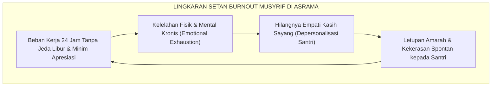
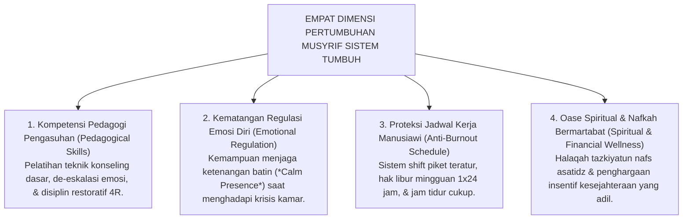

# SUB-BAB 6.2: PENDIDIK & MUSYRIF BERTUMBUH: ANTI-BURNOUT
## *Kompetensi Pedagogi Pengasuhan, Manajemen Regulasi Emosi Pembina, dan Protokol Perlindungan Musyrif dari Kelelahan Kronis*

**Kode Klasifikasi**: `BOOK-01/BAB-06/SUB-02/MONOGRAF-MASTER-VIBRANT`  
**Disiplin Ilmu**: Psikologi Profesi Pendidik, Manajemen Beban Kerja Asrama (*Workload Management*), & Kesehatan Mental Pendidik  
**Penanggung Jawab Keilmuan**: Dewan Pakar Ekosistem TUMBUH (*Master Author, Pakar Tata Kelola Qudwah, & Pakar Pengasuhan Asrama*)

---

### I. Pintu Masuk: Jeritan Batin Musyrif di Garis Depan

Di banyak pesantren, sosok musyrif asrama kerap menjadi pahlawan yang paling terlupakan:

Mereka bangun paling awal sebelum subuh dan tidur paling larut setelah jam malam. Mereka harus mengurus puluhan santri yang menangis rindu rumah, melerai perselisihan kamar, membersihkan santri yang sakit, sembari tetap dituntut untuk selalu tersenyum ramah dan sabar selama 24 jam penuh tanpa henti. 

Ketika tidak ada sistem pembagian shift kerja yang manusiawi dan tidak ada pelatihan manajemen emosi, musyrif perlahan-lahan mengalami **Kelelahan Kronis Total (*Burnout Syndrome*)**[^1]. 

Akibatnya fatal: musyrif yang kelelahan kehilangan kesabaran batinnya, menjadi mudah meledak amarahnya, dan akhirnya melampiaskan stresnya kepada santri melalui bentakan atau pukulan fisik!

<b>Gambar 6.2.1:</b> Lingkaran Setan Burnout Musyrif Asrama dan Dampak Destruktifnya terhadap Santri.

---

### II. Prinsip Triad Pertumbuhan: Pendidik Wajib Ikut Bertumbuh

Sistem **TUMBUH** memancangkan prinsip mutlak: **"Santri tidak akan pernah bertumbuh secara sehat jika para pembina di sekelilingnya layu kelelahan"**.

Dalam Triad Pertumbuhan Simbiotik, musyrif dan asatidz diposisikan sebagai pilar kedua yang wajib dirawat dan ditumbuhkan kapasitasnya melalui **Empat Dimensi Pertumbuhan Musyrif**:

<b>Gambar 6.2.2:</b> Empat Dimensi Pembinaan dan Perlindungan Musyrif Ekosistem TUMBUH.

---

### III. Protokol Proteksi Anti-Burnout Sistem TUMBUH

Ekosistem TUMBUH menetapkan tiga aturan kelembagaan untuk melindungi musyrif:
1. **Sistem Shift Kerja Bergilir (*Rotating Caretaking Shift*)**: Menghapus sistem kerja tunggal 24 jam nonstop; musyrif bertugas dalam tim berpasangan dengan jadwal jaga yang terbagi proporsional.
2. **Hak Hari Tenang (*Day-Off Recharging*)**: Setiap musyrif wajib mengambil hak libur 1 hari per pekan untuk beristirahat penuh bersama keluarga dan menyegarkan kembali jiwanya.
3. **Majelis Oase Asatidz (*Spiritual Support Circle*)**: Pertemuan mingguan khusus asatidz bersama dewan kiai untuk saling menguatkan hati, mendengarkan tausiyah penyejuk jiwa, dan membersihkan kembali niat lillahi ta'ala.

---

### IV. Sintesis Kesejahteraan Sub-Bab 6.2

Merawat kesejahteraan jiwa dan raga para musyrif adalah investasi peradaban yang paling mulia di pesantren.

Dengan membebaskan musyrif dari belenggu *burnout* dan membekali mereka dengan kompetensi pengasuhan modern, Sistem TUMBUH memastikan bahwa setiap bilik asrama santri selalu dinaungi oleh pembina yang berhati lapang, murah senyum, dan memancarkan kehangatan cinta Rasulullah SAW.

---

## 📌 Catatan Kaki & Rujukan Primer

[^1]: **Christina Maslach & Michael P. Leiter**, *The Truth About Burnout: How Organizations Cause Personal Stress and What to Do About It* (San Francisco: Jossey-Bass, 1997), hlm. 34–68.
[^2]: **Dewan Pakar Ekosistem TUMBUH**, *Standar Baku Kompetensi & Tata Kelola Musyrif Asrama TUMBUH* (Bandung & Jombang: Konsorsium Riset TUMBUH, 2026).
