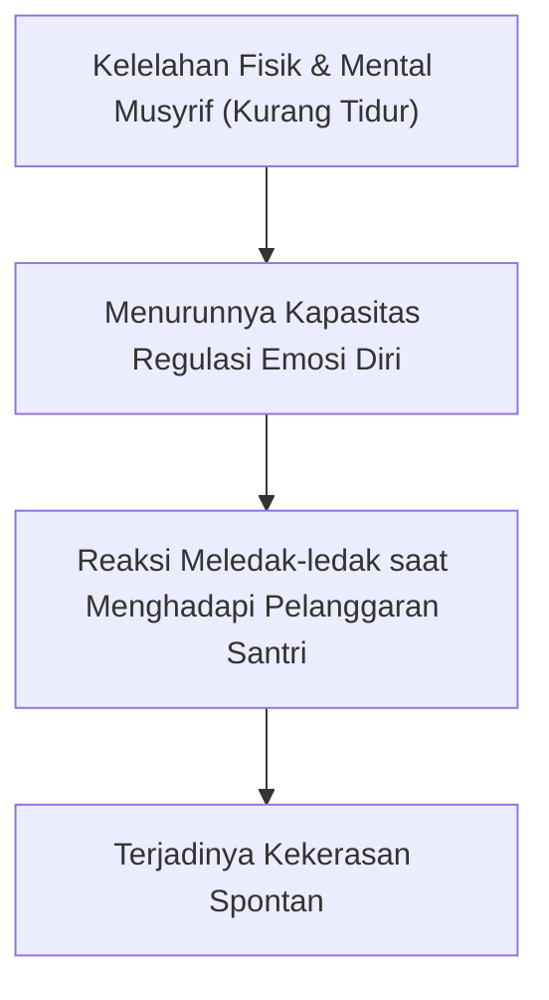

# SUB-BAB 6.2: PENDIDIK & MUSYRIF BERTUMBUH: ANTI-BURNOUT
## *Pengembangan Kompetensi Pedagogi, Kesejahteraan Emosional, dan Manajemen Shift Pengasuhan Sehat*

**Kode Modul**: `BOOK-01/BAB-06/SUB-02`  
**Kategori**: Manajemen Pendidik  
**Fokus Keilmuan**: Psikologi Organisasi & Kesehatan Mental Pendidik Pesantren

---

### 1. Krisis Burnout Musyrif di Pesantren
Banyak kasus kekerasan di pesantren bermula dari musyrif yang mengalami kelelahan kronis (*compassion fatigue & burnout*):
* Bekerja 24 jam nonstop tanpa jam istirahat yang pasti.
* Menanggung beban ganda (mengajar di kelas formal sekaligus menjaga asrama malam hari).
* Kurangnya pelatihan keterampilan konseling dan de-eskalasi emosional.

---

### 2. Protokol Perlindungan Musyrif Ekosistem TUMBUH
1. **Sistem Rotasi Shift 3-Grup**: Menjamin musyrif memiliki jadwal piket yang teratur dan waktu tidur malam minimal 7 jam saat tidak bertugas jaga.
2. **Hak Day-Off Penuh**: Setiap musyrif mendapatkan 1–2 hari libur penuh dalam sepekan di luar area asrama (*decompression day*).
3. **Supervisi & Halaqah Tarbiyah Asatidz**: Sesi refleksi berkala dan konseling psikologis bersama konselor senior untuk menjaga kesehatan jiwa dan kejernihan niat.
