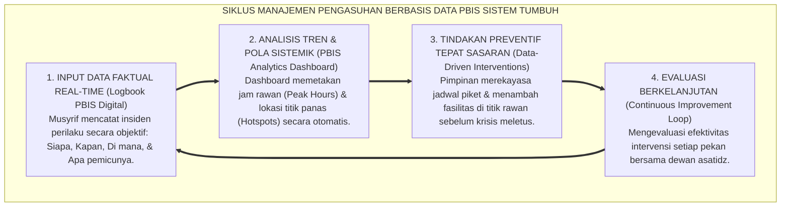
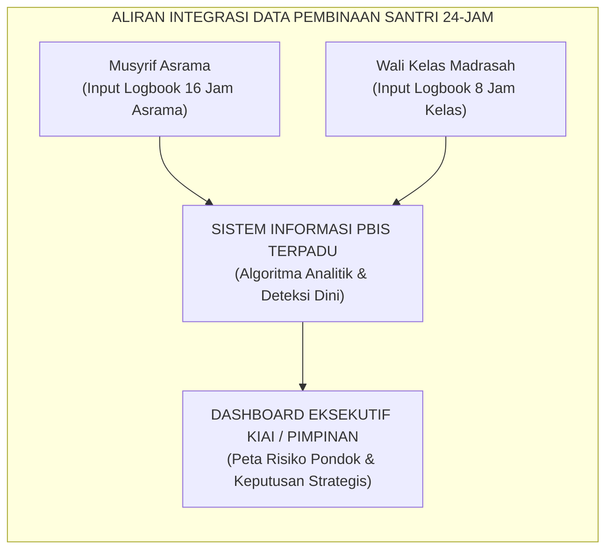

# SISTEM LEMBAGA BERTUMBUH: BERBASIS DATA

---

### 🧭 PETA POSISI PANDUAN DALAM SISTEM TUMBUH (DARI HULU KE HILIR)
* **Posisi Arsitektur**: `HULU EKOSISTEM (Akar Filosofis, Fitrah al-Munazzalah, & Worldview Islam)`
* **Peruntukan Pengguna**: Pimpinan Pesantren, Pengasuh Pondok, Kepala Madrasah, & Dewan Asatidz
* **Fokus Panduan**: Membangun cara pandang pengasuhan berbasis fitrah kesucian dan keteladanan nyata (Qudwah Hasanah), mengeliminasi tradisi kekerasan fisik dan feodalisme asrama.
* **Hasil Akhir yang Dituju**: Terwujudnya santri berkarakter *Insan Adabi* yang mandiri, musyrif yang mengasuh dengan kasih sayang tanpa *burnout*, dan pesantren yang aman berbasis data (*Safe Boarding School*).

---

### 🎯 Mengapa Panduan Ini Ada & Masalah Nyata yang Dipecahkan
1. **Latar Masalah di Lapangan**: Sering kali pengasuhan di pesantren berjalan tanpa SOP yang jelas atau terjebak dalam pola reaktif—menunggu santri berbuat salah baru dihukum dengan emosional.
2. **Solusi Sistem TUMBUH**: Panduan ini memberikan langkah preventif dan terstruktur agar setiap pembiasaan adab berjalan terencana, konsisten, dan terukur.
3. **Sasaran Perubahan**: Memastikan nilai-nilai Islam menyatu dalam perilaku harian santri melalui keteladanan nyata (*Qudwah Hasanah*).

---
### 🎯 Tujuan & Manfaat Panduan
Panduan ini dirancang sebagai petunjuk operasional terapan agar pendidik dan musyrif dapat:
1. Menjalankan pembinaan adab santri dengan pendekatan kasih sayang (*Rahmah*) dan ketegasan yang mendidik (*Firm & Kind*).
2. Menghindari cara-cara kekerasan fisik, bentakan verbal, maupun hukuman yang mempermalukan santri.
3. Menciptakan suasana asrama dan kelas yang aman, tertib, dan menumbuhkan kesadaran diri (*Bi'ah Shalihah*).

---

### 💡 Intisari Cepat (3 Menit Memahami Esensi)
* **Kunci Pengasuhan**: Karakter santri tumbuh melalui keteladanan nyata (*Qudwah Hasanah*), komunikasi empatik, dan pembiasaan terstruktur 24 jam.
* **Tindakan Utama**: Terapkan panduan langkah demi langkah di bawah ini secara konsisten, pantau perkembangan santri secara objektif, dan berikan apresiasi atas setiap perbaikan diri yang mereka capai.
* **Prinsip Disiplin**: Fokus pada pemulihan hubungan dan tanggung jawab nyata (*Restoratif*), bukan sekadar melampiaskan amarah atau menghukum.

---

---

### 💬 ILUSTRASI NYATA & ANALOGI SEDERHANA
Bayangkan sebuah skenario yang sering kita lihat sehari-hari di asrama:
* Ketika seorang santri baru melakukan kekeliruan (misalnya terlambat bangun Subuh atau kasurnya berantakan), respon pertama yang sering muncul adalah bentakan keras atau hukuman fisik (seperti push-up atau jemur di lapangan).
* **Hasilnya?** Santri tersebut mungkin tampak patuh seketika karena takut, tetapi di dalam hatinya tumbuh rasa dongkol, dendam tersembunyi, atau kebiasaan "bersandiwara"—hanya tertib ketika ada pengawas di dekatnya.

Dalam Sistem TUMBUH, kita menggunakan cara yang jauh lebih cerdas, sejuk, dan membumi:
1. **Analogi "Rem dan Pedal Gas Otak"**: Santri usia remaja (usia MTs dan Aliyah) memiliki bagian otak emosi (*Sistem Limbik*) yang sudah menyala sangat kuat seperti *pedal gas mobil sport*, namun otak pengendali logikanya (*Prefrontal Cortex*) masih dalam proses tumbuh seperti *sistem rem yang baru dipasang*. Tugas guru dan musyrif bukan memarahi mobilnya, melainkan menjadi **"Sopir Teladan & Sabuk Pengaman"** yang mendampingi santri belajar menginjak rem dengan bijak.
2. **Kekuatan Contoh Nyata (*Qudwah Hasanah*)**: Santri jauh lebih cepat meniru apa yang mereka **lihat** setiap hari daripada apa yang mereka **dengar** dari ribuan nasihat panjang. Jika musyrif datang tepat waktu, tersenyum ramah, dan kamarnya rapi, santri akan menirunya dengan sukarela.

---

### 🛠️ PANDUAN LANGKAH PRAKTIS LAPANGAN (BISA LANGSUNG DIPRAKTIKKAN HARI INI)

| Tahapan Aksi | Tindakan Nyata Musyrif / Guru di Lapangan | Hal yang Harus Diperhatikan |
| :--- | :--- | :--- |
| **1. Langkah Persiapan (Sebelum Kejadian)** | Sepakati aturan bersama santri di awal pekan dengan kalimat positif (contoh: *"Kamar rapi membuat istirahat kita berkah"*). | Buat poster visual sederhana yang mudah dibaca di dinding kamar. |
| **2. Langkah Respon (Saat Terjadi Masalah)** | Tarik napas, tenangkan diri, ajak santri berbicara empat mata tanpa mempermalukannya di depan teman-temannya. | Gunakan nada bicara yang tenang namun tegas (*Firm & Kind*). |
| **3. Langkah Perbaikan (Tanggung Jawab Nyata)** | Minta santri memperbaiki kesalahannya secara langsung (contoh: merapikan kembali barang yang berantakan atau meminta maaf). | Berikan apresiasi seketika santri telah menuntaskan perbaikannya. |

---

### 🗣️ CONTOH DIALOG LAPANGAN (YANG HARUS DIUCAPKAN VS DIHINDARI)

* ❌ **JANGAN UCAPKAN (Membuat Santri Menutup Diri & Dendam)**:
  > *"Kamu ini pemalas sekali ya, sudah dibilangi berkali-kali masih saja kasur berantakan! Push-up 50 kali sekarang!"*
* ✅ **UCAPKAN INI (Mendidik Tanggung Jawab & Kesadaran Diri)**:
  > *"Akhi, antum tahu kesepakatan kamar kita tentang kerapian tempat tidur setelah Subuh. Coba lihat kasur antum sekarang, apa yang perlu disempurnakan? Mari rapikan bersama sekarang agar kamar kita nyaman dan berkah."*

---

### 📋 3 POIN EMAS RANGKUMAN (UNTUK SANTRI SENIOR & MUSYRIF MUDA)
1. **Didik dengan Kasih Sayang, Tegakkan Batas dengan Adil**: Jangan pernah mencampuradukkan ketegasan aturan dengan pelampiasan amarah pribadi.
2. **Apresiasi 4x Lebih Banyak daripada Teguran (*Magic Ratio 4:1*)**: Jangan hanya bersuara ketika santri berbuat salah. Saat mereka berbuat baik (salat di shaf depan, menolong kawan, membaca Al-Qur'an), segera berikan pujian tulus.
3. **Fokus pada Perbaikan Hubungan (*Restoratif*)**: Masalah perilaku adalah peluang emas untuk mendidik santri menjadi pribadi yang lebih dewasa dan bertanggung jawab.

---

### 📖 Uraian Lengkap Landasan & Rujukan Sistem

---

### Meninggalkan Manajemen Gosip dan Asumsi

Salah satu kelemahan tata kelola yang paling fatal di banyak lembaga pendidikan tradisional adalah **kebiasaan mengambil keputusan disiplin berdasarkan asumsi subjektif, rumor asrama, atau emosi sesaat**.

Perhatikan skenario klasik yang sering terjadi di pondok:
Ketika seorang santri dilaporkan oleh temannya melanggar aturan, dewan pengurus atau pimpinan pondok sering kali langsung memanggil anak tersebut, memarahinya, dan menjatuhkan sanksi berat tanpa pernah memeriksa fakta lapangan secara objektif:
* *Berapa kali sebenarnya insiden itu terjadi dalam sebulan terakhir?*
* *Pada jam berapa insiden itu paling sering terjadi? Di ruangan mana?*
* *Siapa saja saksi dan pihak yang terlibat? Dan apa faktor pemicu lingkungan (*trigger*) di balik perilaku tersebut?*

Tatkala keputusan diambil atas dasar rumor atau prasangka pribadi (*like and dislike*), keadilan di pesantren runtuh. Santri yang vokal atau memiliki wajah garang kerap kali dijadikan "kambing hitam", sementara santri yang pendiam namun menjadi provokator di belakang layar justru luput dari perhatian.

Sistem **TUMBUH** mentransformasikan tata kelola pesantren dari "manajemen berbasis asumsi" menjadi **Organisasi Pembelajar Berbasis Bukti Data Faktual (*Evidence-Based Learning Organization*)**[^1]:

<b>Gambar 6.3.1:</b> Siklus Empat Tahap Pengambilan Keputusan Pengasuhan Berbasis Data PBIS Ekosistem TUMBUH.

---

### Pesantren sebagai Organisasi Pembelajar (*Learning Organization*)

Pakar manajemen organisasi terkemuka dari MIT, **Peter Senge[^1]**[^1], menegaskan bahwa institusi yang mampu bertahan dan unggul di abad modern adalah institusi yang memiliki kapasitas untuk **terus belajar dari data lapangannya sendiri (*Learning Organization*)**.

Di lingkungan pesantren berbasis sistem TUMBUH, data perilaku santri tidak dipandang sebagai "dokumen rahasia untuk menghukum anak", melainkan sebagai **cermin evaluasi bagi sistem kelembagaan**:
* Jika data menunjukkan bahwa 80% kasus santri terlambat shalat subuh terjadi di kamar nomor 4, maka pertanyaannya bukan: *"Mengapa anak-anak di kamar 4 itu malas?"*, melainkan: *"Ada apa dengan kamar 4? Apakah lampu kamarnya redup? Apakah kran airnya macet? Ataukah musyrif pendampingnya kurang aktif menyapa di waktu pagi?"*
* Dengan cara pandang berbasis data ini, masalah diselesaikan pada akar penyebab strukturalnya, bukan dengan melampiaskan amarah di mimbar masjid.

---

### Tiga Fitur Utama Arsitektur Sistem Informasi PBIS TUMBUH

Ekosistem TUMBUH melengkapi seluruh dewan kiai, wali kelas, dan musyrif dengan aplikasi **Logbook PBIS Digital Terpadu**:

<b>Gambar 6.3.2:</b> Aliran Integrasi Data Pembinaan Santri Antara Madrasah dan Asrama.

#### 1. Pemetaan Jam Rawan & Lokasi Titik Panas (*Peak Hours & Hotspots Heatmap*)
Sistem analitik secara otomatis memvisualisasikan data insiden perilaku ke dalam peta panas grafis:
* Mengidentifikasi waktu-waktu rawan perselisihan santri (misalnya: antara pukul 17.00–17.45 WIB saat santri antre mandi sore).
* Mengidentifikasi lokasi-lokasi yang minim penerangan atau minim pengawasan (misalnya: area belakang jemuran atau lantai 3 gedung asrama lama).
* **Aksi Manajemen**: Pimpinan pondok langsung menugaskan musyrif piket aktif di area tersebut pada jam-jam rawan, sehingga insiden pelanggaran dapat dicegah sebelum terjadi (*Primary Prevention*).

#### 2. Sistem Deteksi Dini Santri Butuh Bantuan (*Tier 2 Early Warning Trigger*)
Sistem TUMBUH menerapkan algoritma pendukung multi-tier PBIS:
* Jika seorang santri tercatat mengalami penurunan performa adab (misalnya: 3 hari berturut-turut murung, mengantuk di kelas, dan terlambat shalat), sistem langsung mengirimkan notifikasi peringatan dini (*Early Warning Trigger*) kepada Wali Kelas, Musyrif, dan Guru Bimbingan Konseling (BK).
* Guru BK dan Musyrif segera melakukan intervensi pendampingan khusus melalui program **Check-In/Check-Out (CICO)** sebelum masalah anak membesar menjadi pelanggaran berat.

#### 3. Transparansi dan Rekam Jejak Perkembangan bagi Wali Santri
Data pencatatan PBIS menjadi jembatan komunikasi yang sangat transparan dengan orang tua:
* Orang tua santri tidak hanya dikabari ketika anaknya berbuat salah, melainkan menerima laporan rutin tentang **kemajuan capaian karakter anak (*Positive Milestone Report*)**.
* Wali santri dapat melihat grafik kestabilan ibadah shalat, kemandirian kebersihan kamar, dan keaktifan sosial putra-putrinya di asrama, menumbuhkan rasa percaya (*trust*) yang mendalam kepada institusi pesantren.

---

### Transformasi Menuju Pesantren Modern yang Berkeadilan

Penerapan sistem tata kelola berbasis data ini memastikan bahwa setiap keputusan di pesantren berdiri tegak di atas prinsip keadilan dan transparansi syariat.

Pesantren tidak lagi berjalan dengan cara-cara coba-coba (*trial and error*) yang merugikan santri. Dengan memadukan ketulusan niat lillahi ta'ala dengan kecanggihan sistem informasi PBIS modern, Ekosistem TUMBUH membuktikan bahwa tradisi luhur pesantren mampu bersanding megah dengan standar manajemen mutu pendidikan kelas dunia.

---

## 📌 Catatan Kaki & Rujukan Primer

[^1]: **Peter M. Senge**, *The Fifth Discipline: The Art & Practice of The Learning Organization* (New York: Doubleday/Currency, 1990), hlm. 1–45.
[^2]: **Robert H. Horner & George Sugai**, "School-wide positive behavioral interventions and supports: The research base on implementation with fidelity", *Exceptionality*, Vol. 23, No. 4 (2015), hlm. 197–212.
