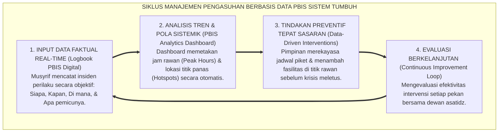
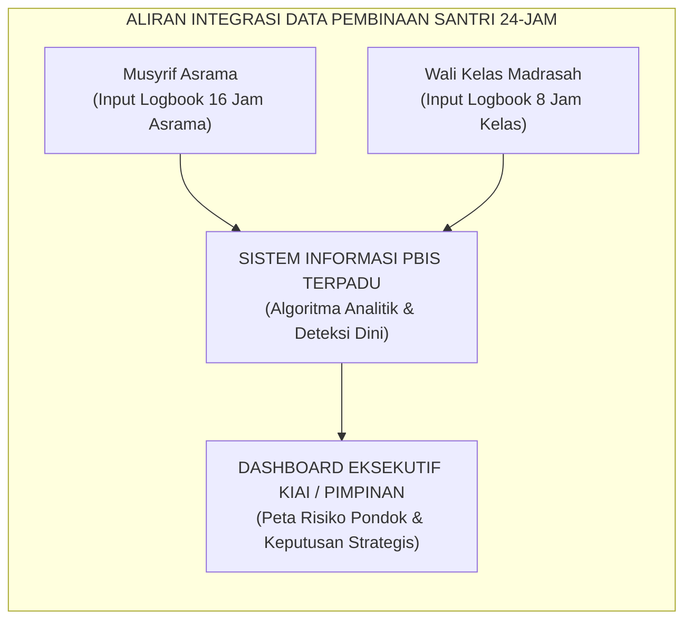

# SISTEM LEMBAGA BERTUMBUH: BERBASIS DATA

---
### Meninggalkan Manajemen Gosip dan Asumsi

Salah satu kelemahan tata kelola yang paling fatal di banyak lembaga pendidikan tradisional adalah **kebiasaan mengambil keputusan disiplin berdasarkan asumsi subjektif, rumor asrama, atau emosi sesaat**.

Perhatikan skenario klasik yang sering terjadi di pondok:
Ketika seorang santri dilaporkan oleh temannya melanggar aturan, dewan pengurus atau pimpinan pondok sering kali langsung memanggil anak tersebut, memarahinya, dan menjatuhkan sanksi berat tanpa pernah memeriksa fakta lapangan secara objektif:
* *Berapa kali sebenarnya insiden itu terjadi dalam sebulan terakhir?*
* *Pada jam berapa insiden itu paling sering terjadi? Di ruangan mana?*
* *Siapa saja saksi dan pihak yang terlibat? Dan apa faktor pemicu lingkungan (*trigger*) di balik perilaku tersebut?*

Tatkala keputusan diambil atas dasar rumor atau prasangka pribadi (*like and dislike*), keadilan di pesantren runtuh. Santri yang vokal atau memiliki wajah garang kerap kali dijadikan "kambing hitam", sementara santri yang pendiam namun menjadi provokator di belakang layar justru luput dari perhatian.

Sistem **TUMBUH** mentransformasikan tata kelola pesantren dari "manajemen berbasis asumsi" menjadi **Organisasi Pembelajar Berbasis Bukti Data Faktual (*Evidence-Based Learning Organization*)**[^1]:

<b>Gambar 6.3.1:</b> Siklus Empat Tahap Pengambilan Keputusan Pengasuhan Berbasis Data PBIS Ekosistem TUMBUH.

---

### Pesantren sebagai Organisasi Pembelajar (*Learning Organization*)

Pakar manajemen organisasi terkemuka dari MIT, **Peter Senge[^1]**[^1], menegaskan bahwa institusi yang mampu bertahan dan unggul di abad modern adalah institusi yang memiliki kapasitas untuk **terus belajar dari data lapangannya sendiri (*Learning Organization*)**.

Di lingkungan pesantren berbasis sistem TUMBUH, data perilaku santri tidak dipandang sebagai "dokumen rahasia untuk menghukum anak", melainkan sebagai **cermin evaluasi bagi sistem kelembagaan**:
* Jika data menunjukkan bahwa 80% kasus santri terlambat shalat subuh terjadi di kamar nomor 4, maka pertanyaannya bukan: *"Mengapa anak-anak di kamar 4 itu malas?"*, melainkan: *"Ada apa dengan kamar 4? Apakah lampu kamarnya redup? Apakah kran airnya macet? Ataukah musyrif pendampingnya kurang aktif menyapa di waktu pagi?"*
* Dengan cara pandang berbasis data ini, masalah diselesaikan pada akar penyebab strukturalnya, bukan dengan melampiaskan amarah di mimbar masjid.

---

### Tiga Fitur Utama Arsitektur Sistem Informasi PBIS TUMBUH

Ekosistem TUMBUH melengkapi seluruh dewan kiai, wali kelas, dan musyrif dengan aplikasi **Logbook PBIS Digital Terpadu**:

<b>Gambar 6.3.2:</b> Aliran Integrasi Data Pembinaan Santri Antara Madrasah dan Asrama.

#### 1. Pemetaan Jam Rawan & Lokasi Titik Panas (*Peak Hours & Hotspots Heatmap*)
Sistem analitik secara otomatis memvisualisasikan data insiden perilaku ke dalam peta panas grafis:
* Mengidentifikasi waktu-waktu rawan perselisihan santri (misalnya: antara pukul 17.00–17.45 WIB saat santri antre mandi sore).
* Mengidentifikasi lokasi-lokasi yang minim penerangan atau minim pengawasan (misalnya: area belakang jemuran atau lantai 3 gedung asrama lama).
* **Aksi Manajemen**: Pimpinan pondok langsung menugaskan musyrif piket aktif di area tersebut pada jam-jam rawan, sehingga insiden pelanggaran dapat dicegah sebelum terjadi (*Primary Prevention*).

#### 2. Sistem Deteksi Dini Santri Butuh Bantuan (*Tier 2 Early Warning Trigger*)
Sistem TUMBUH menerapkan algoritma pendukung multi-tier PBIS:
* Jika seorang santri tercatat mengalami penurunan performa adab (misalnya: 3 hari berturut-turut murung, mengantuk di kelas, dan terlambat shalat), sistem langsung mengirimkan notifikasi peringatan dini (*Early Warning Trigger*) kepada Wali Kelas, Musyrif, dan Guru Bimbingan Konseling (BK).
* Guru BK dan Musyrif segera melakukan intervensi pendampingan khusus melalui program **Check-In/Check-Out (CICO)** sebelum masalah anak membesar menjadi pelanggaran berat.

#### 3. Transparansi dan Rekam Jejak Perkembangan bagi Wali Santri
Data pencatatan PBIS menjadi jembatan komunikasi yang sangat transparan dengan orang tua:
* Orang tua santri tidak hanya dikabari ketika anaknya berbuat salah, melainkan menerima laporan rutin tentang **kemajuan capaian karakter anak (*Positive Milestone Report*)**.
* Wali santri dapat melihat grafik kestabilan ibadah shalat, kemandirian kebersihan kamar, dan keaktifan sosial putra-putrinya di asrama, menumbuhkan rasa percaya (*trust*) yang mendalam kepada institusi pesantren.

---

### Transformasi Menuju Pesantren Modern yang Berkeadilan

Penerapan sistem tata kelola berbasis data ini memastikan bahwa setiap keputusan di pesantren berdiri tegak di atas prinsip keadilan dan transparansi syariat.

Pesantren tidak lagi berjalan dengan cara-cara coba-coba (*trial and error*) yang merugikan santri. Dengan memadukan ketulusan niat lillahi ta'ala dengan kecanggihan sistem informasi PBIS modern, Ekosistem TUMBUH membuktikan bahwa tradisi luhur pesantren mampu bersanding megah dengan standar manajemen mutu pendidikan kelas dunia.

---

## 📌 Catatan Kaki & Rujukan Primer

[^1]: **Peter M. Senge**, *The Fifth Discipline: The Art & Practice of The Learning Organization* (New York: Doubleday/Currency, 1990), hlm. 1–45.
[^2]: **Robert H. Horner & George Sugai**, "School-wide positive behavioral interventions and supports: The research base on implementation with fidelity", *Exceptionality*, Vol. 23, No. 4 (2015), hlm. 197–212.

---

### IV. Eksplanasi Filosofis Lanjutan & Hermeneutika Nilai Sistem Lembaga Bertumbuh: Berbasis Data

Penyelidikan mendalam terhadap tema **SISTEM LEMBAGA BERTUMBUH: BERBASIS DATA** menuntut pemahaman integral atas relasi antara *Ontologi Fitrah* dan *Sosiologi Pembelajaran Pesantren*. Ketika seorang santri memasuki ekosistem pendidikan, ia membawa amanah perjanjian primordial (*Mithaq*) yang menuntut ruang tumbuh yang aman dari distorsi psikologis.

1. **Dialektika Keikhlasan (*Shidq an-Niyyah*) vs Formalisme Perilaku**:
   Dalam pandangan *Hujjatul Islam* Al-Imam Al-Ghazali dalam *Ihya 'Ulumiddin*, pembentukan karakter yang sejati bermula dari pembersihan batin (*Thaharatul Batin*). Ketika sebuah institusi mereduksi adab menjadi kepatuhan semu di hadapan figur otoritas, yang sesungguhnya terjadi adalah pelemahan integritas diri (*Nifaq Tarbawi*). Sistem TUMBUH menegaskan bahwa kesalehan sejati harus lahir dari kemerdekaan batin yang disinari oleh cinta kepada Allah (*Mahabbatullah*) dan kesadaran pengawasan-Nya (*Muraqabatullah*).

2. **Dinamika Neuroplastisitas & Internalisasi Nilai Ruhiyyah**:
   Sains kognitif kontemporer membuktikan bahwa pembiasaan nilai yang disertai rasa takut ekstrem mengaktifkan poros *HPA (Hypothalamic-Pituitary-Adrenal)* dan membanjiri otak dengan hormon kortisol. Kondisi ini membekukan kemampuan *Prefrontal Cortex* untuk merefleksikan nilai secara mandiri. Sebaliknya, ketika nilai **SISTEM LEMBAGA BERTUMBUH: BERBASIS DATA** disampaikan dalam suasana pengasuhan yang hangat (*Warm Presence*), otak santri melepaskan *oksitosin* dan *dopamin* yang mempercepat konsolidasi sinaptik dan pembentukan memori jangka panjang (*Long-Term Potentiation*).

3. **Matriks Transformasi Praksis Pembinaan**:

| Dimensi Pengasuhan | Pola Lama (Mekanistis-Punitif) | Pola Rekonstruksi Ekosistem TUMBUH |
| :--- | :--- | :--- |
| **Sumber Motivasi** | Tekanan eksternal dan rasa takut akan sanksi fisik. | Kesadaran fitrah internal dan kerinduan pada rida ilahi. |
| **Relasi Musyrif-Santri** | Pengawasan hierarkis intimidatif (panoptikon). | Keteladanan hidup (*Qudwah Hasanah*) dan pendampingan empatik. |
| **Ketahanan Karakter** | Runtuh ketika pengawasan ditiadakan (liburan/lulus). | Melekat kokoh sebagai kompas moral seumur hidup (*Insan Adabi*). |

---

### V. Refleksi Pedagogis & Rekomendasi Aksi Lembaga

Penerapan prinsip **SISTEM LEMBAGA BERTUMBUH: BERBASIS DATA** di lingkungan pesantren menuntut komitmen kelembagaan yang terstruktur:
* **Audit Budaya Pengasuhan**: Pimpinan pesantren wajib melakukan refleksi berkala atas seluruh interaksi antara asatidz, musyrif, dan santri guna memastikan tidak ada celah bagi masuknya feodalisme atau kekerasan terselubung.
* **Penguatan Kapasitas Pendidik**: Setiap pembina asrama difasilitasi dengan pelatihan literasi psikologi perkembangan dan konseling Islam agar memiliki kematangan emosi dalam menghadapi dinamika santri.
* **Integrasi Ruhiyyah 24 Jam**: Memastikan bahwa setiap detik kehidupan santri di pondok—mulai dari bangun tidur, halaqah Qur'an, mudzakarah ilmu, hingga istirahat malam—selalu dinaungi oleh nilai keikhlasan dan ukhuwah yang tulus.
