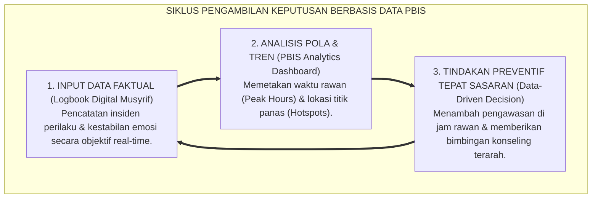
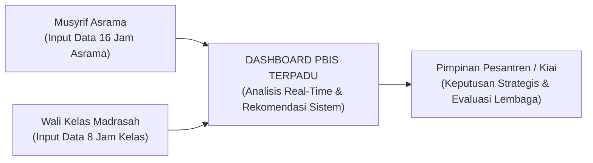

# SUB-BAB 6.3: SISTEM LEMBAGA BERTUMBUH: BERBASIS DATA
## *Transformasi Pesantren Menjadi Organisasi Pembelajar, Arsitektur PBIS Berbasis Bukti, dan Pengambilan Keputusan Tanpa Asumsi*

**Kode Klasifikasi**: `BOOK-01/BAB-06/SUB-03/MONOGRAF-MASTER-VIBRANT`  
**Disiplin Ilmu**: Manajemen Mutu Pendidikan Pesantren, Teori Organisasi Pembelajar (*Learning Organization*), & Sistem Informasi PBIS  
**Penanggung Jawab Keilmuan**: Dewan Pakar Ekosistem TUMBUH (*Master Author, Pakar Arsitektur Digital Pesantren, & Pakar Arsitektur PBIS*)

---

### I. Pintu Masuk: Meninggalkan Manajemen Gosip dan Asumsi

Di banyak lembaga pendidikan tradisional, pengambilan keputusan penegakan disiplin santri kerap kali didasarkan pada hal-hal yang subjektif: rumor asrama, prasangka pribadi pengurus, atau letupan emosi sesaat.

Ketika ada santri yang dilaporkan berbuat salah, pengurus sering kali langsung menjatuhkan vonis berat tanpa memeriksa akar masalahnya: *Kapan pelanggaran itu paling sering terjadi? Di ruangan mana? Siapa saja yang terlibat? Dan apa faktor pemicunya?*

Sistem **TUMBUH** mentransformasikan tata kelola pesantren dari "manajemen berbasis asumsi" menjadi **Organisasi Pembelajar Berbasis Data Faktual (*Evidence-Based Learning Organization*)**[^1]:

<b>Gambar 6.3.1:</b> Siklus Pengambilan Keputusan Pengasuhan Berbasis Data PBIS Ekosistem TUMBUH.

---

### II. Tiga Manfaat Nyata Tata Kelola Berbasis Data bagi Pesantren

Penerapan sistem data PBIS dalam Ekosistem TUMBUH memberikan tiga transformasi besar:

1. **Deteksi Dini Masalah (*Early Warning System*)**:  
   Data logbook digital mampu mendeteksi penurunan motivasi santri sebelum menjadi pelanggaran berat. Jika seorang santri tercatat 3 hari berturut-turut murung dan terlambat bangun, sistem langsung memberi sinyal kepada Wali Kelas dan Musyrif untuk melakukan pendekatan konseling (*Tier 2 CICO*).
2. **Rekayasa Lingkungan yang Tepat Sasaran**:  
   Jika data analitik menunjukkan bahwa 70% perselisihan santri terjadi di antrean kamar mandi pada pukul 05.00 pagi, maka pimpinan pondok tidak perlu marah-marah di mimbar, melainkan cukup menambah kran wudhu atau mengatur jadwal giliran mandi per kamar.
3. **Keadilan dan Transparansi Mutlak**:  
   Setiap evaluasi santri didasarkan pada catatan fakta yang terverifikasi, bukan atas dasar suka atau tidak suka (*like and dislike*) pengurus.

---

### III. Solusi Sistemik TUMBUH: Dashboard Logbook PBIS Terpadu

Ekosistem TUMBUH melengkapi dewan pengasuh, wali kelas, dan musyrif dengan **Dashboard Logbook PBIS Terpadu**:

<b>Gambar 6.3.2:</b> Aliran Integrasi Data Pembinaan Santri Antara Madrasah dan Asrama.

---

### IV. Sintesis Kelembagaan Sub-Bab 6.3

Sebuah lembaga yang bertumbuh adalah lembaga yang rendah hati untuk terus belajar dari data faktual lapangannya sendiri.

Dengan mengadopsi tata kelola berbasis data PBIS, Sistem TUMBUH mentransformasikan pesantren menjadi organisasi modern yang lincah, adil, transparan, dan senantiasa berbenah demi memberikan pengasuhan terbaik bagi putra-putri titipan umat.

---

## 📌 Catatan Kaki & Rujukan Primer

[^1]: **Peter M. Senge**, *The Fifth Discipline: The Art & Practice of The Learning Organization* (New York: Doubleday/Currency, 1990), hlm. 1–45.
[^2]: **Robert H. Horner & George Sugai**, "School-wide positive behavioral interventions and supports: The research base on implementation with fidelity", *Exceptionality*, Vol. 23, No. 4 (2015), hlm. 197–212.
