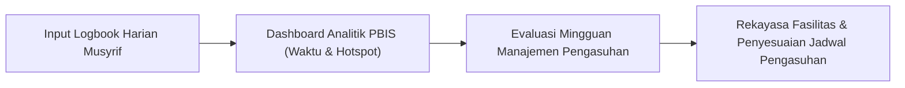

# SUB-BAB 6.3: SISTEM LEMBAGA BERTUMBUH BERBASIS DATA
## *Transformasi Menuju Organisasi Pembelajar (Learning Organization) dengan Dashboard Analitik PBIS*

**Kode Modul**: `BOOK-01/BAB-06/SUB-03`  
**Kategori**: Tata Kelola Kelembagaan  
**Fokus Keilmuan**: Educational Leadership & PBIS Data-Driven Decision Making

---

### 1. Pesantren sebagai Organisasi Pembelajar
Lembaga pesantren tidak boleh bersikap defensif terhadap kekurangan. Sebagai organisasi pembelajar (*learning organization*), pesantren:
* Berani mengevaluasi program yang tidak efektif.
* Menggunakan data empiris kejadian (*Office Discipline Referrals / ODR*) untuk menyempurnakan fasilitas dan penempatan personil.
* Memiliki sistem penjaminan mutu adab yang terukur dan transparan.

---

### 2. Tiga Pilar Tata Kelola Berbasis Data
1. **Pencatatan Faktual Bebas Bias**: Mencatat fakta perilaku tanpa penghakiman emosional.
2. **Pemetaan Titik Rawan (*Hotspot Mapping*)**: Mengidentifikasi lokasi dan jam yang sering terjadi gesekan santri (misal: area antre makan) untuk ditempatkan musyrif pendamping.
3. **Penyempurnaan SOP Berkelanjutan (*Continuous Quality Improvement*)**: Memperbarui aturan yang menimbulkan multi-tafsir demi menjamin keadilan.
