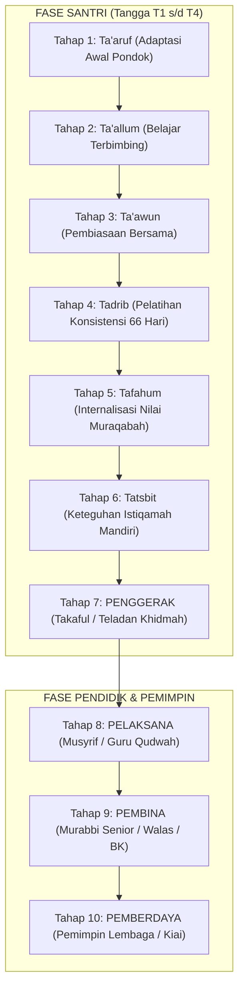

# SUB-BAB 6.4: KONTINUUM 10-TAHAP EKOSISTEM TUMBUH
## *Peta Jalan Menyeluruh Pertumbuhan Manusia: Dari Santri Adaptatif Menuju Pemimpin Peradaban*

**Kode Modul**: `BOOK-01/BAB-06/SUB-04`  
**Kategori**: Arsitektur Kontinuum Perkembangan  
**Fokus Keilmuan**: Human Development Continuum & Kaderisasi Kepemimpinan Islam

---

### 1. Sepuluh Tahap Kontinuum TUMBUH
Pertumbuhan manusia dalam ekosistem pesantren dirumuskan ke dalam spektrum berkesinambungan:

---

### 2. Transisi Generatif Lintas-Tahap
Setiap santri didorong untuk bercita-cita tidak berhenti hanya sebagai "santri yang tertib", melainkan bertumbuh menjadi **Tahap 7 Penggerak**, lalu melangkah menjadi **Tahap 8 Pelaksana** dan **Tahap 9 Pembina** yang siap meneruskan estafet perjuangan keilmuan dan dakwah di tengah ummat.
