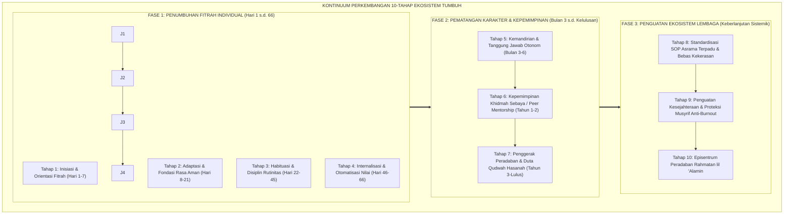

# KONTINUUM 10-TAHAP EKOSISTEM TUMBUH

---

### 🧭 PETA POSISI PANDUAN DALAM SISTEM TUMBUH (DARI HULU KE HILIR)
* **Posisi Arsitektur**: `HULU EKOSISTEM (Akar Filosofis, Fitrah al-Munazzalah, & Worldview Islam)`
* **Peruntukan Pengguna**: Pimpinan Pesantren, Pengasuh Pondok, Kepala Madrasah, & Dewan Asatidz
* **Fokus Panduan**: Membangun cara pandang pengasuhan berbasis fitrah kesucian dan keteladanan nyata (Qudwah Hasanah), mengeliminasi tradisi kekerasan fisik dan feodalisme asrama.
* **Hasil Akhir yang Dituju**: Terwujudnya santri berkarakter *Insan Adabi* yang mandiri, musyrif yang mengasuh dengan kasih sayang tanpa *burnout*, dan pesantren yang aman berbasis data (*Safe Boarding School*).

---

### 🎯 Mengapa Panduan Ini Ada & Masalah Nyata yang Dipecahkan
1. **Latar Masalah di Lapangan**: Sering kali pengasuhan di pesantren berjalan tanpa SOP yang jelas atau terjebak dalam pola reaktif—menunggu santri berbuat salah baru dihukum dengan emosional.
2. **Solusi Sistem TUMBUH**: Panduan ini memberikan langkah preventif dan terstruktur agar setiap pembiasaan adab berjalan terencana, konsisten, dan terukur.
3. **Sasaran Perubahan**: Memastikan nilai-nilai Islam menyatu dalam perilaku harian santri melalui keteladanan nyata (*Qudwah Hasanah*).

---
### 🎯 Tujuan & Manfaat Panduan
Panduan ini dirancang sebagai petunjuk operasional terapan agar pendidik dan musyrif dapat:
1. Menjalankan pembinaan adab santri dengan pendekatan kasih sayang (*Rahmah*) dan ketegasan yang mendidik (*Firm & Kind*).
2. Menghindari cara-cara kekerasan fisik, bentakan verbal, maupun hukuman yang mempermalukan santri.
3. Menciptakan suasana asrama dan kelas yang aman, tertib, dan menumbuhkan kesadaran diri (*Bi'ah Shalihah*).

---

### 💡 Intisari Cepat (3 Menit Memahami Esensi)
* **Kunci Pengasuhan**: Karakter santri tumbuh melalui keteladanan nyata (*Qudwah Hasanah*), komunikasi empatik, dan pembiasaan terstruktur 24 jam.
* **Tindakan Utama**: Terapkan panduan langkah demi langkah di bawah ini secara konsisten, pantau perkembangan santri secara objektif, dan berikan apresiasi atas setiap perbaikan diri yang mereka capai.
* **Prinsip Disiplin**: Fokus pada pemulihan hubungan dan tanggung jawab nyata (*Restoratif*), bukan sekadar melampiaskan amarah atau menghukum.

---

### 📖 Uraian Panduan & Langkah Aksi Lapangan

---

### Sebuah Kompas Navigasi Sepanjang Masa

Membina ribuan santri di sebuah pesantren tanpa memiliki peta jalan perkembangan longitudinal ibarat mengarungi samudera luas tanpa kompas dan peta bintang: kapal pendidikan akan terombang-ambing tanpa kepastian arah.

Tanpa adanya kerangka tahapan yang jelas, para ustadz dan musyrif akan sering dilanda kebingungan metodologis:
* *Apa capaian utama yang wajib dikuasai seorang santri pada pekan pertamanya di asrama?*
* *Kapan seorang santri boleh diberikan kebebasan otonom dan kapan ia masih membutuhkan pendampingan fisik melekat?*
* *Dan bagaimana indikator nyata bahwa seorang santri telah siap diwisuda sebagai kader pemimpin umat yang berakhlak mulia?*

Ekosistem **TUMBUH** merancang **Kontinuum Perkembangan Longitudinal 10-Tahap[^1]**: sebuah kompas arsitektural yang memetakan perjalanan pertumbuhan manusia dan institusi dari titik nol inisiasi hingga puncak kematangan peradaban.

<b>Gambar 6.4.1:</b> Arsitektur Lengkap Kontinuum Perkembangan 10-Tahap Ekosistem TUMBUH.

---

### Bedah Komprehensif Tiga Fase Kontinuum Perkembangan TUMBUH

Mari kita bedah secara mendalam sepuluh tahapan perkembangan ini:

#### FASE 1: Penumbuhan Fitrah Individual (Tahap 1 s.d. 4 / Hari 1–66)
Fokus utama fase ini adalah **Membangun Fondasi Rasa Aman dan Habituasi Sirkuit Saraf 66 Hari**:

* **Tahap 1: Inisiasi & Orientasi Fitrah (Hari 1 s.d. 7)**  
  *Fokus*: Masa transisi awal dari rumah ke pondok. Santri disambut dengan kehangatan (*Ta'aruf*), diperkenalkan pada lingkungan fisik asrama, dan dipastikan kebutuhan primernya (makanan, tempat tidur, sanitasi) terpenuhi tanpa rasa takut.
* **Tahap 2: Adaptasi & Fondasi Rasa Aman (Hari 8 s.d. 21)**  
  *Fokus*: Mengatasi masa kritis *homesickness*. Musyrif mendampingi santri secara intensif, membangun rasa percaya (*trust*), dan menstabilkan ritme tidur serta shalat berjamaah.
* **Tahap 3: Habituasi & Disiplin Rutinitas (Hari 22 s.d. 45)**  
  *Fokus*: Memasuki fase kritis penurunan motivasi (*The Motivational Dip*). Menerapkan sistem pasangan belajar (*Peer Buddy*) dan meningkatkan rasio apresiasi 4:1 untuk mengunci konsistensi kebiasaan adab.
* **Tahap 4: Internalisasi & Otomatisasi Nilai (Hari 46 s.d. 66)**  
  *Fokus*: Mielinisasi sirkuit adab di *Basal Ganglia* mencapai titik kematangan (*Asymptote of Automaticity*). Santri mulai mampu menjalankan adab harian secara mandiri atas dorongan kesadaran batin *Muraqabatullah*.

#### FASE 2: Pematangan Karakter & Kepemimpinan (Tahap 5 s.d. 7 / Bulan 3 s.d. Lulus)
Fokus fase ini adalah **Pemberdayaan Kapasitas Otonom dan Kepemimpinan Pelayan**:

* **Tahap 5: Kemandirian & Tanggung Jawab Otonom (Bulan 3 s.d. 6)**  
  *Fokus*: Santri diberikan ruang kepercayaan untuk mengelola waktu belajar mandiri, menjaga kebersihan kamar tanpa disuruh, dan mulai dilatih berpikir kritis dalam memecahkan masalah.
* **Tahap 6: Kepemimpinan Khidmah Sebaya (*Peer Mentorship*, Tahun 1 s.d. 2)**  
  *Fokus*: Santri dilatih melayani sesama. Mereka ditugaskan menjadi Kakak Asuh bagi adik kelas baru dan menjadi mediator sebaya (*Peer Mediators*) dalam menyelesaikan perselisihan kamar secara damai.
* **Tahap 7: Penggerak Peradaban & Duta Qudwah Hasanah (Tahun 3 s.d. Lulus)**  
  *Fokus*: Puncak kematangan karakter santri (**Tahap 7 Penggerak**). Santri menjadi teladan hidup (*Qudwah*) yang memiliki kematangan aqidah, keluasan ilmu, ketajaman nalar kritis, dan kepedulian sosial yang tinggi, siap diterjunkan sebagai duta kebaikan di tengah masyarakat luas.

#### FASE 3: Penguatan Ekosistem Lembaga (Tahap 8 s.d. 10 / Keberlanjutan Kelembagaan)
Fokus fase ini adalah **Menjamin Keberlanjutan Mutu dan Keselamatan Sistemik Pesantren**:

* **Tahap 8: Standardisasi SOP Asrama Terpadu & Bebas Kekerasan**  
  *Fokus*: Pelembagaan aturan main yang jelas, penghapusan 100% kekerasan fisik/verbal, penataan arsitektur lingkungan fisik yang aman (*Safe Physical Environment*), dan perlindungan hak asasi santri.
* **Tahap 9: Penguatan Kesejahteraan & Proteksi Musyrif Anti-Burnout**  
  *Fokus*: Tata kelola pembina yang profesional melalui sistem shift kerja manusiawi, hak libur mingguan, majelis oase spiritual, dan insentif kesejahteraan yang adil.
* **Tahap 10: Episentrum Peradaban Rahmatan lil 'Alamin**  
  *Fokus*: Pesantren berdiri kokoh sebagai model institusi peradaban unggul yang diakui secara nasional dan global, melahirkan ribuan alumni yang menebar berkah dan kedamaian bagi semesta alam.

---

### Matriks Trajektori Longitudinal Kontinuum 10-Tahap

Tabel berikut merangkum peta jalan perkembangan terpadu dalam Ekosistem TUMBUH:

| Tahap Perkembangan | Durasi Waktu | Fokus Utama Intervensi | Target Capaian Utama |
| :--- | :--- | :--- | :--- |
| **Tahap 1: Inisiasi Fitrah** | Hari 1–7 | Sambutan hangat & orientasi fasilitas | Santri merasa aman dan diterima |
| **Tahap 2: Adaptasi Aman** | Hari 8–21 | Pendampingan intensif & atasi rindu rumah | Kestabilan emosi & jadwal dasar |
| **Tahap 3: Habituasi Rutin** | Hari 22–45 | Sistem Sahabat Sebaya & Apresiasi 4:1 | Konsistensi pembiasaan 66 hari |
| **Tahap 4: Internalisasi Nilai** | Hari 46–66 | Refleksi Muraqabatullah & fading support | Refleks otomatis adab mandiri |
| **Tahap 5: Kemandirian** | Bulan 3–6 | Tanggung jawab otonom & nalar kritis | Disiplin diri tanpa pengawasan |
| **Tahap 6: Khidmah Sebaya** | Tahun 1–2 | Amanah Kakak Asuh & mediasi sebaya | Karakter melayani (*Servant Leader*) |
| **Tahap 7: Penggerak Peradaban** | Tahun 3–Lulus | Teladan Qudwah & kepemimpinan global | Insan Adabi paripurna (*Mushlih*) |
| **Tahap 8: Standardisasi SOP** | Berkelanjutan | Regulasi Safe School & Zero Violence | Lingkungan aman & bebas kekerasan |
| **Tahap 9: Proteksi Musyrif** | Berkelanjutan | Shift kerja adil & pencegahan burnout | Pembina sejahtera & bahagia |
| **Tahap 10: Episentrum Global** | Berkelanjutan | Manajemen mutu PBIS & syiar dakwah | Mercusuar peradaban Islam |

Dengan berpegang pada Kontinuum 10-Tahap ini, proses pendidikan di pesantren tidak lagi berjalan secara acak atau sporadis. Setiap langkah pembinaan terukur dengan presisi, menuntun santri dan lembaga menapaki puncak kejayaan peradaban yang diridhai Allah SWT.

---

## 📌 Catatan Kaki & Rujukan Primer

[^1]: **Hujjatul Islam Imam Abu Hamid al-Ghazali**, *Ihya' 'Ulumiddin*, Kitab Tartib al-Awrad wa Tafshil Ihya' al-Lail (Kairo: Dar al-Hadits, 2004), Jilid I, hlm. 430–465.
