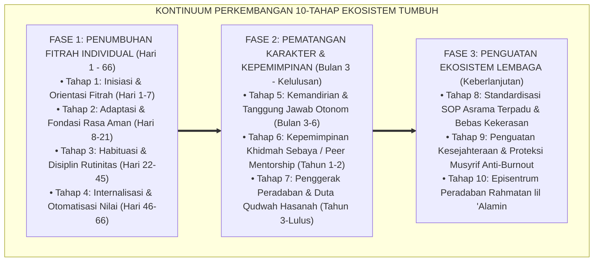

# SUB-BAB 6.4: KONTINUUM 10-TAHAP EKOSISTEM TUMBUH
## *Peta Jalan Longitudinal Transformasi Karakter Santri dan Kematangan Lembaga: Dari Inisiasi Awal Menuju Penggerak Peradaban*

**Kode Klasifikasi**: `BOOK-01/BAB-06/SUB-04/MONOGRAF-MASTER-VIBRANT`  
**Disiplin Ilmu**: Psikologi Perkembangan Longitudinal, Rekayasa Kurikulum Berjenjang, & Manajemen Perubahan Organisasi  
**Penanggung Jawab Keilmuan**: Dewan Pakar Ekosistem TUMBUH (*Master Author, Pakar Simulasi Sistem TUMBUH, & Pakar Filosofi TUMBUH*)

---

### I. Pintu Masuk: Sebuah Kompas Navigasi Sepanjang Masa

Mendidik santri bukanlah peristiwa sporadis tanpa arah peta jalan yang jelas. 

Tanpa adanya kompas kontinuum perkembangan, pengasuh akan bingung menentukan capaian: *Apa target utama santri di bulan pertama? Apa indikator kematangan di tahun kedua? Dan bagaimana profil santri saat ia diwisuda meninggalkan gerbang pondok?*

Ekosistem **TUMBUH** merancang **Kontinuum Perkembangan Longitudinal 10-Tahap** yang memandu perjalanan santri dan lembaga dari titik awal hingga puncak kematangan peradaban:

<b>Gambar 6.4.1:</b> Peta Jalan Kontinuum 10-Tahap Ekosistem TUMBUH bagi Santri dan Lembaga.

---

### II. Bedah Tiga Fase Kontinuum Perkembangan TUMBUH

#### 1. Fase 1: Penumbuhan Fitrah Individual (Tahap 1 s.d. 4 / Hari 1–66)
Fokus fase ini adalah **Membangun Fondasi Rasa Aman dan Habituasi 66 Hari**. Santri dibimbing beradaptasi dengan ritme shalat berjamaah, kebersihan loker, dan adab pergaulan kamar asrama hingga menjadi refleks bawah sadar di *Basal Ganglia*.

#### 2. Fase 2: Pematangan Karakter & Kepemimpinan (Tahap 5 s.d. 7)
Santri yang telah mandiri diberdayakan menjadi **Pemimpin Pelayan (*Servant Leaders*)**. Puncaknya pada **Tahap 7 (Penggerak Peradaban)**, di mana santri senior menjadi teladan hidup (*Qudwah*) yang aktif mengayomi dan melindungi adik-adik kelas barunya.

#### 3. Fase 3: Penguatan Ekosistem Lembaga (Tahap 8 s.d. 10)
Menjamin sistem pesantren bertumbuh menjadi organisasi pembelajar berbasis data PBIS, melindungi musyrif dari *burnout*, dan memancarkan manfaat rahmatan lil 'alamin bagi masyarakat luas.

---

### III. Sintesis Trajektori Sub-Bab 6.4

Kontinuum 10-Tahap ini adalah jaminan bahwa setiap detik kehidupan santri di pesantren berada dalam orbit pendidikan yang terarah, terukur, dan bermartabat.

---

## 📌 Catatan Kaki & Rujukan Primer

[^1]: **Dewan Pakar Ekosistem TUMBUH**, *Kerangka Progresi Tahapan Perkembangan Karakter Santri TUMBUH* (Bandung & Jombang: Konsorsium Riset TUMBUH, 2026).
