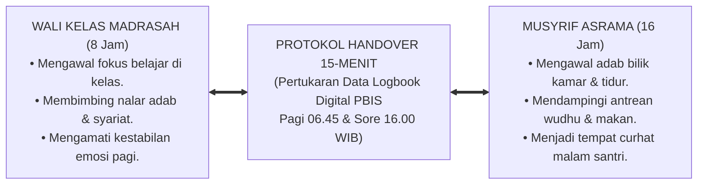
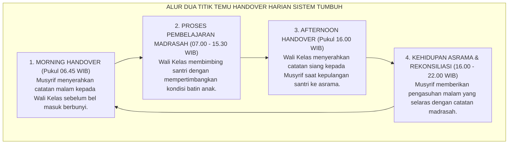
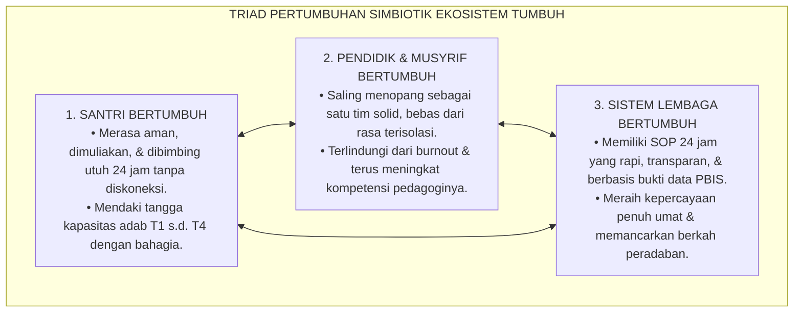

# SINERGI SIMBIOTIK PENGASUHAN 24-JAM

---

### 🧭 PETA POSISI PANDUAN DALAM SISTEM TUMBUH (DARI HULU KE HILIR)
* **Posisi Arsitektur**: `HULU EKOSISTEM (Akar Filosofis, Fitrah al-Munazzalah, & Worldview Islam)`
* **Peruntukan Pengguna**: Pimpinan Pesantren, Pengasuh Pondok, Kepala Madrasah, & Dewan Asatidz
* **Fokus Panduan**: Membangun cara pandang pengasuhan berbasis fitrah kesucian dan keteladanan nyata (Qudwah Hasanah), mengeliminasi tradisi kekerasan fisik dan feodalisme asrama.
* **Hasil Akhir yang Dituju**: Terwujudnya santri berkarakter *Insan Adabi* yang mandiri, musyrif yang mengasuh dengan kasih sayang tanpa *burnout*, dan pesantren yang aman berbasis data (*Safe Boarding School*).

---

### 🎯 Mengapa Panduan Ini Ada & Masalah Nyata yang Dipecahkan
1. **Latar Masalah di Lapangan**: Sering kali pengasuhan di pesantren berjalan tanpa SOP yang jelas atau terjebak dalam pola reaktif—menunggu santri berbuat salah baru dihukum dengan emosional.
2. **Solusi Sistem TUMBUH**: Panduan ini memberikan langkah preventif dan terstruktur agar setiap pembiasaan adab berjalan terencana, konsisten, dan terukur.
3. **Sasaran Perubahan**: Memastikan nilai-nilai Islam menyatu dalam perilaku harian santri melalui keteladanan nyata (*Qudwah Hasanah*).

---
### 🎯 Tujuan & Manfaat Panduan
Panduan ini dirancang sebagai petunjuk operasional terapan agar pendidik dan musyrif dapat:
1. Menjalankan pembinaan adab santri dengan pendekatan kasih sayang (*Rahmah*) dan ketegasan yang mendidik (*Firm & Kind*).
2. Menghindari cara-cara kekerasan fisik, bentakan verbal, maupun hukuman yang mempermalukan santri.
3. Menciptakan suasana asrama dan kelas yang aman, tertib, dan menumbuhkan kesadaran diri (*Bi'ah Shalihah*).

---

### 💡 Intisari Cepat (3 Menit Memahami Esensi)
* **Kunci Pengasuhan**: Karakter santri tumbuh melalui keteladanan nyata (*Qudwah Hasanah*), komunikasi empatik, dan pembiasaan terstruktur 24 jam.
* **Tindakan Utama**: Terapkan panduan langkah demi langkah di bawah ini secara konsisten, pantau perkembangan santri secara objektif, dan berikan apresiasi atas setiap perbaikan diri yang mereka capai.
* **Prinsip Disiplin**: Fokus pada pemulihan hubungan dan tanggung jawab nyata (*Restoratif*), bukan sekadar melampiaskan amarah atau menghukum.

---

---

### 💬 ILUSTRASI NYATA & ANALOGI SEDERHANA
Bayangkan sebuah skenario yang sering kita lihat sehari-hari di asrama:
* Ketika seorang santri baru melakukan kekeliruan (misalnya terlambat bangun Subuh atau kasurnya berantakan), respon pertama yang sering muncul adalah bentakan keras atau hukuman fisik (seperti push-up atau jemur di lapangan).
* **Hasilnya?** Santri tersebut mungkin tampak patuh seketika karena takut, tetapi di dalam hatinya tumbuh rasa dongkol, dendam tersembunyi, atau kebiasaan "bersandiwara"—hanya tertib ketika ada pengawas di dekatnya.

Dalam Sistem TUMBUH, kita menggunakan cara yang jauh lebih cerdas, sejuk, dan membumi:
1. **Analogi "Rem dan Pedal Gas Otak"**: Santri usia remaja (usia MTs dan Aliyah) memiliki bagian otak emosi (*Sistem Limbik*) yang sudah menyala sangat kuat seperti *pedal gas mobil sport*, namun otak pengendali logikanya (*Prefrontal Cortex*) masih dalam proses tumbuh seperti *sistem rem yang baru dipasang*. Tugas guru dan musyrif bukan memarahi mobilnya, melainkan menjadi **"Sopir Teladan & Sabuk Pengaman"** yang mendampingi santri belajar menginjak rem dengan bijak.
2. **Kekuatan Contoh Nyata (*Qudwah Hasanah*)**: Santri jauh lebih cepat meniru apa yang mereka **lihat** setiap hari daripada apa yang mereka **dengar** dari ribuan nasihat panjang. Jika musyrif datang tepat waktu, tersenyum ramah, dan kamarnya rapi, santri akan menirunya dengan sukarela.

---

### 🛠️ PANDUAN LANGKAH PRAKTIS LAPANGAN (BISA LANGSUNG DIPRAKTIKKAN HARI INI)

| Tahapan Aksi | Tindakan Nyata Musyrif / Guru di Lapangan | Hal yang Harus Diperhatikan |
| :--- | :--- | :--- |
| **1. Langkah Persiapan (Sebelum Kejadian)** | Sepakati aturan bersama santri di awal pekan dengan kalimat positif (contoh: *"Kamar rapi membuat istirahat kita berkah"*). | Buat poster visual sederhana yang mudah dibaca di dinding kamar. |
| **2. Langkah Respon (Saat Terjadi Masalah)** | Tarik napas, tenangkan diri, ajak santri berbicara empat mata tanpa mempermalukannya di depan teman-temannya. | Gunakan nada bicara yang tenang namun tegas (*Firm & Kind*). |
| **3. Langkah Perbaikan (Tanggung Jawab Nyata)** | Minta santri memperbaiki kesalahannya secara langsung (contoh: merapikan kembali barang yang berantakan atau meminta maaf). | Berikan apresiasi seketika santri telah menuntaskan perbaikannya. |

---

### 🗣️ CONTOH DIALOG LAPANGAN (YANG HARUS DIUCAPKAN VS DIHINDARI)

* ❌ **JANGAN UCAPKAN (Membuat Santri Menutup Diri & Dendam)**:
  > *"Kamu ini pemalas sekali ya, sudah dibilangi berkali-kali masih saja kasur berantakan! Push-up 50 kali sekarang!"*
* ✅ **UCAPKAN INI (Mendidik Tanggung Jawab & Kesadaran Diri)**:
  > *"Akhi, antum tahu kesepakatan kamar kita tentang kerapian tempat tidur setelah Subuh. Coba lihat kasur antum sekarang, apa yang perlu disempurnakan? Mari rapikan bersama sekarang agar kamar kita nyaman dan berkah."*

---

### 📋 3 POIN EMAS RANGKUMAN (UNTUK SANTRI SENIOR & MUSYRIF MUDA)
1. **Didik dengan Kasih Sayang, Tegakkan Batas dengan Adil**: Jangan pernah mencampuradukkan ketegasan aturan dengan pelampiasan amarah pribadi.
2. **Apresiasi 4x Lebih Banyak daripada Teguran (*Magic Ratio 4:1*)**: Jangan hanya bersuara ketika santri berbuat salah. Saat mereka berbuat baik (salat di shaf depan, menolong kawan, membaca Al-Qur'an), segera berikan pujian tulus.
3. **Fokus pada Perbaikan Hubungan (*Restoratif*)**: Masalah perilaku adalah peluang emas untuk mendidik santri menjadi pribadi yang lebih dewasa dan bertanggung jawab.

---

### 📖 Uraian Lengkap Landasan & Rujukan Sistem

---

### Menyatukan Dua Belahan Sayap Pesantren

Ibarat seekor burung rajawali yang perkasa, pendidikan pesantren hanya akan mampu terbang tinggi menggapai puncak kejayaan peradaban jika **kedua belah sayapnya mengepak serempak dalam irama harmoni yang sempurna**:
* Sayap Kanan adalah **Guru dan Wali Kelas di Madrasah** (mengawal 8 jam transmisi nalar akal dan keilmuan syariat).
* Sayap Kiri adalah **Musyrif dan Pembina di Asrama** (mengawal 16 jam denyut kehidupan nyata, karakter, dan adab bilik kamar).

Ketika kedua sayap ini berjalan sendiri-sendiri tanpa jalinan komunikasi—seperti yang kerap terjadi di banyak pesantren tradisional di mana guru madrasah tidak tahu apa yang terjadi di asrama, dan musyrif asrama tidak tahu apa yang terjadi di ruang kelas—maka burung peradaban itu akan oleng, kehilangan keseimbangan, dan jatuh terhempas ke tanah.

Perhatikan akibat buruk dari diskoneksi ini:
* Seorang santri yang semalaman menangis histeris di asrama karena demam tinggi atau baru saja menerima kabar duka dari keluarganya, keesokan paginya di kelas langsung dibentak dan dihukum berdiri oleh guru madrasah karena dianggap "mengantuk dan tidak memperhatikan pelajaran".
* Sebaliknya, seorang santri yang seharian berprestasi cemerlang di kelas berhasil menjuarai lomba hafalan, di malam hari di asrama tidak mendapatkan penguatan apa pun dari musyrif karena musyrif tidak pernah menerima informasi tersebut.

Ekosistem **TUMBUH** meruntuhkan sekat pemisah ini dan menghadirkan **Sistem Pengasuhan Simbiotik Dual-Pillar 24-Jam[^1]**:

<b>Gambar 6.5.1:</b> Sinergi Simbiotik Dual-Pillar Pengasuhan 24-Jam Ekosistem TUMBUH.

---

### Protokol Sinkronisasi Handover 15-Menit Harian

Sistem TUMBUH menetapkan mekanisme operasional yang menghubungkan madrasah dan asrama melalui **Dua Titik Temu Sinkronisasi Data Harian**:

<b>Gambar 6.5.2:</b> Alur Siklus Protokol Handover 15-Menit Pagi dan Sore Ekosistem TUMBUH.

#### 1. Morning Handover (Pukul 06.45 WIB / Sebelum Bel Madrasah)
* **Tempat**: Ruang Pertemuan Terbuka Kantor Guru / Aplikasi PBIS Digital.
* **Prosedur**: Musyrif asrama menyerahkan ringkasan kondisi santri semalam kepada Wali Kelas:
  - *Santri yang sakit/kurang tidur*: *"Ustadz, santri Fulan tadi malam demam dan baru tidur pukul 02.00 pagi setelah minum obat, mohon di kelas tidak dipaksa maju ke depan dulu."*
  - *Santri yang mengalami krisis emosi*: *"Santri Zaid semalam menangis rindu orang tuanya, mohon disapa dengan hangat saat jam pertama."*
* **Dampak Pedagogis**: Wali Kelas menyambut santri di pintu kelas dengan senyuman dan pelukan empati, sehingga anak merasa aman dan tidak takut bersekolah.

#### 2. Afternoon Handover (Pukul 16.00 WIB / Saat Kepulangan Madrasah)
* **Prosedur**: Wali Kelas menyerahkan catatan dinamika santri selama jam sekolah kepada Musyrif asrama:
  - *Prestasi & Kebaikan*: *"Ustadz, santri Umar tadi siang berhasil meraih nilai sempurna dalam ujian nahwu dan sangat aktif membantu kawannya yang kesulitan, mohon nanti malam di kamar diapresiasi ya."*
  - *Catatan Perilaku*: *"Santri Khalid tadi siang tampak murung dan tidak fokus, mohon nanti saat halaqah malam diajak bicara dari hati ke hati."*
* **Dampak Pedagogis**: Malam harinya di bilik asrama, musyrif tersenyum bangga, menepuk pundak Umar di depan teman-teman sekamarnya, dan mengajak Khalid mengobrol hangat di serambi masjid.

---

### Puncak Harmoni: Triad Pertumbuhan Simbiotik Lembaga

Melalui jalinan sinergi tanpa sekat antara madrasah dan asrama ini, terwujudlah visi agung **Triad Pertumbuhan Simbiotik**:

<b>Gambar 6.5.3:</b> Triad Pertumbuhan Simbiotik Ekosistem TUMBUH.

* **Santri Bertumbuh**: Anak-anak santri merasakan bahwa seluruh orang dewasa di pondok—mulai dari kiai, guru kelas, hingga musyrif kamar—berada dalam satu frekuensi kasih sayang yang sama. Tidak ada ruang kosong atau celah di mana anak merasa diabaikan.
* **Guru & Musyrif Bertumbuh**: Beban berat mengasuh santri tidak lagi dipikul sendirian di pundak satu orang. Pendidik saling berbagi informasi, saling menguatkan tatkala lelah, dan bersama-sama merayakan setiap kemajuan kecil santrinya.
* **Lembaga Bertumbuh**: Pesantren bertransformasi menjadi institusi pembelajar yang berwibawa, profesional, bebas dari kekerasan, dan diberkahi oleh Allah SWT.

Pendidikan adab bukanlah pekerjaan sambilan seorang individu, melainkan gerakan kebersamaan seluruh ekosistem. Dengan menyatukan madrasah dan asrama dalam satu detak nafas pengasuhan 24 jam, Sistem TUMBUH menjamin bahwa setiap anak titipan umat akan dibimbing dengan cinta, keadilan, dan keteladanan akhlak nabawi seutuhnya.

---

## 📌 Catatan Kaki & Rujukan Primer

[^1]: **Urie Bronfenbrenner**, *The Ecology of Human Development: Experiments by Nature and Design* (Cambridge: Harvard University Press, 1979), Bab 4: "Mesosystems and Human Development", hlm. 205–235.
