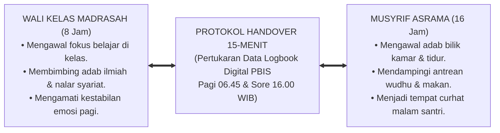

# SUB-BAB 6.5: SINERGI SIMBIOTIK PENGASUHAN 24-JAM
## *Integrasi Dual-Pillar Guru Madrasah dan Musyrif Asrama Menuju Harmoni Triad Pertumbuhan Lembaga*

**Kode Klasifikasi**: `BOOK-01/BAB-06/SUB-05/MONOGRAF-MASTER-VIBRANT`  
**Disiplin Ilmu**: Manajemen Pengasuhan Terpadu, Sinergi Interdisipliner Pendidik, & Sistem Komunikasi Lembaga  
**Penanggung Jawab Keilmuan**: Dewan Pakar Ekosistem TUMBUH (*Master Author, Pakar Tata Kelola Qudwah, & Pakar Pengasuhan Asrama*)

---

### Menyatukan Dua Belahan Sayap Pesantren

Ibarat seekor burung rajawali yang megah, pendidikan pesantren hanya akan mampu terbang tinggi menggapai kejayaan peradaban jika **kedua sayapnya mengepak serempak dalam harmoni sempurna**:
* Sayap Kanan adalah **Guru/Wali Kelas di Madrasah** (mengawal 8 jam nalar akal).
* Sayap Kiri adalah **Musyrif di Asrama** (mengawal 16 jam denyut kehidupan nyata).

Ketika kedua sayap ini berjalan sendiri-sendiri tanpa komunikasi, burung peradaban itu akan oleng dan jatuh terhempas ke tanah.

Ekosistem **TUMBUH** menyatukan kedua sayap ini ke dalam **Sistem Pengasuhan Simbiotik Dual-Pillar 24-Jam**:

<b>Gambar 6.5.1:</b> Sinergi Simbiotik Dual-Pillar Pengasuhan 24-Jam Ekosistem TUMBUH.

---

### Protokol Sinkronisasi Handover 15-Menit Harian

Sistem TUMBUH mewajibkan dua titik temu sinkronisasi setiap hari:

1. **Morning Handover (Pukul 06.45 WIB)**:  
   Musyrif asrama menyerahkan data santri kepada Wali Kelas sebelum bel sekolah berbunyi: *"Ustadz, santri Fulan tadi malam mengigau demam dan rindu orang tua, mohon di kelas tidak dipaksa maju ke depan dulu."* Wali kelas seketika paham dan menyambut si anak dengan pelukan hangat.
2. **Afternoon Handover (Pukul 16.00 WIB)**:  
   Wali Kelas menyerahkan data santri kepada Musyrif saat kepulangan madrasah: *"Ustadz, santri Fulan tadi siang berhasil meraih nilai sempurna dalam ujian nahwu, mohon di kamar malam ini diapresiasi."* Malamnya, musyrif tersenyum bangga dan menepuk pundak si anak di depan teman-teman sekamarnya.

---

### Puncak Harmoni: Tiga Entitas Bertumbuh Serempak

Melalui sinergi tanpa sekat ini, terwujudlah impian agung **Triad Pertumbuhan Simbiotik**:
* **Santri Bertumbuh**: Merasa aman, dihargai, dan dibimbing secara utuh 24 jam tanpa ada ruang hampa yang terabaikan.
* **Guru & Musyrif Bertumbuh**: Saling mendukung sebagai satu tim solid, terlindungi dari stres sendirian, dan bahagia dalam kebersamaan mengasuh.
* **Lembaga Bertumbuh**: Memiliki sistem tata kelola modern berbasis data, dipercaya penuh oleh orang tua santri, dan diberkahi oleh Allah SWT.

---

### Sintesis Pamungkas Bab 06

Triad Pertumbuhan Simbiotik adalah bukti nyata bahwa mendidik adab bukanlah beban kerja seorang individu, melainkan gerakan kebersamaan seluruh ekosistem.

Dengan menyatukan madrasah dan asrama dalam satu detak nafas pengasuhan 24 jam, Sistem TUMBUH memastikan tidak ada satu pun santri titipan umat yang luput dari dekapan kasih sayang dan bimbingan akhlak nabawi.

---

## 📌 Catatan Kaki & Rujukan Primer

[^1]: **Dewan Pakar Ekosistem TUMBUH**, *Manual Operasional Protokol Handover Dual-Pillar 24-Jam TUMBUH* (Bandung & Jombang: Konsorsium Riset TUMBUH, 2026).
