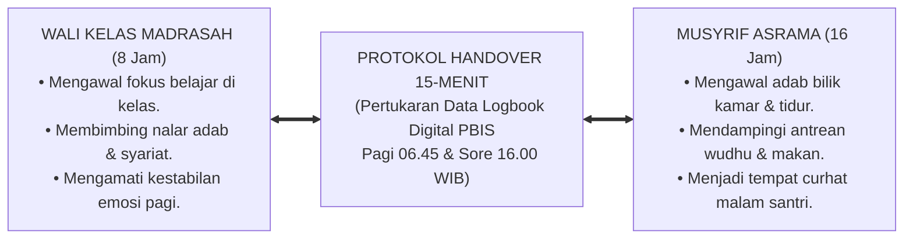
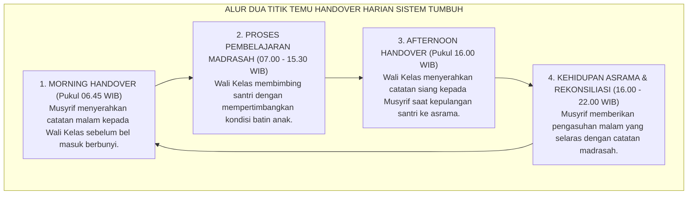
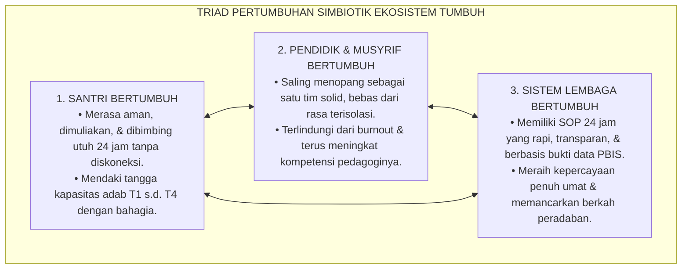

# SUB-BAB 6.5: SINERGI SIMBIOTIK PENGASUHAN 24-JAM
## *Integrasi Dual-Pillar Guru Madrasah dan Musyrif Asrama Menuju Harmoni Triad Pertumbuhan Lembaga*

**Kode Klasifikasi**: `BOOK-01/BAB-06/SUB-05/MONOGRAF-MASTER-VIBRANT`  
**Disiplin Ilmu**: Manajemen Pengasuhan Terpadu, Sinergi Interdisipliner Pendidik, & Sistem Komunikasi Lembaga  
**Penanggung Jawab Keilmuan**: Dewan Pakar Ekosistem TUMBUH (*Master Author, Pakar Tata Kelola Qudwah, & Pakar Pengasuhan Asrama*)

---

### Menyatukan Dua Belahan Sayap Pesantren

Ibarat seekor burung rajawali yang perkasa, pendidikan pesantren hanya akan mampu terbang tinggi menggapai puncak kejayaan peradaban jika **kedua belah sayapnya mengepak serempak dalam irama harmoni yang sempurna**:
* Sayap Kanan adalah **Guru dan Wali Kelas di Madrasah** (mengawal 8 jam transmisi nalar akal dan keilmuan syariat).
* Sayap Kiri adalah **Musyrif dan Pembina di Asrama** (mengawal 16 jam denyut kehidupan nyata, karakter, dan adab bilik kamar).

Ketika kedua sayap ini berjalan sendiri-sendiri tanpa jalinan komunikasi—seperti yang kerap terjadi di banyak pesantren tradisional di mana guru madrasah tidak tahu apa yang terjadi di asrama, dan musyrif asrama tidak tahu apa yang terjadi di ruang kelas—maka burung peradaban itu akan oleng, kehilangan keseimbangan, dan jatuh terhempas ke tanah.

Perhatikan akibat buruk dari diskoneksi ini:
* Seorang santri yang semalaman menangis histeris di asrama karena demam tinggi atau baru saja menerima kabar duka dari keluarganya, keesokan paginya di kelas langsung dibentak dan dihukum berdiri oleh guru madrasah karena dianggap "mengantuk dan tidak memperhatikan pelajaran".
* Sebaliknya, seorang santri yang seharian berprestasi cemerlang di kelas berhasil menjuarai lomba hafalan, di malam hari di asrama tidak mendapatkan penguatan apa pun dari musyrif karena musyrif tidak pernah menerima informasi tersebut.

Ekosistem **TUMBUH** meruntuhkan sekat pemisah ini dan menghadirkan **Sistem Pengasuhan Simbiotik Dual-Pillar 24-Jam[^1]**:

<b>Gambar 6.5.1:</b> Sinergi Simbiotik Dual-Pillar Pengasuhan 24-Jam Ekosistem TUMBUH.

---

### Protokol Sinkronisasi Handover 15-Menit Harian

Sistem TUMBUH menetapkan mekanisme operasional yang menghubungkan madrasah dan asrama melalui **Dua Titik Temu Sinkronisasi Data Harian**:

<b>Gambar 6.5.2:</b> Alur Siklus Protokol Handover 15-Menit Pagi dan Sore Ekosistem TUMBUH.

#### 1. Morning Handover (Pukul 06.45 WIB / Sebelum Bel Madrasah)
* **Tempat**: Ruang Pertemuan Terbuka Kantor Guru / Aplikasi PBIS Digital.
* **Prosedur**: Musyrif asrama menyerahkan ringkasan kondisi santri semalam kepada Wali Kelas:
  - *Santri yang sakit/kurang tidur*: *"Ustadz, santri Fulan tadi malam demam dan baru tidur pukul 02.00 pagi setelah minum obat, mohon di kelas tidak dipaksa maju ke depan dulu."*
  - *Santri yang mengalami krisis emosi*: *"Santri Zaid semalam menangis rindu orang tuanya, mohon disapa dengan hangat saat jam pertama."*
* **Dampak Pedagogis**: Wali Kelas menyambut santri di pintu kelas dengan senyuman dan pelukan empati, sehingga anak merasa aman dan tidak takut bersekolah.

#### 2. Afternoon Handover (Pukul 16.00 WIB / Saat Kepulangan Madrasah)
* **Prosedur**: Wali Kelas menyerahkan catatan dinamika santri selama jam sekolah kepada Musyrif asrama:
  - *Prestasi & Kebaikan*: *"Ustadz, santri Umar tadi siang berhasil meraih nilai sempurna dalam ujian nahwu dan sangat aktif membantu kawannya yang kesulitan, mohon nanti malam di kamar diapresiasi ya."*
  - *Catatan Perilaku*: *"Santri Khalid tadi siang tampak murung dan tidak fokus, mohon nanti saat halaqah malam diajak bicara dari hati ke hati."*
* **Dampak Pedagogis**: Malam harinya di bilik asrama, musyrif tersenyum bangga, menepuk pundak Umar di depan teman-teman sekamarnya, dan mengajak Khalid mengobrol hangat di serambi masjid.

---

### Puncak Harmoni: Triad Pertumbuhan Simbiotik Lembaga

Melalui jalinan sinergi tanpa sekat antara madrasah dan asrama ini, terwujudlah visi agung **Triad Pertumbuhan Simbiotik**:

<b>Gambar 6.5.3:</b> Triad Pertumbuhan Simbiotik Ekosistem TUMBUH.

* **Santri Bertumbuh**: Anak-anak santri merasakan bahwa seluruh orang dewasa di pondok—mulai dari kiai, guru kelas, hingga musyrif kamar—berada dalam satu frekuensi kasih sayang yang sama. Tidak ada ruang kosong atau celah di mana anak merasa diabaikan.
* **Guru & Musyrif Bertumbuh**: Beban berat mengasuh santri tidak lagi dipikul sendirian di pundak satu orang. Pendidik saling berbagi informasi, saling menguatkan tatkala lelah, dan bersama-sama merayakan setiap kemajuan kecil santrinya.
* **Lembaga Bertumbuh**: Pesantren bertransformasi menjadi institusi pembelajar yang berwibawa, profesional, bebas dari kekerasan, dan diberkahi oleh Allah SWT.

Pendidikan adab bukanlah pekerjaan sambilan seorang individu, melainkan gerakan kebersamaan seluruh ekosistem. Dengan menyatukan madrasah dan asrama dalam satu detak nafas pengasuhan 24 jam, Sistem TUMBUH menjamin bahwa setiap anak titipan umat akan dibimbing dengan cinta, keadilan, dan keteladanan akhlak nabawi seutuhnya.

---

## 📌 Catatan Kaki & Rujukan Primer

[^1]: **Urie Bronfenbrenner**, *The Ecology of Human Development: Experiments by Nature and Design* (Cambridge: Harvard University Press, 1979), Bab 4: "Mesosystems and Human Development", hlm. 205–235.
