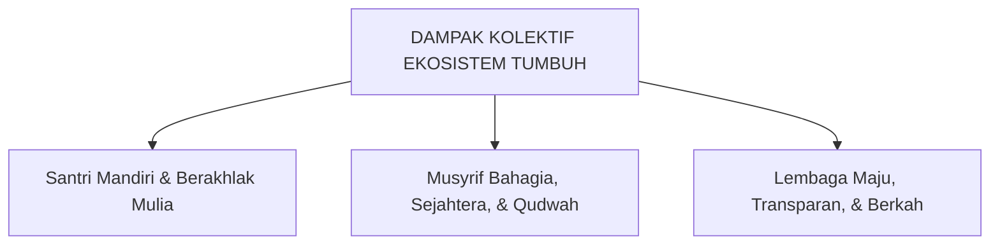

# SUB-BAB 6.5: SINERGI SIMBIOTIK PENGASUHAN 24-JAM
## *Integrasi Pengukuran Dampak Kolektif pada Santri, Musyrif, dan Tata Kelola Pesantren*

**Kode Modul**: `BOOK-01/BAB-06/SUB-05`  
**Kategori**: Evaluasi Simbiotik  
**Fokus Keilmuan**: Collective Impact Assessment & Manajemen Ekosistem

---

### 1. Evaluasi Simbiotik Triad Pertumbuhan
Keberhasilan ekosistem TUMBUH dinilai dari keserentakan pertumbuhan ketiga pilar:

| Entitas | Indikator Keberhasilan Pertumbuhan | Alat Evaluasi Utama |
| :--- | :--- | :--- |
| **Santri** | Penurunan 85% insiden disiplin, peningkatan skor 10 Muwashafat, kemandirian hidup asrama. | Raport Pertumbuhan Ipsatif & Rubrik Observasi. |
| **Musyrif** | Nol kasus kekerasan fisik/verbal, kepuasan kerja tinggi, terlindungi dari *burnout*. | Maslach Burnout Inventory (MBI) & Supervisi Mingguan. |
| **Lembaga** | Akreditasi aman anak (*Safe School Index*), SOP tertata, kepercayaan wali santri meningkat. | Audit Kepatuhan Triwulanan & Dashboard PBIS. |

