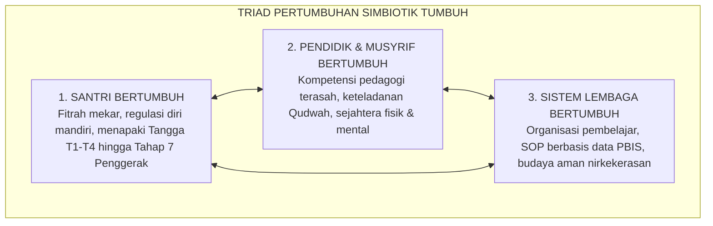

# BAB 6: TRIAD PERTUMBUHAN SIMBIOTIK & KONTINUUM 10-TAHAP
## *Model Pertumbuhan Bersama Tiga Pilar: Santri, Pendidik, Lembaga Melintasi 10 Tahapan Ekosistem TUMBUH*

**Nomor Identifikasi**: `BOOK-01/BAB-06/TRIAD-PERTUMBUHAN/2026`  
**Volume**: Buku 01 — *Akar Filosofis & Epistemologi Pendidikan Karakter Pesantren*  
**Dewan Pakar**: `pakar-filosofi-tumbuh`, `pakar-simulasi-sistem-tumbuh`, `pakar-tata-kelola-qudwah`

---

## 📑 DAFTAR ISI SUB-BAB 6

1. [6.1 Kegagalan Paradigma Pendidikan Satu Arah (Unilateral Paradigm)](#61-kegagalan-paradigma-pendidikan-satu-arah-unilateral-paradigm)
2. [6.2 Prinsip Triad Pertumbuhan Simbiotik: Tiga Entitas Bertumbuh Serempak](#62-prinsip-triad-pertumbuhan-simbiotik-tiga-entitas-bertumbuh-serempak)
3. [6.3 Arsitektur Kontinuum 10-Tahap Ekosistem TUMBUH](#63-arsitektur-kontinuum-10-tahap-ekosistem-tumbuh)
4. [6.4 Dinamika Interaksi Simbiotik: Dari Santri Baru Menuju Pemimpin Peradaban](#64-dinamika-interaksi-simbiotik-dari-santri-baru-menuju-pemimpin-peradaban)
5. [6.5 Indikator Kematangan Sistem Lembaga sebagai Organisasi Pembelajar](#65-indikator-kematangan-sistem-lembaga-sebagai-organisasi-pembelajar)

---

## 6.1 Kegagalan Paradigma Pendidikan Satu Arah

Dalam model pendidikan tradisional yang usang, proses pembinaan dianggap sebagai jalan satu arah (*unidirectional*): pendidik dianggap manusia sempurna yang hanya bertugas "memperbaiki" santri yang dianggap serba kurang. Paradigma ini menimbulkan berbagai patologi:
* Pendidik merasa tabu mengakui kesalahan atau kelelahan emosional.
* Lembaga menolak berbenah dan mengabaikan data empiris kegagalan program.
* Santri merasa dihakimi dan diperlakukan sebagai objek yang inferior.

---

## 6.2 Prinsip Triad Pertumbuhan Simbiotik

Ekosistem TUMBUH menegaskan bahwa pendidikan yang berkah dan berkelanjutan hanya terjadi melalui **Triad Pertumbuhan Simbiotik**:

Ketiganya saling menguatkan: musyrif yang sejahtera dan terlatih melahirkan pendampingan santri yang sabar dan hangat; santri yang bertumbuh adabnya menciptakan lingkungan pondok yang tenang; dan sistem lembaga yang adil melindungi pendidik dari kelelahan mental (*burnout*).

---

## 6.3 Arsitektur Kontinuum 10-Tahap Ekosistem TUMBUH

Pertumbuhan dalam ekosistem TUMBUH dipetakan ke dalam kontinuum 10 tahap berkesinambungan:

| Tahap | Nama Tahapan | Entitas Utama | Karakteristik Utama |
| :---: | :--- | :--- | :--- |
| **Tahap 1** | **Ta'aruf / Adaptasi Awal** | Santri Pemula (T1) | Penyesuaian ritme hidup pondok, adaptasi homesickness, mengenal adab dasar. |
| **Tahap 2** | **Ta'allum / Belajar Terbimbing** | Santri Awal (T1) | Mengikuti instruksi adab dengan pendampingan aktif musyrif. |
| **Tahap 3** | **Ta'awun / Pembiasaan Bersama** | Santri Madya (T2) | Mengembangkan kerja sama kamar, antre wudhu, & disiplin rutinitas 24-jam. |
| **Tahap 4** | **Tadrib / Pelatihan Konsistensi** | Santri Madya (T2) | Pembentukan kebiasaan otomatis 66-hari tanpa dorongan eksternal berlebih. |
| **Tahap 5** | **Tafahum / Internalisasi Nilai** | Santri Lanjut (T3) | Memahami hikmah syariat, regulasi diri otonom, & kesadaran muraqabah. |
| **Tahap 6** | **Tatsbit / Keteguhan Istiqamah** | Santri Lanjut (T3) | Mampu mempertahankan adab di tengah godaan teman sebaya dan masa liburan. |
| **Tahap 7** | **PENGGERAK (Takaful / Khidmah)** | Santri Akhir / Pengabdian | Menjadi teladan (*role model*), mentor adik kelas, & duta perdamaian asrama. |
| **Tahap 8** | **PELAKSANA (Qudwah Praktisi)** | Guru Muda & Musyrif Baru | Menjalankan SOP pengasuhan *Firm & Kind* dan pencatatan logbook PBIS. |
| **Tahap 9** | **PEMBINA (Murabbi Senior)** | Musyrif Senior, Walas, & BK | Melakukan kalibrasi rater, memoderasi lingkaran restoratif, & mentoring asatidz muda. |
| **Tahap 10**| **PEMBERDAYA (Pemimpin Lembaga)** | Pimpinan Pesantren / Kiai | Merancang kebijakan makro, menjamin iklim kerja sehat, & memimpin peradaban ummat. |

---

## 6.4 Dinamika Interaksi Simbiotik di Lapangan

Pergerakan santri dari Tahap 1 hingga Tahap 7 tidak terputus dari interaksi dengan para pendidik Tahap 8–9 dan pengayoman lembaga Tahap 10. Santri tingkat akhir (Tahap 7 Penggerak) menjadi jembatan hidup antara santri junior dengan para musyrif, membuktikan bahwa kepemimpinan Islam adalah kepemimpinan mengayomi yang bebas dari feodalisme.
