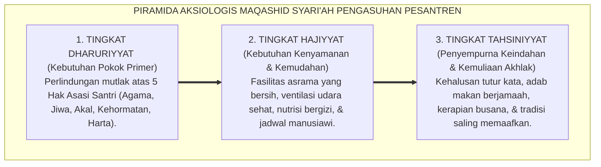

# SUB-BAB 7.1: DIMENSI AKSIOLOGIS & MAQASHID SYARI'AH PENGASUHAN
## *Tujuan Luhur Penegakan Syariat, Perlindungan Martabat Santri, dan Landasan Nilai Etis Pendidikan Pesantren*

**Kode Klasifikasi**: `BOOK-01/BAB-07/SUB-01/MONOGRAF-MASTER-VIBRANT`  
**Disiplin Ilmu**: Aksiologi Pendidikan Islam, Filsafat Hukum Islam (*Maqashid asy-Syari'ah*), & Hak Asasi Manusia dalam Islam  
**Penanggung Jawab Keilmuan**: Dewan Pakar Ekosistem TUMBUH (*Master Author, Pakar Epistemologi Turats, & Pakar Perlindungan Anak*)

---

### I. Pintu Masuk: Untuk Apa Seluruh Aturan Ini Diciptakan?

Pertanyaan penutup yang paling luhur dalam filsafat pendidikan Islam adalah pertanyaan **Aksiologis (Nilai dan Tujuan)**:

* *Mengapa kita membuat aturan asrama? Mengapa kita melarang kekerasan? Mengapa kita menjaga tidur dan makanan santri? Dan untuk kemaslahatan apa seluruh ekosistem ini ditegakkan?*

Pakar ushul fiqih agung **Imam Asy-Syathibi** dalam *Al-Muwafaqat*[^1] menegaskan sebuah kaidah agung:

$$\text{إِنَّ الشَّرِيعَةَ مَبْنِيَّةٌ عَلَى جَلْبِ الْمَصَالِحِ وَدَرْءِ الْمَفَاسِدِ}$$
*"Sesungguhnya seluruh hukum syariat Islam ditegakkan di atas satu fondasi agung: yaitu **mendatangkan kemaslahatan (*Jalbul Mashalih*) dan menolak segala bentuk kerusakan (*Dar'ul Mafasid*)** bagi manusia di dunia dan akhirat."*

<b>Gambar 7.1.1:</b> Tiga Tingkatan Piramida Aksiologis Maqashid Syari'ah dalam Pengasuhan Santri.

---

### II. Tiga Tingkatan Kemaslahatan Pengasuhan dalam Islam

Dalam Sistem TUMBUH, seluruh kebijakan pondok disusun berdasarkan hierarki Maqashid Syari'ah:

1. **Tingkat Dharuriyyat (Hak Primer yang Haram Dilanggar)**:  
   Menjamin keselamatan fisik dan mental santri. Hukuman fisik yang membahayakan raga anak dilarang mutlak karena merusak pilar *Dharuriyyat* (menjaga jiwa).
2. **Tingkat Hajiyyat (Fasilitas Kemudahan Belajar)**:  
   Menyediakan rasio kran wudhu yang cukup, kasur yang nyaman, dan sistem piket yang teratur untuk menghilangkan kesulitan hidup di asrama (*Raf'ul Haraj*).
3. **Tingkat Tahsiniyyat (Penyempurna Adab dan Keindahan)**:  
   Menghiasi kehidupan santri dengan etiket makan yang santun, keindahan seni hadrah, kaligrafi, dan bahasa komunikasi yang lembut.

---

### III. Sintesis Aksiologis Sub-Bab 7.1

Seluruh sistem pengasuhan di pesantren harus bermuara pada satu tujuan: memuliakan kemaslahatan santri dunia dan akhirat.

Dengan menyandarkan seluruh kebijakan asrama pada Maqashid Syari'ah, Sistem TUMBUH menjamin bahwa pesantren tidak akan pernah melenceng menjadi sarang kezaliman, melainkan senantiasa memancarkan keadilan dan kasih sayang Ilahi.

---

## 📌 Catatan Kaki & Rujukan Primer

[^1]: **Al-Imam Abu Ishaq Ibrahim asy-Syathibi**, *Al-Muwafaqat fi Ushul asy-Syari'ah*, Tahqiq: Syaikh Masyhur Hasan Salman (Kairo: Dar Ibn Affan, 1997), Jilid II, hlm. 9–35.
[^2]: **Prof. Dr. Jasser Auda**, *Maqasid al-Shariah as Philosophy of Islamic Law: A Systems Approach* (London: The International Institute of Islamic Thought / IIIT, 2008), hlm. 1–45.
