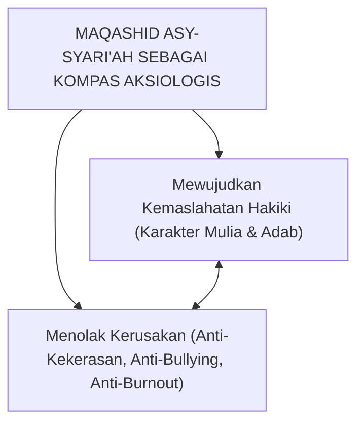

# SUB-BAB 7.1: DIMENSI AKSIOLOGIS & MAQASHID SYARI'AH
## *Landasan Nilai Transendental dan Penyelarasan Seluruh Kebijakan Pesantren dengan Tujuan Agung Syariat*

**Kode Modul**: `BOOK-01/BAB-07/SUB-01`  
**Kategori**: Aksiologi Pendidikan Islam  
**Fokus Keilmuan**: Maqashid asy-Syari'ah & Filsafat Nilai Islam

---

### 1. Aksiologi: Mengapa dan Untuk Apa Pesantren Mendidik?
Aksiologi adalah cabang filsafat yang membahas hakikat nilai, etika, dan tujuan akhir suatu tindakan. Dalam ekosistem TUMBUH, aksiologi pendidikan ditegakkan di atas **Maqashid asy-Syari'ah**—yaitu mewujudkan kemaslahatan (*jalb al-mashalih*) dan menolak kerusakan (*dar' al-mafasid*) bagi seluruh warga pondok di dunia dan akhirat.

---

### 2. Tolok Ukur Keselarasan Syar'i dalam Kebijakan Pesantren
Setiap aturan disiplin, tata tertib asrama, dan prosedur pembinaan di pesantren harus diuji dengan pertanyaan aksiologis: *Apakah aturan ini mendatangkan maslahat penjagaan fitrah santri, ataukah justru menimbulkan mafsadat berupa trauma psikologis dan dendam?* Jika suatu metode menimbulkan kerusakan fisik atau mental, maka metode tersebut batal secara syar'i.
