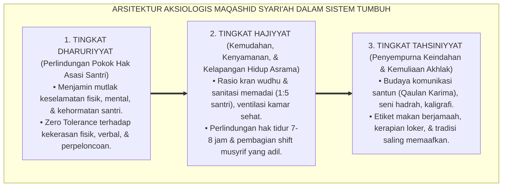
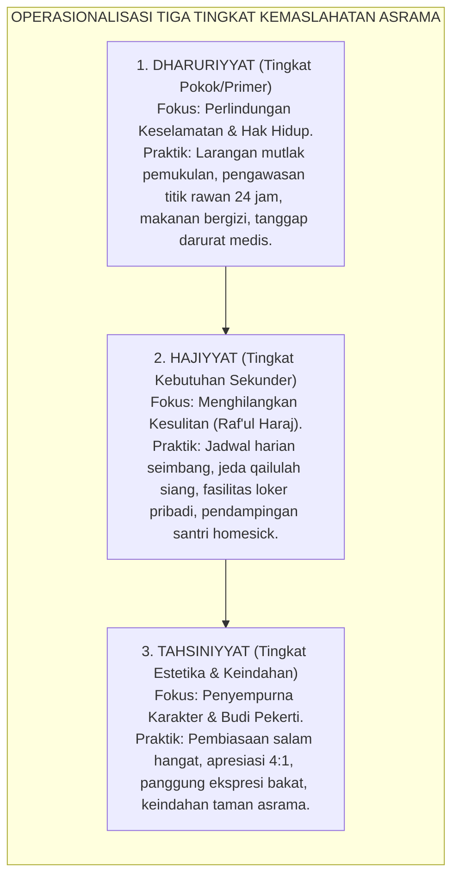

# DIMENSI AKSIOLOGIS & MAQASHID SYARI'AH PENGASUHAN

---
### Untuk Apa Seluruh Aturan Pesantren Ditegakkan?

Pernahkah kita berhenti sejenak di tengah hiruk-pikuk aktivitas pesantren dan mengajukan sebuah pertanyaan paling mendasar: *Untuk apa sebenarnya seluruh aturan pondok, jadwal asrama, bel disiplin, dan buku tata tertib ini dibuat?*

Apakah aturan diciptakan semata-mata agar asrama terlihat rapi dan senyap di mata tamu yang berkunjung? Apakah tata tertib dirancang agar pengurus memiliki wewenang untuk menertibkan adik kelasnya? Ataukah ada tujuan yang jauh lebih agung dan transendental di balik setiap butir pasal yang kita susun?

Dalam ranah filsafat ilmu, pertanyaan tentang nilai, tujuan, dan kemanfaatan ini disebut sebagai **Dimensi Aksiologis (*Axiology*)**. Aksiologi adalah kompas moral penentu arah: ia memastikan bahwa sarana teknis yang kita gunakan tidak melenceng dari tujuan hakiki penciptaannya.

Di dunia pesantren, banyak krisis pengasuhan terjadi justru ketika sebuah lembaga kehilangan pijakan aksiologisnya. Aturan tata tertib diperlakukan sebagai "benda keramat" yang kaku dan mekanis, sementara manusia yang menjalaninya—yaitu anak-anak santri—diperlakukan layaknya baut dan sekrup di dalam mesin pabrik. Tatkala ada santri yang tersandung, lembaga lebih sibuk menyelamatkan wibawa aturan ketimbang menyelamatkan jiwa anak.

Sistem **TUMBUH** menegaskan bahwa seluruh bangunan pengasuhan pesantren wajib bersandar pada tujuan tertinggi syariat Islam: **Maqashid asy-Syari'ah**.

<b>Gambar 7.1.1:</b> Tiga Tingkatan Piramida Aksiologis Maqashid Syari'ah dalam Pengasuhan Santri Ekosistem TUMBUH.

---

### Menghidupkan Kaidah Emas Imam Asy-Syathibi di Asrama

Ulama ushul fiqih terkemuka asal Granada, **Imam Abu Ishaq Asy-Syathibi**, dalam mahakaryanya *Al-Muwafaqat fi Ushul asy-Syari'ah*[^1] meletakkan satu kaidah universal yang menjadi pedoman utama peradaban Islam:

> [!NOTE]
> ### 📜 Kaidah Agung Maqashid Syari'ah Imam Asy-Syathibi:
> 
> $$\text{إِنَّ وَضْعَ الشَّرَائِعِ إِنَّمَا هُوَ لِمَصَالِحِ الْعِبَادِ فِي الْعَاجِلِ وَالْآجِلِ مَعًا، وَأَنَّ الشَّرِيعَةَ كُلَّهَا مَبْنِيَّةٌ عَلَى جَلْبِ الْمَصَالِحِ وَدَرْءِ الْمَفَاسِدِ}$$
> 
> **Artinya:**  
> *"Sesungguhnya pensyariatan seluruh hukum agama ini tiada lain bertujuan untuk mewujudkan **kemaslahatan sejati bagi seluruh hamba Allah di dunia maupun di akhirat kelak**; dan sesungguhnya seluruh bangunan syariat ditegakkan di atas prinsip **meraih kemaslahatan (*Jalbul Mashalih*) dan menolak segala bentuk kerusakan (*Dar'ul Mafasid*)**."*

Kaidah ini memberikan standar evaluasi yang sangat jernih bagi para pemangku kebijakan pesantren:
* Setiap kali kita merumuskan sebuah SOP asrama, tanyakanlah: *Apakah SOP ini mendatangkan kemaslahatan nyata bagi keselamatan jiwa dan perkembangan akal santri, ataukah justru memicu kerusakan mental dan rasa trauma?*
* Jika sebuah metode penegakan disiplin—seperti menjemur santri di terik matahari berjam-jam atau mencukur rambut secara separuh untuk mempermalukannya—terbukti memicu kebencian batin, rasa terhina, dan merusak harga diri anak, maka metode tersebut secara aksiologis **telah bertentangan secara diametral dengan Maqashid Syari'ah**!

Syariat Islam tidak pernah diturunkan untuk menyiksa manusia. Allah SWT berfirman:
$$\text{مَا يُرِيدُ اللَّهُ لِيَجْعَلَ عَلَيْكُم مِّنْ حَرَجٍ وَلَٰكِن يُرِيدُ لِيُطَهِّرَكُمْ وَلِيُتِمَّ نِعْمَتَهُ عَلَيْكُمْ لَعَلَّكُمْ تَشْكُرُونَ}$$
*"Allah tidak ingin menyulitkan kamu, tetapi Dia hendak membersihkan kamu dan menyempurnakan nikmat-Nya bagimu, agar kamu bersyukur."* (QS. Al-Ma'idah: 6).

---

### Tiga Tingkatan Kemaslahatan Pengasuhan dalam Sistem TUMBUH

Sistem TUMBUH mengoperasionalkan piramida Maqashid Syari'ah ke dalam tiga tingkatan kebijakan pengasuhan:

<b>Gambar 7.1.2:</b> Aliran Penerapan Tiga Tingkat Kemaslahatan Maqashid dalam Kebijakan Asrama TUMBUH.

#### 1. Kemaslahatan Dharuriyyat (Hak Asasi Mutlak yang Wajib Dilindungi)
Tingkat *Dharuriyyat* adalah garis merah yang tidak boleh dilanggar dalam situasi apa pun. Di ranah pengasuhan asrama, tingkat ini mencakup jaminan bahwa tubuh santri tidak boleh disakiti, akalnya tidak boleh dirusak oleh teror mental, dan martabat kehormatannya tidak boleh dinistakan. 

Jika sebuah pesantren mengklaim memiliki program tahfizh yang hebat namun membiarkan santrinya dipukuli oleh senior hingga patah tulang atau lebam di asrama, maka pesantren tersebut telah gagal total pada tingkat *Dharuriyyat*.

#### 2. Kemaslahatan Hajiyyat (Penghapusan Kesulitan Hidup Santri)
Tingkat *Hajiyyat* bertujuan untuk memudahkan santri dalam menjalani kehidupan belajar (*Raf'ul Haraj wa Daf'ul Masyaqqah*). Ketiadaan sarana pada tingkat ini memang tidak langsung mematikan santri, namun membuat hidup santri sangat menderita dan memicu timbulnya pelanggaran adab.

Contoh nyata: apabila asrama dihuni oleh 100 santri tetapi hanya memiliki 3 kran air wudhu, maka setiap subuh santri akan saling berebut, saling dorong, dan terlambat shalat berjamaah. Dalam Sistem TUMBUH, manajemen pesantren wajib menyediakan fasilitas sanitasi yang layak sebagai pemenuhan kebutuhan *Hajiyyat*, sehingga sumber ketegangan emosi antar-santri dapat dieliminasi sejak dini.

#### 3. Kemaslahatan Tahsiniyyat (Penyempurna Keindahan Budi Pekerti)
Tingkat *Tahsiniyyat* adalah mahkota keindahan peradaban pesantren. Pada tingkat ini, santri tidak hanya hidup tertib dan aman, melainkan dihiasi dengan keanggunan budi pekerti: tata krama bertutur kata yang menyejukkan hati (*Qaulan Karima*), seni merapikan sajadah, etiket makan berjamaah dengan tenang (*Adab al-Akl*), dan tradisi bersalaman dengan wajah berseri-seri.

---

### Menyelaraskan Aksiologi Pesantren dengan Hak-Hak Anak

Pakar Maqashid kontemporer **Prof. Dr. Jasser Auda**[^2] menegaskan bahwa pendekatan Maqashid modern harus bergeser dari sekadar *"hukum proteksi pasif"* (*protection-oriented*) menjadi *"sistem pengembangan potensi manusia"* (*human development-oriented*). Hal ini sejalan dengan pandangan **Prof. Syed Muhammad Naquib al-Attas**[^3] bahwa orientasi tertinggi pendidikan Islam adalah penanaman adab (*Ta'dib*) untuk membebaskan jiwa manusia dari belenggu kebodohan dan kezaliman.

Dalam konteks pesantren masa kini, menyelaraskan aksiologi Maqashid Syari'ah berarti memastikan bahwa hak-hak perkembangan anak—sebagaimana dilindungi oleh syariat Islam, standar PBIS modern[^4], dan hukum perlindungan anak nasional—berjalan beriringan tanpa kontradiksi:

| Hak Dasar Santri | Landasan Syariat Maqashid | Landasan Hukum & Sains Kontemporer | Praktik Nyata Ekosistem TUMBUH |
| :--- | :--- | :--- | :--- |
| **Hak atas Keselamatan Jiwa & Raga** | *Hifzhun Nafs* (QS. Al-Ma'idah: 32) | UU Perlindungan Anak No. 35/2014 & Standar WHO Anti-Violence | Penghapusan 100% hukuman fisik dan razia kekerasan malam di asrama. |
| **Hak atas Perkembangan Nalar Sehat** | *Hifzhul 'Aql* (QS. Al-Mulk: 10) | Neurosains Perkembangan Otak Remaja (*PFC Maturation*) | Jaminan tidur malam 7-8 jam dan pembelajaran dialogis interaktif. |
| **Hak atas Kehormatan & Martabat** | *Hifzhul 'Irdh* (QS. Al-Hujurat: 11-12) | Konvensi Hak Anak PBB (*CRC Articles 19 & 28*) | Larangan total *body shaming*, julukan pejoratif, dan perundungan. |
| **Hak atas Rasa Aman Kepemilikan** | *Hifzhul Mal* (QS. Al-Baqarah: 188) | Etika Hak Milik Pribadi & *Property Rights Protection* | Penyediaan loker berkunci dan pemberantasan tuntas tradisi *ghashab*. |

Ketika nilai-nilai aksiologis ini dipahami secara mendalam oleh seluruh dewan kiai, ustadz, musyrif, dan santri senior, maka asrama pesantren akan bertransformasi dari sekadar barak penginapan menjadi **oase peradaban yang memuliakan manusia**. 

Setiap teguran yang diberikan, setiap peraturan yang ditegakkan, dan setiap fasilitas yang dibangun selalu memancarkan satu aroma yang sama: kasih sayang murni demi mengantarkan hamba-hamba Allah meraih kemuliaan hidup di dunia dan keselamatan abadi di akhirat kelak.

---

## 📌 Catatan Kaki & Rujukan Primer

[^1]: **Al-Imam Abu Ishaq Ibrahim asy-Syathibi**, *Al-Muwafaqat fi Ushul asy-Syari'ah*, Tahqiq: Syaikh Masyhur Hasan Salman (Kairo: Dar Ibn Affan, 1997), Jilid II, hlm. 9–35.
[^2]: **Prof. Dr. Jasser Auda**, *Maqasid al-Shariah as Philosophy of Islamic Law: A Systems Approach* (London: The International Institute of Islamic Thought / IIIT, 2008), Bab 1: "Maqasid al-Shariah: A Systematic Overview", hlm. 1–45.
[^3]: **Prof. Dr. Syed Muhammad Naquib al-Attas**, *Aims and Objectives of Islamic Education* (Jeddah: King Abdulaziz University / Hodder and Stoughton, 1979), hlm. 1–32.
[^4]: **Robert H. Horner & George Sugai**, "School-wide positive behavioral interventions and supports: The research base on implementation with fidelity", *Exceptionality*, Vol. 23, No. 4 (2015), hlm. 197–212.

---

### IV. Eksplanasi Filosofis Lanjutan & Hermeneutika Nilai Dimensi Aksiologis & Maqashid Syari'Ah Pengasuhan

Penyelidikan mendalam terhadap tema **DIMENSI AKSIOLOGIS & MAQASHID SYARI'AH PENGASUHAN** menuntut pemahaman integral atas relasi antara *Ontologi Fitrah* dan *Sosiologi Pembelajaran Pesantren*. Ketika seorang santri memasuki ekosistem pendidikan, ia membawa amanah perjanjian primordial (*Mithaq*) yang menuntut ruang tumbuh yang aman dari distorsi psikologis.

1. **Dialektika Keikhlasan (*Shidq an-Niyyah*) vs Formalisme Perilaku**:
   Dalam pandangan *Hujjatul Islam* Al-Imam Al-Ghazali dalam *Ihya 'Ulumiddin*, pembentukan karakter yang sejati bermula dari pembersihan batin (*Thaharatul Batin*). Ketika sebuah institusi mereduksi adab menjadi kepatuhan semu di hadapan figur otoritas, yang sesungguhnya terjadi adalah pelemahan integritas diri (*Nifaq Tarbawi*). Sistem TUMBUH menegaskan bahwa kesalehan sejati harus lahir dari kemerdekaan batin yang disinari oleh cinta kepada Allah (*Mahabbatullah*) dan kesadaran pengawasan-Nya (*Muraqabatullah*).

2. **Dinamika Neuroplastisitas & Internalisasi Nilai Ruhiyyah**:
   Sains kognitif kontemporer membuktikan bahwa pembiasaan nilai yang disertai rasa takut ekstrem mengaktifkan poros *HPA (Hypothalamic-Pituitary-Adrenal)* dan membanjiri otak dengan hormon kortisol. Kondisi ini membekukan kemampuan *Prefrontal Cortex* untuk merefleksikan nilai secara mandiri. Sebaliknya, ketika nilai **DIMENSI AKSIOLOGIS & MAQASHID SYARI'AH PENGASUHAN** disampaikan dalam suasana pengasuhan yang hangat (*Warm Presence*), otak santri melepaskan *oksitosin* dan *dopamin* yang mempercepat konsolidasi sinaptik dan pembentukan memori jangka panjang (*Long-Term Potentiation*).

3. **Matriks Transformasi Praksis Pembinaan**:

| Dimensi Pengasuhan | Pola Lama (Mekanistis-Punitif) | Pola Rekonstruksi Ekosistem TUMBUH |
| :--- | :--- | :--- |
| **Sumber Motivasi** | Tekanan eksternal dan rasa takut akan sanksi fisik. | Kesadaran fitrah internal dan kerinduan pada rida ilahi. |
| **Relasi Musyrif-Santri** | Pengawasan hierarkis intimidatif (panoptikon). | Keteladanan hidup (*Qudwah Hasanah*) dan pendampingan empatik. |
| **Ketahanan Karakter** | Runtuh ketika pengawasan ditiadakan (liburan/lulus). | Melekat kokoh sebagai kompas moral seumur hidup (*Insan Adabi*). |

---

### V. Refleksi Pedagogis & Rekomendasi Aksi Lembaga

Penerapan prinsip **DIMENSI AKSIOLOGIS & MAQASHID SYARI'AH PENGASUHAN** di lingkungan pesantren menuntut komitmen kelembagaan yang terstruktur:
* **Audit Budaya Pengasuhan**: Pimpinan pesantren wajib melakukan refleksi berkala atas seluruh interaksi antara asatidz, musyrif, dan santri guna memastikan tidak ada celah bagi masuknya feodalisme atau kekerasan terselubung.
* **Penguatan Kapasitas Pendidik**: Setiap pembina asrama difasilitasi dengan pelatihan literasi psikologi perkembangan dan konseling Islam agar memiliki kematangan emosi dalam menghadapi dinamika santri.
* **Integrasi Ruhiyyah 24 Jam**: Memastikan bahwa setiap detik kehidupan santri di pondok—mulai dari bangun tidur, halaqah Qur'an, mudzakarah ilmu, hingga istirahat malam—selalu dinaungi oleh nilai keikhlasan dan ukhuwah yang tulus.
