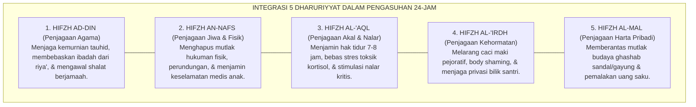
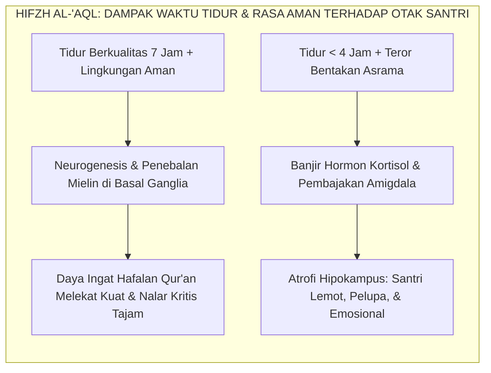

# PANDUAN PRAKTIS 7.2: INTEGRASI LIMA PRINSIP DHARURIYYAT PENGASUHAN

**Sasaran Pengguna**: Pimpinan Pondok, Kepala Pengasuhan, Wali Kelas, & Musyrif Asrama  
**Fokus Penerapan**: Panduan Kerja Lapangan & Pembiasaan Karakter Harian Sistem TUMBUH  

---

### 🎯 Tujuan & Manfaat Panduan
Panduan ini dirancang sebagai petunjuk operasional terapan agar pendidik dan musyrif dapat:
1. Menjalankan pembinaan adab santri dengan pendekatan kasih sayang (*Rahmah*) dan ketegasan yang mendidik (*Firm & Kind*).
2. Menghindari cara-cara kekerasan fisik, bentakan verbal, maupun hukuman yang mempermalukan santri.
3. Menciptakan suasana asrama dan kelas yang aman, tertib, dan menumbuhkan kesadaran diri (*Bi'ah Shalihah*).

---

### 💡 Intisari Cepat (3 Menit Memahami Esensi)
* **Kunci Pengasuhan**: Karakter santri tumbuh melalui keteladanan nyata (*Qudwah Hasanah*), komunikasi empatik, dan pembiasaan terstruktur 24 jam.
* **Tindakan Utama**: Terapkan panduan langkah demi langkah di bawah ini secara konsisten, pantau perkembangan santri secara objektif, dan berikan apresiasi atas setiap perbaikan diri yang mereka capai.
* **Prinsip Disiplin**: Fokus pada pemulihan hubungan dan tanggung jawab nyata (*Restoratif*), bukan sekadar melampiaskan amarah atau menghukum.

---

### 📖 Uraian Panduan & Langkah Aksi Lapangan

---

### Lima Benteng Utama Hak Asasi Santri

Di dalam khazanah hukum Islam (*Fiqh wa Ushulul Fiqh*), tidak ada konsep perlindungan hak asasi yang lebih komprehensif dan sakral selain **Panca Kebutuhan Primer (*Ad-Dharuriyyat al-Khamsah*)**[^1].

Para fuqaha sepakat bahwa tegak dan runtuhnya peradaban manusia ditentukan oleh sejauh mana lima hak dasar ini dijaga:
1. Penjagaan Agama (*Hifzh ad-Din*)
2. Penjagaan Jiwa dan Raga (*Hifzh an-Nafs*)
3. Penjagaan Akal dan Fungsi Kognitif (*Hifzh al-'Aql*)
4. Penjagaan Kehormatan dan Martabat Keturunan (*Hifzh al-'Irdh wan-Nasl*)
5. Penjagaan Harta dan Hak Milik Pribadi (*Hifzh al-Mal*)

Di lingkungan pondok pesantren, kelima prinsip dharuriyyat ini kerap kali hanya dipelajari sebagai materi hafalan teoritis dalam kitab ushul fiqih seperti *Al-Mustashfa* karya Al-Ghazali[^1] atau *Ushul al-Fiqh al-Islami* karya Wahbah az-Zuhaili[^2]. Para santri hafal matang definisinya di lembar ujian, namun ketika melangkah ke bilik asrama, kelima hak dasar tersebut justru terabaikan dalam tata kelola keseharian.

Sistem **TUMBUH** melakukan kontekstualisasi dan integrasi penuh dari kelima prinsip ini menjadi **Konstitusi Operasional Pengasuhan Asrama 24-Jam**:

<b>Gambar 7.2.1:</b> Peta Integrasi Lima Prinsip Dharuriyyat Khamsah dalam Ekosistem Asrama 24-Jam TUMBUH.

---

### Bedah Operasional Panca Perlindungan dalam Keseharian Santri

Mari kita bedah bagaimana masing-masing dari lima prinsip dharuriyyat ini diwujudkan secara konkret dalam kehidupan asrama ekosistem pesantren berbasis TUMBUH:

#### 1. Hifzh ad-Din (Perlindungan Aqidah & Kemurnian Ibadah)
Tujuan tertinggi pesantren adalah menjaga keselamatan aqidah santri. Namun, banyak lembaga keliru menerapkan strategi penegakannya:
* **Kekeliruan Lama**: Menghitung ibadah shalat dan tilawah dengan sistem poin hukuman fisik atau imbalan materiil, yang secara tidak sadar justru mendidik santri menjadi munafik (beribadah hanya ketika dilihat musyrif).
* **Solusi Sistem TUMBUH**: Membangun kesadaran *Muraqabatullah* melalui **Tazkiyatun Niyyah** dan **Apresiasi Relasional 4:1**. Musyrif hadir shalat berjamaah bersama santri di shaf depan, mendampingi dzikir dengan khusyuk, dan membangun dialog batin yang menyentuh kalbu santri tentang nikmatnya bermunajat kepada Allah.

#### 2. Hifzh an-Nafs (Perlindungan Mutlak atas Jiwa & Raga Santri)
Rasulullah SAW bersabda dalam khutbah Haji Wada' yang monumental:
$$\text{إِنَّ دِمَاءَكُمْ وَأَمْوَالَكُمْ وَأَعْرَاضَكُمْ عَلَيْكُمْ حَرَامٌ، كَحُرْمَةِ يَوْمِكُمْ هَٰذَا، فِي شَهْرِكُمْ هَٰذَا، فِي بَلَدِكُمْ هَٰذَا}$$
*"Sesungguhnya darahmu, hartamu, dan kehormatanmu adalah haram (suci dan terlarang dinistakan) bagi sesamamu, sebagaimana sucinya harimu ini, di bulanmu ini, di negerimu ini!"* (HR. Al-Bukhari no. 1741 dan Muslim no. 1679).

Dalam Sistem TUMBUH, *Hifzh an-Nafs* diterjemahkan menjadi:
* **Penghapusan Total Hukuman Fisik**: Rotan, tamparan, tendangan, atau sanksi fisik apa pun dilarang 100% tanpa pengecualian.
* **Protokol Tanggap Darurat Medis (*Medical Safety Protocol*)**: Asrama dilengkapi pos kesehatan pesantren (Poskestren) yang aktif 24 jam dan SOP rujukan cepat ke rumah sakit jika santri mengalami demam tinggi atau cedera fisik.
* **Standar Nutrisi Seimbang**: Menu makan santri diawasi ketat oleh ahli gizi untuk memastikan kebutuhan protein, vitamin, dan higienitas makanan terpenuhi.

#### 3. Hifzh al-'Aql (Perlindungan Kapasitas Akal & Kesehatan Saraf Otak)
Akal adalah instrumen utama santri dalam memahami wahyu dan menghafal Al-Qur'an. Menjaga akal tidak hanya berarti melarang konsumsi zat terlarang (khamr dan narkoba), melainkan juga **menjaga kesehatan neurobiologis otak santri dari kerusakan kognitif**:
* **Jaminan Waktu Tidur Sirkadian**: Riset neurosains tidur oleh Dr. Matthew Walker[^3] membuktikan tidur lelap sangat vital bagi konsolidasi memori. Sistem TUMBUH mewajibkan lampu asrama dipadamkan pada pukul 22.00 WIB dan santri baru dibangunkan pada pukul 03.45 WIB, memastikan santri memperoleh minimal 6–7 jam tidur malam lelap (*REM Sleep*).
* **Bebas dari Stres Toksik Kortisol**: Riset psikiatri anak oleh Dr. Bruce D. Perry[^4] membuktikan suasana asrama yang ramah dan suportif menjaga otak santri berada dalam gelombang alfa yang tenang, mencegah terjadinya atrofi sel neuron hipokampus akibat stres berkepanjangan.

<b>Gambar 7.2.2:</b> Relevansi Medis-Biologis Prinsip Hifzh al-'Aql dalam Regulasi Waktu Istirahat Santri.

#### 4. Hifzh al-'Irdh (Perlindungan Kehormatan, Privasi, & Martabat Diri)
Kehormatan seorang mukmin memiliki kedudukan yang sangat tinggi di sisi Allah. Sistem TUMBUH menjaga kehormatan santri melalui:
* **Penegakan Kebijakan Anti-Perundungan (*Zero Bullying Policy*)**: Melarang keras segala bentuk ejekan fisik, celaan nama orang tua, atau julukan binatang antar-santri.
* **Penjagaan Batasan Aurat & Privasi Bilik**: Kamar asrama dan area mandi dirancang dengan partisi tertutup yang menjaga aurat santri dari pandangan orang lain saat berganti pakaian.
* **Kerahasiaan Rekam Jejak Konseling (*Counseling Confidentiality*)**: Catatan konseling BK dan proses pemulihan pelanggaran santri dijaga kerahasiaannya secara ketat, tidak boleh diumumkan di mimbar masjid atau dijadikan bahan gosip antar-pengurus.

#### 5. Hifzh al-Mal (Perlindungan Harta & Pemberantasan Budaya Ghashab)
Penyakit sosial yang paling lazim namun kerap disepelekan di pesantren tradisional adalah **Ghashab** (memakai sandal, baju, gayung, atau sajadah orang lain tanpa izin). Sikap menyepelekan ghashab adalah pintu masuk runtuhnya integritas moral santri.

Sistem TUMBUH memberantas ghashab melalui pendekatan sistemik:
* **Penyediaan Loker Pribadi Berkunci**: Setiap santri memiliki lemari loker pribadi untuk menyimpan barang-barang berharga dan pakaian pribadinya.
* **Standardisasi Fasilitas Asrama**: Asrama menyediakan fasilitas bersama (seperti gayung mandi, ember cuci, dan sapu) dalam jumlah yang berlimpah, sehingga santri tidak memiliki alasan untuk meminjam barang kawan tanpa izin.
* **Edukasi Kepemilikan yang Beradab**: Mengajarkan fiqih kepemilikan harta (*Fiqh al-Milkiyyah*) dan membiasakan santri untuk selalu meminta izin (*Isti'dzan*) sebelum meminjam barang milik sesama warga asrama.

---

### Dharuriyyat Khamsah sebagai Piagam Keselamatan Santri

Ketika lima pilar *Dharuriyyat* ini ditegakkan secara utuh, pesantren membuktikan dirinya sebagai institusi yang paling terdepan dalam memuliakan hak-hak kemanusiaan.

Santri tidak lagi merasa terancam saat berada di pondok. Mereka merasa bahwa agama mereka dibimbing, tubuh mereka dilindungi, akal mereka dicerdaskan, kehormatan mereka dijaga, dan hak milik mereka dihormati. Inilah lingkungan ideal yang melahirkan generasi muttaqin yang siap memimpin peradaban umat dengan keteladanan akhlak nabawi.

---

## 📌 Catatan Kaki & Rujukan Primer

[^1]: **Hujjatul Islam Imam Abu Hamid al-Ghazali**, *Al-Mustashfa min 'Ilmil Ushul*, Tahqiq: Dr. Muhammad Sulaiman al-Asyqar (Beirut: Mu'assasah ar-Risalah, 1997), Jilid I, hlm. 416–420.
[^2]: **Wahbah az-Zuhaili**, *Ushul al-Fiqh al-Islami* (Damaskus: Dar al-Fikr, 1986), Jilid II: "Al-Maqashid asy-Syar'iyyah", hlm. 1017–1045.
[^3]: **Matthew Walker**, *Why We Sleep: Unlocking the Power of Sleep and Dreams* (New York: Scribner / Simon & Schuster, 2017), Bab 6: "Sleep, Memory, and Brain Plasticity", hlm. 107–132.
[^4]: **Bruce D. Perry & Maia Szalavitz**, *The Boy Who Was Raised as a Dog: And Other Stories from a Child Psychiatrist's Notebook* (New York: Basic Books, 2006; edisi revisi 2017), hlm. 45–80.
