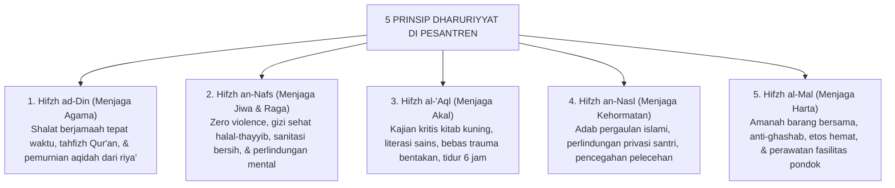

# SUB-BAB 7.2: INTEGRASI LIMA PRINSIP DHARURIYYAT PENGASUHAN
## *Operasionalisasi Al-Kulliyyat al-Khams dalam Tata Kelola Asrama dan Hubungan Antar-Santri 24-Jam*

**Kode Modul**: `BOOK-01/BAB-07/SUB-02`  
**Kategori**: Maqashid Terapan  
**Fokus Keilmuan**: Ushul Fiqh Terapan & Manajemen Asrama Islam

---

### 1. Lima Perlindungan Primer (*Al-Kulliyyat al-Khams*) di Pesantren
Ekosistem TUMBUH menerjemahkan lima pilar perlindungan primer syariat ke dalam praktik pengasuhan harian:

---

### 2. Harmonisasi Antarpilar
Tidak boleh ada satu pilar dharuriyyat yang dikorbankan demi pilar lainnya. Menegakkan *Hifzh ad-Din* (misal: menyuruh santri shalat tahajud) tidak boleh melanggar *Hifzh an-Nafs* (misal: memukul santri hingga memar). Seluruh pilar harus terjaga secara utuh dan harmonis.
