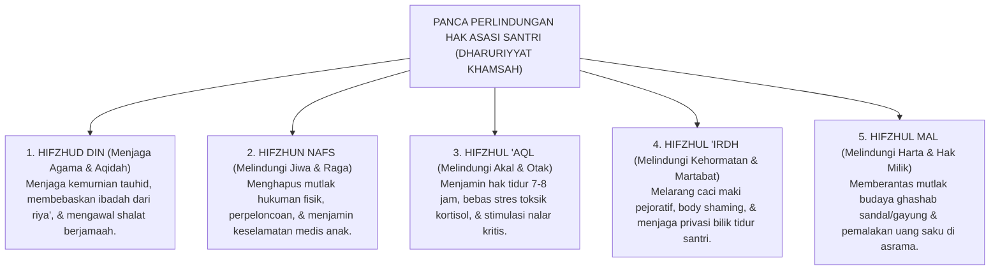

# SUB-BAB 7.2: INTEGRASI LIMA PRINSIP DHARURIYYAT PENGASUHAN
## *Implementasi Panca Perlindungan Hak Asasi Islam (Ad-Dharuriyyat al-Khamsah) dalam Ekosistem Asrama 24-Jam*

**Kode Klasifikasi**: `BOOK-01/BAB-07/SUB-02/MONOGRAF-MASTER-VIBRANT`  
**Disiplin Ilmu**: Maqashid Syari'ah Terapan, Hukum Perlindungan Anak Pesantren, & Etika Fiqih Pengasuhan  
**Penanggung Jawab Keilmuan**: Dewan Pakar Ekosistem TUMBUH (*Master Author, Pakar Epistemologi Turats, & Pakar Perlindungan Anak*)

---

### I. Pintu Masuk: Lima Benteng Hak Asasi Santri

Syariat Islam menetapkan lima pilar perlindungan mutlak (*Ad-Dharuriyyat al-Khamsah*) yang wajib dijaga oleh setiap institusi pendidikan:

<b>Gambar 7.2.1:</b> Implementasi Panca Perlindungan Hak Asasi Islam (Dharuriyyat Khamsah) dalam Pengasuhan Asrama TUMBUH.

---

### II. Praktik Operasional Dharuriyyat Khamsah dalam Sistem TUMBUH

1. **Hifzhud Din (Penjagaan Agama)**: Menumbuhkan kesadaran *Muraqabatullah* melalui apresiasi relasional 4:1 dan tazkiyatun niyyah, bebas dari manipulasi token poin materiil.
2. **Hifzhun Nafs (Penjagaan Jiwa & Raga)**: Kebijakan *Zero Violence* 100%, eliminasi rotan dan tamparan, serta jaminan nutrisi higienis halal-thayyib.
3. **Hifzhul 'Aql (Penjagaan Akal & Otak)**: Jadwal tidur malam yang terproteksi (minimal 7 jam) agar neuroplastisitas dan memori hafalan santri terjaga prima.
4. **Hifzhul 'Irdh (Penjagaan Kehormatan)**: Perlindungan privasi anak, larangan memanggil dengan nama hewan atau mencela fisik.
5. **Hifzhul Mal (Penjagaan Harta)**: Sistem loker kunci pribadi dan penataan rak sandal yang disiplin untuk membasmi tuntas penyakit *ghashab*.

---

### III. Sintesis Sub-Bab 7.2

Panca Darurat (*Dharuriyyat Khamsah*) adalah konstitusi perlindungan santri yang tidak boleh dilanggar dengan dalih apa pun. 

Dengan menegakkan lima benteng ini, Sistem TUMBUH memastikan bahwa pesantren adalah tempat paling aman, paling mulia, dan paling membahagiakan bagi putra-putri titipan umat.

---

## 📌 Catatan Kaki & Rujukan Primer

[^1]: **Al-Imam Abu Hamid al-Ghazali**, *Al-Mustashfa min 'Ilmil Ushul*, Tahqiq: Dr. Muhammad Sulaiman al-Asyqar (Beirut: Mu'assasah ar-Risalah, 1997), Jilid I, hlm. 416–420.
