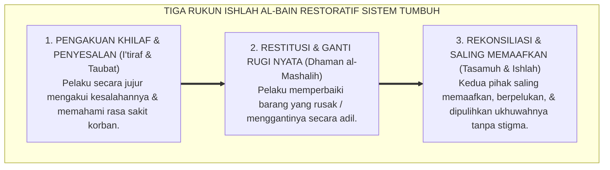

# SUB-BAB 7.3: KEADILAN RESTORATIF ISLAM & ISHLAH AL-BAIN
## *Konsep Keadilan Pemulihan dalam Turats Fiqih, Rekonsiliasi Ukhuwah, dan Mekanisme Lingkaran Restoratif Asrama*

**Kode Klasifikasi**: `BOOK-01/BAB-07/SUB-03/MONOGRAF-MASTER-VIBRANT`  
**Disiplin Ilmu**: Fiqih Jinayah Terapan, Teori Keadilan Restoratif (*Restorative Justice*), & Manajemen Konflik Perdamaian  
**Penanggung Jawab Keilmuan**: Dewan Pakar Ekosistem TUMBUH (*Master Author, Pakar Kuratif Restoratif, & Pakar Epistemologi Turats*)

---

### I. Pintu Masuk: Memilih Antara Balas Dendam atau Pemulihan Hubungan

Ketika seorang santri merusak barang milik kawannya atau terlibat perselisihan fisik, sistem peradilan usang biasanya merespons dengan pendekatan **Keadilan Retributif (Hukuman Balas Dendam)**:
* Si pelaku dipukul, dibotaki kepalanya di depan umum, atau dijemur di lapangan terik matahari.

Apa hasil akhir dari hukuman balas dendam tersebut? 
Pelaku merasa dipermalukan dan menyimpan dendam, korban tidak mendapatkan ganti rugi atas barangnya yang rusak, dan hubungan persaudaraan di antara keduanya hancur total!

Sistem **TUMBUH** mengganti pendekatan retributif ini dengan **Keadilan Restoratif Islam (*Islamic Restorative Justice*)** yang berakar pada perintah Allah SWT tentang **Ishlah al-Bain (Mendamaikan Persaudaraan)**:

> [!NOTE]
> ### 📜 Firman Allah SWT tentang Rekonsiliasi Ishlah al-Bain:
> 
> $$\text{إِنَّمَا الْمُؤْمِنُونَ إِخْوَةٌ فَأَصْلِحُوا بَيْنَ أَخَوَيْكُمْ ۚ وَاتَّقُوا اللَّهَ لَعَلَّكُمْ تُرْحَمُونَ}$$
> 
> **Artinya:**  
> *"Sesungguhnya orang-orang mukmin itu bersaudara, maka **damaikanlah antara kedua saudaramu yang berselisih (*fa ashlihu bayna akhawaykum*)** dan bertakwalah kepada Allah agar kamu mendapat rahmat."*  
> *(QS. Al-Hujurat: 10)*

<b>Gambar 7.3.1:</b> Tiga Rukun Ishlah al-Bain dan Keadilan Restoratif Ekosistem TUMBUH.

---

### II. Tiga Rukun Pemulihan dalam Fiqih Restoratif TUMBUH

1. **I'tiraf (Pengakuan Khilaf Tanpa Paksaan)**: Musyrif memandu santri merenungkan dampak tindakannya terhadap kawan sekamar.
2. **Dhaman (Restitusi Nyata)**: Santri yang merusak lemari temannya bertanggung jawab memperbaikinya; santri yang mengotori kasur temannya bertugas mencucinya. Ini mengajarkan tanggung jawab nyata atas perbuatan sendiri.
3. **Ishlah (Pemulihan Hubungan Total)**: Mengakhiri konflik dengan jabat tangan ukhuwah dan memastikan pelaku tidak diberi label buruk (*no stigmatization*) oleh warga asrama lainnya.

---

### Sintesis Restoratif Sub-Bab 7.3

Keadilan sejati dalam Islam bukanlah membalas luka dengan luka, melainkan memulihkan hubungan persaudaraan dan membimbing jiwa kembali kepada jalan fitrah.

Dengan menegakkan mekanisme *Ishlah al-Bain*, Sistem TUMBUH menjadikan setiap konflik asrama sebagai ruang pembelajaran kedewasaan dan penyucian kalbu bagi seluruh santri.

---

## 📌 Catatan Kaki & Rujukan Primer

[^1]: **Howard Zehr**, *The Little Book of Restorative Justice* (Intercourse: Good Books, 2002), hlm. 15–40.
[^2]: **Wahbah az-Zuhaili**, *Al-Fiqh al-Islami wa Adillatuhu* (Damaskus: Dar al-Fikr, 1985), Jilid VI: "Al-Jinayat wal 'Uqubat", hlm. 55–80.
