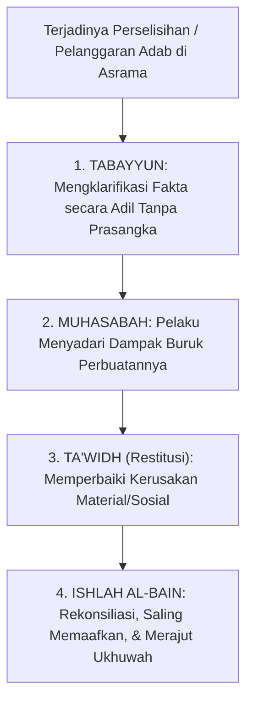

# SUB-BAB 7.3: KEADILAN RESTORATIF ISLAM & ISHLAH AL-BAIN
## *Konsep Ta'widh, Tabayyun, dan Rekonsiliasi Nirkekerasan Menurut Fiqh Jinayah dan Ukhuwah Islamiyyah*

**Kode Modul**: `BOOK-01/BAB-07/SUB-03`  
**Kategori**: Fiqh Resolusi Konflik  
**Fokus Keilmuan**: Fiqh Peradilan Islam & Restorative Justice

---

### 1. Landasan Syar'i Rekonsiliasi (Ishlah al-Bain)
Allah SWT berfirman:
$$\text{إِنَّمَا الْمُؤْمِنُونَ إِخْوَةٌ فَأَصْلِحُوا بَيْنَ أَخَوَيْكُمْ وَاتَّقُوا اللَّهَ لَعَلَّكُمْ تُرْحَمُونَ}$$
*"Sesungguhnya orang-orang mukmin itu bersaudara, karena itu damaikanlah antara kedua saudaramu dan bertakwalah kepada Allah supaya kamu mendapat rahmat."* (QS. Al-Hujurat: 10).

Islam tidak menganjurkan penghakiman publik yang mempermalukan pelanggar (*fadhahah*), melainkan memerintahkan perbaikan hubungan yang rusak (*Ishlah al-Bain*).

---

### 2. Tiga Elemen Restorasi Hakiki
1. **Pemberdayaan Korban**: Korban didengarkan perasaannya dan dipulihkan rasa amannya.
2. **Akuntabilitas Pelaku**: Pelaku bertanggung jawab secara aktif memperbaiki kesalahannya (*restitusi logis*), bukan sekadar pasif menerima hukuman fisik.
3. **Penyembuhan Komunitas**: Warga kamar/asrama menyambut kembali santri tanpa memberi label stigma buruk permanen.
