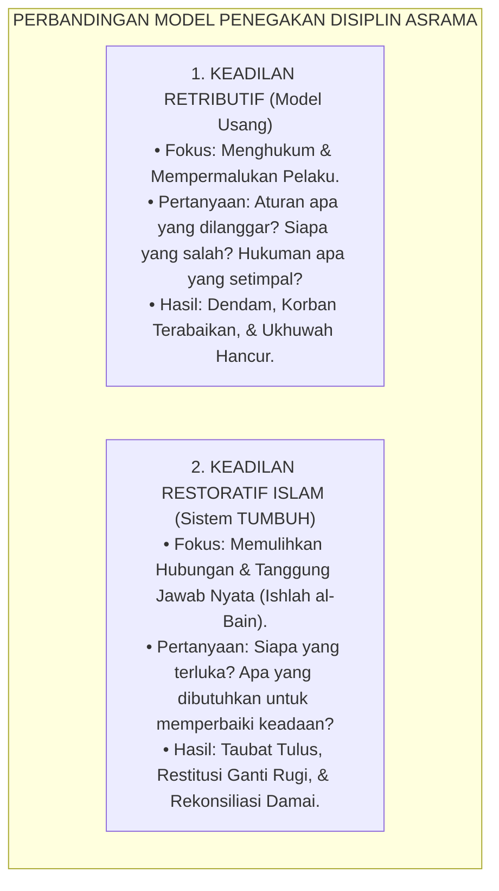
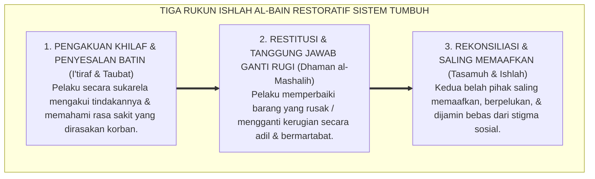
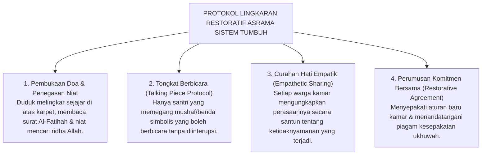

# PANDUAN OPERASIONAL 7.3: KEADILAN RESTORATIF ISLAM & ISHLAH AL-BAIN

---

### 🧭 PETA POSISI PANDUAN DALAM SISTEM TUMBUH (DARI HULU KE HILIR)
* **Posisi Arsitektur**: `HULU EKOSISTEM (Akar Filosofis, Fitrah al-Munazzalah, & Worldview Islam)`
* **Peruntukan Pengguna**: Pimpinan Pesantren, Pengasuh Pondok, Kepala Madrasah, & Dewan Asatidz
* **Fokus Panduan**: Membangun cara pandang pengasuhan berbasis fitrah kesucian dan keteladanan nyata (Qudwah Hasanah), mengeliminasi tradisi kekerasan fisik dan feodalisme asrama.
* **Hasil Akhir yang Dituju**: Terwujudnya santri berkarakter *Insan Adabi* yang mandiri, musyrif yang mengasuh dengan kasih sayang tanpa *burnout*, dan pesantren yang aman berbasis data (*Safe Boarding School*).

---

### 🎯 Mengapa Panduan Ini Ada & Masalah Nyata yang Dipecahkan
1. **Latar Masalah di Lapangan**: Sering kali pengasuhan di pesantren berjalan tanpa SOP yang jelas atau terjebak dalam pola reaktif—menunggu santri berbuat salah baru dihukum dengan emosional.
2. **Solusi Sistem TUMBUH**: Panduan ini memberikan langkah preventif dan terstruktur agar setiap pembiasaan adab berjalan terencana, konsisten, dan terukur.
3. **Sasaran Perubahan**: Memastikan nilai-nilai Islam menyatu dalam perilaku harian santri melalui keteladanan nyata (*Qudwah Hasanah*).

---

---

### 🎯 Tujuan & Manfaat Panduan
Panduan ini dirancang sebagai petunjuk operasional terapan agar pendidik dan musyrif dapat:
1. Menjalankan pembinaan adab santri dengan pendekatan kasih sayang (*Rahmah*) dan ketegasan yang mendidik (*Firm & Kind*).
2. Menghindari cara-cara kekerasan fisik, bentakan verbal, maupun hukuman yang mempermalukan santri.
3. Menciptakan suasana asrama dan kelas yang aman, tertib, dan menumbuhkan kesadaran diri (*Bi'ah Shalihah*).

---

### 💡 Intisari Cepat (3 Menit Memahami Esensi)
* **Kunci Pengasuhan**: Karakter santri tumbuh melalui keteladanan nyata (*Qudwah Hasanah*), komunikasi empatik, dan pembiasaan terstruktur 24 jam.
* **Tindakan Utama**: Terapkan panduan langkah demi langkah di bawah ini secara konsisten, pantau perkembangan santri secara objektif, dan berikan apresiasi atas setiap perbaikan diri yang mereka capai.
* **Prinsip Disiplin**: Fokus pada pemulihan hubungan dan tanggung jawab nyata (*Restoratif*), bukan sekadar melampiaskan amarah atau menghukum.

---

### 📖 Uraian Panduan & Langkah Aksi Lapangan

---

### Memilih Antara Balas Dendam atau Pemulihan Hubungan

Tatkala seorang santri merusak lemari pakaian kawannya atau terlibat perselisihan fisik di lapangan asrama, respon spontan yang selama ini berlaku di banyak pesantren tradisional adalah menerapkan pendekatan **Keadilan Retributif (Hukuman Balas Dendam)**[^1].

Dalam model retributif, fokus perhatian hanya tertuju pada satu hal: *Bagaimana cara menghukum si pelaku seberat-beratnya agar ia kapok?*
* Si pelaku dipanggil ke kantor pengurus, dibentak di depan umum, dicukur botak kepalanya, disuruh push-up ratusan kali, atau dijemur di terik matahari.

Namun, mari kita bedah secara jujur: **apa dampak psikologis dan sosial dari hukuman balas dendam tersebut?**
1. **Bagi Pelaku**: Anak merasa dipermalukan dan harga dirinya diinjak-injak. Bukannya bertobat dengan tulus, di dalam hatinya justru membara api dendam kepada temannya yang melaporkan dan kepada pengurus yang menghukumnya.
2. **Bagi Korban**: Lemari bajunya yang rusak tetap rusak tanpa ada ganti rugi, rasa takutnya tidak terobati, dan ia cemas akan diserang balik oleh pelaku.
3. **Bagi Komunitas Asrama**: Suasana kamar menjadi dingin, tegang, dan terpecah menjadi kubu-kubu permusuhan yang saling intai.

<b>Gambar 7.3.1:</b> Komparasi Paradigma Keadilan Retributif vs Keadilan Restoratif Islam dalam Ekosistem TUMBUH.

Sistem **TUMBUH** mengganti pendekatan retributif yang destruktif ini dengan **Keadilan Restoratif Islam (*Islamic Restorative Justice*)** yang bersumber langsung dari perintah Allah SWT tentang **Ishlah al-Bain (Mendamaikan Persaudaraan)**:

> [!NOTE]
> ### 📜 Perintah Allah SWT tentang Rekonsiliasi Ishlah al-Bain:
> 
> $$\text{وَإِن طَائِفَتَانِ مِنَ الْمُؤْمِنِينَ اقْتَتَلُوا فَأَصْلِحُوا بَيْنَهُمَا ۖ ... إِنَّمَا الْمُؤْمِنُونَ إِخْوَةٌ فَأَصْلِحُوا بَيْنَ أَخَوَيْكُمْ ۚ وَاتَّقُوا اللَّهَ لَعَلَّكُمْ تُرْحَمُونَ}$$
> 
> **Artinya:**  
> *"Dan apabila ada dua golongan dari orang-orang mukmin berperang/berselisih, maka **damaikanlah antara keduanya (*fa ashlihu baynahuma*)**... Sesungguhnya orang-orang mukmin itu bersaudara, karena itu **damaikanlah antara kedua saudaramu yang berselisih (*fa ashlihu bayna akhawaykum*)** dan bertakwalah kepada Allah agar kamu mendapat rahmat."*  
> *(QS. Al-Hujurat: 9–10)*

---

### Tiga Rukun Pemulihan dalam Fiqih Restoratif TUMBUH

Dalam khazanah hukum Islam, penyelesaian perselisihan tidak berhenti pada vonis hakim, melainkan mengedepankan mekanisme *Sulh* (perdamaian), *Afw* (pemberian maaf), dan *Dhaman* (ganti rugi perdata)[^2].

Sistem TUMBUH merumuskan **Tiga Rukun Ishlah al-Bain Restoratif**:

<b>Gambar 7.3.2:</b> Alur Tiga Rukun Pemulihan Ishlah al-Bain Ekosistem TUMBUH.

#### 1. I'tiraf wa Taubat (Pengakuan Khilaf & Penyadaran Empatik)
Musyrif memanggil pelaku ke dalam ruang mediasi yang tenang. Pertanyaan yang diajukan bukanlah interogasi membentak (*"Kenapa kamu nakal?!"*), melainkan pertanyaan reflektif:
* *"Apa yang sebenarnya terjadi tadi di lapangan?"*
* *"Saat antum menendang pintu lemari kawan, menurut antum apa yang dirasakan oleh kawan antum saat itu?"*
* *"Bagaimana perasaan antum sekarang setelah melihat lemarinya rusak?"*

Dialog ini membimbing santri menyadari dampak dari tindakannya secara sadar, membangkitkan suara hati nurani (*Nafs Lawwamah*), dan mendorongnya meminta maaf secara tulus tanpa keterpaksaan.

#### 2. Dhaman al-Mashalih (Restitusi Nyata & Konsekuensi Logis)
Dalam fiqih Islam, merusak milik orang lain menimbulkan kewajiban ganti rugi (*Dhaman al-Itlaf*). 

Dalam Sistem TUMBUH, pelaku tidak dihukum lari keliling lapangan—karena lari keliling lapangan sama sekali tidak memperbaiki lemari yang rusak! Sebagai gantinya, pelaku diajak merumuskan **Aksi Restitusi Nyata**:
* Bersama musyrif, pelaku belajar memperbaiki engsel pintu lemari yang rusak hingga kembali rapi.
* Jika ada barang yang pecah, pelaku menyisihkan uang sakunya secara halal atau membantu mencuci pakaian kawan yang dirugikan sebagai bentuk kompensasi tenaga yang disepakati bersama.

#### 3. Tasamuh wa Ishlah (Rekonsiliasi Ukhuwah & Integrasi Tanpa Stigma)
Proses mediasi ditutup dengan musyawarah lingkaran asrama (*Restorative Circle*):
* Korban menyampaikan bahwa ia telah memaafkan pelaku dengan lapang dada lillahi ta'ala.
* Kedua santri saling berjabat tangan dan berpelukan di depan musyrif.
* Musyrif menegaskan di hadapan seluruh kawan sekamar: *"Masalah ini telah selesai secara ksatria dan tuntas. Mulai hari ini, tidak ada yang boleh mengungkit-ungkit kesalahan ini lagi atau memberi label buruk kepada Fulan."*

---

### Protokol Lingkaran Restoratif Asrama (*Dormitory Restorative Circle*)

Ketika terjadi konflik yang melibatkan dinamika satu bilik kamar, musyrif menyelenggarakan **Lingkaran Restoratif Asrama**:

<b>Gambar 7.3.3:</b> Empat Tahap Protokol Lingkaran Restoratif Asrama Ekosistem TUMBUH.

Melalui Lingkaran Restoratif ini, santri belajar keterampilan hidup yang teramat berharga: bagaimana mengelola konflik secara dewasa, bagaimana mendengarkan perasaan orang lain, bagaimana berani mengakui kesalahan, dan bagaimana memaafkan dengan tulus.

Pesantren bertransformasi menjadi laboratorium perdamaian yang hidup, membuktikan bahwa hukum Islam adalah hukum yang membawa rahmat, pemulihan, dan keindahan ukhuwah bagi seluruh alam.

---

## 📌 Catatan Kaki & Rujukan Primer

[^1]: **Howard Zehr**, *The Little Book of Restorative Justice* (Intercourse: Good Books, 2002), hlm. 15–48.
[^2]: **Wahbah az-Zuhaili**, *Al-Fiqh al-Islami wa Adillatuhu* (Damaskus: Dar al-Fikr, 1985), Jilid VI: "Al-Jinayat wal Dhamanat", hlm. 55–90.
