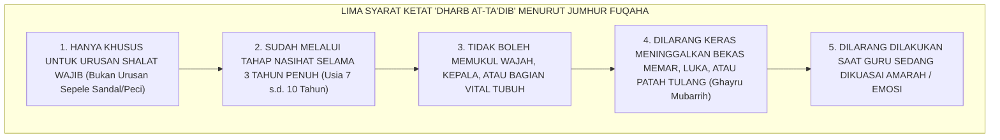

# SUB-BAB 7.4: ELIMINASI HUKUMAN FISIK SECARA FIQHIYYAH
## *Hermeneutika Hadits Pendidikan, Kaidah Fiqih Sadd adz-Dzari'ah, dan Pengharaman Mutlak Kekerasan di Lingkungan Pengasuhan*

**Kode Klasifikasi**: `BOOK-01/BAB-07/SUB-04/MONOGRAF-MASTER-VIBRANT`  
**Disiplin Ilmu**: Fiqih Pendidikan (*Fiqh at-Tarbiyah*), Ushul Fiqih (*Kaidah Sadd adz-Dzari'ah*), & Hadits Tarbawi  
**Penanggung Jawab Keilmuan**: Dewan Pakar Ekosistem TUMBUH (*Master Author, Pakar Epistemologi Turats, & Pakar Perlindungan Anak*)

---

### I. Pintu Masuk: Meluruskan Pemahaman atas Hadits Pemukulan Anak

Sebagian pengasuh dan santri senior kerap mencari dalil pembenaran atas tindakan kekerasan fisik dengan mengutip hadits masyhur:

$$\text{مُرُوا أَوْلَادَكُمْ بِالصَّلَاةِ وَهُمْ أَبْنَاءُ سَبْعِ سِنِينَ، وَاضْرِبُوهُمْ عَلَيْهَا وَهُمْ أَبْنَاءُ عَشْرٍ، وَفَرِّقُوا بَيْنَهُمْ فِي الْمَضَاجِعِ}$$
*"Perintahkanlah anak-anakmu shalat saat mereka berusia 7 tahun, dan **pukullah mereka karena meninggalkannya saat berusia 10 tahun**, serta pisahkanlah tempat tidur di antara mereka."* (HR. Abu Dawud no. 495 dan Ahmad no. 6689).

Kerap kali hadits ini dipotong dan dipahami secara serampangan untuk melegalkan tamparan, cambukan rotan, tendangan, atau perpeloncoan malam di asrama.

Mari kita bedah secara ilmiyyah: **apa sebenarnya makna fiqih dan syarat-syarat syar'i dari hadits tersebut menurut Jumhur Ulama Fiqih Klasik?**

<b>Gambar 7.4.1:</b> Lima Syarat Ketat 'Dharb at-Ta'dib' Menurut Jumhur Ulama Fiqih Turats.

---

### II. Syarah Fiqih: Pukulan Simbolis Kasih Sayang, Bukan Siksaan Balas Dendam

Para ulama mazhab empat sepakat bahwa kata *"pukullah"* dalam hadits di atas adalah **pukulan simbolis teguran (*Dharb Ghayru Mubarrih*)**—seperti sentuhan lembut menggunakan ujung siwak atau sapu tangan—bukan pukulan yang menyakiti fisik, apalagi menimbulkan memar!

Bahkan, **Imam Asy-Syafi'i** dan **Ibnu Qudamah** menegaskan bahwa jika seorang pendidik memukul murid hingga terluka, patah tulang, atau meninggal dunia, maka pendidik tersebut **dikenakan hukuman qishash atau kewajiban membayar diyat (denda pembunuhan)** di hadapan mahkamah syariat!

---

### III. Kaidah Fiqih *Sadd adz-Dzari'ah*: Pengharaman Mutlak Hukuman Fisik di Era Modern

Dalam ushul fiqih, berlaku kaidah agung:

$$\text{سَدُّ الذَّرَائِعِ: مَا أَدَّى إِلَى الْحَرَامِ فَهُوَ حَرَامٌ}$$
*"Menutup pintu kerusakan (*Sadd adz-Dzari'ah*): Segala sarana yang terbukti berujung pada kezaliman yang haram, maka sarana tersebut hukumnya menjadi haram!"*

Riset modern membuktikan bahwa membiarkan hukuman fisik di pesantren terbukti berujung pada:
1. Tragedi kekerasan fisik yang menewaskan anak-anak santri.
2. Kerusakan permanen pada sel neuron otak dan amigdala anak.
3. Transmisi siklus dendam antargenerasi.

Oleh karena itu, secara fiqih kontemporer dan maqashid syari'ah, **HUKUMAN FISIK DI PESANTREN WAJIB DIELIMINASI 100%** demi menutup pintu kezaliman (*Saddan lidz-Dzari'ah*) dan melindungi keselamatan jiwa santri (*Hifzhun Nafs*).

---

### IV. Sintesis Fiqhiyyah Sub-Bab 7.4

Menghapus hukuman fisik bukanlah bentuk "tunduk pada barat", melainkan **manifestasi ketaatan murni kepada sunnah Rasulullah SAW yang tidak pernah sekalipun memukul anak kecil sepanjang hayat beliau**.

Sistem TUMBUH membuktikan bahwa wibawa seorang guru tidak lahir dari rotan di tangannya, melainkan terpancar dari keteladanan akhlak, kedalaman ilmu, dan ketulusan kasih sayangnya kepada santri.

---

## 📌 Catatan Kaki & Rujukan Primer

[^1]: **Ibnu Qudamah al-Maqdisi**, *Al-Mughni*, Tahqiq: Dr. Abdullah bin Abdul Muhsin at-Turki (Kairo: Hajar, 1986), Jilid IX: "Kitab ad-Diyat", hlm. 550–555.
[^2]: **Al-Imam Abu Bakar Ibnu al-Arabi**, *Ahkam al-Qur'an* (Beirut: Dar al-Kutub al-Ilmiyyah, 2003), Jilid I, hlm. 535–540.
