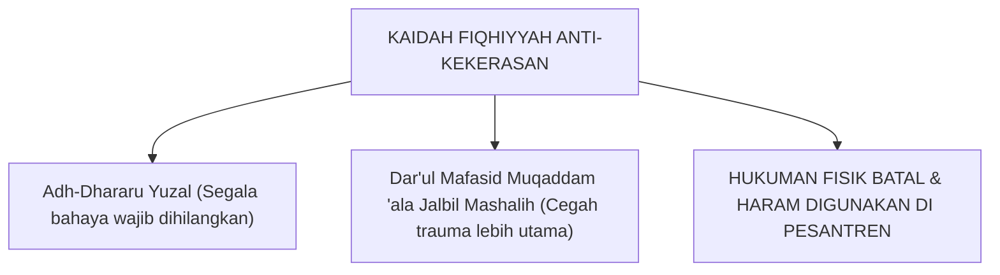

# SUB-BAB 7.4: ELIMINASI HUKUMAN FISIK SECARA FIQHIYYAH
## *Kajian Qawa'id Fiqhiyyah tentang Keharaman Hukuman Fisik dan Perlindungan Martabat Santri*

**Kode Modul**: `BOOK-01/BAB-07/SUB-04`  
**Kategori**: Fiqh Pengasuhan & Perlindungan Anak  
**Fokus Keilmuan**: Qawa'id Fiqhiyyah & Hukum Perlindungan Santri

---

### 1. Kaidah Fiqh Pembatalan Hukuman Fisik
Sebagian pihak mencoba melegalkan pemukulan santri dengan dalih hadits tentang anak usia 10 tahun yang enggan shalat. Namun, para fuqaha muhaqqiqin (seperti Imam Ibn Hajar al-Asqalani dan Imam ar-Ramli) menetapkan syarat ketat bagi *dharb ta'dib*:
1. Tidak boleh melukai (*dharbun ghairu mubarrih*).
2. Dilarang memukul wajah dan kepala.
3. Tidak boleh dilakukan dalam keadaan marah/emosi.
4. Hanya boleh dilakukan jika cara kelembutan (*al-luthf*) dan nasihat telah terbukti tidak berhasil.

Dalam konteks sains modern, terbukti bahwa pemukulan selalu menimbulkan trauma neurologis amigdala (*dharar*). Oleh karena itu, berlaku kaidah fiqhiyyah mutlak:

$$\text{الضَّرَرُ يُزَالُ (Adh-Dhararu Yuzal — Segala bentuk bahaya/kerusakan wajib dihilangkan)}$$
$$\text{دَرْءُ الْمَفَاسِدِ مُقَدَّمٌ عَلَى جَلْبِ الْمَصَالِحِ (Mencegah kerusakan didahulukan daripada menarik kemaslahatan)}$$

---

### 2. Penegasan Posisi Hukum Ekosistem TUMBUH
Ekosistem TUMBUH menegaskan bahwa **menghilangkan hukuman fisik adalah tuntutan syariat Islam yang sejati**, guna menjaga kemuliaan manusia (*karamah insaniyyah*) dan menyelamatkan generasi santri dari siklus kekerasan.
