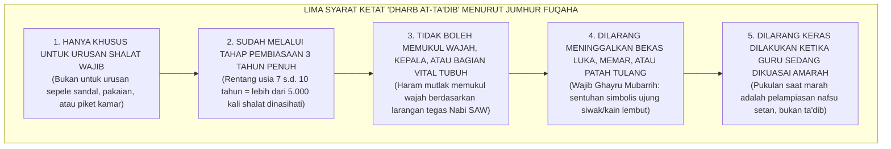
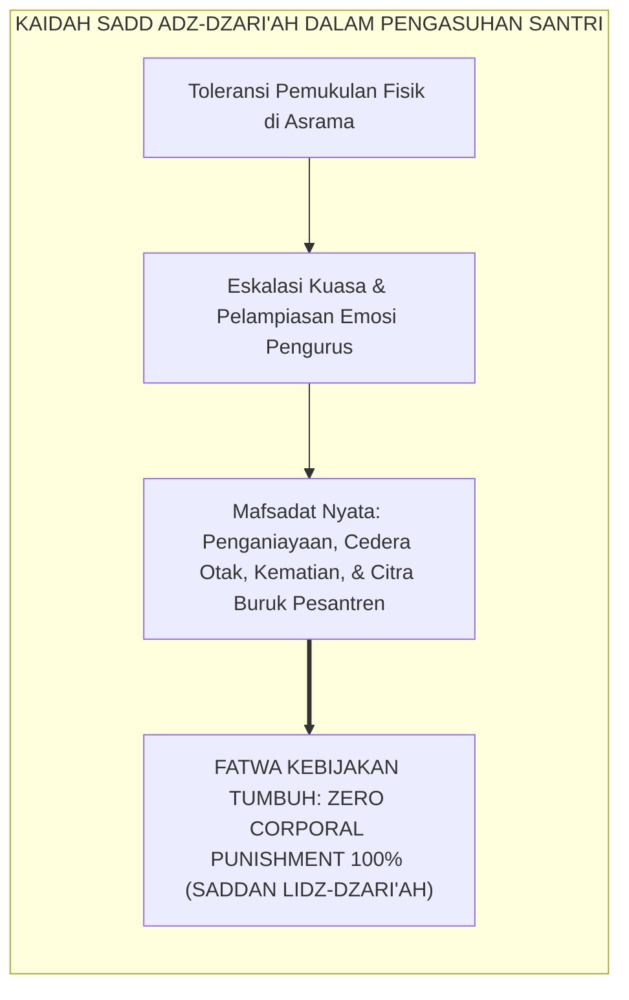

# ELIMINASI HUKUMAN FISIK SECARA FIQHIYYAH

---
### Meluruskan Pemahaman atas Hadits Pemukulan Anak

Sebagian pengasuh dan santri senior kerap mencari dalil pembenaran atas tindakan kekerasan fisik di asrama dengan mengutip hadits masyhur berikut ini:

$$\text{مُرُوا أَوْلَادَكُمْ بِالصَّلَاةِ وَهُمْ أَبْنَاءُ سَبْعِ سِنِينَ، وَاضْرِبُوهُمْ عَلَيْهَا وَهُمْ أَبْنَاءُ عَشْرٍ، وَفَرِّقُوا بَيْنَهُمْ فِي الْمَضَاجِعِ}$$
*"Perintahkanlah anak-anakmu melaksanakan shalat ketika mereka berusia 7 tahun, dan **pukullah mereka karena meninggalkannya ketika berusia 10 tahun**, serta pisahkanlah tempat tidur di antara mereka."* (HR. Abu Dawud no. 495 dan Ahmad no. 6689).

Kerap kali teks hadits ini dipotong secara serampangan untuk melegalkan tamparan, cambukan rotan, tendangan di asrama, hingga perpeloncoan malam yang mengatasnamakan "penegakan disiplin".

Mari kita bedah secara ilmiah dan jujur berdasarkan khazanah Turats: **bagaimana sebenarnya para fuqaha dan ulama hadits salaf terkemuka mensyarah teks hadits ini?**

<b>Gambar 7.4.1:</b> Lima Syarat Ketat 'Dharb at-Ta'dib' Menurut Jumhur Ulama Fiqih Klasik.

---

### Syarah Fiqih Turats: Pukulan Simbolis Kasih Sayang, Bukan Siksaan Balas Dendam

Ketika kita menelaah kitab-kitab induk fiqih empat mazhab, para ulama meletakkan batasan yang teramat ketat mengenai apa yang disebut sebagai *Dharb at-Ta'dib* (pukulan pendidikan):

1. **Bukan Hukuman Primer, Melainkan Simbol Ketegasan Setelah 3 Tahun Pembiasaan**:  
   Hadits di atas menyebutkan perintah shalat dimulai usia 7 tahun dan teguran fisik baru diizinkan pada usia 10 tahun. Artinya, ada rentang waktu **3 tahun penuh (36 bulan = 1.095 hari = 5.475 waktu shalat)** di mana orang tua dan guru wajib mencontohkan, mengajak, dan menasihati shalat dengan penuh kelembutan setiap hari! Jika seorang guru belum pernah mendampingi shalat dengan sabar selama 3 tahun lalu langsung memukul santri baru, maka guru tersebut telah melanggar urutan sunnah nabawi.
2. **Karakter Pukulan: *Dharb Ghayru Mubarrih***:  
   Imam **Ibnu Qudamah** dalam *Al-Mughni*[^1] dan Imam **An-Nawawi** dalam *Al-Majmu'* menegaskan bahwa pukulan ta'dib adalah sentuhan ringan tanpa ayunan tenaga—seperti menepuk pundak anak menggunakan ujung siwak atau sapu tangan yang dilipat—bukan pukulan yang menimbulkan rasa sakit fisik, apalagi memar atau berdarah!
3. **Larangan Mutlak Memukul Wajah (*Nahyu 'an Dharbil Wajh*)**:  
   Rasulullah SAW bersabda dengan sangat tegas:
   $$\text{إِذَا قَاتَلَ أَحَدُكُمْ فَلْيَجْتَنِبِ الْوَجْهَ}$$
   *"Jika salah seorang di antara kalian terpaksa memukul, maka **jauhilah wajah!**"* (HR. Al-Bukhari no. 2559 dan Muslim no. 2612). Memukul wajah, menampar pipi, atau menjitak kepala santri adalah perbuatan maksiat yang diharamkan secara ijma'.
4. **Tanggung Jawab Pidana & Ganti Rugi (*Dhaman wa Jinayah*)**:  
   Imam Asy-Syafi'i menegaskan bahwa jika seorang guru memukul murid hingga menimbulkan cedera fisik, luka memar, atau kematian, maka guru tersebut **wajib membayar denda (*diyat*) atau di-qishash di hadapan pengadilan syariat**, karena hak mendidik tidak pernah mencakup hak merusak raga anak!

---

### Kaidah Fiqih *Sadd adz-Dzari'ah*: Mengapa di Era Modern Hukuman Fisik Wajib Dihapus 100%?

Dalam ilmu ushul fiqih, para ulama merumuskan sebuah kaidah pencegahan preventif yang sangat agung:

$$\text{سَدُّ الذَّرَائِعِ: مَا أَدَّى إِلَى الْمَفْسَدَةِ فَهُوَ مَمْنُوعٌ}$$
*"Menutup pintu kerusakan (*Sadd adz-Dzari'ah*): Segala sarana yang terbukti dalam kenyataan lapangan berujung pada kerusakan dan kezaliman yang haram, maka sarana tersebut hukumnya menjadi terlarang!"*

Mari kita lihat realitas lapangan di era modern:
* Membiarkan adanya "ruang toleransi pemukulan kecil" di pesantren terbukti secara empiris selalu disalahgunakan oleh oknum pembina dan santri senior untuk melakukan penganiayaan berat, perpeloncoan malam, bahkan berujung pada kematian santri.
* Riset neurosains mutakhir membuktikan bahwa otak anak yang dipukul mengalami lonjakan hormon kortisol kronis yang merusak sel-sel neuron di *Korteks Prefrontal* dan *Hipokampus*, membuat anak mengalami trauma berkepanjangan (*PTSD*), kelumpuhan nalar moral, dan memicu perilaku agresif di masa depan.

<b>Gambar 7.4.2:</b> Alur Kaidah Sadd adz-Dzari'ah dalam Mengharamkan Hukuman Fisik di Pesantren.

Oleh karena itu, berpijak pada prinsip *Sadd adz-Dzari'ah* dan pemeliharaan *Hifzh an-Nafs* (Maqashid Syari'ah), **Ekosistem TUMBUH menetapkan kebijakan mutlak: HUKUMAN FISIK DI PESANTREN HARAM DITERAPKAN 100%**.

---

### Menghidupkan Sunnah Murni: Rasulullah SAW Tidak Pernah Memukul Anak

Keputusan menghapus hukuman fisik bukanlah bentuk "tunduk pada budaya barat", melainkan **kembali kepada keteladanan murni (*Sunnah Muttaba'ah*) dari Baginda Rasulullah SAW**.

Ummul Mukminin **Aisyah radhiyallahu 'anha** bersaksi dengan sumpah yang sangat mengharukan tentang akhlak Rasulullah SAW:

> [!NOTE]
> ### 📜 Kesaksian Abadi Sayyidah Aisyah RA tentang Rasulullah SAW:
> 
> $$\text{مَا ضَرَبَ رَسُولُ اللَّهِ صَلَّى اللَّهُ عَلَيْهِ وَسَلَّمَ شَيْئًا قَطُّ بِيَدِهِ، وَلَا امْرَأَةً، وَلَا خَادِمًا، إِلَّا أَنْ يُجَاهِدَ فِي سَبِيلِ اللَّهِ}$$
> 
> **Artinya:**  
> *"Rasulullah SAW **sama sekali tidak pernah memukul apa pun dengan tangannya sepanjang hayat beliau**: tidak pernah memukul seorang wanita, dan **tidak pernah memukul seorang pelayan/anak kecil**, kecuali tatkala beliau berjihad membela agama Allah di medan perang."*  
> *(HR. Muslim no. 2328).*

Sahabat **Anas bin Malik RA**—yang melayani Rasulullah SAW sejak usia 10 tahun selama sepuluh tahun penuh—bersaksi:
$$\text{خَدَمْتُ النَّبِيَّ صَلَّى اللَّهُ عَلَيْهِ وَسَلَّمَ عَشْرَ سِنِينَ، فَمَا قَالَ لِي أُفٍّ قَطُّ، وَلَا قَالَ لِشَيْءٍ فَعَلْتُهُ: لِمَ فَعَلْتَهُ؟ وَلَا لِشَيْءٍ لَمْ أَفْعَلْهُ: أَلَّا فَعَلْتَهُ!}$$
*"Aku melayani Rasulullah SAW selama 10 tahun, dan beliau tidak pernah sekalipun membentakku dengan kata 'Ah!', tidak pernah mencelaku atas apa yang aku lakukan: 'Mengapa kamu lakukan itu?', dan tidak pernah memarahiku atas apa yang tidak aku lakukan: 'Mengapa tidak kamu lakukan!'"* (HR. Al-Bukhari no. 6038 dan Muslim no. 2309).

Inilah puncak keluhuran akhlak nabawi yang dihidupkan kembali oleh Sistem TUMBUH: wibawa sejati seorang pendidik tidak lahir dari rotan atau kepalan tangan, melainkan memancar dari keteladanan akhlak, kedalaman ilmu, dan ketulusan kasih sayangnya kepada santri.

---

## 📌 Catatan Kaki & Rujukan Primer

[^1]: **Ibnu Qudamah al-Maqdisi**, *Al-Mughni*, Tahqiq: Dr. Abdullah bin Abdul Muhsin at-Turki (Kairo: Hajar, 1986), Jilid IX: "Kitab ad-Diyat", hlm. 550–558.
[^2]: **Al-Imam Abu Bakar Ibnu al-Arabi**, *Ahkam al-Qur'an* (Beirut: Dar al-Kutub al-Ilmiyyah, 2003), Jilid I, hlm. 535–542.

---

### IV. Eksplanasi Filosofis Lanjutan & Hermeneutika Nilai Eliminasi Hukuman Fisik Secara Fiqhiyyah

Penyelidikan mendalam terhadap tema **ELIMINASI HUKUMAN FISIK SECARA FIQHIYYAH** menuntut pemahaman integral atas relasi antara *Ontologi Fitrah* dan *Sosiologi Pembelajaran Pesantren*. Ketika seorang santri memasuki ekosistem pendidikan, ia membawa amanah perjanjian primordial (*Mithaq*) yang menuntut ruang tumbuh yang aman dari distorsi psikologis.

1. **Dialektika Keikhlasan (*Shidq an-Niyyah*) vs Formalisme Perilaku**:
   Dalam pandangan *Hujjatul Islam* Al-Imam Al-Ghazali dalam *Ihya 'Ulumiddin*, pembentukan karakter yang sejati bermula dari pembersihan batin (*Thaharatul Batin*). Ketika sebuah institusi mereduksi adab menjadi kepatuhan semu di hadapan figur otoritas, yang sesungguhnya terjadi adalah pelemahan integritas diri (*Nifaq Tarbawi*). Sistem TUMBUH menegaskan bahwa kesalehan sejati harus lahir dari kemerdekaan batin yang disinari oleh cinta kepada Allah (*Mahabbatullah*) dan kesadaran pengawasan-Nya (*Muraqabatullah*).

2. **Dinamika Neuroplastisitas & Internalisasi Nilai Ruhiyyah**:
   Sains kognitif kontemporer membuktikan bahwa pembiasaan nilai yang disertai rasa takut ekstrem mengaktifkan poros *HPA (Hypothalamic-Pituitary-Adrenal)* dan membanjiri otak dengan hormon kortisol. Kondisi ini membekukan kemampuan *Prefrontal Cortex* untuk merefleksikan nilai secara mandiri. Sebaliknya, ketika nilai **ELIMINASI HUKUMAN FISIK SECARA FIQHIYYAH** disampaikan dalam suasana pengasuhan yang hangat (*Warm Presence*), otak santri melepaskan *oksitosin* dan *dopamin* yang mempercepat konsolidasi sinaptik dan pembentukan memori jangka panjang (*Long-Term Potentiation*).

3. **Matriks Transformasi Praksis Pembinaan**:

| Dimensi Pengasuhan | Pola Lama (Mekanistis-Punitif) | Pola Rekonstruksi Ekosistem TUMBUH |
| :--- | :--- | :--- |
| **Sumber Motivasi** | Tekanan eksternal dan rasa takut akan sanksi fisik. | Kesadaran fitrah internal dan kerinduan pada rida ilahi. |
| **Relasi Musyrif-Santri** | Pengawasan hierarkis intimidatif (panoptikon). | Keteladanan hidup (*Qudwah Hasanah*) dan pendampingan empatik. |
| **Ketahanan Karakter** | Runtuh ketika pengawasan ditiadakan (liburan/lulus). | Melekat kokoh sebagai kompas moral seumur hidup (*Insan Adabi*). |

---

### V. Refleksi Pedagogis & Rekomendasi Aksi Lembaga

Penerapan prinsip **ELIMINASI HUKUMAN FISIK SECARA FIQHIYYAH** di lingkungan pesantren menuntut komitmen kelembagaan yang terstruktur:
* **Audit Budaya Pengasuhan**: Pimpinan pesantren wajib melakukan refleksi berkala atas seluruh interaksi antara asatidz, musyrif, dan santri guna memastikan tidak ada celah bagi masuknya feodalisme atau kekerasan terselubung.
* **Penguatan Kapasitas Pendidik**: Setiap pembina asrama difasilitasi dengan pelatihan literasi psikologi perkembangan dan konseling Islam agar memiliki kematangan emosi dalam menghadapi dinamika santri.
* **Integrasi Ruhiyyah 24 Jam**: Memastikan bahwa setiap detik kehidupan santri di pondok—mulai dari bangun tidur, halaqah Qur'an, mudzakarah ilmu, hingga istirahat malam—selalu dinaungi oleh nilai keikhlasan dan ukhuwah yang tulus.
