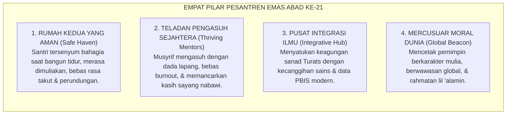

# EPILOG VOLUME 01: PESANTREN MASA DEPAN SEBAGAI MERCUSUAR PERADABAN

---

### 🧭 PETA POSISI PANDUAN DALAM SISTEM TUMBUH (DARI HULU KE HILIR)
* **Posisi Arsitektur**: `HULU EKOSISTEM (Akar Filosofis, Fitrah al-Munazzalah, & Worldview Islam)`
* **Peruntukan Pengguna**: Pimpinan Pesantren, Pengasuh Pondok, Kepala Madrasah, & Dewan Asatidz
* **Fokus Panduan**: Membangun cara pandang pengasuhan berbasis fitrah kesucian dan keteladanan nyata (Qudwah Hasanah), mengeliminasi tradisi kekerasan fisik dan feodalisme asrama.
* **Hasil Akhir yang Dituju**: Terwujudnya santri berkarakter *Insan Adabi* yang mandiri, musyrif yang mengasuh dengan kasih sayang tanpa *burnout*, dan pesantren yang aman berbasis data (*Safe Boarding School*).

---

### 🎯 Mengapa Panduan Ini Ada & Masalah Nyata yang Dipecahkan
1. **Latar Masalah di Lapangan**: Sering kali pengasuhan di pesantren berjalan tanpa SOP yang jelas atau terjebak dalam pola reaktif—menunggu santri berbuat salah baru dihukum dengan emosional.
2. **Solusi Sistem TUMBUH**: Panduan ini memberikan langkah preventif dan terstruktur agar setiap pembiasaan adab berjalan terencana, konsisten, dan terukur.
3. **Sasaran Perubahan**: Memastikan nilai-nilai Islam menyatu dalam perilaku harian santri melalui keteladanan nyata (*Qudwah Hasanah*).

---
### 🎯 Tujuan & Manfaat Panduan
Panduan ini dirancang sebagai petunjuk operasional terapan agar pendidik dan musyrif dapat:
1. Menjalankan pembinaan adab santri dengan pendekatan kasih sayang (*Rahmah*) dan ketegasan yang mendidik (*Firm & Kind*).
2. Menghindari cara-cara kekerasan fisik, bentakan verbal, maupun hukuman yang mempermalukan santri.
3. Menciptakan suasana asrama dan kelas yang aman, tertib, dan menumbuhkan kesadaran diri (*Bi'ah Shalihah*).

---

### 💡 Intisari Cepat (3 Menit Memahami Esensi)
* **Kunci Pengasuhan**: Karakter santri tumbuh melalui keteladanan nyata (*Qudwah Hasanah*), komunikasi empatik, dan pembiasaan terstruktur 24 jam.
* **Tindakan Utama**: Terapkan panduan langkah demi langkah di bawah ini secara konsisten, pantau perkembangan santri secara objektif, dan berikan apresiasi atas setiap perbaikan diri yang mereka capai.
* **Prinsip Disiplin**: Fokus pada pemulihan hubungan dan tanggung jawab nyata (*Restoratif*), bukan sekadar melampiaskan amarah atau menghukum.

---

---

### 💬 ILUSTRASI NYATA & ANALOGI SEDERHANA
Bayangkan sebuah skenario yang sering kita lihat sehari-hari di asrama:
* Ketika seorang santri baru melakukan kekeliruan (misalnya terlambat bangun Subuh atau kasurnya berantakan), respon pertama yang sering muncul adalah bentakan keras atau hukuman fisik (seperti push-up atau jemur di lapangan).
* **Hasilnya?** Santri tersebut mungkin tampak patuh seketika karena takut, tetapi di dalam hatinya tumbuh rasa dongkol, dendam tersembunyi, atau kebiasaan "bersandiwara"—hanya tertib ketika ada pengawas di dekatnya.

Dalam Sistem TUMBUH, kita menggunakan cara yang jauh lebih cerdas, sejuk, dan membumi:
1. **Analogi "Rem dan Pedal Gas Otak"**: Santri usia remaja (usia MTs dan Aliyah) memiliki bagian otak emosi (*Sistem Limbik*) yang sudah menyala sangat kuat seperti *pedal gas mobil sport*, namun otak pengendali logikanya (*Prefrontal Cortex*) masih dalam proses tumbuh seperti *sistem rem yang baru dipasang*. Tugas guru dan musyrif bukan memarahi mobilnya, melainkan menjadi **"Sopir Teladan & Sabuk Pengaman"** yang mendampingi santri belajar menginjak rem dengan bijak.
2. **Kekuatan Contoh Nyata (*Qudwah Hasanah*)**: Santri jauh lebih cepat meniru apa yang mereka **lihat** setiap hari daripada apa yang mereka **dengar** dari ribuan nasihat panjang. Jika musyrif datang tepat waktu, tersenyum ramah, dan kamarnya rapi, santri akan menirunya dengan sukarela.

---

### 🛠️ PANDUAN LANGKAH PRAKTIS LAPANGAN (BISA LANGSUNG DIPRAKTIKKAN HARI INI)

| Tahapan Aksi | Tindakan Nyata Musyrif / Guru di Lapangan | Hal yang Harus Diperhatikan |
| :--- | :--- | :--- |
| **1. Langkah Persiapan (Sebelum Kejadian)** | Sepakati aturan bersama santri di awal pekan dengan kalimat positif (contoh: *"Kamar rapi membuat istirahat kita berkah"*). | Buat poster visual sederhana yang mudah dibaca di dinding kamar. |
| **2. Langkah Respon (Saat Terjadi Masalah)** | Tarik napas, tenangkan diri, ajak santri berbicara empat mata tanpa mempermalukannya di depan teman-temannya. | Gunakan nada bicara yang tenang namun tegas (*Firm & Kind*). |
| **3. Langkah Perbaikan (Tanggung Jawab Nyata)** | Minta santri memperbaiki kesalahannya secara langsung (contoh: merapikan kembali barang yang berantakan atau meminta maaf). | Berikan apresiasi seketika santri telah menuntaskan perbaikannya. |

---

### 🗣️ CONTOH DIALOG LAPANGAN (YANG HARUS DIUCAPKAN VS DIHINDARI)

* ❌ **JANGAN UCAPKAN (Membuat Santri Menutup Diri & Dendam)**:
  > *"Kamu ini pemalas sekali ya, sudah dibilangi berkali-kali masih saja kasur berantakan! Push-up 50 kali sekarang!"*
* ✅ **UCAPKAN INI (Mendidik Tanggung Jawab & Kesadaran Diri)**:
  > *"Akhi, antum tahu kesepakatan kamar kita tentang kerapian tempat tidur setelah Subuh. Coba lihat kasur antum sekarang, apa yang perlu disempurnakan? Mari rapikan bersama sekarang agar kamar kita nyaman dan berkah."*

---

### 📋 3 POIN EMAS RANGKUMAN (UNTUK SANTRI SENIOR & MUSYRIF MUDA)
1. **Didik dengan Kasih Sayang, Tegakkan Batas dengan Adil**: Jangan pernah mencampuradukkan ketegasan aturan dengan pelampiasan amarah pribadi.
2. **Apresiasi 4x Lebih Banyak daripada Teguran (*Magic Ratio 4:1*)**: Jangan hanya bersuara ketika santri berbuat salah. Saat mereka berbuat baik (salat di shaf depan, menolong kawan, membaca Al-Qur'an), segera berikan pujian tulus.
3. **Fokus pada Perbaikan Hubungan (*Restoratif*)**: Masalah perilaku adalah peluang emas untuk mendidik santri menjadi pribadi yang lebih dewasa dan bertanggung jawab.

---

### 📖 Uraian Lengkap Landasan & Rujukan Sistem

---

### Berlabuh di Samudera Kebangkitan Peradaban

Perjalanan panjang penelusuran intelektual dan spiritual sepanjang tujuh bab dalam Buku Volume 01 ini akhirnya tiba di pelabuhan agungnya.

Kita telah mengawali perjalanan dari **Bab 01** dengan membongkar krisis karakter, anomali kelas vs asrama, dan trauma biologis akibat kekerasan. Kita melangkah ke **Bab 02** menyelami kesucian ontologi fitrah dan struktur psiko-spiritual insan pembelajar. Di **Bab 03**, kita menyatukan wahyu (*Ayat Qawliyyah*) dan neurosains kognitif (*Ayat Kauniyyah*) ke dalam epistemologi integratif. Di **Bab 04**, kita mendekonstruksi feodalisme senioritas dan meluruskan distorsi makna tawadhu' menuju *Servant Qudwah Leadership*. Di **Bab 05**, kita memancangkan sepuluh postulat filosofis peradaban. Di **Bab 06**, kita merajut Triad Pertumbuhan Simbiotik dan kontinuum 10-tahap. Dan di **Bab 07**, kita memahkotainya dengan kemuliaan aksiologi Maqashid Syari'ah dan Keadilan Restoratif *Ishlah al-Bain*.

<b>Gambar 7.5.1:</b> Grand Synthesis Arsitektur Keilmuan Tujuh Bab Buku Volume 01 Ekosistem TUMBUH (2 Baris Kontinuum).

---

### Menatap Wajah Pesantren Masa Depan: Empat Karakteristik Pesantren Emas

Bayangkan sebuah potret pesantren masa depan yang megah, berwibawa, dan penuh berkah:

<b>Gambar 7.5.2:</b> Empat Pilar Karakteristik Pesantren Emas Abad ke-21 dalam Ekosistem TUMBUH.

1. **Pesantren sebagai Rumah Kedua yang Aman (*Safe Haven & Baituna Jannatuna*)**:  
   Sebuah lingkungan di mana setiap anak merasa dicintai, diakui potensinya, dan dilindungi hak-hak kemanusiaannya. Tidak ada lagi malam-malam yang mencekam di bilik asrama, tidak ada lagi jeritan tangis anak yang dianiaya seniornya di kamar mandi, dan tidak ada lagi orang tua yang cemas melepaskan buah hatinya di pintu gerbang pondok.
2. **Pendidik & Musyrif yang Sejahtera dan Bahagia (*Thriving Murabbi*)**:  
   Para asatidz dan musyrif tidak lagi dibebani tugas 24 jam nonstop sendirian hingga kelelahan mental (*burnout*). Mereka bekerja dalam sistem shift yang teratur, memiliki waktu istirahat yang manusiawi, mendapatkan penghormatan finansial dan spiritual yang layak, serta dibekali keterampilan pedagogi dan konseling restoratif modern.
3. **Pusat Integrasi Turats dan Sains Modern (*Epistemological Hub*)**:  
   Ruang-ruang madrasah dan asrama menjadi tempat berpadunya dua cahaya: keagungan mutiara kitab kuning ulama salaf yang mengakar kuat pada wahyu, berpadu harmonis dengan ketepatan sains neurobiologi perkembangan dan sistem informasi data PBIS yang presisi.
4. **Mercusuar Peradaban Rahmatan lil 'Alamin**:  
   Pesantren tidak lagi dipandang sebagai lembaga pinggiran atau tempat rehabilitasi anak nakal, melainkan berdiri tegak di pentas dunia sebagai kawah candradimuka yang melahirkan para ilmuwan, negarawan, ulama, dan pemimpin global yang berakhlak mulia.

---

### Seruan Transformasi: Saatnya Mengayunkan Langkah Nyata

Wahai para Kiai, Bu Nyai, Asatidz, Musyrif, Pimpinan Pesantren, dan Pemerhati Pendidikan Islam di seluruh pelosok Nusantara...

Kitab monograf ini bukanlah sekadar rangkaian analisis teoritis untuk dipajang di rak-rak perpustakaan. Buku Volume 01 ini adalah[^1] **panggilan jiwa, amanah peradaban, dan cetak biru transformasi nyata** yang menunggu tangan-tangan kita untuk mengejawantahkannya di bumi pesantren.

* Mari kita bersihkan asrama-asrama kita dari tradisi kekerasan fisik, bentakan kasar, dan perpeloncoan feodal yang telah menodai kesucian nama pesantren.
* Mari kita ganti kepatuhan semu berbasis rasa takut dengan ketaatan hakiki yang bersemi dari keikhlasan batin dan kesadaran *Muraqabatullah*.
* Mari kita muliakan para musyrif dan asatidz di garis depan sebagai mitra pembangun peradaban, bukan sekadar buruh penjaga barak.
* Dan mari kita satukan tekad untuk membangun **Ekosistem TUMBUH Pesantren**: tempat di mana santri bertumbuh fitrahnya, pendidik bertumbuh kapasitas dan kebahagiaannya, serta lembaga bertumbuh menjadi organisasi pembelajar yang diberkahi oleh Allah SWT.

Dari bilik-bilik asrama dan serambi-serambi masjid pesantren yang kita cintai inilah, insya Allah kelak akan memancar fajar kebangkitan peradaban Islam: melahirkan generasi santri paripurna yang kokoh aqidahnya, luas ilmunya, luhur akhlaknya, dan siap memimpin peradaban dunia dengan rahmat dan kasih sayang sejati.

---

$$\text{وَقُلِ اعْمَلُوا فَسَيَرَى اللَّهُ عَمَلَكُمْ وَرَسُولُهُ وَالْمُؤْمِنُونَ ۖ وَسَتُرَدُّونَ إِلَىٰ عَالِمِ الْغَيْبِ وَالشَّهَادَةِ فَيُنَبِّئُكُم بِمَا كُنتُمْ تَعْمَلُونَ}$$
*"Dan katakanlah: Bekerjalah kamu, maka Allah, Rasul-Nya, dan orang-orang mukmin akan melihat pekerjaanmu itu, dan kamu akan dikembalikan kepada (Allah) Yang Mengetahui yang ghaib dan yang nyata, lalu diberitakan-Nya kepada kamu apa yang telah kamu kerjakan."* (QS. At-Taubah: 105).

---

## 📌 Catatan Kaki & Rujukan Primer

[^1]: **K.H. Abdurrahman Wahid (Gus Dur)**, *Pesantren Masa Depan: Wacana Pemberdayaan dan Transformasi Pesantren*, Ed. Marzuki Wahid (Bandung: Pustaka Hidayah, 1999), hlm. 15–42.
