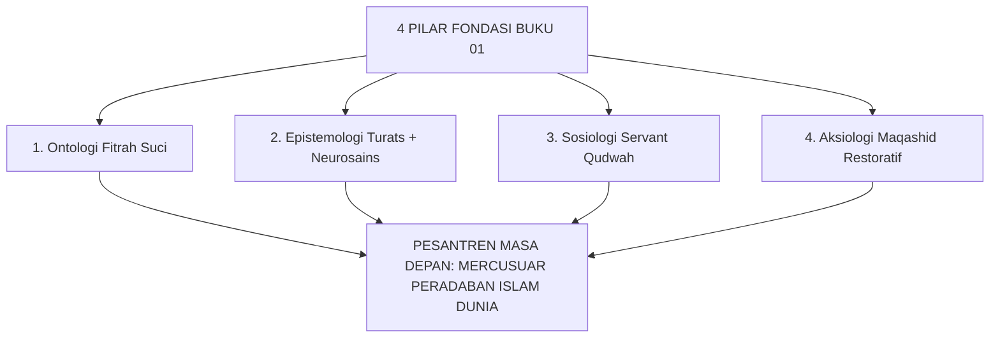

# SUB-BAB 7.5: EPILOG: PESANTREN MASA DEPAN SEBAGAI MERCUSUAR PERADABAN
## *Visi Pesantren Masa Depan: Integrasi Karakter Adab Luhur, Keunggulan Akademik-Digital, dan Rahmatan lil 'Alamin*

**Kode Modul**: `BOOK-01/BAB-07/SUB-05`  
**Kategori**: Epilog & Visi Peradaban Volume 01  
**Fokus Keilmuan**: Masa Depan Pendidikan Islam Dunia

---

### 1. Rekapitulasi Fondasi Filosofis Buku 01
Dengan merampungkan seluruh bab dalam Buku Volume 01 ini, ekosistem **TUMBUH** telah meletakkan batu fondasi yang kokoh:
1. **Ontologis**: Menghormati kesucian fitrah dan martabat kemanusiaan santri.
2. **Epistemologis**: Menyatukan kekayaan teks Turats dengan konsensus empiris sains perkembangan dan neurosains kognitif.
3. **Sosiologis**: Membongkar feodalisme relasi kuasa dan perpeloncoan senioritas menuju kepemimpinan melayani (*Servant Qudwah*).
4. **Aksiologis**: Menegakkan Maqashid Syari'ah, keadilan restoratif *Ishlah al-Bain*, dan penghapusan mutlak hukuman fisik.

---

### 2. Jembatan Menuju Volume 02: Taksonomi Kapasitas & 10 Profil Karakter
Fondasi filosofis yang telah dirumuskan dalam Buku 01 ini akan diterjemahkan secara konkret ke dalam **Buku Volume 02**, yang membedah arsitektur kurikulum, matriks taksonomi 10 Muwashafat Adab, trajektori biososial remaja pesantren usia 12–18 tahun, dan progresi Tangga TUMBUH T1 hingga Tahap 7 PENGGERAK.
