# SUB-BAB 7.5: EPILOG VOLUME 01: PESANTREN MASA DEPAN SEBAGAI MERCUSUAR PERADABAN
## *Sintesis Agung Tujuh Bab, Menatap Masa Depan Gemilang, dan Panggilan Suci Transformasi Pendidikan Karakter Nusantara*

**Kode Klasifikasi**: `BOOK-01/BAB-07/SUB-05/MONOGRAF-MASTER-VIBRANT`  
**Disiplin Ilmu**: Filsafat Peradaban Islam, Futurologi Pendidikan Pesantren, & Grand Synthesis Volume 01  
**Penanggung Jawab Keilmuan**: Dewan Pakar Ekosistem TUMBUH (*Master Author, Seluruh Dewan Pakar Keilmuan TUMBUH*)

---

### Berlabuh di Samudera Kebangkitan Peradaban

Perjalanan panjang penelusuran intelektual dan spiritual sepanjang tujuh bab dalam Buku Volume 01 ini akhirnya tiba di pelabuhan agungnya:

Kita telah mengawali perjalanan dari **Bab 01** dengan membongkar krisis karakter, anomali kelas vs asrama, dan trauma biologis akibat kekerasan. Kita melangkah ke **Bab 02** menyelami kesucian ontologi fitrah dan struktur jiwa manusia. Di **Bab 03**, kita menyatukan wahyu dan neurosains ke dalam epistemologi integratif. Di **Bab 04**, kita mendekonstruksi feodalisme senioritas menuju *Servant Qudwah Leadership*. Di **Bab 05**, kita memancangkan sepuluh postulat filosofis peradaban. Di **Bab 06**, kita merajut Triad Pertumbuhan Simbiotik dan kontinuum 10-tahap. Dan di **Bab 07**, kita menutupnya dengan kemuliaan aksiologi Maqashid Syari'ah dan Keadilan Restoratif.

```mermaid
graph TD
    subgraph GrandSynthesis["GRAND SYNTHESIS ARSITEKTUR BUKU VOLUME 01"]
        B1["BAB 01: DIAGNOSIS KRISIS<br/>Dekonstruksi kekerasan, kepatuhan semu, & kelemahan behaviorisme."]
        B2["BAB 02: ONTOLOGI FITRAH<br/>Kesucian primordial insan pembelajar & dinamika psiko-spiritual nafs-aql-qalb."]
        B3["BAB 03: EPISTEMOLOGI INTEGRATIF<br/>Sinergi wahyu & neurosains, mielinisasi hebbian, & habituasi 66-hari."]
        B4["BAB 04: KRITIK FEODALISME<br/>Penghapusan relasi kuasa otoriter menuju Servant Qudwah Leadership."]
        B5["BAB 05: SEPULUH POSTULAT<br/>Piagam filosofis fondasional arsitektur peradaban ekosistem TUMBUH."]
        B6["BAB 06: TRIAD SIMBIOTIK<br/>Santri tumbuh, pendidik terlindungi anti-burnout, & lembaga berbasis data."]
        B7["BAB 07: AKSIOLOGI MAQASHID<br/>Perlindungan Dharuriyyat Khamsah & Keadilan Restoratif Ishlah al-Bain."]
        
        B1 ==> B2 ==> B3 ==> B4 ==> B5 ==> B6 ==> B7 ==> Peradaban["PESANTREN MASA DEPAN:<br/>MERCUSUAR PERADABAN RAHMATAN LIL 'ALAMIN"]
    end
```

<b>Gambar 7.5.1:</b> Grand Synthesis Arsitektur Keilmuan Tujuh Bab Buku Volume 01 Ekosistem TUMBUH.

---

### Menatap Wajah Pesantren Masa Depan

Bayangkan sebuah pesantren masa depan yang megah dan penuh berkah:

* Sebuah pesantren di mana anak-anak santri tersenyum bahagia saat bangun tidur, merasa aman di bilik kamarnya, dan tidak pernah takut diintimidasi oleh seniornya.
* Sebuah pesantren di mana para musyrif mengasuh dengan hati yang lapang, terlindungi dari *burnout*, dan menjadi sumber keteladanan cinta (*Qudwah Hasanah*).
* Sebuah pesantren di mana madrasah dan asrama tersambung erat dalam satu denyut data pembinaan 24 jam, di mana Al-Qur'an dan sains modern berpadu indah mencetak generasi emas peradaban.

Inilah wajah **Ekosistem TUMBUH**: sebuah peradaban mini di bumi pesantren yang menghidupkan kembali ruh kemuliaan tarbiyah nabawiyyah di abad modern.

---

### Seruan Transformasi: Saatnya Mengayunkan Langkah Nyata

Wahai para Kiai, Bu Nyai, Asatidz, Musyrif, Pengelola Pesantren, dan Pemerhati Pendidikan Islam...

Karya ini bukanlah sekadar tulisan untuk dikagumi di rak-rak perpustakaan. Buku Volume 01 ini adalah **panggilan jiwa dan kompas penuntun** untuk memulai langkah rekonstruksi nyata di pondok-pondok kita.

Mari kita hapus rotan dan bentakan dari asrama kita; mari kita ganti rasa takut dengan kasih sayang yang mendidik; mari kita muliakan para musyrif yang berjuang di garis depan; dan mari kita satukan tekad untuk membangun **Pesantren Berkarakter TUMBUH**.

Dari tanah-tanah pondok pesantren yang kita cintai inilah, insya Allah kelak akan lahir generasi santri paripurna: mereka yang hafal Al-Qur'an, tajam akal inteleknya, lembut budi pekertinya, dan siap memimpin dunia sebagai rahmat bagi semesta alam (*Rahmatan lil 'Alamin*).

---

$$\text{وَقُلِ اعْمَلُوا فَسَيَرَى اللَّهُ عَمَلَكُمْ وَرَسُولُهُ وَالْمُؤْمِنُونَ}$$
*"Dan katakanlah: Bekerjalah kamu, maka Allah, Rasul-Nya, dan orang-orang mukmin akan melihat pekerjaanmu!"* (QS. At-Taubah: 105).

---

## 📌 Catatan Kaki & Rujukan Primer

[^1]: **Dewan Pakar Ekosistem TUMBUH**, *Master Monograf Volume 01: Akar Filosofis & Epistemologi Pendidikan Karakter Pesantren* (Bandung & Jombang: Konsorsium Riset TUMBUH, 2026).
