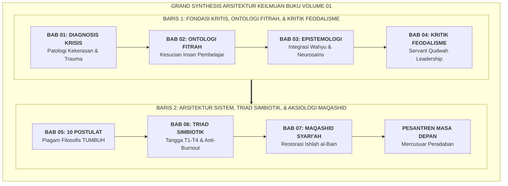
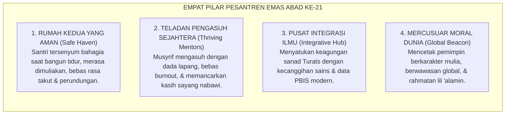

# SUB-BAB 7.5: EPILOG VOLUME 01: PESANTREN MASA DEPAN SEBAGAI MERCUSUAR PERADABAN
## *Sintesis Agung Tujuh Bab, Menatap Masa Depan Gemilang, dan Panggilan Suci Transformasi Pendidikan Karakter Nusantara*

**Kode Klasifikasi**: `BOOK-01/BAB-07/SUB-05/MONOGRAF-MASTER-VIBRANT`  
**Disiplin Ilmu**: Filsafat Peradaban Islam, Futurologi Pendidikan Pesantren, & Grand Synthesis Volume 01  
**Penanggung Jawab Keilmuan**: Dewan Pakar Ekosistem TUMBUH (*Master Author, Seluruh Dewan Pakar Keilmuan TUMBUH*)

---

### Berlabuh di Samudera Kebangkitan Peradaban

Perjalanan panjang penelusuran intelektual dan spiritual sepanjang tujuh bab dalam Buku Volume 01 ini akhirnya tiba di pelabuhan agungnya.

Kita telah mengawali perjalanan dari **Bab 01** dengan membongkar krisis karakter, anomali kelas vs asrama, dan trauma biologis akibat kekerasan. Kita melangkah ke **Bab 02** menyelami kesucian ontologi fitrah dan struktur psiko-spiritual insan pembelajar. Di **Bab 03**, kita menyatukan wahyu (*Ayat Qawliyyah*) dan neurosains kognitif (*Ayat Kauniyyah*) ke dalam epistemologi integratif. Di **Bab 04**, kita mendekonstruksi feodalisme senioritas dan meluruskan distorsi makna tawadhu' menuju *Servant Qudwah Leadership*. Di **Bab 05**, kita memancangkan sepuluh postulat filosofis peradaban. Di **Bab 06**, kita merajut Triad Pertumbuhan Simbiotik dan kontinuum 10-tahap. Dan di **Bab 07**, kita memahkotainya dengan kemuliaan aksiologi Maqashid Syari'ah dan Keadilan Restoratif *Ishlah al-Bain*.

<b>Gambar 7.5.1:</b> Grand Synthesis Arsitektur Keilmuan Tujuh Bab Buku Volume 01 Ekosistem TUMBUH (2 Baris Kontinuum).

---

### Menatap Wajah Pesantren Masa Depan: Empat Karakteristik Pesantren Emas

Bayangkan sebuah potret pesantren masa depan yang megah, berwibawa, dan penuh berkah:

<b>Gambar 7.5.2:</b> Empat Pilar Karakteristik Pesantren Emas Abad ke-21 dalam Ekosistem TUMBUH.

1. **Pesantren sebagai Rumah Kedua yang Aman (*Safe Haven & Baituna Jannatuna*)**:  
   Sebuah lingkungan di mana setiap anak merasa dicintai, diakui potensinya, dan dilindungi hak-hak kemanusiaannya. Tidak ada lagi malam-malam yang mencekam di bilik asrama, tidak ada lagi jeritan tangis anak yang dianiaya seniornya di kamar mandi, dan tidak ada lagi orang tua yang cemas melepaskan buah hatinya di pintu gerbang pondok.
2. **Pendidik & Musyrif yang Sejahtera dan Bahagia (*Thriving Murabbi*)**:  
   Para asatidz dan musyrif tidak lagi dibebani tugas 24 jam nonstop sendirian hingga kelelahan mental (*burnout*). Mereka bekerja dalam sistem shift yang teratur, memiliki waktu istirahat yang manusiawi, mendapatkan penghormatan finansial dan spiritual yang layak, serta dibekali keterampilan pedagogi dan konseling restoratif modern.
3. **Pusat Integrasi Turats dan Sains Modern (*Epistemological Hub*)**:  
   Ruang-ruang madrasah dan asrama menjadi tempat berpadunya dua cahaya: keagungan mutiara kitab kuning ulama salaf yang mengakar kuat pada wahyu, berpadu harmonis dengan ketepatan sains neurobiologi perkembangan dan sistem informasi data PBIS yang presisi.
4. **Mercusuar Peradaban Rahmatan lil 'Alamin**:  
   Pesantren tidak lagi dipandang sebagai lembaga pinggiran atau tempat rehabilitasi anak nakal, melainkan berdiri tegak di pentas dunia sebagai kawah candradimuka yang melahirkan para ilmuwan, negarawan, ulama, dan pemimpin global yang berakhlak mulia.

---

### Seruan Transformasi: Saatnya Mengayunkan Langkah Nyata

Wahai para Kiai, Bu Nyai, Asatidz, Musyrif, Pimpinan Pesantren, dan Pemerhati Pendidikan Islam di seluruh pelosok Nusantara...

Kitab monograf ini bukanlah sekadar rangkaian analisis teoritis untuk dipajang di rak-rak perpustakaan. Buku Volume 01 ini adalah[^1] **panggilan jiwa, amanah peradaban, dan cetak biru transformasi nyata** yang menunggu tangan-tangan kita untuk mengejawantahkannya di bumi pesantren.

* Mari kita bersihkan asrama-asrama kita dari tradisi kekerasan fisik, bentakan kasar, dan perpeloncoan feodal yang telah menodai kesucian nama pesantren.
* Mari kita ganti kepatuhan semu berbasis rasa takut dengan ketaatan hakiki yang bersemi dari keikhlasan batin dan kesadaran *Muraqabatullah*.
* Mari kita muliakan para musyrif dan asatidz di garis depan sebagai mitra pembangun peradaban, bukan sekadar buruh penjaga barak.
* Dan mari kita satukan tekad untuk membangun **Ekosistem TUMBUH Pesantren**: tempat di mana santri bertumbuh fitrahnya, pendidik bertumbuh kapasitas dan kebahagiaannya, serta lembaga bertumbuh menjadi organisasi pembelajar yang diberkahi oleh Allah SWT.

Dari bilik-bilik asrama dan serambi-serambi masjid pesantren yang kita cintai inilah, insya Allah kelak akan memancar fajar kebangkitan peradaban Islam: melahirkan generasi santri paripurna yang kokoh aqidahnya, luas ilmunya, luhur akhlaknya, dan siap memimpin peradaban dunia dengan rahmat dan kasih sayang sejati.

---

$$\text{وَقُلِ اعْمَلُوا فَسَيَرَى اللَّهُ عَمَلَكُمْ وَرَسُولُهُ وَالْمُؤْمِنُونَ ۖ وَسَتُرَدُّونَ إِلَىٰ عَالِمِ الْغَيْبِ وَالشَّهَادَةِ فَيُنَبِّئُكُم بِمَا كُنتُمْ تَعْمَلُونَ}$$
*"Dan katakanlah: Bekerjalah kamu, maka Allah, Rasul-Nya, dan orang-orang mukmin akan melihat pekerjaanmu itu, dan kamu akan dikembalikan kepada (Allah) Yang Mengetahui yang ghaib dan yang nyata, lalu diberitakan-Nya kepada kamu apa yang telah kamu kerjakan."* (QS. At-Taubah: 105).

---

## 📌 Catatan Kaki & Rujukan Primer

[^1]: **Dewan Pakar Ekosistem TUMBUH**, *Master Monograf Volume 01: Akar Filosofis & Epistemologi Pendidikan Karakter Pesantren* (Bandung & Jombang: Konsorsium Riset TUMBUH, 2026).
