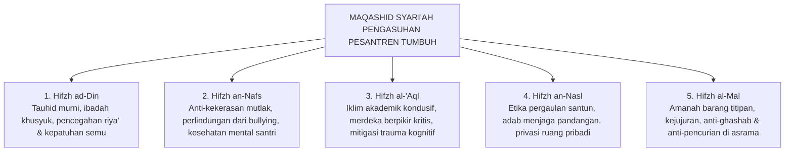

# BAB 7: AKSIOLOGI & MAQASHID SYARI'AH DALAM PENATAAN BUDAYA PESANTREN
## *Perlindungan Jiwa & Akal, Restorasi Keadilan Syar'i (Ishlah al-Bain), dan Visi Pesantren sebagai Mercusuar Peradaban Luhur*

**Nomor Identifikasi**: `BOOK-01/BAB-07/AKSIOLOGI-MAQASHID/2026`  
**Volume**: Buku 01 — *Akar Filosofis & Epistemologi Pendidikan Karakter Pesantren*  
**Dewan Pakar**: `pakar-epistemologi-turats`, `pakar-perlindungan-anak-dan-advokasi-santri`, `pakar-kuratif-restoratif`

---

## 📑 DAFTAR ISI SUB-BAB 7

1. [7.1 Dimensi Aksiologis Pendidikan Pesantren: Memuliakan Maqashid Syari'ah](#71-dimensi-aksiologis-pendidikan-pesantren-memuliakan-maqashid-syariah)
2. [7.2 Integrasi Lima Prinsip Dharuriyyat dalam Pengasuhan 24-Jam](#72-integrasi-lima-prinsip-dharuriyyat-dalam-pengasuhan-24-jam)
   - [Hifzh ad-Din: Penjagaan Agama Melalui Kesadaran Ibadah](#hifzh-ad-din-penjagaan-agama-melalui-kesadaran-ibadah)
   - [Hifzh an-Nafs: Perlindungan Mutlak Raga & Martabat Mental Santri](#hifzh-an-nafs-perlindungan-mutlak-raga--martabat-mental-santri)
   - [Hifzh al-'Aql: Menghidupkan Budaya Nalar Kritis & Keamanan Psikologis](#hifzh-al-aql-menghidupkan-budaya-nalar-kritis--keamanan-psikologis)
   - [Hifzh an-Nasl: Penjagaan Kehormatan & Batasan Interaksi Sehat](#hifzh-an-nasl-penjagaan-kehormatan--batasan-interaksi-sehat)
   - [Hifzh al-Mal: Penanaman Amanah & Tata Kelola Fasilitas Bersama](#hifzh-al-mal-penanaman-amanah--tata-kelola-fasilitas-bersama)
3. [7.3 Keadilan Restoratif Islam: Konsep Ishlah al-Bain, Ta'widh, dan Tabayyun](#73-keadilan-restoratif-islam-konsep-ishlah-al-bain-tawidh-dan-tabayyun)
4. [7.4 Eliminasi Mutlak Hukuman Fisik sebagai Konsekuensi Fiqhiyyah & Hak Asasi Islami](#74-eliminasi-mutlak-hukuman-fisik-sebagai-konsekuensi-fiqhiyyah--hak-asasi-islami)
5. [7.5 Epilog: Pesantren Masa Depan sebagai Mercusuar Peradaban Luhur Dunia](#75-epilog-pesantren-masa-depan-sebagai-mercusuar-peradaban-luhur-dunia)

---

## 7.1 Dimensi Aksiologis Pendidikan: Memuliakan Maqashid Syari'ah

Aksiologi menjawab pertanyaan: *Untuk nilai apa ilmu dan sistem pendidikan dijalankan?* Seluruh hukum, SOP, dan pembiasaan di pesantren wajib bermuara pada penjagaan lima kemaslahatan primer syariat (*al-Kulliyyat al-Khams*). Suatu metode pembinaan yang mengorbankan salah satu pilar maqashid (misalnya memukul santri hingga cedera demi "menegakkan disiplin shalat") hakikatnya adalah penentangan terhadap esensi syariat itu sendiri.

---

## 7.2 Integrasi Lima Prinsip Dharuriyyat dalam Pengasuhan 24-Jam

---

## 7.3 Keadilan Restoratif Islam: Ishlah al-Bain & Tabayyun

Ketika terjadi pelanggaran antar-santri, syariat Islam mengedepankan **Ishlah al-Bain** (rekonsiliasi dan perbaikan hubungan persaudaraan) sebagaimana ditegaskan dalam QS. Al-Hujurat: 9–10:
* **Tabayyun**: Mengklarifikasi fakta secara adil tanpa prasangka dan tanpa kekerasan verbal.
* **Ta'widh (Restitusi)**: Mengganti kerugian fisik atau material yang timbul akibat kesalahan secara bertanggung jawab.
* **Musamahah & Ishlah**: Memfasilitasi saling memaafkan secara tulus dan merajut kembali ukhuwah tanpa meninggalkan dendam.

---

## 7.4 Eliminasi Hukuman Fisik sebagai Konsekuensi Fiqhiyyah

Kaidah fiqhiyyah menegaskan:
$$\text{الضَّرَرُ يُزَالُ (Adh-Dhararu Yuzal — Segala bentuk bahaya/kerusakan wajib dihilangkan)}$$
$$\text{دَرْءُ الْمَفَاسِدِ مُقَدَّمٌ عَلَى جَلْبِ الْمَصَالِحِ (Mencegah kemafsadatan didahulukan daripada menarik kemaslahatan)}$$

Menghukum santri dengan pukulan fisik, tamparan, atau pembentakan mempermalukan membawa kerusakan neurobiologis (*mafsadat*) yang nyata dan terbukti menghancurkan fungsi otak moral santri. Oleh karena itu, penghapusan hukuman fisik bukanlah kompromi terhadap disiplin, melainkan penegakan hukum syariat yang hakiki.

---

## 7.5 Epilog: Pesantren Masa Depan sebagai Mercusuar Peradaban

Dengan berlandaskan akar filosofis, epistemologi integratif, taksonomi kapasitas, dan etika restoratif ini, pesantren-pesantren di tanah air akan tampil sebagai miniatur peradaban Islam yang gilang-gemilang: melahirkan generasi ulama dan pemimpin yang berilmu mendalam (*tafaqquh fiddin*), berkepribadian tangguh, berakhlak mulia, dan memancarkan rahmat bagi semesta alam (*Rahmatan lil 'Alamin*).
