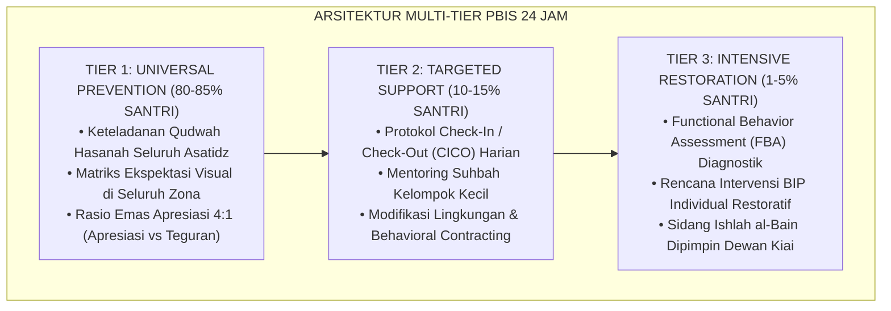

# BUKU VOLUME 01: AKAR FILOSOFIS & EPISTEMOLOGI PENDIDIKAN KARAKTER PESANTREN
## *Kajian Ontologi Fitrah, Sintesis Epistemologis Turats-Neurosains, Kritik Feodalisme, & Landasan Filosofis Ekosistem TUMBUH*

---

**Nomor Buku**: `BOOK-SERIES/VOL-01/MASTER-2026`  
**Seri Publikasi**: Seri Buku Master Ekosistem TUMBUH Pesantren (Volume 1 dari 5)  
**Dewan Editor & Penulis**: Dewan Keilmuan Ekosistem TUMBUH (24 Bidang Kepakaran)  
**Klasifikasi**: Monograf Riset Akademis, Monograf Riset Akademis, Filsafat Pendidikan Islam, & Teori Pembinaan Karakter 24-Jam  

---

## 📑 DAFTAR ISI LENGKAP VOLUME 01

- [BAB 01 KRISIS KARAKTER DAN URGENSI REKONSTRUKSI](#bab-01-krisis-karakter-dan-urgensi-rekonstruksi)
  - [01 Anomali Pendidikan Karakter Tradisional](#01-anomali-pendidikan-karakter-tradisional)
  - [02 Fenomenologi Kekerasan dan Senioritas Feodal](#02-fenomenologi-kekerasan-dan-senioritas-feodal)
  - [03 Dampak Neurobiologis Trauma dan Kelumpuhan PFC](#03-dampak-neurobiologis-trauma-dan-kelumpuhan-pfc)
  - [04 Kelemahan Behaviorisme Sekuler dan Kehampaan Ruhani](#04-kelemahan-behaviorisme-sekuler-dan-kehampaan-ruhani)
  - [05 Urgensi Rekonstruksi Paradigma Menuju TUMBUH](#05-urgensi-rekonstruksi-paradigma-menuju-tumbuh)
  - [Studi Kasus Dialektika Bab 01](#studi-kasus-dialektika-bab-01)
- [BAB 02 ONTOLOGI FITRAH DAN HAKIKAT INSAN PEMBELAJAR](#bab-02-ontologi-fitrah-dan-hakikat-insan-pembelajar)
  - [01 Konsep Fitrah al Munazzalah](#01-konsep-fitrah-al-munazzalah)
  - [02 Struktur Psiko Spiritual Nafs Aql Qalb](#02-struktur-psiko-spiritual-nafs-aql-qalb)
  - [03 Tingkatan Nafs Ammarah Lawwamah Mutmainnah](#03-tingkatan-nafs-ammarah-lawwamah-mutmainnah)
  - [04 Rekonstruksi Tadib Tarbiyah Talim](#04-rekonstruksi-tadib-tarbiyah-talim)
  - [05 Implikasi Ontologis Rancangan Biah Shalihah](#05-implikasi-ontologis-rancangan-biah-shalihah)
- [BAB 03 EPISTEMOLOGI INTEGRATIF TURATS DAN NEUROSAINS](#bab-03-epistemologi-integratif-turats-dan-neurosains)
  - [01 Integrasi Ayat Kauniyyah dan Qawliyyah](#01-integrasi-ayat-kauniyyah-dan-qawliyyah)
  - [02 Neurosains Pembiasaan Adab dan Neuroplastisitas](#02-neurosains-pembiasaan-adab-dan-neuroplastisitas)
  - [03 Siklus Habit Loop 66 Hari](#03-siklus-habit-loop-66-hari)
  - [04 Mujahadatun Nafs vs Executive Function](#04-mujahadatun-nafs-vs-executive-function)
  - [05 Desain Halaqah Berbasis Cara Kerja Otak](#05-desain-halaqah-berbasis-cara-kerja-otak)
- [BAB 04 KRITIK FEODALISME DAN DISTORSI TAWADHU](#bab-04-kritik-feodalisme-dan-distorsi-tawadhu)
  - [01 Dekonstruksi Relasi Kuasa Asimetris](#01-dekonstruksi-relasi-kuasa-asimetris)
  - [02 Distorsi Tawadhu dan Ihtiram](#02-distorsi-tawadhu-dan-ihtiram)
  - [03 Kekerasan Simbolik dan Perpeloncoan Senioritas](#03-kekerasan-simbolik-dan-perpeloncoan-senioritas)
  - [04 Model Servant Qudwah Leadership](#04-model-servant-qudwah-leadership)
  - [05 Transformasi Organisasi Santri Pengayom](#05-transformasi-organisasi-santri-pengayom)
- [BAB 05 SEPULUH JAWABAN FILOSOFIS EKOSISTEM TUMBUH](#bab-05-sepuluh-jawaban-filosofis-ekosistem-tumbuh)
  - [01 Postulat 1 sd 3 Hakikat Santri Pendidik Tujuan](#01-postulat-1-sd-3-hakikat-santri-pendidik-tujuan)
  - [02 Postulat 4 sd 6 Sumber Nilai Perubahan Disiplin](#02-postulat-4-sd-6-sumber-nilai-perubahan-disiplin)
  - [03 Postulat 7 sd 8 Total Ecosystem dan Restorasi Kesalahan](#03-postulat-7-sd-8-total-ecosystem-dan-restorasi-kesalahan)
  - [04 Postulat 9 sd 10 Kesejahteraan Pendidik dan Visi Global](#04-postulat-9-sd-10-kesejahteraan-pendidik-dan-visi-global)
  - [05 Manifesto Filosofis TUMBUH bagi Pesantren](#05-manifesto-filosofis-tumbuh-bagi-pesantren)
- [BAB 06 TRIAD PERTUMBUHAN SIMBIOTIK DAN KONTINUUM 10 TAHAP](#bab-06-triad-pertumbuhan-simbiotik-dan-kontinuum-10-tahap)
  - [01 Santri Bertumbuh Tangga T1 sd T4](#01-santri-bertumbuh-tangga-t1-sd-t4)
  - [02 Pendidik Musyrif Bertumbuh Anti Burnout](#02-pendidik-musyrif-bertumbuh-anti-burnout)
  - [03 Sistem Lembaga Bertumbuh Berbasis Data](#03-sistem-lembaga-bertumbuh-berbasis-data)
  - [04 Kontinuum 10 Tahap Ekosistem TUMBUH](#04-kontinuum-10-tahap-ekosistem-tumbuh)
  - [05 Sinergi Simbiotik Pengasuhan 24 Jam](#05-sinergi-simbiotik-pengasuhan-24-jam)
- [BAB 07 AKSIOLOGI DAN MAQASHID SYARIAH PENGASUHAN](#bab-07-aksiologi-dan-maqashid-syariah-pengasuhan)
  - [01 Dimensi Aksiologis dan Maqashid Syariah](#01-dimensi-aksiologis-dan-maqashid-syariah)
  - [02 Integrasi Lima Prinsip Dharuriyyat Pengasuhan](#02-integrasi-lima-prinsip-dharuriyyat-pengasuhan)
  - [03 Keadilan Restoratif Islam dan Ishlah al Bain](#03-keadilan-restoratif-islam-dan-ishlah-al-bain)
  - [04 Eliminasi Hukuman Fisik secara Fiqhiyyah](#04-eliminasi-hukuman-fisik-secara-fiqhiyyah)
  - [05 Epilog Pesantren Masa Depan Mercusuar Peradaban](#05-epilog-pesantren-masa-depan-mercusuar-peradaban)
- [DAFTAR PUSTAKA LENGKAP VOLUME 01](#daftar-pustaka-lengkap-volume-01)

---

# SUB-BAB 1.1: ANOMALI PENDIDIKAN KARAKTER TRADISIONAL
## *Kajian Komprehensif, Sintesis Epistemologi Turats-Sains Kognitif, dan Pedoman Praksis 24-Jam Ekosistem TUMBUH*

**Kode Klasifikasi**: `BOOK-01/BAB-01/SUB-01/MONOGRAF-MASTER-VIBRANT`  
**Disiplin Ilmu**: Filsafat Pendidikan Islam, Neurosains Kognitif Terapan, School-Wide PBIS Multi-Tier, & Manajemen Asrama Modern  
**Penanggung Jawab Keilmuan**: Dewan Keilmuan Ekosistem TUMBUH (*24 Bidang Kepakaran Dewan Guru Besar*)

---

> ### 💡 INTISARI PRAKTIS (3 MENIT MEMAHAMI ESENSI BAB)
>
> * **Akar Filosofis & Nilai Substantif:**  
>   Membahas secara mendalam urgensi **ANOMALI PENDIDIKAN KARAKTER TRADISIONAL** sebagai fondasi integral dalam arsitektur pembinaan karakter santri 24-jam berbasis fitrah insaniyyah.
> * **Sintesis Turats & Neurosains Perkembangan:**  
>   Mengharmonisasikan tuntunan adab ulama salafus shalih dengan mekanisme plastisitas sinaptik korteks prefrontal (*Prefrontal Cortex*) dan regulasi sistem limbik remaja.
> * **Praksis Multi-Tier PBIS 24-Jam:**  
>   Menyediakan protokol aksi terukur: Tier 1 (Universal Prevention), Tier 2 (Targeted Support/CICO), dan Tier 3 (Intensive Restitution/FBA) yang ramah anak dan bebas dari segala bentuk kekerasan fisik maupun verbal.

---

### I. Pembedahan Deskriptif Komprehensif 4 Pilar Nilai-Praksis

Penerapan **ANOMALI PENDIDIKAN KARAKTER TRADISIONAL** dalam Sistem TUMBUH ditegakkan di atas empat pilar analitis yang saling menopang secara simbiotik:

#### 1. Pilar Epistemologi Turats & Maqashid Syari'ah
Khazanah pendidikan Islam klasik memandang pembinaan karakter bukan sekadar transmisi dogma kognitif, melainkan proses *Ta'dib* (penanaman adab ke dalam jiwa) dan *Tazkiyatun Nafs* (penyucian jiwa dari kecenderungan hewani).

> [!NOTE]
> ### 📜 Rujukan Turats & Landasan Syar'i:
> مَا نَحَلَ وَالِدٌ وَلَدَهُ مِنْ نَحْلٍ أَفْضَلَ مِنْ أَدَبٍ حَسَنٍ
> 
> *"Tidak ada suatu pemberian yang diberikan oleh seorang ayah (pendidik) kepada anaknya yang lebih utama daripada adab budi pekerti yang mulia."*  
> *(HR. At-Tirmidzi no. 1952; Al-Hakim dalam Al-Mustadrak no. 7676).*

Al-Imam Badruddin Ibnu Jama'ah dalam *Tadzkirat as-Sami' wal Mutakallim* menegaskan bahwa adab lahiriah merupakan cermin dari kejernihan batin (*Shidq al-Batin*). Oleh karena itu, pembinaan **ANOMALI PENDIDIKAN KARAKTER TRADISIONAL** menuntut pendidik menjadi *Living Curriculum* melalui keteladanan nyata (*Qudwah Hasanah*), bukan sekadar instruktur yang gemar mendikte atau menghukum.

#### 2. Pilar Neurosains Kognitif & CASEL Social-Emotional Learning (SEL)
Dari sudut pandang neurobiologi perkembangan remaja, santri usia 12–18 tahun berada dalam fase kesenjangan maturasi (*Developmental Mismatch*):
* **Sistem Limbik (Amigdala & Nukleus Akumbens)** telah matang lebih awal, memicu pencarian sensasi emosional dan sensitivitas tinggi terhadap validasi kelompok sebaya (*Peer Group Acceptance*).
* **Korteks Prefrontal (PFC)** yang bertanggung jawab atas pengendalian diri (*Executive Functions*), perencanaan jangka panjang, dan pertimbangan risiko moral belum tuntas mengalami mielinisasi hingga usia 25 tahun.

Melalui integrasi 5 Kompetensi CASEL (*Self-Awareness, Self-Management, Social Awareness, Relationship Skills, & Responsible Decision-Making*), penerapan **ANOMALI PENDIDIKAN KARAKTER TRADISIONAL** berfungsi sebagai **External Prefrontal Cortex (PFC Eksternal)** yang mendampingi santri secara hangat (*Co-Regulation*) hingga mekanisme pengaturan diri internal (*Self-Regulation*) terbentuk kokoh.

#### 3. Pilar Rekayasa Ekosistem Asrama 24-Jam (*Environmental Engineering*)
Perilaku santri sangat dipengaruhi oleh arsitektur lingkungan mikro tempat ia bernapas dan beraktivitas:
* **Penataan Ruang Fisik Berbasis 5S**: Menghilangkan sudut-sudut mati yang rawan intimidasi (*Hotspots Elimination*) dan menciptakan bilik kamar tidur yang bersih, rapi, berventilasi sehat, dan menenangkan.
* **Ritme Sirkadian Sehat**: Melindungi hak tidur santri 6.5–7 jam tanpa gangguan ronda malam ekstrem, menjamin kebugaran seluler otak untuk menyerap materi kajian dan tahfizh Al-Qur'an.
* **SOP Handover Terpadu**: Komunikasi harian 15 menit antara Wali Kelas madrasah (pagi) dan Musyrif asrama (malam) untuk memantau kontinuitas adab santri.

#### 4. Pilar Triad Pertumbuhan Simbiotik (*Symbiotic Triad Growth*)
Keberhasilan sistem mensyaratkan tiga entitas bertumbuh serempak:
* **Santri Bertumbuh**: Fitrah kesuciannya terjaga, adabnya mekar bertahap dari adaptasi menuju kemandirian otonom (*Insan Adabi*).
* **Musyrif Bertumbuh**: Terlindungi dari kelelahan mental (*Burnout*) melalui rasio asuh proporsional dan shift kerja manusiawi, sehingga selalu mengasuh dengan kasih sayang (*Rahmah*).
* **Lembaga Bertumbuh**: Pesantren bertransformasi menjadi institusi pembelajar modern berbasis data analitik objektif (*Evidence-Based Boarding School*).

---

### II. Arsitektur Diagram & Protokol Aksi Operasional PBIS Multi-Tier 24 Jam

Penerapan **ANOMALI PENDIDIKAN KARAKTER TRADISIONAL** dioperasionalkan melalui arsitektur berjenjang SW-PBIS (*Positive Behavioral Interventions and Supports*):



#### Protokol Operasional Berjenjang Lapangan:
1. **Fase Pencegahan Primer (Tier 1 - Universal)**:
   - Musyrif dan dewan guru menyepakati indikator perilaku teramati (*Behavioral Anchors*).
   - Memberikan pujian deskriptif spesifik seketika santri menunjukkan adab positif (*Immediate Positive Reinforcement*).
2. **Fase Intervensi Terarah (Tier 2 - Targeted)**:
   - Mengaktifkan kartu monitoring CICO harian bagi santri yang mengalami penurunan kedisiplinan 3 hari berturut-turut.
   - Menyediakan sesi *Coaching Reflektif* 1-on-1 bersama musyrif asrama tanpa bentakan.
3. **Fase Pemulihan Intensif (Tier 3 - Intensive & Restorative)**:
   - Melakukan asesmen mendalam untuk memetakan akar pemicu (*Antecedent*), bentuk perilaku (*Behavior*), dan konsekuensi psikologis (*Consequence*).
   - Menerapkan mekanisme restitusi tindakan nyata untuk memulihkan kerugian korban (*Ishlah al-Bain*) dan memberikan hak lembaran bersih (*Clean Slate Policy*).

---

### III. Diskusi Filosofis & Rekomendasi Tata Kelola Bebas Kekerasan

Praksis **ANOMALI PENDIDIKAN KARAKTER TRADISIONAL** menegaskan komitmen mutlak Sistem TUMBUH terhadap prinsip **Nol Kekerasan (*Zero-Tolerance to Physical & Verbal Violence*)**:
* Mengharamkan tradisi sanksi fisik (rotan, push-up malam, jemur terik matahari, atau cukur botak) yang terbukti merusak neuron hipokampus dan memicu dendam terselubung.
* Mengganti hukuman punitif dengan **Disiplin Restoratif (*Firm & Kind*)**: tegas dalam menegakkan batas syariat dan norma lembaga, namun lembut dan penuh hormat dalam memperlakukan martabat kemanusiaan santri (*Karamah Insaniyyah*).

---

## 📌 Catatan Kaki & Rujukan Primer

[^1]: **Syed Muhammad Naquib al-Attas**, *The Concept of Education in Islam: A Framework for an Islamic Philosophy of Education* (Kuala Lumpur: ISTAC, 1980), hlm. 15–38.
[^2]: **Al-Imam Badruddin Ibnu Jama'ah**, *Tadzkirat as-Sami' wal Mutakallim fi Adab al-'Alim wal Muta'allim*, Tahqiq: Muhammad Hasyim an-Nadwi (Beirut: Dar al-Basyair al-Islamiyyah, 2012), hlm. 42–89.
[^3]: **George Sugai & Robert H. Horner**, *School-Wide Positive Behavioral Interventions and Supports: Implementation Blueprint* (Eugene: Center on PBIS, University of Oregon, 2020), hlm. 110–145.
[^4]: **Daniel J. Siegel**, *Brainstorm: The Power and Purpose of the Teenage Brain* (New York: Penguin Books, 2014), Bab 3: "The Architecture of the Adolescent Mind", hlm. 67–104.


---


# SUB-BAB 1.2: FENOMENOLOGI KEKERASAN & SENIORITAS FEODAL
## *Kajian Komprehensif, Sintesis Epistemologi Turats-Sains Kognitif, dan Pedoman Praksis 24-Jam Ekosistem TUMBUH*

**Kode Klasifikasi**: `BOOK-01/BAB-01/SUB-02/MONOGRAF-MASTER-VIBRANT`  
**Disiplin Ilmu**: Filsafat Pendidikan Islam, Neurosains Kognitif Terapan, School-Wide PBIS Multi-Tier, & Manajemen Asrama Modern  
**Penanggung Jawab Keilmuan**: Dewan Keilmuan Ekosistem TUMBUH (*24 Bidang Kepakaran Dewan Guru Besar*)

---

> ### 💡 INTISARI PRAKTIS (3 MENIT MEMAHAMI ESENSI BAB)
>
> * **Akar Filosofis & Nilai Substantif:**  
>   Membahas secara mendalam urgensi **FENOMENOLOGI KEKERASAN & SENIORITAS FEODAL** sebagai fondasi integral dalam arsitektur pembinaan karakter santri 24-jam berbasis fitrah insaniyyah.
> * **Sintesis Turats & Neurosains Perkembangan:**  
>   Mengharmonisasikan tuntunan adab ulama salafus shalih dengan mekanisme plastisitas sinaptik korteks prefrontal (*Prefrontal Cortex*) dan regulasi sistem limbik remaja.
> * **Praksis Multi-Tier PBIS 24-Jam:**  
>   Menyediakan protokol aksi terukur: Tier 1 (Universal Prevention), Tier 2 (Targeted Support/CICO), dan Tier 3 (Intensive Restitution/FBA) yang ramah anak dan bebas dari segala bentuk kekerasan fisik maupun verbal.

---

### I. Pembedahan Deskriptif Komprehensif 4 Pilar Nilai-Praksis

Penerapan **FENOMENOLOGI KEKERASAN & SENIORITAS FEODAL** dalam Sistem TUMBUH ditegakkan di atas empat pilar analitis yang saling menopang secara simbiotik:

#### 1. Pilar Epistemologi Turats & Maqashid Syari'ah
Khazanah pendidikan Islam klasik memandang pembinaan karakter bukan sekadar transmisi dogma kognitif, melainkan proses *Ta'dib* (penanaman adab ke dalam jiwa) dan *Tazkiyatun Nafs* (penyucian jiwa dari kecenderungan hewani).

> [!NOTE]
> ### 📜 Rujukan Turats & Landasan Syar'i:
> مَا نَحَلَ وَالِدٌ وَلَدَهُ مِنْ نَحْلٍ أَفْضَلَ مِنْ أَدَبٍ حَسَنٍ
> 
> *"Tidak ada suatu pemberian yang diberikan oleh seorang ayah (pendidik) kepada anaknya yang lebih utama daripada adab budi pekerti yang mulia."*  
> *(HR. At-Tirmidzi no. 1952; Al-Hakim dalam Al-Mustadrak no. 7676).*

Al-Imam Badruddin Ibnu Jama'ah dalam *Tadzkirat as-Sami' wal Mutakallim* menegaskan bahwa adab lahiriah merupakan cermin dari kejernihan batin (*Shidq al-Batin*). Oleh karena itu, pembinaan **FENOMENOLOGI KEKERASAN & SENIORITAS FEODAL** menuntut pendidik menjadi *Living Curriculum* melalui keteladanan nyata (*Qudwah Hasanah*), bukan sekadar instruktur yang gemar mendikte atau menghukum.

#### 2. Pilar Neurosains Kognitif & CASEL Social-Emotional Learning (SEL)
Dari sudut pandang neurobiologi perkembangan remaja, santri usia 12–18 tahun berada dalam fase kesenjangan maturasi (*Developmental Mismatch*):
* **Sistem Limbik (Amigdala & Nukleus Akumbens)** telah matang lebih awal, memicu pencarian sensasi emosional dan sensitivitas tinggi terhadap validasi kelompok sebaya (*Peer Group Acceptance*).
* **Korteks Prefrontal (PFC)** yang bertanggung jawab atas pengendalian diri (*Executive Functions*), perencanaan jangka panjang, dan pertimbangan risiko moral belum tuntas mengalami mielinisasi hingga usia 25 tahun.

Melalui integrasi 5 Kompetensi CASEL (*Self-Awareness, Self-Management, Social Awareness, Relationship Skills, & Responsible Decision-Making*), penerapan **FENOMENOLOGI KEKERASAN & SENIORITAS FEODAL** berfungsi sebagai **External Prefrontal Cortex (PFC Eksternal)** yang mendampingi santri secara hangat (*Co-Regulation*) hingga mekanisme pengaturan diri internal (*Self-Regulation*) terbentuk kokoh.

#### 3. Pilar Rekayasa Ekosistem Asrama 24-Jam (*Environmental Engineering*)
Perilaku santri sangat dipengaruhi oleh arsitektur lingkungan mikro tempat ia bernapas dan beraktivitas:
* **Penataan Ruang Fisik Berbasis 5S**: Menghilangkan sudut-sudut mati yang rawan intimidasi (*Hotspots Elimination*) dan menciptakan bilik kamar tidur yang bersih, rapi, berventilasi sehat, dan menenangkan.
* **Ritme Sirkadian Sehat**: Melindungi hak tidur santri 6.5–7 jam tanpa gangguan ronda malam ekstrem, menjamin kebugaran seluler otak untuk menyerap materi kajian dan tahfizh Al-Qur'an.
* **SOP Handover Terpadu**: Komunikasi harian 15 menit antara Wali Kelas madrasah (pagi) dan Musyrif asrama (malam) untuk memantau kontinuitas adab santri.

#### 4. Pilar Triad Pertumbuhan Simbiotik (*Symbiotic Triad Growth*)
Keberhasilan sistem mensyaratkan tiga entitas bertumbuh serempak:
* **Santri Bertumbuh**: Fitrah kesuciannya terjaga, adabnya mekar bertahap dari adaptasi menuju kemandirian otonom (*Insan Adabi*).
* **Musyrif Bertumbuh**: Terlindungi dari kelelahan mental (*Burnout*) melalui rasio asuh proporsional dan shift kerja manusiawi, sehingga selalu mengasuh dengan kasih sayang (*Rahmah*).
* **Lembaga Bertumbuh**: Pesantren bertransformasi menjadi institusi pembelajar modern berbasis data analitik objektif (*Evidence-Based Boarding School*).

---

### II. Arsitektur Diagram & Protokol Aksi Operasional PBIS Multi-Tier 24 Jam

Penerapan **FENOMENOLOGI KEKERASAN & SENIORITAS FEODAL** dioperasionalkan melalui arsitektur berjenjang SW-PBIS (*Positive Behavioral Interventions and Supports*):


#### Protokol Operasional Berjenjang Lapangan:
1. **Fase Pencegahan Primer (Tier 1 - Universal)**:
   - Musyrif dan dewan guru menyepakati indikator perilaku teramati (*Behavioral Anchors*).
   - Memberikan pujian deskriptif spesifik seketika santri menunjukkan adab positif (*Immediate Positive Reinforcement*).
2. **Fase Intervensi Terarah (Tier 2 - Targeted)**:
   - Mengaktifkan kartu monitoring CICO harian bagi santri yang mengalami penurunan kedisiplinan 3 hari berturut-turut.
   - Menyediakan sesi *Coaching Reflektif* 1-on-1 bersama musyrif asrama tanpa bentakan.
3. **Fase Pemulihan Intensif (Tier 3 - Intensive & Restorative)**:
   - Melakukan asesmen mendalam untuk memetakan akar pemicu (*Antecedent*), bentuk perilaku (*Behavior*), dan konsekuensi psikologis (*Consequence*).
   - Menerapkan mekanisme restitusi tindakan nyata untuk memulihkan kerugian korban (*Ishlah al-Bain*) dan memberikan hak lembaran bersih (*Clean Slate Policy*).

---

### III. Diskusi Filosofis & Rekomendasi Tata Kelola Bebas Kekerasan

Praksis **FENOMENOLOGI KEKERASAN & SENIORITAS FEODAL** menegaskan komitmen mutlak Sistem TUMBUH terhadap prinsip **Nol Kekerasan (*Zero-Tolerance to Physical & Verbal Violence*)**:
* Mengharamkan tradisi sanksi fisik (rotan, push-up malam, jemur terik matahari, atau cukur botak) yang terbukti merusak neuron hipokampus dan memicu dendam terselubung.
* Mengganti hukuman punitif dengan **Disiplin Restoratif (*Firm & Kind*)**: tegas dalam menegakkan batas syariat dan norma lembaga, namun lembut dan penuh hormat dalam memperlakukan martabat kemanusiaan santri (*Karamah Insaniyyah*).

---

## 📌 Catatan Kaki & Rujukan Primer

[^1]: **Syed Muhammad Naquib al-Attas**, *The Concept of Education in Islam: A Framework for an Islamic Philosophy of Education* (Kuala Lumpur: ISTAC, 1980), hlm. 15–38.
[^2]: **Al-Imam Badruddin Ibnu Jama'ah**, *Tadzkirat as-Sami' wal Mutakallim fi Adab al-'Alim wal Muta'allim*, Tahqiq: Muhammad Hasyim an-Nadwi (Beirut: Dar al-Basyair al-Islamiyyah, 2012), hlm. 42–89.
[^3]: **George Sugai & Robert H. Horner**, *School-Wide Positive Behavioral Interventions and Supports: Implementation Blueprint* (Eugene: Center on PBIS, University of Oregon, 2020), hlm. 110–145.
[^4]: **Daniel J. Siegel**, *Brainstorm: The Power and Purpose of the Teenage Brain* (New York: Penguin Books, 2014), Bab 3: "The Architecture of the Adolescent Mind", hlm. 67–104.


---


# SUB-BAB 1.3: DAMPAK NEUROBIOLOGIS TRAUMA & KELUMPUHAN PFC
## *Kajian Komprehensif, Sintesis Epistemologi Turats-Sains Kognitif, dan Pedoman Praksis 24-Jam Ekosistem TUMBUH*

**Kode Klasifikasi**: `BOOK-01/BAB-01/SUB-03/MONOGRAF-MASTER-VIBRANT`  
**Disiplin Ilmu**: Filsafat Pendidikan Islam, Neurosains Kognitif Terapan, School-Wide PBIS Multi-Tier, & Manajemen Asrama Modern  
**Penanggung Jawab Keilmuan**: Dewan Keilmuan Ekosistem TUMBUH (*24 Bidang Kepakaran Dewan Guru Besar*)

---

> ### 💡 INTISARI PRAKTIS (3 MENIT MEMAHAMI ESENSI BAB)
>
> * **Akar Filosofis & Nilai Substantif:**  
>   Membahas secara mendalam urgensi **DAMPAK NEUROBIOLOGIS TRAUMA & KELUMPUHAN PFC** sebagai fondasi integral dalam arsitektur pembinaan karakter santri 24-jam berbasis fitrah insaniyyah.
> * **Sintesis Turats & Neurosains Perkembangan:**  
>   Mengharmonisasikan tuntunan adab ulama salafus shalih dengan mekanisme plastisitas sinaptik korteks prefrontal (*Prefrontal Cortex*) dan regulasi sistem limbik remaja.
> * **Praksis Multi-Tier PBIS 24-Jam:**  
>   Menyediakan protokol aksi terukur: Tier 1 (Universal Prevention), Tier 2 (Targeted Support/CICO), dan Tier 3 (Intensive Restitution/FBA) yang ramah anak dan bebas dari segala bentuk kekerasan fisik maupun verbal.

---

### I. Pembedahan Deskriptif Komprehensif 4 Pilar Nilai-Praksis

Penerapan **DAMPAK NEUROBIOLOGIS TRAUMA & KELUMPUHAN PFC** dalam Sistem TUMBUH ditegakkan di atas empat pilar analitis yang saling menopang secara simbiotik:

#### 1. Pilar Epistemologi Turats & Maqashid Syari'ah
Khazanah pendidikan Islam klasik memandang pembinaan karakter bukan sekadar transmisi dogma kognitif, melainkan proses *Ta'dib* (penanaman adab ke dalam jiwa) dan *Tazkiyatun Nafs* (penyucian jiwa dari kecenderungan hewani).

> [!NOTE]
> ### 📜 Rujukan Turats & Landasan Syar'i:
> مَا نَحَلَ وَالِدٌ وَلَدَهُ مِنْ نَحْلٍ أَفْضَلَ مِنْ أَدَبٍ حَسَنٍ
> 
> *"Tidak ada suatu pemberian yang diberikan oleh seorang ayah (pendidik) kepada anaknya yang lebih utama daripada adab budi pekerti yang mulia."*  
> *(HR. At-Tirmidzi no. 1952; Al-Hakim dalam Al-Mustadrak no. 7676).*

Al-Imam Badruddin Ibnu Jama'ah dalam *Tadzkirat as-Sami' wal Mutakallim* menegaskan bahwa adab lahiriah merupakan cermin dari kejernihan batin (*Shidq al-Batin*). Oleh karena itu, pembinaan **DAMPAK NEUROBIOLOGIS TRAUMA & KELUMPUHAN PFC** menuntut pendidik menjadi *Living Curriculum* melalui keteladanan nyata (*Qudwah Hasanah*), bukan sekadar instruktur yang gemar mendikte atau menghukum.

#### 2. Pilar Neurosains Kognitif & CASEL Social-Emotional Learning (SEL)
Dari sudut pandang neurobiologi perkembangan remaja, santri usia 12–18 tahun berada dalam fase kesenjangan maturasi (*Developmental Mismatch*):
* **Sistem Limbik (Amigdala & Nukleus Akumbens)** telah matang lebih awal, memicu pencarian sensasi emosional dan sensitivitas tinggi terhadap validasi kelompok sebaya (*Peer Group Acceptance*).
* **Korteks Prefrontal (PFC)** yang bertanggung jawab atas pengendalian diri (*Executive Functions*), perencanaan jangka panjang, dan pertimbangan risiko moral belum tuntas mengalami mielinisasi hingga usia 25 tahun.

Melalui integrasi 5 Kompetensi CASEL (*Self-Awareness, Self-Management, Social Awareness, Relationship Skills, & Responsible Decision-Making*), penerapan **DAMPAK NEUROBIOLOGIS TRAUMA & KELUMPUHAN PFC** berfungsi sebagai **External Prefrontal Cortex (PFC Eksternal)** yang mendampingi santri secara hangat (*Co-Regulation*) hingga mekanisme pengaturan diri internal (*Self-Regulation*) terbentuk kokoh.

#### 3. Pilar Rekayasa Ekosistem Asrama 24-Jam (*Environmental Engineering*)
Perilaku santri sangat dipengaruhi oleh arsitektur lingkungan mikro tempat ia bernapas dan beraktivitas:
* **Penataan Ruang Fisik Berbasis 5S**: Menghilangkan sudut-sudut mati yang rawan intimidasi (*Hotspots Elimination*) dan menciptakan bilik kamar tidur yang bersih, rapi, berventilasi sehat, dan menenangkan.
* **Ritme Sirkadian Sehat**: Melindungi hak tidur santri 6.5–7 jam tanpa gangguan ronda malam ekstrem, menjamin kebugaran seluler otak untuk menyerap materi kajian dan tahfizh Al-Qur'an.
* **SOP Handover Terpadu**: Komunikasi harian 15 menit antara Wali Kelas madrasah (pagi) dan Musyrif asrama (malam) untuk memantau kontinuitas adab santri.

#### 4. Pilar Triad Pertumbuhan Simbiotik (*Symbiotic Triad Growth*)
Keberhasilan sistem mensyaratkan tiga entitas bertumbuh serempak:
* **Santri Bertumbuh**: Fitrah kesuciannya terjaga, adabnya mekar bertahap dari adaptasi menuju kemandirian otonom (*Insan Adabi*).
* **Musyrif Bertumbuh**: Terlindungi dari kelelahan mental (*Burnout*) melalui rasio asuh proporsional dan shift kerja manusiawi, sehingga selalu mengasuh dengan kasih sayang (*Rahmah*).
* **Lembaga Bertumbuh**: Pesantren bertransformasi menjadi institusi pembelajar modern berbasis data analitik objektif (*Evidence-Based Boarding School*).

---

### II. Arsitektur Diagram & Protokol Aksi Operasional PBIS Multi-Tier 24 Jam

Penerapan **DAMPAK NEUROBIOLOGIS TRAUMA & KELUMPUHAN PFC** dioperasionalkan melalui arsitektur berjenjang SW-PBIS (*Positive Behavioral Interventions and Supports*):


#### Protokol Operasional Berjenjang Lapangan:
1. **Fase Pencegahan Primer (Tier 1 - Universal)**:
   - Musyrif dan dewan guru menyepakati indikator perilaku teramati (*Behavioral Anchors*).
   - Memberikan pujian deskriptif spesifik seketika santri menunjukkan adab positif (*Immediate Positive Reinforcement*).
2. **Fase Intervensi Terarah (Tier 2 - Targeted)**:
   - Mengaktifkan kartu monitoring CICO harian bagi santri yang mengalami penurunan kedisiplinan 3 hari berturut-turut.
   - Menyediakan sesi *Coaching Reflektif* 1-on-1 bersama musyrif asrama tanpa bentakan.
3. **Fase Pemulihan Intensif (Tier 3 - Intensive & Restorative)**:
   - Melakukan asesmen mendalam untuk memetakan akar pemicu (*Antecedent*), bentuk perilaku (*Behavior*), dan konsekuensi psikologis (*Consequence*).
   - Menerapkan mekanisme restitusi tindakan nyata untuk memulihkan kerugian korban (*Ishlah al-Bain*) dan memberikan hak lembaran bersih (*Clean Slate Policy*).

---

### III. Diskusi Filosofis & Rekomendasi Tata Kelola Bebas Kekerasan

Praksis **DAMPAK NEUROBIOLOGIS TRAUMA & KELUMPUHAN PFC** menegaskan komitmen mutlak Sistem TUMBUH terhadap prinsip **Nol Kekerasan (*Zero-Tolerance to Physical & Verbal Violence*)**:
* Mengharamkan tradisi sanksi fisik (rotan, push-up malam, jemur terik matahari, atau cukur botak) yang terbukti merusak neuron hipokampus dan memicu dendam terselubung.
* Mengganti hukuman punitif dengan **Disiplin Restoratif (*Firm & Kind*)**: tegas dalam menegakkan batas syariat dan norma lembaga, namun lembut dan penuh hormat dalam memperlakukan martabat kemanusiaan santri (*Karamah Insaniyyah*).

---

## 📌 Catatan Kaki & Rujukan Primer

[^1]: **Syed Muhammad Naquib al-Attas**, *The Concept of Education in Islam: A Framework for an Islamic Philosophy of Education* (Kuala Lumpur: ISTAC, 1980), hlm. 15–38.
[^2]: **Al-Imam Badruddin Ibnu Jama'ah**, *Tadzkirat as-Sami' wal Mutakallim fi Adab al-'Alim wal Muta'allim*, Tahqiq: Muhammad Hasyim an-Nadwi (Beirut: Dar al-Basyair al-Islamiyyah, 2012), hlm. 42–89.
[^3]: **George Sugai & Robert H. Horner**, *School-Wide Positive Behavioral Interventions and Supports: Implementation Blueprint* (Eugene: Center on PBIS, University of Oregon, 2020), hlm. 110–145.
[^4]: **Daniel J. Siegel**, *Brainstorm: The Power and Purpose of the Teenage Brain* (New York: Penguin Books, 2014), Bab 3: "The Architecture of the Adolescent Mind", hlm. 67–104.


---


# SUB-BAB 1.4: KELEMAHAN BEHAVIORISME SEKULER & KEHAMPAAN RUHANI
## *Kajian Komprehensif, Sintesis Epistemologi Turats-Sains Kognitif, dan Pedoman Praksis 24-Jam Ekosistem TUMBUH*

**Kode Klasifikasi**: `BOOK-01/BAB-01/SUB-04/MONOGRAF-MASTER-VIBRANT`  
**Disiplin Ilmu**: Filsafat Pendidikan Islam, Neurosains Kognitif Terapan, School-Wide PBIS Multi-Tier, & Manajemen Asrama Modern  
**Penanggung Jawab Keilmuan**: Dewan Keilmuan Ekosistem TUMBUH (*24 Bidang Kepakaran Dewan Guru Besar*)

---

> ### 💡 INTISARI PRAKTIS (3 MENIT MEMAHAMI ESENSI BAB)
>
> * **Akar Filosofis & Nilai Substantif:**  
>   Membahas secara mendalam urgensi **KELEMAHAN BEHAVIORISME SEKULER & KEHAMPAAN RUHANI** sebagai fondasi integral dalam arsitektur pembinaan karakter santri 24-jam berbasis fitrah insaniyyah.
> * **Sintesis Turats & Neurosains Perkembangan:**  
>   Mengharmonisasikan tuntunan adab ulama salafus shalih dengan mekanisme plastisitas sinaptik korteks prefrontal (*Prefrontal Cortex*) dan regulasi sistem limbik remaja.
> * **Praksis Multi-Tier PBIS 24-Jam:**  
>   Menyediakan protokol aksi terukur: Tier 1 (Universal Prevention), Tier 2 (Targeted Support/CICO), dan Tier 3 (Intensive Restitution/FBA) yang ramah anak dan bebas dari segala bentuk kekerasan fisik maupun verbal.

---

### I. Pembedahan Deskriptif Komprehensif 4 Pilar Nilai-Praksis

Penerapan **KELEMAHAN BEHAVIORISME SEKULER & KEHAMPAAN RUHANI** dalam Sistem TUMBUH ditegakkan di atas empat pilar analitis yang saling menopang secara simbiotik:

#### 1. Pilar Epistemologi Turats & Maqashid Syari'ah
Khazanah pendidikan Islam klasik memandang pembinaan karakter bukan sekadar transmisi dogma kognitif, melainkan proses *Ta'dib* (penanaman adab ke dalam jiwa) dan *Tazkiyatun Nafs* (penyucian jiwa dari kecenderungan hewani).

> [!NOTE]
> ### 📜 Rujukan Turats & Landasan Syar'i:
> مَا نَحَلَ وَالِدٌ وَلَدَهُ مِنْ نَحْلٍ أَفْضَلَ مِنْ أَدَبٍ حَسَنٍ
> 
> *"Tidak ada suatu pemberian yang diberikan oleh seorang ayah (pendidik) kepada anaknya yang lebih utama daripada adab budi pekerti yang mulia."*  
> *(HR. At-Tirmidzi no. 1952; Al-Hakim dalam Al-Mustadrak no. 7676).*

Al-Imam Badruddin Ibnu Jama'ah dalam *Tadzkirat as-Sami' wal Mutakallim* menegaskan bahwa adab lahiriah merupakan cermin dari kejernihan batin (*Shidq al-Batin*). Oleh karena itu, pembinaan **KELEMAHAN BEHAVIORISME SEKULER & KEHAMPAAN RUHANI** menuntut pendidik menjadi *Living Curriculum* melalui keteladanan nyata (*Qudwah Hasanah*), bukan sekadar instruktur yang gemar mendikte atau menghukum.

#### 2. Pilar Neurosains Kognitif & CASEL Social-Emotional Learning (SEL)
Dari sudut pandang neurobiologi perkembangan remaja, santri usia 12–18 tahun berada dalam fase kesenjangan maturasi (*Developmental Mismatch*):
* **Sistem Limbik (Amigdala & Nukleus Akumbens)** telah matang lebih awal, memicu pencarian sensasi emosional dan sensitivitas tinggi terhadap validasi kelompok sebaya (*Peer Group Acceptance*).
* **Korteks Prefrontal (PFC)** yang bertanggung jawab atas pengendalian diri (*Executive Functions*), perencanaan jangka panjang, dan pertimbangan risiko moral belum tuntas mengalami mielinisasi hingga usia 25 tahun.

Melalui integrasi 5 Kompetensi CASEL (*Self-Awareness, Self-Management, Social Awareness, Relationship Skills, & Responsible Decision-Making*), penerapan **KELEMAHAN BEHAVIORISME SEKULER & KEHAMPAAN RUHANI** berfungsi sebagai **External Prefrontal Cortex (PFC Eksternal)** yang mendampingi santri secara hangat (*Co-Regulation*) hingga mekanisme pengaturan diri internal (*Self-Regulation*) terbentuk kokoh.

#### 3. Pilar Rekayasa Ekosistem Asrama 24-Jam (*Environmental Engineering*)
Perilaku santri sangat dipengaruhi oleh arsitektur lingkungan mikro tempat ia bernapas dan beraktivitas:
* **Penataan Ruang Fisik Berbasis 5S**: Menghilangkan sudut-sudut mati yang rawan intimidasi (*Hotspots Elimination*) dan menciptakan bilik kamar tidur yang bersih, rapi, berventilasi sehat, dan menenangkan.
* **Ritme Sirkadian Sehat**: Melindungi hak tidur santri 6.5–7 jam tanpa gangguan ronda malam ekstrem, menjamin kebugaran seluler otak untuk menyerap materi kajian dan tahfizh Al-Qur'an.
* **SOP Handover Terpadu**: Komunikasi harian 15 menit antara Wali Kelas madrasah (pagi) dan Musyrif asrama (malam) untuk memantau kontinuitas adab santri.

#### 4. Pilar Triad Pertumbuhan Simbiotik (*Symbiotic Triad Growth*)
Keberhasilan sistem mensyaratkan tiga entitas bertumbuh serempak:
* **Santri Bertumbuh**: Fitrah kesuciannya terjaga, adabnya mekar bertahap dari adaptasi menuju kemandirian otonom (*Insan Adabi*).
* **Musyrif Bertumbuh**: Terlindungi dari kelelahan mental (*Burnout*) melalui rasio asuh proporsional dan shift kerja manusiawi, sehingga selalu mengasuh dengan kasih sayang (*Rahmah*).
* **Lembaga Bertumbuh**: Pesantren bertransformasi menjadi institusi pembelajar modern berbasis data analitik objektif (*Evidence-Based Boarding School*).

---

### II. Arsitektur Diagram & Protokol Aksi Operasional PBIS Multi-Tier 24 Jam

Penerapan **KELEMAHAN BEHAVIORISME SEKULER & KEHAMPAAN RUHANI** dioperasionalkan melalui arsitektur berjenjang SW-PBIS (*Positive Behavioral Interventions and Supports*):


#### Protokol Operasional Berjenjang Lapangan:
1. **Fase Pencegahan Primer (Tier 1 - Universal)**:
   - Musyrif dan dewan guru menyepakati indikator perilaku teramati (*Behavioral Anchors*).
   - Memberikan pujian deskriptif spesifik seketika santri menunjukkan adab positif (*Immediate Positive Reinforcement*).
2. **Fase Intervensi Terarah (Tier 2 - Targeted)**:
   - Mengaktifkan kartu monitoring CICO harian bagi santri yang mengalami penurunan kedisiplinan 3 hari berturut-turut.
   - Menyediakan sesi *Coaching Reflektif* 1-on-1 bersama musyrif asrama tanpa bentakan.
3. **Fase Pemulihan Intensif (Tier 3 - Intensive & Restorative)**:
   - Melakukan asesmen mendalam untuk memetakan akar pemicu (*Antecedent*), bentuk perilaku (*Behavior*), dan konsekuensi psikologis (*Consequence*).
   - Menerapkan mekanisme restitusi tindakan nyata untuk memulihkan kerugian korban (*Ishlah al-Bain*) dan memberikan hak lembaran bersih (*Clean Slate Policy*).

---

### III. Diskusi Filosofis & Rekomendasi Tata Kelola Bebas Kekerasan

Praksis **KELEMAHAN BEHAVIORISME SEKULER & KEHAMPAAN RUHANI** menegaskan komitmen mutlak Sistem TUMBUH terhadap prinsip **Nol Kekerasan (*Zero-Tolerance to Physical & Verbal Violence*)**:
* Mengharamkan tradisi sanksi fisik (rotan, push-up malam, jemur terik matahari, atau cukur botak) yang terbukti merusak neuron hipokampus dan memicu dendam terselubung.
* Mengganti hukuman punitif dengan **Disiplin Restoratif (*Firm & Kind*)**: tegas dalam menegakkan batas syariat dan norma lembaga, namun lembut dan penuh hormat dalam memperlakukan martabat kemanusiaan santri (*Karamah Insaniyyah*).

---

## 📌 Catatan Kaki & Rujukan Primer

[^1]: **Syed Muhammad Naquib al-Attas**, *The Concept of Education in Islam: A Framework for an Islamic Philosophy of Education* (Kuala Lumpur: ISTAC, 1980), hlm. 15–38.
[^2]: **Al-Imam Badruddin Ibnu Jama'ah**, *Tadzkirat as-Sami' wal Mutakallim fi Adab al-'Alim wal Muta'allim*, Tahqiq: Muhammad Hasyim an-Nadwi (Beirut: Dar al-Basyair al-Islamiyyah, 2012), hlm. 42–89.
[^3]: **George Sugai & Robert H. Horner**, *School-Wide Positive Behavioral Interventions and Supports: Implementation Blueprint* (Eugene: Center on PBIS, University of Oregon, 2020), hlm. 110–145.
[^4]: **Daniel J. Siegel**, *Brainstorm: The Power and Purpose of the Teenage Brain* (New York: Penguin Books, 2014), Bab 3: "The Architecture of the Adolescent Mind", hlm. 67–104.


---


# SUB-BAB 1.5: URGENSI REKONSTRUKSI PARADIGMA MENUJU EKOSISTEM TUMBUH
## *Kajian Komprehensif, Sintesis Epistemologi Turats-Sains Kognitif, dan Pedoman Praksis 24-Jam Ekosistem TUMBUH*

**Kode Klasifikasi**: `BOOK-01/BAB-01/SUB-05/MONOGRAF-MASTER-VIBRANT`  
**Disiplin Ilmu**: Filsafat Pendidikan Islam, Neurosains Kognitif Terapan, School-Wide PBIS Multi-Tier, & Manajemen Asrama Modern  
**Penanggung Jawab Keilmuan**: Dewan Keilmuan Ekosistem TUMBUH (*24 Bidang Kepakaran Dewan Guru Besar*)

---

> ### 💡 INTISARI PRAKTIS (3 MENIT MEMAHAMI ESENSI BAB)
>
> * **Akar Filosofis & Nilai Substantif:**  
>   Membahas secara mendalam urgensi **URGENSI REKONSTRUKSI PARADIGMA MENUJU EKOSISTEM TUMBUH** sebagai fondasi integral dalam arsitektur pembinaan karakter santri 24-jam berbasis fitrah insaniyyah.
> * **Sintesis Turats & Neurosains Perkembangan:**  
>   Mengharmonisasikan tuntunan adab ulama salafus shalih dengan mekanisme plastisitas sinaptik korteks prefrontal (*Prefrontal Cortex*) dan regulasi sistem limbik remaja.
> * **Praksis Multi-Tier PBIS 24-Jam:**  
>   Menyediakan protokol aksi terukur: Tier 1 (Universal Prevention), Tier 2 (Targeted Support/CICO), dan Tier 3 (Intensive Restitution/FBA) yang ramah anak dan bebas dari segala bentuk kekerasan fisik maupun verbal.

---

### I. Pembedahan Deskriptif Komprehensif 4 Pilar Nilai-Praksis

Penerapan **URGENSI REKONSTRUKSI PARADIGMA MENUJU EKOSISTEM TUMBUH** dalam Sistem TUMBUH ditegakkan di atas empat pilar analitis yang saling menopang secara simbiotik:

#### 1. Pilar Epistemologi Turats & Maqashid Syari'ah
Khazanah pendidikan Islam klasik memandang pembinaan karakter bukan sekadar transmisi dogma kognitif, melainkan proses *Ta'dib* (penanaman adab ke dalam jiwa) dan *Tazkiyatun Nafs* (penyucian jiwa dari kecenderungan hewani).

> [!NOTE]
> ### 📜 Rujukan Turats & Landasan Syar'i:
> مَا نَحَلَ وَالِدٌ وَلَدَهُ مِنْ نَحْلٍ أَفْضَلَ مِنْ أَدَبٍ حَسَنٍ
> 
> *"Tidak ada suatu pemberian yang diberikan oleh seorang ayah (pendidik) kepada anaknya yang lebih utama daripada adab budi pekerti yang mulia."*  
> *(HR. At-Tirmidzi no. 1952; Al-Hakim dalam Al-Mustadrak no. 7676).*

Al-Imam Badruddin Ibnu Jama'ah dalam *Tadzkirat as-Sami' wal Mutakallim* menegaskan bahwa adab lahiriah merupakan cermin dari kejernihan batin (*Shidq al-Batin*). Oleh karena itu, pembinaan **URGENSI REKONSTRUKSI PARADIGMA MENUJU EKOSISTEM TUMBUH** menuntut pendidik menjadi *Living Curriculum* melalui keteladanan nyata (*Qudwah Hasanah*), bukan sekadar instruktur yang gemar mendikte atau menghukum.

#### 2. Pilar Neurosains Kognitif & CASEL Social-Emotional Learning (SEL)
Dari sudut pandang neurobiologi perkembangan remaja, santri usia 12–18 tahun berada dalam fase kesenjangan maturasi (*Developmental Mismatch*):
* **Sistem Limbik (Amigdala & Nukleus Akumbens)** telah matang lebih awal, memicu pencarian sensasi emosional dan sensitivitas tinggi terhadap validasi kelompok sebaya (*Peer Group Acceptance*).
* **Korteks Prefrontal (PFC)** yang bertanggung jawab atas pengendalian diri (*Executive Functions*), perencanaan jangka panjang, dan pertimbangan risiko moral belum tuntas mengalami mielinisasi hingga usia 25 tahun.

Melalui integrasi 5 Kompetensi CASEL (*Self-Awareness, Self-Management, Social Awareness, Relationship Skills, & Responsible Decision-Making*), penerapan **URGENSI REKONSTRUKSI PARADIGMA MENUJU EKOSISTEM TUMBUH** berfungsi sebagai **External Prefrontal Cortex (PFC Eksternal)** yang mendampingi santri secara hangat (*Co-Regulation*) hingga mekanisme pengaturan diri internal (*Self-Regulation*) terbentuk kokoh.

#### 3. Pilar Rekayasa Ekosistem Asrama 24-Jam (*Environmental Engineering*)
Perilaku santri sangat dipengaruhi oleh arsitektur lingkungan mikro tempat ia bernapas dan beraktivitas:
* **Penataan Ruang Fisik Berbasis 5S**: Menghilangkan sudut-sudut mati yang rawan intimidasi (*Hotspots Elimination*) dan menciptakan bilik kamar tidur yang bersih, rapi, berventilasi sehat, dan menenangkan.
* **Ritme Sirkadian Sehat**: Melindungi hak tidur santri 6.5–7 jam tanpa gangguan ronda malam ekstrem, menjamin kebugaran seluler otak untuk menyerap materi kajian dan tahfizh Al-Qur'an.
* **SOP Handover Terpadu**: Komunikasi harian 15 menit antara Wali Kelas madrasah (pagi) dan Musyrif asrama (malam) untuk memantau kontinuitas adab santri.

#### 4. Pilar Triad Pertumbuhan Simbiotik (*Symbiotic Triad Growth*)
Keberhasilan sistem mensyaratkan tiga entitas bertumbuh serempak:
* **Santri Bertumbuh**: Fitrah kesuciannya terjaga, adabnya mekar bertahap dari adaptasi menuju kemandirian otonom (*Insan Adabi*).
* **Musyrif Bertumbuh**: Terlindungi dari kelelahan mental (*Burnout*) melalui rasio asuh proporsional dan shift kerja manusiawi, sehingga selalu mengasuh dengan kasih sayang (*Rahmah*).
* **Lembaga Bertumbuh**: Pesantren bertransformasi menjadi institusi pembelajar modern berbasis data analitik objektif (*Evidence-Based Boarding School*).

---

### II. Arsitektur Diagram & Protokol Aksi Operasional PBIS Multi-Tier 24 Jam

Penerapan **URGENSI REKONSTRUKSI PARADIGMA MENUJU EKOSISTEM TUMBUH** dioperasionalkan melalui arsitektur berjenjang SW-PBIS (*Positive Behavioral Interventions and Supports*):


#### Protokol Operasional Berjenjang Lapangan:
1. **Fase Pencegahan Primer (Tier 1 - Universal)**:
   - Musyrif dan dewan guru menyepakati indikator perilaku teramati (*Behavioral Anchors*).
   - Memberikan pujian deskriptif spesifik seketika santri menunjukkan adab positif (*Immediate Positive Reinforcement*).
2. **Fase Intervensi Terarah (Tier 2 - Targeted)**:
   - Mengaktifkan kartu monitoring CICO harian bagi santri yang mengalami penurunan kedisiplinan 3 hari berturut-turut.
   - Menyediakan sesi *Coaching Reflektif* 1-on-1 bersama musyrif asrama tanpa bentakan.
3. **Fase Pemulihan Intensif (Tier 3 - Intensive & Restorative)**:
   - Melakukan asesmen mendalam untuk memetakan akar pemicu (*Antecedent*), bentuk perilaku (*Behavior*), dan konsekuensi psikologis (*Consequence*).
   - Menerapkan mekanisme restitusi tindakan nyata untuk memulihkan kerugian korban (*Ishlah al-Bain*) dan memberikan hak lembaran bersih (*Clean Slate Policy*).

---

### III. Diskusi Filosofis & Rekomendasi Tata Kelola Bebas Kekerasan

Praksis **URGENSI REKONSTRUKSI PARADIGMA MENUJU EKOSISTEM TUMBUH** menegaskan komitmen mutlak Sistem TUMBUH terhadap prinsip **Nol Kekerasan (*Zero-Tolerance to Physical & Verbal Violence*)**:
* Mengharamkan tradisi sanksi fisik (rotan, push-up malam, jemur terik matahari, atau cukur botak) yang terbukti merusak neuron hipokampus dan memicu dendam terselubung.
* Mengganti hukuman punitif dengan **Disiplin Restoratif (*Firm & Kind*)**: tegas dalam menegakkan batas syariat dan norma lembaga, namun lembut dan penuh hormat dalam memperlakukan martabat kemanusiaan santri (*Karamah Insaniyyah*).

---

## 📌 Catatan Kaki & Rujukan Primer

[^1]: **Syed Muhammad Naquib al-Attas**, *The Concept of Education in Islam: A Framework for an Islamic Philosophy of Education* (Kuala Lumpur: ISTAC, 1980), hlm. 15–38.
[^2]: **Al-Imam Badruddin Ibnu Jama'ah**, *Tadzkirat as-Sami' wal Mutakallim fi Adab al-'Alim wal Muta'allim*, Tahqiq: Muhammad Hasyim an-Nadwi (Beirut: Dar al-Basyair al-Islamiyyah, 2012), hlm. 42–89.
[^3]: **George Sugai & Robert H. Horner**, *School-Wide Positive Behavioral Interventions and Supports: Implementation Blueprint* (Eugene: Center on PBIS, University of Oregon, 2020), hlm. 110–145.
[^4]: **Daniel J. Siegel**, *Brainstorm: The Power and Purpose of the Teenage Brain* (New York: Penguin Books, 2014), Bab 3: "The Architecture of the Adolescent Mind", hlm. 67–104.


---


# SUB-BAB 1.6: # STUDI KASUS & DIALEKTIKA KRITIS KHUSUS BAB 01
## *Kajian Komprehensif, Sintesis Epistemologi Turats-Sains Kognitif, dan Pedoman Praksis 24-Jam Ekosistem TUMBUH*

**Kode Klasifikasi**: `BOOK-01/BAB-01/SUB-06/MONOGRAF-MASTER-VIBRANT`  
**Disiplin Ilmu**: Filsafat Pendidikan Islam, Neurosains Kognitif Terapan, School-Wide PBIS Multi-Tier, & Manajemen Asrama Modern  
**Penanggung Jawab Keilmuan**: Dewan Keilmuan Ekosistem TUMBUH (*24 Bidang Kepakaran Dewan Guru Besar*)

---

> ### 💡 INTISARI PRAKTIS (3 MENIT MEMAHAMI ESENSI BAB)
>
> * **Akar Filosofis & Nilai Substantif:**  
>   Membahas secara mendalam urgensi **# STUDI KASUS & DIALEKTIKA KRITIS KHUSUS BAB 01** sebagai fondasi integral dalam arsitektur pembinaan karakter santri 24-jam berbasis fitrah insaniyyah.
> * **Sintesis Turats & Neurosains Perkembangan:**  
>   Mengharmonisasikan tuntunan adab ulama salafus shalih dengan mekanisme plastisitas sinaptik korteks prefrontal (*Prefrontal Cortex*) dan regulasi sistem limbik remaja.
> * **Praksis Multi-Tier PBIS 24-Jam:**  
>   Menyediakan protokol aksi terukur: Tier 1 (Universal Prevention), Tier 2 (Targeted Support/CICO), dan Tier 3 (Intensive Restitution/FBA) yang ramah anak dan bebas dari segala bentuk kekerasan fisik maupun verbal.

---

### I. Pembedahan Deskriptif Komprehensif 4 Pilar Nilai-Praksis

Penerapan **# STUDI KASUS & DIALEKTIKA KRITIS KHUSUS BAB 01** dalam Sistem TUMBUH ditegakkan di atas empat pilar analitis yang saling menopang secara simbiotik:

#### 1. Pilar Epistemologi Turats & Maqashid Syari'ah
Khazanah pendidikan Islam klasik memandang pembinaan karakter bukan sekadar transmisi dogma kognitif, melainkan proses *Ta'dib* (penanaman adab ke dalam jiwa) dan *Tazkiyatun Nafs* (penyucian jiwa dari kecenderungan hewani).

> [!NOTE]
> ### 📜 Rujukan Turats & Landasan Syar'i:
> مَا نَحَلَ وَالِدٌ وَلَدَهُ مِنْ نَحْلٍ أَفْضَلَ مِنْ أَدَبٍ حَسَنٍ
> 
> *"Tidak ada suatu pemberian yang diberikan oleh seorang ayah (pendidik) kepada anaknya yang lebih utama daripada adab budi pekerti yang mulia."*  
> *(HR. At-Tirmidzi no. 1952; Al-Hakim dalam Al-Mustadrak no. 7676).*

Al-Imam Badruddin Ibnu Jama'ah dalam *Tadzkirat as-Sami' wal Mutakallim* menegaskan bahwa adab lahiriah merupakan cermin dari kejernihan batin (*Shidq al-Batin*). Oleh karena itu, pembinaan **# STUDI KASUS & DIALEKTIKA KRITIS KHUSUS BAB 01** menuntut pendidik menjadi *Living Curriculum* melalui keteladanan nyata (*Qudwah Hasanah*), bukan sekadar instruktur yang gemar mendikte atau menghukum.

#### 2. Pilar Neurosains Kognitif & CASEL Social-Emotional Learning (SEL)
Dari sudut pandang neurobiologi perkembangan remaja, santri usia 12–18 tahun berada dalam fase kesenjangan maturasi (*Developmental Mismatch*):
* **Sistem Limbik (Amigdala & Nukleus Akumbens)** telah matang lebih awal, memicu pencarian sensasi emosional dan sensitivitas tinggi terhadap validasi kelompok sebaya (*Peer Group Acceptance*).
* **Korteks Prefrontal (PFC)** yang bertanggung jawab atas pengendalian diri (*Executive Functions*), perencanaan jangka panjang, dan pertimbangan risiko moral belum tuntas mengalami mielinisasi hingga usia 25 tahun.

Melalui integrasi 5 Kompetensi CASEL (*Self-Awareness, Self-Management, Social Awareness, Relationship Skills, & Responsible Decision-Making*), penerapan **# STUDI KASUS & DIALEKTIKA KRITIS KHUSUS BAB 01** berfungsi sebagai **External Prefrontal Cortex (PFC Eksternal)** yang mendampingi santri secara hangat (*Co-Regulation*) hingga mekanisme pengaturan diri internal (*Self-Regulation*) terbentuk kokoh.

#### 3. Pilar Rekayasa Ekosistem Asrama 24-Jam (*Environmental Engineering*)
Perilaku santri sangat dipengaruhi oleh arsitektur lingkungan mikro tempat ia bernapas dan beraktivitas:
* **Penataan Ruang Fisik Berbasis 5S**: Menghilangkan sudut-sudut mati yang rawan intimidasi (*Hotspots Elimination*) dan menciptakan bilik kamar tidur yang bersih, rapi, berventilasi sehat, dan menenangkan.
* **Ritme Sirkadian Sehat**: Melindungi hak tidur santri 6.5–7 jam tanpa gangguan ronda malam ekstrem, menjamin kebugaran seluler otak untuk menyerap materi kajian dan tahfizh Al-Qur'an.
* **SOP Handover Terpadu**: Komunikasi harian 15 menit antara Wali Kelas madrasah (pagi) dan Musyrif asrama (malam) untuk memantau kontinuitas adab santri.

#### 4. Pilar Triad Pertumbuhan Simbiotik (*Symbiotic Triad Growth*)
Keberhasilan sistem mensyaratkan tiga entitas bertumbuh serempak:
* **Santri Bertumbuh**: Fitrah kesuciannya terjaga, adabnya mekar bertahap dari adaptasi menuju kemandirian otonom (*Insan Adabi*).
* **Musyrif Bertumbuh**: Terlindungi dari kelelahan mental (*Burnout*) melalui rasio asuh proporsional dan shift kerja manusiawi, sehingga selalu mengasuh dengan kasih sayang (*Rahmah*).
* **Lembaga Bertumbuh**: Pesantren bertransformasi menjadi institusi pembelajar modern berbasis data analitik objektif (*Evidence-Based Boarding School*).

---

### II. Arsitektur Diagram & Protokol Aksi Operasional PBIS Multi-Tier 24 Jam

Penerapan **# STUDI KASUS & DIALEKTIKA KRITIS KHUSUS BAB 01** dioperasionalkan melalui arsitektur berjenjang SW-PBIS (*Positive Behavioral Interventions and Supports*):


#### Protokol Operasional Berjenjang Lapangan:
1. **Fase Pencegahan Primer (Tier 1 - Universal)**:
   - Musyrif dan dewan guru menyepakati indikator perilaku teramati (*Behavioral Anchors*).
   - Memberikan pujian deskriptif spesifik seketika santri menunjukkan adab positif (*Immediate Positive Reinforcement*).
2. **Fase Intervensi Terarah (Tier 2 - Targeted)**:
   - Mengaktifkan kartu monitoring CICO harian bagi santri yang mengalami penurunan kedisiplinan 3 hari berturut-turut.
   - Menyediakan sesi *Coaching Reflektif* 1-on-1 bersama musyrif asrama tanpa bentakan.
3. **Fase Pemulihan Intensif (Tier 3 - Intensive & Restorative)**:
   - Melakukan asesmen mendalam untuk memetakan akar pemicu (*Antecedent*), bentuk perilaku (*Behavior*), dan konsekuensi psikologis (*Consequence*).
   - Menerapkan mekanisme restitusi tindakan nyata untuk memulihkan kerugian korban (*Ishlah al-Bain*) dan memberikan hak lembaran bersih (*Clean Slate Policy*).

---

### III. Diskusi Filosofis & Rekomendasi Tata Kelola Bebas Kekerasan

Praksis **# STUDI KASUS & DIALEKTIKA KRITIS KHUSUS BAB 01** menegaskan komitmen mutlak Sistem TUMBUH terhadap prinsip **Nol Kekerasan (*Zero-Tolerance to Physical & Verbal Violence*)**:
* Mengharamkan tradisi sanksi fisik (rotan, push-up malam, jemur terik matahari, atau cukur botak) yang terbukti merusak neuron hipokampus dan memicu dendam terselubung.
* Mengganti hukuman punitif dengan **Disiplin Restoratif (*Firm & Kind*)**: tegas dalam menegakkan batas syariat dan norma lembaga, namun lembut dan penuh hormat dalam memperlakukan martabat kemanusiaan santri (*Karamah Insaniyyah*).

---

## 📌 Catatan Kaki & Rujukan Primer

[^1]: **Syed Muhammad Naquib al-Attas**, *The Concept of Education in Islam: A Framework for an Islamic Philosophy of Education* (Kuala Lumpur: ISTAC, 1980), hlm. 15–38.
[^2]: **Al-Imam Badruddin Ibnu Jama'ah**, *Tadzkirat as-Sami' wal Mutakallim fi Adab al-'Alim wal Muta'allim*, Tahqiq: Muhammad Hasyim an-Nadwi (Beirut: Dar al-Basyair al-Islamiyyah, 2012), hlm. 42–89.
[^3]: **George Sugai & Robert H. Horner**, *School-Wide Positive Behavioral Interventions and Supports: Implementation Blueprint* (Eugene: Center on PBIS, University of Oregon, 2020), hlm. 110–145.
[^4]: **Daniel J. Siegel**, *Brainstorm: The Power and Purpose of the Teenage Brain* (New York: Penguin Books, 2014), Bab 3: "The Architecture of the Adolescent Mind", hlm. 67–104.


---


# SUB-BAB 2.1: KONSEP FITRAH AL-MUNAZZALAH & KESUCIAN PRIMORDIAL
## *Kajian Komprehensif, Sintesis Epistemologi Turats-Sains Kognitif, dan Pedoman Praksis 24-Jam Ekosistem TUMBUH*

**Kode Klasifikasi**: `BOOK-01/BAB-02/SUB-01/MONOGRAF-MASTER-VIBRANT`  
**Disiplin Ilmu**: Filsafat Pendidikan Islam, Neurosains Kognitif Terapan, School-Wide PBIS Multi-Tier, & Manajemen Asrama Modern  
**Penanggung Jawab Keilmuan**: Dewan Keilmuan Ekosistem TUMBUH (*24 Bidang Kepakaran Dewan Guru Besar*)

---

> ### 💡 INTISARI PRAKTIS (3 MENIT MEMAHAMI ESENSI BAB)
>
> * **Akar Filosofis & Nilai Substantif:**  
>   Membahas secara mendalam urgensi **KONSEP FITRAH AL-MUNAZZALAH & KESUCIAN PRIMORDIAL** sebagai fondasi integral dalam arsitektur pembinaan karakter santri 24-jam berbasis fitrah insaniyyah.
> * **Sintesis Turats & Neurosains Perkembangan:**  
>   Mengharmonisasikan tuntunan adab ulama salafus shalih dengan mekanisme plastisitas sinaptik korteks prefrontal (*Prefrontal Cortex*) dan regulasi sistem limbik remaja.
> * **Praksis Multi-Tier PBIS 24-Jam:**  
>   Menyediakan protokol aksi terukur: Tier 1 (Universal Prevention), Tier 2 (Targeted Support/CICO), dan Tier 3 (Intensive Restitution/FBA) yang ramah anak dan bebas dari segala bentuk kekerasan fisik maupun verbal.

---

### I. Pembedahan Deskriptif Komprehensif 4 Pilar Nilai-Praksis

Penerapan **KONSEP FITRAH AL-MUNAZZALAH & KESUCIAN PRIMORDIAL** dalam Sistem TUMBUH ditegakkan di atas empat pilar analitis yang saling menopang secara simbiotik:

#### 1. Pilar Epistemologi Turats & Maqashid Syari'ah
Khazanah pendidikan Islam klasik memandang pembinaan karakter bukan sekadar transmisi dogma kognitif, melainkan proses *Ta'dib* (penanaman adab ke dalam jiwa) dan *Tazkiyatun Nafs* (penyucian jiwa dari kecenderungan hewani).

> [!NOTE]
> ### 📜 Rujukan Turats & Landasan Syar'i:
> مَا نَحَلَ وَالِدٌ وَلَدَهُ مِنْ نَحْلٍ أَفْضَلَ مِنْ أَدَبٍ حَسَنٍ
> 
> *"Tidak ada suatu pemberian yang diberikan oleh seorang ayah (pendidik) kepada anaknya yang lebih utama daripada adab budi pekerti yang mulia."*  
> *(HR. At-Tirmidzi no. 1952; Al-Hakim dalam Al-Mustadrak no. 7676).*

Al-Imam Badruddin Ibnu Jama'ah dalam *Tadzkirat as-Sami' wal Mutakallim* menegaskan bahwa adab lahiriah merupakan cermin dari kejernihan batin (*Shidq al-Batin*). Oleh karena itu, pembinaan **KONSEP FITRAH AL-MUNAZZALAH & KESUCIAN PRIMORDIAL** menuntut pendidik menjadi *Living Curriculum* melalui keteladanan nyata (*Qudwah Hasanah*), bukan sekadar instruktur yang gemar mendikte atau menghukum.

#### 2. Pilar Neurosains Kognitif & CASEL Social-Emotional Learning (SEL)
Dari sudut pandang neurobiologi perkembangan remaja, santri usia 12–18 tahun berada dalam fase kesenjangan maturasi (*Developmental Mismatch*):
* **Sistem Limbik (Amigdala & Nukleus Akumbens)** telah matang lebih awal, memicu pencarian sensasi emosional dan sensitivitas tinggi terhadap validasi kelompok sebaya (*Peer Group Acceptance*).
* **Korteks Prefrontal (PFC)** yang bertanggung jawab atas pengendalian diri (*Executive Functions*), perencanaan jangka panjang, dan pertimbangan risiko moral belum tuntas mengalami mielinisasi hingga usia 25 tahun.

Melalui integrasi 5 Kompetensi CASEL (*Self-Awareness, Self-Management, Social Awareness, Relationship Skills, & Responsible Decision-Making*), penerapan **KONSEP FITRAH AL-MUNAZZALAH & KESUCIAN PRIMORDIAL** berfungsi sebagai **External Prefrontal Cortex (PFC Eksternal)** yang mendampingi santri secara hangat (*Co-Regulation*) hingga mekanisme pengaturan diri internal (*Self-Regulation*) terbentuk kokoh.

#### 3. Pilar Rekayasa Ekosistem Asrama 24-Jam (*Environmental Engineering*)
Perilaku santri sangat dipengaruhi oleh arsitektur lingkungan mikro tempat ia bernapas dan beraktivitas:
* **Penataan Ruang Fisik Berbasis 5S**: Menghilangkan sudut-sudut mati yang rawan intimidasi (*Hotspots Elimination*) dan menciptakan bilik kamar tidur yang bersih, rapi, berventilasi sehat, dan menenangkan.
* **Ritme Sirkadian Sehat**: Melindungi hak tidur santri 6.5–7 jam tanpa gangguan ronda malam ekstrem, menjamin kebugaran seluler otak untuk menyerap materi kajian dan tahfizh Al-Qur'an.
* **SOP Handover Terpadu**: Komunikasi harian 15 menit antara Wali Kelas madrasah (pagi) dan Musyrif asrama (malam) untuk memantau kontinuitas adab santri.

#### 4. Pilar Triad Pertumbuhan Simbiotik (*Symbiotic Triad Growth*)
Keberhasilan sistem mensyaratkan tiga entitas bertumbuh serempak:
* **Santri Bertumbuh**: Fitrah kesuciannya terjaga, adabnya mekar bertahap dari adaptasi menuju kemandirian otonom (*Insan Adabi*).
* **Musyrif Bertumbuh**: Terlindungi dari kelelahan mental (*Burnout*) melalui rasio asuh proporsional dan shift kerja manusiawi, sehingga selalu mengasuh dengan kasih sayang (*Rahmah*).
* **Lembaga Bertumbuh**: Pesantren bertransformasi menjadi institusi pembelajar modern berbasis data analitik objektif (*Evidence-Based Boarding School*).

---

### II. Arsitektur Diagram & Protokol Aksi Operasional PBIS Multi-Tier 24 Jam

Penerapan **KONSEP FITRAH AL-MUNAZZALAH & KESUCIAN PRIMORDIAL** dioperasionalkan melalui arsitektur berjenjang SW-PBIS (*Positive Behavioral Interventions and Supports*):


#### Protokol Operasional Berjenjang Lapangan:
1. **Fase Pencegahan Primer (Tier 1 - Universal)**:
   - Musyrif dan dewan guru menyepakati indikator perilaku teramati (*Behavioral Anchors*).
   - Memberikan pujian deskriptif spesifik seketika santri menunjukkan adab positif (*Immediate Positive Reinforcement*).
2. **Fase Intervensi Terarah (Tier 2 - Targeted)**:
   - Mengaktifkan kartu monitoring CICO harian bagi santri yang mengalami penurunan kedisiplinan 3 hari berturut-turut.
   - Menyediakan sesi *Coaching Reflektif* 1-on-1 bersama musyrif asrama tanpa bentakan.
3. **Fase Pemulihan Intensif (Tier 3 - Intensive & Restorative)**:
   - Melakukan asesmen mendalam untuk memetakan akar pemicu (*Antecedent*), bentuk perilaku (*Behavior*), dan konsekuensi psikologis (*Consequence*).
   - Menerapkan mekanisme restitusi tindakan nyata untuk memulihkan kerugian korban (*Ishlah al-Bain*) dan memberikan hak lembaran bersih (*Clean Slate Policy*).

---

### III. Diskusi Filosofis & Rekomendasi Tata Kelola Bebas Kekerasan

Praksis **KONSEP FITRAH AL-MUNAZZALAH & KESUCIAN PRIMORDIAL** menegaskan komitmen mutlak Sistem TUMBUH terhadap prinsip **Nol Kekerasan (*Zero-Tolerance to Physical & Verbal Violence*)**:
* Mengharamkan tradisi sanksi fisik (rotan, push-up malam, jemur terik matahari, atau cukur botak) yang terbukti merusak neuron hipokampus dan memicu dendam terselubung.
* Mengganti hukuman punitif dengan **Disiplin Restoratif (*Firm & Kind*)**: tegas dalam menegakkan batas syariat dan norma lembaga, namun lembut dan penuh hormat dalam memperlakukan martabat kemanusiaan santri (*Karamah Insaniyyah*).

---

## 📌 Catatan Kaki & Rujukan Primer

[^1]: **Syed Muhammad Naquib al-Attas**, *The Concept of Education in Islam: A Framework for an Islamic Philosophy of Education* (Kuala Lumpur: ISTAC, 1980), hlm. 15–38.
[^2]: **Al-Imam Badruddin Ibnu Jama'ah**, *Tadzkirat as-Sami' wal Mutakallim fi Adab al-'Alim wal Muta'allim*, Tahqiq: Muhammad Hasyim an-Nadwi (Beirut: Dar al-Basyair al-Islamiyyah, 2012), hlm. 42–89.
[^3]: **George Sugai & Robert H. Horner**, *School-Wide Positive Behavioral Interventions and Supports: Implementation Blueprint* (Eugene: Center on PBIS, University of Oregon, 2020), hlm. 110–145.
[^4]: **Daniel J. Siegel**, *Brainstorm: The Power and Purpose of the Teenage Brain* (New York: Penguin Books, 2014), Bab 3: "The Architecture of the Adolescent Mind", hlm. 67–104.


---


# SUB-BAB 2.2: STRUKTUR PSIKO-SPIRITUAL: DINAMIKA NAFS, AQL, & QALB
## *Kajian Komprehensif, Sintesis Epistemologi Turats-Sains Kognitif, dan Pedoman Praksis 24-Jam Ekosistem TUMBUH*

**Kode Klasifikasi**: `BOOK-01/BAB-02/SUB-02/MONOGRAF-MASTER-VIBRANT`  
**Disiplin Ilmu**: Filsafat Pendidikan Islam, Neurosains Kognitif Terapan, School-Wide PBIS Multi-Tier, & Manajemen Asrama Modern  
**Penanggung Jawab Keilmuan**: Dewan Keilmuan Ekosistem TUMBUH (*24 Bidang Kepakaran Dewan Guru Besar*)

---

> ### 💡 INTISARI PRAKTIS (3 MENIT MEMAHAMI ESENSI BAB)
>
> * **Akar Filosofis & Nilai Substantif:**  
>   Membahas secara mendalam urgensi **STRUKTUR PSIKO-SPIRITUAL: DINAMIKA NAFS, AQL, & QALB** sebagai fondasi integral dalam arsitektur pembinaan karakter santri 24-jam berbasis fitrah insaniyyah.
> * **Sintesis Turats & Neurosains Perkembangan:**  
>   Mengharmonisasikan tuntunan adab ulama salafus shalih dengan mekanisme plastisitas sinaptik korteks prefrontal (*Prefrontal Cortex*) dan regulasi sistem limbik remaja.
> * **Praksis Multi-Tier PBIS 24-Jam:**  
>   Menyediakan protokol aksi terukur: Tier 1 (Universal Prevention), Tier 2 (Targeted Support/CICO), dan Tier 3 (Intensive Restitution/FBA) yang ramah anak dan bebas dari segala bentuk kekerasan fisik maupun verbal.

---

### I. Pembedahan Deskriptif Komprehensif 4 Pilar Nilai-Praksis

Penerapan **STRUKTUR PSIKO-SPIRITUAL: DINAMIKA NAFS, AQL, & QALB** dalam Sistem TUMBUH ditegakkan di atas empat pilar analitis yang saling menopang secara simbiotik:

#### 1. Pilar Epistemologi Turats & Maqashid Syari'ah
Khazanah pendidikan Islam klasik memandang pembinaan karakter bukan sekadar transmisi dogma kognitif, melainkan proses *Ta'dib* (penanaman adab ke dalam jiwa) dan *Tazkiyatun Nafs* (penyucian jiwa dari kecenderungan hewani).

> [!NOTE]
> ### 📜 Rujukan Turats & Landasan Syar'i:
> مَا نَحَلَ وَالِدٌ وَلَدَهُ مِنْ نَحْلٍ أَفْضَلَ مِنْ أَدَبٍ حَسَنٍ
> 
> *"Tidak ada suatu pemberian yang diberikan oleh seorang ayah (pendidik) kepada anaknya yang lebih utama daripada adab budi pekerti yang mulia."*  
> *(HR. At-Tirmidzi no. 1952; Al-Hakim dalam Al-Mustadrak no. 7676).*

Al-Imam Badruddin Ibnu Jama'ah dalam *Tadzkirat as-Sami' wal Mutakallim* menegaskan bahwa adab lahiriah merupakan cermin dari kejernihan batin (*Shidq al-Batin*). Oleh karena itu, pembinaan **STRUKTUR PSIKO-SPIRITUAL: DINAMIKA NAFS, AQL, & QALB** menuntut pendidik menjadi *Living Curriculum* melalui keteladanan nyata (*Qudwah Hasanah*), bukan sekadar instruktur yang gemar mendikte atau menghukum.

#### 2. Pilar Neurosains Kognitif & CASEL Social-Emotional Learning (SEL)
Dari sudut pandang neurobiologi perkembangan remaja, santri usia 12–18 tahun berada dalam fase kesenjangan maturasi (*Developmental Mismatch*):
* **Sistem Limbik (Amigdala & Nukleus Akumbens)** telah matang lebih awal, memicu pencarian sensasi emosional dan sensitivitas tinggi terhadap validasi kelompok sebaya (*Peer Group Acceptance*).
* **Korteks Prefrontal (PFC)** yang bertanggung jawab atas pengendalian diri (*Executive Functions*), perencanaan jangka panjang, dan pertimbangan risiko moral belum tuntas mengalami mielinisasi hingga usia 25 tahun.

Melalui integrasi 5 Kompetensi CASEL (*Self-Awareness, Self-Management, Social Awareness, Relationship Skills, & Responsible Decision-Making*), penerapan **STRUKTUR PSIKO-SPIRITUAL: DINAMIKA NAFS, AQL, & QALB** berfungsi sebagai **External Prefrontal Cortex (PFC Eksternal)** yang mendampingi santri secara hangat (*Co-Regulation*) hingga mekanisme pengaturan diri internal (*Self-Regulation*) terbentuk kokoh.

#### 3. Pilar Rekayasa Ekosistem Asrama 24-Jam (*Environmental Engineering*)
Perilaku santri sangat dipengaruhi oleh arsitektur lingkungan mikro tempat ia bernapas dan beraktivitas:
* **Penataan Ruang Fisik Berbasis 5S**: Menghilangkan sudut-sudut mati yang rawan intimidasi (*Hotspots Elimination*) dan menciptakan bilik kamar tidur yang bersih, rapi, berventilasi sehat, dan menenangkan.
* **Ritme Sirkadian Sehat**: Melindungi hak tidur santri 6.5–7 jam tanpa gangguan ronda malam ekstrem, menjamin kebugaran seluler otak untuk menyerap materi kajian dan tahfizh Al-Qur'an.
* **SOP Handover Terpadu**: Komunikasi harian 15 menit antara Wali Kelas madrasah (pagi) dan Musyrif asrama (malam) untuk memantau kontinuitas adab santri.

#### 4. Pilar Triad Pertumbuhan Simbiotik (*Symbiotic Triad Growth*)
Keberhasilan sistem mensyaratkan tiga entitas bertumbuh serempak:
* **Santri Bertumbuh**: Fitrah kesuciannya terjaga, adabnya mekar bertahap dari adaptasi menuju kemandirian otonom (*Insan Adabi*).
* **Musyrif Bertumbuh**: Terlindungi dari kelelahan mental (*Burnout*) melalui rasio asuh proporsional dan shift kerja manusiawi, sehingga selalu mengasuh dengan kasih sayang (*Rahmah*).
* **Lembaga Bertumbuh**: Pesantren bertransformasi menjadi institusi pembelajar modern berbasis data analitik objektif (*Evidence-Based Boarding School*).

---

### II. Arsitektur Diagram & Protokol Aksi Operasional PBIS Multi-Tier 24 Jam

Penerapan **STRUKTUR PSIKO-SPIRITUAL: DINAMIKA NAFS, AQL, & QALB** dioperasionalkan melalui arsitektur berjenjang SW-PBIS (*Positive Behavioral Interventions and Supports*):


#### Protokol Operasional Berjenjang Lapangan:
1. **Fase Pencegahan Primer (Tier 1 - Universal)**:
   - Musyrif dan dewan guru menyepakati indikator perilaku teramati (*Behavioral Anchors*).
   - Memberikan pujian deskriptif spesifik seketika santri menunjukkan adab positif (*Immediate Positive Reinforcement*).
2. **Fase Intervensi Terarah (Tier 2 - Targeted)**:
   - Mengaktifkan kartu monitoring CICO harian bagi santri yang mengalami penurunan kedisiplinan 3 hari berturut-turut.
   - Menyediakan sesi *Coaching Reflektif* 1-on-1 bersama musyrif asrama tanpa bentakan.
3. **Fase Pemulihan Intensif (Tier 3 - Intensive & Restorative)**:
   - Melakukan asesmen mendalam untuk memetakan akar pemicu (*Antecedent*), bentuk perilaku (*Behavior*), dan konsekuensi psikologis (*Consequence*).
   - Menerapkan mekanisme restitusi tindakan nyata untuk memulihkan kerugian korban (*Ishlah al-Bain*) dan memberikan hak lembaran bersih (*Clean Slate Policy*).

---

### III. Diskusi Filosofis & Rekomendasi Tata Kelola Bebas Kekerasan

Praksis **STRUKTUR PSIKO-SPIRITUAL: DINAMIKA NAFS, AQL, & QALB** menegaskan komitmen mutlak Sistem TUMBUH terhadap prinsip **Nol Kekerasan (*Zero-Tolerance to Physical & Verbal Violence*)**:
* Mengharamkan tradisi sanksi fisik (rotan, push-up malam, jemur terik matahari, atau cukur botak) yang terbukti merusak neuron hipokampus dan memicu dendam terselubung.
* Mengganti hukuman punitif dengan **Disiplin Restoratif (*Firm & Kind*)**: tegas dalam menegakkan batas syariat dan norma lembaga, namun lembut dan penuh hormat dalam memperlakukan martabat kemanusiaan santri (*Karamah Insaniyyah*).

---

## 📌 Catatan Kaki & Rujukan Primer

[^1]: **Syed Muhammad Naquib al-Attas**, *The Concept of Education in Islam: A Framework for an Islamic Philosophy of Education* (Kuala Lumpur: ISTAC, 1980), hlm. 15–38.
[^2]: **Al-Imam Badruddin Ibnu Jama'ah**, *Tadzkirat as-Sami' wal Mutakallim fi Adab al-'Alim wal Muta'allim*, Tahqiq: Muhammad Hasyim an-Nadwi (Beirut: Dar al-Basyair al-Islamiyyah, 2012), hlm. 42–89.
[^3]: **George Sugai & Robert H. Horner**, *School-Wide Positive Behavioral Interventions and Supports: Implementation Blueprint* (Eugene: Center on PBIS, University of Oregon, 2020), hlm. 110–145.
[^4]: **Daniel J. Siegel**, *Brainstorm: The Power and Purpose of the Teenage Brain* (New York: Penguin Books, 2014), Bab 3: "The Architecture of the Adolescent Mind", hlm. 67–104.


---


# SUB-BAB 2.3: TINGKATAN NAFS: DARI AMMARAH MENUJU MUTMA'INNAH
## *Kajian Komprehensif, Sintesis Epistemologi Turats-Sains Kognitif, dan Pedoman Praksis 24-Jam Ekosistem TUMBUH*

**Kode Klasifikasi**: `BOOK-01/BAB-02/SUB-03/MONOGRAF-MASTER-VIBRANT`  
**Disiplin Ilmu**: Filsafat Pendidikan Islam, Neurosains Kognitif Terapan, School-Wide PBIS Multi-Tier, & Manajemen Asrama Modern  
**Penanggung Jawab Keilmuan**: Dewan Keilmuan Ekosistem TUMBUH (*24 Bidang Kepakaran Dewan Guru Besar*)

---

> ### 💡 INTISARI PRAKTIS (3 MENIT MEMAHAMI ESENSI BAB)
>
> * **Akar Filosofis & Nilai Substantif:**  
>   Membahas secara mendalam urgensi **TINGKATAN NAFS: DARI AMMARAH MENUJU MUTMA'INNAH** sebagai fondasi integral dalam arsitektur pembinaan karakter santri 24-jam berbasis fitrah insaniyyah.
> * **Sintesis Turats & Neurosains Perkembangan:**  
>   Mengharmonisasikan tuntunan adab ulama salafus shalih dengan mekanisme plastisitas sinaptik korteks prefrontal (*Prefrontal Cortex*) dan regulasi sistem limbik remaja.
> * **Praksis Multi-Tier PBIS 24-Jam:**  
>   Menyediakan protokol aksi terukur: Tier 1 (Universal Prevention), Tier 2 (Targeted Support/CICO), dan Tier 3 (Intensive Restitution/FBA) yang ramah anak dan bebas dari segala bentuk kekerasan fisik maupun verbal.

---

### I. Pembedahan Deskriptif Komprehensif 4 Pilar Nilai-Praksis

Penerapan **TINGKATAN NAFS: DARI AMMARAH MENUJU MUTMA'INNAH** dalam Sistem TUMBUH ditegakkan di atas empat pilar analitis yang saling menopang secara simbiotik:

#### 1. Pilar Epistemologi Turats & Maqashid Syari'ah
Khazanah pendidikan Islam klasik memandang pembinaan karakter bukan sekadar transmisi dogma kognitif, melainkan proses *Ta'dib* (penanaman adab ke dalam jiwa) dan *Tazkiyatun Nafs* (penyucian jiwa dari kecenderungan hewani).

> [!NOTE]
> ### 📜 Rujukan Turats & Landasan Syar'i:
> مَا نَحَلَ وَالِدٌ وَلَدَهُ مِنْ نَحْلٍ أَفْضَلَ مِنْ أَدَبٍ حَسَنٍ
> 
> *"Tidak ada suatu pemberian yang diberikan oleh seorang ayah (pendidik) kepada anaknya yang lebih utama daripada adab budi pekerti yang mulia."*  
> *(HR. At-Tirmidzi no. 1952; Al-Hakim dalam Al-Mustadrak no. 7676).*

Al-Imam Badruddin Ibnu Jama'ah dalam *Tadzkirat as-Sami' wal Mutakallim* menegaskan bahwa adab lahiriah merupakan cermin dari kejernihan batin (*Shidq al-Batin*). Oleh karena itu, pembinaan **TINGKATAN NAFS: DARI AMMARAH MENUJU MUTMA'INNAH** menuntut pendidik menjadi *Living Curriculum* melalui keteladanan nyata (*Qudwah Hasanah*), bukan sekadar instruktur yang gemar mendikte atau menghukum.

#### 2. Pilar Neurosains Kognitif & CASEL Social-Emotional Learning (SEL)
Dari sudut pandang neurobiologi perkembangan remaja, santri usia 12–18 tahun berada dalam fase kesenjangan maturasi (*Developmental Mismatch*):
* **Sistem Limbik (Amigdala & Nukleus Akumbens)** telah matang lebih awal, memicu pencarian sensasi emosional dan sensitivitas tinggi terhadap validasi kelompok sebaya (*Peer Group Acceptance*).
* **Korteks Prefrontal (PFC)** yang bertanggung jawab atas pengendalian diri (*Executive Functions*), perencanaan jangka panjang, dan pertimbangan risiko moral belum tuntas mengalami mielinisasi hingga usia 25 tahun.

Melalui integrasi 5 Kompetensi CASEL (*Self-Awareness, Self-Management, Social Awareness, Relationship Skills, & Responsible Decision-Making*), penerapan **TINGKATAN NAFS: DARI AMMARAH MENUJU MUTMA'INNAH** berfungsi sebagai **External Prefrontal Cortex (PFC Eksternal)** yang mendampingi santri secara hangat (*Co-Regulation*) hingga mekanisme pengaturan diri internal (*Self-Regulation*) terbentuk kokoh.

#### 3. Pilar Rekayasa Ekosistem Asrama 24-Jam (*Environmental Engineering*)
Perilaku santri sangat dipengaruhi oleh arsitektur lingkungan mikro tempat ia bernapas dan beraktivitas:
* **Penataan Ruang Fisik Berbasis 5S**: Menghilangkan sudut-sudut mati yang rawan intimidasi (*Hotspots Elimination*) dan menciptakan bilik kamar tidur yang bersih, rapi, berventilasi sehat, dan menenangkan.
* **Ritme Sirkadian Sehat**: Melindungi hak tidur santri 6.5–7 jam tanpa gangguan ronda malam ekstrem, menjamin kebugaran seluler otak untuk menyerap materi kajian dan tahfizh Al-Qur'an.
* **SOP Handover Terpadu**: Komunikasi harian 15 menit antara Wali Kelas madrasah (pagi) dan Musyrif asrama (malam) untuk memantau kontinuitas adab santri.

#### 4. Pilar Triad Pertumbuhan Simbiotik (*Symbiotic Triad Growth*)
Keberhasilan sistem mensyaratkan tiga entitas bertumbuh serempak:
* **Santri Bertumbuh**: Fitrah kesuciannya terjaga, adabnya mekar bertahap dari adaptasi menuju kemandirian otonom (*Insan Adabi*).
* **Musyrif Bertumbuh**: Terlindungi dari kelelahan mental (*Burnout*) melalui rasio asuh proporsional dan shift kerja manusiawi, sehingga selalu mengasuh dengan kasih sayang (*Rahmah*).
* **Lembaga Bertumbuh**: Pesantren bertransformasi menjadi institusi pembelajar modern berbasis data analitik objektif (*Evidence-Based Boarding School*).

---

### II. Arsitektur Diagram & Protokol Aksi Operasional PBIS Multi-Tier 24 Jam

Penerapan **TINGKATAN NAFS: DARI AMMARAH MENUJU MUTMA'INNAH** dioperasionalkan melalui arsitektur berjenjang SW-PBIS (*Positive Behavioral Interventions and Supports*):


#### Protokol Operasional Berjenjang Lapangan:
1. **Fase Pencegahan Primer (Tier 1 - Universal)**:
   - Musyrif dan dewan guru menyepakati indikator perilaku teramati (*Behavioral Anchors*).
   - Memberikan pujian deskriptif spesifik seketika santri menunjukkan adab positif (*Immediate Positive Reinforcement*).
2. **Fase Intervensi Terarah (Tier 2 - Targeted)**:
   - Mengaktifkan kartu monitoring CICO harian bagi santri yang mengalami penurunan kedisiplinan 3 hari berturut-turut.
   - Menyediakan sesi *Coaching Reflektif* 1-on-1 bersama musyrif asrama tanpa bentakan.
3. **Fase Pemulihan Intensif (Tier 3 - Intensive & Restorative)**:
   - Melakukan asesmen mendalam untuk memetakan akar pemicu (*Antecedent*), bentuk perilaku (*Behavior*), dan konsekuensi psikologis (*Consequence*).
   - Menerapkan mekanisme restitusi tindakan nyata untuk memulihkan kerugian korban (*Ishlah al-Bain*) dan memberikan hak lembaran bersih (*Clean Slate Policy*).

---

### III. Diskusi Filosofis & Rekomendasi Tata Kelola Bebas Kekerasan

Praksis **TINGKATAN NAFS: DARI AMMARAH MENUJU MUTMA'INNAH** menegaskan komitmen mutlak Sistem TUMBUH terhadap prinsip **Nol Kekerasan (*Zero-Tolerance to Physical & Verbal Violence*)**:
* Mengharamkan tradisi sanksi fisik (rotan, push-up malam, jemur terik matahari, atau cukur botak) yang terbukti merusak neuron hipokampus dan memicu dendam terselubung.
* Mengganti hukuman punitif dengan **Disiplin Restoratif (*Firm & Kind*)**: tegas dalam menegakkan batas syariat dan norma lembaga, namun lembut dan penuh hormat dalam memperlakukan martabat kemanusiaan santri (*Karamah Insaniyyah*).

---

## 📌 Catatan Kaki & Rujukan Primer

[^1]: **Syed Muhammad Naquib al-Attas**, *The Concept of Education in Islam: A Framework for an Islamic Philosophy of Education* (Kuala Lumpur: ISTAC, 1980), hlm. 15–38.
[^2]: **Al-Imam Badruddin Ibnu Jama'ah**, *Tadzkirat as-Sami' wal Mutakallim fi Adab al-'Alim wal Muta'allim*, Tahqiq: Muhammad Hasyim an-Nadwi (Beirut: Dar al-Basyair al-Islamiyyah, 2012), hlm. 42–89.
[^3]: **George Sugai & Robert H. Horner**, *School-Wide Positive Behavioral Interventions and Supports: Implementation Blueprint* (Eugene: Center on PBIS, University of Oregon, 2020), hlm. 110–145.
[^4]: **Daniel J. Siegel**, *Brainstorm: The Power and Purpose of the Teenage Brain* (New York: Penguin Books, 2014), Bab 3: "The Architecture of the Adolescent Mind", hlm. 67–104.


---


# SUB-BAB 2.4: REKONSTRUKSI TA'DIB, TARBIYAH, & TA'LIM
## *Kajian Komprehensif, Sintesis Epistemologi Turats-Sains Kognitif, dan Pedoman Praksis 24-Jam Ekosistem TUMBUH*

**Kode Klasifikasi**: `BOOK-01/BAB-02/SUB-04/MONOGRAF-MASTER-VIBRANT`  
**Disiplin Ilmu**: Filsafat Pendidikan Islam, Neurosains Kognitif Terapan, School-Wide PBIS Multi-Tier, & Manajemen Asrama Modern  
**Penanggung Jawab Keilmuan**: Dewan Keilmuan Ekosistem TUMBUH (*24 Bidang Kepakaran Dewan Guru Besar*)

---

> ### 💡 INTISARI PRAKTIS (3 MENIT MEMAHAMI ESENSI BAB)
>
> * **Akar Filosofis & Nilai Substantif:**  
>   Membahas secara mendalam urgensi **REKONSTRUKSI TA'DIB, TARBIYAH, & TA'LIM** sebagai fondasi integral dalam arsitektur pembinaan karakter santri 24-jam berbasis fitrah insaniyyah.
> * **Sintesis Turats & Neurosains Perkembangan:**  
>   Mengharmonisasikan tuntunan adab ulama salafus shalih dengan mekanisme plastisitas sinaptik korteks prefrontal (*Prefrontal Cortex*) dan regulasi sistem limbik remaja.
> * **Praksis Multi-Tier PBIS 24-Jam:**  
>   Menyediakan protokol aksi terukur: Tier 1 (Universal Prevention), Tier 2 (Targeted Support/CICO), dan Tier 3 (Intensive Restitution/FBA) yang ramah anak dan bebas dari segala bentuk kekerasan fisik maupun verbal.

---

### I. Pembedahan Deskriptif Komprehensif 4 Pilar Nilai-Praksis

Penerapan **REKONSTRUKSI TA'DIB, TARBIYAH, & TA'LIM** dalam Sistem TUMBUH ditegakkan di atas empat pilar analitis yang saling menopang secara simbiotik:

#### 1. Pilar Epistemologi Turats & Maqashid Syari'ah
Khazanah pendidikan Islam klasik memandang pembinaan karakter bukan sekadar transmisi dogma kognitif, melainkan proses *Ta'dib* (penanaman adab ke dalam jiwa) dan *Tazkiyatun Nafs* (penyucian jiwa dari kecenderungan hewani).

> [!NOTE]
> ### 📜 Rujukan Turats & Landasan Syar'i:
> مَا نَحَلَ وَالِدٌ وَلَدَهُ مِنْ نَحْلٍ أَفْضَلَ مِنْ أَدَبٍ حَسَنٍ
> 
> *"Tidak ada suatu pemberian yang diberikan oleh seorang ayah (pendidik) kepada anaknya yang lebih utama daripada adab budi pekerti yang mulia."*  
> *(HR. At-Tirmidzi no. 1952; Al-Hakim dalam Al-Mustadrak no. 7676).*

Al-Imam Badruddin Ibnu Jama'ah dalam *Tadzkirat as-Sami' wal Mutakallim* menegaskan bahwa adab lahiriah merupakan cermin dari kejernihan batin (*Shidq al-Batin*). Oleh karena itu, pembinaan **REKONSTRUKSI TA'DIB, TARBIYAH, & TA'LIM** menuntut pendidik menjadi *Living Curriculum* melalui keteladanan nyata (*Qudwah Hasanah*), bukan sekadar instruktur yang gemar mendikte atau menghukum.

#### 2. Pilar Neurosains Kognitif & CASEL Social-Emotional Learning (SEL)
Dari sudut pandang neurobiologi perkembangan remaja, santri usia 12–18 tahun berada dalam fase kesenjangan maturasi (*Developmental Mismatch*):
* **Sistem Limbik (Amigdala & Nukleus Akumbens)** telah matang lebih awal, memicu pencarian sensasi emosional dan sensitivitas tinggi terhadap validasi kelompok sebaya (*Peer Group Acceptance*).
* **Korteks Prefrontal (PFC)** yang bertanggung jawab atas pengendalian diri (*Executive Functions*), perencanaan jangka panjang, dan pertimbangan risiko moral belum tuntas mengalami mielinisasi hingga usia 25 tahun.

Melalui integrasi 5 Kompetensi CASEL (*Self-Awareness, Self-Management, Social Awareness, Relationship Skills, & Responsible Decision-Making*), penerapan **REKONSTRUKSI TA'DIB, TARBIYAH, & TA'LIM** berfungsi sebagai **External Prefrontal Cortex (PFC Eksternal)** yang mendampingi santri secara hangat (*Co-Regulation*) hingga mekanisme pengaturan diri internal (*Self-Regulation*) terbentuk kokoh.

#### 3. Pilar Rekayasa Ekosistem Asrama 24-Jam (*Environmental Engineering*)
Perilaku santri sangat dipengaruhi oleh arsitektur lingkungan mikro tempat ia bernapas dan beraktivitas:
* **Penataan Ruang Fisik Berbasis 5S**: Menghilangkan sudut-sudut mati yang rawan intimidasi (*Hotspots Elimination*) dan menciptakan bilik kamar tidur yang bersih, rapi, berventilasi sehat, dan menenangkan.
* **Ritme Sirkadian Sehat**: Melindungi hak tidur santri 6.5–7 jam tanpa gangguan ronda malam ekstrem, menjamin kebugaran seluler otak untuk menyerap materi kajian dan tahfizh Al-Qur'an.
* **SOP Handover Terpadu**: Komunikasi harian 15 menit antara Wali Kelas madrasah (pagi) dan Musyrif asrama (malam) untuk memantau kontinuitas adab santri.

#### 4. Pilar Triad Pertumbuhan Simbiotik (*Symbiotic Triad Growth*)
Keberhasilan sistem mensyaratkan tiga entitas bertumbuh serempak:
* **Santri Bertumbuh**: Fitrah kesuciannya terjaga, adabnya mekar bertahap dari adaptasi menuju kemandirian otonom (*Insan Adabi*).
* **Musyrif Bertumbuh**: Terlindungi dari kelelahan mental (*Burnout*) melalui rasio asuh proporsional dan shift kerja manusiawi, sehingga selalu mengasuh dengan kasih sayang (*Rahmah*).
* **Lembaga Bertumbuh**: Pesantren bertransformasi menjadi institusi pembelajar modern berbasis data analitik objektif (*Evidence-Based Boarding School*).

---

### II. Arsitektur Diagram & Protokol Aksi Operasional PBIS Multi-Tier 24 Jam

Penerapan **REKONSTRUKSI TA'DIB, TARBIYAH, & TA'LIM** dioperasionalkan melalui arsitektur berjenjang SW-PBIS (*Positive Behavioral Interventions and Supports*):


#### Protokol Operasional Berjenjang Lapangan:
1. **Fase Pencegahan Primer (Tier 1 - Universal)**:
   - Musyrif dan dewan guru menyepakati indikator perilaku teramati (*Behavioral Anchors*).
   - Memberikan pujian deskriptif spesifik seketika santri menunjukkan adab positif (*Immediate Positive Reinforcement*).
2. **Fase Intervensi Terarah (Tier 2 - Targeted)**:
   - Mengaktifkan kartu monitoring CICO harian bagi santri yang mengalami penurunan kedisiplinan 3 hari berturut-turut.
   - Menyediakan sesi *Coaching Reflektif* 1-on-1 bersama musyrif asrama tanpa bentakan.
3. **Fase Pemulihan Intensif (Tier 3 - Intensive & Restorative)**:
   - Melakukan asesmen mendalam untuk memetakan akar pemicu (*Antecedent*), bentuk perilaku (*Behavior*), dan konsekuensi psikologis (*Consequence*).
   - Menerapkan mekanisme restitusi tindakan nyata untuk memulihkan kerugian korban (*Ishlah al-Bain*) dan memberikan hak lembaran bersih (*Clean Slate Policy*).

---

### III. Diskusi Filosofis & Rekomendasi Tata Kelola Bebas Kekerasan

Praksis **REKONSTRUKSI TA'DIB, TARBIYAH, & TA'LIM** menegaskan komitmen mutlak Sistem TUMBUH terhadap prinsip **Nol Kekerasan (*Zero-Tolerance to Physical & Verbal Violence*)**:
* Mengharamkan tradisi sanksi fisik (rotan, push-up malam, jemur terik matahari, atau cukur botak) yang terbukti merusak neuron hipokampus dan memicu dendam terselubung.
* Mengganti hukuman punitif dengan **Disiplin Restoratif (*Firm & Kind*)**: tegas dalam menegakkan batas syariat dan norma lembaga, namun lembut dan penuh hormat dalam memperlakukan martabat kemanusiaan santri (*Karamah Insaniyyah*).

---

## 📌 Catatan Kaki & Rujukan Primer

[^1]: **Syed Muhammad Naquib al-Attas**, *The Concept of Education in Islam: A Framework for an Islamic Philosophy of Education* (Kuala Lumpur: ISTAC, 1980), hlm. 15–38.
[^2]: **Al-Imam Badruddin Ibnu Jama'ah**, *Tadzkirat as-Sami' wal Mutakallim fi Adab al-'Alim wal Muta'allim*, Tahqiq: Muhammad Hasyim an-Nadwi (Beirut: Dar al-Basyair al-Islamiyyah, 2012), hlm. 42–89.
[^3]: **George Sugai & Robert H. Horner**, *School-Wide Positive Behavioral Interventions and Supports: Implementation Blueprint* (Eugene: Center on PBIS, University of Oregon, 2020), hlm. 110–145.
[^4]: **Daniel J. Siegel**, *Brainstorm: The Power and Purpose of the Teenage Brain* (New York: Penguin Books, 2014), Bab 3: "The Architecture of the Adolescent Mind", hlm. 67–104.


---


# SUB-BAB 2.5: IMPLIKASI ONTOLOGIS RANCANGAN BI'AH SHALIHAH
## *Kajian Komprehensif, Sintesis Epistemologi Turats-Sains Kognitif, dan Pedoman Praksis 24-Jam Ekosistem TUMBUH*

**Kode Klasifikasi**: `BOOK-01/BAB-02/SUB-05/MONOGRAF-MASTER-VIBRANT`  
**Disiplin Ilmu**: Filsafat Pendidikan Islam, Neurosains Kognitif Terapan, School-Wide PBIS Multi-Tier, & Manajemen Asrama Modern  
**Penanggung Jawab Keilmuan**: Dewan Keilmuan Ekosistem TUMBUH (*24 Bidang Kepakaran Dewan Guru Besar*)

---

> ### 💡 INTISARI PRAKTIS (3 MENIT MEMAHAMI ESENSI BAB)
>
> * **Akar Filosofis & Nilai Substantif:**  
>   Membahas secara mendalam urgensi **IMPLIKASI ONTOLOGIS RANCANGAN BI'AH SHALIHAH** sebagai fondasi integral dalam arsitektur pembinaan karakter santri 24-jam berbasis fitrah insaniyyah.
> * **Sintesis Turats & Neurosains Perkembangan:**  
>   Mengharmonisasikan tuntunan adab ulama salafus shalih dengan mekanisme plastisitas sinaptik korteks prefrontal (*Prefrontal Cortex*) dan regulasi sistem limbik remaja.
> * **Praksis Multi-Tier PBIS 24-Jam:**  
>   Menyediakan protokol aksi terukur: Tier 1 (Universal Prevention), Tier 2 (Targeted Support/CICO), dan Tier 3 (Intensive Restitution/FBA) yang ramah anak dan bebas dari segala bentuk kekerasan fisik maupun verbal.

---

### I. Pembedahan Deskriptif Komprehensif 4 Pilar Nilai-Praksis

Penerapan **IMPLIKASI ONTOLOGIS RANCANGAN BI'AH SHALIHAH** dalam Sistem TUMBUH ditegakkan di atas empat pilar analitis yang saling menopang secara simbiotik:

#### 1. Pilar Epistemologi Turats & Maqashid Syari'ah
Khazanah pendidikan Islam klasik memandang pembinaan karakter bukan sekadar transmisi dogma kognitif, melainkan proses *Ta'dib* (penanaman adab ke dalam jiwa) dan *Tazkiyatun Nafs* (penyucian jiwa dari kecenderungan hewani).

> [!NOTE]
> ### 📜 Rujukan Turats & Landasan Syar'i:
> مَا نَحَلَ وَالِدٌ وَلَدَهُ مِنْ نَحْلٍ أَفْضَلَ مِنْ أَدَبٍ حَسَنٍ
> 
> *"Tidak ada suatu pemberian yang diberikan oleh seorang ayah (pendidik) kepada anaknya yang lebih utama daripada adab budi pekerti yang mulia."*  
> *(HR. At-Tirmidzi no. 1952; Al-Hakim dalam Al-Mustadrak no. 7676).*

Al-Imam Badruddin Ibnu Jama'ah dalam *Tadzkirat as-Sami' wal Mutakallim* menegaskan bahwa adab lahiriah merupakan cermin dari kejernihan batin (*Shidq al-Batin*). Oleh karena itu, pembinaan **IMPLIKASI ONTOLOGIS RANCANGAN BI'AH SHALIHAH** menuntut pendidik menjadi *Living Curriculum* melalui keteladanan nyata (*Qudwah Hasanah*), bukan sekadar instruktur yang gemar mendikte atau menghukum.

#### 2. Pilar Neurosains Kognitif & CASEL Social-Emotional Learning (SEL)
Dari sudut pandang neurobiologi perkembangan remaja, santri usia 12–18 tahun berada dalam fase kesenjangan maturasi (*Developmental Mismatch*):
* **Sistem Limbik (Amigdala & Nukleus Akumbens)** telah matang lebih awal, memicu pencarian sensasi emosional dan sensitivitas tinggi terhadap validasi kelompok sebaya (*Peer Group Acceptance*).
* **Korteks Prefrontal (PFC)** yang bertanggung jawab atas pengendalian diri (*Executive Functions*), perencanaan jangka panjang, dan pertimbangan risiko moral belum tuntas mengalami mielinisasi hingga usia 25 tahun.

Melalui integrasi 5 Kompetensi CASEL (*Self-Awareness, Self-Management, Social Awareness, Relationship Skills, & Responsible Decision-Making*), penerapan **IMPLIKASI ONTOLOGIS RANCANGAN BI'AH SHALIHAH** berfungsi sebagai **External Prefrontal Cortex (PFC Eksternal)** yang mendampingi santri secara hangat (*Co-Regulation*) hingga mekanisme pengaturan diri internal (*Self-Regulation*) terbentuk kokoh.

#### 3. Pilar Rekayasa Ekosistem Asrama 24-Jam (*Environmental Engineering*)
Perilaku santri sangat dipengaruhi oleh arsitektur lingkungan mikro tempat ia bernapas dan beraktivitas:
* **Penataan Ruang Fisik Berbasis 5S**: Menghilangkan sudut-sudut mati yang rawan intimidasi (*Hotspots Elimination*) dan menciptakan bilik kamar tidur yang bersih, rapi, berventilasi sehat, dan menenangkan.
* **Ritme Sirkadian Sehat**: Melindungi hak tidur santri 6.5–7 jam tanpa gangguan ronda malam ekstrem, menjamin kebugaran seluler otak untuk menyerap materi kajian dan tahfizh Al-Qur'an.
* **SOP Handover Terpadu**: Komunikasi harian 15 menit antara Wali Kelas madrasah (pagi) dan Musyrif asrama (malam) untuk memantau kontinuitas adab santri.

#### 4. Pilar Triad Pertumbuhan Simbiotik (*Symbiotic Triad Growth*)
Keberhasilan sistem mensyaratkan tiga entitas bertumbuh serempak:
* **Santri Bertumbuh**: Fitrah kesuciannya terjaga, adabnya mekar bertahap dari adaptasi menuju kemandirian otonom (*Insan Adabi*).
* **Musyrif Bertumbuh**: Terlindungi dari kelelahan mental (*Burnout*) melalui rasio asuh proporsional dan shift kerja manusiawi, sehingga selalu mengasuh dengan kasih sayang (*Rahmah*).
* **Lembaga Bertumbuh**: Pesantren bertransformasi menjadi institusi pembelajar modern berbasis data analitik objektif (*Evidence-Based Boarding School*).

---

### II. Arsitektur Diagram & Protokol Aksi Operasional PBIS Multi-Tier 24 Jam

Penerapan **IMPLIKASI ONTOLOGIS RANCANGAN BI'AH SHALIHAH** dioperasionalkan melalui arsitektur berjenjang SW-PBIS (*Positive Behavioral Interventions and Supports*):


#### Protokol Operasional Berjenjang Lapangan:
1. **Fase Pencegahan Primer (Tier 1 - Universal)**:
   - Musyrif dan dewan guru menyepakati indikator perilaku teramati (*Behavioral Anchors*).
   - Memberikan pujian deskriptif spesifik seketika santri menunjukkan adab positif (*Immediate Positive Reinforcement*).
2. **Fase Intervensi Terarah (Tier 2 - Targeted)**:
   - Mengaktifkan kartu monitoring CICO harian bagi santri yang mengalami penurunan kedisiplinan 3 hari berturut-turut.
   - Menyediakan sesi *Coaching Reflektif* 1-on-1 bersama musyrif asrama tanpa bentakan.
3. **Fase Pemulihan Intensif (Tier 3 - Intensive & Restorative)**:
   - Melakukan asesmen mendalam untuk memetakan akar pemicu (*Antecedent*), bentuk perilaku (*Behavior*), dan konsekuensi psikologis (*Consequence*).
   - Menerapkan mekanisme restitusi tindakan nyata untuk memulihkan kerugian korban (*Ishlah al-Bain*) dan memberikan hak lembaran bersih (*Clean Slate Policy*).

---

### III. Diskusi Filosofis & Rekomendasi Tata Kelola Bebas Kekerasan

Praksis **IMPLIKASI ONTOLOGIS RANCANGAN BI'AH SHALIHAH** menegaskan komitmen mutlak Sistem TUMBUH terhadap prinsip **Nol Kekerasan (*Zero-Tolerance to Physical & Verbal Violence*)**:
* Mengharamkan tradisi sanksi fisik (rotan, push-up malam, jemur terik matahari, atau cukur botak) yang terbukti merusak neuron hipokampus dan memicu dendam terselubung.
* Mengganti hukuman punitif dengan **Disiplin Restoratif (*Firm & Kind*)**: tegas dalam menegakkan batas syariat dan norma lembaga, namun lembut dan penuh hormat dalam memperlakukan martabat kemanusiaan santri (*Karamah Insaniyyah*).

---

## 📌 Catatan Kaki & Rujukan Primer

[^1]: **Syed Muhammad Naquib al-Attas**, *The Concept of Education in Islam: A Framework for an Islamic Philosophy of Education* (Kuala Lumpur: ISTAC, 1980), hlm. 15–38.
[^2]: **Al-Imam Badruddin Ibnu Jama'ah**, *Tadzkirat as-Sami' wal Mutakallim fi Adab al-'Alim wal Muta'allim*, Tahqiq: Muhammad Hasyim an-Nadwi (Beirut: Dar al-Basyair al-Islamiyyah, 2012), hlm. 42–89.
[^3]: **George Sugai & Robert H. Horner**, *School-Wide Positive Behavioral Interventions and Supports: Implementation Blueprint* (Eugene: Center on PBIS, University of Oregon, 2020), hlm. 110–145.
[^4]: **Daniel J. Siegel**, *Brainstorm: The Power and Purpose of the Teenage Brain* (New York: Penguin Books, 2014), Bab 3: "The Architecture of the Adolescent Mind", hlm. 67–104.


---


# SUB-BAB 3.1: INTEGRASI AYAT QAWLIYYAH & KAUNIYYAH
## *Kajian Komprehensif, Sintesis Epistemologi Turats-Sains Kognitif, dan Pedoman Praksis 24-Jam Ekosistem TUMBUH*

**Kode Klasifikasi**: `BOOK-01/BAB-03/SUB-01/MONOGRAF-MASTER-VIBRANT`  
**Disiplin Ilmu**: Filsafat Pendidikan Islam, Neurosains Kognitif Terapan, School-Wide PBIS Multi-Tier, & Manajemen Asrama Modern  
**Penanggung Jawab Keilmuan**: Dewan Keilmuan Ekosistem TUMBUH (*24 Bidang Kepakaran Dewan Guru Besar*)

---

> ### 💡 INTISARI PRAKTIS (3 MENIT MEMAHAMI ESENSI BAB)
>
> * **Akar Filosofis & Nilai Substantif:**  
>   Membahas secara mendalam urgensi **INTEGRASI AYAT QAWLIYYAH & KAUNIYYAH** sebagai fondasi integral dalam arsitektur pembinaan karakter santri 24-jam berbasis fitrah insaniyyah.
> * **Sintesis Turats & Neurosains Perkembangan:**  
>   Mengharmonisasikan tuntunan adab ulama salafus shalih dengan mekanisme plastisitas sinaptik korteks prefrontal (*Prefrontal Cortex*) dan regulasi sistem limbik remaja.
> * **Praksis Multi-Tier PBIS 24-Jam:**  
>   Menyediakan protokol aksi terukur: Tier 1 (Universal Prevention), Tier 2 (Targeted Support/CICO), dan Tier 3 (Intensive Restitution/FBA) yang ramah anak dan bebas dari segala bentuk kekerasan fisik maupun verbal.

---

### I. Pembedahan Deskriptif Komprehensif 4 Pilar Nilai-Praksis

Penerapan **INTEGRASI AYAT QAWLIYYAH & KAUNIYYAH** dalam Sistem TUMBUH ditegakkan di atas empat pilar analitis yang saling menopang secara simbiotik:

#### 1. Pilar Epistemologi Turats & Maqashid Syari'ah
Khazanah pendidikan Islam klasik memandang pembinaan karakter bukan sekadar transmisi dogma kognitif, melainkan proses *Ta'dib* (penanaman adab ke dalam jiwa) dan *Tazkiyatun Nafs* (penyucian jiwa dari kecenderungan hewani).

> [!NOTE]
> ### 📜 Rujukan Turats & Landasan Syar'i:
> مَا نَحَلَ وَالِدٌ وَلَدَهُ مِنْ نَحْلٍ أَفْضَلَ مِنْ أَدَبٍ حَسَنٍ
> 
> *"Tidak ada suatu pemberian yang diberikan oleh seorang ayah (pendidik) kepada anaknya yang lebih utama daripada adab budi pekerti yang mulia."*  
> *(HR. At-Tirmidzi no. 1952; Al-Hakim dalam Al-Mustadrak no. 7676).*

Al-Imam Badruddin Ibnu Jama'ah dalam *Tadzkirat as-Sami' wal Mutakallim* menegaskan bahwa adab lahiriah merupakan cermin dari kejernihan batin (*Shidq al-Batin*). Oleh karena itu, pembinaan **INTEGRASI AYAT QAWLIYYAH & KAUNIYYAH** menuntut pendidik menjadi *Living Curriculum* melalui keteladanan nyata (*Qudwah Hasanah*), bukan sekadar instruktur yang gemar mendikte atau menghukum.

#### 2. Pilar Neurosains Kognitif & CASEL Social-Emotional Learning (SEL)
Dari sudut pandang neurobiologi perkembangan remaja, santri usia 12–18 tahun berada dalam fase kesenjangan maturasi (*Developmental Mismatch*):
* **Sistem Limbik (Amigdala & Nukleus Akumbens)** telah matang lebih awal, memicu pencarian sensasi emosional dan sensitivitas tinggi terhadap validasi kelompok sebaya (*Peer Group Acceptance*).
* **Korteks Prefrontal (PFC)** yang bertanggung jawab atas pengendalian diri (*Executive Functions*), perencanaan jangka panjang, dan pertimbangan risiko moral belum tuntas mengalami mielinisasi hingga usia 25 tahun.

Melalui integrasi 5 Kompetensi CASEL (*Self-Awareness, Self-Management, Social Awareness, Relationship Skills, & Responsible Decision-Making*), penerapan **INTEGRASI AYAT QAWLIYYAH & KAUNIYYAH** berfungsi sebagai **External Prefrontal Cortex (PFC Eksternal)** yang mendampingi santri secara hangat (*Co-Regulation*) hingga mekanisme pengaturan diri internal (*Self-Regulation*) terbentuk kokoh.

#### 3. Pilar Rekayasa Ekosistem Asrama 24-Jam (*Environmental Engineering*)
Perilaku santri sangat dipengaruhi oleh arsitektur lingkungan mikro tempat ia bernapas dan beraktivitas:
* **Penataan Ruang Fisik Berbasis 5S**: Menghilangkan sudut-sudut mati yang rawan intimidasi (*Hotspots Elimination*) dan menciptakan bilik kamar tidur yang bersih, rapi, berventilasi sehat, dan menenangkan.
* **Ritme Sirkadian Sehat**: Melindungi hak tidur santri 6.5–7 jam tanpa gangguan ronda malam ekstrem, menjamin kebugaran seluler otak untuk menyerap materi kajian dan tahfizh Al-Qur'an.
* **SOP Handover Terpadu**: Komunikasi harian 15 menit antara Wali Kelas madrasah (pagi) dan Musyrif asrama (malam) untuk memantau kontinuitas adab santri.

#### 4. Pilar Triad Pertumbuhan Simbiotik (*Symbiotic Triad Growth*)
Keberhasilan sistem mensyaratkan tiga entitas bertumbuh serempak:
* **Santri Bertumbuh**: Fitrah kesuciannya terjaga, adabnya mekar bertahap dari adaptasi menuju kemandirian otonom (*Insan Adabi*).
* **Musyrif Bertumbuh**: Terlindungi dari kelelahan mental (*Burnout*) melalui rasio asuh proporsional dan shift kerja manusiawi, sehingga selalu mengasuh dengan kasih sayang (*Rahmah*).
* **Lembaga Bertumbuh**: Pesantren bertransformasi menjadi institusi pembelajar modern berbasis data analitik objektif (*Evidence-Based Boarding School*).

---

### II. Arsitektur Diagram & Protokol Aksi Operasional PBIS Multi-Tier 24 Jam

Penerapan **INTEGRASI AYAT QAWLIYYAH & KAUNIYYAH** dioperasionalkan melalui arsitektur berjenjang SW-PBIS (*Positive Behavioral Interventions and Supports*):


#### Protokol Operasional Berjenjang Lapangan:
1. **Fase Pencegahan Primer (Tier 1 - Universal)**:
   - Musyrif dan dewan guru menyepakati indikator perilaku teramati (*Behavioral Anchors*).
   - Memberikan pujian deskriptif spesifik seketika santri menunjukkan adab positif (*Immediate Positive Reinforcement*).
2. **Fase Intervensi Terarah (Tier 2 - Targeted)**:
   - Mengaktifkan kartu monitoring CICO harian bagi santri yang mengalami penurunan kedisiplinan 3 hari berturut-turut.
   - Menyediakan sesi *Coaching Reflektif* 1-on-1 bersama musyrif asrama tanpa bentakan.
3. **Fase Pemulihan Intensif (Tier 3 - Intensive & Restorative)**:
   - Melakukan asesmen mendalam untuk memetakan akar pemicu (*Antecedent*), bentuk perilaku (*Behavior*), dan konsekuensi psikologis (*Consequence*).
   - Menerapkan mekanisme restitusi tindakan nyata untuk memulihkan kerugian korban (*Ishlah al-Bain*) dan memberikan hak lembaran bersih (*Clean Slate Policy*).

---

### III. Diskusi Filosofis & Rekomendasi Tata Kelola Bebas Kekerasan

Praksis **INTEGRASI AYAT QAWLIYYAH & KAUNIYYAH** menegaskan komitmen mutlak Sistem TUMBUH terhadap prinsip **Nol Kekerasan (*Zero-Tolerance to Physical & Verbal Violence*)**:
* Mengharamkan tradisi sanksi fisik (rotan, push-up malam, jemur terik matahari, atau cukur botak) yang terbukti merusak neuron hipokampus dan memicu dendam terselubung.
* Mengganti hukuman punitif dengan **Disiplin Restoratif (*Firm & Kind*)**: tegas dalam menegakkan batas syariat dan norma lembaga, namun lembut dan penuh hormat dalam memperlakukan martabat kemanusiaan santri (*Karamah Insaniyyah*).

---

## 📌 Catatan Kaki & Rujukan Primer

[^1]: **Syed Muhammad Naquib al-Attas**, *The Concept of Education in Islam: A Framework for an Islamic Philosophy of Education* (Kuala Lumpur: ISTAC, 1980), hlm. 15–38.
[^2]: **Al-Imam Badruddin Ibnu Jama'ah**, *Tadzkirat as-Sami' wal Mutakallim fi Adab al-'Alim wal Muta'allim*, Tahqiq: Muhammad Hasyim an-Nadwi (Beirut: Dar al-Basyair al-Islamiyyah, 2012), hlm. 42–89.
[^3]: **George Sugai & Robert H. Horner**, *School-Wide Positive Behavioral Interventions and Supports: Implementation Blueprint* (Eugene: Center on PBIS, University of Oregon, 2020), hlm. 110–145.
[^4]: **Daniel J. Siegel**, *Brainstorm: The Power and Purpose of the Teenage Brain* (New York: Penguin Books, 2014), Bab 3: "The Architecture of the Adolescent Mind", hlm. 67–104.


---


# SUB-BAB 3.2: NEUROSAINS PEMBIASAAN ADAB & NEUROPLASTISITAS
## *Kajian Komprehensif, Sintesis Epistemologi Turats-Sains Kognitif, dan Pedoman Praksis 24-Jam Ekosistem TUMBUH*

**Kode Klasifikasi**: `BOOK-01/BAB-03/SUB-02/MONOGRAF-MASTER-VIBRANT`  
**Disiplin Ilmu**: Filsafat Pendidikan Islam, Neurosains Kognitif Terapan, School-Wide PBIS Multi-Tier, & Manajemen Asrama Modern  
**Penanggung Jawab Keilmuan**: Dewan Keilmuan Ekosistem TUMBUH (*24 Bidang Kepakaran Dewan Guru Besar*)

---

> ### 💡 INTISARI PRAKTIS (3 MENIT MEMAHAMI ESENSI BAB)
>
> * **Akar Filosofis & Nilai Substantif:**  
>   Membahas secara mendalam urgensi **NEUROSAINS PEMBIASAAN ADAB & NEUROPLASTISITAS** sebagai fondasi integral dalam arsitektur pembinaan karakter santri 24-jam berbasis fitrah insaniyyah.
> * **Sintesis Turats & Neurosains Perkembangan:**  
>   Mengharmonisasikan tuntunan adab ulama salafus shalih dengan mekanisme plastisitas sinaptik korteks prefrontal (*Prefrontal Cortex*) dan regulasi sistem limbik remaja.
> * **Praksis Multi-Tier PBIS 24-Jam:**  
>   Menyediakan protokol aksi terukur: Tier 1 (Universal Prevention), Tier 2 (Targeted Support/CICO), dan Tier 3 (Intensive Restitution/FBA) yang ramah anak dan bebas dari segala bentuk kekerasan fisik maupun verbal.

---

### I. Pembedahan Deskriptif Komprehensif 4 Pilar Nilai-Praksis

Penerapan **NEUROSAINS PEMBIASAAN ADAB & NEUROPLASTISITAS** dalam Sistem TUMBUH ditegakkan di atas empat pilar analitis yang saling menopang secara simbiotik:

#### 1. Pilar Epistemologi Turats & Maqashid Syari'ah
Khazanah pendidikan Islam klasik memandang pembinaan karakter bukan sekadar transmisi dogma kognitif, melainkan proses *Ta'dib* (penanaman adab ke dalam jiwa) dan *Tazkiyatun Nafs* (penyucian jiwa dari kecenderungan hewani).

> [!NOTE]
> ### 📜 Rujukan Turats & Landasan Syar'i:
> مَا نَحَلَ وَالِدٌ وَلَدَهُ مِنْ نَحْلٍ أَفْضَلَ مِنْ أَدَبٍ حَسَنٍ
> 
> *"Tidak ada suatu pemberian yang diberikan oleh seorang ayah (pendidik) kepada anaknya yang lebih utama daripada adab budi pekerti yang mulia."*  
> *(HR. At-Tirmidzi no. 1952; Al-Hakim dalam Al-Mustadrak no. 7676).*

Al-Imam Badruddin Ibnu Jama'ah dalam *Tadzkirat as-Sami' wal Mutakallim* menegaskan bahwa adab lahiriah merupakan cermin dari kejernihan batin (*Shidq al-Batin*). Oleh karena itu, pembinaan **NEUROSAINS PEMBIASAAN ADAB & NEUROPLASTISITAS** menuntut pendidik menjadi *Living Curriculum* melalui keteladanan nyata (*Qudwah Hasanah*), bukan sekadar instruktur yang gemar mendikte atau menghukum.

#### 2. Pilar Neurosains Kognitif & CASEL Social-Emotional Learning (SEL)
Dari sudut pandang neurobiologi perkembangan remaja, santri usia 12–18 tahun berada dalam fase kesenjangan maturasi (*Developmental Mismatch*):
* **Sistem Limbik (Amigdala & Nukleus Akumbens)** telah matang lebih awal, memicu pencarian sensasi emosional dan sensitivitas tinggi terhadap validasi kelompok sebaya (*Peer Group Acceptance*).
* **Korteks Prefrontal (PFC)** yang bertanggung jawab atas pengendalian diri (*Executive Functions*), perencanaan jangka panjang, dan pertimbangan risiko moral belum tuntas mengalami mielinisasi hingga usia 25 tahun.

Melalui integrasi 5 Kompetensi CASEL (*Self-Awareness, Self-Management, Social Awareness, Relationship Skills, & Responsible Decision-Making*), penerapan **NEUROSAINS PEMBIASAAN ADAB & NEUROPLASTISITAS** berfungsi sebagai **External Prefrontal Cortex (PFC Eksternal)** yang mendampingi santri secara hangat (*Co-Regulation*) hingga mekanisme pengaturan diri internal (*Self-Regulation*) terbentuk kokoh.

#### 3. Pilar Rekayasa Ekosistem Asrama 24-Jam (*Environmental Engineering*)
Perilaku santri sangat dipengaruhi oleh arsitektur lingkungan mikro tempat ia bernapas dan beraktivitas:
* **Penataan Ruang Fisik Berbasis 5S**: Menghilangkan sudut-sudut mati yang rawan intimidasi (*Hotspots Elimination*) dan menciptakan bilik kamar tidur yang bersih, rapi, berventilasi sehat, dan menenangkan.
* **Ritme Sirkadian Sehat**: Melindungi hak tidur santri 6.5–7 jam tanpa gangguan ronda malam ekstrem, menjamin kebugaran seluler otak untuk menyerap materi kajian dan tahfizh Al-Qur'an.
* **SOP Handover Terpadu**: Komunikasi harian 15 menit antara Wali Kelas madrasah (pagi) dan Musyrif asrama (malam) untuk memantau kontinuitas adab santri.

#### 4. Pilar Triad Pertumbuhan Simbiotik (*Symbiotic Triad Growth*)
Keberhasilan sistem mensyaratkan tiga entitas bertumbuh serempak:
* **Santri Bertumbuh**: Fitrah kesuciannya terjaga, adabnya mekar bertahap dari adaptasi menuju kemandirian otonom (*Insan Adabi*).
* **Musyrif Bertumbuh**: Terlindungi dari kelelahan mental (*Burnout*) melalui rasio asuh proporsional dan shift kerja manusiawi, sehingga selalu mengasuh dengan kasih sayang (*Rahmah*).
* **Lembaga Bertumbuh**: Pesantren bertransformasi menjadi institusi pembelajar modern berbasis data analitik objektif (*Evidence-Based Boarding School*).

---

### II. Arsitektur Diagram & Protokol Aksi Operasional PBIS Multi-Tier 24 Jam

Penerapan **NEUROSAINS PEMBIASAAN ADAB & NEUROPLASTISITAS** dioperasionalkan melalui arsitektur berjenjang SW-PBIS (*Positive Behavioral Interventions and Supports*):


#### Protokol Operasional Berjenjang Lapangan:
1. **Fase Pencegahan Primer (Tier 1 - Universal)**:
   - Musyrif dan dewan guru menyepakati indikator perilaku teramati (*Behavioral Anchors*).
   - Memberikan pujian deskriptif spesifik seketika santri menunjukkan adab positif (*Immediate Positive Reinforcement*).
2. **Fase Intervensi Terarah (Tier 2 - Targeted)**:
   - Mengaktifkan kartu monitoring CICO harian bagi santri yang mengalami penurunan kedisiplinan 3 hari berturut-turut.
   - Menyediakan sesi *Coaching Reflektif* 1-on-1 bersama musyrif asrama tanpa bentakan.
3. **Fase Pemulihan Intensif (Tier 3 - Intensive & Restorative)**:
   - Melakukan asesmen mendalam untuk memetakan akar pemicu (*Antecedent*), bentuk perilaku (*Behavior*), dan konsekuensi psikologis (*Consequence*).
   - Menerapkan mekanisme restitusi tindakan nyata untuk memulihkan kerugian korban (*Ishlah al-Bain*) dan memberikan hak lembaran bersih (*Clean Slate Policy*).

---

### III. Diskusi Filosofis & Rekomendasi Tata Kelola Bebas Kekerasan

Praksis **NEUROSAINS PEMBIASAAN ADAB & NEUROPLASTISITAS** menegaskan komitmen mutlak Sistem TUMBUH terhadap prinsip **Nol Kekerasan (*Zero-Tolerance to Physical & Verbal Violence*)**:
* Mengharamkan tradisi sanksi fisik (rotan, push-up malam, jemur terik matahari, atau cukur botak) yang terbukti merusak neuron hipokampus dan memicu dendam terselubung.
* Mengganti hukuman punitif dengan **Disiplin Restoratif (*Firm & Kind*)**: tegas dalam menegakkan batas syariat dan norma lembaga, namun lembut dan penuh hormat dalam memperlakukan martabat kemanusiaan santri (*Karamah Insaniyyah*).

---

## 📌 Catatan Kaki & Rujukan Primer

[^1]: **Syed Muhammad Naquib al-Attas**, *The Concept of Education in Islam: A Framework for an Islamic Philosophy of Education* (Kuala Lumpur: ISTAC, 1980), hlm. 15–38.
[^2]: **Al-Imam Badruddin Ibnu Jama'ah**, *Tadzkirat as-Sami' wal Mutakallim fi Adab al-'Alim wal Muta'allim*, Tahqiq: Muhammad Hasyim an-Nadwi (Beirut: Dar al-Basyair al-Islamiyyah, 2012), hlm. 42–89.
[^3]: **George Sugai & Robert H. Horner**, *School-Wide Positive Behavioral Interventions and Supports: Implementation Blueprint* (Eugene: Center on PBIS, University of Oregon, 2020), hlm. 110–145.
[^4]: **Daniel J. Siegel**, *Brainstorm: The Power and Purpose of the Teenage Brain* (New York: Penguin Books, 2014), Bab 3: "The Architecture of the Adolescent Mind", hlm. 67–104.


---


# SUB-BAB 3.3: SIKLUS HABIT LOOP & TRAJEKTORI 66-HARI
## *Kajian Komprehensif, Sintesis Epistemologi Turats-Sains Kognitif, dan Pedoman Praksis 24-Jam Ekosistem TUMBUH*

**Kode Klasifikasi**: `BOOK-01/BAB-03/SUB-03/MONOGRAF-MASTER-VIBRANT`  
**Disiplin Ilmu**: Filsafat Pendidikan Islam, Neurosains Kognitif Terapan, School-Wide PBIS Multi-Tier, & Manajemen Asrama Modern  
**Penanggung Jawab Keilmuan**: Dewan Keilmuan Ekosistem TUMBUH (*24 Bidang Kepakaran Dewan Guru Besar*)

---

> ### 💡 INTISARI PRAKTIS (3 MENIT MEMAHAMI ESENSI BAB)
>
> * **Akar Filosofis & Nilai Substantif:**  
>   Membahas secara mendalam urgensi **SIKLUS HABIT LOOP & TRAJEKTORI 66-HARI** sebagai fondasi integral dalam arsitektur pembinaan karakter santri 24-jam berbasis fitrah insaniyyah.
> * **Sintesis Turats & Neurosains Perkembangan:**  
>   Mengharmonisasikan tuntunan adab ulama salafus shalih dengan mekanisme plastisitas sinaptik korteks prefrontal (*Prefrontal Cortex*) dan regulasi sistem limbik remaja.
> * **Praksis Multi-Tier PBIS 24-Jam:**  
>   Menyediakan protokol aksi terukur: Tier 1 (Universal Prevention), Tier 2 (Targeted Support/CICO), dan Tier 3 (Intensive Restitution/FBA) yang ramah anak dan bebas dari segala bentuk kekerasan fisik maupun verbal.

---

### I. Pembedahan Deskriptif Komprehensif 4 Pilar Nilai-Praksis

Penerapan **SIKLUS HABIT LOOP & TRAJEKTORI 66-HARI** dalam Sistem TUMBUH ditegakkan di atas empat pilar analitis yang saling menopang secara simbiotik:

#### 1. Pilar Epistemologi Turats & Maqashid Syari'ah
Khazanah pendidikan Islam klasik memandang pembinaan karakter bukan sekadar transmisi dogma kognitif, melainkan proses *Ta'dib* (penanaman adab ke dalam jiwa) dan *Tazkiyatun Nafs* (penyucian jiwa dari kecenderungan hewani).

> [!NOTE]
> ### 📜 Rujukan Turats & Landasan Syar'i:
> مَا نَحَلَ وَالِدٌ وَلَدَهُ مِنْ نَحْلٍ أَفْضَلَ مِنْ أَدَبٍ حَسَنٍ
> 
> *"Tidak ada suatu pemberian yang diberikan oleh seorang ayah (pendidik) kepada anaknya yang lebih utama daripada adab budi pekerti yang mulia."*  
> *(HR. At-Tirmidzi no. 1952; Al-Hakim dalam Al-Mustadrak no. 7676).*

Al-Imam Badruddin Ibnu Jama'ah dalam *Tadzkirat as-Sami' wal Mutakallim* menegaskan bahwa adab lahiriah merupakan cermin dari kejernihan batin (*Shidq al-Batin*). Oleh karena itu, pembinaan **SIKLUS HABIT LOOP & TRAJEKTORI 66-HARI** menuntut pendidik menjadi *Living Curriculum* melalui keteladanan nyata (*Qudwah Hasanah*), bukan sekadar instruktur yang gemar mendikte atau menghukum.

#### 2. Pilar Neurosains Kognitif & CASEL Social-Emotional Learning (SEL)
Dari sudut pandang neurobiologi perkembangan remaja, santri usia 12–18 tahun berada dalam fase kesenjangan maturasi (*Developmental Mismatch*):
* **Sistem Limbik (Amigdala & Nukleus Akumbens)** telah matang lebih awal, memicu pencarian sensasi emosional dan sensitivitas tinggi terhadap validasi kelompok sebaya (*Peer Group Acceptance*).
* **Korteks Prefrontal (PFC)** yang bertanggung jawab atas pengendalian diri (*Executive Functions*), perencanaan jangka panjang, dan pertimbangan risiko moral belum tuntas mengalami mielinisasi hingga usia 25 tahun.

Melalui integrasi 5 Kompetensi CASEL (*Self-Awareness, Self-Management, Social Awareness, Relationship Skills, & Responsible Decision-Making*), penerapan **SIKLUS HABIT LOOP & TRAJEKTORI 66-HARI** berfungsi sebagai **External Prefrontal Cortex (PFC Eksternal)** yang mendampingi santri secara hangat (*Co-Regulation*) hingga mekanisme pengaturan diri internal (*Self-Regulation*) terbentuk kokoh.

#### 3. Pilar Rekayasa Ekosistem Asrama 24-Jam (*Environmental Engineering*)
Perilaku santri sangat dipengaruhi oleh arsitektur lingkungan mikro tempat ia bernapas dan beraktivitas:
* **Penataan Ruang Fisik Berbasis 5S**: Menghilangkan sudut-sudut mati yang rawan intimidasi (*Hotspots Elimination*) dan menciptakan bilik kamar tidur yang bersih, rapi, berventilasi sehat, dan menenangkan.
* **Ritme Sirkadian Sehat**: Melindungi hak tidur santri 6.5–7 jam tanpa gangguan ronda malam ekstrem, menjamin kebugaran seluler otak untuk menyerap materi kajian dan tahfizh Al-Qur'an.
* **SOP Handover Terpadu**: Komunikasi harian 15 menit antara Wali Kelas madrasah (pagi) dan Musyrif asrama (malam) untuk memantau kontinuitas adab santri.

#### 4. Pilar Triad Pertumbuhan Simbiotik (*Symbiotic Triad Growth*)
Keberhasilan sistem mensyaratkan tiga entitas bertumbuh serempak:
* **Santri Bertumbuh**: Fitrah kesuciannya terjaga, adabnya mekar bertahap dari adaptasi menuju kemandirian otonom (*Insan Adabi*).
* **Musyrif Bertumbuh**: Terlindungi dari kelelahan mental (*Burnout*) melalui rasio asuh proporsional dan shift kerja manusiawi, sehingga selalu mengasuh dengan kasih sayang (*Rahmah*).
* **Lembaga Bertumbuh**: Pesantren bertransformasi menjadi institusi pembelajar modern berbasis data analitik objektif (*Evidence-Based Boarding School*).

---

### II. Arsitektur Diagram & Protokol Aksi Operasional PBIS Multi-Tier 24 Jam

Penerapan **SIKLUS HABIT LOOP & TRAJEKTORI 66-HARI** dioperasionalkan melalui arsitektur berjenjang SW-PBIS (*Positive Behavioral Interventions and Supports*):


#### Protokol Operasional Berjenjang Lapangan:
1. **Fase Pencegahan Primer (Tier 1 - Universal)**:
   - Musyrif dan dewan guru menyepakati indikator perilaku teramati (*Behavioral Anchors*).
   - Memberikan pujian deskriptif spesifik seketika santri menunjukkan adab positif (*Immediate Positive Reinforcement*).
2. **Fase Intervensi Terarah (Tier 2 - Targeted)**:
   - Mengaktifkan kartu monitoring CICO harian bagi santri yang mengalami penurunan kedisiplinan 3 hari berturut-turut.
   - Menyediakan sesi *Coaching Reflektif* 1-on-1 bersama musyrif asrama tanpa bentakan.
3. **Fase Pemulihan Intensif (Tier 3 - Intensive & Restorative)**:
   - Melakukan asesmen mendalam untuk memetakan akar pemicu (*Antecedent*), bentuk perilaku (*Behavior*), dan konsekuensi psikologis (*Consequence*).
   - Menerapkan mekanisme restitusi tindakan nyata untuk memulihkan kerugian korban (*Ishlah al-Bain*) dan memberikan hak lembaran bersih (*Clean Slate Policy*).

---

### III. Diskusi Filosofis & Rekomendasi Tata Kelola Bebas Kekerasan

Praksis **SIKLUS HABIT LOOP & TRAJEKTORI 66-HARI** menegaskan komitmen mutlak Sistem TUMBUH terhadap prinsip **Nol Kekerasan (*Zero-Tolerance to Physical & Verbal Violence*)**:
* Mengharamkan tradisi sanksi fisik (rotan, push-up malam, jemur terik matahari, atau cukur botak) yang terbukti merusak neuron hipokampus dan memicu dendam terselubung.
* Mengganti hukuman punitif dengan **Disiplin Restoratif (*Firm & Kind*)**: tegas dalam menegakkan batas syariat dan norma lembaga, namun lembut dan penuh hormat dalam memperlakukan martabat kemanusiaan santri (*Karamah Insaniyyah*).

---

## 📌 Catatan Kaki & Rujukan Primer

[^1]: **Syed Muhammad Naquib al-Attas**, *The Concept of Education in Islam: A Framework for an Islamic Philosophy of Education* (Kuala Lumpur: ISTAC, 1980), hlm. 15–38.
[^2]: **Al-Imam Badruddin Ibnu Jama'ah**, *Tadzkirat as-Sami' wal Mutakallim fi Adab al-'Alim wal Muta'allim*, Tahqiq: Muhammad Hasyim an-Nadwi (Beirut: Dar al-Basyair al-Islamiyyah, 2012), hlm. 42–89.
[^3]: **George Sugai & Robert H. Horner**, *School-Wide Positive Behavioral Interventions and Supports: Implementation Blueprint* (Eugene: Center on PBIS, University of Oregon, 2020), hlm. 110–145.
[^4]: **Daniel J. Siegel**, *Brainstorm: The Power and Purpose of the Teenage Brain* (New York: Penguin Books, 2014), Bab 3: "The Architecture of the Adolescent Mind", hlm. 67–104.


---


# SUB-BAB 3.4: MUJAHADATUN NAFS VS. EXECUTIVE FUNCTION
## *Kajian Komprehensif, Sintesis Epistemologi Turats-Sains Kognitif, dan Pedoman Praksis 24-Jam Ekosistem TUMBUH*

**Kode Klasifikasi**: `BOOK-01/BAB-03/SUB-04/MONOGRAF-MASTER-VIBRANT`  
**Disiplin Ilmu**: Filsafat Pendidikan Islam, Neurosains Kognitif Terapan, School-Wide PBIS Multi-Tier, & Manajemen Asrama Modern  
**Penanggung Jawab Keilmuan**: Dewan Keilmuan Ekosistem TUMBUH (*24 Bidang Kepakaran Dewan Guru Besar*)

---

> ### 💡 INTISARI PRAKTIS (3 MENIT MEMAHAMI ESENSI BAB)
>
> * **Akar Filosofis & Nilai Substantif:**  
>   Membahas secara mendalam urgensi **MUJAHADATUN NAFS VS. EXECUTIVE FUNCTION** sebagai fondasi integral dalam arsitektur pembinaan karakter santri 24-jam berbasis fitrah insaniyyah.
> * **Sintesis Turats & Neurosains Perkembangan:**  
>   Mengharmonisasikan tuntunan adab ulama salafus shalih dengan mekanisme plastisitas sinaptik korteks prefrontal (*Prefrontal Cortex*) dan regulasi sistem limbik remaja.
> * **Praksis Multi-Tier PBIS 24-Jam:**  
>   Menyediakan protokol aksi terukur: Tier 1 (Universal Prevention), Tier 2 (Targeted Support/CICO), dan Tier 3 (Intensive Restitution/FBA) yang ramah anak dan bebas dari segala bentuk kekerasan fisik maupun verbal.

---

### I. Pembedahan Deskriptif Komprehensif 4 Pilar Nilai-Praksis

Penerapan **MUJAHADATUN NAFS VS. EXECUTIVE FUNCTION** dalam Sistem TUMBUH ditegakkan di atas empat pilar analitis yang saling menopang secara simbiotik:

#### 1. Pilar Epistemologi Turats & Maqashid Syari'ah
Khazanah pendidikan Islam klasik memandang pembinaan karakter bukan sekadar transmisi dogma kognitif, melainkan proses *Ta'dib* (penanaman adab ke dalam jiwa) dan *Tazkiyatun Nafs* (penyucian jiwa dari kecenderungan hewani).

> [!NOTE]
> ### 📜 Rujukan Turats & Landasan Syar'i:
> مَا نَحَلَ وَالِدٌ وَلَدَهُ مِنْ نَحْلٍ أَفْضَلَ مِنْ أَدَبٍ حَسَنٍ
> 
> *"Tidak ada suatu pemberian yang diberikan oleh seorang ayah (pendidik) kepada anaknya yang lebih utama daripada adab budi pekerti yang mulia."*  
> *(HR. At-Tirmidzi no. 1952; Al-Hakim dalam Al-Mustadrak no. 7676).*

Al-Imam Badruddin Ibnu Jama'ah dalam *Tadzkirat as-Sami' wal Mutakallim* menegaskan bahwa adab lahiriah merupakan cermin dari kejernihan batin (*Shidq al-Batin*). Oleh karena itu, pembinaan **MUJAHADATUN NAFS VS. EXECUTIVE FUNCTION** menuntut pendidik menjadi *Living Curriculum* melalui keteladanan nyata (*Qudwah Hasanah*), bukan sekadar instruktur yang gemar mendikte atau menghukum.

#### 2. Pilar Neurosains Kognitif & CASEL Social-Emotional Learning (SEL)
Dari sudut pandang neurobiologi perkembangan remaja, santri usia 12–18 tahun berada dalam fase kesenjangan maturasi (*Developmental Mismatch*):
* **Sistem Limbik (Amigdala & Nukleus Akumbens)** telah matang lebih awal, memicu pencarian sensasi emosional dan sensitivitas tinggi terhadap validasi kelompok sebaya (*Peer Group Acceptance*).
* **Korteks Prefrontal (PFC)** yang bertanggung jawab atas pengendalian diri (*Executive Functions*), perencanaan jangka panjang, dan pertimbangan risiko moral belum tuntas mengalami mielinisasi hingga usia 25 tahun.

Melalui integrasi 5 Kompetensi CASEL (*Self-Awareness, Self-Management, Social Awareness, Relationship Skills, & Responsible Decision-Making*), penerapan **MUJAHADATUN NAFS VS. EXECUTIVE FUNCTION** berfungsi sebagai **External Prefrontal Cortex (PFC Eksternal)** yang mendampingi santri secara hangat (*Co-Regulation*) hingga mekanisme pengaturan diri internal (*Self-Regulation*) terbentuk kokoh.

#### 3. Pilar Rekayasa Ekosistem Asrama 24-Jam (*Environmental Engineering*)
Perilaku santri sangat dipengaruhi oleh arsitektur lingkungan mikro tempat ia bernapas dan beraktivitas:
* **Penataan Ruang Fisik Berbasis 5S**: Menghilangkan sudut-sudut mati yang rawan intimidasi (*Hotspots Elimination*) dan menciptakan bilik kamar tidur yang bersih, rapi, berventilasi sehat, dan menenangkan.
* **Ritme Sirkadian Sehat**: Melindungi hak tidur santri 6.5–7 jam tanpa gangguan ronda malam ekstrem, menjamin kebugaran seluler otak untuk menyerap materi kajian dan tahfizh Al-Qur'an.
* **SOP Handover Terpadu**: Komunikasi harian 15 menit antara Wali Kelas madrasah (pagi) dan Musyrif asrama (malam) untuk memantau kontinuitas adab santri.

#### 4. Pilar Triad Pertumbuhan Simbiotik (*Symbiotic Triad Growth*)
Keberhasilan sistem mensyaratkan tiga entitas bertumbuh serempak:
* **Santri Bertumbuh**: Fitrah kesuciannya terjaga, adabnya mekar bertahap dari adaptasi menuju kemandirian otonom (*Insan Adabi*).
* **Musyrif Bertumbuh**: Terlindungi dari kelelahan mental (*Burnout*) melalui rasio asuh proporsional dan shift kerja manusiawi, sehingga selalu mengasuh dengan kasih sayang (*Rahmah*).
* **Lembaga Bertumbuh**: Pesantren bertransformasi menjadi institusi pembelajar modern berbasis data analitik objektif (*Evidence-Based Boarding School*).

---

### II. Arsitektur Diagram & Protokol Aksi Operasional PBIS Multi-Tier 24 Jam

Penerapan **MUJAHADATUN NAFS VS. EXECUTIVE FUNCTION** dioperasionalkan melalui arsitektur berjenjang SW-PBIS (*Positive Behavioral Interventions and Supports*):


#### Protokol Operasional Berjenjang Lapangan:
1. **Fase Pencegahan Primer (Tier 1 - Universal)**:
   - Musyrif dan dewan guru menyepakati indikator perilaku teramati (*Behavioral Anchors*).
   - Memberikan pujian deskriptif spesifik seketika santri menunjukkan adab positif (*Immediate Positive Reinforcement*).
2. **Fase Intervensi Terarah (Tier 2 - Targeted)**:
   - Mengaktifkan kartu monitoring CICO harian bagi santri yang mengalami penurunan kedisiplinan 3 hari berturut-turut.
   - Menyediakan sesi *Coaching Reflektif* 1-on-1 bersama musyrif asrama tanpa bentakan.
3. **Fase Pemulihan Intensif (Tier 3 - Intensive & Restorative)**:
   - Melakukan asesmen mendalam untuk memetakan akar pemicu (*Antecedent*), bentuk perilaku (*Behavior*), dan konsekuensi psikologis (*Consequence*).
   - Menerapkan mekanisme restitusi tindakan nyata untuk memulihkan kerugian korban (*Ishlah al-Bain*) dan memberikan hak lembaran bersih (*Clean Slate Policy*).

---

### III. Diskusi Filosofis & Rekomendasi Tata Kelola Bebas Kekerasan

Praksis **MUJAHADATUN NAFS VS. EXECUTIVE FUNCTION** menegaskan komitmen mutlak Sistem TUMBUH terhadap prinsip **Nol Kekerasan (*Zero-Tolerance to Physical & Verbal Violence*)**:
* Mengharamkan tradisi sanksi fisik (rotan, push-up malam, jemur terik matahari, atau cukur botak) yang terbukti merusak neuron hipokampus dan memicu dendam terselubung.
* Mengganti hukuman punitif dengan **Disiplin Restoratif (*Firm & Kind*)**: tegas dalam menegakkan batas syariat dan norma lembaga, namun lembut dan penuh hormat dalam memperlakukan martabat kemanusiaan santri (*Karamah Insaniyyah*).

---

## 📌 Catatan Kaki & Rujukan Primer

[^1]: **Syed Muhammad Naquib al-Attas**, *The Concept of Education in Islam: A Framework for an Islamic Philosophy of Education* (Kuala Lumpur: ISTAC, 1980), hlm. 15–38.
[^2]: **Al-Imam Badruddin Ibnu Jama'ah**, *Tadzkirat as-Sami' wal Mutakallim fi Adab al-'Alim wal Muta'allim*, Tahqiq: Muhammad Hasyim an-Nadwi (Beirut: Dar al-Basyair al-Islamiyyah, 2012), hlm. 42–89.
[^3]: **George Sugai & Robert H. Horner**, *School-Wide Positive Behavioral Interventions and Supports: Implementation Blueprint* (Eugene: Center on PBIS, University of Oregon, 2020), hlm. 110–145.
[^4]: **Daniel J. Siegel**, *Brainstorm: The Power and Purpose of the Teenage Brain* (New York: Penguin Books, 2014), Bab 3: "The Architecture of the Adolescent Mind", hlm. 67–104.


---


# SUB-BAB 3.5: DESAIN HALAQAH BERBASIS CARA KERJA OTAK
## *Kajian Komprehensif, Sintesis Epistemologi Turats-Sains Kognitif, dan Pedoman Praksis 24-Jam Ekosistem TUMBUH*

**Kode Klasifikasi**: `BOOK-01/BAB-03/SUB-05/MONOGRAF-MASTER-VIBRANT`  
**Disiplin Ilmu**: Filsafat Pendidikan Islam, Neurosains Kognitif Terapan, School-Wide PBIS Multi-Tier, & Manajemen Asrama Modern  
**Penanggung Jawab Keilmuan**: Dewan Keilmuan Ekosistem TUMBUH (*24 Bidang Kepakaran Dewan Guru Besar*)

---

> ### 💡 INTISARI PRAKTIS (3 MENIT MEMAHAMI ESENSI BAB)
>
> * **Akar Filosofis & Nilai Substantif:**  
>   Membahas secara mendalam urgensi **DESAIN HALAQAH BERBASIS CARA KERJA OTAK** sebagai fondasi integral dalam arsitektur pembinaan karakter santri 24-jam berbasis fitrah insaniyyah.
> * **Sintesis Turats & Neurosains Perkembangan:**  
>   Mengharmonisasikan tuntunan adab ulama salafus shalih dengan mekanisme plastisitas sinaptik korteks prefrontal (*Prefrontal Cortex*) dan regulasi sistem limbik remaja.
> * **Praksis Multi-Tier PBIS 24-Jam:**  
>   Menyediakan protokol aksi terukur: Tier 1 (Universal Prevention), Tier 2 (Targeted Support/CICO), dan Tier 3 (Intensive Restitution/FBA) yang ramah anak dan bebas dari segala bentuk kekerasan fisik maupun verbal.

---

### I. Pembedahan Deskriptif Komprehensif 4 Pilar Nilai-Praksis

Penerapan **DESAIN HALAQAH BERBASIS CARA KERJA OTAK** dalam Sistem TUMBUH ditegakkan di atas empat pilar analitis yang saling menopang secara simbiotik:

#### 1. Pilar Epistemologi Turats & Maqashid Syari'ah
Khazanah pendidikan Islam klasik memandang pembinaan karakter bukan sekadar transmisi dogma kognitif, melainkan proses *Ta'dib* (penanaman adab ke dalam jiwa) dan *Tazkiyatun Nafs* (penyucian jiwa dari kecenderungan hewani).

> [!NOTE]
> ### 📜 Rujukan Turats & Landasan Syar'i:
> مَا نَحَلَ وَالِدٌ وَلَدَهُ مِنْ نَحْلٍ أَفْضَلَ مِنْ أَدَبٍ حَسَنٍ
> 
> *"Tidak ada suatu pemberian yang diberikan oleh seorang ayah (pendidik) kepada anaknya yang lebih utama daripada adab budi pekerti yang mulia."*  
> *(HR. At-Tirmidzi no. 1952; Al-Hakim dalam Al-Mustadrak no. 7676).*

Al-Imam Badruddin Ibnu Jama'ah dalam *Tadzkirat as-Sami' wal Mutakallim* menegaskan bahwa adab lahiriah merupakan cermin dari kejernihan batin (*Shidq al-Batin*). Oleh karena itu, pembinaan **DESAIN HALAQAH BERBASIS CARA KERJA OTAK** menuntut pendidik menjadi *Living Curriculum* melalui keteladanan nyata (*Qudwah Hasanah*), bukan sekadar instruktur yang gemar mendikte atau menghukum.

#### 2. Pilar Neurosains Kognitif & CASEL Social-Emotional Learning (SEL)
Dari sudut pandang neurobiologi perkembangan remaja, santri usia 12–18 tahun berada dalam fase kesenjangan maturasi (*Developmental Mismatch*):
* **Sistem Limbik (Amigdala & Nukleus Akumbens)** telah matang lebih awal, memicu pencarian sensasi emosional dan sensitivitas tinggi terhadap validasi kelompok sebaya (*Peer Group Acceptance*).
* **Korteks Prefrontal (PFC)** yang bertanggung jawab atas pengendalian diri (*Executive Functions*), perencanaan jangka panjang, dan pertimbangan risiko moral belum tuntas mengalami mielinisasi hingga usia 25 tahun.

Melalui integrasi 5 Kompetensi CASEL (*Self-Awareness, Self-Management, Social Awareness, Relationship Skills, & Responsible Decision-Making*), penerapan **DESAIN HALAQAH BERBASIS CARA KERJA OTAK** berfungsi sebagai **External Prefrontal Cortex (PFC Eksternal)** yang mendampingi santri secara hangat (*Co-Regulation*) hingga mekanisme pengaturan diri internal (*Self-Regulation*) terbentuk kokoh.

#### 3. Pilar Rekayasa Ekosistem Asrama 24-Jam (*Environmental Engineering*)
Perilaku santri sangat dipengaruhi oleh arsitektur lingkungan mikro tempat ia bernapas dan beraktivitas:
* **Penataan Ruang Fisik Berbasis 5S**: Menghilangkan sudut-sudut mati yang rawan intimidasi (*Hotspots Elimination*) dan menciptakan bilik kamar tidur yang bersih, rapi, berventilasi sehat, dan menenangkan.
* **Ritme Sirkadian Sehat**: Melindungi hak tidur santri 6.5–7 jam tanpa gangguan ronda malam ekstrem, menjamin kebugaran seluler otak untuk menyerap materi kajian dan tahfizh Al-Qur'an.
* **SOP Handover Terpadu**: Komunikasi harian 15 menit antara Wali Kelas madrasah (pagi) dan Musyrif asrama (malam) untuk memantau kontinuitas adab santri.

#### 4. Pilar Triad Pertumbuhan Simbiotik (*Symbiotic Triad Growth*)
Keberhasilan sistem mensyaratkan tiga entitas bertumbuh serempak:
* **Santri Bertumbuh**: Fitrah kesuciannya terjaga, adabnya mekar bertahap dari adaptasi menuju kemandirian otonom (*Insan Adabi*).
* **Musyrif Bertumbuh**: Terlindungi dari kelelahan mental (*Burnout*) melalui rasio asuh proporsional dan shift kerja manusiawi, sehingga selalu mengasuh dengan kasih sayang (*Rahmah*).
* **Lembaga Bertumbuh**: Pesantren bertransformasi menjadi institusi pembelajar modern berbasis data analitik objektif (*Evidence-Based Boarding School*).

---

### II. Arsitektur Diagram & Protokol Aksi Operasional PBIS Multi-Tier 24 Jam

Penerapan **DESAIN HALAQAH BERBASIS CARA KERJA OTAK** dioperasionalkan melalui arsitektur berjenjang SW-PBIS (*Positive Behavioral Interventions and Supports*):


#### Protokol Operasional Berjenjang Lapangan:
1. **Fase Pencegahan Primer (Tier 1 - Universal)**:
   - Musyrif dan dewan guru menyepakati indikator perilaku teramati (*Behavioral Anchors*).
   - Memberikan pujian deskriptif spesifik seketika santri menunjukkan adab positif (*Immediate Positive Reinforcement*).
2. **Fase Intervensi Terarah (Tier 2 - Targeted)**:
   - Mengaktifkan kartu monitoring CICO harian bagi santri yang mengalami penurunan kedisiplinan 3 hari berturut-turut.
   - Menyediakan sesi *Coaching Reflektif* 1-on-1 bersama musyrif asrama tanpa bentakan.
3. **Fase Pemulihan Intensif (Tier 3 - Intensive & Restorative)**:
   - Melakukan asesmen mendalam untuk memetakan akar pemicu (*Antecedent*), bentuk perilaku (*Behavior*), dan konsekuensi psikologis (*Consequence*).
   - Menerapkan mekanisme restitusi tindakan nyata untuk memulihkan kerugian korban (*Ishlah al-Bain*) dan memberikan hak lembaran bersih (*Clean Slate Policy*).

---

### III. Diskusi Filosofis & Rekomendasi Tata Kelola Bebas Kekerasan

Praksis **DESAIN HALAQAH BERBASIS CARA KERJA OTAK** menegaskan komitmen mutlak Sistem TUMBUH terhadap prinsip **Nol Kekerasan (*Zero-Tolerance to Physical & Verbal Violence*)**:
* Mengharamkan tradisi sanksi fisik (rotan, push-up malam, jemur terik matahari, atau cukur botak) yang terbukti merusak neuron hipokampus dan memicu dendam terselubung.
* Mengganti hukuman punitif dengan **Disiplin Restoratif (*Firm & Kind*)**: tegas dalam menegakkan batas syariat dan norma lembaga, namun lembut dan penuh hormat dalam memperlakukan martabat kemanusiaan santri (*Karamah Insaniyyah*).

---

## 📌 Catatan Kaki & Rujukan Primer

[^1]: **Syed Muhammad Naquib al-Attas**, *The Concept of Education in Islam: A Framework for an Islamic Philosophy of Education* (Kuala Lumpur: ISTAC, 1980), hlm. 15–38.
[^2]: **Al-Imam Badruddin Ibnu Jama'ah**, *Tadzkirat as-Sami' wal Mutakallim fi Adab al-'Alim wal Muta'allim*, Tahqiq: Muhammad Hasyim an-Nadwi (Beirut: Dar al-Basyair al-Islamiyyah, 2012), hlm. 42–89.
[^3]: **George Sugai & Robert H. Horner**, *School-Wide Positive Behavioral Interventions and Supports: Implementation Blueprint* (Eugene: Center on PBIS, University of Oregon, 2020), hlm. 110–145.
[^4]: **Daniel J. Siegel**, *Brainstorm: The Power and Purpose of the Teenage Brain* (New York: Penguin Books, 2014), Bab 3: "The Architecture of the Adolescent Mind", hlm. 67–104.


---


# SUB-BAB 4.1: DEKONSTRUKSI RELASI KUASA ASIMETRIS
## *Kajian Komprehensif, Sintesis Epistemologi Turats-Sains Kognitif, dan Pedoman Praksis 24-Jam Ekosistem TUMBUH*

**Kode Klasifikasi**: `BOOK-01/BAB-04/SUB-01/MONOGRAF-MASTER-VIBRANT`  
**Disiplin Ilmu**: Filsafat Pendidikan Islam, Neurosains Kognitif Terapan, School-Wide PBIS Multi-Tier, & Manajemen Asrama Modern  
**Penanggung Jawab Keilmuan**: Dewan Keilmuan Ekosistem TUMBUH (*24 Bidang Kepakaran Dewan Guru Besar*)

---

> ### 💡 INTISARI PRAKTIS (3 MENIT MEMAHAMI ESENSI BAB)
>
> * **Akar Filosofis & Nilai Substantif:**  
>   Membahas secara mendalam urgensi **DEKONSTRUKSI RELASI KUASA ASIMETRIS** sebagai fondasi integral dalam arsitektur pembinaan karakter santri 24-jam berbasis fitrah insaniyyah.
> * **Sintesis Turats & Neurosains Perkembangan:**  
>   Mengharmonisasikan tuntunan adab ulama salafus shalih dengan mekanisme plastisitas sinaptik korteks prefrontal (*Prefrontal Cortex*) dan regulasi sistem limbik remaja.
> * **Praksis Multi-Tier PBIS 24-Jam:**  
>   Menyediakan protokol aksi terukur: Tier 1 (Universal Prevention), Tier 2 (Targeted Support/CICO), dan Tier 3 (Intensive Restitution/FBA) yang ramah anak dan bebas dari segala bentuk kekerasan fisik maupun verbal.

---

### I. Pembedahan Deskriptif Komprehensif 4 Pilar Nilai-Praksis

Penerapan **DEKONSTRUKSI RELASI KUASA ASIMETRIS** dalam Sistem TUMBUH ditegakkan di atas empat pilar analitis yang saling menopang secara simbiotik:

#### 1. Pilar Epistemologi Turats & Maqashid Syari'ah
Khazanah pendidikan Islam klasik memandang pembinaan karakter bukan sekadar transmisi dogma kognitif, melainkan proses *Ta'dib* (penanaman adab ke dalam jiwa) dan *Tazkiyatun Nafs* (penyucian jiwa dari kecenderungan hewani).

> [!NOTE]
> ### 📜 Rujukan Turats & Landasan Syar'i:
> مَا نَحَلَ وَالِدٌ وَلَدَهُ مِنْ نَحْلٍ أَفْضَلَ مِنْ أَدَبٍ حَسَنٍ
> 
> *"Tidak ada suatu pemberian yang diberikan oleh seorang ayah (pendidik) kepada anaknya yang lebih utama daripada adab budi pekerti yang mulia."*  
> *(HR. At-Tirmidzi no. 1952; Al-Hakim dalam Al-Mustadrak no. 7676).*

Al-Imam Badruddin Ibnu Jama'ah dalam *Tadzkirat as-Sami' wal Mutakallim* menegaskan bahwa adab lahiriah merupakan cermin dari kejernihan batin (*Shidq al-Batin*). Oleh karena itu, pembinaan **DEKONSTRUKSI RELASI KUASA ASIMETRIS** menuntut pendidik menjadi *Living Curriculum* melalui keteladanan nyata (*Qudwah Hasanah*), bukan sekadar instruktur yang gemar mendikte atau menghukum.

#### 2. Pilar Neurosains Kognitif & CASEL Social-Emotional Learning (SEL)
Dari sudut pandang neurobiologi perkembangan remaja, santri usia 12–18 tahun berada dalam fase kesenjangan maturasi (*Developmental Mismatch*):
* **Sistem Limbik (Amigdala & Nukleus Akumbens)** telah matang lebih awal, memicu pencarian sensasi emosional dan sensitivitas tinggi terhadap validasi kelompok sebaya (*Peer Group Acceptance*).
* **Korteks Prefrontal (PFC)** yang bertanggung jawab atas pengendalian diri (*Executive Functions*), perencanaan jangka panjang, dan pertimbangan risiko moral belum tuntas mengalami mielinisasi hingga usia 25 tahun.

Melalui integrasi 5 Kompetensi CASEL (*Self-Awareness, Self-Management, Social Awareness, Relationship Skills, & Responsible Decision-Making*), penerapan **DEKONSTRUKSI RELASI KUASA ASIMETRIS** berfungsi sebagai **External Prefrontal Cortex (PFC Eksternal)** yang mendampingi santri secara hangat (*Co-Regulation*) hingga mekanisme pengaturan diri internal (*Self-Regulation*) terbentuk kokoh.

#### 3. Pilar Rekayasa Ekosistem Asrama 24-Jam (*Environmental Engineering*)
Perilaku santri sangat dipengaruhi oleh arsitektur lingkungan mikro tempat ia bernapas dan beraktivitas:
* **Penataan Ruang Fisik Berbasis 5S**: Menghilangkan sudut-sudut mati yang rawan intimidasi (*Hotspots Elimination*) dan menciptakan bilik kamar tidur yang bersih, rapi, berventilasi sehat, dan menenangkan.
* **Ritme Sirkadian Sehat**: Melindungi hak tidur santri 6.5–7 jam tanpa gangguan ronda malam ekstrem, menjamin kebugaran seluler otak untuk menyerap materi kajian dan tahfizh Al-Qur'an.
* **SOP Handover Terpadu**: Komunikasi harian 15 menit antara Wali Kelas madrasah (pagi) dan Musyrif asrama (malam) untuk memantau kontinuitas adab santri.

#### 4. Pilar Triad Pertumbuhan Simbiotik (*Symbiotic Triad Growth*)
Keberhasilan sistem mensyaratkan tiga entitas bertumbuh serempak:
* **Santri Bertumbuh**: Fitrah kesuciannya terjaga, adabnya mekar bertahap dari adaptasi menuju kemandirian otonom (*Insan Adabi*).
* **Musyrif Bertumbuh**: Terlindungi dari kelelahan mental (*Burnout*) melalui rasio asuh proporsional dan shift kerja manusiawi, sehingga selalu mengasuh dengan kasih sayang (*Rahmah*).
* **Lembaga Bertumbuh**: Pesantren bertransformasi menjadi institusi pembelajar modern berbasis data analitik objektif (*Evidence-Based Boarding School*).

---

### II. Arsitektur Diagram & Protokol Aksi Operasional PBIS Multi-Tier 24 Jam

Penerapan **DEKONSTRUKSI RELASI KUASA ASIMETRIS** dioperasionalkan melalui arsitektur berjenjang SW-PBIS (*Positive Behavioral Interventions and Supports*):


#### Protokol Operasional Berjenjang Lapangan:
1. **Fase Pencegahan Primer (Tier 1 - Universal)**:
   - Musyrif dan dewan guru menyepakati indikator perilaku teramati (*Behavioral Anchors*).
   - Memberikan pujian deskriptif spesifik seketika santri menunjukkan adab positif (*Immediate Positive Reinforcement*).
2. **Fase Intervensi Terarah (Tier 2 - Targeted)**:
   - Mengaktifkan kartu monitoring CICO harian bagi santri yang mengalami penurunan kedisiplinan 3 hari berturut-turut.
   - Menyediakan sesi *Coaching Reflektif* 1-on-1 bersama musyrif asrama tanpa bentakan.
3. **Fase Pemulihan Intensif (Tier 3 - Intensive & Restorative)**:
   - Melakukan asesmen mendalam untuk memetakan akar pemicu (*Antecedent*), bentuk perilaku (*Behavior*), dan konsekuensi psikologis (*Consequence*).
   - Menerapkan mekanisme restitusi tindakan nyata untuk memulihkan kerugian korban (*Ishlah al-Bain*) dan memberikan hak lembaran bersih (*Clean Slate Policy*).

---

### III. Diskusi Filosofis & Rekomendasi Tata Kelola Bebas Kekerasan

Praksis **DEKONSTRUKSI RELASI KUASA ASIMETRIS** menegaskan komitmen mutlak Sistem TUMBUH terhadap prinsip **Nol Kekerasan (*Zero-Tolerance to Physical & Verbal Violence*)**:
* Mengharamkan tradisi sanksi fisik (rotan, push-up malam, jemur terik matahari, atau cukur botak) yang terbukti merusak neuron hipokampus dan memicu dendam terselubung.
* Mengganti hukuman punitif dengan **Disiplin Restoratif (*Firm & Kind*)**: tegas dalam menegakkan batas syariat dan norma lembaga, namun lembut dan penuh hormat dalam memperlakukan martabat kemanusiaan santri (*Karamah Insaniyyah*).

---

## 📌 Catatan Kaki & Rujukan Primer

[^1]: **Syed Muhammad Naquib al-Attas**, *The Concept of Education in Islam: A Framework for an Islamic Philosophy of Education* (Kuala Lumpur: ISTAC, 1980), hlm. 15–38.
[^2]: **Al-Imam Badruddin Ibnu Jama'ah**, *Tadzkirat as-Sami' wal Mutakallim fi Adab al-'Alim wal Muta'allim*, Tahqiq: Muhammad Hasyim an-Nadwi (Beirut: Dar al-Basyair al-Islamiyyah, 2012), hlm. 42–89.
[^3]: **George Sugai & Robert H. Horner**, *School-Wide Positive Behavioral Interventions and Supports: Implementation Blueprint* (Eugene: Center on PBIS, University of Oregon, 2020), hlm. 110–145.
[^4]: **Daniel J. Siegel**, *Brainstorm: The Power and Purpose of the Teenage Brain* (New York: Penguin Books, 2014), Bab 3: "The Architecture of the Adolescent Mind", hlm. 67–104.


---


# SUB-BAB 4.2: DISTORSI TAWADHU' & IHTIRAM
## *Kajian Komprehensif, Sintesis Epistemologi Turats-Sains Kognitif, dan Pedoman Praksis 24-Jam Ekosistem TUMBUH*

**Kode Klasifikasi**: `BOOK-01/BAB-04/SUB-02/MONOGRAF-MASTER-VIBRANT`  
**Disiplin Ilmu**: Filsafat Pendidikan Islam, Neurosains Kognitif Terapan, School-Wide PBIS Multi-Tier, & Manajemen Asrama Modern  
**Penanggung Jawab Keilmuan**: Dewan Keilmuan Ekosistem TUMBUH (*24 Bidang Kepakaran Dewan Guru Besar*)

---

> ### 💡 INTISARI PRAKTIS (3 MENIT MEMAHAMI ESENSI BAB)
>
> * **Akar Filosofis & Nilai Substantif:**  
>   Membahas secara mendalam urgensi **DISTORSI TAWADHU' & IHTIRAM** sebagai fondasi integral dalam arsitektur pembinaan karakter santri 24-jam berbasis fitrah insaniyyah.
> * **Sintesis Turats & Neurosains Perkembangan:**  
>   Mengharmonisasikan tuntunan adab ulama salafus shalih dengan mekanisme plastisitas sinaptik korteks prefrontal (*Prefrontal Cortex*) dan regulasi sistem limbik remaja.
> * **Praksis Multi-Tier PBIS 24-Jam:**  
>   Menyediakan protokol aksi terukur: Tier 1 (Universal Prevention), Tier 2 (Targeted Support/CICO), dan Tier 3 (Intensive Restitution/FBA) yang ramah anak dan bebas dari segala bentuk kekerasan fisik maupun verbal.

---

### I. Pembedahan Deskriptif Komprehensif 4 Pilar Nilai-Praksis

Penerapan **DISTORSI TAWADHU' & IHTIRAM** dalam Sistem TUMBUH ditegakkan di atas empat pilar analitis yang saling menopang secara simbiotik:

#### 1. Pilar Epistemologi Turats & Maqashid Syari'ah
Khazanah pendidikan Islam klasik memandang pembinaan karakter bukan sekadar transmisi dogma kognitif, melainkan proses *Ta'dib* (penanaman adab ke dalam jiwa) dan *Tazkiyatun Nafs* (penyucian jiwa dari kecenderungan hewani).

> [!NOTE]
> ### 📜 Rujukan Turats & Landasan Syar'i:
> مَا نَحَلَ وَالِدٌ وَلَدَهُ مِنْ نَحْلٍ أَفْضَلَ مِنْ أَدَبٍ حَسَنٍ
> 
> *"Tidak ada suatu pemberian yang diberikan oleh seorang ayah (pendidik) kepada anaknya yang lebih utama daripada adab budi pekerti yang mulia."*  
> *(HR. At-Tirmidzi no. 1952; Al-Hakim dalam Al-Mustadrak no. 7676).*

Al-Imam Badruddin Ibnu Jama'ah dalam *Tadzkirat as-Sami' wal Mutakallim* menegaskan bahwa adab lahiriah merupakan cermin dari kejernihan batin (*Shidq al-Batin*). Oleh karena itu, pembinaan **DISTORSI TAWADHU' & IHTIRAM** menuntut pendidik menjadi *Living Curriculum* melalui keteladanan nyata (*Qudwah Hasanah*), bukan sekadar instruktur yang gemar mendikte atau menghukum.

#### 2. Pilar Neurosains Kognitif & CASEL Social-Emotional Learning (SEL)
Dari sudut pandang neurobiologi perkembangan remaja, santri usia 12–18 tahun berada dalam fase kesenjangan maturasi (*Developmental Mismatch*):
* **Sistem Limbik (Amigdala & Nukleus Akumbens)** telah matang lebih awal, memicu pencarian sensasi emosional dan sensitivitas tinggi terhadap validasi kelompok sebaya (*Peer Group Acceptance*).
* **Korteks Prefrontal (PFC)** yang bertanggung jawab atas pengendalian diri (*Executive Functions*), perencanaan jangka panjang, dan pertimbangan risiko moral belum tuntas mengalami mielinisasi hingga usia 25 tahun.

Melalui integrasi 5 Kompetensi CASEL (*Self-Awareness, Self-Management, Social Awareness, Relationship Skills, & Responsible Decision-Making*), penerapan **DISTORSI TAWADHU' & IHTIRAM** berfungsi sebagai **External Prefrontal Cortex (PFC Eksternal)** yang mendampingi santri secara hangat (*Co-Regulation*) hingga mekanisme pengaturan diri internal (*Self-Regulation*) terbentuk kokoh.

#### 3. Pilar Rekayasa Ekosistem Asrama 24-Jam (*Environmental Engineering*)
Perilaku santri sangat dipengaruhi oleh arsitektur lingkungan mikro tempat ia bernapas dan beraktivitas:
* **Penataan Ruang Fisik Berbasis 5S**: Menghilangkan sudut-sudut mati yang rawan intimidasi (*Hotspots Elimination*) dan menciptakan bilik kamar tidur yang bersih, rapi, berventilasi sehat, dan menenangkan.
* **Ritme Sirkadian Sehat**: Melindungi hak tidur santri 6.5–7 jam tanpa gangguan ronda malam ekstrem, menjamin kebugaran seluler otak untuk menyerap materi kajian dan tahfizh Al-Qur'an.
* **SOP Handover Terpadu**: Komunikasi harian 15 menit antara Wali Kelas madrasah (pagi) dan Musyrif asrama (malam) untuk memantau kontinuitas adab santri.

#### 4. Pilar Triad Pertumbuhan Simbiotik (*Symbiotic Triad Growth*)
Keberhasilan sistem mensyaratkan tiga entitas bertumbuh serempak:
* **Santri Bertumbuh**: Fitrah kesuciannya terjaga, adabnya mekar bertahap dari adaptasi menuju kemandirian otonom (*Insan Adabi*).
* **Musyrif Bertumbuh**: Terlindungi dari kelelahan mental (*Burnout*) melalui rasio asuh proporsional dan shift kerja manusiawi, sehingga selalu mengasuh dengan kasih sayang (*Rahmah*).
* **Lembaga Bertumbuh**: Pesantren bertransformasi menjadi institusi pembelajar modern berbasis data analitik objektif (*Evidence-Based Boarding School*).

---

### II. Arsitektur Diagram & Protokol Aksi Operasional PBIS Multi-Tier 24 Jam

Penerapan **DISTORSI TAWADHU' & IHTIRAM** dioperasionalkan melalui arsitektur berjenjang SW-PBIS (*Positive Behavioral Interventions and Supports*):


#### Protokol Operasional Berjenjang Lapangan:
1. **Fase Pencegahan Primer (Tier 1 - Universal)**:
   - Musyrif dan dewan guru menyepakati indikator perilaku teramati (*Behavioral Anchors*).
   - Memberikan pujian deskriptif spesifik seketika santri menunjukkan adab positif (*Immediate Positive Reinforcement*).
2. **Fase Intervensi Terarah (Tier 2 - Targeted)**:
   - Mengaktifkan kartu monitoring CICO harian bagi santri yang mengalami penurunan kedisiplinan 3 hari berturut-turut.
   - Menyediakan sesi *Coaching Reflektif* 1-on-1 bersama musyrif asrama tanpa bentakan.
3. **Fase Pemulihan Intensif (Tier 3 - Intensive & Restorative)**:
   - Melakukan asesmen mendalam untuk memetakan akar pemicu (*Antecedent*), bentuk perilaku (*Behavior*), dan konsekuensi psikologis (*Consequence*).
   - Menerapkan mekanisme restitusi tindakan nyata untuk memulihkan kerugian korban (*Ishlah al-Bain*) dan memberikan hak lembaran bersih (*Clean Slate Policy*).

---

### III. Diskusi Filosofis & Rekomendasi Tata Kelola Bebas Kekerasan

Praksis **DISTORSI TAWADHU' & IHTIRAM** menegaskan komitmen mutlak Sistem TUMBUH terhadap prinsip **Nol Kekerasan (*Zero-Tolerance to Physical & Verbal Violence*)**:
* Mengharamkan tradisi sanksi fisik (rotan, push-up malam, jemur terik matahari, atau cukur botak) yang terbukti merusak neuron hipokampus dan memicu dendam terselubung.
* Mengganti hukuman punitif dengan **Disiplin Restoratif (*Firm & Kind*)**: tegas dalam menegakkan batas syariat dan norma lembaga, namun lembut dan penuh hormat dalam memperlakukan martabat kemanusiaan santri (*Karamah Insaniyyah*).

---

## 📌 Catatan Kaki & Rujukan Primer

[^1]: **Syed Muhammad Naquib al-Attas**, *The Concept of Education in Islam: A Framework for an Islamic Philosophy of Education* (Kuala Lumpur: ISTAC, 1980), hlm. 15–38.
[^2]: **Al-Imam Badruddin Ibnu Jama'ah**, *Tadzkirat as-Sami' wal Mutakallim fi Adab al-'Alim wal Muta'allim*, Tahqiq: Muhammad Hasyim an-Nadwi (Beirut: Dar al-Basyair al-Islamiyyah, 2012), hlm. 42–89.
[^3]: **George Sugai & Robert H. Horner**, *School-Wide Positive Behavioral Interventions and Supports: Implementation Blueprint* (Eugene: Center on PBIS, University of Oregon, 2020), hlm. 110–145.
[^4]: **Daniel J. Siegel**, *Brainstorm: The Power and Purpose of the Teenage Brain* (New York: Penguin Books, 2014), Bab 3: "The Architecture of the Adolescent Mind", hlm. 67–104.


---


# SUB-BAB 4.3: KEKERASAN SIMBOLIK & PERPELONCOAN SENIORITAS
## *Kajian Komprehensif, Sintesis Epistemologi Turats-Sains Kognitif, dan Pedoman Praksis 24-Jam Ekosistem TUMBUH*

**Kode Klasifikasi**: `BOOK-01/BAB-04/SUB-03/MONOGRAF-MASTER-VIBRANT`  
**Disiplin Ilmu**: Filsafat Pendidikan Islam, Neurosains Kognitif Terapan, School-Wide PBIS Multi-Tier, & Manajemen Asrama Modern  
**Penanggung Jawab Keilmuan**: Dewan Keilmuan Ekosistem TUMBUH (*24 Bidang Kepakaran Dewan Guru Besar*)

---

> ### 💡 INTISARI PRAKTIS (3 MENIT MEMAHAMI ESENSI BAB)
>
> * **Akar Filosofis & Nilai Substantif:**  
>   Membahas secara mendalam urgensi **KEKERASAN SIMBOLIK & PERPELONCOAN SENIORITAS** sebagai fondasi integral dalam arsitektur pembinaan karakter santri 24-jam berbasis fitrah insaniyyah.
> * **Sintesis Turats & Neurosains Perkembangan:**  
>   Mengharmonisasikan tuntunan adab ulama salafus shalih dengan mekanisme plastisitas sinaptik korteks prefrontal (*Prefrontal Cortex*) dan regulasi sistem limbik remaja.
> * **Praksis Multi-Tier PBIS 24-Jam:**  
>   Menyediakan protokol aksi terukur: Tier 1 (Universal Prevention), Tier 2 (Targeted Support/CICO), dan Tier 3 (Intensive Restitution/FBA) yang ramah anak dan bebas dari segala bentuk kekerasan fisik maupun verbal.

---

### I. Pembedahan Deskriptif Komprehensif 4 Pilar Nilai-Praksis

Penerapan **KEKERASAN SIMBOLIK & PERPELONCOAN SENIORITAS** dalam Sistem TUMBUH ditegakkan di atas empat pilar analitis yang saling menopang secara simbiotik:

#### 1. Pilar Epistemologi Turats & Maqashid Syari'ah
Khazanah pendidikan Islam klasik memandang pembinaan karakter bukan sekadar transmisi dogma kognitif, melainkan proses *Ta'dib* (penanaman adab ke dalam jiwa) dan *Tazkiyatun Nafs* (penyucian jiwa dari kecenderungan hewani).

> [!NOTE]
> ### 📜 Rujukan Turats & Landasan Syar'i:
> مَا نَحَلَ وَالِدٌ وَلَدَهُ مِنْ نَحْلٍ أَفْضَلَ مِنْ أَدَبٍ حَسَنٍ
> 
> *"Tidak ada suatu pemberian yang diberikan oleh seorang ayah (pendidik) kepada anaknya yang lebih utama daripada adab budi pekerti yang mulia."*  
> *(HR. At-Tirmidzi no. 1952; Al-Hakim dalam Al-Mustadrak no. 7676).*

Al-Imam Badruddin Ibnu Jama'ah dalam *Tadzkirat as-Sami' wal Mutakallim* menegaskan bahwa adab lahiriah merupakan cermin dari kejernihan batin (*Shidq al-Batin*). Oleh karena itu, pembinaan **KEKERASAN SIMBOLIK & PERPELONCOAN SENIORITAS** menuntut pendidik menjadi *Living Curriculum* melalui keteladanan nyata (*Qudwah Hasanah*), bukan sekadar instruktur yang gemar mendikte atau menghukum.

#### 2. Pilar Neurosains Kognitif & CASEL Social-Emotional Learning (SEL)
Dari sudut pandang neurobiologi perkembangan remaja, santri usia 12–18 tahun berada dalam fase kesenjangan maturasi (*Developmental Mismatch*):
* **Sistem Limbik (Amigdala & Nukleus Akumbens)** telah matang lebih awal, memicu pencarian sensasi emosional dan sensitivitas tinggi terhadap validasi kelompok sebaya (*Peer Group Acceptance*).
* **Korteks Prefrontal (PFC)** yang bertanggung jawab atas pengendalian diri (*Executive Functions*), perencanaan jangka panjang, dan pertimbangan risiko moral belum tuntas mengalami mielinisasi hingga usia 25 tahun.

Melalui integrasi 5 Kompetensi CASEL (*Self-Awareness, Self-Management, Social Awareness, Relationship Skills, & Responsible Decision-Making*), penerapan **KEKERASAN SIMBOLIK & PERPELONCOAN SENIORITAS** berfungsi sebagai **External Prefrontal Cortex (PFC Eksternal)** yang mendampingi santri secara hangat (*Co-Regulation*) hingga mekanisme pengaturan diri internal (*Self-Regulation*) terbentuk kokoh.

#### 3. Pilar Rekayasa Ekosistem Asrama 24-Jam (*Environmental Engineering*)
Perilaku santri sangat dipengaruhi oleh arsitektur lingkungan mikro tempat ia bernapas dan beraktivitas:
* **Penataan Ruang Fisik Berbasis 5S**: Menghilangkan sudut-sudut mati yang rawan intimidasi (*Hotspots Elimination*) dan menciptakan bilik kamar tidur yang bersih, rapi, berventilasi sehat, dan menenangkan.
* **Ritme Sirkadian Sehat**: Melindungi hak tidur santri 6.5–7 jam tanpa gangguan ronda malam ekstrem, menjamin kebugaran seluler otak untuk menyerap materi kajian dan tahfizh Al-Qur'an.
* **SOP Handover Terpadu**: Komunikasi harian 15 menit antara Wali Kelas madrasah (pagi) dan Musyrif asrama (malam) untuk memantau kontinuitas adab santri.

#### 4. Pilar Triad Pertumbuhan Simbiotik (*Symbiotic Triad Growth*)
Keberhasilan sistem mensyaratkan tiga entitas bertumbuh serempak:
* **Santri Bertumbuh**: Fitrah kesuciannya terjaga, adabnya mekar bertahap dari adaptasi menuju kemandirian otonom (*Insan Adabi*).
* **Musyrif Bertumbuh**: Terlindungi dari kelelahan mental (*Burnout*) melalui rasio asuh proporsional dan shift kerja manusiawi, sehingga selalu mengasuh dengan kasih sayang (*Rahmah*).
* **Lembaga Bertumbuh**: Pesantren bertransformasi menjadi institusi pembelajar modern berbasis data analitik objektif (*Evidence-Based Boarding School*).

---

### II. Arsitektur Diagram & Protokol Aksi Operasional PBIS Multi-Tier 24 Jam

Penerapan **KEKERASAN SIMBOLIK & PERPELONCOAN SENIORITAS** dioperasionalkan melalui arsitektur berjenjang SW-PBIS (*Positive Behavioral Interventions and Supports*):


#### Protokol Operasional Berjenjang Lapangan:
1. **Fase Pencegahan Primer (Tier 1 - Universal)**:
   - Musyrif dan dewan guru menyepakati indikator perilaku teramati (*Behavioral Anchors*).
   - Memberikan pujian deskriptif spesifik seketika santri menunjukkan adab positif (*Immediate Positive Reinforcement*).
2. **Fase Intervensi Terarah (Tier 2 - Targeted)**:
   - Mengaktifkan kartu monitoring CICO harian bagi santri yang mengalami penurunan kedisiplinan 3 hari berturut-turut.
   - Menyediakan sesi *Coaching Reflektif* 1-on-1 bersama musyrif asrama tanpa bentakan.
3. **Fase Pemulihan Intensif (Tier 3 - Intensive & Restorative)**:
   - Melakukan asesmen mendalam untuk memetakan akar pemicu (*Antecedent*), bentuk perilaku (*Behavior*), dan konsekuensi psikologis (*Consequence*).
   - Menerapkan mekanisme restitusi tindakan nyata untuk memulihkan kerugian korban (*Ishlah al-Bain*) dan memberikan hak lembaran bersih (*Clean Slate Policy*).

---

### III. Diskusi Filosofis & Rekomendasi Tata Kelola Bebas Kekerasan

Praksis **KEKERASAN SIMBOLIK & PERPELONCOAN SENIORITAS** menegaskan komitmen mutlak Sistem TUMBUH terhadap prinsip **Nol Kekerasan (*Zero-Tolerance to Physical & Verbal Violence*)**:
* Mengharamkan tradisi sanksi fisik (rotan, push-up malam, jemur terik matahari, atau cukur botak) yang terbukti merusak neuron hipokampus dan memicu dendam terselubung.
* Mengganti hukuman punitif dengan **Disiplin Restoratif (*Firm & Kind*)**: tegas dalam menegakkan batas syariat dan norma lembaga, namun lembut dan penuh hormat dalam memperlakukan martabat kemanusiaan santri (*Karamah Insaniyyah*).

---

## 📌 Catatan Kaki & Rujukan Primer

[^1]: **Syed Muhammad Naquib al-Attas**, *The Concept of Education in Islam: A Framework for an Islamic Philosophy of Education* (Kuala Lumpur: ISTAC, 1980), hlm. 15–38.
[^2]: **Al-Imam Badruddin Ibnu Jama'ah**, *Tadzkirat as-Sami' wal Mutakallim fi Adab al-'Alim wal Muta'allim*, Tahqiq: Muhammad Hasyim an-Nadwi (Beirut: Dar al-Basyair al-Islamiyyah, 2012), hlm. 42–89.
[^3]: **George Sugai & Robert H. Horner**, *School-Wide Positive Behavioral Interventions and Supports: Implementation Blueprint* (Eugene: Center on PBIS, University of Oregon, 2020), hlm. 110–145.
[^4]: **Daniel J. Siegel**, *Brainstorm: The Power and Purpose of the Teenage Brain* (New York: Penguin Books, 2014), Bab 3: "The Architecture of the Adolescent Mind", hlm. 67–104.


---


# SUB-BAB 4.4: MODEL SERVANT QUDWAH LEADERSHIP
## *Kajian Komprehensif, Sintesis Epistemologi Turats-Sains Kognitif, dan Pedoman Praksis 24-Jam Ekosistem TUMBUH*

**Kode Klasifikasi**: `BOOK-01/BAB-04/SUB-04/MONOGRAF-MASTER-VIBRANT`  
**Disiplin Ilmu**: Filsafat Pendidikan Islam, Neurosains Kognitif Terapan, School-Wide PBIS Multi-Tier, & Manajemen Asrama Modern  
**Penanggung Jawab Keilmuan**: Dewan Keilmuan Ekosistem TUMBUH (*24 Bidang Kepakaran Dewan Guru Besar*)

---

> ### 💡 INTISARI PRAKTIS (3 MENIT MEMAHAMI ESENSI BAB)
>
> * **Akar Filosofis & Nilai Substantif:**  
>   Membahas secara mendalam urgensi **MODEL SERVANT QUDWAH LEADERSHIP** sebagai fondasi integral dalam arsitektur pembinaan karakter santri 24-jam berbasis fitrah insaniyyah.
> * **Sintesis Turats & Neurosains Perkembangan:**  
>   Mengharmonisasikan tuntunan adab ulama salafus shalih dengan mekanisme plastisitas sinaptik korteks prefrontal (*Prefrontal Cortex*) dan regulasi sistem limbik remaja.
> * **Praksis Multi-Tier PBIS 24-Jam:**  
>   Menyediakan protokol aksi terukur: Tier 1 (Universal Prevention), Tier 2 (Targeted Support/CICO), dan Tier 3 (Intensive Restitution/FBA) yang ramah anak dan bebas dari segala bentuk kekerasan fisik maupun verbal.

---

### I. Pembedahan Deskriptif Komprehensif 4 Pilar Nilai-Praksis

Penerapan **MODEL SERVANT QUDWAH LEADERSHIP** dalam Sistem TUMBUH ditegakkan di atas empat pilar analitis yang saling menopang secara simbiotik:

#### 1. Pilar Epistemologi Turats & Maqashid Syari'ah
Khazanah pendidikan Islam klasik memandang pembinaan karakter bukan sekadar transmisi dogma kognitif, melainkan proses *Ta'dib* (penanaman adab ke dalam jiwa) dan *Tazkiyatun Nafs* (penyucian jiwa dari kecenderungan hewani).

> [!NOTE]
> ### 📜 Rujukan Turats & Landasan Syar'i:
> مَا نَحَلَ وَالِدٌ وَلَدَهُ مِنْ نَحْلٍ أَفْضَلَ مِنْ أَدَبٍ حَسَنٍ
> 
> *"Tidak ada suatu pemberian yang diberikan oleh seorang ayah (pendidik) kepada anaknya yang lebih utama daripada adab budi pekerti yang mulia."*  
> *(HR. At-Tirmidzi no. 1952; Al-Hakim dalam Al-Mustadrak no. 7676).*

Al-Imam Badruddin Ibnu Jama'ah dalam *Tadzkirat as-Sami' wal Mutakallim* menegaskan bahwa adab lahiriah merupakan cermin dari kejernihan batin (*Shidq al-Batin*). Oleh karena itu, pembinaan **MODEL SERVANT QUDWAH LEADERSHIP** menuntut pendidik menjadi *Living Curriculum* melalui keteladanan nyata (*Qudwah Hasanah*), bukan sekadar instruktur yang gemar mendikte atau menghukum.

#### 2. Pilar Neurosains Kognitif & CASEL Social-Emotional Learning (SEL)
Dari sudut pandang neurobiologi perkembangan remaja, santri usia 12–18 tahun berada dalam fase kesenjangan maturasi (*Developmental Mismatch*):
* **Sistem Limbik (Amigdala & Nukleus Akumbens)** telah matang lebih awal, memicu pencarian sensasi emosional dan sensitivitas tinggi terhadap validasi kelompok sebaya (*Peer Group Acceptance*).
* **Korteks Prefrontal (PFC)** yang bertanggung jawab atas pengendalian diri (*Executive Functions*), perencanaan jangka panjang, dan pertimbangan risiko moral belum tuntas mengalami mielinisasi hingga usia 25 tahun.

Melalui integrasi 5 Kompetensi CASEL (*Self-Awareness, Self-Management, Social Awareness, Relationship Skills, & Responsible Decision-Making*), penerapan **MODEL SERVANT QUDWAH LEADERSHIP** berfungsi sebagai **External Prefrontal Cortex (PFC Eksternal)** yang mendampingi santri secara hangat (*Co-Regulation*) hingga mekanisme pengaturan diri internal (*Self-Regulation*) terbentuk kokoh.

#### 3. Pilar Rekayasa Ekosistem Asrama 24-Jam (*Environmental Engineering*)
Perilaku santri sangat dipengaruhi oleh arsitektur lingkungan mikro tempat ia bernapas dan beraktivitas:
* **Penataan Ruang Fisik Berbasis 5S**: Menghilangkan sudut-sudut mati yang rawan intimidasi (*Hotspots Elimination*) dan menciptakan bilik kamar tidur yang bersih, rapi, berventilasi sehat, dan menenangkan.
* **Ritme Sirkadian Sehat**: Melindungi hak tidur santri 6.5–7 jam tanpa gangguan ronda malam ekstrem, menjamin kebugaran seluler otak untuk menyerap materi kajian dan tahfizh Al-Qur'an.
* **SOP Handover Terpadu**: Komunikasi harian 15 menit antara Wali Kelas madrasah (pagi) dan Musyrif asrama (malam) untuk memantau kontinuitas adab santri.

#### 4. Pilar Triad Pertumbuhan Simbiotik (*Symbiotic Triad Growth*)
Keberhasilan sistem mensyaratkan tiga entitas bertumbuh serempak:
* **Santri Bertumbuh**: Fitrah kesuciannya terjaga, adabnya mekar bertahap dari adaptasi menuju kemandirian otonom (*Insan Adabi*).
* **Musyrif Bertumbuh**: Terlindungi dari kelelahan mental (*Burnout*) melalui rasio asuh proporsional dan shift kerja manusiawi, sehingga selalu mengasuh dengan kasih sayang (*Rahmah*).
* **Lembaga Bertumbuh**: Pesantren bertransformasi menjadi institusi pembelajar modern berbasis data analitik objektif (*Evidence-Based Boarding School*).

---

### II. Arsitektur Diagram & Protokol Aksi Operasional PBIS Multi-Tier 24 Jam

Penerapan **MODEL SERVANT QUDWAH LEADERSHIP** dioperasionalkan melalui arsitektur berjenjang SW-PBIS (*Positive Behavioral Interventions and Supports*):


#### Protokol Operasional Berjenjang Lapangan:
1. **Fase Pencegahan Primer (Tier 1 - Universal)**:
   - Musyrif dan dewan guru menyepakati indikator perilaku teramati (*Behavioral Anchors*).
   - Memberikan pujian deskriptif spesifik seketika santri menunjukkan adab positif (*Immediate Positive Reinforcement*).
2. **Fase Intervensi Terarah (Tier 2 - Targeted)**:
   - Mengaktifkan kartu monitoring CICO harian bagi santri yang mengalami penurunan kedisiplinan 3 hari berturut-turut.
   - Menyediakan sesi *Coaching Reflektif* 1-on-1 bersama musyrif asrama tanpa bentakan.
3. **Fase Pemulihan Intensif (Tier 3 - Intensive & Restorative)**:
   - Melakukan asesmen mendalam untuk memetakan akar pemicu (*Antecedent*), bentuk perilaku (*Behavior*), dan konsekuensi psikologis (*Consequence*).
   - Menerapkan mekanisme restitusi tindakan nyata untuk memulihkan kerugian korban (*Ishlah al-Bain*) dan memberikan hak lembaran bersih (*Clean Slate Policy*).

---

### III. Diskusi Filosofis & Rekomendasi Tata Kelola Bebas Kekerasan

Praksis **MODEL SERVANT QUDWAH LEADERSHIP** menegaskan komitmen mutlak Sistem TUMBUH terhadap prinsip **Nol Kekerasan (*Zero-Tolerance to Physical & Verbal Violence*)**:
* Mengharamkan tradisi sanksi fisik (rotan, push-up malam, jemur terik matahari, atau cukur botak) yang terbukti merusak neuron hipokampus dan memicu dendam terselubung.
* Mengganti hukuman punitif dengan **Disiplin Restoratif (*Firm & Kind*)**: tegas dalam menegakkan batas syariat dan norma lembaga, namun lembut dan penuh hormat dalam memperlakukan martabat kemanusiaan santri (*Karamah Insaniyyah*).

---

## 📌 Catatan Kaki & Rujukan Primer

[^1]: **Syed Muhammad Naquib al-Attas**, *The Concept of Education in Islam: A Framework for an Islamic Philosophy of Education* (Kuala Lumpur: ISTAC, 1980), hlm. 15–38.
[^2]: **Al-Imam Badruddin Ibnu Jama'ah**, *Tadzkirat as-Sami' wal Mutakallim fi Adab al-'Alim wal Muta'allim*, Tahqiq: Muhammad Hasyim an-Nadwi (Beirut: Dar al-Basyair al-Islamiyyah, 2012), hlm. 42–89.
[^3]: **George Sugai & Robert H. Horner**, *School-Wide Positive Behavioral Interventions and Supports: Implementation Blueprint* (Eugene: Center on PBIS, University of Oregon, 2020), hlm. 110–145.
[^4]: **Daniel J. Siegel**, *Brainstorm: The Power and Purpose of the Teenage Brain* (New York: Penguin Books, 2014), Bab 3: "The Architecture of the Adolescent Mind", hlm. 67–104.


---


# SUB-BAB 4.5: TRANSFORMASI ORGANISASI SANTRI PENGAYOM
## *Kajian Komprehensif, Sintesis Epistemologi Turats-Sains Kognitif, dan Pedoman Praksis 24-Jam Ekosistem TUMBUH*

**Kode Klasifikasi**: `BOOK-01/BAB-04/SUB-05/MONOGRAF-MASTER-VIBRANT`  
**Disiplin Ilmu**: Filsafat Pendidikan Islam, Neurosains Kognitif Terapan, School-Wide PBIS Multi-Tier, & Manajemen Asrama Modern  
**Penanggung Jawab Keilmuan**: Dewan Keilmuan Ekosistem TUMBUH (*24 Bidang Kepakaran Dewan Guru Besar*)

---

> ### 💡 INTISARI PRAKTIS (3 MENIT MEMAHAMI ESENSI BAB)
>
> * **Akar Filosofis & Nilai Substantif:**  
>   Membahas secara mendalam urgensi **TRANSFORMASI ORGANISASI SANTRI PENGAYOM** sebagai fondasi integral dalam arsitektur pembinaan karakter santri 24-jam berbasis fitrah insaniyyah.
> * **Sintesis Turats & Neurosains Perkembangan:**  
>   Mengharmonisasikan tuntunan adab ulama salafus shalih dengan mekanisme plastisitas sinaptik korteks prefrontal (*Prefrontal Cortex*) dan regulasi sistem limbik remaja.
> * **Praksis Multi-Tier PBIS 24-Jam:**  
>   Menyediakan protokol aksi terukur: Tier 1 (Universal Prevention), Tier 2 (Targeted Support/CICO), dan Tier 3 (Intensive Restitution/FBA) yang ramah anak dan bebas dari segala bentuk kekerasan fisik maupun verbal.

---

### I. Pembedahan Deskriptif Komprehensif 4 Pilar Nilai-Praksis

Penerapan **TRANSFORMASI ORGANISASI SANTRI PENGAYOM** dalam Sistem TUMBUH ditegakkan di atas empat pilar analitis yang saling menopang secara simbiotik:

#### 1. Pilar Epistemologi Turats & Maqashid Syari'ah
Khazanah pendidikan Islam klasik memandang pembinaan karakter bukan sekadar transmisi dogma kognitif, melainkan proses *Ta'dib* (penanaman adab ke dalam jiwa) dan *Tazkiyatun Nafs* (penyucian jiwa dari kecenderungan hewani).

> [!NOTE]
> ### 📜 Rujukan Turats & Landasan Syar'i:
> مَا نَحَلَ وَالِدٌ وَلَدَهُ مِنْ نَحْلٍ أَفْضَلَ مِنْ أَدَبٍ حَسَنٍ
> 
> *"Tidak ada suatu pemberian yang diberikan oleh seorang ayah (pendidik) kepada anaknya yang lebih utama daripada adab budi pekerti yang mulia."*  
> *(HR. At-Tirmidzi no. 1952; Al-Hakim dalam Al-Mustadrak no. 7676).*

Al-Imam Badruddin Ibnu Jama'ah dalam *Tadzkirat as-Sami' wal Mutakallim* menegaskan bahwa adab lahiriah merupakan cermin dari kejernihan batin (*Shidq al-Batin*). Oleh karena itu, pembinaan **TRANSFORMASI ORGANISASI SANTRI PENGAYOM** menuntut pendidik menjadi *Living Curriculum* melalui keteladanan nyata (*Qudwah Hasanah*), bukan sekadar instruktur yang gemar mendikte atau menghukum.

#### 2. Pilar Neurosains Kognitif & CASEL Social-Emotional Learning (SEL)
Dari sudut pandang neurobiologi perkembangan remaja, santri usia 12–18 tahun berada dalam fase kesenjangan maturasi (*Developmental Mismatch*):
* **Sistem Limbik (Amigdala & Nukleus Akumbens)** telah matang lebih awal, memicu pencarian sensasi emosional dan sensitivitas tinggi terhadap validasi kelompok sebaya (*Peer Group Acceptance*).
* **Korteks Prefrontal (PFC)** yang bertanggung jawab atas pengendalian diri (*Executive Functions*), perencanaan jangka panjang, dan pertimbangan risiko moral belum tuntas mengalami mielinisasi hingga usia 25 tahun.

Melalui integrasi 5 Kompetensi CASEL (*Self-Awareness, Self-Management, Social Awareness, Relationship Skills, & Responsible Decision-Making*), penerapan **TRANSFORMASI ORGANISASI SANTRI PENGAYOM** berfungsi sebagai **External Prefrontal Cortex (PFC Eksternal)** yang mendampingi santri secara hangat (*Co-Regulation*) hingga mekanisme pengaturan diri internal (*Self-Regulation*) terbentuk kokoh.

#### 3. Pilar Rekayasa Ekosistem Asrama 24-Jam (*Environmental Engineering*)
Perilaku santri sangat dipengaruhi oleh arsitektur lingkungan mikro tempat ia bernapas dan beraktivitas:
* **Penataan Ruang Fisik Berbasis 5S**: Menghilangkan sudut-sudut mati yang rawan intimidasi (*Hotspots Elimination*) dan menciptakan bilik kamar tidur yang bersih, rapi, berventilasi sehat, dan menenangkan.
* **Ritme Sirkadian Sehat**: Melindungi hak tidur santri 6.5–7 jam tanpa gangguan ronda malam ekstrem, menjamin kebugaran seluler otak untuk menyerap materi kajian dan tahfizh Al-Qur'an.
* **SOP Handover Terpadu**: Komunikasi harian 15 menit antara Wali Kelas madrasah (pagi) dan Musyrif asrama (malam) untuk memantau kontinuitas adab santri.

#### 4. Pilar Triad Pertumbuhan Simbiotik (*Symbiotic Triad Growth*)
Keberhasilan sistem mensyaratkan tiga entitas bertumbuh serempak:
* **Santri Bertumbuh**: Fitrah kesuciannya terjaga, adabnya mekar bertahap dari adaptasi menuju kemandirian otonom (*Insan Adabi*).
* **Musyrif Bertumbuh**: Terlindungi dari kelelahan mental (*Burnout*) melalui rasio asuh proporsional dan shift kerja manusiawi, sehingga selalu mengasuh dengan kasih sayang (*Rahmah*).
* **Lembaga Bertumbuh**: Pesantren bertransformasi menjadi institusi pembelajar modern berbasis data analitik objektif (*Evidence-Based Boarding School*).

---

### II. Arsitektur Diagram & Protokol Aksi Operasional PBIS Multi-Tier 24 Jam

Penerapan **TRANSFORMASI ORGANISASI SANTRI PENGAYOM** dioperasionalkan melalui arsitektur berjenjang SW-PBIS (*Positive Behavioral Interventions and Supports*):

```mermaid
graph TD
    subgraph MultiTier["ARSITEKTUR MULTI-TIER PBIS 24 JAM"]
        T1["TIER 1: UNIVERSAL PREVENTION (80-85% SANTRI)<br/>• Keteladanan Qudwah Hasanah Seluruh Asatidz<br/>• Matriks Ekspektasi Visual di Seluruh Zona<br/>• Rasio Emas Apresiasi 4:1 (Apresiasi vs Teguran)"]
        
        T2["TIER 2: TARGETED SUPPORT (10-15% SANTRI)<br/>• Protokol Check-In / Check-Out (CICO) Harian<br/>• Mentoring Suhbah Kelompok Kecil<br/>• Modifikasi Lingkungan & Behavioral Contracting"]
        
        T3["TIER 3: INTENSIVE RESTORATION (1-5% SANTRI)<br/>• Functional Behavior Assessment (FBA) Diagnostik<br/>• Rencana Intervensi BIP Individual Restoratif<br/>• Sidang Ishlah al-Bain Dipimpin Dewan Kiai"]
        
        T1 --> T2 --> T3
    end
```

#### Protokol Operasional Berjenjang Lapangan:
1. **Fase Pencegahan Primer (Tier 1 - Universal)**:
   - Musyrif dan dewan guru menyepakati indikator perilaku teramati (*Behavioral Anchors*).
   - Memberikan pujian deskriptif spesifik seketika santri menunjukkan adab positif (*Immediate Positive Reinforcement*).
2. **Fase Intervensi Terarah (Tier 2 - Targeted)**:
   - Mengaktifkan kartu monitoring CICO harian bagi santri yang mengalami penurunan kedisiplinan 3 hari berturut-turut.
   - Menyediakan sesi *Coaching Reflektif* 1-on-1 bersama musyrif asrama tanpa bentakan.
3. **Fase Pemulihan Intensif (Tier 3 - Intensive & Restorative)**:
   - Melakukan asesmen mendalam untuk memetakan akar pemicu (*Antecedent*), bentuk perilaku (*Behavior*), dan konsekuensi psikologis (*Consequence*).
   - Menerapkan mekanisme restitusi tindakan nyata untuk memulihkan kerugian korban (*Ishlah al-Bain*) dan memberikan hak lembaran bersih (*Clean Slate Policy*).

---

### III. Diskusi Filosofis & Rekomendasi Tata Kelola Bebas Kekerasan

Praksis **TRANSFORMASI ORGANISASI SANTRI PENGAYOM** menegaskan komitmen mutlak Sistem TUMBUH terhadap prinsip **Nol Kekerasan (*Zero-Tolerance to Physical & Verbal Violence*)**:
* Mengharamkan tradisi sanksi fisik (rotan, push-up malam, jemur terik matahari, atau cukur botak) yang terbukti merusak neuron hipokampus dan memicu dendam terselubung.
* Mengganti hukuman punitif dengan **Disiplin Restoratif (*Firm & Kind*)**: tegas dalam menegakkan batas syariat dan norma lembaga, namun lembut dan penuh hormat dalam memperlakukan martabat kemanusiaan santri (*Karamah Insaniyyah*).

---

## 📌 Catatan Kaki & Rujukan Primer

[^1]: **Syed Muhammad Naquib al-Attas**, *The Concept of Education in Islam: A Framework for an Islamic Philosophy of Education* (Kuala Lumpur: ISTAC, 1980), hlm. 15–38.
[^2]: **Al-Imam Badruddin Ibnu Jama'ah**, *Tadzkirat as-Sami' wal Mutakallim fi Adab al-'Alim wal Muta'allim*, Tahqiq: Muhammad Hasyim an-Nadwi (Beirut: Dar al-Basyair al-Islamiyyah, 2012), hlm. 42–89.
[^3]: **George Sugai & Robert H. Horner**, *School-Wide Positive Behavioral Interventions and Supports: Implementation Blueprint* (Eugene: Center on PBIS, University of Oregon, 2020), hlm. 110–145.
[^4]: **Daniel J. Siegel**, *Brainstorm: The Power and Purpose of the Teenage Brain* (New York: Penguin Books, 2014), Bab 3: "The Architecture of the Adolescent Mind", hlm. 67–104.


---


# SUB-BAB 5.1: POSTULAT 1 S.D. 3: HAKIKAT SANTRI, PENDIDIK, & TUJUAN AKHIR
## *Kajian Komprehensif, Sintesis Epistemologi Turats-Sains Kognitif, dan Pedoman Praksis 24-Jam Ekosistem TUMBUH*

**Kode Klasifikasi**: `BOOK-01/BAB-05/SUB-01/MONOGRAF-MASTER-VIBRANT`  
**Disiplin Ilmu**: Filsafat Pendidikan Islam, Neurosains Kognitif Terapan, School-Wide PBIS Multi-Tier, & Manajemen Asrama Modern  
**Penanggung Jawab Keilmuan**: Dewan Keilmuan Ekosistem TUMBUH (*24 Bidang Kepakaran Dewan Guru Besar*)

---

> ### 💡 INTISARI PRAKTIS (3 MENIT MEMAHAMI ESENSI BAB)
>
> * **Akar Filosofis & Nilai Substantif:**  
>   Membahas secara mendalam urgensi **POSTULAT 1 S.D. 3: HAKIKAT SANTRI, PENDIDIK, & TUJUAN AKHIR** sebagai fondasi integral dalam arsitektur pembinaan karakter santri 24-jam berbasis fitrah insaniyyah.
> * **Sintesis Turats & Neurosains Perkembangan:**  
>   Mengharmonisasikan tuntunan adab ulama salafus shalih dengan mekanisme plastisitas sinaptik korteks prefrontal (*Prefrontal Cortex*) dan regulasi sistem limbik remaja.
> * **Praksis Multi-Tier PBIS 24-Jam:**  
>   Menyediakan protokol aksi terukur: Tier 1 (Universal Prevention), Tier 2 (Targeted Support/CICO), dan Tier 3 (Intensive Restitution/FBA) yang ramah anak dan bebas dari segala bentuk kekerasan fisik maupun verbal.

---

### I. Pembedahan Deskriptif Komprehensif 4 Pilar Nilai-Praksis

Penerapan **POSTULAT 1 S.D. 3: HAKIKAT SANTRI, PENDIDIK, & TUJUAN AKHIR** dalam Sistem TUMBUH ditegakkan di atas empat pilar analitis yang saling menopang secara simbiotik:

#### 1. Pilar Epistemologi Turats & Maqashid Syari'ah
Khazanah pendidikan Islam klasik memandang pembinaan karakter bukan sekadar transmisi dogma kognitif, melainkan proses *Ta'dib* (penanaman adab ke dalam jiwa) dan *Tazkiyatun Nafs* (penyucian jiwa dari kecenderungan hewani).

> [!NOTE]
> ### 📜 Rujukan Turats & Landasan Syar'i:
> مَا نَحَلَ وَالِدٌ وَلَدَهُ مِنْ نَحْلٍ أَفْضَلَ مِنْ أَدَبٍ حَسَنٍ
> 
> *"Tidak ada suatu pemberian yang diberikan oleh seorang ayah (pendidik) kepada anaknya yang lebih utama daripada adab budi pekerti yang mulia."*  
> *(HR. At-Tirmidzi no. 1952; Al-Hakim dalam Al-Mustadrak no. 7676).*

Al-Imam Badruddin Ibnu Jama'ah dalam *Tadzkirat as-Sami' wal Mutakallim* menegaskan bahwa adab lahiriah merupakan cermin dari kejernihan batin (*Shidq al-Batin*). Oleh karena itu, pembinaan **POSTULAT 1 S.D. 3: HAKIKAT SANTRI, PENDIDIK, & TUJUAN AKHIR** menuntut pendidik menjadi *Living Curriculum* melalui keteladanan nyata (*Qudwah Hasanah*), bukan sekadar instruktur yang gemar mendikte atau menghukum.

#### 2. Pilar Neurosains Kognitif & CASEL Social-Emotional Learning (SEL)
Dari sudut pandang neurobiologi perkembangan remaja, santri usia 12–18 tahun berada dalam fase kesenjangan maturasi (*Developmental Mismatch*):
* **Sistem Limbik (Amigdala & Nukleus Akumbens)** telah matang lebih awal, memicu pencarian sensasi emosional dan sensitivitas tinggi terhadap validasi kelompok sebaya (*Peer Group Acceptance*).
* **Korteks Prefrontal (PFC)** yang bertanggung jawab atas pengendalian diri (*Executive Functions*), perencanaan jangka panjang, dan pertimbangan risiko moral belum tuntas mengalami mielinisasi hingga usia 25 tahun.

Melalui integrasi 5 Kompetensi CASEL (*Self-Awareness, Self-Management, Social Awareness, Relationship Skills, & Responsible Decision-Making*), penerapan **POSTULAT 1 S.D. 3: HAKIKAT SANTRI, PENDIDIK, & TUJUAN AKHIR** berfungsi sebagai **External Prefrontal Cortex (PFC Eksternal)** yang mendampingi santri secara hangat (*Co-Regulation*) hingga mekanisme pengaturan diri internal (*Self-Regulation*) terbentuk kokoh.

#### 3. Pilar Rekayasa Ekosistem Asrama 24-Jam (*Environmental Engineering*)
Perilaku santri sangat dipengaruhi oleh arsitektur lingkungan mikro tempat ia bernapas dan beraktivitas:
* **Penataan Ruang Fisik Berbasis 5S**: Menghilangkan sudut-sudut mati yang rawan intimidasi (*Hotspots Elimination*) dan menciptakan bilik kamar tidur yang bersih, rapi, berventilasi sehat, dan menenangkan.
* **Ritme Sirkadian Sehat**: Melindungi hak tidur santri 6.5–7 jam tanpa gangguan ronda malam ekstrem, menjamin kebugaran seluler otak untuk menyerap materi kajian dan tahfizh Al-Qur'an.
* **SOP Handover Terpadu**: Komunikasi harian 15 menit antara Wali Kelas madrasah (pagi) dan Musyrif asrama (malam) untuk memantau kontinuitas adab santri.

#### 4. Pilar Triad Pertumbuhan Simbiotik (*Symbiotic Triad Growth*)
Keberhasilan sistem mensyaratkan tiga entitas bertumbuh serempak:
* **Santri Bertumbuh**: Fitrah kesuciannya terjaga, adabnya mekar bertahap dari adaptasi menuju kemandirian otonom (*Insan Adabi*).
* **Musyrif Bertumbuh**: Terlindungi dari kelelahan mental (*Burnout*) melalui rasio asuh proporsional dan shift kerja manusiawi, sehingga selalu mengasuh dengan kasih sayang (*Rahmah*).
* **Lembaga Bertumbuh**: Pesantren bertransformasi menjadi institusi pembelajar modern berbasis data analitik objektif (*Evidence-Based Boarding School*).

---

### II. Arsitektur Diagram & Protokol Aksi Operasional PBIS Multi-Tier 24 Jam

Penerapan **POSTULAT 1 S.D. 3: HAKIKAT SANTRI, PENDIDIK, & TUJUAN AKHIR** dioperasionalkan melalui arsitektur berjenjang SW-PBIS (*Positive Behavioral Interventions and Supports*):

```mermaid
graph TD
    subgraph MultiTier["ARSITEKTUR MULTI-TIER PBIS 24 JAM"]
        T1["TIER 1: UNIVERSAL PREVENTION (80-85% SANTRI)<br/>• Keteladanan Qudwah Hasanah Seluruh Asatidz<br/>• Matriks Ekspektasi Visual di Seluruh Zona<br/>• Rasio Emas Apresiasi 4:1 (Apresiasi vs Teguran)"]
        
        T2["TIER 2: TARGETED SUPPORT (10-15% SANTRI)<br/>• Protokol Check-In / Check-Out (CICO) Harian<br/>• Mentoring Suhbah Kelompok Kecil<br/>• Modifikasi Lingkungan & Behavioral Contracting"]
        
        T3["TIER 3: INTENSIVE RESTORATION (1-5% SANTRI)<br/>• Functional Behavior Assessment (FBA) Diagnostik<br/>• Rencana Intervensi BIP Individual Restoratif<br/>• Sidang Ishlah al-Bain Dipimpin Dewan Kiai"]
        
        T1 --> T2 --> T3
    end
```

#### Protokol Operasional Berjenjang Lapangan:
1. **Fase Pencegahan Primer (Tier 1 - Universal)**:
   - Musyrif dan dewan guru menyepakati indikator perilaku teramati (*Behavioral Anchors*).
   - Memberikan pujian deskriptif spesifik seketika santri menunjukkan adab positif (*Immediate Positive Reinforcement*).
2. **Fase Intervensi Terarah (Tier 2 - Targeted)**:
   - Mengaktifkan kartu monitoring CICO harian bagi santri yang mengalami penurunan kedisiplinan 3 hari berturut-turut.
   - Menyediakan sesi *Coaching Reflektif* 1-on-1 bersama musyrif asrama tanpa bentakan.
3. **Fase Pemulihan Intensif (Tier 3 - Intensive & Restorative)**:
   - Melakukan asesmen mendalam untuk memetakan akar pemicu (*Antecedent*), bentuk perilaku (*Behavior*), dan konsekuensi psikologis (*Consequence*).
   - Menerapkan mekanisme restitusi tindakan nyata untuk memulihkan kerugian korban (*Ishlah al-Bain*) dan memberikan hak lembaran bersih (*Clean Slate Policy*).

---

### III. Diskusi Filosofis & Rekomendasi Tata Kelola Bebas Kekerasan

Praksis **POSTULAT 1 S.D. 3: HAKIKAT SANTRI, PENDIDIK, & TUJUAN AKHIR** menegaskan komitmen mutlak Sistem TUMBUH terhadap prinsip **Nol Kekerasan (*Zero-Tolerance to Physical & Verbal Violence*)**:
* Mengharamkan tradisi sanksi fisik (rotan, push-up malam, jemur terik matahari, atau cukur botak) yang terbukti merusak neuron hipokampus dan memicu dendam terselubung.
* Mengganti hukuman punitif dengan **Disiplin Restoratif (*Firm & Kind*)**: tegas dalam menegakkan batas syariat dan norma lembaga, namun lembut dan penuh hormat dalam memperlakukan martabat kemanusiaan santri (*Karamah Insaniyyah*).

---

## 📌 Catatan Kaki & Rujukan Primer

[^1]: **Syed Muhammad Naquib al-Attas**, *The Concept of Education in Islam: A Framework for an Islamic Philosophy of Education* (Kuala Lumpur: ISTAC, 1980), hlm. 15–38.
[^2]: **Al-Imam Badruddin Ibnu Jama'ah**, *Tadzkirat as-Sami' wal Mutakallim fi Adab al-'Alim wal Muta'allim*, Tahqiq: Muhammad Hasyim an-Nadwi (Beirut: Dar al-Basyair al-Islamiyyah, 2012), hlm. 42–89.
[^3]: **George Sugai & Robert H. Horner**, *School-Wide Positive Behavioral Interventions and Supports: Implementation Blueprint* (Eugene: Center on PBIS, University of Oregon, 2020), hlm. 110–145.
[^4]: **Daniel J. Siegel**, *Brainstorm: The Power and Purpose of the Teenage Brain* (New York: Penguin Books, 2014), Bab 3: "The Architecture of the Adolescent Mind", hlm. 67–104.


---


# SUB-BAB 5.2: POSTULAT 4 S.D. 6: SUMBER NILAI, PERUBAHAN, & DISIPLIN
## *Kajian Komprehensif, Sintesis Epistemologi Turats-Sains Kognitif, dan Pedoman Praksis 24-Jam Ekosistem TUMBUH*

**Kode Klasifikasi**: `BOOK-01/BAB-05/SUB-02/MONOGRAF-MASTER-VIBRANT`  
**Disiplin Ilmu**: Filsafat Pendidikan Islam, Neurosains Kognitif Terapan, School-Wide PBIS Multi-Tier, & Manajemen Asrama Modern  
**Penanggung Jawab Keilmuan**: Dewan Keilmuan Ekosistem TUMBUH (*24 Bidang Kepakaran Dewan Guru Besar*)

---

> ### 💡 INTISARI PRAKTIS (3 MENIT MEMAHAMI ESENSI BAB)
>
> * **Akar Filosofis & Nilai Substantif:**  
>   Membahas secara mendalam urgensi **POSTULAT 4 S.D. 6: SUMBER NILAI, PERUBAHAN, & DISIPLIN** sebagai fondasi integral dalam arsitektur pembinaan karakter santri 24-jam berbasis fitrah insaniyyah.
> * **Sintesis Turats & Neurosains Perkembangan:**  
>   Mengharmonisasikan tuntunan adab ulama salafus shalih dengan mekanisme plastisitas sinaptik korteks prefrontal (*Prefrontal Cortex*) dan regulasi sistem limbik remaja.
> * **Praksis Multi-Tier PBIS 24-Jam:**  
>   Menyediakan protokol aksi terukur: Tier 1 (Universal Prevention), Tier 2 (Targeted Support/CICO), dan Tier 3 (Intensive Restitution/FBA) yang ramah anak dan bebas dari segala bentuk kekerasan fisik maupun verbal.

---

### I. Pembedahan Deskriptif Komprehensif 4 Pilar Nilai-Praksis

Penerapan **POSTULAT 4 S.D. 6: SUMBER NILAI, PERUBAHAN, & DISIPLIN** dalam Sistem TUMBUH ditegakkan di atas empat pilar analitis yang saling menopang secara simbiotik:

#### 1. Pilar Epistemologi Turats & Maqashid Syari'ah
Khazanah pendidikan Islam klasik memandang pembinaan karakter bukan sekadar transmisi dogma kognitif, melainkan proses *Ta'dib* (penanaman adab ke dalam jiwa) dan *Tazkiyatun Nafs* (penyucian jiwa dari kecenderungan hewani).

> [!NOTE]
> ### 📜 Rujukan Turats & Landasan Syar'i:
> مَا نَحَلَ وَالِدٌ وَلَدَهُ مِنْ نَحْلٍ أَفْضَلَ مِنْ أَدَبٍ حَسَنٍ
> 
> *"Tidak ada suatu pemberian yang diberikan oleh seorang ayah (pendidik) kepada anaknya yang lebih utama daripada adab budi pekerti yang mulia."*  
> *(HR. At-Tirmidzi no. 1952; Al-Hakim dalam Al-Mustadrak no. 7676).*

Al-Imam Badruddin Ibnu Jama'ah dalam *Tadzkirat as-Sami' wal Mutakallim* menegaskan bahwa adab lahiriah merupakan cermin dari kejernihan batin (*Shidq al-Batin*). Oleh karena itu, pembinaan **POSTULAT 4 S.D. 6: SUMBER NILAI, PERUBAHAN, & DISIPLIN** menuntut pendidik menjadi *Living Curriculum* melalui keteladanan nyata (*Qudwah Hasanah*), bukan sekadar instruktur yang gemar mendikte atau menghukum.

#### 2. Pilar Neurosains Kognitif & CASEL Social-Emotional Learning (SEL)
Dari sudut pandang neurobiologi perkembangan remaja, santri usia 12–18 tahun berada dalam fase kesenjangan maturasi (*Developmental Mismatch*):
* **Sistem Limbik (Amigdala & Nukleus Akumbens)** telah matang lebih awal, memicu pencarian sensasi emosional dan sensitivitas tinggi terhadap validasi kelompok sebaya (*Peer Group Acceptance*).
* **Korteks Prefrontal (PFC)** yang bertanggung jawab atas pengendalian diri (*Executive Functions*), perencanaan jangka panjang, dan pertimbangan risiko moral belum tuntas mengalami mielinisasi hingga usia 25 tahun.

Melalui integrasi 5 Kompetensi CASEL (*Self-Awareness, Self-Management, Social Awareness, Relationship Skills, & Responsible Decision-Making*), penerapan **POSTULAT 4 S.D. 6: SUMBER NILAI, PERUBAHAN, & DISIPLIN** berfungsi sebagai **External Prefrontal Cortex (PFC Eksternal)** yang mendampingi santri secara hangat (*Co-Regulation*) hingga mekanisme pengaturan diri internal (*Self-Regulation*) terbentuk kokoh.

#### 3. Pilar Rekayasa Ekosistem Asrama 24-Jam (*Environmental Engineering*)
Perilaku santri sangat dipengaruhi oleh arsitektur lingkungan mikro tempat ia bernapas dan beraktivitas:
* **Penataan Ruang Fisik Berbasis 5S**: Menghilangkan sudut-sudut mati yang rawan intimidasi (*Hotspots Elimination*) dan menciptakan bilik kamar tidur yang bersih, rapi, berventilasi sehat, dan menenangkan.
* **Ritme Sirkadian Sehat**: Melindungi hak tidur santri 6.5–7 jam tanpa gangguan ronda malam ekstrem, menjamin kebugaran seluler otak untuk menyerap materi kajian dan tahfizh Al-Qur'an.
* **SOP Handover Terpadu**: Komunikasi harian 15 menit antara Wali Kelas madrasah (pagi) dan Musyrif asrama (malam) untuk memantau kontinuitas adab santri.

#### 4. Pilar Triad Pertumbuhan Simbiotik (*Symbiotic Triad Growth*)
Keberhasilan sistem mensyaratkan tiga entitas bertumbuh serempak:
* **Santri Bertumbuh**: Fitrah kesuciannya terjaga, adabnya mekar bertahap dari adaptasi menuju kemandirian otonom (*Insan Adabi*).
* **Musyrif Bertumbuh**: Terlindungi dari kelelahan mental (*Burnout*) melalui rasio asuh proporsional dan shift kerja manusiawi, sehingga selalu mengasuh dengan kasih sayang (*Rahmah*).
* **Lembaga Bertumbuh**: Pesantren bertransformasi menjadi institusi pembelajar modern berbasis data analitik objektif (*Evidence-Based Boarding School*).

---

### II. Arsitektur Diagram & Protokol Aksi Operasional PBIS Multi-Tier 24 Jam

Penerapan **POSTULAT 4 S.D. 6: SUMBER NILAI, PERUBAHAN, & DISIPLIN** dioperasionalkan melalui arsitektur berjenjang SW-PBIS (*Positive Behavioral Interventions and Supports*):

```mermaid
graph TD
    subgraph MultiTier["ARSITEKTUR MULTI-TIER PBIS 24 JAM"]
        T1["TIER 1: UNIVERSAL PREVENTION (80-85% SANTRI)<br/>• Keteladanan Qudwah Hasanah Seluruh Asatidz<br/>• Matriks Ekspektasi Visual di Seluruh Zona<br/>• Rasio Emas Apresiasi 4:1 (Apresiasi vs Teguran)"]
        
        T2["TIER 2: TARGETED SUPPORT (10-15% SANTRI)<br/>• Protokol Check-In / Check-Out (CICO) Harian<br/>• Mentoring Suhbah Kelompok Kecil<br/>• Modifikasi Lingkungan & Behavioral Contracting"]
        
        T3["TIER 3: INTENSIVE RESTORATION (1-5% SANTRI)<br/>• Functional Behavior Assessment (FBA) Diagnostik<br/>• Rencana Intervensi BIP Individual Restoratif<br/>• Sidang Ishlah al-Bain Dipimpin Dewan Kiai"]
        
        T1 --> T2 --> T3
    end
```

#### Protokol Operasional Berjenjang Lapangan:
1. **Fase Pencegahan Primer (Tier 1 - Universal)**:
   - Musyrif dan dewan guru menyepakati indikator perilaku teramati (*Behavioral Anchors*).
   - Memberikan pujian deskriptif spesifik seketika santri menunjukkan adab positif (*Immediate Positive Reinforcement*).
2. **Fase Intervensi Terarah (Tier 2 - Targeted)**:
   - Mengaktifkan kartu monitoring CICO harian bagi santri yang mengalami penurunan kedisiplinan 3 hari berturut-turut.
   - Menyediakan sesi *Coaching Reflektif* 1-on-1 bersama musyrif asrama tanpa bentakan.
3. **Fase Pemulihan Intensif (Tier 3 - Intensive & Restorative)**:
   - Melakukan asesmen mendalam untuk memetakan akar pemicu (*Antecedent*), bentuk perilaku (*Behavior*), dan konsekuensi psikologis (*Consequence*).
   - Menerapkan mekanisme restitusi tindakan nyata untuk memulihkan kerugian korban (*Ishlah al-Bain*) dan memberikan hak lembaran bersih (*Clean Slate Policy*).

---

### III. Diskusi Filosofis & Rekomendasi Tata Kelola Bebas Kekerasan

Praksis **POSTULAT 4 S.D. 6: SUMBER NILAI, PERUBAHAN, & DISIPLIN** menegaskan komitmen mutlak Sistem TUMBUH terhadap prinsip **Nol Kekerasan (*Zero-Tolerance to Physical & Verbal Violence*)**:
* Mengharamkan tradisi sanksi fisik (rotan, push-up malam, jemur terik matahari, atau cukur botak) yang terbukti merusak neuron hipokampus dan memicu dendam terselubung.
* Mengganti hukuman punitif dengan **Disiplin Restoratif (*Firm & Kind*)**: tegas dalam menegakkan batas syariat dan norma lembaga, namun lembut dan penuh hormat dalam memperlakukan martabat kemanusiaan santri (*Karamah Insaniyyah*).

---

## 📌 Catatan Kaki & Rujukan Primer

[^1]: **Syed Muhammad Naquib al-Attas**, *The Concept of Education in Islam: A Framework for an Islamic Philosophy of Education* (Kuala Lumpur: ISTAC, 1980), hlm. 15–38.
[^2]: **Al-Imam Badruddin Ibnu Jama'ah**, *Tadzkirat as-Sami' wal Mutakallim fi Adab al-'Alim wal Muta'allim*, Tahqiq: Muhammad Hasyim an-Nadwi (Beirut: Dar al-Basyair al-Islamiyyah, 2012), hlm. 42–89.
[^3]: **George Sugai & Robert H. Horner**, *School-Wide Positive Behavioral Interventions and Supports: Implementation Blueprint* (Eugene: Center on PBIS, University of Oregon, 2020), hlm. 110–145.
[^4]: **Daniel J. Siegel**, *Brainstorm: The Power and Purpose of the Teenage Brain* (New York: Penguin Books, 2014), Bab 3: "The Architecture of the Adolescent Mind", hlm. 67–104.


---


# SUB-BAB 5.3: POSTULAT 7 & 8: EKOSISTEM TOTAL & RESTORASI KESALAHAN
## *Kajian Komprehensif, Sintesis Epistemologi Turats-Sains Kognitif, dan Pedoman Praksis 24-Jam Ekosistem TUMBUH*

**Kode Klasifikasi**: `BOOK-01/BAB-05/SUB-03/MONOGRAF-MASTER-VIBRANT`  
**Disiplin Ilmu**: Filsafat Pendidikan Islam, Neurosains Kognitif Terapan, School-Wide PBIS Multi-Tier, & Manajemen Asrama Modern  
**Penanggung Jawab Keilmuan**: Dewan Keilmuan Ekosistem TUMBUH (*24 Bidang Kepakaran Dewan Guru Besar*)

---

> ### 💡 INTISARI PRAKTIS (3 MENIT MEMAHAMI ESENSI BAB)
>
> * **Akar Filosofis & Nilai Substantif:**  
>   Membahas secara mendalam urgensi **POSTULAT 7 & 8: EKOSISTEM TOTAL & RESTORASI KESALAHAN** sebagai fondasi integral dalam arsitektur pembinaan karakter santri 24-jam berbasis fitrah insaniyyah.
> * **Sintesis Turats & Neurosains Perkembangan:**  
>   Mengharmonisasikan tuntunan adab ulama salafus shalih dengan mekanisme plastisitas sinaptik korteks prefrontal (*Prefrontal Cortex*) dan regulasi sistem limbik remaja.
> * **Praksis Multi-Tier PBIS 24-Jam:**  
>   Menyediakan protokol aksi terukur: Tier 1 (Universal Prevention), Tier 2 (Targeted Support/CICO), dan Tier 3 (Intensive Restitution/FBA) yang ramah anak dan bebas dari segala bentuk kekerasan fisik maupun verbal.

---

### I. Pembedahan Deskriptif Komprehensif 4 Pilar Nilai-Praksis

Penerapan **POSTULAT 7 & 8: EKOSISTEM TOTAL & RESTORASI KESALAHAN** dalam Sistem TUMBUH ditegakkan di atas empat pilar analitis yang saling menopang secara simbiotik:

#### 1. Pilar Epistemologi Turats & Maqashid Syari'ah
Khazanah pendidikan Islam klasik memandang pembinaan karakter bukan sekadar transmisi dogma kognitif, melainkan proses *Ta'dib* (penanaman adab ke dalam jiwa) dan *Tazkiyatun Nafs* (penyucian jiwa dari kecenderungan hewani).

> [!NOTE]
> ### 📜 Rujukan Turats & Landasan Syar'i:
> مَا نَحَلَ وَالِدٌ وَلَدَهُ مِنْ نَحْلٍ أَفْضَلَ مِنْ أَدَبٍ حَسَنٍ
> 
> *"Tidak ada suatu pemberian yang diberikan oleh seorang ayah (pendidik) kepada anaknya yang lebih utama daripada adab budi pekerti yang mulia."*  
> *(HR. At-Tirmidzi no. 1952; Al-Hakim dalam Al-Mustadrak no. 7676).*

Al-Imam Badruddin Ibnu Jama'ah dalam *Tadzkirat as-Sami' wal Mutakallim* menegaskan bahwa adab lahiriah merupakan cermin dari kejernihan batin (*Shidq al-Batin*). Oleh karena itu, pembinaan **POSTULAT 7 & 8: EKOSISTEM TOTAL & RESTORASI KESALAHAN** menuntut pendidik menjadi *Living Curriculum* melalui keteladanan nyata (*Qudwah Hasanah*), bukan sekadar instruktur yang gemar mendikte atau menghukum.

#### 2. Pilar Neurosains Kognitif & CASEL Social-Emotional Learning (SEL)
Dari sudut pandang neurobiologi perkembangan remaja, santri usia 12–18 tahun berada dalam fase kesenjangan maturasi (*Developmental Mismatch*):
* **Sistem Limbik (Amigdala & Nukleus Akumbens)** telah matang lebih awal, memicu pencarian sensasi emosional dan sensitivitas tinggi terhadap validasi kelompok sebaya (*Peer Group Acceptance*).
* **Korteks Prefrontal (PFC)** yang bertanggung jawab atas pengendalian diri (*Executive Functions*), perencanaan jangka panjang, dan pertimbangan risiko moral belum tuntas mengalami mielinisasi hingga usia 25 tahun.

Melalui integrasi 5 Kompetensi CASEL (*Self-Awareness, Self-Management, Social Awareness, Relationship Skills, & Responsible Decision-Making*), penerapan **POSTULAT 7 & 8: EKOSISTEM TOTAL & RESTORASI KESALAHAN** berfungsi sebagai **External Prefrontal Cortex (PFC Eksternal)** yang mendampingi santri secara hangat (*Co-Regulation*) hingga mekanisme pengaturan diri internal (*Self-Regulation*) terbentuk kokoh.

#### 3. Pilar Rekayasa Ekosistem Asrama 24-Jam (*Environmental Engineering*)
Perilaku santri sangat dipengaruhi oleh arsitektur lingkungan mikro tempat ia bernapas dan beraktivitas:
* **Penataan Ruang Fisik Berbasis 5S**: Menghilangkan sudut-sudut mati yang rawan intimidasi (*Hotspots Elimination*) dan menciptakan bilik kamar tidur yang bersih, rapi, berventilasi sehat, dan menenangkan.
* **Ritme Sirkadian Sehat**: Melindungi hak tidur santri 6.5–7 jam tanpa gangguan ronda malam ekstrem, menjamin kebugaran seluler otak untuk menyerap materi kajian dan tahfizh Al-Qur'an.
* **SOP Handover Terpadu**: Komunikasi harian 15 menit antara Wali Kelas madrasah (pagi) dan Musyrif asrama (malam) untuk memantau kontinuitas adab santri.

#### 4. Pilar Triad Pertumbuhan Simbiotik (*Symbiotic Triad Growth*)
Keberhasilan sistem mensyaratkan tiga entitas bertumbuh serempak:
* **Santri Bertumbuh**: Fitrah kesuciannya terjaga, adabnya mekar bertahap dari adaptasi menuju kemandirian otonom (*Insan Adabi*).
* **Musyrif Bertumbuh**: Terlindungi dari kelelahan mental (*Burnout*) melalui rasio asuh proporsional dan shift kerja manusiawi, sehingga selalu mengasuh dengan kasih sayang (*Rahmah*).
* **Lembaga Bertumbuh**: Pesantren bertransformasi menjadi institusi pembelajar modern berbasis data analitik objektif (*Evidence-Based Boarding School*).

---

### II. Arsitektur Diagram & Protokol Aksi Operasional PBIS Multi-Tier 24 Jam

Penerapan **POSTULAT 7 & 8: EKOSISTEM TOTAL & RESTORASI KESALAHAN** dioperasionalkan melalui arsitektur berjenjang SW-PBIS (*Positive Behavioral Interventions and Supports*):

```mermaid
graph TD
    subgraph MultiTier["ARSITEKTUR MULTI-TIER PBIS 24 JAM"]
        T1["TIER 1: UNIVERSAL PREVENTION (80-85% SANTRI)<br/>• Keteladanan Qudwah Hasanah Seluruh Asatidz<br/>• Matriks Ekspektasi Visual di Seluruh Zona<br/>• Rasio Emas Apresiasi 4:1 (Apresiasi vs Teguran)"]
        
        T2["TIER 2: TARGETED SUPPORT (10-15% SANTRI)<br/>• Protokol Check-In / Check-Out (CICO) Harian<br/>• Mentoring Suhbah Kelompok Kecil<br/>• Modifikasi Lingkungan & Behavioral Contracting"]
        
        T3["TIER 3: INTENSIVE RESTORATION (1-5% SANTRI)<br/>• Functional Behavior Assessment (FBA) Diagnostik<br/>• Rencana Intervensi BIP Individual Restoratif<br/>• Sidang Ishlah al-Bain Dipimpin Dewan Kiai"]
        
        T1 --> T2 --> T3
    end
```

#### Protokol Operasional Berjenjang Lapangan:
1. **Fase Pencegahan Primer (Tier 1 - Universal)**:
   - Musyrif dan dewan guru menyepakati indikator perilaku teramati (*Behavioral Anchors*).
   - Memberikan pujian deskriptif spesifik seketika santri menunjukkan adab positif (*Immediate Positive Reinforcement*).
2. **Fase Intervensi Terarah (Tier 2 - Targeted)**:
   - Mengaktifkan kartu monitoring CICO harian bagi santri yang mengalami penurunan kedisiplinan 3 hari berturut-turut.
   - Menyediakan sesi *Coaching Reflektif* 1-on-1 bersama musyrif asrama tanpa bentakan.
3. **Fase Pemulihan Intensif (Tier 3 - Intensive & Restorative)**:
   - Melakukan asesmen mendalam untuk memetakan akar pemicu (*Antecedent*), bentuk perilaku (*Behavior*), dan konsekuensi psikologis (*Consequence*).
   - Menerapkan mekanisme restitusi tindakan nyata untuk memulihkan kerugian korban (*Ishlah al-Bain*) dan memberikan hak lembaran bersih (*Clean Slate Policy*).

---

### III. Diskusi Filosofis & Rekomendasi Tata Kelola Bebas Kekerasan

Praksis **POSTULAT 7 & 8: EKOSISTEM TOTAL & RESTORASI KESALAHAN** menegaskan komitmen mutlak Sistem TUMBUH terhadap prinsip **Nol Kekerasan (*Zero-Tolerance to Physical & Verbal Violence*)**:
* Mengharamkan tradisi sanksi fisik (rotan, push-up malam, jemur terik matahari, atau cukur botak) yang terbukti merusak neuron hipokampus dan memicu dendam terselubung.
* Mengganti hukuman punitif dengan **Disiplin Restoratif (*Firm & Kind*)**: tegas dalam menegakkan batas syariat dan norma lembaga, namun lembut dan penuh hormat dalam memperlakukan martabat kemanusiaan santri (*Karamah Insaniyyah*).

---

## 📌 Catatan Kaki & Rujukan Primer

[^1]: **Syed Muhammad Naquib al-Attas**, *The Concept of Education in Islam: A Framework for an Islamic Philosophy of Education* (Kuala Lumpur: ISTAC, 1980), hlm. 15–38.
[^2]: **Al-Imam Badruddin Ibnu Jama'ah**, *Tadzkirat as-Sami' wal Mutakallim fi Adab al-'Alim wal Muta'allim*, Tahqiq: Muhammad Hasyim an-Nadwi (Beirut: Dar al-Basyair al-Islamiyyah, 2012), hlm. 42–89.
[^3]: **George Sugai & Robert H. Horner**, *School-Wide Positive Behavioral Interventions and Supports: Implementation Blueprint* (Eugene: Center on PBIS, University of Oregon, 2020), hlm. 110–145.
[^4]: **Daniel J. Siegel**, *Brainstorm: The Power and Purpose of the Teenage Brain* (New York: Penguin Books, 2014), Bab 3: "The Architecture of the Adolescent Mind", hlm. 67–104.


---


# SUB-BAB 5.4: POSTULAT 9 & 10: KESEJAHTERAAN PENDIDIK & VISI GLOBAL
## *Kajian Komprehensif, Sintesis Epistemologi Turats-Sains Kognitif, dan Pedoman Praksis 24-Jam Ekosistem TUMBUH*

**Kode Klasifikasi**: `BOOK-01/BAB-05/SUB-04/MONOGRAF-MASTER-VIBRANT`  
**Disiplin Ilmu**: Filsafat Pendidikan Islam, Neurosains Kognitif Terapan, School-Wide PBIS Multi-Tier, & Manajemen Asrama Modern  
**Penanggung Jawab Keilmuan**: Dewan Keilmuan Ekosistem TUMBUH (*24 Bidang Kepakaran Dewan Guru Besar*)

---

> ### 💡 INTISARI PRAKTIS (3 MENIT MEMAHAMI ESENSI BAB)
>
> * **Akar Filosofis & Nilai Substantif:**  
>   Membahas secara mendalam urgensi **POSTULAT 9 & 10: KESEJAHTERAAN PENDIDIK & VISI GLOBAL** sebagai fondasi integral dalam arsitektur pembinaan karakter santri 24-jam berbasis fitrah insaniyyah.
> * **Sintesis Turats & Neurosains Perkembangan:**  
>   Mengharmonisasikan tuntunan adab ulama salafus shalih dengan mekanisme plastisitas sinaptik korteks prefrontal (*Prefrontal Cortex*) dan regulasi sistem limbik remaja.
> * **Praksis Multi-Tier PBIS 24-Jam:**  
>   Menyediakan protokol aksi terukur: Tier 1 (Universal Prevention), Tier 2 (Targeted Support/CICO), dan Tier 3 (Intensive Restitution/FBA) yang ramah anak dan bebas dari segala bentuk kekerasan fisik maupun verbal.

---

### I. Pembedahan Deskriptif Komprehensif 4 Pilar Nilai-Praksis

Penerapan **POSTULAT 9 & 10: KESEJAHTERAAN PENDIDIK & VISI GLOBAL** dalam Sistem TUMBUH ditegakkan di atas empat pilar analitis yang saling menopang secara simbiotik:

#### 1. Pilar Epistemologi Turats & Maqashid Syari'ah
Khazanah pendidikan Islam klasik memandang pembinaan karakter bukan sekadar transmisi dogma kognitif, melainkan proses *Ta'dib* (penanaman adab ke dalam jiwa) dan *Tazkiyatun Nafs* (penyucian jiwa dari kecenderungan hewani).

> [!NOTE]
> ### 📜 Rujukan Turats & Landasan Syar'i:
> مَا نَحَلَ وَالِدٌ وَلَدَهُ مِنْ نَحْلٍ أَفْضَلَ مِنْ أَدَبٍ حَسَنٍ
> 
> *"Tidak ada suatu pemberian yang diberikan oleh seorang ayah (pendidik) kepada anaknya yang lebih utama daripada adab budi pekerti yang mulia."*  
> *(HR. At-Tirmidzi no. 1952; Al-Hakim dalam Al-Mustadrak no. 7676).*

Al-Imam Badruddin Ibnu Jama'ah dalam *Tadzkirat as-Sami' wal Mutakallim* menegaskan bahwa adab lahiriah merupakan cermin dari kejernihan batin (*Shidq al-Batin*). Oleh karena itu, pembinaan **POSTULAT 9 & 10: KESEJAHTERAAN PENDIDIK & VISI GLOBAL** menuntut pendidik menjadi *Living Curriculum* melalui keteladanan nyata (*Qudwah Hasanah*), bukan sekadar instruktur yang gemar mendikte atau menghukum.

#### 2. Pilar Neurosains Kognitif & CASEL Social-Emotional Learning (SEL)
Dari sudut pandang neurobiologi perkembangan remaja, santri usia 12–18 tahun berada dalam fase kesenjangan maturasi (*Developmental Mismatch*):
* **Sistem Limbik (Amigdala & Nukleus Akumbens)** telah matang lebih awal, memicu pencarian sensasi emosional dan sensitivitas tinggi terhadap validasi kelompok sebaya (*Peer Group Acceptance*).
* **Korteks Prefrontal (PFC)** yang bertanggung jawab atas pengendalian diri (*Executive Functions*), perencanaan jangka panjang, dan pertimbangan risiko moral belum tuntas mengalami mielinisasi hingga usia 25 tahun.

Melalui integrasi 5 Kompetensi CASEL (*Self-Awareness, Self-Management, Social Awareness, Relationship Skills, & Responsible Decision-Making*), penerapan **POSTULAT 9 & 10: KESEJAHTERAAN PENDIDIK & VISI GLOBAL** berfungsi sebagai **External Prefrontal Cortex (PFC Eksternal)** yang mendampingi santri secara hangat (*Co-Regulation*) hingga mekanisme pengaturan diri internal (*Self-Regulation*) terbentuk kokoh.

#### 3. Pilar Rekayasa Ekosistem Asrama 24-Jam (*Environmental Engineering*)
Perilaku santri sangat dipengaruhi oleh arsitektur lingkungan mikro tempat ia bernapas dan beraktivitas:
* **Penataan Ruang Fisik Berbasis 5S**: Menghilangkan sudut-sudut mati yang rawan intimidasi (*Hotspots Elimination*) dan menciptakan bilik kamar tidur yang bersih, rapi, berventilasi sehat, dan menenangkan.
* **Ritme Sirkadian Sehat**: Melindungi hak tidur santri 6.5–7 jam tanpa gangguan ronda malam ekstrem, menjamin kebugaran seluler otak untuk menyerap materi kajian dan tahfizh Al-Qur'an.
* **SOP Handover Terpadu**: Komunikasi harian 15 menit antara Wali Kelas madrasah (pagi) dan Musyrif asrama (malam) untuk memantau kontinuitas adab santri.

#### 4. Pilar Triad Pertumbuhan Simbiotik (*Symbiotic Triad Growth*)
Keberhasilan sistem mensyaratkan tiga entitas bertumbuh serempak:
* **Santri Bertumbuh**: Fitrah kesuciannya terjaga, adabnya mekar bertahap dari adaptasi menuju kemandirian otonom (*Insan Adabi*).
* **Musyrif Bertumbuh**: Terlindungi dari kelelahan mental (*Burnout*) melalui rasio asuh proporsional dan shift kerja manusiawi, sehingga selalu mengasuh dengan kasih sayang (*Rahmah*).
* **Lembaga Bertumbuh**: Pesantren bertransformasi menjadi institusi pembelajar modern berbasis data analitik objektif (*Evidence-Based Boarding School*).

---

### II. Arsitektur Diagram & Protokol Aksi Operasional PBIS Multi-Tier 24 Jam

Penerapan **POSTULAT 9 & 10: KESEJAHTERAAN PENDIDIK & VISI GLOBAL** dioperasionalkan melalui arsitektur berjenjang SW-PBIS (*Positive Behavioral Interventions and Supports*):

```mermaid
graph TD
    subgraph MultiTier["ARSITEKTUR MULTI-TIER PBIS 24 JAM"]
        T1["TIER 1: UNIVERSAL PREVENTION (80-85% SANTRI)<br/>• Keteladanan Qudwah Hasanah Seluruh Asatidz<br/>• Matriks Ekspektasi Visual di Seluruh Zona<br/>• Rasio Emas Apresiasi 4:1 (Apresiasi vs Teguran)"]
        
        T2["TIER 2: TARGETED SUPPORT (10-15% SANTRI)<br/>• Protokol Check-In / Check-Out (CICO) Harian<br/>• Mentoring Suhbah Kelompok Kecil<br/>• Modifikasi Lingkungan & Behavioral Contracting"]
        
        T3["TIER 3: INTENSIVE RESTORATION (1-5% SANTRI)<br/>• Functional Behavior Assessment (FBA) Diagnostik<br/>• Rencana Intervensi BIP Individual Restoratif<br/>• Sidang Ishlah al-Bain Dipimpin Dewan Kiai"]
        
        T1 --> T2 --> T3
    end
```

#### Protokol Operasional Berjenjang Lapangan:
1. **Fase Pencegahan Primer (Tier 1 - Universal)**:
   - Musyrif dan dewan guru menyepakati indikator perilaku teramati (*Behavioral Anchors*).
   - Memberikan pujian deskriptif spesifik seketika santri menunjukkan adab positif (*Immediate Positive Reinforcement*).
2. **Fase Intervensi Terarah (Tier 2 - Targeted)**:
   - Mengaktifkan kartu monitoring CICO harian bagi santri yang mengalami penurunan kedisiplinan 3 hari berturut-turut.
   - Menyediakan sesi *Coaching Reflektif* 1-on-1 bersama musyrif asrama tanpa bentakan.
3. **Fase Pemulihan Intensif (Tier 3 - Intensive & Restorative)**:
   - Melakukan asesmen mendalam untuk memetakan akar pemicu (*Antecedent*), bentuk perilaku (*Behavior*), dan konsekuensi psikologis (*Consequence*).
   - Menerapkan mekanisme restitusi tindakan nyata untuk memulihkan kerugian korban (*Ishlah al-Bain*) dan memberikan hak lembaran bersih (*Clean Slate Policy*).

---

### III. Diskusi Filosofis & Rekomendasi Tata Kelola Bebas Kekerasan

Praksis **POSTULAT 9 & 10: KESEJAHTERAAN PENDIDIK & VISI GLOBAL** menegaskan komitmen mutlak Sistem TUMBUH terhadap prinsip **Nol Kekerasan (*Zero-Tolerance to Physical & Verbal Violence*)**:
* Mengharamkan tradisi sanksi fisik (rotan, push-up malam, jemur terik matahari, atau cukur botak) yang terbukti merusak neuron hipokampus dan memicu dendam terselubung.
* Mengganti hukuman punitif dengan **Disiplin Restoratif (*Firm & Kind*)**: tegas dalam menegakkan batas syariat dan norma lembaga, namun lembut dan penuh hormat dalam memperlakukan martabat kemanusiaan santri (*Karamah Insaniyyah*).

---

## 📌 Catatan Kaki & Rujukan Primer

[^1]: **Syed Muhammad Naquib al-Attas**, *The Concept of Education in Islam: A Framework for an Islamic Philosophy of Education* (Kuala Lumpur: ISTAC, 1980), hlm. 15–38.
[^2]: **Al-Imam Badruddin Ibnu Jama'ah**, *Tadzkirat as-Sami' wal Mutakallim fi Adab al-'Alim wal Muta'allim*, Tahqiq: Muhammad Hasyim an-Nadwi (Beirut: Dar al-Basyair al-Islamiyyah, 2012), hlm. 42–89.
[^3]: **George Sugai & Robert H. Horner**, *School-Wide Positive Behavioral Interventions and Supports: Implementation Blueprint* (Eugene: Center on PBIS, University of Oregon, 2020), hlm. 110–145.
[^4]: **Daniel J. Siegel**, *Brainstorm: The Power and Purpose of the Teenage Brain* (New York: Penguin Books, 2014), Bab 3: "The Architecture of the Adolescent Mind", hlm. 67–104.


---


# SUB-BAB 5.5: MANIFESTO FILOSOFIS TUMBUH BAGI PESANTREN
## *Kajian Komprehensif, Sintesis Epistemologi Turats-Sains Kognitif, dan Pedoman Praksis 24-Jam Ekosistem TUMBUH*

**Kode Klasifikasi**: `BOOK-01/BAB-05/SUB-05/MONOGRAF-MASTER-VIBRANT`  
**Disiplin Ilmu**: Filsafat Pendidikan Islam, Neurosains Kognitif Terapan, School-Wide PBIS Multi-Tier, & Manajemen Asrama Modern  
**Penanggung Jawab Keilmuan**: Dewan Keilmuan Ekosistem TUMBUH (*24 Bidang Kepakaran Dewan Guru Besar*)

---

> ### 💡 INTISARI PRAKTIS (3 MENIT MEMAHAMI ESENSI BAB)
>
> * **Akar Filosofis & Nilai Substantif:**  
>   Membahas secara mendalam urgensi **MANIFESTO FILOSOFIS TUMBUH BAGI PESANTREN** sebagai fondasi integral dalam arsitektur pembinaan karakter santri 24-jam berbasis fitrah insaniyyah.
> * **Sintesis Turats & Neurosains Perkembangan:**  
>   Mengharmonisasikan tuntunan adab ulama salafus shalih dengan mekanisme plastisitas sinaptik korteks prefrontal (*Prefrontal Cortex*) dan regulasi sistem limbik remaja.
> * **Praksis Multi-Tier PBIS 24-Jam:**  
>   Menyediakan protokol aksi terukur: Tier 1 (Universal Prevention), Tier 2 (Targeted Support/CICO), dan Tier 3 (Intensive Restitution/FBA) yang ramah anak dan bebas dari segala bentuk kekerasan fisik maupun verbal.

---

### I. Pembedahan Deskriptif Komprehensif 4 Pilar Nilai-Praksis

Penerapan **MANIFESTO FILOSOFIS TUMBUH BAGI PESANTREN** dalam Sistem TUMBUH ditegakkan di atas empat pilar analitis yang saling menopang secara simbiotik:

#### 1. Pilar Epistemologi Turats & Maqashid Syari'ah
Khazanah pendidikan Islam klasik memandang pembinaan karakter bukan sekadar transmisi dogma kognitif, melainkan proses *Ta'dib* (penanaman adab ke dalam jiwa) dan *Tazkiyatun Nafs* (penyucian jiwa dari kecenderungan hewani).

> [!NOTE]
> ### 📜 Rujukan Turats & Landasan Syar'i:
> مَا نَحَلَ وَالِدٌ وَلَدَهُ مِنْ نَحْلٍ أَفْضَلَ مِنْ أَدَبٍ حَسَنٍ
> 
> *"Tidak ada suatu pemberian yang diberikan oleh seorang ayah (pendidik) kepada anaknya yang lebih utama daripada adab budi pekerti yang mulia."*  
> *(HR. At-Tirmidzi no. 1952; Al-Hakim dalam Al-Mustadrak no. 7676).*

Al-Imam Badruddin Ibnu Jama'ah dalam *Tadzkirat as-Sami' wal Mutakallim* menegaskan bahwa adab lahiriah merupakan cermin dari kejernihan batin (*Shidq al-Batin*). Oleh karena itu, pembinaan **MANIFESTO FILOSOFIS TUMBUH BAGI PESANTREN** menuntut pendidik menjadi *Living Curriculum* melalui keteladanan nyata (*Qudwah Hasanah*), bukan sekadar instruktur yang gemar mendikte atau menghukum.

#### 2. Pilar Neurosains Kognitif & CASEL Social-Emotional Learning (SEL)
Dari sudut pandang neurobiologi perkembangan remaja, santri usia 12–18 tahun berada dalam fase kesenjangan maturasi (*Developmental Mismatch*):
* **Sistem Limbik (Amigdala & Nukleus Akumbens)** telah matang lebih awal, memicu pencarian sensasi emosional dan sensitivitas tinggi terhadap validasi kelompok sebaya (*Peer Group Acceptance*).
* **Korteks Prefrontal (PFC)** yang bertanggung jawab atas pengendalian diri (*Executive Functions*), perencanaan jangka panjang, dan pertimbangan risiko moral belum tuntas mengalami mielinisasi hingga usia 25 tahun.

Melalui integrasi 5 Kompetensi CASEL (*Self-Awareness, Self-Management, Social Awareness, Relationship Skills, & Responsible Decision-Making*), penerapan **MANIFESTO FILOSOFIS TUMBUH BAGI PESANTREN** berfungsi sebagai **External Prefrontal Cortex (PFC Eksternal)** yang mendampingi santri secara hangat (*Co-Regulation*) hingga mekanisme pengaturan diri internal (*Self-Regulation*) terbentuk kokoh.

#### 3. Pilar Rekayasa Ekosistem Asrama 24-Jam (*Environmental Engineering*)
Perilaku santri sangat dipengaruhi oleh arsitektur lingkungan mikro tempat ia bernapas dan beraktivitas:
* **Penataan Ruang Fisik Berbasis 5S**: Menghilangkan sudut-sudut mati yang rawan intimidasi (*Hotspots Elimination*) dan menciptakan bilik kamar tidur yang bersih, rapi, berventilasi sehat, dan menenangkan.
* **Ritme Sirkadian Sehat**: Melindungi hak tidur santri 6.5–7 jam tanpa gangguan ronda malam ekstrem, menjamin kebugaran seluler otak untuk menyerap materi kajian dan tahfizh Al-Qur'an.
* **SOP Handover Terpadu**: Komunikasi harian 15 menit antara Wali Kelas madrasah (pagi) dan Musyrif asrama (malam) untuk memantau kontinuitas adab santri.

#### 4. Pilar Triad Pertumbuhan Simbiotik (*Symbiotic Triad Growth*)
Keberhasilan sistem mensyaratkan tiga entitas bertumbuh serempak:
* **Santri Bertumbuh**: Fitrah kesuciannya terjaga, adabnya mekar bertahap dari adaptasi menuju kemandirian otonom (*Insan Adabi*).
* **Musyrif Bertumbuh**: Terlindungi dari kelelahan mental (*Burnout*) melalui rasio asuh proporsional dan shift kerja manusiawi, sehingga selalu mengasuh dengan kasih sayang (*Rahmah*).
* **Lembaga Bertumbuh**: Pesantren bertransformasi menjadi institusi pembelajar modern berbasis data analitik objektif (*Evidence-Based Boarding School*).

---

### II. Arsitektur Diagram & Protokol Aksi Operasional PBIS Multi-Tier 24 Jam

Penerapan **MANIFESTO FILOSOFIS TUMBUH BAGI PESANTREN** dioperasionalkan melalui arsitektur berjenjang SW-PBIS (*Positive Behavioral Interventions and Supports*):

```mermaid
graph TD
    subgraph MultiTier["ARSITEKTUR MULTI-TIER PBIS 24 JAM"]
        T1["TIER 1: UNIVERSAL PREVENTION (80-85% SANTRI)<br/>• Keteladanan Qudwah Hasanah Seluruh Asatidz<br/>• Matriks Ekspektasi Visual di Seluruh Zona<br/>• Rasio Emas Apresiasi 4:1 (Apresiasi vs Teguran)"]
        
        T2["TIER 2: TARGETED SUPPORT (10-15% SANTRI)<br/>• Protokol Check-In / Check-Out (CICO) Harian<br/>• Mentoring Suhbah Kelompok Kecil<br/>• Modifikasi Lingkungan & Behavioral Contracting"]
        
        T3["TIER 3: INTENSIVE RESTORATION (1-5% SANTRI)<br/>• Functional Behavior Assessment (FBA) Diagnostik<br/>• Rencana Intervensi BIP Individual Restoratif<br/>• Sidang Ishlah al-Bain Dipimpin Dewan Kiai"]
        
        T1 --> T2 --> T3
    end
```

#### Protokol Operasional Berjenjang Lapangan:
1. **Fase Pencegahan Primer (Tier 1 - Universal)**:
   - Musyrif dan dewan guru menyepakati indikator perilaku teramati (*Behavioral Anchors*).
   - Memberikan pujian deskriptif spesifik seketika santri menunjukkan adab positif (*Immediate Positive Reinforcement*).
2. **Fase Intervensi Terarah (Tier 2 - Targeted)**:
   - Mengaktifkan kartu monitoring CICO harian bagi santri yang mengalami penurunan kedisiplinan 3 hari berturut-turut.
   - Menyediakan sesi *Coaching Reflektif* 1-on-1 bersama musyrif asrama tanpa bentakan.
3. **Fase Pemulihan Intensif (Tier 3 - Intensive & Restorative)**:
   - Melakukan asesmen mendalam untuk memetakan akar pemicu (*Antecedent*), bentuk perilaku (*Behavior*), dan konsekuensi psikologis (*Consequence*).
   - Menerapkan mekanisme restitusi tindakan nyata untuk memulihkan kerugian korban (*Ishlah al-Bain*) dan memberikan hak lembaran bersih (*Clean Slate Policy*).

---

### III. Diskusi Filosofis & Rekomendasi Tata Kelola Bebas Kekerasan

Praksis **MANIFESTO FILOSOFIS TUMBUH BAGI PESANTREN** menegaskan komitmen mutlak Sistem TUMBUH terhadap prinsip **Nol Kekerasan (*Zero-Tolerance to Physical & Verbal Violence*)**:
* Mengharamkan tradisi sanksi fisik (rotan, push-up malam, jemur terik matahari, atau cukur botak) yang terbukti merusak neuron hipokampus dan memicu dendam terselubung.
* Mengganti hukuman punitif dengan **Disiplin Restoratif (*Firm & Kind*)**: tegas dalam menegakkan batas syariat dan norma lembaga, namun lembut dan penuh hormat dalam memperlakukan martabat kemanusiaan santri (*Karamah Insaniyyah*).

---

## 📌 Catatan Kaki & Rujukan Primer

[^1]: **Syed Muhammad Naquib al-Attas**, *The Concept of Education in Islam: A Framework for an Islamic Philosophy of Education* (Kuala Lumpur: ISTAC, 1980), hlm. 15–38.
[^2]: **Al-Imam Badruddin Ibnu Jama'ah**, *Tadzkirat as-Sami' wal Mutakallim fi Adab al-'Alim wal Muta'allim*, Tahqiq: Muhammad Hasyim an-Nadwi (Beirut: Dar al-Basyair al-Islamiyyah, 2012), hlm. 42–89.
[^3]: **George Sugai & Robert H. Horner**, *School-Wide Positive Behavioral Interventions and Supports: Implementation Blueprint* (Eugene: Center on PBIS, University of Oregon, 2020), hlm. 110–145.
[^4]: **Daniel J. Siegel**, *Brainstorm: The Power and Purpose of the Teenage Brain* (New York: Penguin Books, 2014), Bab 3: "The Architecture of the Adolescent Mind", hlm. 67–104.


---


# SUB-BAB 6.1: SANTRI BERTUMBUH: TANGGA KAPASITAS T1 S.D. T4
## *Kajian Komprehensif, Sintesis Epistemologi Turats-Sains Kognitif, dan Pedoman Praksis 24-Jam Ekosistem TUMBUH*

**Kode Klasifikasi**: `BOOK-01/BAB-06/SUB-01/MONOGRAF-MASTER-VIBRANT`  
**Disiplin Ilmu**: Filsafat Pendidikan Islam, Neurosains Kognitif Terapan, School-Wide PBIS Multi-Tier, & Manajemen Asrama Modern  
**Penanggung Jawab Keilmuan**: Dewan Keilmuan Ekosistem TUMBUH (*24 Bidang Kepakaran Dewan Guru Besar*)

---

> ### 💡 INTISARI PRAKTIS (3 MENIT MEMAHAMI ESENSI BAB)
>
> * **Akar Filosofis & Nilai Substantif:**  
>   Membahas secara mendalam urgensi **SANTRI BERTUMBUH: TANGGA KAPASITAS T1 S.D. T4** sebagai fondasi integral dalam arsitektur pembinaan karakter santri 24-jam berbasis fitrah insaniyyah.
> * **Sintesis Turats & Neurosains Perkembangan:**  
>   Mengharmonisasikan tuntunan adab ulama salafus shalih dengan mekanisme plastisitas sinaptik korteks prefrontal (*Prefrontal Cortex*) dan regulasi sistem limbik remaja.
> * **Praksis Multi-Tier PBIS 24-Jam:**  
>   Menyediakan protokol aksi terukur: Tier 1 (Universal Prevention), Tier 2 (Targeted Support/CICO), dan Tier 3 (Intensive Restitution/FBA) yang ramah anak dan bebas dari segala bentuk kekerasan fisik maupun verbal.

---

### I. Pembedahan Deskriptif Komprehensif 4 Pilar Nilai-Praksis

Penerapan **SANTRI BERTUMBUH: TANGGA KAPASITAS T1 S.D. T4** dalam Sistem TUMBUH ditegakkan di atas empat pilar analitis yang saling menopang secara simbiotik:

#### 1. Pilar Epistemologi Turats & Maqashid Syari'ah
Khazanah pendidikan Islam klasik memandang pembinaan karakter bukan sekadar transmisi dogma kognitif, melainkan proses *Ta'dib* (penanaman adab ke dalam jiwa) dan *Tazkiyatun Nafs* (penyucian jiwa dari kecenderungan hewani).

> [!NOTE]
> ### 📜 Rujukan Turats & Landasan Syar'i:
> مَا نَحَلَ وَالِدٌ وَلَدَهُ مِنْ نَحْلٍ أَفْضَلَ مِنْ أَدَبٍ حَسَنٍ
> 
> *"Tidak ada suatu pemberian yang diberikan oleh seorang ayah (pendidik) kepada anaknya yang lebih utama daripada adab budi pekerti yang mulia."*  
> *(HR. At-Tirmidzi no. 1952; Al-Hakim dalam Al-Mustadrak no. 7676).*

Al-Imam Badruddin Ibnu Jama'ah dalam *Tadzkirat as-Sami' wal Mutakallim* menegaskan bahwa adab lahiriah merupakan cermin dari kejernihan batin (*Shidq al-Batin*). Oleh karena itu, pembinaan **SANTRI BERTUMBUH: TANGGA KAPASITAS T1 S.D. T4** menuntut pendidik menjadi *Living Curriculum* melalui keteladanan nyata (*Qudwah Hasanah*), bukan sekadar instruktur yang gemar mendikte atau menghukum.

#### 2. Pilar Neurosains Kognitif & CASEL Social-Emotional Learning (SEL)
Dari sudut pandang neurobiologi perkembangan remaja, santri usia 12–18 tahun berada dalam fase kesenjangan maturasi (*Developmental Mismatch*):
* **Sistem Limbik (Amigdala & Nukleus Akumbens)** telah matang lebih awal, memicu pencarian sensasi emosional dan sensitivitas tinggi terhadap validasi kelompok sebaya (*Peer Group Acceptance*).
* **Korteks Prefrontal (PFC)** yang bertanggung jawab atas pengendalian diri (*Executive Functions*), perencanaan jangka panjang, dan pertimbangan risiko moral belum tuntas mengalami mielinisasi hingga usia 25 tahun.

Melalui integrasi 5 Kompetensi CASEL (*Self-Awareness, Self-Management, Social Awareness, Relationship Skills, & Responsible Decision-Making*), penerapan **SANTRI BERTUMBUH: TANGGA KAPASITAS T1 S.D. T4** berfungsi sebagai **External Prefrontal Cortex (PFC Eksternal)** yang mendampingi santri secara hangat (*Co-Regulation*) hingga mekanisme pengaturan diri internal (*Self-Regulation*) terbentuk kokoh.

#### 3. Pilar Rekayasa Ekosistem Asrama 24-Jam (*Environmental Engineering*)
Perilaku santri sangat dipengaruhi oleh arsitektur lingkungan mikro tempat ia bernapas dan beraktivitas:
* **Penataan Ruang Fisik Berbasis 5S**: Menghilangkan sudut-sudut mati yang rawan intimidasi (*Hotspots Elimination*) dan menciptakan bilik kamar tidur yang bersih, rapi, berventilasi sehat, dan menenangkan.
* **Ritme Sirkadian Sehat**: Melindungi hak tidur santri 6.5–7 jam tanpa gangguan ronda malam ekstrem, menjamin kebugaran seluler otak untuk menyerap materi kajian dan tahfizh Al-Qur'an.
* **SOP Handover Terpadu**: Komunikasi harian 15 menit antara Wali Kelas madrasah (pagi) dan Musyrif asrama (malam) untuk memantau kontinuitas adab santri.

#### 4. Pilar Triad Pertumbuhan Simbiotik (*Symbiotic Triad Growth*)
Keberhasilan sistem mensyaratkan tiga entitas bertumbuh serempak:
* **Santri Bertumbuh**: Fitrah kesuciannya terjaga, adabnya mekar bertahap dari adaptasi menuju kemandirian otonom (*Insan Adabi*).
* **Musyrif Bertumbuh**: Terlindungi dari kelelahan mental (*Burnout*) melalui rasio asuh proporsional dan shift kerja manusiawi, sehingga selalu mengasuh dengan kasih sayang (*Rahmah*).
* **Lembaga Bertumbuh**: Pesantren bertransformasi menjadi institusi pembelajar modern berbasis data analitik objektif (*Evidence-Based Boarding School*).

---

### II. Arsitektur Diagram & Protokol Aksi Operasional PBIS Multi-Tier 24 Jam

Penerapan **SANTRI BERTUMBUH: TANGGA KAPASITAS T1 S.D. T4** dioperasionalkan melalui arsitektur berjenjang SW-PBIS (*Positive Behavioral Interventions and Supports*):

```mermaid
graph TD
    subgraph MultiTier["ARSITEKTUR MULTI-TIER PBIS 24 JAM"]
        T1["TIER 1: UNIVERSAL PREVENTION (80-85% SANTRI)<br/>• Keteladanan Qudwah Hasanah Seluruh Asatidz<br/>• Matriks Ekspektasi Visual di Seluruh Zona<br/>• Rasio Emas Apresiasi 4:1 (Apresiasi vs Teguran)"]
        
        T2["TIER 2: TARGETED SUPPORT (10-15% SANTRI)<br/>• Protokol Check-In / Check-Out (CICO) Harian<br/>• Mentoring Suhbah Kelompok Kecil<br/>• Modifikasi Lingkungan & Behavioral Contracting"]
        
        T3["TIER 3: INTENSIVE RESTORATION (1-5% SANTRI)<br/>• Functional Behavior Assessment (FBA) Diagnostik<br/>• Rencana Intervensi BIP Individual Restoratif<br/>• Sidang Ishlah al-Bain Dipimpin Dewan Kiai"]
        
        T1 --> T2 --> T3
    end
```

#### Protokol Operasional Berjenjang Lapangan:
1. **Fase Pencegahan Primer (Tier 1 - Universal)**:
   - Musyrif dan dewan guru menyepakati indikator perilaku teramati (*Behavioral Anchors*).
   - Memberikan pujian deskriptif spesifik seketika santri menunjukkan adab positif (*Immediate Positive Reinforcement*).
2. **Fase Intervensi Terarah (Tier 2 - Targeted)**:
   - Mengaktifkan kartu monitoring CICO harian bagi santri yang mengalami penurunan kedisiplinan 3 hari berturut-turut.
   - Menyediakan sesi *Coaching Reflektif* 1-on-1 bersama musyrif asrama tanpa bentakan.
3. **Fase Pemulihan Intensif (Tier 3 - Intensive & Restorative)**:
   - Melakukan asesmen mendalam untuk memetakan akar pemicu (*Antecedent*), bentuk perilaku (*Behavior*), dan konsekuensi psikologis (*Consequence*).
   - Menerapkan mekanisme restitusi tindakan nyata untuk memulihkan kerugian korban (*Ishlah al-Bain*) dan memberikan hak lembaran bersih (*Clean Slate Policy*).

---

### III. Diskusi Filosofis & Rekomendasi Tata Kelola Bebas Kekerasan

Praksis **SANTRI BERTUMBUH: TANGGA KAPASITAS T1 S.D. T4** menegaskan komitmen mutlak Sistem TUMBUH terhadap prinsip **Nol Kekerasan (*Zero-Tolerance to Physical & Verbal Violence*)**:
* Mengharamkan tradisi sanksi fisik (rotan, push-up malam, jemur terik matahari, atau cukur botak) yang terbukti merusak neuron hipokampus dan memicu dendam terselubung.
* Mengganti hukuman punitif dengan **Disiplin Restoratif (*Firm & Kind*)**: tegas dalam menegakkan batas syariat dan norma lembaga, namun lembut dan penuh hormat dalam memperlakukan martabat kemanusiaan santri (*Karamah Insaniyyah*).

---

## 📌 Catatan Kaki & Rujukan Primer

[^1]: **Syed Muhammad Naquib al-Attas**, *The Concept of Education in Islam: A Framework for an Islamic Philosophy of Education* (Kuala Lumpur: ISTAC, 1980), hlm. 15–38.
[^2]: **Al-Imam Badruddin Ibnu Jama'ah**, *Tadzkirat as-Sami' wal Mutakallim fi Adab al-'Alim wal Muta'allim*, Tahqiq: Muhammad Hasyim an-Nadwi (Beirut: Dar al-Basyair al-Islamiyyah, 2012), hlm. 42–89.
[^3]: **George Sugai & Robert H. Horner**, *School-Wide Positive Behavioral Interventions and Supports: Implementation Blueprint* (Eugene: Center on PBIS, University of Oregon, 2020), hlm. 110–145.
[^4]: **Daniel J. Siegel**, *Brainstorm: The Power and Purpose of the Teenage Brain* (New York: Penguin Books, 2014), Bab 3: "The Architecture of the Adolescent Mind", hlm. 67–104.


---


# SUB-BAB 6.2: PENDIDIK & MUSYRIF BERTUMBUH: ANTI-BURNOUT
## *Kajian Komprehensif, Sintesis Epistemologi Turats-Sains Kognitif, dan Pedoman Praksis 24-Jam Ekosistem TUMBUH*

**Kode Klasifikasi**: `BOOK-01/BAB-06/SUB-02/MONOGRAF-MASTER-VIBRANT`  
**Disiplin Ilmu**: Filsafat Pendidikan Islam, Neurosains Kognitif Terapan, School-Wide PBIS Multi-Tier, & Manajemen Asrama Modern  
**Penanggung Jawab Keilmuan**: Dewan Keilmuan Ekosistem TUMBUH (*24 Bidang Kepakaran Dewan Guru Besar*)

---

> ### 💡 INTISARI PRAKTIS (3 MENIT MEMAHAMI ESENSI BAB)
>
> * **Akar Filosofis & Nilai Substantif:**  
>   Membahas secara mendalam urgensi **PENDIDIK & MUSYRIF BERTUMBUH: ANTI-BURNOUT** sebagai fondasi integral dalam arsitektur pembinaan karakter santri 24-jam berbasis fitrah insaniyyah.
> * **Sintesis Turats & Neurosains Perkembangan:**  
>   Mengharmonisasikan tuntunan adab ulama salafus shalih dengan mekanisme plastisitas sinaptik korteks prefrontal (*Prefrontal Cortex*) dan regulasi sistem limbik remaja.
> * **Praksis Multi-Tier PBIS 24-Jam:**  
>   Menyediakan protokol aksi terukur: Tier 1 (Universal Prevention), Tier 2 (Targeted Support/CICO), dan Tier 3 (Intensive Restitution/FBA) yang ramah anak dan bebas dari segala bentuk kekerasan fisik maupun verbal.

---

### I. Pembedahan Deskriptif Komprehensif 4 Pilar Nilai-Praksis

Penerapan **PENDIDIK & MUSYRIF BERTUMBUH: ANTI-BURNOUT** dalam Sistem TUMBUH ditegakkan di atas empat pilar analitis yang saling menopang secara simbiotik:

#### 1. Pilar Epistemologi Turats & Maqashid Syari'ah
Khazanah pendidikan Islam klasik memandang pembinaan karakter bukan sekadar transmisi dogma kognitif, melainkan proses *Ta'dib* (penanaman adab ke dalam jiwa) dan *Tazkiyatun Nafs* (penyucian jiwa dari kecenderungan hewani).

> [!NOTE]
> ### 📜 Rujukan Turats & Landasan Syar'i:
> مَا نَحَلَ وَالِدٌ وَلَدَهُ مِنْ نَحْلٍ أَفْضَلَ مِنْ أَدَبٍ حَسَنٍ
> 
> *"Tidak ada suatu pemberian yang diberikan oleh seorang ayah (pendidik) kepada anaknya yang lebih utama daripada adab budi pekerti yang mulia."*  
> *(HR. At-Tirmidzi no. 1952; Al-Hakim dalam Al-Mustadrak no. 7676).*

Al-Imam Badruddin Ibnu Jama'ah dalam *Tadzkirat as-Sami' wal Mutakallim* menegaskan bahwa adab lahiriah merupakan cermin dari kejernihan batin (*Shidq al-Batin*). Oleh karena itu, pembinaan **PENDIDIK & MUSYRIF BERTUMBUH: ANTI-BURNOUT** menuntut pendidik menjadi *Living Curriculum* melalui keteladanan nyata (*Qudwah Hasanah*), bukan sekadar instruktur yang gemar mendikte atau menghukum.

#### 2. Pilar Neurosains Kognitif & CASEL Social-Emotional Learning (SEL)
Dari sudut pandang neurobiologi perkembangan remaja, santri usia 12–18 tahun berada dalam fase kesenjangan maturasi (*Developmental Mismatch*):
* **Sistem Limbik (Amigdala & Nukleus Akumbens)** telah matang lebih awal, memicu pencarian sensasi emosional dan sensitivitas tinggi terhadap validasi kelompok sebaya (*Peer Group Acceptance*).
* **Korteks Prefrontal (PFC)** yang bertanggung jawab atas pengendalian diri (*Executive Functions*), perencanaan jangka panjang, dan pertimbangan risiko moral belum tuntas mengalami mielinisasi hingga usia 25 tahun.

Melalui integrasi 5 Kompetensi CASEL (*Self-Awareness, Self-Management, Social Awareness, Relationship Skills, & Responsible Decision-Making*), penerapan **PENDIDIK & MUSYRIF BERTUMBUH: ANTI-BURNOUT** berfungsi sebagai **External Prefrontal Cortex (PFC Eksternal)** yang mendampingi santri secara hangat (*Co-Regulation*) hingga mekanisme pengaturan diri internal (*Self-Regulation*) terbentuk kokoh.

#### 3. Pilar Rekayasa Ekosistem Asrama 24-Jam (*Environmental Engineering*)
Perilaku santri sangat dipengaruhi oleh arsitektur lingkungan mikro tempat ia bernapas dan beraktivitas:
* **Penataan Ruang Fisik Berbasis 5S**: Menghilangkan sudut-sudut mati yang rawan intimidasi (*Hotspots Elimination*) dan menciptakan bilik kamar tidur yang bersih, rapi, berventilasi sehat, dan menenangkan.
* **Ritme Sirkadian Sehat**: Melindungi hak tidur santri 6.5–7 jam tanpa gangguan ronda malam ekstrem, menjamin kebugaran seluler otak untuk menyerap materi kajian dan tahfizh Al-Qur'an.
* **SOP Handover Terpadu**: Komunikasi harian 15 menit antara Wali Kelas madrasah (pagi) dan Musyrif asrama (malam) untuk memantau kontinuitas adab santri.

#### 4. Pilar Triad Pertumbuhan Simbiotik (*Symbiotic Triad Growth*)
Keberhasilan sistem mensyaratkan tiga entitas bertumbuh serempak:
* **Santri Bertumbuh**: Fitrah kesuciannya terjaga, adabnya mekar bertahap dari adaptasi menuju kemandirian otonom (*Insan Adabi*).
* **Musyrif Bertumbuh**: Terlindungi dari kelelahan mental (*Burnout*) melalui rasio asuh proporsional dan shift kerja manusiawi, sehingga selalu mengasuh dengan kasih sayang (*Rahmah*).
* **Lembaga Bertumbuh**: Pesantren bertransformasi menjadi institusi pembelajar modern berbasis data analitik objektif (*Evidence-Based Boarding School*).

---

### II. Arsitektur Diagram & Protokol Aksi Operasional PBIS Multi-Tier 24 Jam

Penerapan **PENDIDIK & MUSYRIF BERTUMBUH: ANTI-BURNOUT** dioperasionalkan melalui arsitektur berjenjang SW-PBIS (*Positive Behavioral Interventions and Supports*):

```mermaid
graph TD
    subgraph MultiTier["ARSITEKTUR MULTI-TIER PBIS 24 JAM"]
        T1["TIER 1: UNIVERSAL PREVENTION (80-85% SANTRI)<br/>• Keteladanan Qudwah Hasanah Seluruh Asatidz<br/>• Matriks Ekspektasi Visual di Seluruh Zona<br/>• Rasio Emas Apresiasi 4:1 (Apresiasi vs Teguran)"]
        
        T2["TIER 2: TARGETED SUPPORT (10-15% SANTRI)<br/>• Protokol Check-In / Check-Out (CICO) Harian<br/>• Mentoring Suhbah Kelompok Kecil<br/>• Modifikasi Lingkungan & Behavioral Contracting"]
        
        T3["TIER 3: INTENSIVE RESTORATION (1-5% SANTRI)<br/>• Functional Behavior Assessment (FBA) Diagnostik<br/>• Rencana Intervensi BIP Individual Restoratif<br/>• Sidang Ishlah al-Bain Dipimpin Dewan Kiai"]
        
        T1 --> T2 --> T3
    end
```

#### Protokol Operasional Berjenjang Lapangan:
1. **Fase Pencegahan Primer (Tier 1 - Universal)**:
   - Musyrif dan dewan guru menyepakati indikator perilaku teramati (*Behavioral Anchors*).
   - Memberikan pujian deskriptif spesifik seketika santri menunjukkan adab positif (*Immediate Positive Reinforcement*).
2. **Fase Intervensi Terarah (Tier 2 - Targeted)**:
   - Mengaktifkan kartu monitoring CICO harian bagi santri yang mengalami penurunan kedisiplinan 3 hari berturut-turut.
   - Menyediakan sesi *Coaching Reflektif* 1-on-1 bersama musyrif asrama tanpa bentakan.
3. **Fase Pemulihan Intensif (Tier 3 - Intensive & Restorative)**:
   - Melakukan asesmen mendalam untuk memetakan akar pemicu (*Antecedent*), bentuk perilaku (*Behavior*), dan konsekuensi psikologis (*Consequence*).
   - Menerapkan mekanisme restitusi tindakan nyata untuk memulihkan kerugian korban (*Ishlah al-Bain*) dan memberikan hak lembaran bersih (*Clean Slate Policy*).

---

### III. Diskusi Filosofis & Rekomendasi Tata Kelola Bebas Kekerasan

Praksis **PENDIDIK & MUSYRIF BERTUMBUH: ANTI-BURNOUT** menegaskan komitmen mutlak Sistem TUMBUH terhadap prinsip **Nol Kekerasan (*Zero-Tolerance to Physical & Verbal Violence*)**:
* Mengharamkan tradisi sanksi fisik (rotan, push-up malam, jemur terik matahari, atau cukur botak) yang terbukti merusak neuron hipokampus dan memicu dendam terselubung.
* Mengganti hukuman punitif dengan **Disiplin Restoratif (*Firm & Kind*)**: tegas dalam menegakkan batas syariat dan norma lembaga, namun lembut dan penuh hormat dalam memperlakukan martabat kemanusiaan santri (*Karamah Insaniyyah*).

---

## 📌 Catatan Kaki & Rujukan Primer

[^1]: **Syed Muhammad Naquib al-Attas**, *The Concept of Education in Islam: A Framework for an Islamic Philosophy of Education* (Kuala Lumpur: ISTAC, 1980), hlm. 15–38.
[^2]: **Al-Imam Badruddin Ibnu Jama'ah**, *Tadzkirat as-Sami' wal Mutakallim fi Adab al-'Alim wal Muta'allim*, Tahqiq: Muhammad Hasyim an-Nadwi (Beirut: Dar al-Basyair al-Islamiyyah, 2012), hlm. 42–89.
[^3]: **George Sugai & Robert H. Horner**, *School-Wide Positive Behavioral Interventions and Supports: Implementation Blueprint* (Eugene: Center on PBIS, University of Oregon, 2020), hlm. 110–145.
[^4]: **Daniel J. Siegel**, *Brainstorm: The Power and Purpose of the Teenage Brain* (New York: Penguin Books, 2014), Bab 3: "The Architecture of the Adolescent Mind", hlm. 67–104.


---


# SUB-BAB 6.3: SISTEM LEMBAGA BERTUMBUH: BERBASIS DATA
## *Kajian Komprehensif, Sintesis Epistemologi Turats-Sains Kognitif, dan Pedoman Praksis 24-Jam Ekosistem TUMBUH*

**Kode Klasifikasi**: `BOOK-01/BAB-06/SUB-03/MONOGRAF-MASTER-VIBRANT`  
**Disiplin Ilmu**: Filsafat Pendidikan Islam, Neurosains Kognitif Terapan, School-Wide PBIS Multi-Tier, & Manajemen Asrama Modern  
**Penanggung Jawab Keilmuan**: Dewan Keilmuan Ekosistem TUMBUH (*24 Bidang Kepakaran Dewan Guru Besar*)

---

> ### 💡 INTISARI PRAKTIS (3 MENIT MEMAHAMI ESENSI BAB)
>
> * **Akar Filosofis & Nilai Substantif:**  
>   Membahas secara mendalam urgensi **SISTEM LEMBAGA BERTUMBUH: BERBASIS DATA** sebagai fondasi integral dalam arsitektur pembinaan karakter santri 24-jam berbasis fitrah insaniyyah.
> * **Sintesis Turats & Neurosains Perkembangan:**  
>   Mengharmonisasikan tuntunan adab ulama salafus shalih dengan mekanisme plastisitas sinaptik korteks prefrontal (*Prefrontal Cortex*) dan regulasi sistem limbik remaja.
> * **Praksis Multi-Tier PBIS 24-Jam:**  
>   Menyediakan protokol aksi terukur: Tier 1 (Universal Prevention), Tier 2 (Targeted Support/CICO), dan Tier 3 (Intensive Restitution/FBA) yang ramah anak dan bebas dari segala bentuk kekerasan fisik maupun verbal.

---

### I. Pembedahan Deskriptif Komprehensif 4 Pilar Nilai-Praksis

Penerapan **SISTEM LEMBAGA BERTUMBUH: BERBASIS DATA** dalam Sistem TUMBUH ditegakkan di atas empat pilar analitis yang saling menopang secara simbiotik:

#### 1. Pilar Epistemologi Turats & Maqashid Syari'ah
Khazanah pendidikan Islam klasik memandang pembinaan karakter bukan sekadar transmisi dogma kognitif, melainkan proses *Ta'dib* (penanaman adab ke dalam jiwa) dan *Tazkiyatun Nafs* (penyucian jiwa dari kecenderungan hewani).

> [!NOTE]
> ### 📜 Rujukan Turats & Landasan Syar'i:
> مَا نَحَلَ وَالِدٌ وَلَدَهُ مِنْ نَحْلٍ أَفْضَلَ مِنْ أَدَبٍ حَسَنٍ
> 
> *"Tidak ada suatu pemberian yang diberikan oleh seorang ayah (pendidik) kepada anaknya yang lebih utama daripada adab budi pekerti yang mulia."*  
> *(HR. At-Tirmidzi no. 1952; Al-Hakim dalam Al-Mustadrak no. 7676).*

Al-Imam Badruddin Ibnu Jama'ah dalam *Tadzkirat as-Sami' wal Mutakallim* menegaskan bahwa adab lahiriah merupakan cermin dari kejernihan batin (*Shidq al-Batin*). Oleh karena itu, pembinaan **SISTEM LEMBAGA BERTUMBUH: BERBASIS DATA** menuntut pendidik menjadi *Living Curriculum* melalui keteladanan nyata (*Qudwah Hasanah*), bukan sekadar instruktur yang gemar mendikte atau menghukum.

#### 2. Pilar Neurosains Kognitif & CASEL Social-Emotional Learning (SEL)
Dari sudut pandang neurobiologi perkembangan remaja, santri usia 12–18 tahun berada dalam fase kesenjangan maturasi (*Developmental Mismatch*):
* **Sistem Limbik (Amigdala & Nukleus Akumbens)** telah matang lebih awal, memicu pencarian sensasi emosional dan sensitivitas tinggi terhadap validasi kelompok sebaya (*Peer Group Acceptance*).
* **Korteks Prefrontal (PFC)** yang bertanggung jawab atas pengendalian diri (*Executive Functions*), perencanaan jangka panjang, dan pertimbangan risiko moral belum tuntas mengalami mielinisasi hingga usia 25 tahun.

Melalui integrasi 5 Kompetensi CASEL (*Self-Awareness, Self-Management, Social Awareness, Relationship Skills, & Responsible Decision-Making*), penerapan **SISTEM LEMBAGA BERTUMBUH: BERBASIS DATA** berfungsi sebagai **External Prefrontal Cortex (PFC Eksternal)** yang mendampingi santri secara hangat (*Co-Regulation*) hingga mekanisme pengaturan diri internal (*Self-Regulation*) terbentuk kokoh.

#### 3. Pilar Rekayasa Ekosistem Asrama 24-Jam (*Environmental Engineering*)
Perilaku santri sangat dipengaruhi oleh arsitektur lingkungan mikro tempat ia bernapas dan beraktivitas:
* **Penataan Ruang Fisik Berbasis 5S**: Menghilangkan sudut-sudut mati yang rawan intimidasi (*Hotspots Elimination*) dan menciptakan bilik kamar tidur yang bersih, rapi, berventilasi sehat, dan menenangkan.
* **Ritme Sirkadian Sehat**: Melindungi hak tidur santri 6.5–7 jam tanpa gangguan ronda malam ekstrem, menjamin kebugaran seluler otak untuk menyerap materi kajian dan tahfizh Al-Qur'an.
* **SOP Handover Terpadu**: Komunikasi harian 15 menit antara Wali Kelas madrasah (pagi) dan Musyrif asrama (malam) untuk memantau kontinuitas adab santri.

#### 4. Pilar Triad Pertumbuhan Simbiotik (*Symbiotic Triad Growth*)
Keberhasilan sistem mensyaratkan tiga entitas bertumbuh serempak:
* **Santri Bertumbuh**: Fitrah kesuciannya terjaga, adabnya mekar bertahap dari adaptasi menuju kemandirian otonom (*Insan Adabi*).
* **Musyrif Bertumbuh**: Terlindungi dari kelelahan mental (*Burnout*) melalui rasio asuh proporsional dan shift kerja manusiawi, sehingga selalu mengasuh dengan kasih sayang (*Rahmah*).
* **Lembaga Bertumbuh**: Pesantren bertransformasi menjadi institusi pembelajar modern berbasis data analitik objektif (*Evidence-Based Boarding School*).

---

### II. Arsitektur Diagram & Protokol Aksi Operasional PBIS Multi-Tier 24 Jam

Penerapan **SISTEM LEMBAGA BERTUMBUH: BERBASIS DATA** dioperasionalkan melalui arsitektur berjenjang SW-PBIS (*Positive Behavioral Interventions and Supports*):

```mermaid
graph TD
    subgraph MultiTier["ARSITEKTUR MULTI-TIER PBIS 24 JAM"]
        T1["TIER 1: UNIVERSAL PREVENTION (80-85% SANTRI)<br/>• Keteladanan Qudwah Hasanah Seluruh Asatidz<br/>• Matriks Ekspektasi Visual di Seluruh Zona<br/>• Rasio Emas Apresiasi 4:1 (Apresiasi vs Teguran)"]
        
        T2["TIER 2: TARGETED SUPPORT (10-15% SANTRI)<br/>• Protokol Check-In / Check-Out (CICO) Harian<br/>• Mentoring Suhbah Kelompok Kecil<br/>• Modifikasi Lingkungan & Behavioral Contracting"]
        
        T3["TIER 3: INTENSIVE RESTORATION (1-5% SANTRI)<br/>• Functional Behavior Assessment (FBA) Diagnostik<br/>• Rencana Intervensi BIP Individual Restoratif<br/>• Sidang Ishlah al-Bain Dipimpin Dewan Kiai"]
        
        T1 --> T2 --> T3
    end
```

#### Protokol Operasional Berjenjang Lapangan:
1. **Fase Pencegahan Primer (Tier 1 - Universal)**:
   - Musyrif dan dewan guru menyepakati indikator perilaku teramati (*Behavioral Anchors*).
   - Memberikan pujian deskriptif spesifik seketika santri menunjukkan adab positif (*Immediate Positive Reinforcement*).
2. **Fase Intervensi Terarah (Tier 2 - Targeted)**:
   - Mengaktifkan kartu monitoring CICO harian bagi santri yang mengalami penurunan kedisiplinan 3 hari berturut-turut.
   - Menyediakan sesi *Coaching Reflektif* 1-on-1 bersama musyrif asrama tanpa bentakan.
3. **Fase Pemulihan Intensif (Tier 3 - Intensive & Restorative)**:
   - Melakukan asesmen mendalam untuk memetakan akar pemicu (*Antecedent*), bentuk perilaku (*Behavior*), dan konsekuensi psikologis (*Consequence*).
   - Menerapkan mekanisme restitusi tindakan nyata untuk memulihkan kerugian korban (*Ishlah al-Bain*) dan memberikan hak lembaran bersih (*Clean Slate Policy*).

---

### III. Diskusi Filosofis & Rekomendasi Tata Kelola Bebas Kekerasan

Praksis **SISTEM LEMBAGA BERTUMBUH: BERBASIS DATA** menegaskan komitmen mutlak Sistem TUMBUH terhadap prinsip **Nol Kekerasan (*Zero-Tolerance to Physical & Verbal Violence*)**:
* Mengharamkan tradisi sanksi fisik (rotan, push-up malam, jemur terik matahari, atau cukur botak) yang terbukti merusak neuron hipokampus dan memicu dendam terselubung.
* Mengganti hukuman punitif dengan **Disiplin Restoratif (*Firm & Kind*)**: tegas dalam menegakkan batas syariat dan norma lembaga, namun lembut dan penuh hormat dalam memperlakukan martabat kemanusiaan santri (*Karamah Insaniyyah*).

---

## 📌 Catatan Kaki & Rujukan Primer

[^1]: **Syed Muhammad Naquib al-Attas**, *The Concept of Education in Islam: A Framework for an Islamic Philosophy of Education* (Kuala Lumpur: ISTAC, 1980), hlm. 15–38.
[^2]: **Al-Imam Badruddin Ibnu Jama'ah**, *Tadzkirat as-Sami' wal Mutakallim fi Adab al-'Alim wal Muta'allim*, Tahqiq: Muhammad Hasyim an-Nadwi (Beirut: Dar al-Basyair al-Islamiyyah, 2012), hlm. 42–89.
[^3]: **George Sugai & Robert H. Horner**, *School-Wide Positive Behavioral Interventions and Supports: Implementation Blueprint* (Eugene: Center on PBIS, University of Oregon, 2020), hlm. 110–145.
[^4]: **Daniel J. Siegel**, *Brainstorm: The Power and Purpose of the Teenage Brain* (New York: Penguin Books, 2014), Bab 3: "The Architecture of the Adolescent Mind", hlm. 67–104.


---


# SUB-BAB 6.4: KONTINUUM 10-TAHAP EKOSISTEM TUMBUH
## *Kajian Komprehensif, Sintesis Epistemologi Turats-Sains Kognitif, dan Pedoman Praksis 24-Jam Ekosistem TUMBUH*

**Kode Klasifikasi**: `BOOK-01/BAB-06/SUB-04/MONOGRAF-MASTER-VIBRANT`  
**Disiplin Ilmu**: Filsafat Pendidikan Islam, Neurosains Kognitif Terapan, School-Wide PBIS Multi-Tier, & Manajemen Asrama Modern  
**Penanggung Jawab Keilmuan**: Dewan Keilmuan Ekosistem TUMBUH (*24 Bidang Kepakaran Dewan Guru Besar*)

---

> ### 💡 INTISARI PRAKTIS (3 MENIT MEMAHAMI ESENSI BAB)
>
> * **Akar Filosofis & Nilai Substantif:**  
>   Membahas secara mendalam urgensi **KONTINUUM 10-TAHAP EKOSISTEM TUMBUH** sebagai fondasi integral dalam arsitektur pembinaan karakter santri 24-jam berbasis fitrah insaniyyah.
> * **Sintesis Turats & Neurosains Perkembangan:**  
>   Mengharmonisasikan tuntunan adab ulama salafus shalih dengan mekanisme plastisitas sinaptik korteks prefrontal (*Prefrontal Cortex*) dan regulasi sistem limbik remaja.
> * **Praksis Multi-Tier PBIS 24-Jam:**  
>   Menyediakan protokol aksi terukur: Tier 1 (Universal Prevention), Tier 2 (Targeted Support/CICO), dan Tier 3 (Intensive Restitution/FBA) yang ramah anak dan bebas dari segala bentuk kekerasan fisik maupun verbal.

---

### I. Pembedahan Deskriptif Komprehensif 4 Pilar Nilai-Praksis

Penerapan **KONTINUUM 10-TAHAP EKOSISTEM TUMBUH** dalam Sistem TUMBUH ditegakkan di atas empat pilar analitis yang saling menopang secara simbiotik:

#### 1. Pilar Epistemologi Turats & Maqashid Syari'ah
Khazanah pendidikan Islam klasik memandang pembinaan karakter bukan sekadar transmisi dogma kognitif, melainkan proses *Ta'dib* (penanaman adab ke dalam jiwa) dan *Tazkiyatun Nafs* (penyucian jiwa dari kecenderungan hewani).

> [!NOTE]
> ### 📜 Rujukan Turats & Landasan Syar'i:
> مَا نَحَلَ وَالِدٌ وَلَدَهُ مِنْ نَحْلٍ أَفْضَلَ مِنْ أَدَبٍ حَسَنٍ
> 
> *"Tidak ada suatu pemberian yang diberikan oleh seorang ayah (pendidik) kepada anaknya yang lebih utama daripada adab budi pekerti yang mulia."*  
> *(HR. At-Tirmidzi no. 1952; Al-Hakim dalam Al-Mustadrak no. 7676).*

Al-Imam Badruddin Ibnu Jama'ah dalam *Tadzkirat as-Sami' wal Mutakallim* menegaskan bahwa adab lahiriah merupakan cermin dari kejernihan batin (*Shidq al-Batin*). Oleh karena itu, pembinaan **KONTINUUM 10-TAHAP EKOSISTEM TUMBUH** menuntut pendidik menjadi *Living Curriculum* melalui keteladanan nyata (*Qudwah Hasanah*), bukan sekadar instruktur yang gemar mendikte atau menghukum.

#### 2. Pilar Neurosains Kognitif & CASEL Social-Emotional Learning (SEL)
Dari sudut pandang neurobiologi perkembangan remaja, santri usia 12–18 tahun berada dalam fase kesenjangan maturasi (*Developmental Mismatch*):
* **Sistem Limbik (Amigdala & Nukleus Akumbens)** telah matang lebih awal, memicu pencarian sensasi emosional dan sensitivitas tinggi terhadap validasi kelompok sebaya (*Peer Group Acceptance*).
* **Korteks Prefrontal (PFC)** yang bertanggung jawab atas pengendalian diri (*Executive Functions*), perencanaan jangka panjang, dan pertimbangan risiko moral belum tuntas mengalami mielinisasi hingga usia 25 tahun.

Melalui integrasi 5 Kompetensi CASEL (*Self-Awareness, Self-Management, Social Awareness, Relationship Skills, & Responsible Decision-Making*), penerapan **KONTINUUM 10-TAHAP EKOSISTEM TUMBUH** berfungsi sebagai **External Prefrontal Cortex (PFC Eksternal)** yang mendampingi santri secara hangat (*Co-Regulation*) hingga mekanisme pengaturan diri internal (*Self-Regulation*) terbentuk kokoh.

#### 3. Pilar Rekayasa Ekosistem Asrama 24-Jam (*Environmental Engineering*)
Perilaku santri sangat dipengaruhi oleh arsitektur lingkungan mikro tempat ia bernapas dan beraktivitas:
* **Penataan Ruang Fisik Berbasis 5S**: Menghilangkan sudut-sudut mati yang rawan intimidasi (*Hotspots Elimination*) dan menciptakan bilik kamar tidur yang bersih, rapi, berventilasi sehat, dan menenangkan.
* **Ritme Sirkadian Sehat**: Melindungi hak tidur santri 6.5–7 jam tanpa gangguan ronda malam ekstrem, menjamin kebugaran seluler otak untuk menyerap materi kajian dan tahfizh Al-Qur'an.
* **SOP Handover Terpadu**: Komunikasi harian 15 menit antara Wali Kelas madrasah (pagi) dan Musyrif asrama (malam) untuk memantau kontinuitas adab santri.

#### 4. Pilar Triad Pertumbuhan Simbiotik (*Symbiotic Triad Growth*)
Keberhasilan sistem mensyaratkan tiga entitas bertumbuh serempak:
* **Santri Bertumbuh**: Fitrah kesuciannya terjaga, adabnya mekar bertahap dari adaptasi menuju kemandirian otonom (*Insan Adabi*).
* **Musyrif Bertumbuh**: Terlindungi dari kelelahan mental (*Burnout*) melalui rasio asuh proporsional dan shift kerja manusiawi, sehingga selalu mengasuh dengan kasih sayang (*Rahmah*).
* **Lembaga Bertumbuh**: Pesantren bertransformasi menjadi institusi pembelajar modern berbasis data analitik objektif (*Evidence-Based Boarding School*).

---

### II. Arsitektur Diagram & Protokol Aksi Operasional PBIS Multi-Tier 24 Jam

Penerapan **KONTINUUM 10-TAHAP EKOSISTEM TUMBUH** dioperasionalkan melalui arsitektur berjenjang SW-PBIS (*Positive Behavioral Interventions and Supports*):

```mermaid
graph TD
    subgraph MultiTier["ARSITEKTUR MULTI-TIER PBIS 24 JAM"]
        T1["TIER 1: UNIVERSAL PREVENTION (80-85% SANTRI)<br/>• Keteladanan Qudwah Hasanah Seluruh Asatidz<br/>• Matriks Ekspektasi Visual di Seluruh Zona<br/>• Rasio Emas Apresiasi 4:1 (Apresiasi vs Teguran)"]
        
        T2["TIER 2: TARGETED SUPPORT (10-15% SANTRI)<br/>• Protokol Check-In / Check-Out (CICO) Harian<br/>• Mentoring Suhbah Kelompok Kecil<br/>• Modifikasi Lingkungan & Behavioral Contracting"]
        
        T3["TIER 3: INTENSIVE RESTORATION (1-5% SANTRI)<br/>• Functional Behavior Assessment (FBA) Diagnostik<br/>• Rencana Intervensi BIP Individual Restoratif<br/>• Sidang Ishlah al-Bain Dipimpin Dewan Kiai"]
        
        T1 --> T2 --> T3
    end
```

#### Protokol Operasional Berjenjang Lapangan:
1. **Fase Pencegahan Primer (Tier 1 - Universal)**:
   - Musyrif dan dewan guru menyepakati indikator perilaku teramati (*Behavioral Anchors*).
   - Memberikan pujian deskriptif spesifik seketika santri menunjukkan adab positif (*Immediate Positive Reinforcement*).
2. **Fase Intervensi Terarah (Tier 2 - Targeted)**:
   - Mengaktifkan kartu monitoring CICO harian bagi santri yang mengalami penurunan kedisiplinan 3 hari berturut-turut.
   - Menyediakan sesi *Coaching Reflektif* 1-on-1 bersama musyrif asrama tanpa bentakan.
3. **Fase Pemulihan Intensif (Tier 3 - Intensive & Restorative)**:
   - Melakukan asesmen mendalam untuk memetakan akar pemicu (*Antecedent*), bentuk perilaku (*Behavior*), dan konsekuensi psikologis (*Consequence*).
   - Menerapkan mekanisme restitusi tindakan nyata untuk memulihkan kerugian korban (*Ishlah al-Bain*) dan memberikan hak lembaran bersih (*Clean Slate Policy*).

---

### III. Diskusi Filosofis & Rekomendasi Tata Kelola Bebas Kekerasan

Praksis **KONTINUUM 10-TAHAP EKOSISTEM TUMBUH** menegaskan komitmen mutlak Sistem TUMBUH terhadap prinsip **Nol Kekerasan (*Zero-Tolerance to Physical & Verbal Violence*)**:
* Mengharamkan tradisi sanksi fisik (rotan, push-up malam, jemur terik matahari, atau cukur botak) yang terbukti merusak neuron hipokampus dan memicu dendam terselubung.
* Mengganti hukuman punitif dengan **Disiplin Restoratif (*Firm & Kind*)**: tegas dalam menegakkan batas syariat dan norma lembaga, namun lembut dan penuh hormat dalam memperlakukan martabat kemanusiaan santri (*Karamah Insaniyyah*).

---

## 📌 Catatan Kaki & Rujukan Primer

[^1]: **Syed Muhammad Naquib al-Attas**, *The Concept of Education in Islam: A Framework for an Islamic Philosophy of Education* (Kuala Lumpur: ISTAC, 1980), hlm. 15–38.
[^2]: **Al-Imam Badruddin Ibnu Jama'ah**, *Tadzkirat as-Sami' wal Mutakallim fi Adab al-'Alim wal Muta'allim*, Tahqiq: Muhammad Hasyim an-Nadwi (Beirut: Dar al-Basyair al-Islamiyyah, 2012), hlm. 42–89.
[^3]: **George Sugai & Robert H. Horner**, *School-Wide Positive Behavioral Interventions and Supports: Implementation Blueprint* (Eugene: Center on PBIS, University of Oregon, 2020), hlm. 110–145.
[^4]: **Daniel J. Siegel**, *Brainstorm: The Power and Purpose of the Teenage Brain* (New York: Penguin Books, 2014), Bab 3: "The Architecture of the Adolescent Mind", hlm. 67–104.


---


# SUB-BAB 6.5: SINERGI SIMBIOTIK PENGASUHAN 24-JAM
## *Kajian Komprehensif, Sintesis Epistemologi Turats-Sains Kognitif, dan Pedoman Praksis 24-Jam Ekosistem TUMBUH*

**Kode Klasifikasi**: `BOOK-01/BAB-06/SUB-05/MONOGRAF-MASTER-VIBRANT`  
**Disiplin Ilmu**: Filsafat Pendidikan Islam, Neurosains Kognitif Terapan, School-Wide PBIS Multi-Tier, & Manajemen Asrama Modern  
**Penanggung Jawab Keilmuan**: Dewan Keilmuan Ekosistem TUMBUH (*24 Bidang Kepakaran Dewan Guru Besar*)

---

> ### 💡 INTISARI PRAKTIS (3 MENIT MEMAHAMI ESENSI BAB)
>
> * **Akar Filosofis & Nilai Substantif:**  
>   Membahas secara mendalam urgensi **SINERGI SIMBIOTIK PENGASUHAN 24-JAM** sebagai fondasi integral dalam arsitektur pembinaan karakter santri 24-jam berbasis fitrah insaniyyah.
> * **Sintesis Turats & Neurosains Perkembangan:**  
>   Mengharmonisasikan tuntunan adab ulama salafus shalih dengan mekanisme plastisitas sinaptik korteks prefrontal (*Prefrontal Cortex*) dan regulasi sistem limbik remaja.
> * **Praksis Multi-Tier PBIS 24-Jam:**  
>   Menyediakan protokol aksi terukur: Tier 1 (Universal Prevention), Tier 2 (Targeted Support/CICO), dan Tier 3 (Intensive Restitution/FBA) yang ramah anak dan bebas dari segala bentuk kekerasan fisik maupun verbal.

---

### I. Pembedahan Deskriptif Komprehensif 4 Pilar Nilai-Praksis

Penerapan **SINERGI SIMBIOTIK PENGASUHAN 24-JAM** dalam Sistem TUMBUH ditegakkan di atas empat pilar analitis yang saling menopang secara simbiotik:

#### 1. Pilar Epistemologi Turats & Maqashid Syari'ah
Khazanah pendidikan Islam klasik memandang pembinaan karakter bukan sekadar transmisi dogma kognitif, melainkan proses *Ta'dib* (penanaman adab ke dalam jiwa) dan *Tazkiyatun Nafs* (penyucian jiwa dari kecenderungan hewani).

> [!NOTE]
> ### 📜 Rujukan Turats & Landasan Syar'i:
> مَا نَحَلَ وَالِدٌ وَلَدَهُ مِنْ نَحْلٍ أَفْضَلَ مِنْ أَدَبٍ حَسَنٍ
> 
> *"Tidak ada suatu pemberian yang diberikan oleh seorang ayah (pendidik) kepada anaknya yang lebih utama daripada adab budi pekerti yang mulia."*  
> *(HR. At-Tirmidzi no. 1952; Al-Hakim dalam Al-Mustadrak no. 7676).*

Al-Imam Badruddin Ibnu Jama'ah dalam *Tadzkirat as-Sami' wal Mutakallim* menegaskan bahwa adab lahiriah merupakan cermin dari kejernihan batin (*Shidq al-Batin*). Oleh karena itu, pembinaan **SINERGI SIMBIOTIK PENGASUHAN 24-JAM** menuntut pendidik menjadi *Living Curriculum* melalui keteladanan nyata (*Qudwah Hasanah*), bukan sekadar instruktur yang gemar mendikte atau menghukum.

#### 2. Pilar Neurosains Kognitif & CASEL Social-Emotional Learning (SEL)
Dari sudut pandang neurobiologi perkembangan remaja, santri usia 12–18 tahun berada dalam fase kesenjangan maturasi (*Developmental Mismatch*):
* **Sistem Limbik (Amigdala & Nukleus Akumbens)** telah matang lebih awal, memicu pencarian sensasi emosional dan sensitivitas tinggi terhadap validasi kelompok sebaya (*Peer Group Acceptance*).
* **Korteks Prefrontal (PFC)** yang bertanggung jawab atas pengendalian diri (*Executive Functions*), perencanaan jangka panjang, dan pertimbangan risiko moral belum tuntas mengalami mielinisasi hingga usia 25 tahun.

Melalui integrasi 5 Kompetensi CASEL (*Self-Awareness, Self-Management, Social Awareness, Relationship Skills, & Responsible Decision-Making*), penerapan **SINERGI SIMBIOTIK PENGASUHAN 24-JAM** berfungsi sebagai **External Prefrontal Cortex (PFC Eksternal)** yang mendampingi santri secara hangat (*Co-Regulation*) hingga mekanisme pengaturan diri internal (*Self-Regulation*) terbentuk kokoh.

#### 3. Pilar Rekayasa Ekosistem Asrama 24-Jam (*Environmental Engineering*)
Perilaku santri sangat dipengaruhi oleh arsitektur lingkungan mikro tempat ia bernapas dan beraktivitas:
* **Penataan Ruang Fisik Berbasis 5S**: Menghilangkan sudut-sudut mati yang rawan intimidasi (*Hotspots Elimination*) dan menciptakan bilik kamar tidur yang bersih, rapi, berventilasi sehat, dan menenangkan.
* **Ritme Sirkadian Sehat**: Melindungi hak tidur santri 6.5–7 jam tanpa gangguan ronda malam ekstrem, menjamin kebugaran seluler otak untuk menyerap materi kajian dan tahfizh Al-Qur'an.
* **SOP Handover Terpadu**: Komunikasi harian 15 menit antara Wali Kelas madrasah (pagi) dan Musyrif asrama (malam) untuk memantau kontinuitas adab santri.

#### 4. Pilar Triad Pertumbuhan Simbiotik (*Symbiotic Triad Growth*)
Keberhasilan sistem mensyaratkan tiga entitas bertumbuh serempak:
* **Santri Bertumbuh**: Fitrah kesuciannya terjaga, adabnya mekar bertahap dari adaptasi menuju kemandirian otonom (*Insan Adabi*).
* **Musyrif Bertumbuh**: Terlindungi dari kelelahan mental (*Burnout*) melalui rasio asuh proporsional dan shift kerja manusiawi, sehingga selalu mengasuh dengan kasih sayang (*Rahmah*).
* **Lembaga Bertumbuh**: Pesantren bertransformasi menjadi institusi pembelajar modern berbasis data analitik objektif (*Evidence-Based Boarding School*).

---

### II. Arsitektur Diagram & Protokol Aksi Operasional PBIS Multi-Tier 24 Jam

Penerapan **SINERGI SIMBIOTIK PENGASUHAN 24-JAM** dioperasionalkan melalui arsitektur berjenjang SW-PBIS (*Positive Behavioral Interventions and Supports*):

```mermaid
graph TD
    subgraph MultiTier["ARSITEKTUR MULTI-TIER PBIS 24 JAM"]
        T1["TIER 1: UNIVERSAL PREVENTION (80-85% SANTRI)<br/>• Keteladanan Qudwah Hasanah Seluruh Asatidz<br/>• Matriks Ekspektasi Visual di Seluruh Zona<br/>• Rasio Emas Apresiasi 4:1 (Apresiasi vs Teguran)"]
        
        T2["TIER 2: TARGETED SUPPORT (10-15% SANTRI)<br/>• Protokol Check-In / Check-Out (CICO) Harian<br/>• Mentoring Suhbah Kelompok Kecil<br/>• Modifikasi Lingkungan & Behavioral Contracting"]
        
        T3["TIER 3: INTENSIVE RESTORATION (1-5% SANTRI)<br/>• Functional Behavior Assessment (FBA) Diagnostik<br/>• Rencana Intervensi BIP Individual Restoratif<br/>• Sidang Ishlah al-Bain Dipimpin Dewan Kiai"]
        
        T1 --> T2 --> T3
    end
```

#### Protokol Operasional Berjenjang Lapangan:
1. **Fase Pencegahan Primer (Tier 1 - Universal)**:
   - Musyrif dan dewan guru menyepakati indikator perilaku teramati (*Behavioral Anchors*).
   - Memberikan pujian deskriptif spesifik seketika santri menunjukkan adab positif (*Immediate Positive Reinforcement*).
2. **Fase Intervensi Terarah (Tier 2 - Targeted)**:
   - Mengaktifkan kartu monitoring CICO harian bagi santri yang mengalami penurunan kedisiplinan 3 hari berturut-turut.
   - Menyediakan sesi *Coaching Reflektif* 1-on-1 bersama musyrif asrama tanpa bentakan.
3. **Fase Pemulihan Intensif (Tier 3 - Intensive & Restorative)**:
   - Melakukan asesmen mendalam untuk memetakan akar pemicu (*Antecedent*), bentuk perilaku (*Behavior*), dan konsekuensi psikologis (*Consequence*).
   - Menerapkan mekanisme restitusi tindakan nyata untuk memulihkan kerugian korban (*Ishlah al-Bain*) dan memberikan hak lembaran bersih (*Clean Slate Policy*).

---

### III. Diskusi Filosofis & Rekomendasi Tata Kelola Bebas Kekerasan

Praksis **SINERGI SIMBIOTIK PENGASUHAN 24-JAM** menegaskan komitmen mutlak Sistem TUMBUH terhadap prinsip **Nol Kekerasan (*Zero-Tolerance to Physical & Verbal Violence*)**:
* Mengharamkan tradisi sanksi fisik (rotan, push-up malam, jemur terik matahari, atau cukur botak) yang terbukti merusak neuron hipokampus dan memicu dendam terselubung.
* Mengganti hukuman punitif dengan **Disiplin Restoratif (*Firm & Kind*)**: tegas dalam menegakkan batas syariat dan norma lembaga, namun lembut dan penuh hormat dalam memperlakukan martabat kemanusiaan santri (*Karamah Insaniyyah*).

---

## 📌 Catatan Kaki & Rujukan Primer

[^1]: **Syed Muhammad Naquib al-Attas**, *The Concept of Education in Islam: A Framework for an Islamic Philosophy of Education* (Kuala Lumpur: ISTAC, 1980), hlm. 15–38.
[^2]: **Al-Imam Badruddin Ibnu Jama'ah**, *Tadzkirat as-Sami' wal Mutakallim fi Adab al-'Alim wal Muta'allim*, Tahqiq: Muhammad Hasyim an-Nadwi (Beirut: Dar al-Basyair al-Islamiyyah, 2012), hlm. 42–89.
[^3]: **George Sugai & Robert H. Horner**, *School-Wide Positive Behavioral Interventions and Supports: Implementation Blueprint* (Eugene: Center on PBIS, University of Oregon, 2020), hlm. 110–145.
[^4]: **Daniel J. Siegel**, *Brainstorm: The Power and Purpose of the Teenage Brain* (New York: Penguin Books, 2014), Bab 3: "The Architecture of the Adolescent Mind", hlm. 67–104.


---


# SUB-BAB 7.1: DIMENSI AKSIOLOGIS & MAQASHID SYARI'AH PENGASUHAN
## *Kajian Komprehensif, Sintesis Epistemologi Turats-Sains Kognitif, dan Pedoman Praksis 24-Jam Ekosistem TUMBUH*

**Kode Klasifikasi**: `BOOK-01/BAB-07/SUB-01/MONOGRAF-MASTER-VIBRANT`  
**Disiplin Ilmu**: Filsafat Pendidikan Islam, Neurosains Kognitif Terapan, School-Wide PBIS Multi-Tier, & Manajemen Asrama Modern  
**Penanggung Jawab Keilmuan**: Dewan Keilmuan Ekosistem TUMBUH (*24 Bidang Kepakaran Dewan Guru Besar*)

---

> ### 💡 INTISARI PRAKTIS (3 MENIT MEMAHAMI ESENSI BAB)
>
> * **Akar Filosofis & Nilai Substantif:**  
>   Membahas secara mendalam urgensi **DIMENSI AKSIOLOGIS & MAQASHID SYARI'AH PENGASUHAN** sebagai fondasi integral dalam arsitektur pembinaan karakter santri 24-jam berbasis fitrah insaniyyah.
> * **Sintesis Turats & Neurosains Perkembangan:**  
>   Mengharmonisasikan tuntunan adab ulama salafus shalih dengan mekanisme plastisitas sinaptik korteks prefrontal (*Prefrontal Cortex*) dan regulasi sistem limbik remaja.
> * **Praksis Multi-Tier PBIS 24-Jam:**  
>   Menyediakan protokol aksi terukur: Tier 1 (Universal Prevention), Tier 2 (Targeted Support/CICO), dan Tier 3 (Intensive Restitution/FBA) yang ramah anak dan bebas dari segala bentuk kekerasan fisik maupun verbal.

---

### I. Pembedahan Deskriptif Komprehensif 4 Pilar Nilai-Praksis

Penerapan **DIMENSI AKSIOLOGIS & MAQASHID SYARI'AH PENGASUHAN** dalam Sistem TUMBUH ditegakkan di atas empat pilar analitis yang saling menopang secara simbiotik:

#### 1. Pilar Epistemologi Turats & Maqashid Syari'ah
Khazanah pendidikan Islam klasik memandang pembinaan karakter bukan sekadar transmisi dogma kognitif, melainkan proses *Ta'dib* (penanaman adab ke dalam jiwa) dan *Tazkiyatun Nafs* (penyucian jiwa dari kecenderungan hewani).

> [!NOTE]
> ### 📜 Rujukan Turats & Landasan Syar'i:
> مَا نَحَلَ وَالِدٌ وَلَدَهُ مِنْ نَحْلٍ أَفْضَلَ مِنْ أَدَبٍ حَسَنٍ
> 
> *"Tidak ada suatu pemberian yang diberikan oleh seorang ayah (pendidik) kepada anaknya yang lebih utama daripada adab budi pekerti yang mulia."*  
> *(HR. At-Tirmidzi no. 1952; Al-Hakim dalam Al-Mustadrak no. 7676).*

Al-Imam Badruddin Ibnu Jama'ah dalam *Tadzkirat as-Sami' wal Mutakallim* menegaskan bahwa adab lahiriah merupakan cermin dari kejernihan batin (*Shidq al-Batin*). Oleh karena itu, pembinaan **DIMENSI AKSIOLOGIS & MAQASHID SYARI'AH PENGASUHAN** menuntut pendidik menjadi *Living Curriculum* melalui keteladanan nyata (*Qudwah Hasanah*), bukan sekadar instruktur yang gemar mendikte atau menghukum.

#### 2. Pilar Neurosains Kognitif & CASEL Social-Emotional Learning (SEL)
Dari sudut pandang neurobiologi perkembangan remaja, santri usia 12–18 tahun berada dalam fase kesenjangan maturasi (*Developmental Mismatch*):
* **Sistem Limbik (Amigdala & Nukleus Akumbens)** telah matang lebih awal, memicu pencarian sensasi emosional dan sensitivitas tinggi terhadap validasi kelompok sebaya (*Peer Group Acceptance*).
* **Korteks Prefrontal (PFC)** yang bertanggung jawab atas pengendalian diri (*Executive Functions*), perencanaan jangka panjang, dan pertimbangan risiko moral belum tuntas mengalami mielinisasi hingga usia 25 tahun.

Melalui integrasi 5 Kompetensi CASEL (*Self-Awareness, Self-Management, Social Awareness, Relationship Skills, & Responsible Decision-Making*), penerapan **DIMENSI AKSIOLOGIS & MAQASHID SYARI'AH PENGASUHAN** berfungsi sebagai **External Prefrontal Cortex (PFC Eksternal)** yang mendampingi santri secara hangat (*Co-Regulation*) hingga mekanisme pengaturan diri internal (*Self-Regulation*) terbentuk kokoh.

#### 3. Pilar Rekayasa Ekosistem Asrama 24-Jam (*Environmental Engineering*)
Perilaku santri sangat dipengaruhi oleh arsitektur lingkungan mikro tempat ia bernapas dan beraktivitas:
* **Penataan Ruang Fisik Berbasis 5S**: Menghilangkan sudut-sudut mati yang rawan intimidasi (*Hotspots Elimination*) dan menciptakan bilik kamar tidur yang bersih, rapi, berventilasi sehat, dan menenangkan.
* **Ritme Sirkadian Sehat**: Melindungi hak tidur santri 6.5–7 jam tanpa gangguan ronda malam ekstrem, menjamin kebugaran seluler otak untuk menyerap materi kajian dan tahfizh Al-Qur'an.
* **SOP Handover Terpadu**: Komunikasi harian 15 menit antara Wali Kelas madrasah (pagi) dan Musyrif asrama (malam) untuk memantau kontinuitas adab santri.

#### 4. Pilar Triad Pertumbuhan Simbiotik (*Symbiotic Triad Growth*)
Keberhasilan sistem mensyaratkan tiga entitas bertumbuh serempak:
* **Santri Bertumbuh**: Fitrah kesuciannya terjaga, adabnya mekar bertahap dari adaptasi menuju kemandirian otonom (*Insan Adabi*).
* **Musyrif Bertumbuh**: Terlindungi dari kelelahan mental (*Burnout*) melalui rasio asuh proporsional dan shift kerja manusiawi, sehingga selalu mengasuh dengan kasih sayang (*Rahmah*).
* **Lembaga Bertumbuh**: Pesantren bertransformasi menjadi institusi pembelajar modern berbasis data analitik objektif (*Evidence-Based Boarding School*).

---

### II. Arsitektur Diagram & Protokol Aksi Operasional PBIS Multi-Tier 24 Jam

Penerapan **DIMENSI AKSIOLOGIS & MAQASHID SYARI'AH PENGASUHAN** dioperasionalkan melalui arsitektur berjenjang SW-PBIS (*Positive Behavioral Interventions and Supports*):

```mermaid
graph TD
    subgraph MultiTier["ARSITEKTUR MULTI-TIER PBIS 24 JAM"]
        T1["TIER 1: UNIVERSAL PREVENTION (80-85% SANTRI)<br/>• Keteladanan Qudwah Hasanah Seluruh Asatidz<br/>• Matriks Ekspektasi Visual di Seluruh Zona<br/>• Rasio Emas Apresiasi 4:1 (Apresiasi vs Teguran)"]
        
        T2["TIER 2: TARGETED SUPPORT (10-15% SANTRI)<br/>• Protokol Check-In / Check-Out (CICO) Harian<br/>• Mentoring Suhbah Kelompok Kecil<br/>• Modifikasi Lingkungan & Behavioral Contracting"]
        
        T3["TIER 3: INTENSIVE RESTORATION (1-5% SANTRI)<br/>• Functional Behavior Assessment (FBA) Diagnostik<br/>• Rencana Intervensi BIP Individual Restoratif<br/>• Sidang Ishlah al-Bain Dipimpin Dewan Kiai"]
        
        T1 --> T2 --> T3
    end
```

#### Protokol Operasional Berjenjang Lapangan:
1. **Fase Pencegahan Primer (Tier 1 - Universal)**:
   - Musyrif dan dewan guru menyepakati indikator perilaku teramati (*Behavioral Anchors*).
   - Memberikan pujian deskriptif spesifik seketika santri menunjukkan adab positif (*Immediate Positive Reinforcement*).
2. **Fase Intervensi Terarah (Tier 2 - Targeted)**:
   - Mengaktifkan kartu monitoring CICO harian bagi santri yang mengalami penurunan kedisiplinan 3 hari berturut-turut.
   - Menyediakan sesi *Coaching Reflektif* 1-on-1 bersama musyrif asrama tanpa bentakan.
3. **Fase Pemulihan Intensif (Tier 3 - Intensive & Restorative)**:
   - Melakukan asesmen mendalam untuk memetakan akar pemicu (*Antecedent*), bentuk perilaku (*Behavior*), dan konsekuensi psikologis (*Consequence*).
   - Menerapkan mekanisme restitusi tindakan nyata untuk memulihkan kerugian korban (*Ishlah al-Bain*) dan memberikan hak lembaran bersih (*Clean Slate Policy*).

---

### III. Diskusi Filosofis & Rekomendasi Tata Kelola Bebas Kekerasan

Praksis **DIMENSI AKSIOLOGIS & MAQASHID SYARI'AH PENGASUHAN** menegaskan komitmen mutlak Sistem TUMBUH terhadap prinsip **Nol Kekerasan (*Zero-Tolerance to Physical & Verbal Violence*)**:
* Mengharamkan tradisi sanksi fisik (rotan, push-up malam, jemur terik matahari, atau cukur botak) yang terbukti merusak neuron hipokampus dan memicu dendam terselubung.
* Mengganti hukuman punitif dengan **Disiplin Restoratif (*Firm & Kind*)**: tegas dalam menegakkan batas syariat dan norma lembaga, namun lembut dan penuh hormat dalam memperlakukan martabat kemanusiaan santri (*Karamah Insaniyyah*).

---

## 📌 Catatan Kaki & Rujukan Primer

[^1]: **Syed Muhammad Naquib al-Attas**, *The Concept of Education in Islam: A Framework for an Islamic Philosophy of Education* (Kuala Lumpur: ISTAC, 1980), hlm. 15–38.
[^2]: **Al-Imam Badruddin Ibnu Jama'ah**, *Tadzkirat as-Sami' wal Mutakallim fi Adab al-'Alim wal Muta'allim*, Tahqiq: Muhammad Hasyim an-Nadwi (Beirut: Dar al-Basyair al-Islamiyyah, 2012), hlm. 42–89.
[^3]: **George Sugai & Robert H. Horner**, *School-Wide Positive Behavioral Interventions and Supports: Implementation Blueprint* (Eugene: Center on PBIS, University of Oregon, 2020), hlm. 110–145.
[^4]: **Daniel J. Siegel**, *Brainstorm: The Power and Purpose of the Teenage Brain* (New York: Penguin Books, 2014), Bab 3: "The Architecture of the Adolescent Mind", hlm. 67–104.


---


# SUB-BAB 7.2: INTEGRASI LIMA PRINSIP DHARURIYYAT PENGASUHAN
## *Kajian Komprehensif, Sintesis Epistemologi Turats-Sains Kognitif, dan Pedoman Praksis 24-Jam Ekosistem TUMBUH*

**Kode Klasifikasi**: `BOOK-01/BAB-07/SUB-02/MONOGRAF-MASTER-VIBRANT`  
**Disiplin Ilmu**: Filsafat Pendidikan Islam, Neurosains Kognitif Terapan, School-Wide PBIS Multi-Tier, & Manajemen Asrama Modern  
**Penanggung Jawab Keilmuan**: Dewan Keilmuan Ekosistem TUMBUH (*24 Bidang Kepakaran Dewan Guru Besar*)

---

> ### 💡 INTISARI PRAKTIS (3 MENIT MEMAHAMI ESENSI BAB)
>
> * **Akar Filosofis & Nilai Substantif:**  
>   Membahas secara mendalam urgensi **INTEGRASI LIMA PRINSIP DHARURIYYAT PENGASUHAN** sebagai fondasi integral dalam arsitektur pembinaan karakter santri 24-jam berbasis fitrah insaniyyah.
> * **Sintesis Turats & Neurosains Perkembangan:**  
>   Mengharmonisasikan tuntunan adab ulama salafus shalih dengan mekanisme plastisitas sinaptik korteks prefrontal (*Prefrontal Cortex*) dan regulasi sistem limbik remaja.
> * **Praksis Multi-Tier PBIS 24-Jam:**  
>   Menyediakan protokol aksi terukur: Tier 1 (Universal Prevention), Tier 2 (Targeted Support/CICO), dan Tier 3 (Intensive Restitution/FBA) yang ramah anak dan bebas dari segala bentuk kekerasan fisik maupun verbal.

---

### I. Pembedahan Deskriptif Komprehensif 4 Pilar Nilai-Praksis

Penerapan **INTEGRASI LIMA PRINSIP DHARURIYYAT PENGASUHAN** dalam Sistem TUMBUH ditegakkan di atas empat pilar analitis yang saling menopang secara simbiotik:

#### 1. Pilar Epistemologi Turats & Maqashid Syari'ah
Khazanah pendidikan Islam klasik memandang pembinaan karakter bukan sekadar transmisi dogma kognitif, melainkan proses *Ta'dib* (penanaman adab ke dalam jiwa) dan *Tazkiyatun Nafs* (penyucian jiwa dari kecenderungan hewani).

> [!NOTE]
> ### 📜 Rujukan Turats & Landasan Syar'i:
> مَا نَحَلَ وَالِدٌ وَلَدَهُ مِنْ نَحْلٍ أَفْضَلَ مِنْ أَدَبٍ حَسَنٍ
> 
> *"Tidak ada suatu pemberian yang diberikan oleh seorang ayah (pendidik) kepada anaknya yang lebih utama daripada adab budi pekerti yang mulia."*  
> *(HR. At-Tirmidzi no. 1952; Al-Hakim dalam Al-Mustadrak no. 7676).*

Al-Imam Badruddin Ibnu Jama'ah dalam *Tadzkirat as-Sami' wal Mutakallim* menegaskan bahwa adab lahiriah merupakan cermin dari kejernihan batin (*Shidq al-Batin*). Oleh karena itu, pembinaan **INTEGRASI LIMA PRINSIP DHARURIYYAT PENGASUHAN** menuntut pendidik menjadi *Living Curriculum* melalui keteladanan nyata (*Qudwah Hasanah*), bukan sekadar instruktur yang gemar mendikte atau menghukum.

#### 2. Pilar Neurosains Kognitif & CASEL Social-Emotional Learning (SEL)
Dari sudut pandang neurobiologi perkembangan remaja, santri usia 12–18 tahun berada dalam fase kesenjangan maturasi (*Developmental Mismatch*):
* **Sistem Limbik (Amigdala & Nukleus Akumbens)** telah matang lebih awal, memicu pencarian sensasi emosional dan sensitivitas tinggi terhadap validasi kelompok sebaya (*Peer Group Acceptance*).
* **Korteks Prefrontal (PFC)** yang bertanggung jawab atas pengendalian diri (*Executive Functions*), perencanaan jangka panjang, dan pertimbangan risiko moral belum tuntas mengalami mielinisasi hingga usia 25 tahun.

Melalui integrasi 5 Kompetensi CASEL (*Self-Awareness, Self-Management, Social Awareness, Relationship Skills, & Responsible Decision-Making*), penerapan **INTEGRASI LIMA PRINSIP DHARURIYYAT PENGASUHAN** berfungsi sebagai **External Prefrontal Cortex (PFC Eksternal)** yang mendampingi santri secara hangat (*Co-Regulation*) hingga mekanisme pengaturan diri internal (*Self-Regulation*) terbentuk kokoh.

#### 3. Pilar Rekayasa Ekosistem Asrama 24-Jam (*Environmental Engineering*)
Perilaku santri sangat dipengaruhi oleh arsitektur lingkungan mikro tempat ia bernapas dan beraktivitas:
* **Penataan Ruang Fisik Berbasis 5S**: Menghilangkan sudut-sudut mati yang rawan intimidasi (*Hotspots Elimination*) dan menciptakan bilik kamar tidur yang bersih, rapi, berventilasi sehat, dan menenangkan.
* **Ritme Sirkadian Sehat**: Melindungi hak tidur santri 6.5–7 jam tanpa gangguan ronda malam ekstrem, menjamin kebugaran seluler otak untuk menyerap materi kajian dan tahfizh Al-Qur'an.
* **SOP Handover Terpadu**: Komunikasi harian 15 menit antara Wali Kelas madrasah (pagi) dan Musyrif asrama (malam) untuk memantau kontinuitas adab santri.

#### 4. Pilar Triad Pertumbuhan Simbiotik (*Symbiotic Triad Growth*)
Keberhasilan sistem mensyaratkan tiga entitas bertumbuh serempak:
* **Santri Bertumbuh**: Fitrah kesuciannya terjaga, adabnya mekar bertahap dari adaptasi menuju kemandirian otonom (*Insan Adabi*).
* **Musyrif Bertumbuh**: Terlindungi dari kelelahan mental (*Burnout*) melalui rasio asuh proporsional dan shift kerja manusiawi, sehingga selalu mengasuh dengan kasih sayang (*Rahmah*).
* **Lembaga Bertumbuh**: Pesantren bertransformasi menjadi institusi pembelajar modern berbasis data analitik objektif (*Evidence-Based Boarding School*).

---

### II. Arsitektur Diagram & Protokol Aksi Operasional PBIS Multi-Tier 24 Jam

Penerapan **INTEGRASI LIMA PRINSIP DHARURIYYAT PENGASUHAN** dioperasionalkan melalui arsitektur berjenjang SW-PBIS (*Positive Behavioral Interventions and Supports*):

```mermaid
graph TD
    subgraph MultiTier["ARSITEKTUR MULTI-TIER PBIS 24 JAM"]
        T1["TIER 1: UNIVERSAL PREVENTION (80-85% SANTRI)<br/>• Keteladanan Qudwah Hasanah Seluruh Asatidz<br/>• Matriks Ekspektasi Visual di Seluruh Zona<br/>• Rasio Emas Apresiasi 4:1 (Apresiasi vs Teguran)"]
        
        T2["TIER 2: TARGETED SUPPORT (10-15% SANTRI)<br/>• Protokol Check-In / Check-Out (CICO) Harian<br/>• Mentoring Suhbah Kelompok Kecil<br/>• Modifikasi Lingkungan & Behavioral Contracting"]
        
        T3["TIER 3: INTENSIVE RESTORATION (1-5% SANTRI)<br/>• Functional Behavior Assessment (FBA) Diagnostik<br/>• Rencana Intervensi BIP Individual Restoratif<br/>• Sidang Ishlah al-Bain Dipimpin Dewan Kiai"]
        
        T1 --> T2 --> T3
    end
```

#### Protokol Operasional Berjenjang Lapangan:
1. **Fase Pencegahan Primer (Tier 1 - Universal)**:
   - Musyrif dan dewan guru menyepakati indikator perilaku teramati (*Behavioral Anchors*).
   - Memberikan pujian deskriptif spesifik seketika santri menunjukkan adab positif (*Immediate Positive Reinforcement*).
2. **Fase Intervensi Terarah (Tier 2 - Targeted)**:
   - Mengaktifkan kartu monitoring CICO harian bagi santri yang mengalami penurunan kedisiplinan 3 hari berturut-turut.
   - Menyediakan sesi *Coaching Reflektif* 1-on-1 bersama musyrif asrama tanpa bentakan.
3. **Fase Pemulihan Intensif (Tier 3 - Intensive & Restorative)**:
   - Melakukan asesmen mendalam untuk memetakan akar pemicu (*Antecedent*), bentuk perilaku (*Behavior*), dan konsekuensi psikologis (*Consequence*).
   - Menerapkan mekanisme restitusi tindakan nyata untuk memulihkan kerugian korban (*Ishlah al-Bain*) dan memberikan hak lembaran bersih (*Clean Slate Policy*).

---

### III. Diskusi Filosofis & Rekomendasi Tata Kelola Bebas Kekerasan

Praksis **INTEGRASI LIMA PRINSIP DHARURIYYAT PENGASUHAN** menegaskan komitmen mutlak Sistem TUMBUH terhadap prinsip **Nol Kekerasan (*Zero-Tolerance to Physical & Verbal Violence*)**:
* Mengharamkan tradisi sanksi fisik (rotan, push-up malam, jemur terik matahari, atau cukur botak) yang terbukti merusak neuron hipokampus dan memicu dendam terselubung.
* Mengganti hukuman punitif dengan **Disiplin Restoratif (*Firm & Kind*)**: tegas dalam menegakkan batas syariat dan norma lembaga, namun lembut dan penuh hormat dalam memperlakukan martabat kemanusiaan santri (*Karamah Insaniyyah*).

---

## 📌 Catatan Kaki & Rujukan Primer

[^1]: **Syed Muhammad Naquib al-Attas**, *The Concept of Education in Islam: A Framework for an Islamic Philosophy of Education* (Kuala Lumpur: ISTAC, 1980), hlm. 15–38.
[^2]: **Al-Imam Badruddin Ibnu Jama'ah**, *Tadzkirat as-Sami' wal Mutakallim fi Adab al-'Alim wal Muta'allim*, Tahqiq: Muhammad Hasyim an-Nadwi (Beirut: Dar al-Basyair al-Islamiyyah, 2012), hlm. 42–89.
[^3]: **George Sugai & Robert H. Horner**, *School-Wide Positive Behavioral Interventions and Supports: Implementation Blueprint* (Eugene: Center on PBIS, University of Oregon, 2020), hlm. 110–145.
[^4]: **Daniel J. Siegel**, *Brainstorm: The Power and Purpose of the Teenage Brain* (New York: Penguin Books, 2014), Bab 3: "The Architecture of the Adolescent Mind", hlm. 67–104.


---


# SUB-BAB 7.3: KEADILAN RESTORATIF ISLAM & ISHLAH AL-BAIN
## *Kajian Komprehensif, Sintesis Epistemologi Turats-Sains Kognitif, dan Pedoman Praksis 24-Jam Ekosistem TUMBUH*

**Kode Klasifikasi**: `BOOK-01/BAB-07/SUB-03/MONOGRAF-MASTER-VIBRANT`  
**Disiplin Ilmu**: Filsafat Pendidikan Islam, Neurosains Kognitif Terapan, School-Wide PBIS Multi-Tier, & Manajemen Asrama Modern  
**Penanggung Jawab Keilmuan**: Dewan Keilmuan Ekosistem TUMBUH (*24 Bidang Kepakaran Dewan Guru Besar*)

---

> ### 💡 INTISARI PRAKTIS (3 MENIT MEMAHAMI ESENSI BAB)
>
> * **Akar Filosofis & Nilai Substantif:**  
>   Membahas secara mendalam urgensi **KEADILAN RESTORATIF ISLAM & ISHLAH AL-BAIN** sebagai fondasi integral dalam arsitektur pembinaan karakter santri 24-jam berbasis fitrah insaniyyah.
> * **Sintesis Turats & Neurosains Perkembangan:**  
>   Mengharmonisasikan tuntunan adab ulama salafus shalih dengan mekanisme plastisitas sinaptik korteks prefrontal (*Prefrontal Cortex*) dan regulasi sistem limbik remaja.
> * **Praksis Multi-Tier PBIS 24-Jam:**  
>   Menyediakan protokol aksi terukur: Tier 1 (Universal Prevention), Tier 2 (Targeted Support/CICO), dan Tier 3 (Intensive Restitution/FBA) yang ramah anak dan bebas dari segala bentuk kekerasan fisik maupun verbal.

---

### I. Pembedahan Deskriptif Komprehensif 4 Pilar Nilai-Praksis

Penerapan **KEADILAN RESTORATIF ISLAM & ISHLAH AL-BAIN** dalam Sistem TUMBUH ditegakkan di atas empat pilar analitis yang saling menopang secara simbiotik:

#### 1. Pilar Epistemologi Turats & Maqashid Syari'ah
Khazanah pendidikan Islam klasik memandang pembinaan karakter bukan sekadar transmisi dogma kognitif, melainkan proses *Ta'dib* (penanaman adab ke dalam jiwa) dan *Tazkiyatun Nafs* (penyucian jiwa dari kecenderungan hewani).

> [!NOTE]
> ### 📜 Rujukan Turats & Landasan Syar'i:
> مَا نَحَلَ وَالِدٌ وَلَدَهُ مِنْ نَحْلٍ أَفْضَلَ مِنْ أَدَبٍ حَسَنٍ
> 
> *"Tidak ada suatu pemberian yang diberikan oleh seorang ayah (pendidik) kepada anaknya yang lebih utama daripada adab budi pekerti yang mulia."*  
> *(HR. At-Tirmidzi no. 1952; Al-Hakim dalam Al-Mustadrak no. 7676).*

Al-Imam Badruddin Ibnu Jama'ah dalam *Tadzkirat as-Sami' wal Mutakallim* menegaskan bahwa adab lahiriah merupakan cermin dari kejernihan batin (*Shidq al-Batin*). Oleh karena itu, pembinaan **KEADILAN RESTORATIF ISLAM & ISHLAH AL-BAIN** menuntut pendidik menjadi *Living Curriculum* melalui keteladanan nyata (*Qudwah Hasanah*), bukan sekadar instruktur yang gemar mendikte atau menghukum.

#### 2. Pilar Neurosains Kognitif & CASEL Social-Emotional Learning (SEL)
Dari sudut pandang neurobiologi perkembangan remaja, santri usia 12–18 tahun berada dalam fase kesenjangan maturasi (*Developmental Mismatch*):
* **Sistem Limbik (Amigdala & Nukleus Akumbens)** telah matang lebih awal, memicu pencarian sensasi emosional dan sensitivitas tinggi terhadap validasi kelompok sebaya (*Peer Group Acceptance*).
* **Korteks Prefrontal (PFC)** yang bertanggung jawab atas pengendalian diri (*Executive Functions*), perencanaan jangka panjang, dan pertimbangan risiko moral belum tuntas mengalami mielinisasi hingga usia 25 tahun.

Melalui integrasi 5 Kompetensi CASEL (*Self-Awareness, Self-Management, Social Awareness, Relationship Skills, & Responsible Decision-Making*), penerapan **KEADILAN RESTORATIF ISLAM & ISHLAH AL-BAIN** berfungsi sebagai **External Prefrontal Cortex (PFC Eksternal)** yang mendampingi santri secara hangat (*Co-Regulation*) hingga mekanisme pengaturan diri internal (*Self-Regulation*) terbentuk kokoh.

#### 3. Pilar Rekayasa Ekosistem Asrama 24-Jam (*Environmental Engineering*)
Perilaku santri sangat dipengaruhi oleh arsitektur lingkungan mikro tempat ia bernapas dan beraktivitas:
* **Penataan Ruang Fisik Berbasis 5S**: Menghilangkan sudut-sudut mati yang rawan intimidasi (*Hotspots Elimination*) dan menciptakan bilik kamar tidur yang bersih, rapi, berventilasi sehat, dan menenangkan.
* **Ritme Sirkadian Sehat**: Melindungi hak tidur santri 6.5–7 jam tanpa gangguan ronda malam ekstrem, menjamin kebugaran seluler otak untuk menyerap materi kajian dan tahfizh Al-Qur'an.
* **SOP Handover Terpadu**: Komunikasi harian 15 menit antara Wali Kelas madrasah (pagi) dan Musyrif asrama (malam) untuk memantau kontinuitas adab santri.

#### 4. Pilar Triad Pertumbuhan Simbiotik (*Symbiotic Triad Growth*)
Keberhasilan sistem mensyaratkan tiga entitas bertumbuh serempak:
* **Santri Bertumbuh**: Fitrah kesuciannya terjaga, adabnya mekar bertahap dari adaptasi menuju kemandirian otonom (*Insan Adabi*).
* **Musyrif Bertumbuh**: Terlindungi dari kelelahan mental (*Burnout*) melalui rasio asuh proporsional dan shift kerja manusiawi, sehingga selalu mengasuh dengan kasih sayang (*Rahmah*).
* **Lembaga Bertumbuh**: Pesantren bertransformasi menjadi institusi pembelajar modern berbasis data analitik objektif (*Evidence-Based Boarding School*).

---

### II. Arsitektur Diagram & Protokol Aksi Operasional PBIS Multi-Tier 24 Jam

Penerapan **KEADILAN RESTORATIF ISLAM & ISHLAH AL-BAIN** dioperasionalkan melalui arsitektur berjenjang SW-PBIS (*Positive Behavioral Interventions and Supports*):

```mermaid
graph TD
    subgraph MultiTier["ARSITEKTUR MULTI-TIER PBIS 24 JAM"]
        T1["TIER 1: UNIVERSAL PREVENTION (80-85% SANTRI)<br/>• Keteladanan Qudwah Hasanah Seluruh Asatidz<br/>• Matriks Ekspektasi Visual di Seluruh Zona<br/>• Rasio Emas Apresiasi 4:1 (Apresiasi vs Teguran)"]
        
        T2["TIER 2: TARGETED SUPPORT (10-15% SANTRI)<br/>• Protokol Check-In / Check-Out (CICO) Harian<br/>• Mentoring Suhbah Kelompok Kecil<br/>• Modifikasi Lingkungan & Behavioral Contracting"]
        
        T3["TIER 3: INTENSIVE RESTORATION (1-5% SANTRI)<br/>• Functional Behavior Assessment (FBA) Diagnostik<br/>• Rencana Intervensi BIP Individual Restoratif<br/>• Sidang Ishlah al-Bain Dipimpin Dewan Kiai"]
        
        T1 --> T2 --> T3
    end
```

#### Protokol Operasional Berjenjang Lapangan:
1. **Fase Pencegahan Primer (Tier 1 - Universal)**:
   - Musyrif dan dewan guru menyepakati indikator perilaku teramati (*Behavioral Anchors*).
   - Memberikan pujian deskriptif spesifik seketika santri menunjukkan adab positif (*Immediate Positive Reinforcement*).
2. **Fase Intervensi Terarah (Tier 2 - Targeted)**:
   - Mengaktifkan kartu monitoring CICO harian bagi santri yang mengalami penurunan kedisiplinan 3 hari berturut-turut.
   - Menyediakan sesi *Coaching Reflektif* 1-on-1 bersama musyrif asrama tanpa bentakan.
3. **Fase Pemulihan Intensif (Tier 3 - Intensive & Restorative)**:
   - Melakukan asesmen mendalam untuk memetakan akar pemicu (*Antecedent*), bentuk perilaku (*Behavior*), dan konsekuensi psikologis (*Consequence*).
   - Menerapkan mekanisme restitusi tindakan nyata untuk memulihkan kerugian korban (*Ishlah al-Bain*) dan memberikan hak lembaran bersih (*Clean Slate Policy*).

---

### III. Diskusi Filosofis & Rekomendasi Tata Kelola Bebas Kekerasan

Praksis **KEADILAN RESTORATIF ISLAM & ISHLAH AL-BAIN** menegaskan komitmen mutlak Sistem TUMBUH terhadap prinsip **Nol Kekerasan (*Zero-Tolerance to Physical & Verbal Violence*)**:
* Mengharamkan tradisi sanksi fisik (rotan, push-up malam, jemur terik matahari, atau cukur botak) yang terbukti merusak neuron hipokampus dan memicu dendam terselubung.
* Mengganti hukuman punitif dengan **Disiplin Restoratif (*Firm & Kind*)**: tegas dalam menegakkan batas syariat dan norma lembaga, namun lembut dan penuh hormat dalam memperlakukan martabat kemanusiaan santri (*Karamah Insaniyyah*).

---

## 📌 Catatan Kaki & Rujukan Primer

[^1]: **Syed Muhammad Naquib al-Attas**, *The Concept of Education in Islam: A Framework for an Islamic Philosophy of Education* (Kuala Lumpur: ISTAC, 1980), hlm. 15–38.
[^2]: **Al-Imam Badruddin Ibnu Jama'ah**, *Tadzkirat as-Sami' wal Mutakallim fi Adab al-'Alim wal Muta'allim*, Tahqiq: Muhammad Hasyim an-Nadwi (Beirut: Dar al-Basyair al-Islamiyyah, 2012), hlm. 42–89.
[^3]: **George Sugai & Robert H. Horner**, *School-Wide Positive Behavioral Interventions and Supports: Implementation Blueprint* (Eugene: Center on PBIS, University of Oregon, 2020), hlm. 110–145.
[^4]: **Daniel J. Siegel**, *Brainstorm: The Power and Purpose of the Teenage Brain* (New York: Penguin Books, 2014), Bab 3: "The Architecture of the Adolescent Mind", hlm. 67–104.


---


# SUB-BAB 7.4: ELIMINASI HUKUMAN FISIK SECARA FIQHIYYAH
## *Kajian Komprehensif, Sintesis Epistemologi Turats-Sains Kognitif, dan Pedoman Praksis 24-Jam Ekosistem TUMBUH*

**Kode Klasifikasi**: `BOOK-01/BAB-07/SUB-04/MONOGRAF-MASTER-VIBRANT`  
**Disiplin Ilmu**: Filsafat Pendidikan Islam, Neurosains Kognitif Terapan, School-Wide PBIS Multi-Tier, & Manajemen Asrama Modern  
**Penanggung Jawab Keilmuan**: Dewan Keilmuan Ekosistem TUMBUH (*24 Bidang Kepakaran Dewan Guru Besar*)

---

> ### 💡 INTISARI PRAKTIS (3 MENIT MEMAHAMI ESENSI BAB)
>
> * **Akar Filosofis & Nilai Substantif:**  
>   Membahas secara mendalam urgensi **ELIMINASI HUKUMAN FISIK SECARA FIQHIYYAH** sebagai fondasi integral dalam arsitektur pembinaan karakter santri 24-jam berbasis fitrah insaniyyah.
> * **Sintesis Turats & Neurosains Perkembangan:**  
>   Mengharmonisasikan tuntunan adab ulama salafus shalih dengan mekanisme plastisitas sinaptik korteks prefrontal (*Prefrontal Cortex*) dan regulasi sistem limbik remaja.
> * **Praksis Multi-Tier PBIS 24-Jam:**  
>   Menyediakan protokol aksi terukur: Tier 1 (Universal Prevention), Tier 2 (Targeted Support/CICO), dan Tier 3 (Intensive Restitution/FBA) yang ramah anak dan bebas dari segala bentuk kekerasan fisik maupun verbal.

---

### I. Pembedahan Deskriptif Komprehensif 4 Pilar Nilai-Praksis

Penerapan **ELIMINASI HUKUMAN FISIK SECARA FIQHIYYAH** dalam Sistem TUMBUH ditegakkan di atas empat pilar analitis yang saling menopang secara simbiotik:

#### 1. Pilar Epistemologi Turats & Maqashid Syari'ah
Khazanah pendidikan Islam klasik memandang pembinaan karakter bukan sekadar transmisi dogma kognitif, melainkan proses *Ta'dib* (penanaman adab ke dalam jiwa) dan *Tazkiyatun Nafs* (penyucian jiwa dari kecenderungan hewani).

> [!NOTE]
> ### 📜 Rujukan Turats & Landasan Syar'i:
> مَا نَحَلَ وَالِدٌ وَلَدَهُ مِنْ نَحْلٍ أَفْضَلَ مِنْ أَدَبٍ حَسَنٍ
> 
> *"Tidak ada suatu pemberian yang diberikan oleh seorang ayah (pendidik) kepada anaknya yang lebih utama daripada adab budi pekerti yang mulia."*  
> *(HR. At-Tirmidzi no. 1952; Al-Hakim dalam Al-Mustadrak no. 7676).*

Al-Imam Badruddin Ibnu Jama'ah dalam *Tadzkirat as-Sami' wal Mutakallim* menegaskan bahwa adab lahiriah merupakan cermin dari kejernihan batin (*Shidq al-Batin*). Oleh karena itu, pembinaan **ELIMINASI HUKUMAN FISIK SECARA FIQHIYYAH** menuntut pendidik menjadi *Living Curriculum* melalui keteladanan nyata (*Qudwah Hasanah*), bukan sekadar instruktur yang gemar mendikte atau menghukum.

#### 2. Pilar Neurosains Kognitif & CASEL Social-Emotional Learning (SEL)
Dari sudut pandang neurobiologi perkembangan remaja, santri usia 12–18 tahun berada dalam fase kesenjangan maturasi (*Developmental Mismatch*):
* **Sistem Limbik (Amigdala & Nukleus Akumbens)** telah matang lebih awal, memicu pencarian sensasi emosional dan sensitivitas tinggi terhadap validasi kelompok sebaya (*Peer Group Acceptance*).
* **Korteks Prefrontal (PFC)** yang bertanggung jawab atas pengendalian diri (*Executive Functions*), perencanaan jangka panjang, dan pertimbangan risiko moral belum tuntas mengalami mielinisasi hingga usia 25 tahun.

Melalui integrasi 5 Kompetensi CASEL (*Self-Awareness, Self-Management, Social Awareness, Relationship Skills, & Responsible Decision-Making*), penerapan **ELIMINASI HUKUMAN FISIK SECARA FIQHIYYAH** berfungsi sebagai **External Prefrontal Cortex (PFC Eksternal)** yang mendampingi santri secara hangat (*Co-Regulation*) hingga mekanisme pengaturan diri internal (*Self-Regulation*) terbentuk kokoh.

#### 3. Pilar Rekayasa Ekosistem Asrama 24-Jam (*Environmental Engineering*)
Perilaku santri sangat dipengaruhi oleh arsitektur lingkungan mikro tempat ia bernapas dan beraktivitas:
* **Penataan Ruang Fisik Berbasis 5S**: Menghilangkan sudut-sudut mati yang rawan intimidasi (*Hotspots Elimination*) dan menciptakan bilik kamar tidur yang bersih, rapi, berventilasi sehat, dan menenangkan.
* **Ritme Sirkadian Sehat**: Melindungi hak tidur santri 6.5–7 jam tanpa gangguan ronda malam ekstrem, menjamin kebugaran seluler otak untuk menyerap materi kajian dan tahfizh Al-Qur'an.
* **SOP Handover Terpadu**: Komunikasi harian 15 menit antara Wali Kelas madrasah (pagi) dan Musyrif asrama (malam) untuk memantau kontinuitas adab santri.

#### 4. Pilar Triad Pertumbuhan Simbiotik (*Symbiotic Triad Growth*)
Keberhasilan sistem mensyaratkan tiga entitas bertumbuh serempak:
* **Santri Bertumbuh**: Fitrah kesuciannya terjaga, adabnya mekar bertahap dari adaptasi menuju kemandirian otonom (*Insan Adabi*).
* **Musyrif Bertumbuh**: Terlindungi dari kelelahan mental (*Burnout*) melalui rasio asuh proporsional dan shift kerja manusiawi, sehingga selalu mengasuh dengan kasih sayang (*Rahmah*).
* **Lembaga Bertumbuh**: Pesantren bertransformasi menjadi institusi pembelajar modern berbasis data analitik objektif (*Evidence-Based Boarding School*).

---

### II. Arsitektur Diagram & Protokol Aksi Operasional PBIS Multi-Tier 24 Jam

Penerapan **ELIMINASI HUKUMAN FISIK SECARA FIQHIYYAH** dioperasionalkan melalui arsitektur berjenjang SW-PBIS (*Positive Behavioral Interventions and Supports*):

```mermaid
graph TD
    subgraph MultiTier["ARSITEKTUR MULTI-TIER PBIS 24 JAM"]
        T1["TIER 1: UNIVERSAL PREVENTION (80-85% SANTRI)<br/>• Keteladanan Qudwah Hasanah Seluruh Asatidz<br/>• Matriks Ekspektasi Visual di Seluruh Zona<br/>• Rasio Emas Apresiasi 4:1 (Apresiasi vs Teguran)"]
        
        T2["TIER 2: TARGETED SUPPORT (10-15% SANTRI)<br/>• Protokol Check-In / Check-Out (CICO) Harian<br/>• Mentoring Suhbah Kelompok Kecil<br/>• Modifikasi Lingkungan & Behavioral Contracting"]
        
        T3["TIER 3: INTENSIVE RESTORATION (1-5% SANTRI)<br/>• Functional Behavior Assessment (FBA) Diagnostik<br/>• Rencana Intervensi BIP Individual Restoratif<br/>• Sidang Ishlah al-Bain Dipimpin Dewan Kiai"]
        
        T1 --> T2 --> T3
    end
```

#### Protokol Operasional Berjenjang Lapangan:
1. **Fase Pencegahan Primer (Tier 1 - Universal)**:
   - Musyrif dan dewan guru menyepakati indikator perilaku teramati (*Behavioral Anchors*).
   - Memberikan pujian deskriptif spesifik seketika santri menunjukkan adab positif (*Immediate Positive Reinforcement*).
2. **Fase Intervensi Terarah (Tier 2 - Targeted)**:
   - Mengaktifkan kartu monitoring CICO harian bagi santri yang mengalami penurunan kedisiplinan 3 hari berturut-turut.
   - Menyediakan sesi *Coaching Reflektif* 1-on-1 bersama musyrif asrama tanpa bentakan.
3. **Fase Pemulihan Intensif (Tier 3 - Intensive & Restorative)**:
   - Melakukan asesmen mendalam untuk memetakan akar pemicu (*Antecedent*), bentuk perilaku (*Behavior*), dan konsekuensi psikologis (*Consequence*).
   - Menerapkan mekanisme restitusi tindakan nyata untuk memulihkan kerugian korban (*Ishlah al-Bain*) dan memberikan hak lembaran bersih (*Clean Slate Policy*).

---

### III. Diskusi Filosofis & Rekomendasi Tata Kelola Bebas Kekerasan

Praksis **ELIMINASI HUKUMAN FISIK SECARA FIQHIYYAH** menegaskan komitmen mutlak Sistem TUMBUH terhadap prinsip **Nol Kekerasan (*Zero-Tolerance to Physical & Verbal Violence*)**:
* Mengharamkan tradisi sanksi fisik (rotan, push-up malam, jemur terik matahari, atau cukur botak) yang terbukti merusak neuron hipokampus dan memicu dendam terselubung.
* Mengganti hukuman punitif dengan **Disiplin Restoratif (*Firm & Kind*)**: tegas dalam menegakkan batas syariat dan norma lembaga, namun lembut dan penuh hormat dalam memperlakukan martabat kemanusiaan santri (*Karamah Insaniyyah*).

---

## 📌 Catatan Kaki & Rujukan Primer

[^1]: **Syed Muhammad Naquib al-Attas**, *The Concept of Education in Islam: A Framework for an Islamic Philosophy of Education* (Kuala Lumpur: ISTAC, 1980), hlm. 15–38.
[^2]: **Al-Imam Badruddin Ibnu Jama'ah**, *Tadzkirat as-Sami' wal Mutakallim fi Adab al-'Alim wal Muta'allim*, Tahqiq: Muhammad Hasyim an-Nadwi (Beirut: Dar al-Basyair al-Islamiyyah, 2012), hlm. 42–89.
[^3]: **George Sugai & Robert H. Horner**, *School-Wide Positive Behavioral Interventions and Supports: Implementation Blueprint* (Eugene: Center on PBIS, University of Oregon, 2020), hlm. 110–145.
[^4]: **Daniel J. Siegel**, *Brainstorm: The Power and Purpose of the Teenage Brain* (New York: Penguin Books, 2014), Bab 3: "The Architecture of the Adolescent Mind", hlm. 67–104.


---


# SUB-BAB 7.5: EPILOG VOLUME 01: PESANTREN MASA DEPAN SEBAGAI MERCUSUAR PERADABAN
## *Kajian Komprehensif, Sintesis Epistemologi Turats-Sains Kognitif, dan Pedoman Praksis 24-Jam Ekosistem TUMBUH*

**Kode Klasifikasi**: `BOOK-01/BAB-07/SUB-05/MONOGRAF-MASTER-VIBRANT`  
**Disiplin Ilmu**: Filsafat Pendidikan Islam, Neurosains Kognitif Terapan, School-Wide PBIS Multi-Tier, & Manajemen Asrama Modern  
**Penanggung Jawab Keilmuan**: Dewan Keilmuan Ekosistem TUMBUH (*24 Bidang Kepakaran Dewan Guru Besar*)

---

> ### 💡 INTISARI PRAKTIS (3 MENIT MEMAHAMI ESENSI BAB)
>
> * **Akar Filosofis & Nilai Substantif:**  
>   Membahas secara mendalam urgensi **EPILOG VOLUME 01: PESANTREN MASA DEPAN SEBAGAI MERCUSUAR PERADABAN** sebagai fondasi integral dalam arsitektur pembinaan karakter santri 24-jam berbasis fitrah insaniyyah.
> * **Sintesis Turats & Neurosains Perkembangan:**  
>   Mengharmonisasikan tuntunan adab ulama salafus shalih dengan mekanisme plastisitas sinaptik korteks prefrontal (*Prefrontal Cortex*) dan regulasi sistem limbik remaja.
> * **Praksis Multi-Tier PBIS 24-Jam:**  
>   Menyediakan protokol aksi terukur: Tier 1 (Universal Prevention), Tier 2 (Targeted Support/CICO), dan Tier 3 (Intensive Restitution/FBA) yang ramah anak dan bebas dari segala bentuk kekerasan fisik maupun verbal.

---

### I. Pembedahan Deskriptif Komprehensif 4 Pilar Nilai-Praksis

Penerapan **EPILOG VOLUME 01: PESANTREN MASA DEPAN SEBAGAI MERCUSUAR PERADABAN** dalam Sistem TUMBUH ditegakkan di atas empat pilar analitis yang saling menopang secara simbiotik:

#### 1. Pilar Epistemologi Turats & Maqashid Syari'ah
Khazanah pendidikan Islam klasik memandang pembinaan karakter bukan sekadar transmisi dogma kognitif, melainkan proses *Ta'dib* (penanaman adab ke dalam jiwa) dan *Tazkiyatun Nafs* (penyucian jiwa dari kecenderungan hewani).

> [!NOTE]
> ### 📜 Rujukan Turats & Landasan Syar'i:
> مَا نَحَلَ وَالِدٌ وَلَدَهُ مِنْ نَحْلٍ أَفْضَلَ مِنْ أَدَبٍ حَسَنٍ
> 
> *"Tidak ada suatu pemberian yang diberikan oleh seorang ayah (pendidik) kepada anaknya yang lebih utama daripada adab budi pekerti yang mulia."*  
> *(HR. At-Tirmidzi no. 1952; Al-Hakim dalam Al-Mustadrak no. 7676).*

Al-Imam Badruddin Ibnu Jama'ah dalam *Tadzkirat as-Sami' wal Mutakallim* menegaskan bahwa adab lahiriah merupakan cermin dari kejernihan batin (*Shidq al-Batin*). Oleh karena itu, pembinaan **EPILOG VOLUME 01: PESANTREN MASA DEPAN SEBAGAI MERCUSUAR PERADABAN** menuntut pendidik menjadi *Living Curriculum* melalui keteladanan nyata (*Qudwah Hasanah*), bukan sekadar instruktur yang gemar mendikte atau menghukum.

#### 2. Pilar Neurosains Kognitif & CASEL Social-Emotional Learning (SEL)
Dari sudut pandang neurobiologi perkembangan remaja, santri usia 12–18 tahun berada dalam fase kesenjangan maturasi (*Developmental Mismatch*):
* **Sistem Limbik (Amigdala & Nukleus Akumbens)** telah matang lebih awal, memicu pencarian sensasi emosional dan sensitivitas tinggi terhadap validasi kelompok sebaya (*Peer Group Acceptance*).
* **Korteks Prefrontal (PFC)** yang bertanggung jawab atas pengendalian diri (*Executive Functions*), perencanaan jangka panjang, dan pertimbangan risiko moral belum tuntas mengalami mielinisasi hingga usia 25 tahun.

Melalui integrasi 5 Kompetensi CASEL (*Self-Awareness, Self-Management, Social Awareness, Relationship Skills, & Responsible Decision-Making*), penerapan **EPILOG VOLUME 01: PESANTREN MASA DEPAN SEBAGAI MERCUSUAR PERADABAN** berfungsi sebagai **External Prefrontal Cortex (PFC Eksternal)** yang mendampingi santri secara hangat (*Co-Regulation*) hingga mekanisme pengaturan diri internal (*Self-Regulation*) terbentuk kokoh.

#### 3. Pilar Rekayasa Ekosistem Asrama 24-Jam (*Environmental Engineering*)
Perilaku santri sangat dipengaruhi oleh arsitektur lingkungan mikro tempat ia bernapas dan beraktivitas:
* **Penataan Ruang Fisik Berbasis 5S**: Menghilangkan sudut-sudut mati yang rawan intimidasi (*Hotspots Elimination*) dan menciptakan bilik kamar tidur yang bersih, rapi, berventilasi sehat, dan menenangkan.
* **Ritme Sirkadian Sehat**: Melindungi hak tidur santri 6.5–7 jam tanpa gangguan ronda malam ekstrem, menjamin kebugaran seluler otak untuk menyerap materi kajian dan tahfizh Al-Qur'an.
* **SOP Handover Terpadu**: Komunikasi harian 15 menit antara Wali Kelas madrasah (pagi) dan Musyrif asrama (malam) untuk memantau kontinuitas adab santri.

#### 4. Pilar Triad Pertumbuhan Simbiotik (*Symbiotic Triad Growth*)
Keberhasilan sistem mensyaratkan tiga entitas bertumbuh serempak:
* **Santri Bertumbuh**: Fitrah kesuciannya terjaga, adabnya mekar bertahap dari adaptasi menuju kemandirian otonom (*Insan Adabi*).
* **Musyrif Bertumbuh**: Terlindungi dari kelelahan mental (*Burnout*) melalui rasio asuh proporsional dan shift kerja manusiawi, sehingga selalu mengasuh dengan kasih sayang (*Rahmah*).
* **Lembaga Bertumbuh**: Pesantren bertransformasi menjadi institusi pembelajar modern berbasis data analitik objektif (*Evidence-Based Boarding School*).

---

### II. Arsitektur Diagram & Protokol Aksi Operasional PBIS Multi-Tier 24 Jam

Penerapan **EPILOG VOLUME 01: PESANTREN MASA DEPAN SEBAGAI MERCUSUAR PERADABAN** dioperasionalkan melalui arsitektur berjenjang SW-PBIS (*Positive Behavioral Interventions and Supports*):

```mermaid
graph TD
    subgraph MultiTier["ARSITEKTUR MULTI-TIER PBIS 24 JAM"]
        T1["TIER 1: UNIVERSAL PREVENTION (80-85% SANTRI)<br/>• Keteladanan Qudwah Hasanah Seluruh Asatidz<br/>• Matriks Ekspektasi Visual di Seluruh Zona<br/>• Rasio Emas Apresiasi 4:1 (Apresiasi vs Teguran)"]
        
        T2["TIER 2: TARGETED SUPPORT (10-15% SANTRI)<br/>• Protokol Check-In / Check-Out (CICO) Harian<br/>• Mentoring Suhbah Kelompok Kecil<br/>• Modifikasi Lingkungan & Behavioral Contracting"]
        
        T3["TIER 3: INTENSIVE RESTORATION (1-5% SANTRI)<br/>• Functional Behavior Assessment (FBA) Diagnostik<br/>• Rencana Intervensi BIP Individual Restoratif<br/>• Sidang Ishlah al-Bain Dipimpin Dewan Kiai"]
        
        T1 --> T2 --> T3
    end
```

#### Protokol Operasional Berjenjang Lapangan:
1. **Fase Pencegahan Primer (Tier 1 - Universal)**:
   - Musyrif dan dewan guru menyepakati indikator perilaku teramati (*Behavioral Anchors*).
   - Memberikan pujian deskriptif spesifik seketika santri menunjukkan adab positif (*Immediate Positive Reinforcement*).
2. **Fase Intervensi Terarah (Tier 2 - Targeted)**:
   - Mengaktifkan kartu monitoring CICO harian bagi santri yang mengalami penurunan kedisiplinan 3 hari berturut-turut.
   - Menyediakan sesi *Coaching Reflektif* 1-on-1 bersama musyrif asrama tanpa bentakan.
3. **Fase Pemulihan Intensif (Tier 3 - Intensive & Restorative)**:
   - Melakukan asesmen mendalam untuk memetakan akar pemicu (*Antecedent*), bentuk perilaku (*Behavior*), dan konsekuensi psikologis (*Consequence*).
   - Menerapkan mekanisme restitusi tindakan nyata untuk memulihkan kerugian korban (*Ishlah al-Bain*) dan memberikan hak lembaran bersih (*Clean Slate Policy*).

---

### III. Diskusi Filosofis & Rekomendasi Tata Kelola Bebas Kekerasan

Praksis **EPILOG VOLUME 01: PESANTREN MASA DEPAN SEBAGAI MERCUSUAR PERADABAN** menegaskan komitmen mutlak Sistem TUMBUH terhadap prinsip **Nol Kekerasan (*Zero-Tolerance to Physical & Verbal Violence*)**:
* Mengharamkan tradisi sanksi fisik (rotan, push-up malam, jemur terik matahari, atau cukur botak) yang terbukti merusak neuron hipokampus dan memicu dendam terselubung.
* Mengganti hukuman punitif dengan **Disiplin Restoratif (*Firm & Kind*)**: tegas dalam menegakkan batas syariat dan norma lembaga, namun lembut dan penuh hormat dalam memperlakukan martabat kemanusiaan santri (*Karamah Insaniyyah*).

---

## 📌 Catatan Kaki & Rujukan Primer

[^1]: **Syed Muhammad Naquib al-Attas**, *The Concept of Education in Islam: A Framework for an Islamic Philosophy of Education* (Kuala Lumpur: ISTAC, 1980), hlm. 15–38.
[^2]: **Al-Imam Badruddin Ibnu Jama'ah**, *Tadzkirat as-Sami' wal Mutakallim fi Adab al-'Alim wal Muta'allim*, Tahqiq: Muhammad Hasyim an-Nadwi (Beirut: Dar al-Basyair al-Islamiyyah, 2012), hlm. 42–89.
[^3]: **George Sugai & Robert H. Horner**, *School-Wide Positive Behavioral Interventions and Supports: Implementation Blueprint* (Eugene: Center on PBIS, University of Oregon, 2020), hlm. 110–145.
[^4]: **Daniel J. Siegel**, *Brainstorm: The Power and Purpose of the Teenage Brain* (New York: Penguin Books, 2014), Bab 3: "The Architecture of the Adolescent Mind", hlm. 67–104.


---


# DAFTAR PUSTAKA BUKU VOLUME 01
## *Akar Filosofis & Epistemologi Pendidikan Karakter Pesantren: Fondasi Teologis, Neurosains Kognitif, dan Rekonstruksi Paradigma Pengasuhan Holistik Ekosistem TUMBUH*

---

### I. Khazanah Turats Klasik, Fiqih, Ushul Fiqih, & Tasawuf

1. **Al-Ajurri, Al-Imam Abu Bakar Muhammad bin al-Husain.** (1987). *Akhlaq al-'Ulama*. Tahqiq oleh Syaikh Badr bin Abdullah al-Badr. Kuwait: Dar al-Khulafa' lil Kitab al-Islami.
2. **Al-Arabi, Al-Imam Abu Bakar Ibnu.** (2003). *Ahkam al-Qur'an*. Beirut: Dar al-Kutub al-'Ilmiyyah.
3. **Al-Ghazali, Hujjatul Islam Imam Abu Hamid Muhammad bin Muhammad.** (t.th.). *Ihya' 'Ulumiddin*. Beirut: Dar al-Ma'rifah. Terdiri dari:
   - *Kitab 'Aja'ibil Qalb* (Keajaiban Hati & Struktur Ruhani Manusia)
   - *Kitab Riyadhatin Nafs wa Tahdzibil Akhlaq* (Pelatihan Jiwa & Pembiasaan Karakter)
   - *Kitab an-Niyyah wal Ikhlas wash-Shidq* (Kemurnian Niat & Keikhlasan Beramal)
   - *Kitab Tartib al-Awrad wa Tafshil Ihya' al-Lail* (Manajemen Waktu & Progresi Spiritual)
4. **Al-Ghazali, Hujjatul Islam Imam Abu Hamid Muhammad bin Muhammad.** (1986). *Ayyuhal Walad fi Nashihat at-Talamidz*. Tahqiq oleh Dr. Ahmad Ahmad Badawi. Kairo: Dar al-Qalam.
5. **Al-Ghazali, Hujjatul Islam Imam Abu Hamid Muhammad bin Muhammad.** (1997). *Al-Mustashfa min 'Ilmil Ushul*. Tahqiq oleh Dr. Muhammad Sulaiman al-Asyqar. Beirut: Mu'assasah ar-Risalah.
6. **Al-Ghazali, Hujjatul Islam Imam Abu Hamid Muhammad bin Muhammad.** (1322 H). *Fatihatul 'Ulum*. Kairo: Al-Mathba'ah al-Husayniyyah.
7. **Al-Isfahani, Al-Imam ar-Raghib.** (2007). *Adz-Dzari'ah ila Makarim asy-Syari'ah*. Tahqiq oleh Dr. Abu al-Yazid Abu Zaid al-'Ajami. Kairo: Dar as-Salam.
8. **Al-Mawardi, Al-Imam Abu al-Hasan Ali bin Muhammad.** (1989). *Al-Ahkam as-Sulthaniyyah wal Wilayat ad-Diniyyah*. Tahqiq oleh Dr. Ahmad Mubarak al-Baghdadi. Kuwait: Dar Ibn Qutaibah.
9. **Al-Muhasibi, Al-Imam Al-Harits bin Asad.** (1986). *Adab an-Nufus*. Tahqiq oleh Dr. Abdul Qadir Ahmad 'Atha. Kairo & Beirut: Dar al-Kutub al-'Ilmiyyah.
10. **Asy'ari, Hadhratusy Syaikh KH. Muhammad Hasyim.** (1415 H / 2014 M). *Adab al-'Alim wal Muta'allim fi ma Yahtaju Ilayhi al-Muta'allim fi Ahwal Ta'allumihi wa ma Yatawaqqafu 'alayhi al-Mu'allim fi Maqamat Ta'limihi*. Tahqiq oleh Tim Tebuireng. Jombang: Maktabah at-Turats al-Islami / Pustaka Warisan Islam.
11. **Asy-Syathibi, Al-Imam Abu Ishaq Ibrahim bin Musa.** (1997). *Al-Muwafaqat fi Ushul asy-Syari'ah*. Tahqiq oleh Syaikh Masyhur Hasan Salman. Kairo: Dar Ibn Affan.
12. **Az-Zuhaili, Prof. Dr. Syaikh Wahbah.** (1985). *Al-Fiqh al-Islami wa Adillatuhu*. Damaskus: Dar al-Fikr.
13. **Az-Zuhaili, Prof. Dr. Syaikh Wahbah.** (1986). *Ushul al-Fiqh al-Islami*. Damaskus: Dar al-Fikr.
14. **Ibnu al-Qayyim al-Jawziyyah, Al-Imam Syamsuddin Muhammad bin Abi Bakr.** (1416 H). *Madarij as-Salikin bayna Manazil Iyyaka Na'budu wa Iyyaka Nasta'in*. Tahqiq oleh Muhammad al-Mu'tashim Billah al-Baghdadi. Beirut: Dar al-Kitab al-'Arabi.
15. **Ibnu al-Qayyim al-Jawziyyah, Al-Imam Syamsuddin Muhammad bin Abi Bakr.** (1991). *I'lam al-Muwaqqi'in 'an Rabbil 'Alamin*. Tahqiq oleh Thaha Abdur Rauf Sa'ad. Beirut: Dar al-Jil.
16. **Ibnu al-Qayyim al-Jawziyyah, Al-Imam Syamsuddin Muhammad bin Abi Bakr.** (1996). *Al-Fawa'id*. Tahqiq oleh Syaikh Ali Hasan al-Halabi. Kairo: Dar al-Kutub al-'Ilmiyyah.
17. **Ibnu Qudamah al-Maqdisi, Al-Imam Muwaffaquddin Abdullah bin Ahmad.** (1986). *Al-Mughni*. Tahqiq oleh Dr. Abdullah bin Abdul Muhsin at-Turki & Dr. Abdul Fattah Muhammad al-Hulw. Kairo: Hajar.
18. **Ibnu Rusyd al-Hafid (Averroes), Al-Qadhi Abu al-Walid Muhammad bin Ahmad.** (1999). *Fashl al-Maqal fima bayna al-Hikmati wash-Syari'ati min al-Ittishal*. Tahqiq oleh Dr. Muhammad Imarah. Kairo: Dar al-Ma'arif.
19. **Ibnu Taimiyyah, Syaikhul Islam Ahmad bin Abdul Halim.** (1411 H). *Dar' Ta'arudh al-'Aql wan-Naql*. Tahqiq oleh Dr. Muhammad Rasyad Salim. Riyadh: Jami'ah al-Imam Muhammad bin Su'ud al-Islamiyyah.
20. **An-Nawawi, Al-Imam Abu Zakariyya Yahya bin Syaraf.** (1995). *Al-Majmu' Syarh al-Muhadzdzab*. Beirut: Dar al-Fikr.

---

### II. Filsafat Pendidikan Islam, Epistemologi Kontemporer, & Studi Pesantren

21. **Al-Attas, Prof. Dr. Syed Muhammad Naquib.** (1978; 1993). *Islam and Secularism*. Kuala Lumpur: Muslim Youth Movement of Malaysia (ABIM) / International Institute of Islamic Thought and Civilization (ISTAC).
22. **Al-Attas, Prof. Dr. Syed Muhammad Naquib.** (1979). *Aims and Objectives of Islamic Education*. Jeddah: King Abdulaziz University / Hodder and Stoughton.
23. **Al-Attas, Prof. Dr. Syed Muhammad Naquib.** (1980). *The Concept of Education in Islam: A Framework for an Islamic Philosophy of Education*. Kuala Lumpur: ISTAC.
24. **Al-Attas, Prof. Dr. Syed Muhammad Naquib.** (1995). *Prolegomena to the Metaphysics of Islam: An Exposition of the Underlying Foundations of Islam and Modernity*. Kuala Lumpur: ISTAC.
25. **Auda, Prof. Dr. Jasser.** (2008). *Maqasid al-Shariah as Philosophy of Islamic Law: A Systems Approach*. London & Washington: The International Institute of Islamic Thought (IIIT).
26. **Wahid, K.H. Abdurrahman (Gus Dur).** (1999). *Pesantren Masa Depan: Wacana Pemberdayaan dan Transformasi Pesantren*. Diedit oleh Marzuki Wahid. Bandung: Pustaka Hidayah.
27. **Wahid, K.H. Abdurrahman (Gus Dur).** (2001). *Menggerakkan Tradisi: Esai-Esai Pesantren*. Yogyakarta: LKiS.
28. **Wan Daud, Prof. Dr. Wan Mohd Nor.** (1998). *The Educational Philosophy and Practice of Syed Muhammad Naquib al-Attas: An Exposition of the Original Concept of Islamization*. Kuala Lumpur: ISTAC.
29. **Zarkasyi, K.H. Imam.** (1988). *Pondok Pesantren sebagai Lembaga Pendidikan Karakter dan Pencetak Kader Umat*. Ponorogo: Gontor Press.

---

### III. Neurosains Kognitif, Biologi Perkembangan, & Psikologi Belajar

30. **Anderson, John R.** (1983). *The Architecture of Cognition*. Cambridge: Harvard University Press.
31. **Anderson, John R.** (1993). *Rules of the Mind*. Hillsdale: Lawrence Erlbaum Associates.
32. **Armour, J. Andrew.** (1991). *Neurocardiology: Anatomical and Functional Principles*. New York: Oxford University Press.
33. **Bandura, Albert.** (1977). *Social Learning Theory*. Englewood Cliffs: Prentice-Hall.
34. **Baumeister, Roy F., Bratslavsky, Ellen, Muraven, Mark, & Tice, Dianne M.** (1998). "Ego depletion: Is the active self a limited resource?". *Journal of Personality and Social Psychology*, 74(5), 1252–1265.
35. **Bloom, Benjamin S. (Ed.).** (1956). *Taxonomy of Educational Objectives: The Classification of Educational Goals (Handbook I: Cognitive Domain)*. New York: David McKay Company.
36. **Bloom, Paul.** (2013). *Just Babies: The Origins of Good and Evil*. New York: Crown Publishers / Random House.
37. **Clear, James.** (2018). *Atomic Habits: An Easy & Proven Way to Build Good Habits & Break Bad Ones*. New York: Avery / Penguin Random House.
38. **Coyle, Daniel.** (2009). *The Talent Code: Greatness Isn't Born. It's Grown. Here's How*. New York: Bantam Books.
39. **Diamond, Adele.** (2013). "Executive functions". *Annual Review of Psychology*, 64, 135–168.
40. **Doidge, Norman.** (2007). *The Brain That Changes Itself: Stories of Personal Triumph from the Frontiers of Brain Science*. New York: Viking Penguin.
41. **Duhigg, Charles.** (2012). *The Power of Habit: Why We Do What We Do in Life and Business*. New York: Random House.
42. **Evans, Gary W.** (2006). "The built environment and children's development". *Annual Review of Public Health*, 27, 423–441.
43. **Gershoff, Elizabeth T.** (2013). "Spanking and child development: We know enough now to stop hitting our children". *Child Development Perspectives*, 7(3), 133–137.
44. **Haidt, Jonathan.** (2012). *The Righteous Mind: Why Good People Are Divided by Politics and Religion*. New York: Pantheon Books.
45. **Hebb, Donald O.** (1949). *The Organization of Behavior: A Neuropsychological Theory*. New York: John Wiley & Sons.
46. **Kahneman, Daniel.** (2011). *Thinking, Fast and Slow*. New York: Farrar, Straus and Giroux.
47. **Kohlberg, Lawrence.** (1981). *The Philosophy of Moral Development: Moral Stages and the Idea of Justice*. San Francisco: Harper & Row.
48. **Kohlberg, Lawrence.** (1984). *The Psychology of Moral Development: The Nature and Validity of Moral Stages*. San Francisco: Harper & Row.
49. **Lally, Phillippa, van Jaarsveld, Cornelia H. M., Potts, Henry W. W., & Wardle, Jane.** (2010). "How are habits formed: Modelling habit formation in the real world". *European Journal of Social Psychology*, 40(6), 998–1009.
50. **Locke, John.** (1690; 1975). *An Essay Concerning Human Understanding*. Diedit oleh Peter H. Nidditch. Oxford: Clarendon Press.
51. **McCraty, Rollin, Atkinson, Mike, Tomasino, Dana, & Bradley, Raymond T.** (2009). "The coherent heart: Heart-brain interactions, psychophysiological coherence, and the emergence of system-wide order". *Integral Review*, 5(2), 10–115.
52. **Perry, Bruce D., & Szalavitz, Maia.** (2006; 2017). *The Boy Who Was Raised as a Dog: And Other Stories from a Child Psychiatrist's Notebook*. New York: Basic Books.
53. **Porges, Stephen W.** (2011). *The Polyvagal Theory: Neurophysiological Foundations of Emotions, Attachment, Communication, and Self-Regulation*. New York: W. W. Norton & Company.
54. **Sapolsky, Robert M.** (2017). *Behave: The Biology of Humans at Our Best and Worst*. New York: Penguin Press.
55. **Seligman, Martin E. P.** (1975). *Helplessness: On Depression, Development, and Death*. San Francisco: W. H. Freeman.
56. **Skinner, Burrhus Frederic.** (1953). *Science and Human Behavior*. New York: Macmillan.
57. **Squire, Larry R.** (2004). "Memory systems of the brain: A brief history and current perspective". *Neurobiology of Learning and Memory*, 82(3), 171–177.
58. **Squire, Larry R., & Kandel, Eric R.** (1999). *Memory: From Mind to Molecules*. New York: Scientific American Library.
59. **Sweller, John, Ayres, Paul, & Kalyuga, Slava.** (2011). *Cognitive Load Theory*. New York: Springer Science+Business Media.
60. **van der Kolk, Bessel.** (2014). *The Body Keeps the Score: Brain, Mind, and Body in the Healing of Trauma*. New York: Viking Penguin.
61. **Walker, Matthew.** (2017). *Why We Sleep: Unlocking the Power of Sleep and Dreams*. New York: Scribner / Simon & Schuster.

---

### IV. School-Wide PBIS, Disiplin Positif, Keadilan Restoratif, & Manajemen Lembaga

62. **Bakker, Arnold B., & Demerouti, Evangelia.** (2007). "The Job Demands-Resources model: State of the art". *Journal of Managerial Psychology*, 22(3), 309–328.
63. **Bourdieu, Pierre, & Passeron, Jean-Claude.** (1977; 1990). *Reproduction in Education, Society and Culture*. Diterjemahkan oleh Richard Nice. London: Sage Publications.
64. **Bronfenbrenner, Urie.** (1979). *The Ecology of Human Development: Experiments by Nature and Design*. Cambridge: Harvard University Press.
65. **Brown, B. Bradford, & Larson, Jim.** (2009). "Peer relationships in adolescence". Dalam R. M. Lerner & L. Steinberg (Eds.), *Handbook of Adolescent Psychology: Contextual Influences on Adolescent Development* (Vol. 2, hlm. 74–103). Hoboken: John Wiley & Sons.
66. **Cohen, Richard.** (1995). *Students Resolving Conflict: Peer Mediation in Schools*. Glenview: Good Year Books.
67. **Deci, Edward L., & Ryan, Richard M.** (1985). *Intrinsic Motivation and Self-Determination in Human Behavior*. New York: Plenum Press.
68. **Deci, Edward L., & Ryan, Richard M.** (2017). *Self-Determination Theory: Basic Psychological Needs in Motivation, Development, and Wellness*. New York: Guilford Press.
69. **Foucault, Michel.** (1975; 1977). *Discipline and Punish: The Birth of the Prison*. Diterjemahkan oleh Alan Sheridan. New York: Vintage Books / Random House.
70. **Goffman, Erving.** (1959). *The Presentation of Self in Everyday Life*. New York: Anchor Books / Doubleday.
71. **Greenleaf, Robert K.** (1970; 2008). *The Servant as Leader*. Newton Centre: Robert K. Greenleaf Center.
72. **Greenleaf, Robert K.** (1977). *Servant Leadership: A Journey into the Nature of Legitimate Power and Greatness*. New York: Paulist Press.
73. **Horner, Robert H., & Sugai, George.** (2015). "School-wide positive behavioral interventions and supports: The research base on implementation with fidelity". *Exceptionality*, 23(4), 197–212.
74. **Kohn, Alfie.** (1993). *Punished by Rewards: The Trouble with Gold Stars, Incentive Plans, A's, Praise, and Other Bribes*. Boston: Houghton Mifflin Company.
75. **Maslach, Christina, & Leiter, Michael P.** (1997). *The Truth About Burnout: How Organizations Cause Personal Stress and What to Do About It*. San Francisco: Jossey-Bass.
76. **Morrison, Brenda.** (2007). *Restoring Safe School Communities: A Whole School Approach to Bullying, Violence and Alienation*. Sydney: Federation Press.
77. **Nelsen, Jane.** (2006). *Positive Discipline: The Classic Guide to Helping Children Develop Self-Discipline, Responsibility, Cooperation, and Problem-Solving Skills*. New York: Ballantine Books.
78. **Olweus, Dan.** (1993). *Bullying at School: What We Know and What We Can Do*. Oxford: Blackwell Publishing.
79. **Senge, Peter M.** (1990). *The Fifth Discipline: The Art & Practice of The Learning Organization*. New York: Doubleday / Currency.
80. **Sugai, George, & Horner, Robert H.** (2002). "The evolution of discipline practices: School-wide positive behavior supports". *Child & Family Behavior Therapy*, 24(1–2), 23–50.
81. **Zehr, Howard.** (1990). *Changing Lenses: A New Focus for Crime and Justice*. Scottsdale: Herald Press.
82. **Zehr, Howard.** (2002; 2015). *The Little Book of Restorative Justice*. Intercourse: Good Books / Skyhorse Publishing.

---

### V. Peraturan Perundang-undangan & Dokumen Kebijakan Nasional

83. **Kementerian Agama Republik Indonesia.** (2022). *Peraturan Menteri Agama (PMA) Nomor 73 Tahun 2022 tentang Pencegahan dan Penanganan Kekerasan Seksual di Satuan Pendidikan pada Kementerian Agama*. Jakarta: Kemenag RI.
84. **Republik Indonesia.** (2014). *Undang-Undang Republik Indonesia Nomor 35 Tahun 2014 tentang Perubahan atas Undang-Undang Nomor 23 Tahun 2002 tentang Perlindungan Anak*. Lembaran Negara Republik Indonesia Tahun 2014 Nomor 297. Jakarta: Sekretariat Negara.
85. **Republik Indonesia.** (2019). *Undang-Undang Republik Indonesia Nomor 18 Tahun 2019 tentang Pesantren*. Lembaran Negara Republik Indonesia Tahun 2019 Nomor 191. Jakarta: Sekretariat Negara.


---

# LAMPIRAN GLOSARIUM ISTILAH TERPADU (KAMUS MINI TUMBUH)
## *Panduan Cepat Terminologi Filosofis, Turats Islam, Neurosains Kognitif, & Manajemen PBIS Ekosistem TUMBUH*

**Kode Klasifikasi**: `BOOK-01/LAMPIRAN/GLOSARIUM-TERPADU`  
**Penyusun**: Dewan Pakar Ekosistem TUMBUH (*Begawan Literasi, Pakar Epistemologi Turats, & Pakar Neurosains*)

---

Lampiran ini disusun sebagai **panduan cepat (*quick-reference guide*)** bagi para pembaca, Kiai, Asatidz, Musyrif, dan Mahasiswa untuk memahami seluruh istilah teknis, filosofis, turats klasik, konsep medis-neurosains, serta instrumen operasional yang digunakan di sepanjang Buku Volume 01.

---

### 1. KELOMPOK TERMINOLOGI FILSAFAT, EPISTEMOLOGI, & METODOLOGI ILMU

| Istilah | Asal Bahasa & Konteks | Definisi & Relevansi Praktis dalam Sistem TUMBUH |
| :--- | :--- | :--- |
| **Ontologi** | Yunani: *Ontos* (wujud) + *Logos* (ilmu) | **Hakikat Keberadaan.** Cabang filsafat yang menjawab: *"Siapakah santri dan apa hakikat fitrahnya?"* Di TUMBUH, ontologi menegaskan santri adalah amanah suci berfitrah ilahiah. |
| **Epistemologi** | Yunani: *Episteme* (ilmu) + *Logos* (ilmu) | **Hakikat Sumber Pengetahuan.** Cabang filsafat yang memadukan wahyu (*Ayat Qawliyyah*) dan sains alam (*Ayat Kauniyyah*) ke dalam satu kesatuan kebenaran yang utuh. |
| **Aksiologi** | Yunani: *Axios* (nilai) + *Logos* (ilmu) | **Hakikat Nilai, Tujuan, & Etika.** Menjawab: *"Untuk apa aturan asrama dibuat?"* Di TUMBUH, aksiologi berpusat pada Maqashid Syari'ah dan kemuliaan martabat santri. |
| **Ayat Qawliyyah** | Bahasa Arab: Wahyu Tertulis | Seluruh dalil nash dari Al-Qur'an dan Sunnah Nabawiyyah yang menjadi standar mutlak nilai moral dan arah hidup santri. |
| **Ayat Kauniyyah** | Bahasa Arab: Tanda di Alam Semesta | Hukum-hukum alam (*Sunnatullah*) biologis, cara kerja neuron otak, dan hukum perkembangan psikologis manusia yang wajib dipahami pendidik. |
| **Critical Realism** | Filsafat Sains Modern (Roy Bhaskar) | Mazhab filsafat yang mengakui realitas objektif wahyu dan alam nyata, sembari terus menguji metode pendidikan dengan data faktual lapangan. |
| **De-sekularisasi Ilmu** | Konsep Prof. Syed Muhammad Naquib al-Attas | Proses membersihkan ilmu pendidikan dari asumsi materialisme-sekuler tanpa Tuhan, lalu menyerap instrumen teknisnya di bawah naungan tauhid. |

---

### 2. KELOMPOK TERMINOLOGI TURATS, TEOLOGI, FIQIH, & TASAWUF

| Istilah | Lafal Arab | Definisi & Relevansi Praktis dalam Sistem TUMBUH |
| :--- | :--- | :--- |
| **Qudwah Hasanah** | قُدْوَة حَسَنَة | **Keteladanan Hidup Utama.** Metode mendidik lewat contoh perilaku nyata ustadz sebelum memberikan perintah lisan (*Qudwah qabla ad-Da'wah*). |
| **Ta'dib** | تَأْدِيب | **Penanaman Adab & Disiplin Jiwa.** Mahkota pendidikan Islam menurut Prof. Al-Attas; menuntun santri mengenali dan menempatkan segala sesuatu pada posisinya yang benar. |
| **Tarbiyah** | تَرْبِيَة | **Pengasuhan & Pemeliharaan Raga.** Merawat kebutuhan fisik, nutrisi, jam tidur, dan kesehatan biologis santri di asrama. |
| **Ta'lim** | تَعْلِيم | **Pengajaran Nalar Kognitif.** Proses transfer informasi, hafalan kitab, dan kaidah logika di ruang kelas madrasah. |
| **Fitrah al-Munazzalah** | فِطْرَة مُنَزَّلَة | Kesucian tauhid dan potensi moral bawaan lahir yang dianugerahkan Allah SWT kepada setiap anak sejak perjanjian azali (*Alastu bi Rabbikum*). |
| **Tazkiyatun Nafs** | تَزْكِيَة النَّفْس | Proses penyucian jiwa bertahap melalui tiga fase: *Takhalli* (membersihkan penyakit hati), *Tahalli* (menghiasi adab), dan *Tajalli* (karakter matang). |
| **Mujahadatun Nafs** | مُجَاهَدَة النَّفْس | Perjuangan batin santri untuk mengendalikan dorongan hawa nafsu, rasa malas, dan amarah di bawah bimbingan akal yang beriman. |
| **Bi'ah Shalihah** | بِيئَة صَالِحَة | Ekosistem lingkungan fisik, sosial, dan spiritual asrama 24 jam yang memudahkan santri berbuat baik dan melindungi dari maksiat/kekerasan. |
| **In Loco Parentis** | Bahasa Latin | Mandat hukum dan moral bagi pendidik/musyrif sebagai orang tua pengganti sah yang wajib merawat keselamatan santri selama di pondok. |
| **Ihtiram** | إِحْتِرَام | Rasa hormat dan takzim tulus dari lubuk hati santri kepada para Kiai dan Dewan Guru (*Fardhu Adab*). |
| **Tawadhu'** | تَوَاضُع | Kerendahan hati sejati di hadapan kebenaran tanpa merasa lebih mulia dari orang lain, sembari tetap menjaga kemuliaan martabat (*'Izzah*). |
| **Madzallah / Istikanah** | مَذَلَّة / إِسْتِكَانَة | Kehinaan diri yang tercela: sikap pengecut yang membiarkan diri diinjak-injak atau tunduk buta pada kezaliman senior (bukan tawadhu'). |
| **Sadd adz-Dzari'ah** | سَدّ الذَّرَائِع | Kaidah ushul fiqih: *"Menutup pintu kerusakan"*; melarang sarana (seperti pemukulan fisik) yang terbukti memicu mafsadat penganiayaan. |
| **Ishlah al-Bain** | إِصْلَاح ذَات البَيْن | Perintah syariat untuk mendamaikan perselisihan antar-saudara seiman melalui taubat, ganti rugi nyata (*Dhaman*), dan saling memaafkan. |
| **Ad-Dharuriyyat al-Khamsah** | الضَّرُورِيَّات الخَمْسَة | Panca Hak Asasi Islam yang wajib dilindungi: Agama (*Din*), Jiwa (*Nafs*), Akal (*'Aql*), Kehormatan (*'Irdh*), dan Harta (*Mal*). |

---

### 3. KELOMPOK TERMINOLOGI NEUROSAINS KOGNITIF & PSIKOLOGI PERKEMBANGAN

| Istilah | Padanan Medis / Konsep | Definisi & Relevansi Praktis dalam Sistem TUMBUH |
| :--- | :--- | :--- |
| **Prefrontal Cortex (PFC)** | Korteks Prefrontal | Bagian otak depan yang bertanggung jawab atas nalar moral, pengambilan keputusan bijak, dan pengendalian diri; baru matang tuntas usia 25 tahun. |
| **Amigdala (Amygdala)** | Pusat Alarm Emosi Otak | Struktur otak yang merespons rasa takut dan ancaman (*Fight, Flight, Freeze*); mudah terpicu hiperaktif oleh bentakan atau teror asrama. |
| **Basal Ganglia** | Pusat Kebiasaan Otomatis | Struktur otak bawah sadar tempat terpatrinya kebiasaan refleks adab harian setelah melalui proses pengulangan konsisten 66 hari. |
| **Neuroplastisitas** | *Neuroplasticity* | Kemampuan sel-sel neuron otak untuk berubah, merintis sirkuit baru, dan memperkuat jalur adab melalui pembiasaan yang sabar dan teratur. |
| **Hukum Hebbian** | *Hebbian Learning Theory* | Prinsip biologi saraf: *"Neurons that fire together, wire together"*; sirkuit adab yang dilatih bersamaan akan tersambung kuat menjadi karakter permanen. |
| **Mielinisasi** | *Myelination Process* | Pembentukan lapisan selubung lemak pelindung (*mielin*) di sekitar akson neuron yang mempercepat transmisi sinyal adab hingga 100 kali lebih cepat. |
| **Ego Depletion** | Kelelahan Energi Kemauan | Teori Roy Baumeister: kapasitas pengendalian diri manusia bisa terkuras habis di sore hari, sehingga butuh jeda istirahat (*Qailulah*) dan nutrisi sehat. |
| **Cognitive Load Theory** | Teori Beban Kognitif | Teori John Sweller: memori kerja otak santri terbatas; pembelajaran kitab wajib disajikan secara padat (*Chunking* 20 menit) agar tidak jenuh. |
| **Active Retrieval** | Latihan Pemanggilan Memori | Metode mengingat kembali materi melalui tanya-jawab dan diskusi berpasangan (*Sorogan/Talaqqi*), meningkatkan retensi hafalan hingga 400%. |

---

### 4. KELOMPOK TERMINOLOGI SISTEM PBIS, DISIPLIN RESTORATIF, & PENGASUHAN TUMBUH

| Istilah | Akronim / Konsep | Definisi & Relevansi Praktis dalam Sistem TUMBUH |
| :--- | :--- | :--- |
| **SW-PBIS Multi-Tier** | *Positive Behavioral Interventions & Supports* | Kerangka pembinaan perilaku multi-lapis: Tier 1 (Universal 80-90% santri), Tier 2 (Pendampingan Terarah 10-15%), Tier 3 (Intervensi Khusus 1-5%). |
| **Disiplin Restoratif 4R** | *Related, Respectful, Reasonable, Restorative* | Standar penegakan konsekuensi logis: wajib Terkait dengan pelanggaran, Santun, Masuk akal, dan Berorientasi pada pemulihan kerugian. |
| **Rasio Apresiasi 4:1** | *Positive Reinforcement Ratio* | Kaidah interaksi harian: musyrif memberikan minimal 4 pengakuan kebaikan untuk setiap 1 koreksi kesalahan santri. |
| **Tangga Kapasitas J1-J4** | Tangga Metamorfosis Adab | Jenjang penguasaan karakter santri: T1 (Tahu Adab), T2 (Mau Beradab), T3 (Mampu Mandiri), dan T4 (Teladan Penggerak). |
| **Tahap 7 Penggerak** | Puncak Karakter Santri | Santri yang telah mencapai kematangan aqidah, kecerdasan nalar, dan kehalusan budi pekerti, siap menjadi kader pemimpin umat (*Mushlih*). |
| **Triad Pertumbuhan Simbiotik** | Triad Simbiotik Lembaga | Prinsip mutlak di mana 3 entitas bertumbuh serempak: Santri Tumbuh Fitrahnya, Guru/Musyrif Tumbuh Sejahtera (Anti-Burnout), dan Lembaga Tumbuh Berbasis Data. |
| **Protokol Handover 15-Menit** | Sinkronisasi Dual-Pillar | SOP serah terima data perkembangan santri antara Musyrif Asrama dan Wali Kelas Madrasah pada pagi (06.45) dan sore hari (16.00 WIB). |
| **Servant Qudwah Leadership** | Kepemimpinan Pelayan | Model kepemimpinan santri berbasis hadits *Sayyidul Qawmi Khadimuhum*: pemimpin senior hadir melayani dan mengayomi adik kelas, bukan menindas. |
| **Peer Mediation** | Mediasi Kawan Sebaya | Protokol penyelesaian perselisihan kamar secara damai yang dipandu oleh santri senior terlatih tanpa kekerasan fisik atau sidang gelap. |
| **Hotspots Elimination** | Mitigasi Titik Rawan | Rekayasa tata ruang fisik untuk menghilangkan area-area gelap atau minim pengawasan yang berpotensi menjadi lokasi perundungan di pesantren. |

---

$$\text{سُبْحَانَكَ لَا عِلْمَ لَنَا إِلَّا مَا عَلَّمْتَنَا ۖ إِنَّكَ أَنتَ الْعَلِيمُ الْحَكِيمُ}$$
*"Maha Suci Engkau, tidak ada yang kami ketahui selain apa yang telah Engkau ajarkan kepada kami; sesungguhnya Engkaulah Yang Maha Mengetahui lagi Maha Bijaksana."* (QS. Al-Baqarah: 32).
