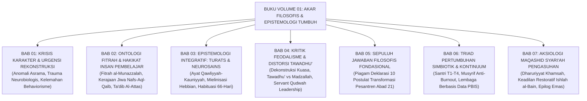

# SERI BUKU MASTER EKOSISTEM TUMBUH PESANTREN — VOLUME 01
# AKAR FILOSOFIS & EPISTEMOLOGI PENDIDIKAN KARAKTER PESANTREN
## *Sintesis Integratif Turats Nabawi, Ontologi Fitrah al-Munazzalah, Neurosains Kognitif, dan Kritik Humanistik Pengasuhan Asrama 24-Jam*

**Kode Koleksi Master**: `BOOK-SERIES/VOL-01/FILOSOFIS-EPISTEMOLOGI/2026/MASTER-COMPLETE`  
**Klasifikasi**: Buku Teks Monograf Induk, Filsafat Pendidikan Islam, & Arsitektur Kebijakan Pesantren  
**Dewan Pakar Pengkaji**: Dewan Pakar Ekosistem TUMBUH (*Master Author, Pakar Filosofi TUMBUH, Pakar Epistemologi Turats, Pakar Neurosains Perkembangan, Pakar Tata Kelola Qudwah, Pakar Arsitektur PBIS, Pakar Perlindungan Anak*)

---

## 📖 KATA PENGANTAR DEWAN REDAKSI KEILMUAN

Buku **Volume 01: Akar Filosofis & Epistemologi Pendidikan Karakter Pesantren** adalah kitab induk fondasional yang meletakkan dasar-dasar ontologis, epistemologis, dan aksiologis bagi seluruh arsitektur **Sistem TUMBUH**.

Buku ini hadir sebagai jawaban atas kegelisahan para kiai, pimpinan pondok, asatidz, dan wali santri di seluruh Nusantara yang menyaksikan paradoks dunia pesantren: bagaimana mungkin lembaga yang mengajarkan keluhuran adab dan kemuliaan hadits nabawi terkadang masih dinodai oleh fenomena kekerasan fisik, perpeloncoan feodal, dan kelelahan kronis para pengasuhnya?

Melalui 7 Bab Utama dan 35 Sub-Bab Tematik yang terstruktur rapi, buku ini membongkar akar masalah patologi pendidikan tradisional, merekonstruksi kesucian fitrah santri, menyatukan wahyu (*Ayat Qawliyyah*) dengan neurosains (*Ayat Kauniyyah*), meruntuhkan feodalisme kepemimpinan menuju *Servant Qudwah Leadership*, memancangkan sepuluh postulat fondasional, merajut Triad Pertumbuhan Simbiotik 24 jam, serta menegakkan kemuliaan Maqashid Syari'ah dan Keadilan Restoratif *Ishlah al-Bain*.

---

## 📑 DAFTAR ISI LENGKAP BUKU VOLUME 01 (7 BAB & 35 SUB-BAB)

<b>Gambar Induk:</b> Peta Arsitektur Tujuh Bab Monograf Buku Volume 01 Ekosistem TUMBUH.

---

### [BAB 01: KRISIS KARAKTER, PATOLOGI PENDIDIKAN, & URGENSI REKONSTRUKSI](file:///c:/xampp/htdocs/tumbuh/BOOK-SERIES/Volume-01/Bab-01-Krisis-Karakter-dan-Urgensi-Rekonstruksi/README.md)
* **[Sub-Bab 1.1: Anomali Pendidikan Karakter Tradisional: Diskoneksi Teori vs Praktik](file:///c:/xampp/htdocs/tumbuh/BOOK-SERIES/Volume-01/Bab-01-Krisis-Karakter-dan-Urgensi-Rekonstruksi/01-Anomali-Pendidikan-Karakter-Tradisional.md)** — Membedah jurang pemisah antara ruang kelas hafalan dan kehidupan nyata bilik asrama, memori deklaratif vs prosedural.
* **[Sub-Bab 1.2: Fenomenologi Kekerasan & Senioritas Feodal di Balik Doktrin Kepatuhan](file:///c:/xampp/htdocs/tumbuh/BOOK-SERIES/Volume-01/Bab-01-Krisis-Karakter-dan-Urgensi-Rekonstruksi/02-Fenomenologi-Kekerasan-dan-Senioritas-Feodal.md)** — Membongkar mitos penempaan mental baja, piramida kekerasan Johan Galtung, dan kritik Ibnu Khaldun.
* **[Sub-Bab 1.3: Dampak Neurobiologis Trauma & Kelumpuhan Korteks Prefrontal (PFC)](file:///c:/xampp/htdocs/tumbuh/BOOK-SERIES/Volume-01/Bab-01-Krisis-Karakter-dan-Urgensi-Rekonstruksi/03-Dampak-Neurobiologis-Trauma-dan-Kelumpuhan-PFC.md)** — Analogi mesin balap 500 HP vs rem ontel, pembajakan amigdala 12 ms, kaskade kortisol, dan Teori Polivagal.
* **[Sub-Bab 1.4: Kelemahan Behaviorisme Sekuler & Kehampaan Ruhani Pembiasaan Mekanis](file:///c:/xampp/htdocs/tumbuh/BOOK-SERIES/Volume-01/Bab-01-Krisis-Karakter-dan-Urgensi-Rekonstruksi/04-Kelemahan-Behaviorisme-Sekuler-dan-Kehampaan-Ruhani.md)** — Mengapa token reward gagal menumbuhkan keikhlasan, overjustification effect, dan Muraqabatullah.
* **[Sub-Bab 1.5: Urgensi Rekonstruksi Paradigma Menuju Ekosistem Karakter TUMBUH](file:///c:/xampp/htdocs/tumbuh/BOOK-SERIES/Volume-01/Bab-01-Krisis-Karakter-dan-Urgensi-Rekonstruksi/05-Urgensi-Rekonstruksi-Paradigma-Menuju-TUMBUH.md)** — Deklarasi 6 Pilar TUMBUH, matriks komparasi paradigma, dan roadmap 5 Volume Buku Master.

---

### [BAB 02: ONTOLOGI FITRAH & HAKIKAT INSAN PEMBELAJAR DALAM ISLAM](file:///c:/xampp/htdocs/tumbuh/BOOK-SERIES/Volume-01/Bab-02-Ontologi-Fitrah-dan-Hakikat-Insan-Pembelajar/README.md)
* **[Sub-Bab 2.1: Konsep Fitrah al-Munazzalah & Kesucian Primordial](file:///c:/xampp/htdocs/tumbuh/BOOK-SERIES/Volume-01/Bab-02-Ontologi-Fitrah-dan-Hakikat-Insan-Pembelajar/01-Konsep-Fitrah-al-Munazzalah.md)** — Perjanjian Azali (*Al-Mithaq* QS. Al-A'raf: 172), bantahan Dosa Asal dan Tabula Rasa Locke, riset moral bawaan Yale.
* **[Sub-Bab 2.2: Struktur Psiko-Spiritual: Dinamika Nafs, Aql, & Qalb](file:///c:/xampp/htdocs/tumbuh/BOOK-SERIES/Volume-01/Bab-02-Ontologi-Fitrah-dan-Hakikat-Insan-Pembelajar/02-Struktur-Psiko-Spiritual-Nafs-Aql-Qalb.md)** — Metafora kerajaan jiwa Imam Al-Ghazali, model Plato vs Islam, integrasi neurokardiologi sumbu jantung-otak.
* **[Sub-Bab 2.3: Tingkatan Nafs: Dari Ammarah Menuju Mutma'innah](file:///c:/xampp/htdocs/tumbuh/BOOK-SERIES/Volume-01/Bab-02-Ontologi-Fitrah-dan-Hakikat-Insan-Pembelajar/03-Tingkatan-Nafs-Ammarah-Lawwamah-Mutmainnah.md)** — Tangga pendakian tiga kualitas nafs, syarah Ibn al-Qayyim, komparasi tahap moral Kohlberg, diferensial TUMBUH.
* **[Sub-Bab 2.4: Rekonstruksi Ta'dib, Tarbiyah, & Ta'lim](file:///c:/xampp/htdocs/tumbuh/BOOK-SERIES/Volume-01/Bab-02-Ontologi-Fitrah-dan-Hakikat-Insan-Pembelajar/04-Rekonstruksi-Tadib-Tarbiyah-Talim.md)** — Pemikiran Prof. Naquib Al-Attas, Ta'dib sebagai mahkota pendidikan, 5 dimensi relasi adab, kurikulum 24 jam.
* **[Sub-Bab 2.5: Implikasi Ontologis Rancangan Bi'ah Shalihah](file:///c:/xampp/htdocs/tumbuh/BOOK-SERIES/Volume-01/Bab-02-Ontologi-Fitrah-dan-Hakikat-Insan-Pembelajar/05-Implikasi-Ontologis-Rancangan-Biah-Shalihah.md)** — Tiga lapis rekayasa ekologi, *Broken Windows Theory*, eliminasi titik buta (*hotspots*), asrama rumah kedua.

---

### [BAB 03: EPISTEMOLOGI INTEGRATIF: TURATS NABAWI & NEUROSAINS KOGNITIF](file:///c:/xampp/htdocs/tumbuh/BOOK-SERIES/Volume-01/Bab-03-Epistemologi-Integratif-Turats-dan-Neurosains/README.md)
* **[Sub-Bab 3.1: Integrasi Ayat Qawliyyah & Kauniyyah](file:///c:/xampp/htdocs/tumbuh/BOOK-SERIES/Volume-01/Bab-03-Epistemologi-Integratif-Turats-dan-Neurosains/01-Integrasi-Ayat-Kauniyyah-dan-Qawliyyah.md)** — Runtuhnya sekat dikotomi ilmu, Fashl al-Maqal Ibnu Rusyd, kritik sekularisme dan tekstualisme kaku.
* **[Sub-Bab 3.2: Neurosains Pembiasaan Adab & Neuroplastisitas](file:///c:/xampp/htdocs/tumbuh/BOOK-SERIES/Volume-01/Bab-03-Epistemologi-Integratif-Turats-dan-Neurosains/02-Neurosains-Pembiasaan-Adab-dan-Neuroplastisitas.md)** — Hukum Hebbian, proses mielinisasi jalan tol saraf, konsep *Riyadhatun Nafs* dan *Al-I'tiyad* Al-Ghazali.
* **[Sub-Bab 3.3: Siklus Habit Loop & Trajektori 66-Hari](file:///c:/xampp/htdocs/tumbuh/BOOK-SERIES/Volume-01/Bab-03-Epistemologi-Integratif-Turats-dan-Neurosains/03-Siklus-Habit-Loop-66-Hari.md)** — Membongkar mitos 21 hari, riset UCL 66 hari Dr. Phillippa Lally, 3 fase habituasi asrama, Logbook PBIS.
* **[Sub-Bab 3.4: Mujahadatun Nafs vs Executive Function](file:///c:/xampp/htdocs/tumbuh/BOOK-SERIES/Volume-01/Bab-03-Epistemologi-Integratif-Turats-dan-Neurosains/04-Mujahadatun-Nafs-vs-Executive-Function.md)** — Pengendalian impuls (*Inhibitory Control*), riset *Ego Depletion* Baumeister, manajemen energi kemauan.
* **[Sub-Bab 3.5: Desain Halaqah Berbasis Cara Kerja Otak](file:///c:/xampp/htdocs/tumbuh/BOOK-SERIES/Volume-01/Bab-03-Epistemologi-Integratif-Turats-dan-Neurosains/05-Desain-Halaqah-Berbasis-Cara-Kerja-Otak.md)** — *Cognitive Load Theory* John Sweller, *Spaced Repetition*, kejeniusan sorogan salaf, siklus halaqah 4-tahap.

---

### [BAB 04: KRITIK TERHADAP FEODALISME & DISTORSI MAKNA TAWADHU'](file:///c:/xampp/htdocs/tumbuh/BOOK-SERIES/Volume-01/Bab-04-Kritik-Feodalisme-dan-Distorsi-Tawadhu/README.md)
* **[Sub-Bab 4.1: Dekonstruksi Relasi Kuasa Asimetris](file:///c:/xampp/htdocs/tumbuh/BOOK-SERIES/Volume-01/Bab-04-Kritik-Feodalisme-dan-Distorsi-Tawadhu/01-Dekonstruksi-Relasi-Kuasa-Asimetris.md)** — Membongkar hegemoni otoriter Foucault, teladan agung Rasulullah SAW meruntuhkan kasta, Servant Leadership.
* **[Sub-Bab 4.2: Distorsi Tawadhu' & Ihtiram](file:///c:/xampp/htdocs/tumbuh/BOOK-SERIES/Volume-01/Bab-04-Kritik-Feodalisme-dan-Distorsi-Tawadhu/02-Distorsi-Tawadhu-dan-Ihtiram.md)** — Meluruskan salah kaprah tawadhu' vs kehinaan diri (*Madzallah*), kaidah emas Al-Ghazali, komunikasi asertif.
* **[Sub-Bab 4.3: Kekerasan Simbolik & Perpeloncoan Senioritas](file:///c:/xampp/htdocs/tumbuh/BOOK-SERIES/Volume-01/Bab-04-Kritik-Feodalisme-dan-Distorsi-Tawadhu/03-Kekerasan-Simbolik-dan-Perpeloncoan-Senioritas.md)** — Mikroagresi tak kasat mata Pierre Bourdieu, dekonstruksi kata "khidmah", dACC nyeri otak perundungan.
* **[Sub-Bab 4.4: Model Servant Qudwah Leadership](file:///c:/xampp/htdocs/tumbuh/BOOK-SERIES/Volume-01/Bab-04-Kritik-Feodalisme-dan-Distorsi-Tawadhu/04-Model-Servant-Qudwah-Leadership.md)** — *Sayyidul Qawmi Khadimuhum*, piramida terbalik kepemimpinan, pembubaran mahkamah gelap senior, kaderisasi santri.
* **[Sub-Bab 4.5: Transformasi Organisasi Santri Pengayom](file:///c:/xampp/htdocs/tumbuh/BOOK-SERIES/Volume-01/Bab-04-Kritik-Feodalisme-dan-Distorsi-Tawadhu/05-Transformasi-Organisasi-Santri-Pengayom.md)** — Restrukturisasi OSIS/OPPM, 4 departemen layanan kreatif, protokol mediasi sebaya (*Peer Mediation*).

---

### [BAB 05: SEPULUH JAWABAN FILOSOFIS FONDASIONAL EKOSISTEM TUMBUH](file:///c:/xampp/htdocs/tumbuh/BOOK-SERIES/Volume-01/Bab-05-Sepuluh-Jawaban-Filosofis-Ekosistem-TUMBUH/README.md)
* **[Sub-Bab 5.1: Postulat 1 s.d. 3: Hakikat Santri, Pendidik, & Tujuan Akhir](file:///c:/xampp/htdocs/tumbuh/BOOK-SERIES/Volume-01/Bab-05-Sepuluh-Jawaban-Filosofis-Ekosistem-TUMBUH/01-Postulat-1-sd-3-Hakikat-Santri-Pendidik-Tujuan.md)** — Santri berfitrah suci bermartabat, mandat musyrif *In Loco Parentis* & *Qudwah*, profil Insan Adabi.
* **[Sub-Bab 5.2: Postulat 4 s.d. 6: Sumber Nilai, Perubahan, & Disiplin](file:///c:/xampp/htdocs/tumbuh/BOOK-SERIES/Volume-01/Bab-05-Sepuluh-Jawaban-Filosofis-Ekosistem-TUMBUH/02-Postulat-4-sd-6-Sumber-Nilai-Perubahan-Disiplin.md)** — Sinergi wahyu & neurosains, trajektori habituasi 66-hari, disiplin restoratif *Firm & Kind* 4R.
* **[Sub-Bab 5.3: Postulat 7 & 8: Ekosistem Total & Restorasi Kesalahan](file:///c:/xampp/htdocs/tumbuh/BOOK-SERIES/Volume-01/Bab-05-Sepuluh-Jawaban-Filosofis-Ekosistem-TUMBUH/03-Postulat-7-sd-8-Total-Ecosystem-dan-Restorasi-Kesalahan.md)** — Asrama 24-jam Bi'ah Shalihah, paradigma kesalahan sebagai *Learning Opportunity* & restitusi.
* **[Sub-Bab 5.4: Postulat 9 & 10: Kesejahteraan Pendidik & Visi Global](file:///c:/xampp/htdocs/tumbuh/BOOK-SERIES/Volume-01/Bab-05-Sepuluh-Jawaban-Filosofis-Ekosistem-TUMBUH/04-Postulat-9-sd-10-Kesejahteraan-Pendidik-dan-Visi-Global.md)** — Perlindungan musyrif anti-burnout, triad simbiotik, visi pesantren rahmatan lil 'alamin.
* **[Sub-Bab 5.5: Manifesto Filosofis TUMBUH bagi Pesantren](file:///c:/xampp/htdocs/tumbuh/BOOK-SERIES/Volume-01/Bab-05-Sepuluh-Jawaban-Filosofis-Ekosistem-TUMBUH/05-Manifesto-Filosofis-TUMBUH-bagi-Pesantren.md)** — Piagam deklarasi sepuluh postulat fondasional bagi kebangkitan peradaban pesantren abad 21.

---

### [BAB 06: TRIAD PERTUMBUHAN SIMBIOTIK & KONTINUUM 10-TAHAP](file:///c:/xampp/htdocs/tumbuh/BOOK-SERIES/Volume-01/Bab-06-Triad-Pertumbuhan-Simbiotik-dan-Kontinuum-10-Tahap/README.md)
* **[Sub-Bab 6.1: Santri Bertumbuh: Tangga Kapasitas T1 s.d. T4](file:///c:/xampp/htdocs/tumbuh/BOOK-SERIES/Volume-01/Bab-06-Triad-Pertumbuhan-Simbiotik-dan-Kontinuum-10-Tahap/01-Santri-Bertumbuh-Tangga-T1-sd-T4.md)** — T1 Tahu Adab, T2 Mau Beradab, T3 Mampu Beradab Mandiri, T4 Teladan Penggerak Adab.
* **[Sub-Bab 6.2: Pendidik & Musyrif Bertumbuh: Anti-Burnout](file:///c:/xampp/htdocs/tumbuh/BOOK-SERIES/Volume-01/Bab-06-Triad-Pertumbuhan-Simbiotik-dan-Kontinuum-10-Tahap/02-Pendidik-Musyrif-Bertumbuh-Anti-Burnout.md)** — Kompetensi pedagogi, regulasi emosi pembina (*Calm Presence*), proteksi jadwal libur & shift.
* **[Sub-Bab 6.3: Sistem Lembaga Bertumbuh: Berbasis Data](file:///c:/xampp/htdocs/tumbuh/BOOK-SERIES/Volume-01/Bab-06-Triad-Pertumbuhan-Simbiotik-dan-Kontinuum-10-Tahap/03-Sistem-Lembaga-Bertumbuh-Berbasis-Data.md)** — Organisasi pembelajar, analitik logbook PBIS digital, deteksi dini masalah, keputusan berbasis bukti.
* **[Sub-Bab 6.4: Kontinuum 10-Tahap Ekosistem TUMBUH](file:///c:/xampp/htdocs/tumbuh/BOOK-SERIES/Volume-01/Bab-06-Triad-Pertumbuhan-Simbiotik-dan-Kontinuum-10-Tahap/04-Kontinuum-10-Tahap-Ekosistem-TUMBUH.md)** — Trajektori longitudinal: Tahap 1-4 individual, Tahap 5-7 kepemimpinan, Tahap 8-10 kelembagaan.
* **[Sub-Bab 6.5: Sinergi Simbiotik Pengasuhan 24-Jam](file:///c:/xampp/htdocs/tumbuh/BOOK-SERIES/Volume-01/Bab-06-Triad-Pertumbuhan-Simbiotik-dan-Kontinuum-10-Tahap/05-Sinergi-Simbiotik-Pengasuhan-24-Jam.md)** — Integrasi Dual-Pillar Walas & Musyrif, protokol Handover 15-menit (06.45 & 16.00 WIB), harmoni triad.

---

### [BAB 07: AKSIOLOGI & MAQASHID SYARI'AH DALAM BUDAYA PESANTREN](file:///c:/xampp/htdocs/tumbuh/BOOK-SERIES/Volume-01/Bab-07-Aksiologi-dan-Maqashid-Syariah-Pengasuhan/README.md)
* **[Sub-Bab 7.1: Dimensi Aksiologis & Maqashid Syari'ah Pengasuhan](file:///c:/xampp/htdocs/tumbuh/BOOK-SERIES/Volume-01/Bab-07-Aksiologi-dan-Maqashid-Syariah-Pengasuhan/01-Dimensi-Aksiologis-dan-Maqashid-Syariah.md)** — Kemaslahatan primer (*Jalbul Mashalih*), hierarki Dharuriyyat, Hajiyyat, Tahsiniyyat.
* **[Sub-Bab 7.2: Integrasi Lima Prinsip Dharuriyyat Pengasuhan](file:///c:/xampp/htdocs/tumbuh/BOOK-SERIES/Volume-01/Bab-07-Aksiologi-dan-Maqashid-Syariah-Pengasuhan/02-Integrasi-Lima-Prinsip-Dharuriyyat-Pengasuhan.md)** — Panca perlindungan hak santri: Hifzhud Din, Nafs, Aql, Irdh, dan Mal dalam asrama 24 jam.
* **[Sub-Bab 7.3: Keadilan Restoratif Islam & Ishlah al-Bain](file:///c:/xampp/htdocs/tumbuh/BOOK-SERIES/Volume-01/Bab-07-Aksiologi-dan-Maqashid-Syariah-Pengasuhan/03-Keadilan-Restoratif-Islam-dan-Ishlah-al-Bain.md)** — Rekonsiliasi QS. Al-Hujurat: 10, pengakuan khilaf (*I'tiraf*), restitusi ganti rugi, bebas stigma.
* **[Sub-Bab 7.4: Eliminasi Hukuman Fisik secara Fiqhiyyah](file:///c:/xampp/htdocs/tumbuh/BOOK-SERIES/Volume-01/Bab-07-Aksiologi-dan-Maqashid-Syariah-Pengasuhan/04-Eliminasi-Hukuman-Fisik-secara-Fiqhiyyah.md)** — Syarah hadits pemukulan anak, kaidah *Sadd adz-Dzari'ah*, penghapusan mutlak rotan & tamparan.
* **[Sub-Bab 7.5: Epilog Volume 01: Pesantren Masa Depan sebagai Mercusuar Peradaban](file:///c:/xampp/htdocs/tumbuh/BOOK-SERIES/Volume-01/Bab-07-Aksiologi-dan-Maqashid-Syariah-Pengasuhan/05-Epilog-Pesantren-Masa-Depan-Mercusuar-Peradaban.md)** — Grand synthesis 7 bab, futurologi pesantren emas, dan seruan transformasi peradaban rahmatan lil 'alamin.

---

## 🏛️ SINTESIS AKBAR: PONDASI KOKOH BAGI VOLUME BERIKUTNYA

Dengan tuntasnya penulisan **Volume 01: Akar Filosofis & Epistemologi Pendidikan Karakter Pesantren**, Ekosistem TUMBUH kini telah memiliki **fondasi batu karang teologis dan ilmiah yang kokoh**.

Volume 01 ini menjadi landasan pacu bagi 4 Volume Buku Master berikutnya dalam Seri Ekosistem TUMBUH:
* **Volume 02**: *Arsitektur Sistem & Rekayasa Ekologi Pesantren (SW-PBIS Multi-Tier & Bi'ah Shalihah)*.
* **Volume 03**: *Pedagogi Guru Master & Pembelajaran Adab Berbasis Otak*.
* **Volume 04**: *Pengasuhan Asrama 24-Jam, Disiplin Restoratif 4R, & Perlindungan Anak*.
* **Volume 05**: *Manual Pelaksanaan Lapangan, Logbook Musyrif Digital, & Standar Operasional Prosedur (SOP)*.

---

$$\text{الْحَمْدُ لِلَّهِ الَّذِي بِنِعْمَتِهِ تَتِمُّ الصَّالِحَاتُ}$$
*"Segala puji bagi Allah yang dengan nikmat-Nya sempurnalah segala amal kebajikan."*
