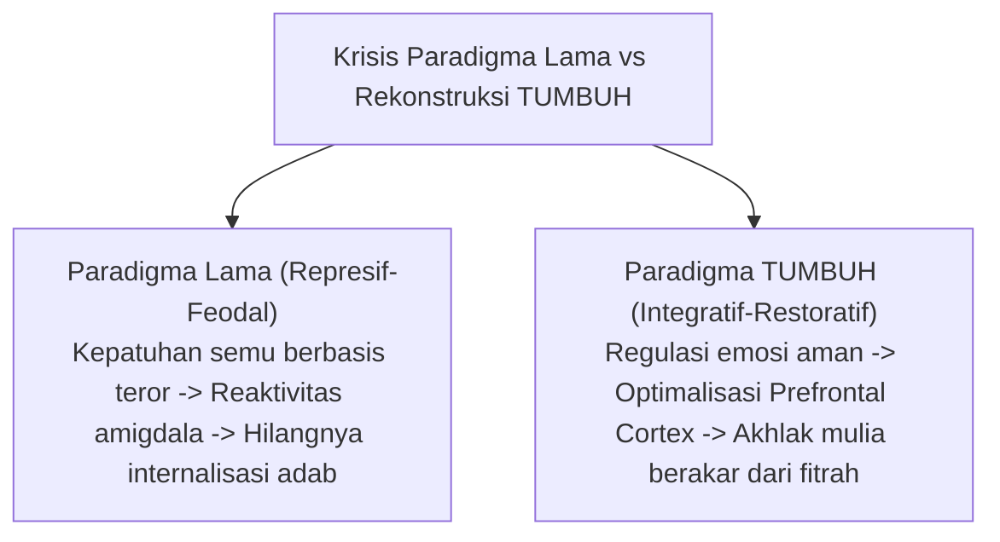
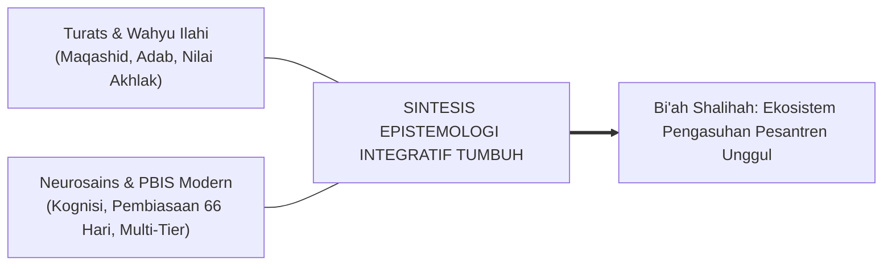
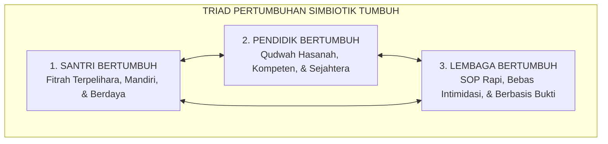

# SERI BUKU EKOSISTEM TUMBUH PESANTREN — VOLUME 01
# AKAR FILOSOFIS & EPISTEMOLOGI PENDIDIKAN KARAKTER PESANTREN
## *Sintesis Integratif Turats Klasik, Ontologi Fitrah, Neurosains Kognitif, dan Kritik Humanistik Pengasuhan 24-Jam*

**Nomor Identifikasi**: `BOOK-SERIES/VOL-01/FILOSOFIS-EPISTEMOLOGI/2026`  
**Klasifikasi**: Monograf Riset Akademis & Buku Teks Filsafat Pendidikan Pesantren  
**Dewan Pakar Pengkaji**: `pakar-filosofi-tumbuh`, `pakar-epistemologi-turats`, `pakar-neurosains-perkembangan`, `pakar-tata-kelola-qudwah`

---

## 📑 DAFTAR ISI VOLUME 01

1. **BAB 1: Krisis Karakter, Patologi Pendidikan, dan Urgensi Rekonstruksi Ekosistem Pesantren**
   - 1.1 Anomali Pendidikan Karakter Tradisional: Diskoneksi antara Ritual dan Realisasi Adab
   - 1.2 Fenomenologi Kekerasan dan Senioritas Feodal di Balik Doktrin Kepatuhan Buta
   - 1.3 Kelemahan Reduksionisme Behaviorisme Sekuler dan Kehampaan Spiritual
2. **BAB 2: Ontologi Fitrah dan Hakikat Insan Pembelajar dalam Khazanah Islam**
   - 2.1 Konsep *Fitrah al-Munazzalah*: Potensi Suci Bawaan yang Membutuhkan Ekosistem Penjaga
   - 2.2 Struktur Psiko-Spiritual Manusia: Dinamika *Nafs* (Ammarah, Lawwamah, Mutma'innah), *Aql*, dan *Qalb*
   - 2.3 *Ta'dib*, *Tarbiyah*, dan *Ta'lim*: Rekonstruksi Terminologis Menurut Imam Al-Attas dan Al-Ghazali
3. **BAB 3: Epistemologi Integratif: Menautkan Turats Nabawi dengan Neurosains Kognitif Modern**
   - 3.1 Integrasi Dua Sayap Pengetahuan: *Ayat Kauniyyah* (Sains Perkembangan) dan *Ayat Qawliyyah* (Wahyu)
   - 3.2 Neurosains Pembiasaan Adab: Neuroplastisitas, Jalur Dopaminergik, dan Korteks Prefrontal
   - 3.3 Penyelarasan Konsep *Mujahadatun Linafsih* dengan *Executive Function* & *Self-Regulation*
4. **BAB 4: Kritik Terhadap Feodalisme, Kekerasan Simbolik, dan Distorsi Makna Tawadhu'**
   - 4.1 Dekonstruksi Feodalisme Pengasuhan: Mengapa Intimidasi Menghancurkan Fitrah Santri
   - 4.2 Distorsi Konsep *Ihtiram*: Membedakan Adab Luhur Berbasis Cinta dan Ketaatan Semu Berbasis Teror
   - 4.3 Menghapus Relasi Hirarkis Represif Menuju Kepemimpinan Melayani (*Servant Qudwah Leadership*)
5. **BAB 5: Sepuluh Jawaban Filosofis Fondasional Ekosistem TUMBUH**
   - 5.1 Hakikat Manusia, Tujuan Pendidikan, dan Orientasi Akhirat yang Fungsional di Dunia
   - 5.2 Sumber Otoritas Moral, Posisi Kehendak Bebas Santri, dan Penghormatan Keunikan Individu
   - 5.3 Peran Lingkungan (*Bi'ah Shalihah*) sebagai Ruang Aman Perkembangan Holistik
6. **BAB 6: Triad Pertumbuhan Simbiotik: Santri, Pendidik, dan Lembaga Bertumbuh Serempak**
   - 6.1 Kegagalan Paradigma Satu Arah: Pendidik sebagai Hakim vs Pendidik sebagai *Qudwah*
   - 6.2 Santri Bertumbuh (Tangga T1–T4), Pendidik/Musyrif Bertumbuh (Anti-Burnout), Lembaga Bertumbuh
   - 6.3 Kontinuum 10 Tahap Pertumbuhan: Dari Santri Adaptatif hingga Pemimpin Pemberdaya
7. **BAB 7: Aksiologi dan Maqashid Syari'ah dalam Penataan Budaya Pesantren**
   - 7.1 Hifzh an-Nafs (Perlindungan Jiwa/Raga) dan Hifzh al-'Aql (Perlindungan Akal) sebagai Fondasi Adab
   - 7.2 Disiplin Restoratif (*Ishlah al-Bain*) sebagai Manifestasi Utama Keadilan dan Rahmat Islam
   - 7.3 Epilog: Pesantren Masa Depan sebagai Mercusuar Peradaban Luhur Tanpa Kekerasan

---

## 🏛️ IKHTISAR DAN TEKS MONOGRAF BAB PER BAB

### BAB 1: Krisis Karakter, Patologi Pendidikan, dan Urgensi Rekonstruksi Ekosistem Pesantren

Pendidikan karakter di berbagai lembaga pendidikan Islam berasrama kerap kali terjebak dalam dikotomi yang merugikan: di satu sisi mempertahankan tradisi kepatuhan tanpa telaah kritis terhadap metode yang digunakan, di sisi lain mengadopsi model psikologi sekuler yang menanggalkan dimensi ruhani. Fenomena kekerasan fisik, intimidasi verbal berdalih penegakan disiplin, dan hierarki senioritas feodal tidak jarang dibiarkan terjadi dengan justifikasi "membentuk mental baja".

Padahal, riset neurobiologi trauma secara konsisten menunjukkan bahwa lingkungan belajar yang dipenuhi ketakutan mengaktifkan amigdala secara kronis (*fight-or-flight response*), yang pada gilirannya melumpuhkan fungsi korteks prefrontal—wilayah otak yang bertanggung jawab atas penalaran moral tingkat tinggi (*moral reasoning*), pengendalian impuls, dan empati. Kepatuhan yang lahir dari ancaman fisik atau pembentakan bukanlah cerminan akhlak (*khuluq*), melainkan sekadar mekanisme bertahan hidup (*survival compliance*). Begitu pengawasan eksternal lenyap, santri cenderung mengalami pelepasan kontrol moral (*moral disengagement*).

### BAB 2: Ontologi Fitrah dan Hakikat Insan Pembelajar dalam Khazanah Islam

Islam memandang manusia lahir dalam keadaan **fitrah**—kondisi kesucian primordial yang memuat kecenderungan alami menuju kebenaran (*hanif*), keindahan, dan tauhid (QS. Ar-Rum: 30). Manusia bukanlah bejana kosong (*tabula rasa*) yang pasif, melainkan benih ilahiah yang mengandung potensi tak terbatas untuk bertumbuh. 

Proses pembinaan karakter dalam Islam terangkum dalam tiga pilar terminologis:
1. **Ta'lim**: Transmisi pengetahuan dan penguasaan konsep rasional.
2. **Tarbiyah**: Pemeliharaan, pengasuhan fisik, emosi, dan sosial secara bertahap menuju kematangan.
3. **Ta'dib**: Penanaman adab dan tata krama moral yang menempatkan segala sesuatu pada maqam (posisi) yang adil dan benar di hadapan Allah dan sesama makhluk.

Jiwa manusia (*nafs*) bergerak secara dinamis melintasi tiga etape: dari *Nafs Ammarah bi as-Su'* (dorongan hawa nafsu primitif), *Nafs Lawwamah* (kesadaran muhasabah diri yang mengoreksi kesalahan), hingga *Nafs Mutma'innah* (ketenangan batin yang istiqamah dalam kebajikan). Ekosistem pesantren bertugas menyediakan *Bi'ah Shalihah* yang memfasilitasi transisi psiko-spiritual ini secara bertahap dan penuh kasih sayang.

### BAB 3: Epistemologi Integratif: Menautkan Turats Nabawi dengan Neurosains Kognitif Modern

Epistemologi TUMBUH menolak dikotomi antara ilmu agama (*naqliyyah*) dan ilmu sains empiris (*aqliyyah*). Wahyu memberikan fondasi teleologis dan nilai aksiologis mutlak, sementara sains modern menyediakan instrumen observasional untuk memahami mekanisme biologis dan psikologis bagaimana manusia belajar dan berubah.

Pembentukan karakter adab identik dengan proses **neuroplastisitas**. Ketika santri melatih kesabaran, antre wudhu, menahan amarah, dan menepati waktu secara berulang selama 66 hari (siklus pembentukan kebiasaan otomatis), sinapsis saraf di otak mengalami mielinisasi yang memperkuat sirkuit kendali diri (*self-regulation circuit*). Konsep *mujahadatun nafs* klasik menemukan padanan saintifiknya pada latihan *executive functioning* dan penguatan inhibisi respon korteks prefrontal.

### BAB 4: Kritik Terhadap Feodalisme, Kekerasan Simbolik, dan Distorsi Makna Tawadhu'

Tradisi pesantren memiliki nilai luhur berupa penghormatan kepada guru (*ihtiram al-ustadz*). Namun, dalam praktik lapangan tertentu, nilai ini mengalami distorsi menjadi feodalisme kaku dan relasi kuasa asimetris yang melahirkan kekerasan simbolik (*symbolic violence*). Senioritas yang melegalkan perpeloncoan santri baru dengan dalih "kaderisasi" bertentangan secara diametral dengan teladan Rasulullah SAW.

Rasulullah SAW memimpin bukan dengan teror atau menciptakan jarak kekuasaan, melainkan dengan **Qudwah Hasanah** dan kerendahhatian (*rahmatan lil 'alamin*). Menghormati guru lahir dari kekaguman atas keilmuan dan keteladanan akhlak pendidik (*adab al-mu'allim*), bukan dari intimidasi struktural. Pendidik TUMBUH menerapkan kepemimpinan melayani (*servant leadership*), di mana musyrif dan guru hadir sebagai pelindung, pembimbing (*murabbi*), dan fasilitator pertumbuhan santri.

### BAB 5: Sepuluh Jawaban Filosofis Fondasional Ekosistem TUMBUH

Ekosistem TUMBUH menjawab 10 pertanyaan mendasar filsafat pendidikan:
1. **Hakikat Santri**: Makhluk mulia berfitrah tauhid yang memiliki potensi kebajikan intrinsik.
2. **Hakikat Pendidik**: *Qudwah* dan pemegang amanah keorangtuaan (*in loco parentis*) yang membimbing dengan kelembutan yang tegas (*firm and kind*).
3. **Tujuan Pendidikan**: Melahirkan *Insan Kamil* yang beradab, mandiri, dan berdaya guna bagi ummat (*Nafi'un Lighairihi*).
4. **Sumber Nilai**: Al-Qur'an, As-Sunnah, ijma' ulama, dan konsensus sains yang selaras dengan nilai kemanusiaan universal.
5. **Dinamika Perubahan Perilaku**: Perubahan adab terjadi melalui rekayasa lingkungan positif (*environmental engineering*), pembiasaan sadar, dan pemulihan restoratif—bukan pembalasan dendam.
6. **Hakikat Disiplin**: Pembentukan regulasi diri internal (*internalized self-discipline*), bukan kepatuhan eksternal sesaat.
7. **Peran Komunitas**: Seluruh warga pondok (Kiai, guru, musyrif, koki, petugas keamanan) adalah guru adab terpadu (*school-wide ecosystem*).
8. **Posisi Kesalahan**: Kesalahan adab dipandang sebagai peluang belajar (*learning opportunity*) yang diselesaikan melalui restitusi dan perbaikan relasi.
9. **Kesejahteraan Pendidik**: Guru dan musyrif yang sehat secara mental dan emosional adalah prasyarat mutlak bagi pengasuhan santri yang penuh cinta.
10. **Orientasi Masa Depan**: Santri disiapkan untuk menjadi pemimpin global yang mengakar pada nilai salaf dan adaptif terhadap inovasi peradaban.

### BAB 6: Triad Pertumbuhan Simbiotik: Santri, Pendidik, dan Lembaga Bertumbuh Serempak

Pendidikan yang berkelanjutan menuntut **Triad Pertumbuhan Simbiotik**:
* **Santri Bertumbuh**: Menapaki Tangga T1 (Adaptasi/Ta'aruf) $\rightarrow$ T2 (Habituasi/Ta'awun) $\rightarrow$ T3 (Internalisasi/Tafahum) $\rightarrow$ T4 (Transformasi/Takaful) hingga mencapai Tahap 7 PENGGERAK.
* **Pendidik & Musyrif Bertumbuh**: Mengembangkan kompetensi pedagogi modern, keterampilan konseling restoratif, dan ketahanan emosional (terlindungi dari *burnout* melalui jadwal shift yang proporsional).
* **Sistem Lembaga Bertumbuh**: Menjadi organisasi pembelajar (*learning organization*) yang mengelola data perilaku secara objektif (PBIS), memiliki SOP perlindungan anak (*Safe School Protocols*), dan terus melakukan perbaikan berkelanjutan.

### BAB 7: Aksiologi dan Maqashid Syari'ah dalam Penataan Budaya Pesantren

Segala intervensi dan regulasi di pesantren wajib bermuara pada pemeliharaan lima tujuan syariat (*Maqashid asy-Syari'ah*):
1. **Hifzh ad-Din (Menjaga Agama)**: Menumbuhkan keimanan sadar melalui pembiasaan ibadah khusyuk dan pemahaman aqidah yang kokoh.
2. **Hifzh an-Nafs (Menjaga Jiwa)**: Menjamin keselamatan fisik, martabat mental, dan bebas dari segala bentuk perundungan (*bullying*) serta hukuman fisik.
3. **Hifzh al-'Aql (Menjaga Akal)**: Menyediakan iklim akademik yang merangsang daya nalar kritis, hafalan yang bermakna (*meaningful learning*), dan rasa ingin tahu ilmiah.
4. **Hifzh an-Nasl (Menjaga Keturunan/Kehormatan)**: Membangun etika pergaulan yang santun, menjaga aurat, dan menanamkan penghormatan terhadap batasan pribadi.
5. **Hifzh al-Mal (Menjaga Harta)**: Melatih amanah kepemilikan barang di asrama, kebersihan fasilitas bersama, dan gaya hidup hemat bersahaja (*zuhud* aktif).

Dengan fondasi aksiologis ini, ekosistem TUMBUH memastikan bahwa pesantren bukan hanya menjadi tempat transmisi ilmu agama, melainkan miniatur peradaban Islam yang ramah anak, berkeadilan, dan memuliakan kemanusiaan.
