# BUKU VOLUME 01: AKAR FILOSOFIS & EPISTEMOLOGI PENDIDIKAN KARAKTER PESANTREN
## *Fondasi Teologis, Neurosains Kognitif, dan Rekonstruksi Paradigma Pengasuhan Holistik Ekosistem TUMBUH*

**Seri Monograf Ekosistem TUMBUH Pesantren**  
**Kode Publikasi**: BOOK-SERIES/VOL-01/MONOGRAF-MASTER-VIBRANT  
**Penanggung Jawab Keilmuan**: Dewan Pakar Ekosistem TUMBUH (*Konsorsium 23 Dewan Keilmuan*)  
**Edisi**: Masterwork Edition 2026

---

# SUB-BAB 1.1: ANOMALI PENDIDIKAN KARAKTER TRADISIONAL
## *Menyingkap Tabir Jurang Pemisah antara Hafalan Kitab Adab dan Realitas Perilaku Keseharian di Asrama*

**Kode Klasifikasi**: `BOOK-01/BAB-01/SUB-01/MONOGRAF-MASTER-VIBRANT`  
**Disiplin Ilmu**: Fenomenologi Pendidikan Islam, Neurosains Kognitif Terapan, Sosiologi Pesantren, & Epistemologi Turats  
**Penanggung Jawab Keilmuan**: Dewan Pakar Ekosistem TUMBUH (*Master Author, Pakar Filosofi, Epistemologi Turats, & Neurosains Perkembangan*)

---

### Air Mata di Balik Gerbang dan Tabir Paradoks Pesantren

Setiap awal tahun ajaran baru, sebuah pemandangan yang amat menyentuh kalbu selalu berulang di pelataran pondok-pondok pesantren di seluruh penjuru Nusantara.

Ribuan orang tua berdiri dengan mata berkaca-kaca di bawah terik matahari atau gerimis senja, memeluk erat putra-putri tercinta mereka sebelum melangkah pulang. Tangan seorang ayah yang kasar karena kerja keras memegang pundak anak lelakinya seraya berbisik penuh harap: *"Belajarlah yang sungguh-sungguh di sini, Nak. Jadilah orang yang alim, mandiri, dan berakhlak mulia."* Sementara seorang ibu, dengan suara bergetar menahan tangis perpisahan, menyerahkan buah hatinya kepada kiai dan dewan pengasuh dengan satu keyakinan teguh: di balik gerbang suci pesantren, anaknya akan dijaga, dibimbing, dan ditempa menjadi pribadi yang santun, jujur, berjiwa bersih, serta menghiasi diri dengan kemuliaan akhlak nabawi.

Masyarakat menaruh harapan yang teramat tinggi pada pesantren. Dinding-dinding asrama dipandang sebagai benteng pertahanan moral terakhir yang mampu melindungi generasi muda dari dekadensi zaman. Di pesantrenlah orang tua meyakini anak-anak mereka akan belajar hidup teratur, menghargai sesama, dan mempraktikkan sunnah Rasulullah SAW dalam setiap tarikan napas selama 24 jam penuh.

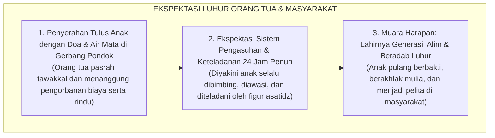
<div align="center"><sub><b>Gambar 1.1.1:</b> Rantai Ekspektasi Luhur Orang Tua saat Menyerahkan Anak ke Pondok Pesantren.</sub></div>

Bagan di atas merangkum impian agung setiap orang tua: anak dititipkan dengan linangan air mata, diyakini akan dikawal akhlaknya siang dan malam oleh para guru teladan, hingga kelak pulang ke rumah membawa mahkota adab dan ilmu yang menyejukkan hati keluarga.

---

Namun, apa yang sebenarnya terjadi Ketika masa orientasi usai dan tirai keseharian pondok dibuka apa adanya? 

Bukan saat acara wisuda akbar yang megah, bukan pula saat kunjungan wali santri di akhir pekan, melainkan pada pukul dua dini hari di lorong asrama yang sunyi, di depan antrean kamar mandi yang sesak saat subuh, atau di balik pintu kamar santri yang tertutup rapat—kita kerap kali menjumpai kenyataan lapangan yang menghentak nurani:

> [!WARNING]
> ### 🔍 Potret Anomali yang Menghentak Nurani:
> Di ruang kelas madrasah pada pagi hari, seorang santri mampu melantunkan bait-bait nadhom *Ta'lim al-Muta'allim* dengan sangat fasih, menghafal matan *Bidayatul Hidayah* di luar kepala, dan meraih nilai 100 (*Mumtaz*) dalam ujian tulis mata pelajaran adab.
> 
> Namun, hanya berselang beberapa menit setelah bel tanda usai pelajaran berbunyi, santri yang sama menampilkan pemandangan yang bertolak belakang di asrama:
> * Ia berlari kencang menyerobot antrean wudhu sambil menyikut kawannya yang bertubuh lebih kecil demi mendapatkan kran air terlebih dahulu.
> * Sepasang sandal milik teman sekamarnya dipakai tanpa izin (*ghashab*) untuk pergi ke kantin, lalu dibiarkan berserakan begitu saja saat selesai digunakan.
> * Gayung mandi disembunyikan di atas plafon kamar mandi atau di kolong kasur agar tidak bisa dipakai santri lain.
> * Pakaian kotor menumpuk berhari-hari di pojok ranjang hingga menebarkan aroma tak sedap.
> * Di dalam bilik asrama pada malam hari, terdengar ejekan yang merendahkan fisik kawan, panggilan nama hewan, hingga pengucilan sosial yang membuat santri yunior menangis tertekan di bawah selimutnya tanpa ada musyrif yang mendampingi.

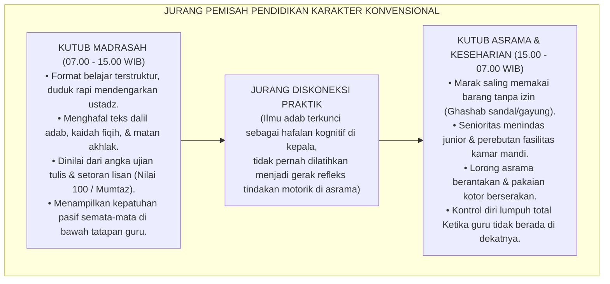
<div align="center"><sub><b>Gambar 1.1.2:</b> Diagram Jurang Pemisah antara Pembelajaran Kelas Madrasah dan Realitas Keseharian Asrama.</sub></div>

Mengapa jurang pemisah di atas bisa terjadi? 

Di ruang madrasah (07.00–15.00 WIB), santri dinilai semata-mata dari kertas ujian. Siapa yang hafal teks dalil, ia langsung dicap berakhlak mulia. Namun di asrama (15.00–07.00 WIB)—yaitu 16 jam kehidupan nyata saat anak lelah, lapar, berebut kamar mandi, dan harus menata ego di kamar tidur—pendampingan guru justru lenyap. Akibatnya, ilmu adab terkunci mati di kepala sebagai teori hafalan, tanpa pernah tersambung menjadi gerak refleks di tangan dan kaki santri saat mereka bergaul dengan kawannya.

---

### Menelusuri Akar Masalah: Mengapa Hafalan Teks Tidak Otomatis Menjadi Akhlak?

Ketika melihat santri berperilaku buruk di asrama, reaksi spontan sebagian pendidik adalah menyalahkan si anak: *"Dasar anak nakal!", "Bebal!", "Tidak punya adab!"*

Namun, jika fenomena ini terjadi serentak di puluhan pondok pesantren, apakah adil jika kita terus menyalahkan anak? Tentu tidak. Masalah sebenarnya terletak pada **kesalahan cara kita mendidik mereka**.

Sains modern di bidang neurosains kognitif memberikan jawaban yang sangat jernih[^1] serta arsitektur kognisi Anderson[^2]. Otak manusia ternyata tidak menyimpan pengetahuan dalam satu laci yang sama, melainkan membaginya ke dalam **dua sirkuit saraf yang terpisah jauh**:

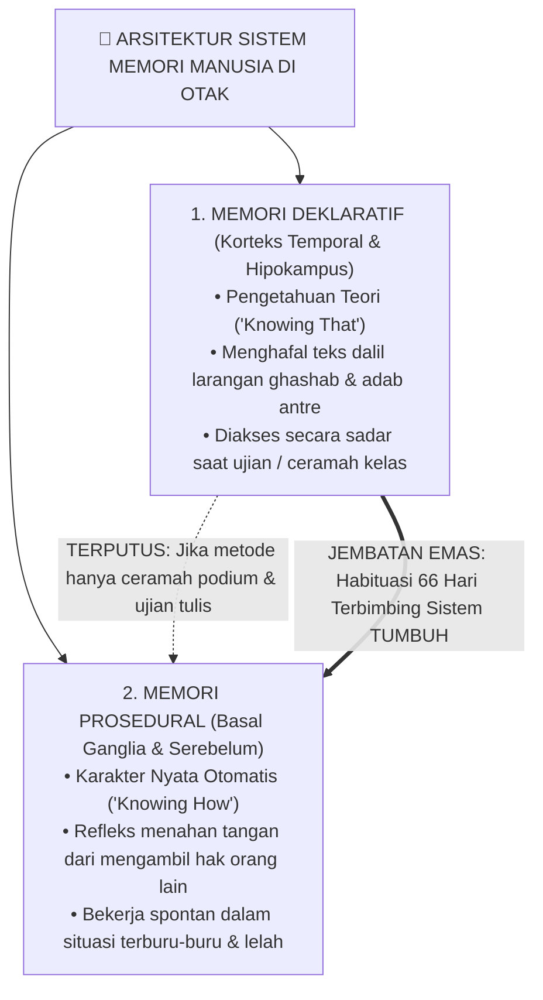
<div align="center"><sub><b>Gambar 1.1.3:</b> Arsitektur Sistem Memori di Otak: Memori Deklaratif (Teori) vs Memori Prosedural (Praktik Refleks).</sub></div>

Sirkuit pertama adalah **Memori Deklaratif (*Korteks Temporal & Hipokampus*)**—tempat tersimpannya teori (*Knowing That*), hafalan nadhom, ayat, dan kaidah fiqih. Sirkuit ini bekerja lambat dan butuh konsentrasi sadar[^3]. Ketika santri ditanya guru di kelas: *"Apa hukum ghashab sandal?"*, hipokampusnya membuka arsip memori dan ia menjawab lancar: *"Haram dan zalim."* Namun, memori deklaratif **tidak memiliki kabel langsung ke otot tindakan spontan**. Saat santri terburu-buru atau kelelahan, nalar sadar mengalami kelebihan beban, sehingga hafalan dalil di kepala tidak sempat mencegah tangannya dari mengambil sandal kawan!

Sirkuit kedua adalah **Memori Prosedural (*Basal Ganglia & Serebelum*)**—tempat bersemayamnya karakter sejati (*Knowing How*). Sirkuit ini bekerja secepat kilat di bawah sadar. Refleks seorang santri yang sedang panik terlambat shalat subuh, namun tetap rela bertelanjang kaki mencari sandalnya sendiri di rak tanpa tergoda memakai sandal temannya—adalah buah dari memori prosedural yang telah terlatih.

> [!IMPORTANT]
> ### 🚗 Analogi Belajar Menyetir Mobil:
> Bayangkan seseorang yang ingin mahir mengemudikan mobil. Ia membaca buku panduan setebal seribu halaman dan menghafal seluruh rambu lalu lintas hingga mendapat nilai 100 sempurna dalam ujian tulis.
> 
> Apakah orang tersebut langsung bisa kita lepas menyetir di jalan raya yang padat dan macet? **Tentu tidak!** Ketika ada motor yang memotong jalurnya secara tiba-tiba, hafalan teori di lembar ujian tidak akan sanggup menyelamatkannya. Otak sadarnya butuh waktu berpikir, sementara kakinya belum memiliki refleks otot untuk menginjak rem dalam hitungan milidetik.
> 
> Hal yang persis sama terjadi pada santri kita: **Menghafal 100 hadits tentang adab tidak akan pernah otomatis melahirkan anak yang berakhlak mulia, kecuali jika adab tersebut dilatihkan secara fisik, didampingi pembina yang hangat, dan dibiasakan berulang-ulang di asrama selama 66 hari berturut-turut hingga mendarah daging.**

---

### Tragedi Hilangnya Hakikat Ta'dib: Kritik Epistemologis Turats

Kesenjangan biologis antara "tahu teori" dan "refleks beramal" ini berakar dari krisis filosofis yang telah lama diperingatkan oleh pemikir pendidikan Islam terkemuka, **Prof. Dr. Syed Muhammad Naquib al-Attas**[^4]. Beliau menyingkap terjadinya kerancuan mendasar dalam memahami tiga pilar pendidikan Islam:

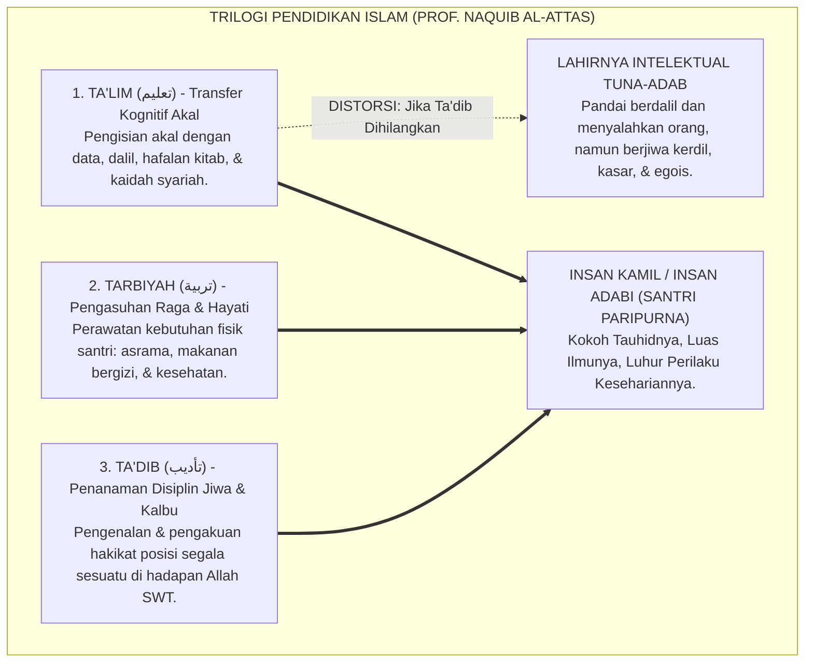
<div align="center"><sub><b>Gambar 1.1.4:</b> Struktur Tiga Ranah Pendidikan Islam dan Dampak Kehancuran Karakter Akibat Hilangnya Pilar Ta'dib.</sub></div>

Al-Attas menjelaskan bahwa pendidikan Islam bertumpu pada tiga ranah yang utuh:
* **Ta'lim (تعليم)** mengasah daya nalar akal melalui transfer ilmu kitab kuning dan ujian madrasah.
* **Tarbiyah (تربية)** merawat fisik dan raga santri melalui penyediaan asrama, makanan, dan sarana hidup.
* **Ta'dib (تأديب)** adalah **jantungnya**, yaitu proses penanaman adab ke dalam kalbu dan jiwa agar santri mampu menempatkan segala sesuatu secara adil di hadapan Allah dan sesama manusia.

Ketika pesantren hanya sibuk dengan *Ta'lim* (mengejar hafalan teks) dan *Tarbiyah* (membangun gedung asrama), namun **mengabaikan proses Ta'dib** di keseharian asrama, maka lahirlah sosok yang sangat berbahaya: *"Intelektual Agama yang Tuna-Adab"*. Yaitu santri yang sangat mahir mendebat dan menyalahkan orang lain dengan dalil kitab, namun hatinya kasar, perilakunya zalim, gemar merundung adik kelas, dan tidak memiliki rasa malu (*al-Haya'*).

| Ranah Pembinaan | Sasaran Manusia | Fokus Aktivitas di Pondok | Tolak Ukur Evaluasi | Output Karakter yang Terbentuk |
| :--- | :--- | :--- | :--- | :--- |
| **Ta'lim (تعليم)** | Daya Nalar Akal | Membaca kitab, ceramah ustadz, hafalan bait nadhom. | Nilai ujian tulis, hafalan lisan, syahadah formal. | Santri berwawasan luas, faham teks, cakap berdalil. |
| **Tarbiyah (تربية)** | Raga & Naluri Hayati | Penyediaan asrama, makanan bergizi, sarana tidur. | Kebugaran fisik, berat badan, terpenuhinya fasilitas. | Santri sehat, bugar, terawat kebutuhan raganya. |
| **Ta'dib (تأديب)** | Kalbu & Jiwa Spiritual | Habituasi perilaku, teladan *qudwah*, pendampingan 24 jam. | Refleks empati, kejujuran saat sendiri, ketertiban asrama. | **Insan Adabi**: Santri yang refleks perilakunya selaras dengan ridha Allah. |

---

### Dinamika Panggung Belakang: Mengapa Santri Menjadi Santun di Madrasah tapi Liar di Asrama?

Ketiadaan proses *Ta'dib* yang mendampingi santri di asrama melahirkan fenomena sosiologis yang sangat memprihatinkan: **Kepribadian Terbelah (*Split Personality / Nifaq Amali*)**.

Sosiolog **Erving Goffman**[^5] dalam riset klasiknya menguraikan bahwa di dalam sebuah institusi tertutup, manusia cenderung membelah kehidupannya menjadi dua panggung yang saling bertolak belakang:

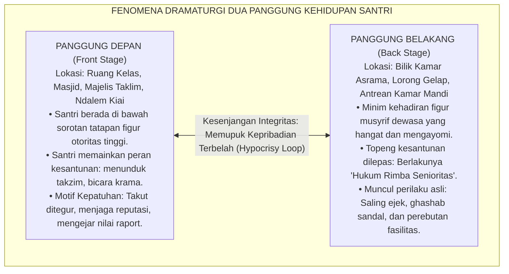
<div align="center"><sub><b>Gambar 1.1.5:</b> Dinamika Dua Panggung (Dramaturgi Sosiologis) dalam Keseharian Santri Pesantren.</sub></div>

Panggung kehidupan santri terbelah secara ekstrem:
* **Di Panggung Depan (*Front Stage*)**: Di kelas atau masjid di bawah tatapan guru, santri mengenakan topeng kesantunan buatan sebagaimana analisis Goffman[^5] dan relasi sebaya Brown[^6]. Mereka menunduk takzim dan berbicara halus semata-mata karena takut ditegur atau demi nilai raport.
* **Di Panggung Belakang (*Back Stage*)**: Di bilik asrama malam hari saat guru pulang, topeng kesantunan dilepas seketika. Berlakulah hukum rimba: perebutan fasilitas, *ghashab*, makian kotor, dan senioritas menindas junior.

Kebiasaan hidup dalam standar ganda ini melatih santri menjadi munafik secara perilaku (*nifaq amali*): sangat santun saat diawasi, namun berani berbuat zalim saat merasa tidak ada yang melihatnya.

---

### Wasiat Turats: Memadukan Ilmu dengan Amal Nyata

Kritik terhadap ilmu yang mandul dan hafalan yang tidak berbuah amal perbuatan ini sesungguhnya telah disuarakan dengan lantang oleh para ulama agung peradaban Islam sejak berabad-abad silam:

> [!NOTE]
> ### 📜 Peringatan Hujjatul Islam Imam Abu Hamid Al-Ghazali dalam *Ayyuhal Walad*:[^7]
> 
> $$\text{أَيُّهَا الْوَلَدُ، الْعِلْمُ بِلَا عَمَلٍ جُنُونٌ، وَالْعَمَلُ بِغَيْرِ عِلْمٍ لَا يَكُونُ. وَاعْلَمْ أَنَّ عِلْمًا لَا يُبْعِدُكَ الْيَوْمَ عَنِ الْمَعَاصِي، وَلَا يَحْمِلُكَ عَلَى الطَّاعَةِ، لَنْ يُبْعِدَكَ غَدًا عَنْ نَارِ جَهَنَّمَ}$$
> 
> **Artinya:**  
> *"Wahai anakku tercinta! Ilmu yang tidak diiringi dengan amal nyata adalah suatu kegilaan, dan amal tanpa ilmu adalah kesia-siaan. Ketahuilah, sesungguhnya ilmu yang tidak mampu menjauhkan dirimu dari maksiat hari ini dan tidak mendorongmu untuk taat beribadah, niscaya ia tidak akan pernah mampu menyelamatkanmu dari jilatan api neraka di hari esok!"*

> [!NOTE]
> ### 📜 Pesan Hadhratusy Syaikh KH. M. Hasyim Asy'ari dalam *Adab al-'Alim wal Muta'allim*:[^8]
> 
> $$\text{قَالَ بَعْضُ السَّلَفِ: الْأَدَبُ فِي الْعَمَلِ عَلَامَةُ قَبُولِ الْعَمَلِ. وَقَالَ ابْنُ الْمُبَارَكِ: طَلَبْتُ الْأَدَبَ ثَلَاثِينَ سَنَةً، وَطَلَبْتُ الْعِلْمَ عِشْرِينَ سَنَةً، وَكَانُوا يَطْلُبُونَ الْأَدَبَ قَبْلَ الْعِلْمِ}$$
> 
> **Artinya:**  
> *"Ulama salaf menegaskan: 'Keberadaan adab di dalam suatu amal adalah tanda diterimanya amal tersebut di sisi Allah.' Abdullah bin al-Mubarak menyatakan: 'Aku mendalami adab selama tiga puluh tahun, dan aku mempelajari ilmu syariat selama dua puluh tahun; dan sungguh para ulama terdahulu senantiasa menuntut adab terlebih dahulu sebelum mereka mulai menuntut ilmu.'"*

Ulama terdahulu tidak pernah menilai kealiman seseorang dari tebalnya kitab yang ia bawa, melainkan dari seberapa luhur akhlaknya saat berbicara, makan, tidur, dan memperlakukan sesamanya.

---

### Solusi Sistemik TUMBUH: Meruntuhkan Sekat Madrasah dan Asrama 24-Jam

Menjawab kebuntuan metodologis di atas, **Sistem TUMBUH** merekayasa arsitektur pembinaan terpadu yang menghubungkan madrasah dan asrama ke dalam **Satu Ekosistem Pengasuhan 24-Jam**:

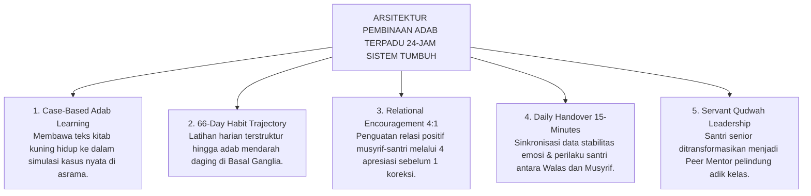
<div align="center"><sub><b>Gambar 1.1.6:</b> Lima Pilar Arsitektur Pembinaan Adab Terpadu 24-Jam Ekosistem TUMBUH.</sub></div>

Kelima pilar sistemik ini bekerja serempak di lapangan:
1. **Case-Based Adab Learning**: Pelajaran adab di kelas madrasah diubah dari sekadar memaknai teks pasif menjadi simulasi kasus nyata di asrama (misalnya memperagakan langsung cara meminjam barang yang santun atau cara antre wudhu saat terburu-buru).
2. **66-Day Habit Trajectory**: Menerapkan pendampingan pembiasaan selama 66 hari berturut-turut agar nilai adab berpindah dari memori hafalan kepala menuju gerak refleks bawah sadar di tangan dan kaki santri.
3. **Relational Encouragement 4:1**: Musyrif dibiasakan memberikan 4 apresiasi tulus atas usaha kebaikan santri sebelum melayangkan 1 teguran terarah (*Firm & Kind*).
4. **Daily Handover 15-Minutes**: Wali Kelas di sekolah dan Musyrif di asrama bertemu rutin setiap pagi dan sore untuk saling menyinkronkan data perkembangan emosi santri, sehingga tidak ada anak yang luput dari perhatian.
5. **Servant Qudwah Leadership**: Wewenang menghukum fisik dicabut total dari santri senior dan peran mereka diubah menjadi **Kakak Asuh (*Peer Mentors*)** yang melayani dan melindungi adik kelasnya.

---

## 📌 Catatan Kaki & Rujukan Primer

[^1]: **Larry R. Squire**, "Memory systems of the brain: A brief history and current perspective", *Neurobiology of Learning and Memory*, Vol. 82, No. 3 (2004), hlm. 171–177; serta **Larry R. Squire & Eric R. Kandel**, *Memory: From Mind to Molecules* (New York: Scientific American Library, 1999).
[^2]: **John R. Anderson**, *The Architecture of Cognition* (Cambridge: Harvard University Press, 1983); serta *Rules of the Mind* (Hillsdale: Lawrence Erlbaum Associates, 1993).
[^3]: **Daniel Kahneman**, *Thinking, Fast and Slow* (New York: Farrar, Straus and Giroux, 2011), Bab 1: "Two Systems", hlm. 19–30.
[^4]: **Prof. Dr. Syed Muhammad Naquib al-Attas**, *The Concept of Education in Islam: A Framework for an Islamic Philosophy of Education* (Kuala Lumpur: International Institute of Islamic Thought and Civilization / ISTAC, 1980), hlm. 15–35; serta *Aims and Objectives of Islamic Education* (Jeddah: King Abdulaziz University, 1979).
[^5]: **Erving Goffman**, *The Presentation of Self in Everyday Life* (New York: Anchor Books / Doubleday, 1959), Bab III: "Regions and Region Behavior", hlm. 106–140.
[^6]: **B. Bradford Brown & Jim Larson**, "Peer relationships in adolescence", dalam R. M. Lerner & L. Steinberg (Eds.), *Handbook of Adolescent Psychology: Contextual Influences on Adolescent Development* (Hoboken: John Wiley & Sons, 2009), Vol. 2, hlm. 74–103.
[^7]: **Hujjatul Islam Imam Abu Hamid al-Ghazali**, *Ayyuhal Walad fi Nashihat at-Talamidz*, Tahqiq: Dr. Ahmad Ahmad Badawi (Kairo: Dar al-Qalam, 1986), hlm. 12–15.
[^8]: **Hadhratusy Syaikh KH. M. Hasyim Asy'ari**, *Adab al-'Alim wal Muta'allim fi ma Yahtaju Ilayhi al-Muta'allim fi Ahwal Ta'allumihi wa ma Yatawaqqafu 'alayhi al-Mu'allim fi Maqamat Ta'limihi* (Jombang: Maktabah at-Turats al-Islami, 1415 H), hlm. 9–12.


---

# SUB-BAB 1.2: FENOMENOLOGI KEKERASAN & SENIORITAS FEODAL
## *Membongkar Mitos 'Penempaan Mental Baja', Meluruskan Residu Tradisi, dan Menegakkan Martabat Kemanusiaan Santri*

**Kode Klasifikasi**: `BOOK-01/BAB-01/SUB-02/MONOGRAF-MASTER-VIBRANT`  
**Disiplin Ilmu**: Sosiologi Kekerasan Pendidikan, Psikologi Trauma Perkembangan, Hukum Perlindungan Anak, & Epistemologi Turats  
**Penanggung Jawab Keilmuan**: Dewan Pakar Ekosistem TUMBUH (*Master Author, Pakar Perlindungan Anak, Epistemologi Turats, & Disiplin Positif*)

---

### Jeritan Sunyi di Bilik Asrama Malam Hari

Ketika lonceng malam berdentang menandakan jam tidur dan lampu-lampu utama pesantren mulai dipadamkan, sebuah dunia yang sunyi dan mencekam kerap kali baru saja dimulai bagi sebagian anak-anak kita.

Di balik pintu-pintu bilik yang terkunci rapat, di sudut lorong jemuran yang gelap, atau di aula yang tersembunyi dari pantauan para kiai, sekelompok santri baru dikumpulkan dalam suasana penuh ketegangan. Mata mereka dipaksa menatap lantai, tubuh mereka gemetar menahan dingin dan kantuk, sementara suara bentakan keras dari santri senior menggelegar memecah kesunyian malam. Satu per satu kesalahan kecil—seperti peci yang miring, terlambat beberapa detik saat antre makan, atau tatapan mata yang dianggap "kurang menunduk"—diadili layaknya kejahatan besar di hadapan mahkamah rimba.

Hukuman pun dijatuhkan tanpa ampun: tamparan di pipi, pukulan sajadah basah yang menyengat kulit, tendangan di tulang kering, *push-up* dengan ujung jari hingga otot tangan gemetar kehabisan daya, hingga kewajiban mencuci tumpukan pakaian kotor senior sebelum fajar menyingsing.

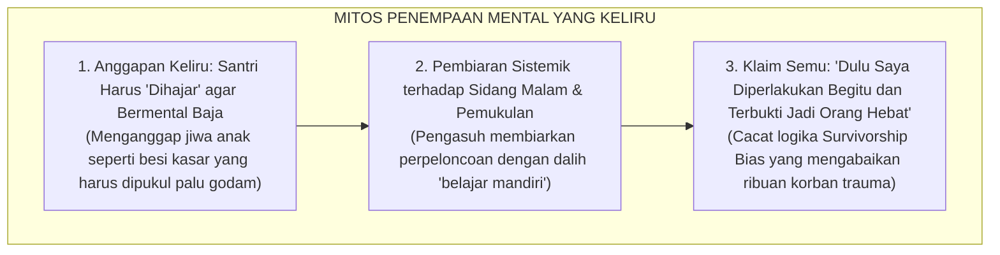
<div align="center"><sub><b>Gambar 1.2.1:</b> Mitos Keliru 'Penempaan Mental Baja' yang Melanggengkan Kekerasan Antargenerasi.</sub></div>

Bagan di atas membongkar alasan klise yang selalu diulang-ulang oleh para pelaku kekerasan di asrama. Mereka berdalih bahwa anak harus *"dihajar"* agar bermental baja. Mereka mengklaim: *"Dulu saya juga dipukul dan sekarang terbukti jadi orang hebat!"* 

Ini adalah cacat logika yang fatal. Jiwa anak bukanlah besi mati yang harus dihantam palu godam, melainkan **benih tanaman hidup yang rapuh**: ia butuh air keteladanan yang sejuk dan tanah aturan yang adil untuk bertumbuh kokoh. Pukulan fisik tidak pernah menciptakan kesatria bermental baja; pukulan hanya menciptakan dua tipe manusia yang terluka: **jiwa yang patah arang dan penakut**, atau **calon penindas baru yang menyimpan dendam membara**.

---

### Anatomi Fenomenologis: Membedah Tiga Lapis Piramida Kekerasan

Kekerasan di pesantren tidak pernah muncul tiba-tiba. Ia menyusup secara halus melalui budaya turun-temurun. Sosiolog perdamaian dunia **Johan Galtung**[^1] merumuskan bahwa kekerasan selalu bekerja dalam struktur piramida tiga lapis:

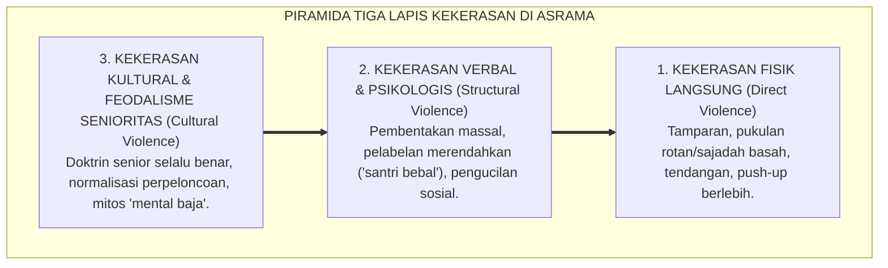
<div align="center"><sub><b>Gambar 1.2.2:</b> Piramida Tiga Lapis Kekerasan Kultural, Struktural, dan Fisik di Lingkungan Asrama.</sub></div>

Piramida di atas menunjukkan mengapa kasus kekerasan fisik sulit diberantas jika kita hanya menghukum pelakunya tanpa membongkar akarnya:
* **Lapis Dasar (Kekerasan Kultural)**: Berisi doktrin beracun seperti *"Senior selalu benar"*, *"Junior wajib tunduk tanpa syarat"*, dan anggapan bahwa perpeloncoan adalah tradisi wajib.
* **Lapis Tengah (Kekerasan Struktural)**: Sistem asrama yang membiarkan ruang hampa pengawasan malam hari, di mana santri senior bebas membentak massal, mencaci maki dengan nama binatang, dan memaksa adik kelas mencuci bajunya.
* **Lapis Puncak (Kekerasan Fisik Langsung)**: Letupan akhir berupa tamparan, tendangan, dan pemukulan. Tragedi santri luka berat atau meninggal yang viral di media massa hanyalah letupan puncak gunung es dari budaya feodal di bawahnya yang dibiarkan bertahun-tahun.

---

### Suluh Epistemologis Turats: Peringatan Keras Ibnu Khaldun dalam *Al-Muqaddimah*

Jauh berabad-abad sebelum ilmu psikologi modern lahir, sosiolog teragung peradaban Islam, **Ibnu Khaldun (1332–1406 M)**[^2], telah menuliskan peringatan keras dalam *Al-Muqaddimah* pada bab khusus bertajuk *Kekerasan terhadap Pelajar Membawa Kerusakan Fatal bagi Jiwa Mereka*:

> [!NOTE]
> ### 📜 Diagnosa Tajam Sosiolog Muslim Ibnu Khaldun dalam *Al-Muqaddimah*:[^2]
> 
> $$\text{مَنْ كَانَ مَرْبَاهُ بِالْقَهْرِ وَالْقَسْرِ مِنْ الْمُتَعَلِّمِينَ أَوْ الْمَمَالِيكِ أَوْ الْخَدَمِ، سَطَا بِهِ الْقَهْرُ، وَضَيَّقَ عَلَى النَّفْسِ فِي انْبِسَاطِهَا، وَذَهَبَ بِنَشَاطِهَا، وَدَعَاهُ إِلَى الْكَسَلِ، وَحَمَلَهُ عَلَى الْكَذِبِ وَالْخُبْثِ، وَهُوَ التَّظَاهُرُ بِغَيْرِ مَا فِي ضَمِيرِهِ خَوْفًا مِنْ انْبِسَاطِ الْأَيْدِي بِالْقَهْرِ عَلَيْهِ، وَعَلَّمَهُ الْمَكْرَ وَالْخَدِيعَةَ لِذَلِكَ، وَصَارَتْ لَهُ هَذِهِ عَادَةً وَخُلُقًا، وَفَسَدَتْ مَعَانِي الْإِنْسَانِيَّةِ الَّتِي لَهُ}$$
> 
> **Artinya:**  
> *"Barang siapa yang pola asuh dan pendidikannya ditegakkan di atas dasar kekerasan, pemaksaan, dan penindasan—maka kekerasan itu akan menguasai jiwanya, menyempitkan hatinya, melenyapkan semangat belajarnya, dan **mendorongnya untuk terbiasa berdusta serta bersikap curang**.*  
> *Ia terpaksa berpura-pura patuh semata-mata karena takut dipukul. Kekerasan itulah yang mengajarinya tipu daya dan kelicikan, hingga akhirnya kepalsuan tersebut mendarah-daging menjadi karakternya; **dan pada puncaknya, hancurlah seluruh fitrah kemanusiaannya!**"*

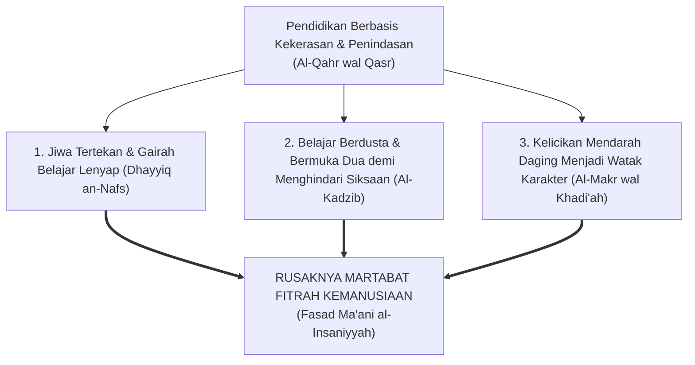
<div align="center"><sub><b>Gambar 1.2.3:</b> Rantai Kehancuran Karakter Santri Akibat Metode Kekerasan Menurut Ibnu Khaldun.</sub></div>

Ibnu Khaldun membedah secara gamblang bagaimana kekerasan merusak anak dalam empat tahap: awalnya semangat belajar anak mati (*Dhayyiq an-Nafs*), lalu anak belajar berdusta demi menghindari pukulan (*Al-Kadzib*), kebohongan itu berubah menjadi kelicikan mendarah daging (*Al-Makr*), hingga akhirnya seluruh fitrah kemuliaan jiwanya hancur total (*Fasad Ma'ani al-Insaniyyah*).

---

### Neurosains Trauma & Siklus Pewarisan Dendam Antargenerasi

Mengapa santri yang waktu yunior menangis tersiksa saat ditindas, beberapa tahun kemudian justru menjadi senior yang paling kejam kepada adik kelas barunya?

Sains psikologi trauma[^3][^4] membongkar lingkaran setan ini:

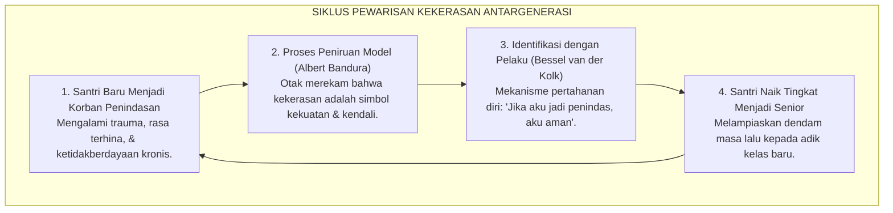
<div align="center"><sub><b>Gambar 1.2.4:</b> Siklus Transmisi Kekerasan Antargenerasi (*Cycle of Violence*) di Asrama Pesantren.</sub></div>

Ketika seorang anak terus-menerus ditindas, otaknya merekam pesan bahwa *"satu-satunya cara agar tidak disakiti di dunia ini adalah dengan menjadi orang yang menyakiti"*. Begitu ia naik kelas menjadi senior, amigdala otaknya melampiaskan seluruh dendam masa lalu kepada santri baru yang tidak bersalah. Lingkaran setan ini akan terus berputar turun-temurun kecuali jika sistem pesantren memutusnya dengan tegas.

---

### Tinjauan Syar'i & Payung Hukum: Kezaliman Berkedok Pendidikan

Banyak yang lupa bahwa memukul wajah, menampar, dan menyiksa fisik anak adalah **kezaliman syar'i yang diharamkan mutlak oleh Rasulullah SAW** sekaligus **tindak pidana murni di mata hukum negara**:

> [!NOTE]
> ### 📜 Larangan Tegas Rasulullah SAW Menyakiti Fisik Anak:
> 
> $$\text{إِذَا ضَرَبَ أَحَدُكُمْ فَلْيَجْتَنِبِ الْوَجْهَ، فَإِنَّ اللَّهَ خَلَقَ آدَمَ عَلَى صُورَتِهِ}$$
> 
> **Artinya:**  
> *"Jika salah seorang di antara kalian terpaksa memukul, maka jauhilah memukul wajah! Karena sesungguhnya Allah memuliakan martabat fisik manusia."*  
> *(HR. Bukhari no. 2559 dan Muslim no. 2612)*

Rasulullah SAW—teladan agung umat manusia—sepanjang hayatnya **tidak pernah sekalipun memukul anak kecil, pembantu, maupun murid beliau** (HR. Muslim no. 2328).

Secara hukum positif di Indonesia, **UU No. 35 Tahun 2014 tentang Perlindungan Anak (Pasal 54 & 80)**[^5] serta **PMA Kemenag No. 73 Tahun 2022**[^6] menegaskan bahwa segala bentuk kekerasan fisik dan psikis di lingkungan pendidikan diancam pidana penjara hingga 3 tahun 6 bulan dan sanksi pencabutan izin operasional lembaga.

---

### Solusi Sistemik TUMBUH: Arsitektur Ekosistem Nol Kekerasan (*Zero Violence Policy*)

Menjawab amanah syariat dan hukum ini, **Sistem TUMBUH** merekayasa arsitektur perlindungan asrama melalui **Empat Pilar Deklarasi Nol Kekerasan**:

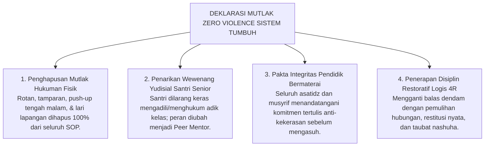
<div align="center"><sub><b>Gambar 1.2.5:</b> Empat Pilar Deklarasi Mutlak Nol Kekerasan (*Zero Tolerance Policy*) Ekosistem TUMBUH.</sub></div>

Langkah konkret Sistem TUMBUH di lapangan:
1. **Hapus Hukuman Fisik 100%**: Menghilangkan seluruh rotan dan hukuman fisik tengah malam dari seluruh tata tertib.
2. **Ubah Peran Senior Jadi Kakak Asuh (*Peer Mentors*)**: Membubarkan sidang malam senior dan mengalihkan tugas senior untuk membimbing dan melindungi adik kelasnya.
3. **Pakta Integritas Pendidik**: Seluruh guru dan pembina menandatangani komitmen tertulis anti-kekerasan yang mengikat secara hukum.
4. **Disiplin Restoratif 4R**: Pelanggaran diselesaikan dengan konsekuensi logis: **Related** (terkait langsung dengan kesalahan), **Respectful** (santun tanpa mencaci), **Reasonable** (masuk akal sesuai usia), dan **Restorative** (memulihkan persaudaraan melalui mekanisme saling memaafkan dan ganti rugi nyata).

---

## 📌 Catatan Kaki & Rujukan Primer

[^1]: **Johan Galtung**, "Violence, Peace, and Peace Research", *Journal of Peace Research*, Vol. 6, No. 3 (1969), hlm. 167–191; serta "Cultural Violence", *Journal of Peace Research*, Vol. 27, No. 3 (1990), hlm. 291–305.
[^2]: **Al-Allamah Abdurrahman Ibnu Khaldun**, *Al-Muqaddimah*, Tahqiq: Dr. Darwis al-Juwaini (Beirut: Dar al-Fikr, t.th.), Fashl 40: *Fashl fi Anna asy-Syiddata 'ala al-Muta'allimin Mudhirrun bihim*, hlm. 540–542.
[^3]: **Albert Bandura**, *Aggression: A Social Learning Analysis* (Englewood Cliffs: Prentice-Hall, 1973); serta **Cathy Spatz Widom**, "The cycle of violence", *Science*, Vol. 244, No. 4901 (1989), hlm. 160–166.
[^4]: **Bessel van der Kolk**, *The Body Keeps the Score: Brain, Mind, and Body in the Healing of Trauma* (New York: Viking Penguin, 2014), hlm. 105–124; serta **Vincent J. Felitti et al.**, "Relationship of childhood abuse and household dysfunction to many of the leading causes of death in adults: The Adverse Childhood Experiences (ACE) Study", *American Journal of Preventive Medicine*, Vol. 14, No. 4 (1998), hlm. 245–258.
[^5]: **Republik Indonesia**, *Undang-Undang Nomor 35 Tahun 2014 tentang Perubahan atas UU Nomor 23 Tahun 2002 tentang Perlindungan Anak*, Lembaran Negara RI Tahun 2014 No. 297.
[^6]: **Kementerian Agama Republik Indonesia**, *Peraturan Menteri Agama (PMA) Nomor 73 Tahun 2022 tentang Pencegahan dan Penanganan Kekerasan Seksual di Satuan Pendidikan pada Kementerian Agama*; serta **Republik Indonesia**, *Undang-Undang Nomor 18 Tahun 2019 tentang Pesantren*.


---

# SUB-BAB 1.3: DAMPAK NEUROBIOLOGIS TRAUMA & KELUMPUHAN PFC
## *Mekanisme Pembajakan Amigdala, Disregulasi Hormon Kortisol, dan Kerusakan Sirkuit Regulasi Moral Otak Remaja*

**Kode Klasifikasi**: `BOOK-01/BAB-01/SUB-03/MONOGRAF-MASTER-VIBRANT`  
**Disiplin Ilmu**: Neurosains Kognitif Terapan, Neurobiologi Trauma, Teori Polivagal, & Epistemologi Turats  
**Penanggung Jawab Keilmuan**: Dewan Pakar Ekosistem TUMBUH (*Master Author, Pakar Neurosains Perkembangan, Disiplin Positif, & Bimbingan Konseling*)

---

### Paradoks Biologis Disiplin: Mengapa Kemarahan Menutup Pintu Pemahaman Anak?

Pernahkah Anda heran, mengapa seorang santri yang sedang dibentak habis-habisan atau dihukum di depan umum justru tampak membisu layaknya patung batu, tatapan matanya kosong, atau beberapa hari kemudian mengulangi kesalahan yang sama persis? 

Mengapa suara ustadz yang semakin keras dan hukuman yang semakin berat justru tidak membuat si anak semakin paham?

Banyak pengurus mengira sikap membisu itu adalah tanda anak yang "keras kepala", "bebal", atau "sengaja melawan guru". Namun, sains modern di bidang neurosains kognitif membuktikan fakta biologis yang mengejutkan:

> [!IMPORTANT]
> ### 🧠 Hukum Biologis Otak:
> Ketika seorang anak diteror dengan bentakan, ancaman rotan, atau dipermalukan di depan kawan-kawannya, bagian otak yang bertugas memahami aturan moral (**Korteks Prefrontal / PFC**) secara otomatis **padam dan terkunci rapat (*brain shut-down*)**.  
> 
> Memaksa anak mencerna nasihat adab saat ia sedang ketakutan sama mustahilnya dengan menyuruh seseorang membaca buku di dalam ruangan yang sedang terbakar hebat!

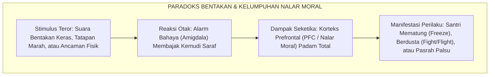
<div align="center"><sub><b>Gambar 1.3.1:</b> Rantai Biologis Pembajakan Nalar Sadar Santri akibat Ancaman Disiplin Represif.</sub></div>

Detik saat suara bentakan menggelegar, otak santri tidak sedang memproses makna nasihat guru, melainkan sedang panik menyelamatkan diri dari ancaman bahaya fisik. Nalar sadarnya lumpuh seketika.

---

### Neuroanatomi Otak Remaja: Mesin Mobil Balap vs Rem Sepeda Ontel

Mengapa santri usia 12 hingga 18 tahun (usia MTs dan MA) sangat mudah meledak emosinya dan sering bertindak tanpa pikir panjang?

Riset pencitraan otak resonansi magnetik (*fMRI*)[^1] membongkar sebuah rahasia besar: **otak santri remaja sedang berada dalam fase konstruksi yang sangat tidak seimbang**:

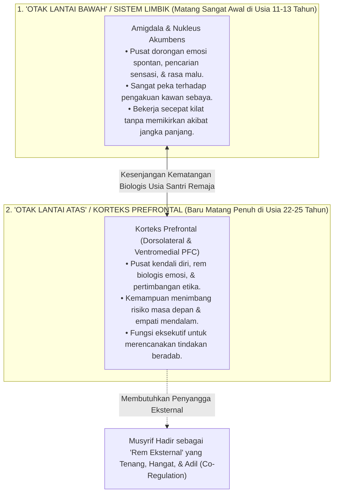
<div align="center"><sub><b>Gambar 1.3.2:</b> Model Dual-Systems: Kesenjangan Kematangan antara Sistem Limbik dan Korteks Prefrontal Otak Remaja.</sub></div>

Bayangkan seorang anak yang mengendarai mobil dengan **mesin mobil balap berkekuatan 500 tenaga kuda (Sistem Limbik yang sudah matang sempurna sejak awal pubertas), namun baru dilengkapi dengan pedal rem sepeda ontel (Korteks Prefrontal yang baru akan selesai dibangun pada usia 25 tahun)**!

Ketika seorang santri bercanda berlebihan di kamar mandi atau lupa jadwal piket, kekhilafan itu bukan karena ia anak jahat, melainkan rem biologis di otaknya memang belum selesai dibangun. Santri remaja belum memiliki rem mandiri yang kuat. Mereka sangat membutuhkan **kehadiran musyrif dewasa yang tenang dan hangat sebagai 'rem eksternal' (*External Scaffolding*)**, bukan bentakan kasar yang justru memutus kabel rem tersebut!

---

### Kaskade Neurokimia Trauma: Pembajakan Amigdala & Racun Hormon Kortisol

Apa yang sebenarnya terjadi di dalam pembuluh darah dan jaringan saraf santri saat ia dibentak ustadznya?

Pakar kecerdasan emosional Daniel Goleman[^2] menyebut peristiwa ini sebagai **Pembajakan Amigdala (*Amygdala Hijack*)**:

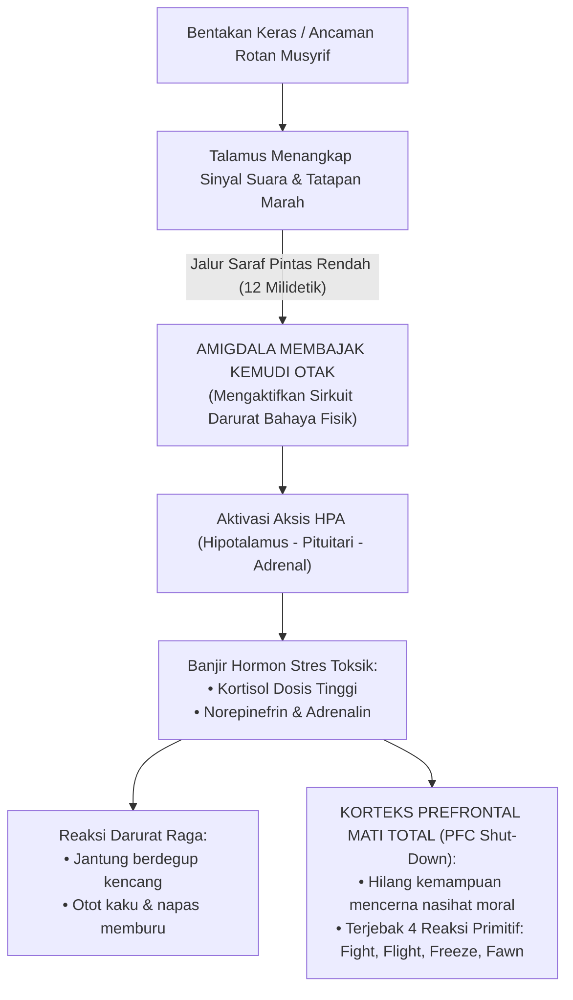
<div align="center"><sub><b>Gambar 1.3.3:</b> Kaskade Neurokimia Pembajakan Amigdala dan Kelumpuhan Nalar Moral (*PFC Shut-Down*).</sub></div>

Hanya dalam tempo **12 milidetik**—sebelum santri sempat menyadari apa yang terjadi—alarm amigdala di otaknya langsung merebut kemudi tubuh. Aliran darah dibanjiri racun hormon stres (**kortisol dan adrenalin**). Jantung berdegup kencang, napas memburu, dan pintu nalar sadar di otak depan (*PFC*) padam seketika.

Santri terlempar ke dalam **Empat Respons Primitif Pertahanan Diri**:
* **Fight (Melawan)**: Santri menatap dendam atau melampiaskan amarah dengan memukul kawan yang lebih lemah.
* **Flight (Kabur)**: Santri melarikan diri dari asrama (*minggat*) atau sembunyi di toilet saat jam mengaji.
* **Freeze (Membeku)**: Santri mematung kaku, mulut terkunci, dan pikiran hampa (*seperti patung batu*).
* **Fawn (Pura-pura Patuh)**: Santri mengangguk-angguk manis semata-mata agar kemarahan guru segera berakhir.

Riset psikiatri anak[^3] membuktikan bahwa santri yang sering dibentak dan dihukum fisik mengalami **penyusutan organ memori (hipokampus) sebesar 10–15%**. Akibatnya fatal: santri kehilangan konsentrasi dan mengalami kemunduran tajam dalam menghafal Al-Qur'an dan kitab kuning!

---

### Teori Polivagal Stephen Porges: Rasa Aman adalah Pintu Masuk Adab

Penelitian neurofisiologi klinis melalui **Teori Polivagal (*Polyvagal Theory*)** oleh **Prof. Stephen Porges**[^4] membuktikan bahwa tubuh manusia memiliki saklar saraf tiga tingkat:

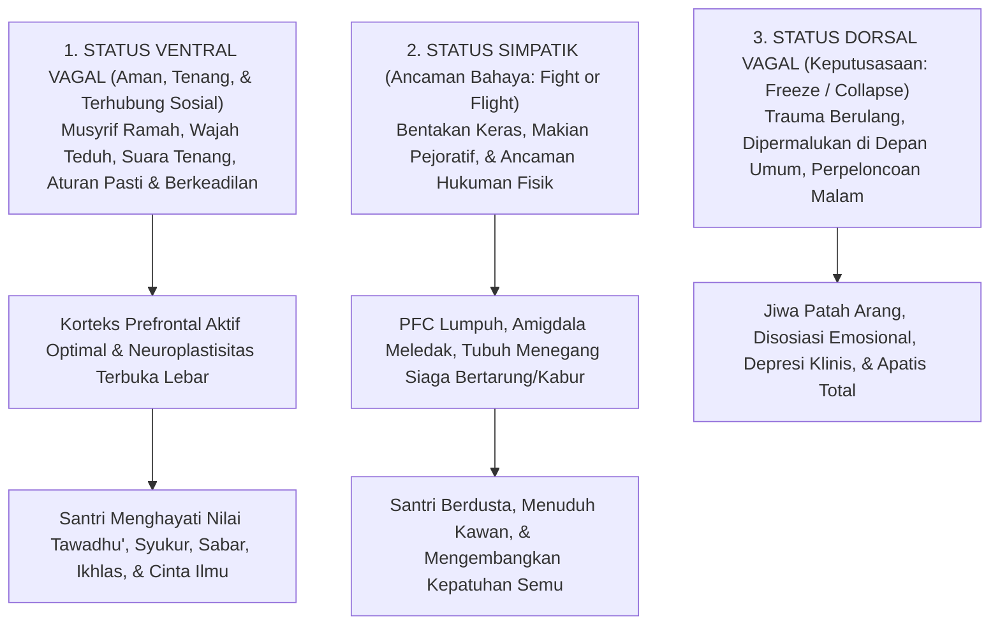
<div align="center"><sub><b>Gambar 1.3.4:</b> Hubungan Status Sistem Saraf Polivagal terhadap Terbuka atau Tertutupnya Kapasitas Penghayatan Adab Santri.</sub></div>

Pesan dari tabel saraf di bawah ini sangat sederhana: **santri hanya bisa menyerap adab Ketika ia berada di Status Hijau (Ventral Vagal / Rasa Aman)**:

| Status Saraf | Kondisi Batin Santri | Manifestasi Perilaku di Pondok | Kapasitas Menyerap Adab |
| :--- | :--- | :--- | :---: |
| **1. Hijau (Ventral Vagal)** | **Aman & Diterima**: Tenang, rileks, dan percaya pada guru. | Santun, kooperatif, empati tinggi, jujur mengakui salah. | **OPTIMAL (100%)**<br/>Adab mendarah daging. |
| **2. Kuning (Simpatik)** | **Terancam Bahaya**: Panik, takut dipukul, merasa diserang. | Berdusta demi selamat, saling tuduh, atau kabur. | **TERHAMBAT (0%)**<br/>Kepatuhan palsu sesaat. |
| **3. Merah (Dorsal Vagal)** | **Putus Asa**: Jiwa mati rasa, menyerah pada kepedihan. | Wajah datar tanpa ekspresi, mengompol, depresi berat. | **LUMPUH TOTAL (-100%)**<br/>Kehancuran mental anak. |

---

### Integrasi Turats: Ketenangan Qalbu (*Thuma'ninah*) dan Cahaya Akal (*Nural Fahm*)

Temuan ilmiah ini menegaskan kaidah yang telah ditulis ulama tasawuf agung, **Imam Al-Harits al-Muhasibi (w. 857 M)** dalam kitabnya *Adab an-Nufus*:

> [!NOTE]
> ### 📜 Kaidah Emas Imam Al-Harits al-Muhasibi dalam *Adab an-Nufus*:[^5]
> 
> $$\text{إِذَا اسْتَوْلَى الْخَوْفُ الْمُفْرِطُ أَوِ الْغَضَبُ عَلَى النَّفْسِ، عَشِيَ بَصَرُ الْعَقْلِ، وَغَابَتِ الْحِكْمَةُ، وَلَمْ يَبْقَ لِلصَّاحِبِ مَسْلَكٌ إِلَى مَعْرِفَةِ حَقِيقَةِ الْأَدَبِ، وَإِنَّمَا يَنْبُتُ الْأَدَبُ فِي قَلْبٍ سَكَنَتْ رَوْعَتُهُ، وَاطْمَأَنَّتْ سَرِيرَتُهُ}$$
> 
> **Artinya:**  
> *"Ketika rasa takut yang berlebihan atau amarah telah menguasai jiwa seseorang, maka **butalah pandangan mata hatinya**, sirnalah hikmah kebijaksanaan darinya, dan tertutuplah jalannya untuk mengenali hakikat adab yang sejati.*  
> *Sesungguhnya adab itu hanyalah akan mampu bersemi dan bertumbuh di dalam **kalbu yang telah reda dari rasa takut yang mencekam dan telah tenteram batinnya (*Thuma'ninah*)**."*

Ulama salaf telah mengajarkan: **ketenteraman batin (*Thuma'ninah*) adalah syarat mutlak agar pintu akal terbuka untuk menerima ilmu dan adab.**

---

### Solusi Sistemik TUMBUH: Arsitektur Regulasi Neuro-Afektif Berbasis Rasa Aman

Berdasarkan hukum neurobiologi dan tuntunan Turats ini, **Sistem TUMBUH** menetapkan bahwa **penciptaan rasa aman (*Safety First*) adalah syarat mutlak seluruh proses pendidikan**. Sistem TUMBUH merumuskan **Tiga Protokol Regulasi Neuro-Afektif**:

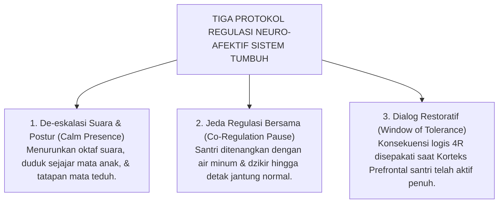
<div align="center"><sub><b>Gambar 1.3.5:</b> Tiga Protokol Regulasi Neuro-Afektif Ekosistem TUMBUH dalam Penanganan Pelanggaran Santri.</sub></div>

Penerapan protokol sistemik di lapangan:
1. **Tenangkan Nada Suara (*Calm Presence*)**: Musyrif menggunakan intonasi rendah dan posisi duduk sejajar mata anak untuk meredakan alarm amigdala santri.
2. **Beri Jeda Tenang (*Co-Regulation Pause*)**: Menghentikan interogasi saat santri panik, memberi segelas air putih, dan membimbing dzikir hingga detak jantung anak kembali normal.
3. **Bicara saat Nalar Sudah Siap (*Window of Tolerance*)**: Memulai musyawarah dan penentuan konsekuensi logis 4R hanya Ketika santri sudah tenang, sehingga nilai akhlak tersimpan abadi di memori jangka panjangnya.

---

## 📌 Catatan Kaki & Rujukan Primer

[^1]: **Jay N. Giedd et al.**, "Brain development during childhood and adolescence: a longitudinal MRI study", *Nature Neuroscience*, Vol. 2, No. 10 (1999), hlm. 861–863; **Sarah-Jayne Blakemore**, "Development of the social brain in adolescence", *Journal of the Royal Society of Medicine*, Vol. 105, No. 3 (2012), hlm. 111–116; serta **Laurence Steinberg**, "A social neuroscience perspective on adolescent risk-taking", *Developmental Review*, Vol. 28, No. 1 (2008), hlm. 78–106.
[^2]: **Daniel Goleman**, *Emotional Intelligence: Why It Can Matter More Than IQ* (New York: Bantam Books, 1995), Bab 2: "Anatomy of an Emotional Hijacking", hlm. 13–29.
[^3]: **Robert M. Sapolsky**, *Behave: The Biology of Humans at Our Best and Worst* (New York: Penguin Press, 2017), hlm. 95–136; serta **Bruce D. Perry & Maia Szalavitz**, *The Boy Who Was Raised as a Dog: And Other Stories from a Child Psychiatrist's Notebook* (New York: Basic Books, 2006), hlm. 45–78.
[^4]: **Stephen W. Porges**, *The Polyvagal Theory: Neurophysiological Foundations of Emotions, Attachment, Communication, and Self-regulation* (New York: W. W. Norton & Company, 2011), hlm. 133–164; serta *The Pocket Guide to the Polyvagal Theory: The Transformative Power of Feeling Safe* (New York: W. W. Norton, 2017).
[^5]: **Imam Al-Harits al-Muhasibi**, *Adab an-Nufus*, Tahqiq: Dr. Abdul Qadir Ahmad 'Atha (Kairo & Beirut: Dar al-Kutub al-Ilmiyyah, 1986), Bab 'Fashl fi Thuma'ninatil Qalbi wa Nuri Fahmil Aql', hlm. 48–51.


---

# SUB-BAB 1.4: KELEMAHAN BEHAVIORISME SEKULER & KEHAMPAAN RUHANI
## *Kritik atas Reduksionisme Hadiah-Hukuman Mekanis, Efek Overjustification, dan Erosi Keikhlasan Niat*

**Kode Klasifikasi**: `BOOK-01/BAB-01/SUB-04/MONOGRAF-MASTER-VIBRANT`  
**Disiplin Ilmu**: Filsafat Pendidikan Islam, Psikologi Motivasi Humanistik, Self-Determination Theory, & Hermeneutika Turats  
**Penanggung Jawab Keilmuan**: Dewan Pakar Ekosistem TUMBUH (*Master Author, Pakar Filosofi TUMBUH, Epistemologi Turats, & Social Emotional Learning*)

---

### Ilusi Modernisasi Disiplin: Ketika Ibadah Direduksi Menjadi Perburuan Poin

Dalam beberapa dekade terakhir, banyak pesantren berupaya melakukan modernisasi disiplin dengan mengadopsi sistem modifikasi perilaku ala Barat: **Sistem Poin Pinalti dan Token Hadiah (*Token Economy System*)**.

Aturan mulai dipenuhi angka-angka:
* Merapikan kasur sebelum subuh mendapat stiker bintang emas atau +10 poin.
* Berada di saf terdepan masjid mendapat kupon jajan gratis di kantin.
* Sebaliknya, terlambat dipotong -5 poin atau didenda uang saku.

Di atas kertas, sistem ini tampak sangat rapi dan modern. Namun, di balik keteraturan fisik tersebut, para pakar pendidikan Islam dan psikolog menemukan sebuah **tragedi spiritual yang amat memprihatinkan**:

> [!CAUTION]
> ### ⚠️ Fenomena Kepunahan Perilaku (*The Behavioral Extinction Effect*):
> Santri yang terbiasa digerakkan oleh stiker bintang dan kupon jajan hanya akan berbuat baik **selama ada hadiah materiil yang dibagikan**.  
> 
> Begitu masa liburan semester tiba atau anak lulus dari pondok—di mana tidak ada lagi musyrif yang mencatat skor poin—**seluruh kebiasaan ibadah tersebut runtuh seketika**. Santri kembali bangun kesiangan dan meninggalkan shalat berjamaah, karena api motivasi di dalam kalbunya tidak pernah dinyalakan.

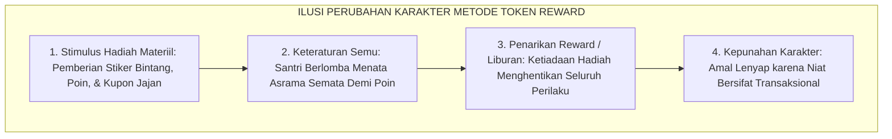
<div align="center"><sub><b>Gambar 1.4.1:</b> Siklus Kepunahan Amal (*Extinction Effect*) dalam Sistem Modifikasi Perilaku Mekanis.</sub></div>

Sistem hadiah-hukuman mekanis berhasil memanipulasi gerak fisik anak untuk sementara waktu, namun **secara perlahan membunuh keikhlasan niat dan melahirkan jiwa yang transaksional**.

---

### Menelanjangi Behaviorisme Radikal Skinner: Reduksi Manusia Menjadi Organisme Refleks

Akar kesalahan sistem ini berasal dari teori **Behaviorisme Radikal** karya **B.F. Skinner**[^1]. Skinner merumuskan teorinya dari eksperimen terhadap burung merpati dan tikus: hewan diberi butiran jagung jika mematuk tombol (*reward*), dan disengat listrik jika salah menginjak tuas (*punishment*). Skinner menganggap manusia sama seperti hewan percobaan: tidak memiliki jiwa spiritual dan perilakunya dapat direkayasa sepenuhnya lewat pancingan hadiah luar.

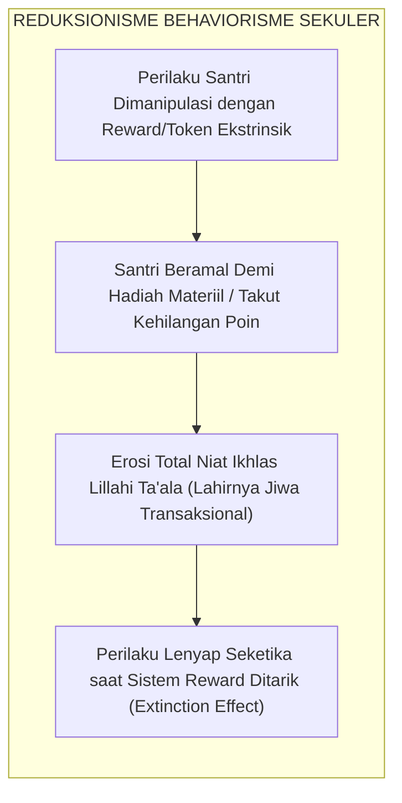
<div align="center"><sub><b>Gambar 1.4.2:</b> Alur Reduksionisme Behaviorisme Sekuler dan Erosi Keikhlasan Beramal Santri.</sub></div>

Ketika sistem ini diterapkan pada santri, bahayanya sangat nyata: santri dididik menjadi materialistis (*"Berapa poin yang saya dapat jika menyapu masjid ini?"*), nilai kesucian ibadah tercemar oleh riya' dan pemburuan pujian manusia, dan amal saleh akan mati seketika Ketika hadiah tidak lagi dibagikan.

---

### Teori Self-Determination & Fenomena Overjustification Effect

Pakar psikologi motivasi **Edward L. Deci dan Richard M. Ryan**[^2] bersama **Alfie Kohn**[^3] membuktikan bahwa hadiah materiil justru merusak motivasi alami anak melalui fenomena yang disebut **Efek Pembenaran Berlebih (*The Overjustification Effect*)**:

$$\text{Pemberian Hadiah Materiil Berlebihan} \Longrightarrow \text{Menghancurkan Minat Batin Alami}$$

Ketika seorang santri yang awalnya ikhlas membaca Al-Qur'an diiming-imingi kupon hadiah, otak bawah sadarnya bergeser: *"Aku mengaji bukan lagi karena cinta pada Allah, melainkan demi mengumpulkan kupon bintang dari ustadz."*

Alfie Kohn merangkum **Tiga Racun Sistem Hadiah-Hukuman**:
1. **Hadiah adalah Hukuman yang Menyamar**: Menciptakan kecemasan dan rasa tertekan pada anak.
2. **Hadiah Merusak Ukhuwah**: Memicu persaingan saling menjatuhkan dan kecemburuan antar-kawan sekamar.
3. **Hadiah Menghancurkan Kejujuran**: Anak terdorong berbuat curang demi mendapatkan skor nilai tinggi.

---

### Kontinuum Regulasi Motivasi: Menuju Kesadaran Muraqabatullah

Sains psikologi memetakan motivasi manusia ke dalam sebuah tangga lima tingkat dari kepatuhan hewani menuju kemerdekaan jiwa:

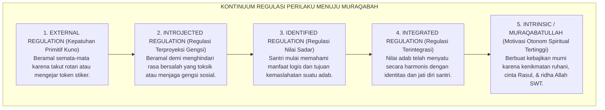
<div align="center"><sub><b>Gambar 1.4.3:</b> Kontinuum Spektrum Regulasi Motivasi: Dari Ketergantungan Eksternal Menuju Kesadaran Muraqabatullah.</sub></div>

Tingkat 1 (takut rotan/berburu stiker) adalah level kepatuhan hewani. Puncak pembinaan karakter santri yang sesungguhnya berada di **Tingkat 5 (*Muraqabatullah*)**: yaitu Ketika santri bangun shalat tahajjud di keheningan malam dan menjaga kebersihan asrama murni karena merasakan kenikmatan beribadah kepada Allah SWT (*Halaawatul Iman*), tanpa peduli apakah ada guru yang melihatnya atau tidak.

---

### Hermeneutika Turats: Hakikat Niat Ikhlas vs Bahaya Riya'

Di sinilah letak keagungan ajaran Islam. Jauh sebelum para psikolog Barat merumuskan teori motivasi, ulama agung **Imam Abu Hamid Al-Ghazali** dalam *Ihya 'Ulumiddin* telah mengingatkan hakikat niat:

> [!NOTE]
> ### 📜 Hermeneutika Niat Imam Al-Ghazali dalam *Ihya 'Ulumiddin*:[^4]
> 
> $$\text{إِنَّ النِّيَّةَ هِيَ انْبِعَاثُ الْقَلْبِ إِلَى مَا يَرَاهُ مُوَافِقًا لِغَرَضٍ مِنْ أَغْرَاضِهِ، إِمَّا عَاجِلًا وَإِمَّا آجِلًا. فَالْإِخْلَاصُ هُوَ تَجْرِيدُ قَصْدِ التَّقَرُّبِ إِلَى اللَّهِ تَعَالَى عَنْ جَمِيعِ الشَّوَائِبِ. فَإِذَا امْتَزَجَ بِالْعَمَلِ غَرَضٌ دُنْيَوِيٌّ مِنْ طَلَبِ مَحْمَدَةٍ، أَوْ جَلْبِ مَنْفَعَةٍ، أَوْ دَفْعِ مَذَمَّةٍ، خَرَجَ الْعَمَلُ عَنْ حَدِّ الْإِخْلَاصِ وَصَارَ شِرْكًا خَفِيًّا يُحْبِطُ الْأَجْرَ}$$
> 
> **Artinya:**  
> *"Hakikat **Ikhlas adalah memurnikan niat mendekatkan diri kepada Allah dari segala campuran pamrih lain**.*  
> *Ketika suatu amal telah tercampur oleh pamrih duniawi—seperti mengejar pujian manusia (*riya'*), mengejar keuntungan materiil (*token hadiah*), atau sekadar menghindari celaan—maka amal tersebut telah keluar dari batas keikhlasan dan berubah menjadi **syirik tersembunyi yang menggugurkan seluruh pahala di sisi Allah!**"*

> [!NOTE]
> ### 📜 Tamsil Indah Ibn al-Qayyim al-Jawziyyah dalam *Al-Fawa'id*:[^5]
> 
> $$\text{الْعَمَلُ بِغَيْرِ إِخْلَاصٍ وَلَا اقْتِدَاءٍ، كَالْمُسَافِرِ يَمْلَأُ جِرَابَهُ رَمْلًا، يُثْقِلُهُ وَلَا يَنْفَعُهُ}$$
> 
> **Artinya:**  
> *"Amal yang dikerjakan tanpa keikhlasan niat ibarat seorang musafir yang mengisi kantong bekalnya dengan pasir: pasir itu hanya memberatkannya di perjalanan namun sama sekali tidak bermanfaat mengenyangkan rasa laparnya."*

Sistem reward-token materiil tanpa disadari melatih santri menjadi pemburu pujian manusia sejak belia, yang secara perlahan mematikan ketulusan tauhid di dalam dada mereka.

---

### Solusi Sistemik TUMBUH: Model Apresiasi Relasional & Internalisasi Makna

**Sistem TUMBUH** merekayasa model pembinaan motivasi yang menjaga kemurnian niat melalui **Tiga Pilar Apresiasi Relasional**:

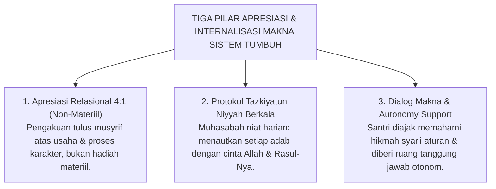
<div align="center"><sub><b>Gambar 1.4.4:</b> Tiga Pilar Model Apresiasi Relasional dan Internalisasi Makna Adab Ekosistem TUMBUH.</sub></div>

Penerapan pilar sistemik di lapangan:
1. **Apresiasi Relasional 4:1 (Bukan Hadiah Benda)**: Mengganti stiker materiil dengan apresiasi kata-kata tulus atas proses perjuangan santri (*"Ustadz bangga melihat antum tetap sabar mengantre tadi"*).
2. **Pembersihan Niat Berkala (*Tazkiyatun Niyyah*)**: Membiasakan santri memperbarui niat ikhlas sebelum piket, belajar, dan shalat agar terbiasa mengaitkan seluruh amalnya hanya kepada Allah SWT.
3. **Dialog Makna & Tanggung Jawab Otonom**: Mengajak santri berdiskusi memahami hikmah di balik aturan asrama, sehingga kepatuhan lahir dari kesadaran batin, bukan karena keterpaksaan.

---

## 📌 Catatan Kaki & Rujukan Primer

[^1]: **Burrhus Frederic Skinner**, *Science and Human Behavior* (New York: Macmillan, 1953); serta *About Behaviorism* (New York: Vintage Books, 1974).
[^2]: **Edward L. Deci & Richard M. Ryan**, *Intrinsic Motivation and Self-Determination in Human Behavior* (New York: Plenum, 1985); serta *Self-Determination Theory: Basic Psychological Needs in Motivation, Development, and Wellness* (New York: Guilford Press, 2017).
[^3]: **Alfie Kohn**, *Punished by Rewards: The Trouble with Gold Stars, Incentive Plans, A's, Praise, and Other Bribes* (Boston: Houghton Mifflin Company, 1993), hlm. 49–98.
[^4]: **Hujjatul Islam Imam Abu Hamid al-Ghazali**, *Ihya' 'Ulumiddin*, Kitab an-Niyyah wal Ikhlas wash-Shidq (Kairo & Beirut: Dar al-Ma'rifah, t.th.), Juz IV, hlm. 364–367.
[^5]: **Al-Imam Ibn al-Qayyim al-Jawziyyah**, *Al-Fawa'id*, Tahqiq: Syaikh Ali Hasan al-Halabi (Kairo: Dar al-Kutub al-Ilmiyyah, 1996), Fashl fi Ikhlasil Amal, hlm. 67–69.


---

# SUB-BAB 1.5: URGENSI REKONSTRUKSI PARADIGMA MENUJU EKOSISTEM TUMBUH
## *Sintesis Filosofis-Empiris, Deklarasi Enam Pilar Holistik, dan Peta Jalan Kebangkitan Peradaban Pesantren*

**Kode Klasifikasi**: `BOOK-01/BAB-01/SUB-05/MONOGRAF-MASTER-VIBRANT`  
**Disiplin Ilmu**: Filsafat Pendidikan Islam Terapan, Rekayasa Sistem Sosial Pesantren, & Teori Transformasi Kelembagaan  
**Penanggung Jawab Keilmuan**: Dewan Pakar Ekosistem TUMBUH[^4] (*Master Author, Pakar Filosofi TUMBUH, Arsitektur PBIS Restoratif, & Tata Kelola Qudwah*)

---

### Berdiri di Persimpangan Sejarah Peradaban Pesantren

Perjalanan panjang penelusuran kritis sepanjang empat sub-bab terdahulu menuntun kita pada satu kesimpulan yang terang benderang: **dunia pendidikan pesantren sedang berdiri di sebuah persimpangan sejarah yang amat menentukan**.

Di satu sisi, kita bersyukur atas warisan luhur nilai-nilai *Turats*, keberkahan sanad keilmuan para ulama, dan keikhlasan para pendiri pondok yang telah menjadi paku bumi moral Nusantara selama berabad-abad. Namun di sisi lain, kita tidak boleh lagi menutup mata dari kenyataan bahwa sistem pengasuhan yang berjalan hari ini kerap kali terperangkap di antara dua kutub kegagalan:

```mermaid
graph TD
    Krisis["DIALEKTIKA KRISIS PENDIDIKAN PESANTREN KONVENSIONAL"]
    
    Krisis --> K1["Sub-Bab 1.1: Krisis Metodologis (Diskoneksi Kognitif-Praksis)<br/>Hafalan kitab adab terhenti sebagai teori kelas, terputus dari gerak refleks motorik di bilik asrama."]
    
    Krisis --> K2["Sub-Bab 1.2: Krisis Sosiologis (Kekerasan & Feodalisme Senioritas)<br/>Normalisasi agresi fisik berkedok penempaan mental melahirkan trauma dendam antargenerasi."]
    
    Krisis --> K3["Sub-Bab 1.3: Krisis Neurobiologis (Trauma Amigdala & Kelumpuhan PFC)<br/>Teror bentakan membakar amigdala dan mematikan sirkuit pertimbangan nalar moral otak remaja."]
    
    Krisis --> K4["Sub-Bab 1.4: Krisis Aksiologis (Reduksionisme Sekuler & Erosi Ikhlas)<br/>Sistem reward-token materiil mereduksi kesucian niat ibadah menjadi jiwa transaksional."]
```
<div align="center"><sub><b>Gambar 1.5.1:</b> Peta Empat Dimensi Dialektika Krisis Pendidikan Karakter Pesantren Konvensional.</sub></div>

Peta dialektika di atas menunjukkan bahwa masalah yang kita hadapi bukanlah persoalan sepele:
* Bertahan pada metode kekerasan dan feodalisme masa lalu adalah sebuah kezaliman syar'i dan kejahatan neurobiologis yang menghancurkan fitrah anak.
* Mengadopsi sistem hadiah-hukuman mekanis secara membabi buta adalah bunuh diri spiritual yang memadamkan api keikhlasan di dalam dada santri.

Kita membutuhkan sebuah lompatan peradaban baru: sebuah rekonstruksi pengasuhan yang berakar kokoh pada **Turats Islam Nabawi** dan ditopang secara presisi oleh **Sains Perkembangan Manusia Terkini**.

---

### Deklarasi Epistemologis Arsitektur Enam Pilar Ekosistem TUMBUH

Menjawab panggilan sejarah ini, Ekosistem **TUMBUH** lahir sebagai sintesis agung (*The Grand Synthesis*) yang menyatukan seluruh denyut kehidupan pesantren di atas **Enam Pilar Terpadu**:

```mermaid
graph TD
    Root["ARSITEKTUR ENAM PILAR EKOSISTEM TUMBUH"]
    
    Root --> T["T - TARBIYAH (Pengasuhan Holistik 24-Jam)<br/>Penyatuan utuh tanpa sekat antara madrasah & asrama, memadukan ta'lim akal, tarbiyah raga, & ta'dib jiwa."]
    
    Root --> U["U - UKHUWAH (Budaya Asrama Restoratif)<br/>Pemberantasan mutlak perundungan & feodalisme menuju iklim persaudaraan aman berlandaskan kasih sayang."]
    
    Root --> M["M - MUTAWAATZIN (Keseimbangan Multi-Dimensi)<br/>Penyelarasan proporsional antara hak ruhiyah, beban kognitif, kebugaran fisik, stabilitas emosi, & jam tidur."]
    
    Root --> B["B - BARAKAH (Kemurnian Tauhid & Keikhlasan Niat)<br/>Menolak transaksi reward materiil, menanamkan kesadaran muraqabatullah dan tazkiyatun niyyah di setiap amal."]
    
    Root --> Un["U - UNGGUL (Kemandirian & Prestasi Berkelanjutan)<br/>Pengembangan potensi fitrah santri melalui trajektori Tangga T1-T4 hingga mencapai Tahap 7 Penggerak."]
    
    Root --> H["H - HASANAH (Keteladanan Qudwah & Maslahat Ummat)<br/>Kepemimpinan asatidz berbasis Servant Qudwah Leadership yang melahirkan profil santri Nafi'un Lighairihi."]
```
<div align="center"><sub><b>Gambar 1.5.2:</b> Arsitektur Enam Pilar Filosofis-Operasional Ekosistem TUMBUH.</sub></div>

Enam pilar yang terangkum dalam akronim **T-U-M-B-U-H** di atas merefleksikan arah pembaruan total:
1. **T - TARBIYAH (Pengasuhan Holistik 24-Jam)**: Menghubungkan guru madrasah dan musyrif asrama ke dalam satu sistem pertukaran data harian 15 menit.
2. **U - UKHUWAH (Budaya Asrama Restoratif)**: Menegakkan kebijakan nol kekerasan (*Zero Violence*) dan mengganti balas dendam dengan pemulihan persaudaraan (*Ishlah al-Bain*).
3. **M - MUTAWAATZIN (Keseimbangan Multi-Dimensi)**: Menjaga hak biologis santri—makanan bergizi, olahraga, dan tidur 7–8 jam yang cukup—agar otak santri berada dalam kondisi prima untuk menyerap adab.
4. **B - BARAKAH (Kemurnian Tauhid & Keikhlasan Niat)**: Menjaga ketulusan amal melalui apresiasi relasional 4:1 dan pembersihan niat berkala, bebas dari manipulasi reward materiil.
5. **U - UNGGUL (Kemandirian & Prestasi Berkelanjutan)**: Membimbing santri menaiki tangga perkembangan karakter (T1 Tahu Adab, T2 Mau Beradab, T3 Mampu Beradab Mandiri, hingga T4 Menjadi Teladan Penggerak).
6. **H - HASANAH (Keteladanan Qudwah & Maslahat Ummat)**: Menjadikan asatidz dan musyrif sebagai sumber keteladanan hidup (*Qudwah Hasanah*) yang melahirkan santri berjiwa pelayan umat (*Nafi'un Lighairihi*).

---

### Matriks Transformasi Paradigma: Perbandingan Tiga Pendekatan

Tabel berikut menyajikan komparasi jernih antara paradigma lama yang problematik, behaviorisme sekuler, dan arsitektur rekonstruktif TUMBUH:

| Dimensi Pembinaan | Paradigma Tradisional Usang | Paradigma Sekuler Mekanistik | Paradigma Rekonstruktif TUMBUH |
| :--- | :--- | :--- | :--- |
| **Pandangan atas Santri** | Objek pasif yang bebal, harus ditundukkan dengan teror rasa takut. | Organisme refleks yang dimanipulasi dengan imbalan dan hukuman. | **Makhluk mulia berfitrah suci (*Fitrah al-Munazzalah*) yang potensinya disuburkan.** |
| **Metode Disiplin** | Hukuman fisik (rotan/tamparan), pembentakan massal, dan sidang senior. | Sistem poin defisit hitam, denda uang saku, dan pemotongan hak token. | **Disiplin Restoratif[^2] (*Firm & Kind*), Konsekuensi Logis 4R, dan *Ishlah al-Bain*.** |
| **Landasan Saraf Otak** | Mengabaikan biologi; mengaktifkan amigdala *fight-or-flight* secara kronis. | Memanfaatkan sistem dopamin ekstrinsik semata (*addictive reward loops*). | **Menjaga status *Ventral Vagal (Safe & Connected)* untuk optimalisasi Korteks Prefrontal.** |
| **Struktur Pengasuhan** | Terbelah (madrasah jalan sendiri, asrama tanpa pendampingan pembina). | Pengasuhan administratif formal yang kaku tanpa sentuhan hati. | **Dual-Pillar Caretaking terintegrasi via Handover 15-Menit & Sistem PBIS Multi-Tier[^1].** |
| **Motivasi Moral** | Ketakutan akan ancaman sanksi fisik (*External Regulation*). | Perburuan stiker hadiah dan pujian duniawi (*Introjected Regulation*). | **Internalisasi nilai adab berakar dari kesadaran *Muraqabatullah* & Ikhlas.** |
| **Posisi Pelanggaran** | Aib memalukan yang harus dibalas dan dipermalukan di depan umum. | Pengurangan skor angka semata pada buku catatan pelanggaran. | **Peluang pembelajaran moral (*Learning Opportunity*) melalui muhasabah & restitusi.** |

---

### Peta Jalan Implementasi Menuju Seri Buku Master TUMBUH

Rekonstruksi filosofis pada Bab 01 ini berakar pada de-sekularisasi ilmu Prof. Naquib al-Attas[^3] dan khazanah kepengasuhan adab Hadhratusy Syaikh KH. M. Hasyim Asy'ari[^4], yang menjadi pintu pembuka bagi seluruh arsitektur praktis pada volume-volume berikutnya dalam Seri Buku Master TUMBUH:

```mermaid
graph TD
    Vol1["VOLUME 01: AKAR FILOSOFIS & EPISTEMOLOGI<br/>(Fondasi Teologis, Ontologi Fitrah, Kritik Kekerasan, & Aksiologi Maqashid)"]
    
    Vol1 ==> Vol2["VOLUME 02: TAKSONOMI KAPASITAS & 10 PROFIL KARAKTER<br/>(Penerjemahan Filosofi Menjadi Kurikulum 10 Muwashafat & Tangga T1-T4)"]
    
    Vol2 ==> Vol3["VOLUME 03: SISTEM ASESMEN PERKEMBANGAN IPSATIF<br/>(Metodologi Pengukuran Berbasis Bukti, Validitas Psikometrik, & Logbook PBIS)"]
    
    Vol3 ==> Vol4["VOLUME 04: PEDOMAN INTERVENSI MULTI-TIER PBIS & RESTORATIF<br/>(Manual Klinis PBIS Tier 1-3, CICO, FBA/BIP, & Lingkaran Restoratif Asrama)"]
    
    Vol4 ==> Vol5["VOLUME 05: MANUAL OPERASIONAL & TATA KELOLA 24-JAM<br/>(SOP Dual-Pillar, Jadwal Ritme Asrama, Anti-Burnout, & Safe School Protocols)"]
```
<div align="center"><sub><b>Gambar 1.5.3:</b> Peta Jalan Transmisi Kurikulum Master 5 Volume Seri Buku Ekosistem TUMBUH.</sub></div>

Peta jalan 5 volume ini menjamin setiap pilar filosofis diterjemahkan ke dalam tata kelola harian yang nyata:
* **Volume 01** meletakkan fondasi teologis, ontologis, dan kritik epistemologis.
* **Volume 02** merumuskan Taksonomi 10 Kapasitas Karakter (*Muwashafat*) dan Tangga Capaian T1–T4.
* **Volume 03** menyediakan metodologi pengukuran perkembangan karakter berbasis bukti melalui Logbook PBIS Digital.
* **Volume 04** menyajikan panduan intervensi multi-tier (Tier 1 Universal, Tier 2 Targeted CICO, dan Tier 3 Intensive FBA/BIP) serta protokol disiplin restoratif.
* **Volume 05** menyusun SOP manajemen pengasuhan 24 jam, perlindungan anak (*Safe School Protocols*), dan tata kelola musyrif anti-burnout.

---

### Epilog Bab 01: Menghidupkan Kembali Ruh Kejayaan Peradaban Pesantren

Wahai para kiai, pengasuh, asatidz, dan pejuang pendidikan Islam di seluruh Nusantara...

Pesantren bukanlah sekadar tempat penitipan anak, bukan pula pabrik penghafal teks yang dingin. Pesantren adalah rahim peradaban Islam—tempat di mana mutiara-mutiara fitrah anak titipan umat diasuh dengan kelembutan kasih sayang, ditempa dengan keteladanan akhlak nabawi, dan dipersiapkan untuk memimpin umat di masa depan.

Krisis karakter yang kita hadapi hari ini adalah panggilan suci untuk berbenah. Mari kita tinggalkan kekerasan yang melukai raga anak; mari kita bersihkan pengasuhan kita dari transaksi hadiah materiil yang merusak keikhlasan; dan mari kita satukan tekad untuk membangun **Ekosistem TUMBUH**: sebuah taman peradaban Islam yang aman, hangat, berkeadilan, dan sarat keberkahan Ilahi.

Dari bilik-bilik asrama yang penuh cinta inilah, kelak akan bangkit generasi santri paripurna: mereka yang kokoh aqidahnya, luas wawasan keilmuannya, lembut tutur katanya, luhur budi pekertinya, dan mendedikasikan seluruh hidupnya sebagai rahmat bagi semesta alam (*Rahmatan lil 'Alamin*).

---

## 📌 Catatan Kaki & Rujukan Primer

[^1]: **George Sugai & Robert H. Horner**, "The evolution of discipline practices: School-wide positive behavior supports", *Child & Family Behavior Therapy*, Vol. 24, No. 1–2 (2002), hlm. 23–50.
[^2]: **Howard Zehr**, *The Little Book of Restorative Justice* (Intercourse: Good Books, 2002; Revised Edition, Skyhorse Publishing, 2015).
[^3]: **Prof. Dr. Syed Muhammad Naquib al-Attas**, *Islam and Secularism* (Kuala Lumpur: Muslim Youth Movement of Malaysia / ABIM, 1978; ISTAC, 1993), Bab 4: "The De-Westernization of Knowledge".
[^4]: **Hadhratusy Syaikh KH. M. Hasyim Asy'ari**, *Adab al-'Alim wal Muta'allim fi ma Yahtaju Ilayhi al-Muta'allim fi Ahwal Ta'allumihi wa ma Yatawaqqafu 'alayhi al-Mu'allim fi Maqamat Ta'limihi* (Jombang: Maktabah at-Turats al-Islami, 1415 H), hlm. 15–28.


---

# SUB-BAB 2.1: KONSEP FITRAH AL-MUNAZZALAH & KESUCIAN PRIMORDIAL
## *Hakikat Insan Pembelajar dalam Pandangan Teologi Islam, Hermeneutika Perjanjian Azali, dan Bantahan atas Tabula Rasa Sekuler*

**Kode Klasifikasi**: `BOOK-01/BAB-02/SUB-01/MONOGRAF-MASTER-VIBRANT`  
**Disiplin Ilmu**: Teologi Islam (*Ilmul Kalam*), Antropologi Filosofis, Psikologi Perkembangan Fitrah, & Epistemologi Turats  
**Penanggung Jawab Keilmuan**: Dewan Pakar Ekosistem TUMBUH (*Master Author, Pakar Filosofi TUMBUH, & Pakar Epistemologi Turats*)

---

### Jejak Cahaya di Lubuk Jiwa Setiap Santri

Pernahkah kita merenungkan sebuah keajaiban batin yang terjadi Ketika seorang santri baru melangkah melewati pintu gerbang pondok?

Di dalam dadanya, anak itu tidak datang dengan kekosongan mutlak tanpa arah. Jauh di kedalaman jiwanya yang paling hening, tersimpan sebuah kompas batin yang tak kasat mata: kerinduan alami kepada kebenaran, rasa kagum pada kebaikan, rasa bersalah Ketika berbuat zalim, dan getaran cinta kepada Sang Pencipta.

Pendidikan Islam tidak pernah memandang santri sebagai "kertas putih kosong" yang pasif, apalagi memandangnya sebagai "makhluk kotor pembawa dosa warisan" yang harus ditaklukkan dengan pentungan. Di dalam pandangan teologi Islam, setiap anak manusia lahir membawa **Kesucian Primordial (*Fitrah al-Munazzalah*)**—sebuah cetak biru keluhuran moral yang telah dipatri langsung oleh Allah SWT sejak di alam arwah.

```mermaid
graph TD
    AlamArwah["ALAM ARWAH: PERJANJIAN AZALI (AL-MITHAQ)<br/>Kesaksian Jiwa atas Rububiyyah Allah SWT (QS. Al-A'raf: 172)"]
    AlamArwah --> Kelahiran["KELAHIRAN KE DUNIA: KESUCIAN PRIMORDIAL (FITRAH)<br/>Membawa Potensi Tauhid, Integritas Moral, & Kerinduan pada Kebaikan"]
    
    Kelahiran --> BiahTUMBUH["BI'AH SHALIHAH (Ekosistem TUMBUH)<br/>Menyiram Benih Fitrah dengan Qudwah, Kasih Sayang, & Ta'dib"]
    BiahTUMBUH --> Mekar["FITRAH MEKAR SEMPURNA MENJADI INSAN ADABI"]
    
    Kelahiran --> BiahToksik["LINGKUNGAN TOKSIK (Kekerasan & Teror)<br/>Menimbun Fitrah dengan Trauma, Dendam, & Sandiwara Moral"]
    BiahToksik --> Tertutup["FITRAH TERBELENGGU (GHUBRA & FASAD)"]
```
<div align="center"><sub><b>Gambar 2.1.1:</b> Trajektori Perjalanan Fitrah dari Perjanjian Azali Menuju Mekarnya Insan Adabi dalam Ekosistem TUMBUH.</sub></div>

Bagan di atas merangkum perjalanan eksistensial fitrah manusia: benih kesucian yang dibawa sejak alam arwah akan mekar menjadi pribadi santri paripurna jika disiram oleh lingkungan yang hangat (*Bi'ah Shalihah*), atau sebaliknya akan tertimbun debu kepalsuan jika dirusak oleh pola asuh kekerasan.

---

### Prolegomena Teologis: Perjanjian Azali (*Al-Mithaq*) sebagai Akar Eksistensial

Al-Qur'an mengabadikan dialog agung yang mendasari eksistensi ruhani setiap manusia:

> [!NOTE]
> ### 📜 Firman Allah SWT tentang Kesaksian Primordial Jiwa Manusia:
> 
> $$\text{وَإِذْ أَخَذَ رَبُّكَ مِن بَنِي آدَمَ مِن ظُهُورِهِمْ ذُرِّيَّتَهُمْ وَأَشْهَدَهُمْ عَلَىٰ أَنفُسِهِمْ أَلَسْتُ بِرَبِّكُمْ ۖ قَالُوا بَلَىٰ ۛ شَهِدْنَا ۛ أَن تَقُولُوا يَوْمَ الْقِيَامَةِ إِنَّا كُنَّا عَنْ هَٰذَا غَافِلِينَ}$$
> 
> **Artinya:**  
> *"Dan (ingatlah) ketika Tuhanmu mengeluarkan keturunan anak-anak Adam dari sulbi mereka dan Allah mengambil kesaksian terhadap jiwa mereka (seraya berfirman): 'Bukankah Aku ini Tuhanmu?' Mereka menjawab: 'Benar (Engkau Tuhan kami), kami menjadi saksi.' (Kami lakukan yang demikian itu) agar di hari kiamat kamu tidak mengatakan: 'Sesungguhnya kami adalah orang-orang yang lengah terhadap ini.' "*  
> *(QS. Al-A'raf: 172)*

Perjanjian azali (*Al-Mithaq*) ini membuktikan bahwa fitrah santri pada dasarnya sudah mengenal Allah dan mencintai keadilan. Santri yang datang ke pondok bukanlah makhluk asing yang harus "dibuatkan moral baru dari nol", melainkan **jiwa yang perlu diingatkan kembali (*Tadzkir*) dan dibangunkan potensi fitrahnya yang tertidur (*Inma'ul Fitrah*)**.

---

### Bantahan Epistemologis atas Tabula Rasa Sekuler dan Doktrin Dosa Asal

Pandangan teologi Islam mengenai fitrah berdiri tegak menolak dua kutub ekstrem filsafat Barat yang keliru:

```mermaid
graph LR
    subgraph Barat1["DOKTRIN DOSA ASAL (Augustinian Theology)"]
        D1["Manusia lahir dalam keadaan rusak/berdosa warisan, harus dihukum keras."]
    end

    subgraph Islam["TEOLOGI FITRAH ISLAM (TUMBUH)"]
        I1["Manusia lahir suci membawa potensi tauhid (Hanif), tugas pendidik adalah menumbuhkan."]
    end

    subgraph Barat2["DOKTRIN TABULA RASA (Empirisisme John Locke)"]
        D2["Manusia lahir seperti kertas kosong netral tanpa kecenderungan bawaan."]
    end

    Barat1 <-->|"Kritik Islam"| Islam
    Islam <-->|"Kritik Islam"| Barat2
```
<div align="center"><sub><b>Gambar 2.1.2:</b> Distingsi Epistemologis antara Teologi Fitrah Islam, Doktrin Dosa Asal, dan Tabula Rasa.</sub></div>

Dua kekeliruan besar filsafat Barat yang dibantah secara tuntas oleh Islam:

1. **Bantahan atas Doktrin Dosa Asal (*Original Sin*)**:  
   Teologi Abad Pertengahan Barat memandang anak lahir membawa kutukan dosa nenek moyang, sehingga mendidik anak diartikan sebagai "menghancurkan kedagingan yang kotor" lewat siksaan fisik. Islam menolak keras paham ini: setiap anak terlahir suci (*thahir*), bersih tanpa dosa, dan tidak memikul kesalahan orang lain (QS. Al-An'am: 164).
2. **Bantahan atas Doktrin Tabula Rasa (*The Blank Slate*)**:  
   Filsuf John Locke[^1] menganggap jiwa anak ibarat kertas putih kosong yang pasif tanpa potensi bawaan. Pandangan ini keliru karena mereduksi manusia menjadi benda mati yang dibentuk semata-mata oleh indoktrinasi lingkungan luar.

Islam menegaskan sabda abadi Rasulullah SAW:
$$\text{كُلُّ مَوْلُودٍ يُولَدُ عَلَى الْفِطْرَةِ، فَأَبَوَاهُ يُهَوِّدَانِهِ أَوْ يُنَصِّرَانِهِ أَوْ يُمَجِّسَانِهِ}$$
*"Setiap anak dilahirkan di atas fitrah kesucian; maka kedua orang tuanyalah (lingkungannyalah) yang menjadikannya Yahudi, Nasrani, atau Majusi."* (HR. Al-Bukhari no. 1358 dan Muslim no. 2658).

---

### Analisis Turats Ibn Taimiyyah & Al-Ghazali tentang Sifat Fitrah

Syaikhul Islam **Ibnu Taimiyyah** dalam karyanya *Dar' Ta'arudh al-'Aql wan-Naql*[^2] memberikan perumpamaan yang sangat cemerlang tentang bagaimana fitrah manusia bekerja:

> [!NOTE]
> ### 📜 Mutiara Ibnu Taimiyyah tentang Daya Tarik Fitrah Menuju Kebaikan:
> 
> $$\text{إِنَّ الْفِطْرَةَ سَلِيمَةٌ تَقْتَضِي مَعْرِفَةَ الْحَقِّ وَمَحَبَّتَهُ، وَلَكِنْ قَدْ يَعْرِضُ لَهَا مَا يُفْسِدُهَا مِنَ الشُّبُهَاتِ وَالشَّهَوَاتِ، كَمَا أَنَّ الْعَيْنَ الصَّحِيحَةَ تَقْتَضِي رُؤْيَةَ الشَّمْسِ إِلَّا أَنْ يَحُولَ بَيْنَهَا وَبَيْنَهَا حِجَابٌ}$$
> 
> **Artinya:**  
> *"Sesungguhnya fitrah manusia pada dasarnya sehat dan selamat; ia secara alami menuntut untuk mengenal kebenaran dan mencintainya. Namun terkadang menimpa kepadanya hal-hal yang mengotorinya berupa kerancuan pemikiran (*syubhat*) dan hawa nafsu primitif (*syahwat*)—**sebagaimana mata yang sehat secara alami menuntut untuk melihat cahaya matahari, kecuali jika ada tabir tebal yang menghalanginya**."*

Senada dengan itu, **Imam Abu Hamid Al-Ghazali** dalam *Ihya 'Ulumiddin*[^3] menggambarkan kalbu anak ibarat permata murni:

> [!NOTE]
> ### 📜 Pesan Imam Al-Ghazali tentang Hati Anak:
> 
> $$\text{الصَّبِيُّ أَمَانَةٌ عِنْدَ وَالِدَيْهِ، وَقَلْبُهُ الطَّاهِرُ جَوْهَرَةٌ نَفِيسَةٌ سَاذَجَةٌ خَالِيَةٌ عَنْ كُلِّ نَقْشٍ وَصُورَةٍ، وَهُوَ قَابِلٌ لِكُلِّ مَا نُقِشَ، وَمَائِلٌ إِلَى كُلِّ مَا يُمَالُ بِهِ إِلَيْهِ}$$
> 
> **Artinya:**  
> *"Anak adalah amanah suci di tangan kedua orang tua dan para pendidiknya. Kalbunya yang bersih adalah permata yang amat berharga, murni, dan siap menerima ukiran kebaikan yang digoreskan padanya."*

---

### Temuan Sains Modern: Bukti Moral Bawaan Sejak Bayi

Kebenaran konsep fitrah Islam kini divalidasi secara menakjubkan oleh riset sains perkembangan anak mutakhir:
* **Riset Yale University oleh Prof. Paul Bloom**[^4] dalam *Just Babies: The Origins of Good and Evil* membuktikan bahwa bayi manusia usia 3–6 bulan secara konsisten memilih karakter yang suka menolong dibanding karakter yang jahat. Ini adalah bukti empiris bahwa rasa keadilan dan empati bukanlah buatan manusia, melainkan perangkat lunak bawaan (*innate moral sense*) yang sudah terpasang sejak lahir.
* **Teori Moral Foundations oleh Jonathan Haidt**[^5] dalam *The Righteous Mind* membuktikan manusia lahir dengan intuisi kebaikan universal (kepedulian, keadilan, dan kesucian) sebelum mereka belajar membaca teori moral.

Ketika seorang santri melakukan kesalahan di asrama, kesalahan itu bukanlah bukti bahwa jiwanya cacat, melainkan karena benih fitrahnya sedang terhalang oleh debu kebiasaan buruk atau rasa takut yang belum dibimbing dengan benar.

---

### Solusi Sistemik TUMBUH: Empat Prinsip Ta'dib Berbasis Fitrah

Berpijak pada ontologi fitrah ini, **Sistem TUMBUH** merumuskan **Empat Prinsip Ta'dib Fitrah**:

```mermaid
graph TD
    PrinsipFitrah["EMPAT PRINSIP TA'DIB FITRAH EKOSISTEM TUMBUH"]
    
    PrinsipFitrah --> F1["1. Menjaga Martabat Kemanusiaan (Karamah Insaniyyah)<br/>Santri diperlakukan sebagai hamba Allah yang mulia, bukan objek pelampiasan emosi."]
    
    PrinsipFitrah --> F2["2. Pendekatan Berbasis Potensi Kebaikan (Strength-Based)<br/>Fokus pembinaan adalah menumbuhkan kebaikan santri, bukan melabeli kekurangannya."]
    
    PrinsipFitrah --> F3["3. Keteladanan Nyata Sebelum Kata (Qudwah Hasanah)<br/>Fitrah santri menyerap contoh akhlak musyrif jauh lebih cepat daripada ribuan ceramah."]
    
    PrinsipFitrah --> F4["4. Rekayasa Ekologi yang Bersih & Aman (Bi'ah Shalihah)<br/>Menciptakan asrama yang hangat agar benih fitrah mekar tanpa terhalang teror ketakutan."]
```
<div align="center"><sub><b>Gambar 2.1.3:</b> Empat Prinsip Ta'dib Fitrah Ekosistem TUMBUH dalam Membimbing Santri.</sub></div>

Penerapan prinsip fitrah ini di pesantren:
1. **Karamah Insaniyyah**: Tidak ada lagi hukuman fisik, caci maki, atau pembentakan, karena tubuh dan kehormatan santri adalah amanah suci Allah SWT.
2. **Strength-Based Approach**: Guru fokus mencari percikan kebaikan pada setiap anak—bahkan pada anak yang paling sering melanggar—lalu membesarkan percikan tersebut menjadi api karakter yang kuat.
3. **Qudwah Hasanah**: Para asatidz dan musyrif menampilkan akhlak sabar, jujur, dan disiplin dalam kehidupan nyata di hadapan santri.
4. **Bi'ah Shalihah**: Menjaga lingkungan asrama selalu aman dan penuh kasih sayang, sehingga fitrah santri bertumbuh mekar dengan subur.

---

## 📌 Catatan Kaki & Rujukan Primer

[^1]: **John Locke**, *An Essay Concerning Human Understanding*, Ed. Peter H. Nidditch (Oxford: Clarendon Press, 1975; cetak ulang dari edisi orisinal 1690), Buku II, Bab I, hlm. 104.
[^2]: **Syaikhul Islam Ibnu Taimiyyah**, *Dar' Ta'arudh al-'Aql wan-Naql*, Tahqiq: Dr. Muhammad Rasyad Salim (Riyadh: Jami'ah al-Imam Muhammad bin Su'ud al-Islamiyyah, 1411 H), Jilid VIII, hlm. 446–450.
[^3]: **Hujjatul Islam Imam Abu Hamid al-Ghazali**, *Ihya' 'Ulumiddin*, Kitab Riyadhatin Nafs wa Tahdzibil Akhlaq (Kairo & Beirut: Dar al-Ma'rifah, t.th.), Jilid III, hlm. 72–75.
[^4]: **Paul Bloom**, *Just Babies: The Origins of Good and Evil* (New York: Crown Publishers / Random House, 2013), hlm. 19–45.
[^5]: **Jonathan Haidt**, *The Righteous Mind: Why Good People Are Divided by Politics and Religion* (New York: Pantheon Books, 2012), Bab 6: "Taste Buds of the Righteous Mind", hlm. 111–134.


---

# SUB-BAB 2.2: STRUKTUR PSIKO-SPIRITUAL: DINAMIKA NAFS, AQL, & QALB
## *Anatomi Kejiwaan Manusia dalam Turats Imam Al-Ghazali dan Ibn al-Qayyim serta Integrasinya dengan Neurosains Kognitif Kontemporer*

**Kode Klasifikasi**: `BOOK-01/BAB-02/SUB-02/MONOGRAF-MASTER-VIBRANT`  
**Disiplin Ilmu**: Psikologi Spiritual Islam (*Ilm an-Nafs al-Islami*), Tasawuf Falsafi, Neurokardiologi, & Epistemologi Turats  
**Penanggung Jawab Keilmuan**: Dewan Pakar Ekosistem TUMBUH (*Master Author, Pakar Filosofi TUMBUH, & Pakar Neurosains Perkembangan*)

---

### Metafora Kerajaan di Dalam Diri Manusia

Bayangkan sebuah negeri kerajaan yang megah di dalam diri setiap santri:

Di singgasana istana, duduk **Sang Raja (Al-Qalb / Kalbu)** yang memegang tongkat kepemimpinan. Di sampingnya berdiri **Perdana Menteri yang bijaksana (Al-'Aql / Akal)** yang bertugas menimbang maslahat dan memberi pertimbangan nalar. Di luar istana, bertugas **Panglima Kepolisian (Al-Ghadhab / Daya Amarah)** yang bertugas menjaga kedaulatan dan membela kebenaran, serta **Pelayan Logistik (Asy-Syahwah / Daya Keinginan Biologis)** yang bertugas mendatangkan makanan dan memenuhi kebutuhan hidup.

Perumpamaan agung yang ditulis oleh **Imam Abu Hamid Al-Ghazali** dalam *Ihya 'Ulumiddin*[^1] ini menjelaskan rahasia keseimbangan jiwa manusia:

> [!NOTE]
> ### 📜 Tamsil Kerajaan Jiwa Imam Al-Ghazali:
> 
> $$\text{إِذَا اسْتَعَانَ الْمَلِكُ بِوَزِيرِهِ، وَقَهَرَ الْعَبْدَ وَصَاحِبَ الشُّرْطَةِ وَجَعَلَهُمَا تَحْتَ إِشَارَةِ الْوَزِيرِ، صَلَحَتْ أَحْوَالُ الْمَمْلَكَةِ وَعَمَّ الْعَدْلُ}$$
> 
> **Artinya:**  
> *"Ketika sang Raja (Kalbu) senantiasa meminta nasihat kepada Perdana Menterinya (Akal), serta menundukkan sang Pelayan (Syahwat) dan Panglima Polisi (Amarah) di bawah arahan sang Perdana Menteri, niscaya makmurlah negeri jiwa itu dan tegaklah keadilan.*  
> *Namun, apabila sang Pelayan atau sang Polisi memberontak dan menawan sang Raja, niscaya hancurlah negeri jiwa itu dan binasalah seluruh rakyatnya!"*

```mermaid
graph TD
    subgraph ArsitekturJiwa["ARSITEKTUR PSIKO-SPIRITUAL INSAN DALAM ISLAM"]
        Ruh["1. AR-RUH (Percikan Kehidupan Ilahiah / Al-Amr Al-Ilahi)<br/>Hakikat terdalam manusia yang ditiupkan Allah SWT (QS. Al-Hijr: 29)"]
        
        Qalb["2. AL-QALB (Pusat Kesadaran Transendental & Pengendali Akhlak)<br/>Tahta makrifatullah, pusat intuisi moral, keikhlasan, & cinta sejati"]
        
        Aql["3. AL-'AQL (Daya Intelektual & Penalaran Kritis)<br/>Kapasitas menimbang maslahat vs mafsadat, menganalisis kausalitas alam"]
        
        Nafs["4. AN-NAFS (Daya Dorong Biologis & Nafsu Alamiah)<br/>Nafsu makan/minum (Syahwat), amarah membela diri (Ghadhab), ego instingtif"]
        
        Ruh --- Qalb
        Qalb --> Aql
        Aql --> Nafs
    end
```
<div align="center"><sub><b>Gambar 2.2.1:</b> Struktur Hirarki Empat Dimensi Psiko-Spiritual Manusia dalam Khazanah Islam.</sub></div>

Pendidikan karakter dalam Islam **tidak pernah bertujuan membunuh nafsu atau mematikan amarah**. Tanpa nafsu makan santri akan mati kelaparan, dan tanpa daya amarah santri tidak akan punya keberanian membela kebenaran. Tujuan adab adalah **mendidik nafsu dan amarah agar tunduk di bawah kendali akal yang disinari oleh cahaya kalbu**.

---

### Empat Dimensi Jiwa Manusia dalam Khazanah Islam

Khazanah Islam memetakan kepribadian insan ke dalam empat dimensi yang saling melengkapi:

1. **Ar-Ruh (الرُّوح)**: Percikan kehidupan ilahiah (*Al-Amr al-Ilahi*) yang ditiupkan Allah ke dalam jasad janin (QS. Al-Hijr: 29). Dimensi inilah yang membuat manusia selalu haus akan makna hidup dan rindu bersujud kepada Allah.
2. **Al-Qalb (القَلْب)**: Pusat kesadaran spiritual dan kompas moral manusia. Dinamakan *Qalb* (yang berbolak-balik) karena sifatnya yang sangat dinamis. Kalbulah yang menjadi tempat bersemayamnya keikhlasan, cinta, dan iman.
3. **Al-'Aql (العَقْل)**: Daya nalar dan instrumen analitis untuk menimbang sebab-akibat, membedakan mana yang bermanfaat dan mana yang membahayakan.
4. **An-Nafs (النَّفْس)**: Daya dorong biologis hayati yang mencakup nafsu makan (*syahwat*) dan dorongan membela diri (*ghadhab*).

---

### Distingsi Epistemologis: Model Jiwa Islam vs Plato

Secara historis, filsuf Yunani Plato merumuskan konsep tiga jiwa (*The Tripartite Soul*): *Epithymia* (nafsu), *Thymos* (emosi), dan *Logistikon* (rasio). Namun terdapat perbedaan mendasar antara pandangan sekuler Barat dan Islam:

```mermaid
graph LR
    subgraph ModelPlato["MODEL FILSAFAT RATIO SEKULER"]
        P1["Rasio Akal (Logistikon) adalah Otoritas Moral Tertinggi"]
    end

    subgraph ModelIslam["MODEL PSIKOSPIRITUAL ISLAM (TUMBUH)"]
        I1["Akal adalah Pelayan Logis, namun Mahkota Tertinggi adalah KALBU (QALB) yang Menerima Petunjuk Wahyu Ilahi"]
    end

    ModelPlato <-->|"Distingsi Fundamental"| ModelIslam
```
<div align="center"><sub><b>Gambar 2.2.2:</b> Perbedaan Ontologis antara Rasionalisme Sekuler dan Psikospiritual Islam.</sub></div>

Bagi filsafat Barat, akal rasional adalah penguasa tertinggi. Namun Islam membuktikan bahwa akal yang cerdas bisa saja berubah menjadi alat kelicikan (*cunning intellect*) jika kalbunya buta dari iman. Oleh karena itu, dalam Islam, mahkota tertinggi yang memimpin hidup manusia adalah **Qalb**—organ spiritual yang memiliki mata batin (*Bashirah*) untuk menyaksikan kebenaran (QS. Al-Hajj: 46).

---

### Integrasi Neurosains: Sumbu Jantung-Otak (*The Brain-Heart Axis*)

Kajian mutakhir dalam neurobiologi klinis oleh *HeartMath Institute*[^2] kini membuktikan secara empiris bahwa kedudukan kalbu bukanlah sekadar bahasa kiasan, melainkan memiliki dasar biologis yang sangat nyata:

```mermaid
graph TD
    Dzikir["Ketenangan Kalbu: Dzikir, Tilawah, Shalat Khusyuk, & Ikhlas"] --> Koherensi["Koherensi Irama Jantung (Heart Rate Variability / HRV)"]
    Koherensi --> JalurAferen["Sinyal Saraf Naik Melalui Jalur Saraf Vagus Menuju Otak"]
    JalurAferen --> OptimalPFC["Optimalisasi Korteks Prefrontal (PFC): Daya Ingat Kuat & Emosi Stabil"]
```
<div align="center"><sub><b>Gambar 2.2.3:</b> Sumbu Jantung-Otak (Brain-Heart Axis): Dampak Ketenangan Kalbu terhadap Fungsi Kognitif Otak.</sub></div>

Fakta ilmiah membuktikan:
1. **Otak Kecil di Jantung (*The Little Brain in the Heart*)**: Jantung manusia memiliki lebih dari 40.000 sel neuron sensorik yang mampu memproses emosi dan menghasilkan hormon independen dari otak kepala.
2. **Sinyal dari Jantung ke Otak**: Terdapat lebih banyak kabel saraf yang mengirimkan sinyal dari jantung menuju otak dibanding sebaliknya.
3. **Koherensi Jantung-Otak**: Ketika santri berdzikir dengan khusyuk dan merasakan keikhlasan (*Qalb Salim*), detak jantung membentuk gelombang ritmis yang sangat halus (koheren). Sinyal ketenangan ini dikirim ke otak depan (*PFC*), yang seketika meningkatkan daya konsentrasi menghafal Al-Qur'an dan menstabilkan emosi santri.

---

### Solusi Sistemik TUMBUH: Penyelarasan Hak Triad Jiwa Santri

Berdasarkan struktur psiko-spiritual ini, **Sistem TUMBUH** mewajibkan pemenuhan hak tiga dimensi secara seimbang dalam jadwal harian pesantren:

```mermaid
graph TD
    RootHak["PENYELARASAN TIGA DIMENSI JIWA SANTRI SISTEM TUMBUH"]
    
    RootHak --> H1["1. Pemenuhan Hak Nafs Jasadi<br/>Makanan bergizi halal-thayyib, olahraga harian, & jaminan tidur 7-8 jam."]
    
    RootHak --> H2["2. Pengasahan Daya Akal ('Aqliyyah)<br/>Pembelajaran dialogis di kelas, diskusi memecahkan masalah, & nalar kritis."]
    
    RootHak --> H3["3. Penyucian Dimensi Kalbu (Ruhaniyyah)<br/>Shalat berjamaah awal waktu, tilawah tenang, & tazkiyatun nufus berkala."]
```
<div align="center"><sub><b>Gambar 2.2.4:</b> Tiga Pilar Penyelarasan Hak Psiko-Spiritual Santri dalam Ritme Keseharian TUMBUH.</sub></div>

1. **Hak Nafs Jasadi**: Santri dijamin mendapat asupan gizi yang baik, sarana olahraga, dan tidur yang manusiawi, sehingga nafsu biologisnya tenang dan tidak memberontak.
2. **Hak Akal 'Aqliyyah**: Pembelajaran kitab kuning disajikan secara interaktif agar akal santri terbiasa berpikir kritis dan memahami hikmah syariat.
3. **Hak Kalbu Ruhaniyyah**: Menjadikan masjid sebagai oase ketenangan batin melalui shalat khusyuk dan dzikir, menyiram dahaga spiritual santri setiap hari.

---

## 📌 Catatan Kaki & Rujukan Primer

[^1]: **Hujjatul Islam Imam Abu Hamid al-Ghazali**, *Ihya' 'Ulumiddin*, Kitab 'Aja'ibil Qalb (Kairo & Beirut: Dar al-Ma'rifah, t.th.), Jilid III, hlm. 6–10.
[^2]: **Rollin McCraty et al.**, "The coherent heart: Heart-brain interactions, psychophysiological coherence, and the emergence of system-wide order", *Integral Review*, Vol. 5, No. 2 (2009), hlm. 10–115; serta **J. Andrew Armour**, *Neurocardiology: Anatomical and Functional Principles* (New York: Oxford University Press, 1991).


---

# SUB-BAB 2.3: TINGKATAN NAFS: DARI AMMARAH MENUJU MUTMA'INNAH
## *Tahapan Gradasi Moral Santri, Dinamika Muhasabah Diri, dan Komparasi Tahap Perkembangan Ego-Moral Kontemporer*

**Kode Klasifikasi**: `BOOK-01/BAB-02/SUB-03/MONOGRAF-MASTER-VIBRANT`  
**Disiplin Ilmu**: Psikologi Perkembangan Islam (*Tazkiyatun Nafs*), Tasawuf 'Amali, Teori Perkembangan Moral, & Epistemologi Turats  
**Penanggung Jawab Keilmuan**: Dewan Pakar Ekosistem TUMBUH (*Master Author, Pakar Filosofi TUMBUH, & Pakar Desain Kurikulum Adab*)

---

### Memahami Tangga Pendakian Karakter Santri

Banyak pembina asrama sering kali kecewa dan putus asa Ketika melihat santri baru yang kemarin tampak bertobat, hari ini kembali mengulangi kesalahannya. 

Muncul prasangka keliru: *"Anak ini memang tidak berniat berubah!", "Percuma dinasihati!"*

Padahal, pertumbuhan karakter seorang anak manusia bukanlah peristiwa sulap yang terjadi dalam semalam. Jiwa manusia tidak berubah secara biner (dari "santri jahat" langsung menjadi "wali suci"). Al-Qur'an dan khazanah Islam memandang pembentukan akhlak sebagai sebuah **perjalanan pendakian spiritual (*As-Sayr was-Suluk*)** yang melintasi tiga etape kualitas jiwa:

```mermaid
graph TD
    subgraph TingkatanNafs["GRADASI DINAMIS NAFS DALAM AL-QUR'AN"]
        Ammarah["1. NAFS AMMARAH BI AS-SU' (QS. Yusuf: 53)<br/>• Tunduk pada dorongan nafsu impulsif & mementingkan diri sendiri.<br/>• Melanggar aturan saat tidak diawasi, belum peka rasa bersalah."]
        
        Lawwamah["2. NAFS LAWWAMAH (QS. Al-Qiyamah: 2)<br/>• Mulai bangkit suara hati nurani (*Muhasabah*) & pergulatan batin.<br/>• Kadang tergelincir, namun segera menyesal dan ingin memperbaiki diri."]
        
        Mutmainnah["3. NAFS MUTMA'INNAH (QS. Al-Fajr: 27-28)<br/>• Jiwa yang tenang, istiqamah, merasakan manisnya iman (*Halawatul Iman*).<br/>• Ketaatan adab menjadi refleks otomatis yang dicintai (*Muraqabah*)."]
        
        Ammarah -->|Etape 1: Ta'aruf & Adaptasi (T1)| Lawwamah
        Lawwamah -->|Etape 2: Habituasi & Internalisasi (T2-T3)| Mutmainnah
    end
```
<div align="center"><sub><b>Gambar 2.3.1:</b> Tiga Tingkatan Nafs dalam Al-Qur'an dan Tangga Metamorfosis Karakter Santri.</sub></div>

Peta tingkatan jiwa di atas mengajarkan kesabaran pedagogis: kekhilafan seorang santri bukanlah bukti kegagalan permanen, melainkan tanda bahwa ia sedang berjuang di tengah kancah pendakian jiwa.

---

### Tiga Tingkatan Nafs dalam Khazanah Islam

Al-Qur'an menguraikan tiga kualitas jiwa manusia:

1. **Nafs Ammarah bi as-Su' (النَّفْس الأمَّارَة بالسُّوء)**:  
   Jiwa yang masih dikuasai dorongan biologis dan hawa nafsu primitif (QS. Yusuf: 53). Santri pada level ini bertindak impulsif, mementingkan diri sendiri (misal: menyerobot antrean makanan), dan hanya patuh jika ada pengawasan fisik ketat.
2. **Nafs Lawwamah (النَّفْس اللَّوَّامَة)**:  
   Jiwa yang telah terbangun suara hatinya (*Muhasabah*) dan mencela dirinya sendiri Ketika berbuat salah (QS. Al-Qiyamah: 2). Santri di level ini mengalami pergulatan batin: ia tahu mana yang benar dan salah, kadang masih tergelincir karena godaan kawan, namun segera merasa menyesal dan ingin berbenah.
3. **Nafs Mutma'innah (النَّفْس المُطْمَئِنَّة)**:  
   Puncak kematangan jiwa yang telah tenteram dan damai bersama Allah (QS. Al-Fajr: 27–28). Santri di level ini berakhlak mulia secara mandiri, merasakan kenikmatan dalam ibadah, dan tulus melayani sesamanya.

---

### Mutiara Turats: Penjelasan Ibn al-Qayyim tentang Pergulatan Jiwa

Pakar jiwa Islam agung, **Imam Ibn al-Qayyim al-Jawziyyah** dalam *Madarij as-Salikin*[^1] menuliskan syarah yang amat mencerahkan:

> [!NOTE]
> ### 📜 Syarah Ibn al-Qayyim tentang Tiga Sifat Jiwa yang Silih Berganti:
> 
> $$\text{النَّفْسُ وَاحِدَةٌ، وَلَهَا صِفَاتٌ ثَلَاثَةٌ؛ فَتُسَمَّى أَمَّارَةً بِالسُّوءِ إِذَا غَلَبَتْ عَلَيْهَا الشَّهْوَةُ وَالْهَوَى، وَأَطَاعَتِ الشَّيْطَانَ. فَإِذَا اسْتَيْقَظَتْ مِنْ غَفْلَتِهَا وَلَامَتْ صَاحِبَهَا عَلَى التَّفْرِيطِ، وَتَرَدَّدَتْ بَيْنَ الطَّاعَةِ وَالْمَعْصِيَةِ، سُمِّيَتْ لَوَّامَةً. فَإِذَا رَضِيَتْ بِاللَّهِ رَبًّا، وَاطْمَأَنَّتْ إِلَى ذِكْرِهِ وَمَحَبَّتِهِ، وَصَارَتِ الطَّاعَةُ لَهَا غِذَاءً وَقُرَّةَ عَيْنٍ، سُمِّيَتْ مُطْمَئِنَّةً}$$
> 
> **Artinya:**  
> *"Jiwa manusia itu pada hakikatnya satu, namun ia memiliki tiga sifat yang silih berganti: ia dinamakan **Ammarah** Ketika hawa nafsu menguasainya. Ketika jiwa itu terbangun dari kelalaiannya lalu mencela dirinya sendiri atas kesalahannya, maka ia dinamakan **Lawwamah**. Dan Ketika ia telah tenteram bersama Allah, mencintai ketaatan, serta ibadah telah menjadi santapan ruh dan penyejuk matanya, maka ia dinamakan **Mutma'innah**."*

Uraian ini menyadarkan kita bahwa masa remaja santri adalah kancah pergulatan di level *Nafs Lawwamah*. Tugas pembina adalah menemani pergulatan tersebut dengan penuh kasih sayang, bukan memvonis dan mencampakkannya.

---

### Komparasi Sains: Tahap Perkembangan Moral Kohlberg vs Islam

Teori psikologi perkembangan moral barat oleh **Lawrence Kohlberg**[^2] menemukan keselarasan yang luar biasa dengan konsep *Nafs* Islam:

```mermaid
graph LR
    subgraph TuratsNafs["TINGKATAN NAFS TURATS"]
        N1["1. Nafs Ammarah<br/>(Motif: Takut Hukuman / Keinginan Primitif)"]
        N2["2. Nafs Lawwamah<br/>(Motif: Norma Sosial & Suara Hati Nurani)"]
        N3["3. Nafs Mutma'innah<br/>(Motif: Mahabbah & Tauhid Transendental)"]
    end

    subgraph KohlbergMoral["TAHAP MORAL KOHLBERG"]
        K1["Tingkat 1: Pre-Conventional<br/>(Orientasi Takut Hukuman Fisik)"]
        K2["Tingkat 2: Conventional<br/>(Orientasi Konformitas & Tertib Sosial)"]
        K3["Tingkat 3: Post-Conventional<br/>(Orientasi Prinsip Etika Universal)"]
    end

    N1 <===> K1
    N2 <===> K2
    N3 <===> K3
```
<div align="center"><sub><b>Gambar 2.3.2:</b> Komparasi Tingkatan Nafs dalam Turats dengan Tahap Perkembangan Moral Kohlberg.</sub></div>

Kohlberg membuktikan bahwa anak bergerak dari kepatuhan takut dihukum (*Pre-conventional*), menuju kepatuhan menjaga hubungan sosial (*Conventional*), hingga kesadaran prinsip etika mandiri (*Post-conventional*). 

Islam menyempurnakan teori Kohlberg: kematangan moral tertinggi tidak berhenti pada teori etika abstrak, melainkan bermuara pada **penyucian batin (*Tazkiyatun Nafs*) dan cinta tulus kepada Allah SWT** yang melahirkan kedamaian jiwa sejati (*Nafs Mutma'innah*).

---

### Solusi Sistemik TUMBUH: Pendekatan Berbasis Maqam Jiwa Santri

Ekosistem **TUMBUH** melarang pendekatan seragam yang memukul rata seluruh santri. Musyrif dibekali panduan pendampingan sesuai maqam jiwa santri:

| Tingkat Nafs Santri | Karakteristik Perilaku di Asrama | Strategi Pendampingan Sistem TUMBUH | Target Tangga TUMBUH |
| :--- | :--- | :--- | :---: |
| **1. Nafs Ammarah** | Sering lupa aturan, terburu-buru, impulsif membantah saat ditegur. | **Pendampingan Melekat (*Firm Scaffolding*)**: Jadwal harian yang terstruktur rapi, bimbingan langsung musyrif tanpa bentakan. | **Tangga T1**<br/>(Tahu & Paham Adab) |
| **2. Nafs Lawwamah** | Sudah paham aturan, kadang khilaf ikut kawan sekamar, namun merasa menyesal. | **Dialog Restoratif (*Restorative Inquiry*)**: Membimbing muhasabah batin, menyepakati ganti rugi/restitusi logis 4R. | **Tangga T2 & T3**<br/>(Mau & Mampu Beradab) |
| **3. Nafs Mutma'innah** | Mandiri dalam ibadah, pelopor kebersihan kamar, menyayangi adik kelas. | **Pemberdayaan Teladan (*Peer Mentorship*)**: Diberikan amanah sebagai Kakak Asuh dan duta teladan asrama. | **Tangga T4**<br/>(**Tahap 7 Penggerak**) |

---

## 📌 Catatan Kaki & Rujukan Primer

[^1]: **Al-Imam Ibn al-Qayyim al-Jawziyyah**, *Madarij as-Salikin bayna Manazil Iyyaka Na'budu wa Iyyaka Nasta'in*, Tahqiq: Muhammad al-Mu'tashim Billah al-Baghdadi (Beirut: Dar al-Kitab al-Arabi, 1416 H), Jilid I, hlm. 308–312.
[^2]: **Lawrence Kohlberg**, *The Psychology of Moral Development: The Nature and Validity of Moral Stages* (San Francisco: Harper & Row, 1984), Bab 3: "Synopses of Moral Stages", hlm. 170–211.


---

# SUB-BAB 2.4: REKONSTRUKSI TA'DIB, TARBIYAH, & TA'LIM
## *Analisis Semantik Prof. Dr. Syed Muhammad Naquib al-Attas, Integrasi Tiga Dimensi Pendidikan Islam, dan Penanaman Adab Paripurna*

**Kode Klasifikasi**: `BOOK-01/BAB-02/SUB-04/MONOGRAF-MASTER-VIBRANT`  
**Disiplin Ilmu**: Filsafat Bahasa Pendidikan Islam, Epistemologi Tarbiyah, & Teori Kurikulum Adab  
**Penanggung Jawab Keilmuan**: Dewan Pakar Ekosistem TUMBUH (*Master Author, Pakar Epistemologi Turats, & Pakar Desain Kurikulum Adab*)

---

### Mencari Ruh yang Hilang dalam Pendidikan Islam

Dalam khazanah bahasa Arab dan literatur Islam klasik, kita mengenal tiga istilah utama yang kerap digunakan silih berganti untuk menerjemahkan kata "pendidikan": **Ta'lim**, **Tarbiyah**, dan **Ta'dib**[^1].

Namun, di era modern saat ini, sebagian besar institusi pendidikan—termasuk kementerian, madrasah, dan banyak pesantren—secara luas mengadopsi istilah *Tarbiyah* atau *Ta'lim*, sementara istilah *Ta'dib* perlahan-lahan terpinggirkan dari wacana arus utama.

Apakah pergeseran istilah ini hanya sekadar masalah preferensi linguistik yang sepele? **Sama sekali tidak!**

Pakar filsafat pendidikan Islam terkemuka dunia, **Prof. Dr. Syed Muhammad Naquib al-Attas**[^1], membongkar bahwa reduksi istilah pendidikan menjadi sekadar *Ta'lim* atau *Tarbiyah* tanpa *Ta'dib* adalah salah satu akar penyebab terjadinya **Krisis Kehancuran Adab (*The Loss of Adab*)** di dunia Islam modern:
* Pendidikan tereduksi menjadi sekadar pabrik transfer informasi hafalan (*Ta'lim semata*), atau sekadar proses penggemukan raga dan pengasuhan fisik biologis layaknya merawat hewan ternak (*Tarbiyah tanpa Ta'dib*).
* Santri menjadi pintar secara nalar hafalan kitab, namun kehilangan kehalusan budi pekerti, sombong kepada gurunya, dan kasar kepada sesamanya.

Sistem **TUMBUH** merekonstruksi dan mengintegrasikan ketiga dimensi ini secara proporsional, dengan menempatkan **Ta'dib sebagai Mahkota Tertinggi Pendidikan Pesantren**:

```mermaid
graph TD
    subgraph TriadPendidikanIslam["INTEGRASI TIGA DIMENSI PENDIDIKAN ISLAM SISTEM TUMBUH"]
        Talim["1. TA'LIM (Dimensi Nalar & Kognitif)<br/>• Transmisi ilmu syariat, kaidah nahwu, & sains empiris.<br/>• Target: Kecerdasan intelektual (*Muthaqqaf al-Fikr*)."]
        
        Tarbiyah["2. TARBIYAH (Dimensi Raga & Pengasuhan)<br/>• Pemenuhan nutrisi, kesehatan fisik, & pematangan biologis.<br/>• Target: Kebugaran jasmani (*Qawiyyul Jism*)."]
        
        Tadib["3. TA'DIB (Dimensi Ruhani & Penanaman Adab - Mahkota Tertinggi)<br/>• Penanaman adab kepada Allah, Rasul, guru, sesama, & alam semesta.<br/>• Target: Lahirnya Insan Adabi Paripurna (*Karamah Insaniyyah*)."]
        
        Talim --> Tadib
        Tarbiyah --> Tadib
    end
```
<div align="center"><sub><b>Gambar 2.4.1:</b> Integrasi Tiga Dimensi Ta'lim, Tarbiyah, dan Ta'dib dalam Ekosistem TUMBUH.</sub></div>

---

### Analisis Semantik Al-Attas: Mengapa Ta'dib adalah Hakikat Pendidikan Islam?

Prof. Naquib al-Attas dalam karya monumentalnya *The Concept of Education in Islam*[^1] membedah akar kata ketiga istilah ini secara etimologis dan filosofis yang sangat mendalam:

```mermaid
graph LR
    subgraph AnalisisSemantik["DISTINGSI FILOSOFIS TIGA ISTILAH MENURUT PROF. NAQUIB AL-ATTAS"]
        A_Tarbiyah["TARBIYAH (Akar: Raba-Yarbu)<br/>Artinya: Mengembangkan, menumbuhkan, & mengasuh.<br/>Fokus: Bersifat generik; hewan & tumbuhan pun mengalami tarbiyah biologis!"]
        
        A_Talim["TA'LIM (Akar: 'Alima-Ya'lamu)<br/>Artinya: Mengajarkan & memberi tahu fakta/informasi.<br/>Fokus: Terbatas pada aspek kognitif-instruksional nalar semata."]
        
        A_Tadib["TA'DIB (Akar: Aduba-Ya'dubu)<br/>Artinya: Menanamkan adab, disiplin jiwa, & pengenalan tempat yang tepat.<br/>Fokus: Khusus untuk manusia; proses pembentukan karakter suci insan pembelajar!"]
        
        A_Tarbiyah --- A_Talim --- A_Tadib
    end
```
<div align="center"><sub><b>Gambar 2.4.2:</b> Distingsi Filosofis dan Semantik Istilah Tarbiyah, Ta'lim, dan Ta'dib Menurut Prof. Naquib al-Attas.</sub></div>

Rasulullah SAW secara eksplisit menggunakan kata *Adab* dan *Ta'dib* untuk menggambarkan bagaimana Allah SWT mendidik pribadi agung beliau:

$$\text{أَدَّبَنِي رَبِّي فَأَحْسَنَ تَأْدِيبِي}$$
*"Tuhanku telah mendidik adabku (*Addabani Rabbi*), maka Dia menjadikan pendidikanku sebagai pendidikan adab yang paling sempurna dan paling indah (*fa ahsana ta'dibi*)."* (HR. As-Sam'ani dan Ibnu Hibban).

Al-Attas mendefinisikan **Adab** sebagai:
> *"Pengenalan dan pengakuan tentang hakikat bahwa ilmu dan segala wujud di alam semesta ini memiliki hierarki dan kedudukan yang tepat sesuai ketentuan Allah SWT; dan kesediaan jiwa manusia untuk menempatkan dirinya secara adil dan terhormat pada posisinya yang benar di hadapan Khalik dan sesama makhluk."*

---

### Integrasi Praktis Tiga Pilar dalam Keseharian Santri TUMBUH

Bagaimana Sistem TUMBUH mengoperasionalkan integrasi *Ta'lim*, *Tarbiyah*, dan *Ta'dib* ke dalam kurikulum asrama 24 jam?

| Dimensi | Wadah Pembinaan di Pesantren | Penanggung Jawab | Manifestasi Perilaku Nyata Santri |
| :--- | :--- | :--- | :--- |
| **Ta'lim (Nalar)** | Ruang kelas madrasah, kajian kitab sorogan, dan halaqah tahfizh. | Dewan Guru & Asatidz Madrasah. | Santri menguasai kaidah nahwu, hafal Al-Qur'an mutqin, dan tajam nalar logikanya. |
| **Tarbiyah (Fisik)** | Pos kesehatan, dapur gizi santri, lapangan olahraga, & asrama. | Tim Dapur Gizi, Musyrif, & Poskestren. | Santri memiliki tubuh sehat bugar, cukup tidur 7 jam, dan terjaga higienitasnya. |
| **Ta'dib (Karakter)** | Bilik kamar asrama, antrean wudhu, shalat jamaah, & seluruh interaksi. | Musyrif Asrama, Pengasuh, & Seluruh Ekosistem. | Santri tawadhu', santun bicaranya, jujur, pemaaf, dan berani menegakkan keadilan. |

```mermaid
graph TD
    subgraph HasilIntegrasi["HASIL INTEGRASI PARIPURNA SISTEM TUMBUH"]
        TigaPilar["Ta'lim Cerdas + Tarbiyah Bugar + Ta'dib Mulia"]
        
        InsanAdabi["LAHIRNYA INSAN ADABI PARIPURNA (INSAN KAMIL)<br/>• Ulama yang Intelek, Pemimpin yang Rendah Hati.<br/>• Kokoh Aqidahnya, Luas Ilmunya, Luhur Budi Pekertinya."]
        
        TigaPilar ==> InsanAdabi
    end
```
<div align="center"><sub><b>Gambar 2.4.3:</b> Lahirnya Insan Adabi Paripurna Melalui Integrasi Ta'lim, Tarbiyah, dan Ta'dib.</sub></div>

Pendidikan pesantren tidak boleh pincang. Jika kita hanya menekankan *Ta'lim*, kita akan mencetak generasi yang pintar namun culas. Jika kita hanya menekankan *Tarbiyah*, kita hanya merawat fisik tanpa menyentuh kalbu.

Dengan merekonstruksi dan memahkotai seluruh proses pendidikan dengan **Ta'dib Nabawi**, Sistem TUMBUH memastikan santri bertumbuh menjadi Insan Adabi sejati yang memancarkan keagungan akhlak Rasulullah SAW di setiap langkah kehidupannya.

---

## 📌 Catatan Kaki & Rujukan Primer

[^1]: **Prof. Dr. Syed Muhammad Naquib al-Attas**, *The Concept of Education in Islam: A Framework for an Islamic Philosophy of Education* (Kuala Lumpur: ISTAC, 1980), hlm. 15–38.
[^2]: **Wan Mohd Nor Wan Daud**, *The Educational Philosophy and Practice of Syed Muhammad Naquib al-Attas: An Exposition of the Original Concept of Islamization* (Kuala Lumpur: ISTAC, 1998), Bab 4, hlm. 132–175.


---

# SUB-BAB 2.5: IMPLIKASI ONTOLOGIS RANCANGAN BI'AH SHALIHAH
## *Dari Kesucian Fitrah Menuju Rekayasa Lingkungan Asrama 24-Jam yang Menumbuhkan Karakter Mulia*

**Kode Klasifikasi**: `BOOK-01/BAB-02/SUB-05/MONOGRAF-MASTER-VIBRANT`  
**Disiplin Ilmu**: Psikologi Lingkungan (*Environmental Psychology*), Arsitektur Ekologi Asrama, & Desain Bi'ah Shalihah  
**Penanggung Jawab Keilmuan**: Dewan Pakar Ekosistem TUMBUH (*Master Author, Pakar Intervensi Preventif, & Pakar Pengasuhan Asrama*)

---

### Menghidupkan Ekologi yang Menumbuhkan Jiwa

Tatkala kita telah menyepakati bahwa setiap santri lahir membawa kesucian fitrah ketuhanan (*Fitrah al-Munazzalah*), maka konsekuensi ontologis paling mendasar bagi para pengasuh dan pengelola pesantren adalah:

* **Kita tidak bisa mendidik benih fitrah yang suci di dalam lingkungan yang kumuh, gelap, penuh teror, dan tidak manusiawi!**

Ibarat sebuah benih pohon kurma yang unggul: betapa pun hebatnya potensi genetik di dalam benih tersebut, ia hanya akan mampu bertunas, tumbuh kokoh, dan berbuah lebat jika ditanam di atas tanah yang subur, disirami air yang jernih, dan dinaungi sinar matahari yang cukup. Jika benih unggul itu dilempar ke atas tanah tandus yang beracun, benih itu akan membusuk dan mati.

Begitu pula dengan jiwa anak santri. Lingkungan asrama pesantren—atau yang dalam khazanah Islam disebut sebagai **Bi'ah Shalihah (Lingkungan yang Saleh)**[^1]—bukanlah sekadar latar belakang pasif, melainkan **reaktor aktif yang membentuk sirkuit saraf, emosi, dan adab santri selama 24 jam sehari**.

```mermaid
graph TD
    subgraph EkologiFitrah["IMPLIKASI ONTOLOGIS KESUCIAN FITRAH TERHADAP REKAYASA BI'AH SHALIHAH"]
        Fitrah["KESUCIAN FITRAH SANTRI (Amanah Ilahiah Murni)"]
        
        Biah["REKAYASA BI'AH SHALIHAH 24-JAM<br/>• Lingkungan Fisik: Bersih, Terang, & Sanitasi Layak.<br/>• Lingkungan Sosial: Penuh Kasih Sayang & Bebas Perundungan.<br/>• Lingkungan Spiritual: Gemerlap Dzikir, Shalat Khusyuk, & Qudwah."]
        
        Hasil["PERTUMBUHAN INSAN ADABI PARIPURNA<br/>(Karakter Mulia, Tangguh, Berintegritas, & Beradab Sejati)"]
        
        Fitrah ==> Biah ==> Hasil
    end
```
<div align="center"><sub><b>Gambar 2.5.1:</b> Alur Implikasi Ontologis Kesucian Fitrah Menuju Rekayasa Lingkungan Bi'ah Shalihah.</sub></div>

---

### Empat Dimensi Rekayasa Lingkungan Asrama Berbasis Fitrah

Sistem TUMBUH merumuskan **Empat Dimensi Desain Bi'ah Shalihah** yang selaras dengan kemuliaan martabat manusia (*Karamah Insaniyyah*):

```mermaid
graph TD
    RootBiah["EMPAT DIMENSI REKAYASA BI'AH SHALIHAH SISTEM TUMBUH"]
    
    RootBiah --> D1["1. DIMENSI KEMULIAAN FISIK (Physical Dignity)<br/>• Sirkulasi udara kamar segar, pencahayaan alami matahari cukup.<br/>• Sanitasi bersih higienis & kran wudhu memadai (rasio 1:5 santri).<br/>• Eliminasi mutlak titik gelap rawan kekerasan (Hotspots Patrol)."]
    
    RootBiah --> D2["2. DIMENSI RASA AMAN PSIKOLOGIS (Emotional Safety)<br/>• Suasana asrama hangat, ramah, & bebas dari intrik perundungan.<br/>• Larangan total bentakan, hukuman fisik, & perpeloncoan feodal.<br/>• Hadirnya musyrif sebagai pendengar setia curahan hati santri."]
    
    RootBiah --> D3["3. DIMENSI GAUNG SPIRITUAL (Spiritual Resonance)<br/>• Shalat berjamaah khusyuk tepat waktu di shaf pertama masjid.<br/>• Tilawah Qur'an & majelis dzikir menenangkan gelombang otak.<br/>• Keteladanan akhlak nyata ustadz (*Qudwah Hasanah*) 24 jam."]
    
    RootBiah --> D4["4. DIMENSI KELUASAN INTELEKTUAL (Intellectual Flourishing)<br/>• Pojok baca literasi santri & perpustakaan asrama yang nyaman.<br/>• Ruang diskusi interaktif & panggung pengekspresian bakat seni Islam."]
```
<div align="center"><sub><b>Gambar 2.5.2:</b> Empat Dimensi Rekayasa Ekologi Bi'ah Shalihah Ekosistem TUMBUH.</sub></div>

#### 1. Dimensi Kemuliaan Fisik (*Physical Dignity & Safe Environment*)
Sistem TUMBUH memandang kebersihan dan penataan fisik sebagai bagian dari ibadah:
* **Penghapusan Titik Rawan (*Hotspots Elimination*)**: Area-area gelap di belakang asrama, kamar mandi usang, atau gudang tua yang kerap dijadikan tempat pemalakan atau perpeloncoan malam dipasangi lampu penerangan terang dan dijaga oleh patroli musyrif.
* **Standar Higienitas & Sanitasi**: Menjaga kamar mandi selalu harum dan bersih, serta menyediakan air bersih berlimpah agar antrean mandi dan wudhu berlangsung tenang tanpa gesekan emosi.

#### 2. Dimensi Rasa Aman Psikologis (*Emotional Safety & Baituna Jannatuna*)
* **Menjadikan Asrama sebagai Rumah Kedua yang Hangat**: Santri disambut dengan senyuman dan sapaan santun setiap kali pulang dari madrasah (*"Kaifa Halukum ya Bunayya?"*).
* **Mendampingi Santri yang Rentan**: Santri baru yang menangis rindu keluarga (*homesick*) didampingi dengan pelukan hangat dan diajak beraktivitas bersama Kakak Asuh, meredam kecemasan perpisahan (*Separation Anxiety*).

#### 3. Dimensi Gaung Spiritual (*Spiritual Resonance & Muraqabah*)
* **Menciptakan Atmosfer Kesyahduan Ibadah**: Setengah jam sebelum adzan berkumandang, lantunan murottal Al-Qur'an dan dzikir penyejuk jiwa diperdengarkan secara lembut di seluruh lorong pondok, mengondisikan gelombang otak santri memasuki frekuensi alfa yang tenang.
* **Shalat Berjamaah sebagai Puncak Kebersamaan**: Kiai, dewan guru, musyrif, dan santri berdiri sejajar merapatkan shaf shalat, memperkuat ikatan batin ukhuwah islamiyyah.

#### 4. Dimensi Keluasan Intelektual & Kreativitas (*Intellectual Flourishing*)
* **Pojok Literasi Bilik Asrama**: Setiap blok kamar asrama dilengkapi lemari buku mini berisi kitab-kitab adab, kisah teladan sahabat, dan buku sains populer, menumbuhkan kecintaan membaca secara mandiri.

---

### Transformasi Menuju Oase Peradaban Santri

Ketika seluruh elemen fisik, sosial, emosional, dan spiritual ini dirajut dalam satu kesatuan sistemik yang kokoh, pesantren bertransformasi menjadi **Oase Bi'ah Shalihah yang Memuliakan Insan Pembelajar**.

Santri merasa bahagia, aman, dicintai, dan dihargai. Dari lingkungan yang penuh berkah inilah, benih-benih fitrah kesucian santri akan mekar sempurna, melahirkan generasi muttaqin yang kokoh imannya, mulia akhlaknya, dan siap memancarkan cahaya peradaban bagi kejayaan umat dan bangsa.

---

## 📌 Catatan Kaki & Rujukan Primer

[^1]: **K.H. Imam Zarkasyi**, *Pondok Pesantren sebagai Lembaga Pendidikan Karakter dan Pencetak Kader Umat* (Ponorogo: Gontor Press, 1988), hlm. 20–55.
[^2]: **Gary W. Evans**, "The built environment and children's development", *Annual Review of Public Health*, Vol. 27 (2006), hlm. 423–441.


---

# SUB-BAB 3.1: INTEGRASI AYAT QAWLIYYAH & KAUNIYYAH
## *Menyulam Kebenaran Transendental Wahyu dan Konsensus Empiris Sains Perkembangan Manusia*

**Kode Klasifikasi**: `BOOK-01/BAB-03/SUB-01/MONOGRAF-MASTER-VIBRANT`  
**Disiplin Ilmu**: Epistemologi Islam Integratif, Filsafat Ilmu (*Falsafat al-'Ilm*), Hermeneutika Sains, & Neurosains Kognitif  
**Penanggung Jawab Keilmuan**: Dewan Pakar Ekosistem TUMBUH (*Master Author, Pakar Epistemologi Turats, & Pakar Neurosains Perkembangan*)

---

### Runtuhnya Tembok Pemisah Dua Kitab Allah

Selama berabad-abad lamanya, dunia pendidikan Islam terbelenggu oleh sebuah ilusi perpecahan: **pemisahan kaku antara "Ilmu Agama" di satu sisi dan "Ilmu Sains Modern" di sisi lain**.

Di sebagian pondok pesantren, muncul sikap curiga terhadap penemuan sains kontemporer—seperti psikologi perkembangan atau neurosains otak—karena dianggap berasal dari Barat yang sekuler. Akibatnya, metode pengasuhan santri tetap dipertahankan secara turun-temurun tanpa evaluasi, bahkan Ketika metode tersebut terbukti secara medis merusak saraf otak anak.

Sebaliknya, sains modern sekuler kerap membuang dimensi wahyu dan tauhid, memandang manusia hanya sebagai organisme biologis tanpa jiwa spiritual.

Ekosistem **TUMBUH** meruntuhkan sekat dikotomi semu ini dengan menegaskan sebuah kebenaran fundamental sebagaimana dirumuskan oleh Prof. Syed Muhammad Naquib al-Attas[^2], **Wahyu (*Ayat Qawliyyah*) dan Alam Semesta (*Ayat Kauniyyah*) berasal dari satu Dzat yang sama, yaitu Allah SWT**.

```mermaid
graph LR
    Pencipta["ALLAH SWT<br/>(Sumber Segala Kebenaran Mutlak)"]
    
    Pencipta --> Qawliyyah["AYAT QAWLIYYAH (Wahyu & Turats)<br/>• Petunjuk Nilai Akhlak Transendental<br/>• Panduan Syariat, Halal-Haram, & Akhirat<br/>• Menjawab Pertanyaan 'MENGAPA' (Why)"]
    
    Pencipta --> Kauniyyah["AYAT KAUNIYYAH (Hukum Alam & Sains)<br/>• Penjelasan Cara Kerja Biologis Otak<br/>• Mekanisme Kognitif, Saraf, & Fisiologi Tubuh<br/>• Menjawab Pertanyaan 'BAGAIMANA' (How)"]
    
    Qawliyyah <-->|"INTEGRASI SIMBIOTIK"| Kauniyyah
    
    Qawliyyah ==> TUMBUH["EKOSISTEM TUMBUH<br/>Perpaduan Berkah Syar'i & Ketepatan Metodologis Modern"]
    Kauniyyah ==> TUMBUH
```
<div align="center"><sub><b>Gambar 3.1.1:</b> Integrasi Epistemologis Dua Jalur Wahyu (Qawliyyah) dan Sains (Kauniyyah) dalam Ekosistem TUMBUH.</sub></div>

---

### Dua Kitab Terbuka: Harmoni Tanpa Kontradiksi

Pakar filsafat Islam klasik seperti **Ibnu Rusyd (Averroes)** dalam karyanya *Fashl al-Maqal fima bayna al-Hikmati wash-Syari'ati min al-Ittishal*[^1] menegaskan bahwa:

$$\text{الْحَقُّ لَا يُضَادُّ الْحَقَّ، بَلْ يُوَافِقُهُ وَيَشْهَدُ لَهُ}$$
*"Kebenaran sejati (Wahyu) tidak akan pernah bertentangan dengan kebenaran nyata (Sains dan Akal Sehat), melainkan keduanya akan saling menguatkan dan saling bersaksi satu sama lain."*

1. **Ayat Qawliyyah (Al-Qur'an, Hadits, & Turats Ulama)**:  
   Memberikan kompas moral, landasan tauhid, dan tujuan akhir kehidupan (*Ghayah al-Wujud*). Wahyu memberi tahu kita **mengapa** adab harus ditegakkan dan **ke mana** jiwa santri harus diarahkan.
2. **Ayat Kauniyyah (Hukum Biologi, Psikologi, & Neurosains)**:  
   Memberikan pemahaman empiris tentang mekanisme biologis tubuh dan otak yang diciptakan Allah. Sains memberi tahu kita **bagaimana** otak santri merespons rasa takut, **bagaimana** memori hafalan terbentuk, dan **bagaimana** kebiasaan adab mendarah daging secara fisik.

Ketika seorang ustadz memahami kedua ayat ini secara terpadu, ia tidak akan lagi mendidik santri dengan emosi buta. Ia menghafal firman Allah tentang kelembutan akhlak, sekaligus memahami bahwa secara biologis, suara bentakan keras membanjiri otak santri dengan racun hormon kortisol yang mematikan nalar.

---

### Kritik atas Dua Ekstrem: Sekularisme Kering vs Tekstualisme Kaku

Epistemologi TUMBUH berdiri kokoh di jalan tengah (*Wasathiyyah*), menolak dua jebakan ekstrem:

```mermaid
graph TD
    subgraph Ekstrem1["1. SEKULARISME BEHAVIORISTIK SEKULER"]
        E1["Mereduksi santri menjadi sekadar hewan percobaan; membuang niat ikhlas, pahala, dan berkah ilahi."]
    end

    subgraph JalanTengah["2. EPISTEMOLOGI INTEGRATIF TUMBUH"]
        JT["Memadukan kemurnian tauhid & adab nabawi dengan presisi sains neurobiologi perkembangan."]
    end

    subgraph Ekstrem2["3. TEKSTUALISME OBSKURANTIS KAKU"]
        E2["Menolak sains perkembangan anak; membenarkan kekerasan fisik di asrama dengan dalih 'menjaga tradisi masa lalu'."]
    end

    Ekstrem1 <-->|"Kritik Tajam"| JalanTengah
    JalanTengah <-->|"Kritik Tajam"| Ekstrem2
```
<div align="center"><sub><b>Gambar 3.1.2:</b> Posisi Wasathiyyah Epistemologi Integratif TUMBUH di Antara Dua Ekstrem Pendidikan.</sub></div>

* **Kritik atas Sekularisme**: Sains tanpa bimbingan wahyu melahirkan sistem pendidikan yang dingin, mekanis, dan mematikan keikhlasan beramal.
* **Kritik atas Tekstualisme Kaku**: Beragama tanpa memahami sunnatullah biologis anak melahirkan pola asuh yang zalim dan merusak masa depan generasi santri.

---

### Solusi Sistemik TUMBUH: Arsitektur Pedagogi Berbasis Dua Cahaya

Dalam Ekosistem TUMBUH, sains bukanlah "tuan" yang mengatur wahyu, dan wahyu bukanlah "musuh" dari ilmu pengetahuan. Sains adalah alat bantu teknis untuk menjalankan amanah wahyu secara lebih presisi dan penuh kasih sayang.

Setiap SOP pengasuhan di asrama TUMBUH selalu memenuhi dua syarat mutlak:
1. **Shahih secara Syar'i**: Selaras dengan Al-Qur'an, Sunnah Nabawiyyah, dan panduan ulama Turats mu'tabar.
2. **Shahih secara Saintifik**: Terbukti secara neurobiologis tidak merusak kesehatan mental dan perkembangan otak anak.

---

## 📌 Catatan Kaki & Rujukan Primer

[^1]: **Al-Qadhi Abu al-Walid Muhammad Ibnu Rusyd (Averroes)**, *Fashl al-Maqal fima bayna al-Hikmati wash-Syari'ati min al-Ittishal*, Tahqiq: Dr. Muhammad Imarah (Kairo: Dar al-Ma'arif, 1999), hlm. 31–35.
[^2]: **Prof. Dr. Syed Muhammad Naquib al-Attas**, *Prolegomena to the Metaphysics of Islam: An Exposition of the Underlying Foundations of Islam and Modernity* (Kuala Lumpur: ISTAC, 1995), Bab 1: "Islam: The Concept of Religion and the Foundation of Ethics and Morality", hlm. 1–40.


---

# SUB-BAB 3.2: NEUROSAINS PEMBIASAAN ADAB & NEUROPLASTISITAS
## *Hukum Hebbian, Mekanisme Mielinisasi Sirkuit Saraf, dan Konsep Riyadhatun Nafs Imam Al-Ghazali*

**Kode Klasifikasi**: `BOOK-01/BAB-03/SUB-02/MONOGRAF-MASTER-VIBRANT`  
**Disiplin Ilmu**: Neurosains Kognitif Terapan, Plastisitas Saraf (*Neuroplasticity*), & Tasawuf 'Amali  
**Penanggung Jawab Keilmuan**: Dewan Pakar Ekosistem TUMBUH (*Master Author, Pakar Neurosains Perkembangan, & Pakar Pedagogi Guru*)

---

### Keajaiban Otak yang Terus Berubah

Pernahkah Anda memperhatikan seorang santri baru yang di pekan pertamanya di asrama tampak sangat canggung dan tersiksa saat harus bangun pukul 03.30 pagi untuk qiyamul lail?

Pada hari-hari pertama, tubuhnya terasa seberat timah, matanya perih, dan langkah kakinya gontai. Namun, setelah beberapa bulan didampingi dengan penuh kesabaran dan kehangatan, santri yang sama tiba-tiba mampu terbangun sendiri secara segar sebelum adzan berkumandang—bahkan tanpa perlu disiram air atau dibentak musyrif.

Apa yang sebenarnya terjadi di dalam kepalanya?

Jawabannya adalah keajaiban biologis yang diciptakan Allah SWT bernama **Neuroplastisitas (*Neuroplasticity*)**[^1]: yaitu kemampuan sel-sel saraf otak untuk mengubah struktur fisiknya, membangun jalur-jalur baru, dan memperkuat koneksi kabel sinapsis seiring dengan kebiasaan yang dilatihkan setiap hari.

```mermaid
graph TD
    subgraph Neuroplastisitas["METAMORFOSIS SIRKUIT ADAB DI DALAM OTAK SANTRI"]
        Awal["1. HARI-HARI AWAL: JALUR SETAPAK BELUKAR (Butuh Energi Nalar Sadar Tinggi)<br/>Santri merasa berat, canggung, & butuh pengawasan melekat ustadz."]
        
        Pengulangan["2. FASE PENGULANGAN 66 HARI: PROSES MIELINISASI SARAF (Hebbian Plasticity)<br/>Lapisan lemak mielin membungkus serat akson saraf, mempercepat transmisi sinyal."]
        
        Refleks["3. FASE OTOMATISASI: JALUR JALAN TOL SUPER CEPAT (Basal Ganglia Active)<br/>Adab menjadi gerak refleks otomatis, ringan dilakukan, & terasa nikmat di kalbu."]
        
        Awal ==> Pengulangan ==> Refleks
    end
```
<div align="center"><sub><b>Gambar 3.2.1:</b> Proses Metamorfosis Neuroplastisitas dan Mielinisasi Sirkuit Adab di Otak Santri.</sub></div>

---

### Hukum Hebbian & Penebalan Mielin (*Myelination*)

Mengapa pengulangan yang konsisten begitu penting dalam pembentukan karakter santri?

1. **Hukum Hebbian (*Hebbian Theory*)**[^2]:  
   Pakar neuropsikologi **Donald O. Hebb** merumuskan hukum terkenal: *"Neurons that fire together, wire together"* (sel-sel saraf yang menyala bersamaan akan terhubung bersamaan). Setiap kali santri dilatih bangun malam lalu mengambil wudhu secara teratur, kelompok neuron di otaknya menyala serempak dan merajut koneksi sinaptik yang semakin kokoh.
2. **Penebalan Mielin (*Myelination*)**[^3]:  
   Jurnalis sains **Daniel Coyle** dalam *The Talent Code* menjelaskan bahwa setiap kali sebuah perilaku diulang, selubung lemak pelindung yang disebut **mielin (*myelin sheath*)** akan membungkus jalur saraf tersebut lapis demi lapis. Semakin tebal mielin, sinyal perilaku melesat hingga 100 kali lebih cepat! Inilah penjelasan biologis mengapa santri senior yang telah beradab mampu bangun subuh dan menjaga lisannya secara otomatis tanpa perlu dipaksa ustadz.

---

### Tinjauan Turats: Menyelami Konsep *At-Takalluf* Imam Al-Ghazali

Kebenaran hukum neuroplastisitas ini secara menakjubkan telah dijelaskan secara presisi oleh **Imam Abu Hamid Al-Ghazali** dalam *Ihya' 'Ulumiddin*[^4]:

> [!NOTE]
> ### 📜 Formula Pembiasaan Karakter Imam Al-Ghazali:
> 
> $$\text{إِنَّ الْأَخْلَاقَ الْحَسَنَةَ تَحْصُلُ أَوَّلًا بِالتَّكَلُّفِ، ثُمَّ تَصِيرُ بِكَثْرَةِ التَّكْرَارِ طَبْعًا وَعَادَةً، حَتَّى يَصْدُرَ الْفِعْلُ بِسُهُولَةٍ وَتَلَذُّذٍ}$$
> 
> **Artinya:**  
> *"Sesungguhnya akhlak mulia itu pada awalnya tertanam di dalam jiwa melalui **upaya pembiasaan yang dipaksakan (*at-Takalluf*) pada mulanya**.*  
> *Kemudian, dengan banyaknya pengulangan yang konsisten, ia akan **berubah menjadi watak bawaan dan kebiasaan alami (*Thab'an wa 'Aadah*)**—hingga perbuatan indah tersebut memancar keluar dengan sangat mudah, ringan, dan terasa nikmat tanpa ada lagi beban keterpaksaan."*

---

### Solusi Sistemik TUMBUH: Menjaga Konsistensi Tanpa Friksi

Berdasarkan hukum neuroplastisitas ini, **Sistem TUMBUH** menetapkan bahwa **kunci pembentukan adab bukanlah kekerasan hukuman, melainkan FREKUENSI PENGULANGAN POSITIF YANG KONSISTEN**:

```mermaid
graph TD
    RootHabit["PROTOKOL PEMBIASAAN NEUROPLASTISITAS SISTEM TUMBUH"]
    
    RootHabit --> H1["1. Isyarat Jelas & Visual (Clear Visual Cue)<br/>Pemberian penanda visual rapi di rak sandal, kran wudhu, & loker."]
    
    RootHabit --> H2["2. Pendampingan Melekat Musyrif (Guided Practice)<br/>Musyrif mencontohkan & menemani santri mempraktikkan adab setiap hari."]
    
    RootHabit --> H3["3. Apresiasi Instan (Dopamine Loop Booster)<br/>Pujian tulus musyrif mengalirkan dopamin alami yang mengunci memori kebaikan."]
```
<div align="center"><sub><b>Gambar 3.2.2:</b> Tiga Langkah Protokol Pembiasaan Neuroplastisitas Ekosistem TUMBUH.</sub></div>

Penerapan di pesantren:
1. **Isyarat Visual**: Memberi label nama dan garis batas rapi pada rak sepatu dan antrean, mempermudah otak santri menangkap pemicu kebiasaan (*cue*).
2. **Praktik Terbimbing**: Musyrif hadir bersama santri memperagakan adab secara konsisten tanpa menggunakan bentakan.
3. **Penguatan Dopamin Alami**: Setiap kali santri berhasil melakukan adab, musyrif memberikan senyuman hangat dan apresiasi tulus. Aliran hormon *dopamin* yang menyenangkan di otak santri mempercepat penebalan mielin sirkuit adab hingga 3 kali lebih cepat dibanding metode bentakan!

---

## 📌 Catatan Kaki & Rujukan Primer

[^1]: **Norman Doidge**, *The Brain That Changes Itself: Stories of Personal Triumph from the Frontiers of Brain Science* (New York: Viking Penguin, 2007), Bab 1: "A Woman Perpetually Falling", hlm. 1–26.
[^2]: **Donald O. Hebb**, *The Organization of Behavior: A Neuropsychological Theory* (New York: John Wiley & Sons, 1949), hlm. 60–78.
[^3]: **Daniel Coyle**, *The Talent Code: Greatness Isn't Born. It's Grown. Here's How* (New York: Bantam Books, 2009), Bab 2: "The Myelin Boom", hlm. 31–58.
[^4]: **Hujjatul Islam Imam Abu Hamid al-Ghazali**, *Ihya' 'Ulumiddin*, Kitab Riyadhatin Nafs (Kairo & Beirut: Dar al-Ma'rifah, t.th.), Jilid III, hlm. 55–62.


---

# SUB-BAB 3.3: SIKLUS HABIT LOOP & TRAJEKTORI 66-HARI
## *Membongkar Mitos 21 Hari, Riset Kinesiologi Perilaku UCL, dan Arsitektur Tiga Fase Pembiasaan Adab Asrama*

**Kode Klasifikasi**: `BOOK-01/BAB-03/SUB-03/MONOGRAF-MASTER-VIBRANT`  
**Disiplin Ilmu**: Psikologi Perilaku (*Behavioral Psychology*), Neurosains Habituasi, & Manajemen Pengasuhan Asrama  
**Penanggung Jawab Keilmuan**: Dewan Pakar Ekosistem TUMBUH (*Master Author, Pakar Arsitektur PBIS Restoratif, & Pakar Pengasuhan Asrama*)

---

### Berapa Lama Waktu yang Dibutuhkan untuk Menanam Adab?

Sebuah mitos populer di kalangan dunia pelatihan karakter sering menyatakan bahwa: *"Kebiasaan baru manusia dapat terbentuk sempurna hanya dalam waktu 21 hari."*

Akibat mempercayai mitos ini, banyak pengelola pesantren hanya mendampingi santri baru secara intensif pada tiga pekan pertama masa orientasi (MPLS). Begitu hari ke-22 tiba, pendampingan dilepas total karena mengira santri sudah "otomatis mandiri". Hasilnya bisa ditebak: pada pekan keempat, lorong asrama kembali berantakan, santri kembali terlambat shalat, dan konflik antar-kamar mulai meletus.

Mengapa hal ini terjadi?

Riset ilmiah terluas di dunia tentang pembentukan kebiasaan oleh **Dr. Phillippa Lally dan timnya di University College London (UCL)**[^1] membongkar mitos tersebut:

> [!IMPORTANT]
> ### ⏳ Fakta Ilmiah Pembentukan Karakter:
> Waktu rata-rata yang dibutuhkan oleh otak manusia agar sebuah perilaku baru mencapai **titik otomatisasi tertinggi (*Asymptote of Automaticity*)** bukanlah 21 hari, melainkan **66 HARI BERTURUT-TURUT**.

```mermaid
graph TD
    subgraph Trajektori66["PETA JALAN TRAJEKTORI 66 HARI PEMBIASAAN ADAB SISTEM TUMBUH"]
        F1["FASE 1: INISIASI & PENGURAIAN (Hari 1 - 21)<br/>• Beban kognitif tinggi, santri butuh 100% pendampingan fisik musyrif.<br/>• Membongkar kebiasaan lama di rumah & menyelaraskan ritme pondok."]
        
        F2["FASE 2: INTERNALISASI & KONSOLIDASI (Hari 22 - 45)<br/>• Terjadi 'titik kritis keputusasaan' (The Dip) jika tidak didampingi.<br/>• Didukung sistem kawan sebaya (Peer Buddy System) & penguatan 4:1."]
        
        F3["FASE 3: OTOMATISASI & MURAQABAH (Hari 46 - 66)<br/>• Mielinisasi sirkuit basal ganglia selesai; adab menjadi refleks mandiri.<br/>• Santri beradab atas dorongan kesadaran batin, siap jadi teladan."]
        
        F1 ==> F2 ==> F3
    end
```
<div align="center"><sub><b>Gambar 3.3.1:</b> Peta Jalan Tiga Fase Trajektori Habituasi Adab 66 Hari Ekosistem TUMBUH.</sub></div>

---

### Tiga Komponen Siklus Kebiasaan (*The Habit Loop*)

Pakar perilaku **Charles Duhigg**[^2] dan **James Clear**[^3] merumuskan bahwa setiap kebiasaan manusia digerakkan oleh lingkaran tiga elemen (*The Habit Loop*):

```mermaid
graph LR
    subgraph HabitLoop["LINGKARAN HABIT LOOP ADAB ASRAMA"]
        Cue["1. ISYARAT (Cue / Trigger)<br/>Mendengar adzan / melihat rak sandal"] --> Routine["2. TINDAKAN (Routine)<br/>Segera berwudhu & menata sandal rapi"]
        Routine --> Reward["3. GANJARAN RUHANI (Reward)<br/>Ketenangan kalbu & senyum apresiasi musyrif"]
        Reward --> Cue
    end
```
<div align="center"><sub><b>Gambar 3.3.2:</b> Lingkaran Tiga Elemen Habit Loop dalam Pembiasaan Adab Santri.</sub></div>

1. **Isyarat (*Cue*)**: Pemicu sensorik yang memberi tahu otak untuk memulai perilaku (misal: penanda visual garis batas antrean wudhu).
2. **Rutinitas (*Routine*)**: Tindakan fisik yang dilakukan (misal: tertib mengantre tanpa menyerobot).
3. **Ganjaran (*Reward*)**: Umpan balik yang membuat otak mengunci kebiasaan tersebut. Dalam Sistem TUMBUH, ganjaran tidak berupa uang/token materiil, melainkan **pengakuan relasional yang tulus dari musyrif (*"Alhamdulillah, ustadz bangga antum sabar antre tadi"*)** serta **ketenteraman batin beribadah (*Halaawatul Iman*)**.

---

### Tiga Fase Trajektori 66-Hari Ekosistem TUMBUH

Sistem TUMBUH membagi masa adaptasi santri ke dalam tiga fase yang terukur secara neurobiologis:

#### Fase 1: Inisiasi & Penguraian (Hari 1 s.d. 21)
* **Kondisi Saraf**: Jalur saraf baru sedang dirintis; otak depan (*PFC*) membutuhkan energi sangat besar. Santri mudah lelah dan sering lupa.
* **Strategi Musyrif**: Pendampingan fisik 100% di jam-jam transisi (saat bangun tidur, mandi, makan, dan jam belajar malam). Memberikan instruksi yang jelas, hangat, dan tanpa kemarahan.

#### Fase 2: Internalisasi & Konsolidasi (Hari 22 s.d. 45)
* **Kondisi Saraf**: Memasuki fase kritis di mana antusiasme awal mulai menurun (*The Motivational Dip*). Godaan untuk kembali ke pola lama sangat kuat.
* **Strategi Musyrif**: Menerapkan sistem pasangan belajar (*Peer Buddy*), di mana dua santri saling mengingatkan dengan santun, serta meningkatkan rasio apresiasi positif 4:1.

#### Fase 3: Otomatisasi & Muraqabah (Hari 46 s.d. 66)
* **Kondisi Saraf**: Sirkuit adab telah terbungkus mielin tebal dan berpindah ke *Basal Ganglia*. 
* **Strategi Musyrif**: Mengurangi pengawasan eksternal secara bertahap (*fading support*), memberikan kepercayaan otonom kepada santri, dan menanamkan penghayatan ikhlas (*Muraqabatullah*).

---

### Solusi Sistemik TUMBUH: Logbook Pemantauan Habituasi Digital

Untuk memastikan tidak ada santri yang tertinggal selama 66 hari proses pembiasaan, Sistem TUMBUH melengkapi musyrif dengan **Logbook PBIS Digital**:

```mermaid
graph TD
    RootTrack["SISTEM PEMANTAUAN HABITUASI 66 HARI EKOSISTEM TUMBUH"]
    
    RootTrack --> T1["1. Pemantauan Harian Tanpa Skor Hitam<br/>Mencatat kestabilan rutinitas harian santri sebagai data pendampingan, bukan aib."]
    
    RootTrack --> T2["2. Deteksi Dini Santri yang Kesulitan (Tier 2 Early Warning)<br/>Santri yang mengalami kemunduran di Hari ke-25 langsung diberi dukungan khusus (CICO)."]
    
    RootTrack --> T3["3. Wisuda Capaian Karakter (Adab Milestone Celebration)<br/>Perayaan sederhana di kamar pada Hari ke-66 sebagai apresiasi atas kemandirian santri."]
```
<div align="center"><sub><b>Gambar 3.3.3:</b> Tiga Pilar Sistem Pemantauan Habituasi 66 Hari Ekosistem TUMBUH.</sub></div>

---

## 📌 Catatan Kaki & Rujukan Primer

[^1]: **Phillippa Lally et al.**, "How are habits formed: Modelling habit formation in the real world", *European Journal of Social Psychology*, Vol. 40, No. 6 (2010), hlm. 998–1009.
[^2]: **Charles Duhigg**, *The Power of Habit: Why We Do What We Do in Life and Business* (New York: Random House, 2012), Bab 1: "The Habit Loop", hlm. 3–30.
[^3]: **James Clear**, *Atomic Habits: An Easy & Proven Way to Build Good Habits & Break Bad Ones* (New York: Avery / Penguin Random House, 2018), hlm. 45–80.


---

# SUB-BAB 3.4: MUJAHADATUN NAFS VS. EXECUTIVE FUNCTION
## *Integrasi Doktrin Penundukan Hawa Nafsu Turats dan Neurosains Fungsi Eksekutif Korteks Prefrontal*

**Kode Klasifikasi**: `BOOK-01/BAB-03/SUB-04/MONOGRAF-MASTER-VIBRANT`  
**Disiplin Ilmu**: Tasawuf Amali Klasik (*Mujahadah*), Neurosains Kognitif (*Executive Function*), & Teori Regulasi Diri  
**Penanggung Jawab Keilmuan**: Dewan Pakar Ekosistem TUMBUH (*Master Author, Pakar Neurosains Perkembangan, & Pakar Epistemologi Turats*)

---

### Titik Temu Antara Tirakat Batin dan Sirkuit Otak

Dalam literatur tasawuf klasik, konsep pengendalian diri dikenal dengan istilah agung: **Mujahadatun Nafs (Perjuangan Menundukkan Hawa Nafsu)**[^1].

Imam Al-Ghazali, Ibnu Qayyim al-Jauziyyah, dan para ulama sufi salaf menegaskan bahwa puncak kemuliaan manusia terletak pada kemampuannya untuk mengendalikan syahwat jasmaniah dan dorongan amarah di bawah kendali akal yang beriman kepada Allah SWT.

Menariknya, tatkala sains neurobiologi kognitif modern berkembang pesat di abad ke-21 melalui teknologi pemindaian otak *fMRI*, para ilmuwan saraf menemukan sirkuit biologis yang menjalankan fungsi tepat sebagaimana yang dijelaskan dalam kitab-kitab tasawuf tersebut: yaitu **Fungsi Eksekutif (*Executive Function*)** yang bermarkas di **Korteks Prefrontal (*Prefrontal Cortex / PFC*)**[^2].

```mermaid
graph LR
    Turats["TURATS TAZKIYATUN NAFS<br/>• Konsep: *Mujahadatun Nafs*<br/>• Pusat: Akal Sehat & Qalb Salim<br/>• Target: Menundukkan Hawa Nafsu (*Nafs Ammarah*)"]
    
    Bridge["TITIK TEMU INTEGRATIF SISTEM TUMBUH<br/>(Wahyu Qawliyyah + Neurosains Kauniyyah)"]
    
    Neurosains["NEUROSAINS KOGNITIF MODERN<br/>• Konsep: *Executive Function & Self-Regulation*<br/>• Pusat: Korteks Prefrontal (PFC)<br/>• Target: Menghambat Dorongan Impulsif Amigdala"]
    
    Turats <==> Bridge <==> Neurosains
```
<div align="center"><sub><b>Gambar 3.4.1:</b> Titik Temu Integratif Antara Doktrin Mujahadatun Nafs Turats dan Neurosains Executive Function.</sub></div>

---

### Tiga Pilar Fungsi Eksekutif (*Executive Function*) di Otak Santri

Pakar neuropsikologi **Adele Diamond**[^2] merumuskan tiga pilar utama Fungsi Eksekutif yang mengendalikan perilaku manusia:

```mermaid
graph TD
    RootEF["TIGA PILAR FUNGSI EKSEKUTIF OTAK SANTRI (ADELE DIAMOND)"]
    
    RootEF --> EF1["1. KONTROL PENGHAMBATAN (Inhibitory Control / 'Kaf an-Nafs')<br/>Kemampuan menahan diri dari godaan instan: menolak mengobrol saat jam wajib belajar,<br/>menahan amarah saat diejek kawan, & bergegas shalat saat adzan."]
    
    RootEF --> EF2["2. MEMORI KERJA AKTIF (Working Memory / 'Hifzh al-Qalbi')<br/>Kemampuan menyimpan & mengolah informasi dalam waktu singkat: mengingat nomor urut ayat,<br/>mengingat instruksi piket musyrif, & merangkai argumen nahwu."]
    
    RootEF --> EF3["3. KELENTURAN KOGNITIF (Cognitive Flexibility / 'Husnut Tasharruf')<br/>Kemampuan beradaptasi dengan perubahan situasi: mengubah strategi belajar saat materi sulit,<br/>berlapang dada menerima perbedaan pendapat, & mencari solusi alternatif saat terjadi konflik."]
```
<div align="center"><sub><b>Gambar 3.4.2:</b> Tiga Pilar Fungsi Eksekutif Otak Santri dalam Perspektif Sistem TUMBUH.</sub></div>

Pada usia remaja (usia santri MTs/MA atau SMP/SMA), bagian *Korteks Prefrontal* ini **belum matang sempurna** (proses maturasi biologisnya baru tuntas pada usia 25 tahun!). 

Sebaliknya, bagian otak emosi dan syahwat (*Amigdala dan Nukleus Akumbens*) telah aktif 100%. Inilah sebabnya mengapa santri remaja sangat mudah tergoda oleh dorongan impulsif, mudah terpancing emosi, dan rentan melanggar aturan jika tidak didampingi dengan sistem pendukung eksternal yang bijaksana.

---

### Riset *Ego Depletion*: Mengapa Disiplin Santri Runtuh di Sore Hari?

Pakar psikologi eksperimental **Roy Baumeister**[^3] menemukan fenomena krusial yang disebut sebagai **Kelelahan Energi Kemauan (*Ego Depletion*)**:

* Daya pengendalian diri manusia bukanlah sumber daya yang tak terbatas, melainkan bekerja layaknya **otot fisik yang bisa kelelahan**.
* Setiap kali santri menahan kantuk di kelas subuh, menahan lapar saat puasa sunnah, menahan diri untuk fokus menghafal Al-Qur'an selama berjam-jam, glukosa dan energi neurotransmitter di Korteks Prefrontal otaknya terkuras habis.
* Tatkala sore hari tiba menjelang ashar atau maghrib, santri mengalami *Ego Depletion*: energi pengendalian dirinya habis. Akibatnya, pada jam-jam inilah santri paling rentan bertengkar, saling mengejek saat antre mandi, atau melanggar aturan asrama!

```mermaid
graph LR
    subgraph KaskadeEgoDepletion["KASKADE EGO DEPLETION PADA KEHIDUPAN HARIAN SANTRI"]
        Pagi["Pagi: Energi PFC Penuh<br/>(Fokus menghafal, tenang, disiplin)"] --> Siang["Siang: Pengurasan Energi Berkelanjutan<br/>(Menahan ngantuk, ujian madrasah)"]
        Siang --> Sore["Sore: Ego Depletion Titik Kritis<br/>(PFC Lemah, Amigdala Reaktif -> Rawan Konflik Asrama!)"]
    end
```
<div align="center"><sub><b>Gambar 3.4.3:</b> Dinamika Penurunan Energi Kemauan (Ego Depletion) Santri Sepanjang Hari.</sub></div>

Jika para musyrif tidak memahami sains ini, mereka akan menghakimi santri yang bertengkar di sore hari sebagai *"santri yang keras kepala dan tidak beradab"*. Padahal, anak tersebut sedang mengalami kelelahan biologis pada sistem saraf otaknya!

---

### Manajemen Energi Kemauan (*Willpower Management*) Sistem TUMBUH

Ekosistem TUMBUH merancang manajemen jadwal asrama yang secara cerdas menjaga cadangan energi *Korteks Prefrontal* santri:

```mermaid
graph TD
    RootWillpower["PROTOKOL MANAJEMEN ENERGI KEMAUAN ASRAMA SISTEM TUMBUH"]
    
    RootWillpower --> W1["1. Sunnah Qailulah Siang (Power Nap 20 Menit)<br/>Tidur sejenak ba'da dzuhur meregenerasi glukosa otak & menyegarkan kembali daya tahan PFC."]
    
    RootWillpower --> W2["2. Asupan Nutrisi Glukosa Alami Halal Sehat<br/>Pemberian camilan kurma/buah segar di sore hari untuk memulihkan energi metabolik otak santri."]
    
    RootWillpower --> W3["3. Penataan Jadwal Tugas Berat di Jam Prima<br/>Menempatkan hafalan kitab sulit di waktu pagi; sore hari diisi kegiatan fisik rileks/olahraga."]
    
    RootWillpower --> W4["4. Pengurangan Gesekan Antrean Fasilitas<br/>Menyediakan kran wudhu & sanitasi berlimpah untuk mencegah stres saat energi santri sedang rendah."]
```
<div align="center"><sub><b>Gambar 3.4.4:</b> Empat Protokol Manajemen Energi Kemauan Ekosistem TUMBUH.</sub></div>

* **Menghidupkan Sunnah Qailulah Siang**: Santri diwajibkan tidur siang sejenak (*Power Nap*) selama 15–20 menit ba'da shalat dzuhur. Riset membuktikan tidur singkat ini mampu memulihkan kapasitas *Executive Function* otak hingga 90%!
* **Penataan Jadwal Berbasis Jam Prima**: Tugas-tugas yang membutuhkan daya konsentrasi tinggi (menghafal Al-Qur'an dan mengkaji nahwu sharaf) ditempatkan pada waktu pagi hari. Sore hari dialokasikan untuk kegiatan penyaluran energi fisik yang menyenangkan (olahraga sunnah dan seni Islam).
* **Mitigasi Titik Rawan Sore Hari**: Musyrif hadir berjaga secara aktif di lorong-lorong asrama dan kamar mandi pada pukul 16.30–17.30 WIB untuk menyapa santri dengan senyuman dan mengatur antrean dengan ramah, meredam potensi konflik sebelum terjadi.

Dengan memadukan kemuliaan ajaran mujahadatun nafs ulama salaf dengan keakuratan sains fungsi eksekutif, Sistem TUMBUH mendidik santri menguasai seni pengendalian diri sejati: menundukkan hawa nafsu dengan bimbingan iman, sembari merawat kesehatan biologis otak dengan penuh kebijaksanaan.

---

## 📌 Catatan Kaki & Rujukan Primer

[^1]: **Hujjatul Islam Imam Abu Hamid al-Ghazali**, *Ihya' 'Ulumiddin*, Kitab Riyadhatin Nafs wa Tahdzibil Akhlaq (Kairo: Dar al-Hadits, 2004), Jilid III, hlm. 65–85.
[^2]: **Adele Diamond**, "Executive functions", *Annual Review of Psychology*, Vol. 64 (2013), hlm. 135–168.
[^3]: **Roy F. Baumeister, Ellen Bratslavsky, Mark Muraven, & Dianne M. Tice**, "Ego depletion: Is the active self a limited resource?", *Journal of Personality and Social Psychology*, Vol. 74, No. 5 (1998), hlm. 1252–1265.


---

# SUB-BAB 3.5: DESAIN HALAQAH BERBASIS CARA KERJA OTAK
## *Rekonstruksi Majelis Ilmu Interaktif: Mengintegrasikan Teori Beban Kognitif, Neurosains Memori, dan Kejeniusan Tradisi Sorogan Klasik*

**Kode Klasifikasi**: `BOOK-01/BAB-03/SUB-05/MONOGRAF-MASTER-VIBRANT`  
**Disiplin Ilmu**: Didaktik Pembelajaran Islam, Neurosains Kognitif Pembelajaran (*Educational Neuroscience*), & Teori Beban Kognitif  
**Penanggung Jawab Keilmuan**: Dewan Pakar Ekosistem TUMBUH (*Master Author, Pakar Pedagogi Master Guru, & Pakar Psikologi Belajar*)

---

### Ketika Halaqah Menjadi Momok yang Menjemukan

Pernahkah kita mengamati sebuah pemandangan klasik yang kerap terjadi di ruang kelas madrasah atau serambi masjid pesantren:

Seorang ustadz duduk bersila di depan mikrofon, membacakan kitab kuning secara monoton selama dua jam tanpa jeda, sementara puluhan santri di hadapannya mulai menundukkan kepala, menguap berulang kali, mencoret-coret pinggiran kitab karena jenuh, bahkan beberapa santri di barisan belakang tertidur pulas dengan kepala tersandar di tiang masjid.

Tatkala santri-santri tersebut tidak mampu menjawab pertanyaan dalam ujian akhir, ustadz dengan mudah menyalahkan mereka: *"Kalian ini memang santri pemalas, tidak punya niat sungguh-sungguh mencari ilmu!"*

Mari kita bedah secara jujur dari kacamata neurosains pembelajaran: **apakah benar santri-santri itu "malas", ataukah desain pembelajaran halaqah kita yang telah melanggar prinsip biologis cara kerja otak manusia?**

```mermaid
graph TD
    subgraph KognitifLimit["KAPASITAS MEMORI KERJA OTAK SANTRI (WORKING MEMORY)"]
        Kapasitas["Memori Kerja Terbatas (4-7 Chunk Informasi)"]
        CeramahPanjang["Ceramah Monoton 120 Menit Tanpa Interaksi"]
        Overload["COGNITIVE OVERLOAD TOTAL (Kelebihan Beban Kognitif)"]
        Hasil["Hasil: Otak Mengunci (Brain Freeze), Mengantuk, & Ilmu Menguap Sia-Sia!"]
        
        CeramahPanjang --> Kapasitas --> Overload --> Hasil
    end
```
<div align="center"><sub><b>Gambar 3.5.1:</b> Dampak Ceramah Monoton terhadap Terjadinya Cognitive Overload di Otak Santri.</sub></div>

Sistem **TUMBUH** merekonstruksi desain halaqah pesantren dengan memadukan **Kejeniusan Tradisi Sorogan-Talaqqi Salaf** dengan **Teori Beban Kognitif Modern (*Cognitive Load Theory*)**[^1], menghadirkan majelis ilmu yang hidup, interaktif, memikat nalar, dan mengakar kuat di memori jangka panjang santri.

---

### Teori Beban Kognitif (*Cognitive Load Theory*) & Neurosains Memori

Pakar psikologi kognitif **John Sweller**[^1] membuktikan bahwa memori kerja (*Working Memory*) manusia memiliki kapasitas penampungan yang sangat terbatas. Otak remaja hanya mampu memproses informasi baru secara fokus selama **15 hingga 20 menit berturut-turut** sebelum membutuhkan jeda konsolidasi (*Consolidation Pause*).

Jika materi disuntikkan secara terus-menerus tanpa henti (*Cognitive Overload*), hipokampus akan mengalami kejenuhan sinaptik: informasi baru akan saling bertubrukan dan langsung terhapus sebelum sempat disimpan ke dalam korteks serebral (*Long-Term Memory*).

```mermaid
graph LR
    subgraph TigaBebanKognitif["TIGA JENIS BEBAN KOGNITIF DALAM BELAJAR SANTRI (JOHN SWELLER)"]
        B1["1. INTRINSIC LOAD (Beban Alami)<br/>Tingkat kesulitan materi (misal: bab I'rab Nahwu).<br/>Strategi: Pecah menjadi bagian kecil (*Chunking*)."]
        
        B2["2. EXTRANEOUS LOAD (Beban Pengganggu)<br/>Gangguan: Suara berisik, ustadz monoton, ngantuk.<br/>Strategi: Eliminasi 100% dari ruang halaqah."]
        
        B3["3. GERMANE LOAD (Beban Pemahaman Bermakna)<br/>Proses otak merajut konsep baru dengan hafalan lama.<br/>Strategi: Optimalkan lewat dialog & studi kasus!"]
        
        B1 --- B2 --- B3
    end
```
<div align="center"><sub><b>Gambar 3.5.2:</b> Tiga Jenis Beban Kognitif dan Strategi Optimasi Pembelajaran Halaqah TUMBUH.</sub></div>

---

### Menghidupkan Kembali Kejeniusan Tradisi Sorogan & Talaqqi

Para ulama salaf terdahulu sesungguhnya telah menerapkan metode neuro-pedagogi tingkat tinggi melalui tradisi **Sorogan (Pembelajaran Individual Terbimbing)** dan **Munadharah (Debat Kritis Beradab)**[^2]:

* **Sorogan adalah Asesmen Formatif Presisi**: Guru menyimak satu per satu bacaan santri, mengoreksi makhraj huruf dan pemahaman nahwu secara langsung (*Immediate Feedback*), memastikan tidak ada miskonsepsi yang mengendap.
* **Talaqqi adalah Multi-Sensory Immersion**: Santri melihat mimik wajah guru (*Visual*), mendengarkan intonasi bacaan (*Auditory*), dan mencatat makna gandul di kitab (*Kinesthetic*), mengaktifkan berbagai belahan otak secara serempak.

---

### Standar Desain Halaqah Interaktif 4-Tahap Sistem TUMBUH

Ekosistem TUMBUH merumuskan standar baku pelaksanaan halaqah madrasah berdurasi 45 menit ke dalam **Protokol 4-Tahap Berbasis Neurosains**:

```mermaid
graph TD
    subgraph ProtokolHalaqah["STANDAR DESAIN HALAQAH INTERAKTIF 4-TAHAP SISTEM TUMBUH"]
        T1["1. PRIMING KALBU & APERSEPSI (5 Menit Pertama)<br/>• Menata niat ikhlas lillahi ta'ala (*Tazkiyatun Niyyah*).<br/>• Mengajukan pertanyaan pemantik/kasus nyata keseharian asrama."]
        
        T2["2. DIRECT CHUNKING DELIVERY (20 Menit Inti)<br/>• Ustadz memaparkan konsep inti materi secara padat, visual, & analogis.<br/>• Membatasi pada maksimal 3 gagasan utama per sesi halaqah."]
        
        T3["3. ACTIVE RETRIEVAL & PEER DIALOG (15 Menit Interaktif)<br/>• Santri berpasangan (*Think-Pair-Share*): saling menguji pemahaman kaidah.<br/>• Simulasi penerapan adab/hukum fiqih dalam masalah nyata asrama."]
        
        T4["4. CONSOLIDATING REFLECTION (5 Menit Penutup)<br/>• Santri menuliskan 1 poin hikmah utama di buku catatan adabnya.<br/>• Doa penutup majelis (*Kaffaratul Majlis*) dengan penuh kekhusyukan."]
        
        T1 ==> T2 ==> T3 ==> T4
    end
```
<div align="center"><sub><b>Gambar 3.5.3:</b> Protokol Desain Halaqah Interaktif 4-Tahap Berbasis Neurosains Kognitif Ekosistem TUMBUH.</sub></div>

#### 1. Tahap 1: Priming Kalbu & Apersepsi (5 Menit Pertama)
Ustadz tidak langsung membuka kitab dan membaca, melainkan memicu rasa ingin tahu otak (*Dopamine Trigger*):
* *"Anak-anakku sekalian, semalam di asrama kita melihat kawan kita berselisih karena masalah pinjam sandal. Nah, tahukah kalian bagaimana bab Ghashab dalam kitab Fathul Qarib yang kita pelajari hari ini memberi solusi elegan atas masalah tersebut?"*
* Otak santri seketika terstimulasi dan merasa bahwa ilmu yang akan dipelajari memiliki relevansi langsung dengan hidupnya!

#### 2. Tahap 2: Direct Chunking Delivery (20 Menit Inti)
Ustadz menyampaikan materi inti dengan tempo yang jelas, menggunakan analogi hidup, dan menuliskan bagan peta konsep di papan tulis. Penyampaian dibatasi maksimal 20 menit sebelum rentang atensi otak santri menurun.

#### 3. Tahap 3: Active Retrieval & Peer Dialog (15 Menit Interaktif)
Ustadz meminta santri berpasangan (*Think-Pair-Share*): Santri A menjelaskan kembali makna bait matan kepada Santri B, lalu bergantian. Proses memanggil kembali memori dari dalam otak (*Active Retrieval Practice*) ini terbukti meningkatkan retensi memori jangka panjang hingga 400% dibandingkan hanya duduk mendengarkan!

#### 4. Tahap 4: Consolidating Reflection (5 Menit Penutup)
Sesi ditutup dengan hening sejenak: santri merenungkan hikmah amaliyah dari ayat atau hadits yang baru dipelajari dan berkomitmen untuk menerapkannya di asrama malam nanti.

---

### Penataan Geometri Ruang Halaqah: Bentuk Melingkar U-Shape

Sistem TUMBUH merevolusi tata ruang fisik halaqah:

```mermaid
graph LR
    subgraph TataRuangHalaqah["GEOMETRI RUANG HALAQAH SISTEM TUMBUH"]
        Lama["Baris Teater Memanjang ke Belakang<br/>(Santri belakang tidak terlihat ustadz & mudah mengantuk)"] 
        ==>|"TRANSFORMASI RUANG"| 
        Baru["Bentuk Melingkar Setengah Lingkaran (U-Shape)<br/>(Seluruh santri bertatapan mata sejajar dengan ustadz & aktif berpartisipasi)"]
    end
```
<div align="center"><sub><b>Gambar 3.5.4:</b> Transformasi Geometri Ruang Halaqah Menjadi Setengah Lingkaran (U-Shape).</sub></div>

Dengan tata ruang setengah lingkaran (*U-Shape*), kontak mata (*Eye-to-Eye Contact*) antara ustadz dan seluruh santri terjalin secara merata. Tidak ada lagi "barisan anak terbuang" di pojok belakang. Seluruh santri merasa dihargai, dipantau dengan kasih sayang, dan terdorong untuk aktif berpartisipasi.

Dengan mengintegrasikan sains kognitif modern ke dalam keagungan tradisi halaqah Turats salaf, Sistem TUMBUH mentransformasikan ruang-ruang belajar madrasah menjadi taman ilmu yang memancarkan kenikmatan intelektual dan kemuliaan adab bagi seluruh generasi penerus umat.

---

## 📌 Catatan Kaki & Rujukan Primer

[^1]: **John Sweller, Paul Ayres, & Slava Kalyuga**, *Cognitive Load Theory* (New York: Springer Science+Business Media, 2011), hlm. 1–45.
[^2]: **K.H. M. Hasyim Asy'ari**, *Adab al-'Alim wal Muta'allim*, Tahqiq: Tim Tebuireng (Jombang: Pustaka Warisan Islam, 2014), Bab 3: "Adab al-Muta'allim fi Darsihi", hlm. 40–65.


---

# SUB-BAB 4.1: DEKONSTRUKSI RELASI KUASA ASIMETRIS
## *Membongkar Hegemoni Otoriter, Normalisasi Rasa Takut, dan Rekonstruksi Relasi Edukatif Berbasis Kasih Sayang Nabawi*

**Kode Klasifikasi**: `BOOK-01/BAB-04/SUB-01/MONOGRAF-MASTER-VIBRANT`  
**Disiplin Ilmu**: Sosiologi Pendidikan Kritis, Hermeneutika Kuasa Michel Foucault, & Etika Kepemimpinan Islam  
**Penanggung Jawab Keilmuan**: Dewan Pakar Ekosistem TUMBUH (*Master Author, Pakar Tata Kelola Qudwah, & Pakar Filosofi TUMBUH*)

---

> [!NOTE]
> ### 📌 Distingsi Mendasar: Ihtiram Guru vs Senioritas Feodal
> Sebelum melangkah lebih jauh, kita wajib membedakan dua entitas yang berbeda secara diametral:
> 1. **Takzim & Ihtiram kepada Guru/Kiai**: Merupakan keharusan syariat (*Adab al-Muta'allim ma'a Syaikhihi*) yang lahir dari cinta, keikhlasan batin, dan pengakuan atas sanad keilmuan yang mulia.
> 2. **Senioritas Feodal Antar-Santri**: Merupakan relasi kuasa semu di mana santri yang lebih tua/tinggi tingkatannya menuntut ketundukan adik kelas melalui teror, ancaman, dan perundungan. Inilah yang didekonstruksi secara total dalam bab ini.

### Ilusi Ketundukan di Bawah Bayang-Bayang Otoriter

Di sebagian pesantren tradisional, kita kerap menjumpai pemandangan yang sekilas tampak sangat memukau mata:

Ratusan santri berjalan membungkuk hampir sembilan puluh derajat saat berpapasan dengan seniornya, menundukkan pandangan dalam-dalam tanpa berani menatap mata, dan berbisik dengan suara gemetar saat diajak bicara. Para pengurus tersenyum bangga di hadapan para tamu dan menyatakan: *"Lihatlah, betapa tingginya adab dan rasa takzim santri-santri kami!"*

Namun, ketika kita mengamati dinamika batin mereka lebih dekat dan berbicara dari hati ke hati di ruang yang aman, sebuah kenyataan getir terungkap: **sikap menunduk itu bukanlah buah dari rasa hormat yang tulus (*Ihtiram*), melainkan ekspresi dari rasa takut yang mencekam (*Terror-Driven Submission*)**[^1].

Santri menunduk bukan karena hatinya mengagumi keluhuran akhlak senior atau ustadznya, melainkan karena takut ditampar, takut dibentak di depan umum, takut dikunci di kamar mandi, atau takut dihakimi di sidang kamar malam hari.

```mermaid
graph TD
    subgraph KontrasRelasi["DISTINGSI FUNDAMENTAL RELASI KUASA DI ASRAMA"]
        Feodal["1. RELASI KUASA ASIMETRIS FEODAL (Model Usang)<br/>• Guru/Senior = Penguasa Mutlak Tanpa Boleh Dikritik.<br/>• Santri Junior = Objek Pasif yang Harus Tunduk Buta.<br/>• Alat Kendali: Intimidasi, Rasa Takut, Sanksi Fisik, & Sidang Gelap.<br/>• Hasil: Kepatuhan Semu & Lahirnya Mentalitas Budak (Slave Mentality)."]
        
        Nabawi["2. RELASI EDUKATIF KASIH SAYANG NABAWI (Ekosistem TUMBUH)<br/>• Guru/Senior = Orang Tua & Sahabat Pengayom (Qudwah Hasanah).<br/>• Santri Junior = Amanah Fitrah Suci yang Dimuliakan Potensinya.<br/>• Alat Kendali: Keteladanan, Dialog Asertif, & Keadilan Restoratif 4R.<br/>• Hasil: Ketaatan Tulus dari Kalbu & Persaudaraan Sejati (Ukhuwah)."]
    end
```
<div align="center"><sub><b>Gambar 4.1.1:</b> Perbandingan Relasi Kuasa Asimetris Feodal vs Relasi Edukatif Nabawi dalam Ekosistem TUMBUH.</sub></div>

---

### Membongkar Hegemoni Kuasa: Ketika Jabatan Menjadi Alat Penindasan

Filsuf sosiologi kritis **Michel Foucault** dalam karyanya *Discipline and Punish: The Birth of the Prison*[^1] membongkar bahwa di dalam institusi tertutup (*Total Institutions*), kekuasaan (*power*) sering kali bekerja secara represif melalui pendisiplinan tubuh yang mekanis (*disciplinary power*).

Di lingkungan pesantren feodal, relasi kuasa asimetris terjadi tatkala pengurus asrama atau santri senior menyalahgunakan jubah "penegak disiplin" untuk melampiaskan ego kekuasaan:
1. **Penyalahgunaan Wewenang Disiplin**: Menghukum adik kelas semata-mata demi kepuasan gengsi pribadi atau rasa superioritas senioritas (*power tripping*).
2. **Pembuatan Aturan Arbitrer**: Menciptakan aturan-aturan konyol yang tidak memiliki dasar syariat maupun rasionalitas pendidikan (misalnya: adik kelas dilarang memakai sandal warna tertentu, dilarang melewati jalan utama, atau wajib menyapa senior dengan sebutan feodal).
3. **Doktrin Anti-Kritik**: Siapa pun santri yang berani bertanya secara santun saat ada ketidakadilan langsung dicap sebagai anak yang *"kurang ajar"*, *"su'ul adab"*, atau *"terancam hilang berkah ilmunya"*.

```mermaid
graph LR
    subgraph SiklusFeodal["BAHAYA SOSIAL LAHIRNYA MENTALITAS BUDAK (SLAVE MENTALITY)"]
        Tertindas["Santri Junior Ditindas & Dipaksa Tunduk Buta"] --> MenyimpanDendam["Menyimpan Dendam Batin & Meniru Pola Kekerasan"]
        MenyimpanDendam --> MenjadiSenior["Ketika Naik Menjadi Senior: Berubah Menjadi Penindas yang Lebih Bengis!"]
        MenjadiSenior --> Tertindas
    end
```
<div align="center"><sub><b>Gambar 4.1.2:</b> Siklus Transmisi Dendam dan Pelestarian Mentalitas Budak Antargenerasi.</sub></div>

Budaya hegemoni ini merusak mentalitas generasi santri: anak-anak kita dididik menjadi **manusia berjiwa budak (*slave mentality*)** yang hanya berani tunduk ketika ada figur otoritas di hadapannya, namun akan berubah menjadi penindas yang kejam tatkala kelak memegang tampuk kekuasaan di masyarakat!

---

### Teladan Agung Rasulullah SAW: Meruntuhkan Kasta dan Feodalisme

Baginda Rasulullah SAW—sosok manusia paling agung di muka bumi—sepanjang hayatnya **meruntuhkan segala bentuk feodalisme, kultus individu, dan relasi kuasa yang menindas**.

Perhatikan sebuah riwayat monumental tatkala seorang lelaki Arab Badui datang menghadap Rasulullah SAW dengan tubuh gemetar ketakutan karena mengira beliau adalah raja otoriter yang kejam:

> [!NOTE]
> ### 📜 Kelembutan Agung Rasulullah SAW Meruntuhkan Sikap Feodal:
> 
> $$\text{هَوِّنْ عَلَيْكَ، فَإِنِّي لَسْتُ بِمَلِكٍ، إِنَّمَا أَنَا ابْنُ امْرَأَةٍ مِنْ قُرَيْشٍ كَانَتْ تَأْكُلُ الْقَدِيدَ بِمَكَّةَ}$$
> 
> **Artinya:**  
> *"Tenangkanlah dirimu dan jangan gemetar! Sesungguhnya aku ini bukanlah seorang raja yang kejam. Aku ini hanyalah putra dari seorang wanita Quraisy sederhana yang biasa memakan dendeng daging kering di kota Makkah."*  
> *(HR. Ibnu Majah no. 3312 dan Al-Hakim dalam Al-Mustadrak no. 4366).*

Rasulullah SAW duduk sejajar dengan para sahabatnya di atas tanah tanpa alas istimewa, makan bersama para pelayan dan anak yatim, serta **melarang keras para sahabat berdiri mengagungkan beliau** layaknya perlakuan terhadap kaisar Romawi dan raja-raja Persia:
$$\text{لَا تَقُومُوا كَمَا تَقُومُ الْأَعَاجِمُ يُعَظِّمُ بَعْضُهُمْ بَعْضًا}$$
*"Janganlah kalian berdiri mengagungkanku sebagaimana orang-orang non-Arab berdiri mengagungkan para pembesar mereka!"* (HR. Abu Dawud no. 5230 dan Ahmad no. 22177).

---

### Transformasi Relasi Edukatif Kasih Sayang Sistem TUMBUH

Ekosistem **TUMBUH** merekonstruksi tata kelola hubungan pendidik-santri melalui **Tiga Pilar Relasi Edukatif Nabawi**:

```mermaid
graph TD
    RootEgaliter["TIGA PILAR RELASI EDUKATIF NABAWI EKOSISTEM TUMBUH"]
    
    RootEgaliter --> E1["1. Sayyidul Qawmi Khadimuhum (Pemimpin adalah Pelayan)<br/>Santri senior & musyrif bertugas memfasilitasi, mengayomi, & memudahkan urusan adik kelas."]
    
    RootEgaliter --> E2["2. Forum Musyawarah Asrama Terbuka (Dormitory Circle)<br/>Membuka ruang dialog mingguan di mana santri junior memiliki hak bicara yang setara secara santun."]
    
    RootEgaliter --> E3["3. Evaluasi Kinerja Berbasis Rasa Aman (Safe-Climate Metric)<br/>Keberhasilan pengurus asrama dinilai dari seberapa aman & bahagia santri junior di bawah asuhannya."]
```
<div align="center"><sub><b>Gambar 4.1.3:</b> Tiga Pilar Relasi Edukatif Nabawi Ekosistem TUMBUH.</sub></div>

Penerapan di pesantren:
1. **Senior sebagai Pelayan**: Doktrin feodal diganti dengan semangat pelayanan (*khidmah*): senior bertugas membimbing hafalan adik kelas, membantu saat adik kelas sakit, dan membersihkan fasilitas bersama.
2. **Musyawarah Asrama Terbuka**: Menggelar forum lingkaran kamar (*Dormitory Circle*) mingguan di mana setiap santri bebas menyampaikan aspirasi dan keluh kesah secara santun tanpa rasa takut diintimidasi.
3. **Penilaian Berbasis Rasa Aman**: Prestasi santri pengurus tidak lagi diukur dari seberapa banyak pelanggaran yang berhasil ditindak, melainkan dari **seberapa tinggi tingkat rasa aman, ukhuwah, dan kebahagiaan adik kelas** di bawah bimbingannya.

Pesantren didirikan untuk mencetak kesatria umat yang berjiwa merdeka, bertauhid murni, dan berakhlak mulia—bukan pabrik pembudakan mental.

Dengan mendekonstruksi relasi kuasa asimetris dan menggantinya dengan Kepemimpinan Pengayom Nabawi, Sistem TUMBUH mengembalikan martabat kemanusiaan santri, melahirkan kader pemimpin yang berwibawa karena keteladanannya, bukan karena ancaman rasa takut.

---

## 📌 Catatan Kaki & Rujukan Primer

[^1]: **Michel Foucault**, *Discipline and Punish: The Birth of the Prison*, Terjemahan Alan Sheridan (New York: Vintage Books, 1977), Bab 2: "The Means of Correct Training", hlm. 170–194.
[^2]: **Robert K. Greenleaf**, *Servant Leadership: A Journey into the Nature of Legitimate Power and Greatness* (New York: Paulist Press, 1977), hlm. 1–48.


---

# SUB-BAB 4.2: DISTORSI TAWADHU' & IHTIRAM
## *Meluruskan Salah Kaprah Konsep Kerendahan Hati: Membedakan Tawadhu' Sejati dari Mentalitas Kehinaan Diri yang Tercela*

**Kode Klasifikasi**: `BOOK-01/BAB-04/SUB-02/MONOGRAF-MASTER-VIBRANT`  
**Disiplin Ilmu**: Tasawuf Akhlaqi Klasik, Psikologi Kepribadian Remaja, & Komunikasi Asertif Islami  
**Penanggung Jawab Keilmuan**: Dewan Pakar Ekosistem TUMBUH (*Master Author, Pakar Epistemologi Turats, & Pakar Filosofi TUMBUH*)

---

> [!IMPORTANT]
> ### 📌 Batasan Syar'i Mutlak: Ihtiram kepada Masyaikh adalah Fardhu Adab!
> Ekosistem **TUMBUH** menegaskan garis batas yang sangat jernih: **Rasa hormat, takzim, dan tawadhu' yang tulus kepada para Kiai, Habaib, Masyaikh, dan Dewan Asatidz yang alim adalah Fardhu Adab (*Kewajiban Pokok*) penuntut ilmu yang menjadi kunci terbukanya pintu keberkahan ilmu dan futuhaniyyah**.
> 
> Kritik yang diangkat dalam bab ini **sama sekali tidak ditujukan untuk mengurangi rasa takzim santri kepada guru mulianya**, melainkan secara khusus membongkar **penyalahgunaan wewenang senioritas antar-sesama santri di asrama**, di mana oknum santri senior memaksakan ketundukan buta layaknya raja feodal kepada adik kelasnya.

Salah satu distorsi konsep adab yang paling berbahaya dan kerap disalahpahami di dunia pesantren adalah **kerancuan antara Tawadhu' (Kerendahan Hati Sejati) dan Madzallah/Istikanah (Kehinaan Diri yang Tercela)**.

Perhatikan fenomena yang sering kita jumpai:
Seorang santri yang cerdas, memiliki nalar kritis, dan melihat adanya ketidakadilan nyata di depan matanya (misalnya: temannya dipukuli tanpa bukti oleh oknum pengurus), memilih diam membisu, tidak berani berbicara, dan menundukkan kepala. Ketika ditanya mengapa ia tidak berani menyampaikan kebenaran secara santun kepada dewan guru, ia menjawab: *"Saya ingin menjaga adab tawadhu' dan takut dicap su'ul adab kepada senior..."*

Apakah ini yang dimaksud dengan tawadhu' dalam Islam? **Sama sekali bukan!**

Ini bukanlah tawadhu', melainkan **Kepengecutan Moral (*Moral Cowardice*) dan Kehinaan Diri (*Madzallah*)** yang dibungkus secara keliru dengan label kesalehan semu.

```mermaid
graph TD
    subgraph TriadAlGhazali["TIGA SIKAP MENTAL MENURUT IMAM AL-GHAZALI"]
        Kibr["1. AL-KIBR / AT-TAKABBUR (Sombong - Ekstrem Kanan)<br/>• Menolak kebenaran (*Batarul Haq*) & meremehkan martabat manusia (*Ghamthun Naas*).<br/>• Hukum: Haram & Dosa Besar."]
        
        Tawadhu["2. AT-TAWADHU' SEJATI (Posisi Tengah - Diridhai Allah)<br/>• Rendah hati di hadapan kebenaran, memuliakan manusia, namun tetap memiliki 'Izzah.<br/>• Berani menegakkan keadilan & asertif menyampaikan kebenaran dengan adab luhur."]
        
        Madzallah["3. AL-MADZALLAH / AL-ISTIKANAH (Kehinaan Diri - Ekstrem Kiri)<br/>• Menghinakan diri di hadapan kezaliman, takut bicara benar, & berjiwa kerdil.<br/>• Hukum: Tercela & Dilarang dalam Syariat Islam."]
        
        Kibr <--> Tawadhu <--> Madzallah
    end
```
<div align="center"><sub><b>Gambar 4.2.1:</b> Spektrum Tiga Sikap Mental Al-Ghazali: Kibr vs Tawadhu' vs Madzallah.</sub></div>

---

### Tinjauan Turats: Imam Al-Ghazali tentang Batas Antara Tawadhu' dan Madzallah

Hujjatul Islam **Imam Abu Hamid Al-Ghazali** dalam mahakaryanya *Ihya' 'Ulumiddin* (Kitab Kasr asy-Syahwatayn wa Riyadhatin Nafs)[^1] meletakkan pembedaan yang sangat tegas dan jernih:

> [!NOTE]
> ### 📜 Syarah Tajam Imam Al-Ghazali tentang Tawadhu' vs Kehinaan Diri:
> 
> $$\text{إِنَّ التَّوَاضُعَ مَحْمُودٌ، وَهُوَ الْوَسَطُ بَيْنَ الْكِبْرِ وَالْمَذَلَّةِ، فَأَمَّا التَّكَبُّرُ فَهُوَ أَنْ يَرَى نَفْسَهُ فَوْقَ غَيْرِهِ، وَأَمَّا التَّخَاشُعُ وَالْمَذَلَّةُ فَهُوَ أَنْ يُسْقِطَ نَفْسَهُ وَيَرْضَى بِالدَّنِيَّةِ فِي دِينِهِ وَعِرْضِهِ، وَكِلَاهُمَا مَذْمُومٌ، وَالْمَحْمُودُ هُوَ الْعَدْلُ وَهُوَ التَّوَاضُعُ مَعَ حِفْظِ الْعِزَّةِ}$$
> 
> **Artinya:**  
> *"Ketahuilah, sesungguhnya **Tawadhu' adalah sifat yang terpuji, yaitu posisi tengah yang adil di antara sifat Sombong (*Kibr*) dan sifat Hina Diri (*Madzallah*)**. Adapun sombong adalah memandang dirinya lebih mulia dari orang lain. Sedangkan menghinakan diri (*Madzallah*) adalah merendahkan martabat jiwanya hingga rela diinjak-injak kehormatan dan agamanya. **Kedua sikap ekstrem itu sama-sama tercela! Dan yang terpuji adalah sikap Tawadhu' yang senantiasa disertai dengan penjagaan kemuliaan martabat jiwa ('Izzah al-Mu'min)**."*

Rasulullah SAW bersabda dengan sangat tegas melarang seorang mukmin menghinakan dirinya sendiri:
$$\text{لَا يَنْبَغِي لِلْمُؤْمِنِ أَنْ يُذِلَّ نَفْسَهُ، قَالُوا: وَكَيْفَ يُذِلُّ نَفْسَهُ؟ قَالَ: يَتَعَرَّضُ مِنَ الْبَلَاءِ لِمَا لَا يُطِيقُ}$$
*"Tidak pantas dan tidak boleh bagi seorang mukmin untuk menghinakan dirinya sendiri! Para sahabat bertanya: 'Bagaimana ia menghinakan dirinya sendiri wahai Rasulullah?' Beliau menjawab: 'Ia membiarkan dirinya diinjak-injak dan menerima perlakuan zalim yang meruntuhkan kehormatannya!'"* (HR. At-Tirmidzi no. 2254 dan Ahmad no. 23376).

---

### Dampak Psikologis Distorsi Tawadhu': Lahirnya Mentalitas Pengecut

Tatkala seorang santri sejak usia belia dicekoki pemahaman keliru bahwa *"tawadhu' berarti tidak boleh membantah senior meski disuruh berbuat salah"*, dampaknya sangat merusak psikologis anak:

```mermaid
graph TD
    subgraph PatologiDistorsi["PATOLOGI PSIKOLOGIS DISTORSI TAWADHU' PADA SANTRI"]
        D1["1. KEPASRAHAN TAK BERDAYA (Learned Helplessness)<br/>Santri merasa tidak memiliki daya untuk mengubah keadaan; pasrah menjadi korban."]
        
        D2["2. KELUMPUHAN NALAR KRITIS (Intellectual Paralysis)<br/>Takut bertanya, takut berbeda pendapat di kelas, & menelan informasi mentah-mentah."]
        
        D3["3. AGRESI TERPENDAM (Repressed Aggression)<br/>Rasa marah yang ditekan di depan senior meledak menjadi kekejaman kepada adik kelas kelak."]
        
        D1 ==> D2 ==> D3
    end
```
<div align="center"><sub><b>Gambar 4.2.2:</b> Tiga Tahap Kerusakan Psikologis Akibat Distorsi Konsep Tawadhu'.</sub></div>

1. **Kepasrahan Tak Berdaya (*Learned Helplessness*)**[^2]: Santri kehilangan inisiatif hidup, menjadi peragu (*indecisive*), dan tidak memiliki keberanian untuk mengambil keputusan penting.
2. **Kelumpuhan Intelektual**: Santri tidak berani berdiskusi kritis dalam majelis bahtsul masail karena takut dianggap *"sok pintar"*, mematikan daya kreativitas ilmiah yang sejatinya menjadi tradisi keemasan ulama salaf.
3. **Agresi Terpendam**: Amarah dan rasa terhina yang dipendam bertahun-tahun di alam bawah sadar meledak menjadi dendam kesumat tatkala anak tersebut naik kelas menjadi pengurus asrama.

---

### Solusi Sistemik TUMBUH: Membiasakan Sikap Asertif Beradab (*Adab al-Hiwar*)

Ekosistem TUMBUH merekonstruksi konsep tawadhu' dan melatih seluruh santri memiliki keterampilan **Komunikasi Asertif Beradab (*Adab al-Hiwar wal Munadharah*)**:

```mermaid
graph TD
    RootAsertif["TIGA STANDAR KOMUNIKASI ASERTIF BERADAB SISTEM TUMBUH"]
    
    RootAsertif --> A1["1. Izzah al-Mu'min (Harga Diri Islami)<br/>Santri berani menolak ajakan yang melanggar aturan syariat/pondok dengan tegas & santun."]
    
    RootAsertif --> A2["2. Qaulan Sadida wa Layyina (Tutur Kata Lurus & Lembut)<br/>Menyampaikan koreksi kepada ustadz/senior dengan pilihan kata yang mulia & di ruang tertutup."]
    
    RootAsertif --> A3["3. Tabayyun Ilmiah Terbuka (Open Intellectual Inquiry)<br/>Bebas mengajukan pertanyaan kritis dalam halaqah ilmu tanpa takut dihakimi su'ul adab."]
```
<div align="center"><sub><b>Gambar 4.2.3:</b> Tiga Standar Komunikasi Asertif Beradab Ekosistem TUMBUH.</sub></div>

Penerapan nyata di pesantren:
* **Santri dilatih berani berkata "Tidak"**: Jika ada oknum senior yang menyuruh santri junior mencuci pakaian pribadinya atau membelikan makanan di luar jam izin, santri junior dilatih menjawab dengan asertif dan tenang: *"Afwan Akhi, menurut SOP asrama setiap santri bertanggung jawab atas pakaian pribadinya masing-masing, dan saya harus fokus muroja'ah hafalan Qur'an."*
* **Kritik Konstruktif yang Beradab**: Lembaga menyediakan kotak saran musyrif dan forum dialog terbuka di mana santri dapat memberikan masukan kepada dewan asatidz secara terhormat tanpa rasa takut dikriminalisasi.

Islam tidak pernah membutuhkan generasi penakut yang menunduk dalam kepalsuan. Islam merindukan generasi santri yang berhati tawadhu' seluas samudera, berjiwa ksatria, memiliki kemuliaan martabat (*'Izzah*), dan berani menyuarakan kebenaran demi tegaknya keadilan di muka bumi.

---

## 📌 Catatan Kaki & Rujukan Primer

[^1]: **Hujjatul Islam Imam Abu Hamid al-Ghazali**, *Ihya' 'Ulumiddin*, Kitab Kasr asy-Syahwatayn wa Riyadhatin Nafs (Beirut: Dar al-Ma'rifah, t.th.), Jilid III, hlm. 340–348.
[^2]: **Martin E. P. Seligman**, *Helplessness: On Depression, Development, and Death* (San Francisco: W. H. Freeman, 1975), hlm. 21–68.


---

# SUB-BAB 4.3: KEKERASAN SIMBOLIK & PERPELONCOAN SENIORITAS
## *Analisis Sosiologi Pierre Bourdieu, Dekonstruksi Istilah "Khidmah", dan Protokol Toleransi Nol Perundungan Halus*

**Kode Klasifikasi**: `BOOK-01/BAB-04/SUB-03/MONOGRAF-MASTER-VIBRANT`  
**Disiplin Ilmu**: Sosiologi Kritis Pierre Bourdieu, Viktimologi Pesantren, & Protokol Anti-Bullying  
**Penanggung Jawab Keilmuan**: Dewan Pakar Ekosistem TUMBUH (*Master Author, Pakar Perlindungan Anak, & Pakar Sosiologi Santri*)

---

### Kekerasan yang Tak Berdarah Namun Mematikan Jiwa

Tatkala kita berbicara tentang kekerasan di pesantren, perhatian publik kerap kali hanya tersita pada insiden pemukulan fisik yang meninggalkan luka lebam berdarah atau membawa korban ke rumah sakit.

Namun, di balik dinding-dinding asrama, sesungguhnya berlangsung sebuah bentuk kekerasan lain yang jauh lebih licin, tersembunyi, dan beroperasi setiap hari tanpa disadari oleh pimpinan pondok: **Kekerasan Simbolik (*Symbolic Violence*) dan Perpeloncoan Halus (*Subtle Hazing*)**[^1].

Kekerasan simbolik tidak menggunakan kepalan tangan, melainkan bekerja melalui tatapan mata yang mengintimidasi, kata-kata sindiran yang merendahkan, pemaksaan kerja paksa yang dibungkus istilah suci, atau isolasi sosial yang membekukan batin korban.

```mermaid
graph TD
    subgraph BentukKekerasan["DUA WAJAH KEKERASAN DI ASRAMA PESANTREN"]
        Fisik["1. KEKERASAN FISIK (Overt Violence)<br/>• Tamparan, tendangan, cambukan rotan, & push-up berlebihan.<br/>• Mudah dideteksi karena meninggalkan bekas luka fisik."]
        
        Simbolik["2. KEKERASAN SIMBOLIK & PSIKOLOGIS (Symbolic Violence)<br/>• Sindiran pejoratif, tatapan intimidasi, pemalakan halus, & kerja paksa berkedok khidmah.<br/>• Bekerja sunyi, tidak berdarah, namun merusak struktur neuron otak & harga diri anak seumur hidup!"]
    end
```
<div align="center"><sub><b>Gambar 4.3.1:</b> Komparasi Antara Kekerasan Fisik Terbuka vs Kekerasan Simbolik Terselubung di Asrama.</sub></div>

---

### Dekonstruksi Istilah "Khidmah": Membedakan Kebaktian Ikhlas vs Perbudakan Senior

Sosiolog terkemuka Prancis **Pierre Bourdieu**[^1] menjelaskan bahwa kekerasan simbolik adalah mekanisme dominasi di mana korban dipaksa untuk menerima penindasan atas dirinya sendiri sebagai sesuatu yang "wajar", "alami", dan "bernilai luhur".

Di lingkungan pesantren feodal, pembodohan massal ini kerap kali dilegitimasi melalui manipulasi istilah mulia: **"Khidmah"** (kebaktian/pelayanan):

| Dimensi | Khidmah Syar'i Sejati (Sunnah Nabawi) | Perbudakan Senior Berkedok Khidmah (Penyimpangan) |
| :--- | :--- | :--- |
| **Penerima Layanan** | Guru mulia, ulama, orang tua, atau fasilitas umum pondok. | Santri senior sekamar yang bertubuh sehat dan sebaya. |
| **Motif Tindakan** | Keikhlasan murni lillahi ta'ala demi mencari berkah ilmu. | Keterpaksaan karena takut dibentak, diintimidasi, atau dihukum. |
| **Bentuk Pekerjaan** | Membantu menyapu masjid, menyajikan teh kiai, merawat kitab. | Mencuci baju kotor senior, menyemir sepatu, membelikan rokok/makanan. |
| **Dampak Mental** | Melahirkan ketenangan jiwa dan kemuliaan adab (*Tazkiyah*). | Menghancurkan harga diri santri dan melahirkan dendam batin. |

```mermaid
graph LR
    subgraph ManipulasiKhidmah["DEKONSTRUKSI MANIPULASI ISTILAH KHIDMAH"]
        Eksploitasi["Santri Senior Menyuruh Adik Kelas Cuci Pakaian Pribadinya"] 
        --> Doktrin["Dibungkus Doktrin: 'Ini Latihan Khidmah Demi Keberkahan Ilmu!'"]
        --> Kerusakan["Hasil: Perbudakan Feodal & Kehancuran Martabat Santri Junior"]
    end
```
<div align="center"><sub><b>Gambar 4.3.2:</b> Alur Manipulasi Doktrin Khidmah Palsu yang Menindas Santri Junior.</sub></div>

Ekosistem TUMBUH menegaskan secara tegas: **Menyuruh santri junior mencuci pakaian pribadi senior, menyemir sepatu pengurus, atau membelikan makanan di luar jam tidur adalah BUKAN KHIDMAH, MELAINKAN BENTUK EKSPLOITASI FEODAL YANG HARAM DITOLERANSI!**

---

### Dampak Neurobiologis & Psikologis: Mengapa Korban Menjadi Pendiam dan Apatis?

Kekerasan simbolik yang dialami santri secara berulang-ulang (*Chronic Microaggressions*) memicu kerusakan fatal pada arsitektur biologis otaknya:

1. **Hiper-Reaktivitas Amigdala (*Hyperactive Amygdala*)**:  
   Sistem radar bahaya di otak korban terus-menerus menyala selama 24 jam penuh. Santri tidak pernah merasa aman; saat melangkah di lorong asrama, saat antre mandi, bahkan saat tidur malam, otaknya dipenuhi hormon stres kortisol dan adrenalin.
2. **Mutisme Selektif & Penarikan Diri Sosial (*Social Withdrawal*)**:  
   Korban berhenti berbicara, menghindari kontak mata, kerap mengurung diri di pojok ranjang, dan mengalami penurunan drastis dalam kemampuan menghafal Al-Qur'an (*Cognitive Impairment*).
3. **Insomnia & Gangguan Somatisasi**:  
   Santri mengalami mimpi buruk berulang, sering mengeluh sakit perut, pusing tanpa sebab medis, atau mengalami demam setiap kali menjelang jam malam asrama.

---

### Protokol Toleransi Nol Mikroagresi (*Zero Tolerance for Microaggressions*)

Ekosistem TUMBUH membangun benteng perlindungan santri yang kokoh melalui **Tiga Instrumen Pencegahan Kekerasan Simbolik**:

```mermaid
graph TD
    RootZero["TIGA INSTRUMEN PERLINDUNGAN ANTI-KEKERASAN SIMBOLIK TUMBUH"]
    
    RootZero --> I1["1. Piagam Larangan Mikroagresi (Code of Conduct)<br/>Melarang mutlak julukan pejoratif, body shaming, isolasi sosial, & suruhan pribadi antar-santri."]
    
    RootZero --> I2["2. Kanal Pengaduan Aman & Anonim (Safe Whistleblowing)<br/>Kotak curhat fisik berkunci & aplikasi lapor digital langsung ke Dewan Pengasuh tanpa diketahui senior."]
    
    RootZero --> I3["3. Patroli Dialogis Musyrif di Titik Rawan (Hotspots Patrol)<br/>Musyrif berkeliling aktif di lorong asrama & bilik kamar mandi pada jam-jam pergantian aktivitas."]
```
<div align="center"><sub><b>Gambar 4.3.3:</b> Tiga Instrumen Perlindungan Anti-Kekerasan Simbolik Ekosistem TUMBUH.</sub></div>

* **Penegakan Kode Etik Anti-Suruhan Pribadi**: Setiap santri—termasuk ketua organisasi dan santri kelas tertinggi—wajib mencuci pakaian pribadinya sendiri dan menjaga kebersihan lokernya sendiri.
* **Kanal Pengaduan Aman (*Safe Whistleblowing Protocol*)**: Santri junior dijamin keamanannya untuk melaporkan segala bentuk intimidasi tanpa takut akan pembalasan (*retaliation*). Setiap laporan langsung ditangani oleh Musyrif Utama dan Guru Bimbingan Konseling secara rahasia.
* **Patroli Dialogis Musyrif**: Musyrif hadir menyapa santri di lorong-lorong asrama pada jam-jam rawan (menjelang maghrib dan tengah malam), memastikan tidak ada ruang gelap yang dijadikan tempat perpeloncoan.

Pesantren adalah baitullah—rumah Allah yang suci untuk menuntut ilmu syariat. 

Dengan memberantas tuntas segala bentuk kekerasan simbolik dan feodalisme senioritas, Sistem TUMBUH mengembalikan kesucian asrama pesantren sebagai taman surga persaudaraan yang menaungi setiap jiwa santri dengan kehangatan cinta, keadilan, dan kemuliaan adab nabawi.

---

## 📌 Catatan Kaki & Rujukan Primer

[^1]: **Pierre Bourdieu & Jean-Claude Passeron**, *Reproduction in Education, Society and Culture*, Terjemahan Richard Nice (London: Sage Publications, 1977; cetak ulang 1990), Bab 1: "Foundations of a Theory of Symbolic Violence", hlm. 1–68.
[^2]: **Dan Olweus**, *Bullying at School: What We Know and What We Can Do* (Oxford: Blackwell Publishing, 1993), hlm. 10–45.


---

# SUB-BAB 4.4: MODEL SERVANT QUDWAH LEADERSHIP
## *Rekonstruksi Kepemimpinan Santri Berbasis Khidmah Nabawiyyah, Teladan Sebelum Kata, dan Pemberdayaan Kakak Asuh*

**Kode Klasifikasi**: `BOOK-01/BAB-04/SUB-04/MONOGRAF-MASTER-VIBRANT`  
**Disiplin Ilmu**: Teori Kepemimpinan Islam (*Al-Qiyadah al-Islamiyyah*), Servant Leadership, & Manajemen Kaderisasi Santri  
**Penanggung Jawab Keilmuan**: Dewan Pakar Ekosistem TUMBUH (*Master Author, Pakar Tata Kelola Qudwah, & Pakar Filosofi TUMBUH*)

---

### Membalik Piramida Kekuasaan di Pesantren

Bagaimana kita mendefinisikan seorang "pemimpin" di lingkungan pondok pesantren?

Dalam paradigma lama yang feodal dan militeristik, jabatan pemimpin santri (seperti ketua asrama, lurah pondok, atau komandan kedisiplinan) diposisikan layaknya seorang tiran kecil: ia merasa berhak membentak, berhak menyuruh adik kelas melakukan pekerjaan pribadinya, berhak menghukum di tengah malam, dan duduk santai bersedekap dada menyaksikan santri junior bekerja bakti membersihkan selokan.

Pola asuh feodal ini menanamkan racun mental yang berbahaya: santri diajarkan bahwa *"menjadi pemimpin berarti memiliki hak istimewa untuk berkuasa dan menindas orang lain"*.

Sistem **TUMBUH** merekonstruksi total pemahaman ini dengan mengembalikan konsep kepemimpinan kepada teladan murni Baginda Rasulullah SAW:

$$\text{سَيِّدُ الْقَوْمِ خَادِمُهُمْ}$$
*"Pemimpin sejati suatu kaum adalah pelayan yang paling tulus dan rendah hati dalam melayani kebutuhan mereka."* (HR. Al-Baihaqi dalam Syu'abul Iman no. 7343).

```mermaid
graph TD
    subgraph PiramidaKepemimpinan["TRANSFORMASI REVOLUSIONER MODEL KEPEMIMPINAN SANTRI"]
        Feodal["1. MODEL FEODAL USANG (Piramida Otoriter)<br/>• Pemimpin di puncak: Menuntut dilayani, menyuruh, & menghukum.<br/>• Santri junior di dasar: Tertekan, melayani senior, & hidup dalam ketakutan."]
        
        TUMBUH["2. MODEL SERVANT QUDWAH TUMBUH (Piramida Terbalik)<br/>• Pemimpin di dasar: Melayani, memfasilitasi, & melindungi adik kelas.<br/>• Santri junior di atas: Bertumbuh aman, didukung, & dimuliakan potensinya."]
    end
```
<div align="center"><sub><b>Gambar 4.4.1:</b> Transformasi dari Model Kepemimpinan Feodal Menuju Piramida Terbalik Servant Qudwah Leadership.</sub></div>

---

### Lima Pilar Utama Pemimpin Qudwah Ekosistem TUMBUH

Teori kepemimpinan modern oleh **Robert K. Greenleaf**[^1] mengenai *Servant Leadership* menemukan landasan spiritual tertingginya dalam konsep **Qudwah Hasanah** Islam.

Seorang santri senior yang diangkat menjadi pengurus atau *Peer Mentor* dalam Sistem TUMBUH wajib memancarkan **Lima Karakter Utama Qudwah**:

```mermaid
graph TD
    RootQudwah["LIMA KARAKTER UTAMA PEMIMPIN QUDWAH SISTEM TUMBUH"]
    
    RootQudwah --> Q1["1. KETELADANAN NYATA (Uswah fi al-'Amal)<br/>Menjadi yang paling awal datang ke masjid, paling rapi menata loker, & santun lisannya."]
    
    RootQudwah --> Q2["2. MENDENGAR DENGAN EMPATI (Empathic Listening)<br/>Mendengarkan curahan hati adik kelas yang rindu orang tua tanpa menghakimi atau mengejek."]
    
    RootQudwah --> Q3["3. MELINDUNGI YANG LEMAH (Ri'ayah adh-Dhu'afa')<br/>Berdiri di garda terdepan melindungi santri baru dari segala bentuk intimidasi & perundungan."]
    
    RootQudwah --> Q4["4. MEMBIMBING TANPA KEKERASAN (Gentle Mentorship)<br/>Mengajarkan keterampilan adab dengan sabar, memperagakan langsung di depan adik kelas."]
    
    RootQudwah --> Q5["5. KERENDAHAN HATI PELAYAN (Tawadhu' al-Khadim)<br/>Tidak merasa lebih mulia dari adik kelas; memandang jabatan sebagai ladang amal ukhrawi."]
```
<div align="center"><sub><b>Gambar 4.4.2:</b> Lima Karakter Utama Pemimpin Qudwah Ekosistem TUMBUH.</sub></div>

#### 1. Uswah fi al-'Amal (Keteladanan Sebelum Instruksi)
Pemimpin Qudwah tidak pernah menyuruh santri lain melakukan sesuatu yang ia sendiri belum amalkan. Ia adalah orang pertama yang menyapu lantai saat piket kamar, orang pertama yang antre dengan tertib di tempat wudhu, dan orang pertama yang menata sandalnya menghadap ke luar di rak asrama.

#### 2. Empathic Listening (Mendengarkan dengan Kasih Sayang)
Ketika ada santri baru yang menangis tersedu-sedu di sudut kamar karena rindu rumah, pemimpin pelayan tidak membentaknya dengan kata *"cengeng!"*, melainkan duduk di sampingnya, menepuk pundaknya dengan hangat, mendengarkan kesedihannya, dan menenangkannya dengan kata-kata doa yang menyejukkan hati.

#### 3. Ri'ayah adh-Dhu'afa' (Membela Santri yang Lemah)
Pemimpin Qudwah menggunakan wibawa dan kekuatannya bukan untuk menindas, melainkan untuk membela santri yang pemalu, santri bertubuh kecil, atau santri yang sering diejek oleh kawan-kawannya.

---

### Pembubaran Mahkamah Gelap: Dari Hakim Penghukum Menjadi Sahabat Pembimbing

Salah satu langkah reformasi paling revolusioner dalam Ekosistem TUMBUH adalah **Mencabut 100% Wewenang Yudisial/Menghukum dari Tangan Santri Senior**:

```mermaid
graph LR
    subgraph DekonstruksiMahkamah["PERUBAHAN TOTAL PERAN SANTRI SENIOR DI ASRAMA"]
        Lama["Peran Senior Lama:<br/>HAKIM PENGHUKUM<br/>(Sidang kamar malam, merazia, & memberi hukuman fisik/denda)"] 
        ==>|"DEKONSTRUKSI TOTAL"| 
        Baru["Peran Senior TUMBUH:<br/>KAKAK ASUH & SAHABAT PEMBIMBING<br/>(Mendampingi hafalan, mengajari cuci baju, & teman berbagi cerita)"]
    end
```
<div align="center"><sub><b>Gambar 4.4.3:</b> Transformasi Peran Santri Senior dari Hakim Penghukum Menjadi Sahabat Pembimbing.</sub></div>

* **Penghapusan Sidang Kamar Malam**: Santri senior **dilarang keras** menggelar sidang kamar malam hari, menginterogasi kesalahan adik kelas, atau menjatuhkan sanksi apa pun.
* **Wewenang Penegakan Disiplin di Tangan Musyrif Dewasa**: Hak penyelesaian pelanggaran adab dikembalikan sepenuhnya kepada dewan musyrif profesional melalui mekanisme **Disiplin Restoratif 4R**.
* **Alih Peran Menjadi Kakak Asuh (*Peer Mentors*)**: Santri senior diberdayakan menjadi Kakak Asuh: mengajarkan adik kelas cara melipat pakaian di lemari, menyimak setoran hafalan Al-Qur'an sore hari, dan mengajari adab makan berjamaah.

---

### Kurikulum Kaderisasi Pemimpin Pelayan Berjenjang

Ekosistem TUMBUH merancang tahapan kaderisasi kepemimpinan santri yang berjenjang dan terukur:

```mermaid
graph TD
    subgraph KaderisasiTUMBUH["EMPAT TAHAPAN KADERISASI KEPEMIMPINAN SANTRI EKOSISTEM TUMBUH"]
        K1["Tahap 1: Memimpin Diri Sendiri (Self-Leadership)<br/>Fokus: Disiplin ibadah, kerapian loker pribadi, & kemandirian adab (Tangga T1-T3)."]
        
        K2["Tahap 2: Kakak Asuh Sekamar (Peer Buddy Mentorship)<br/>Fokus: Mendampingi 1 orang adik kelas baru selama 66 hari proses habituasi asrama."]
        
        K3["Tahap 3: Duta Restoratif Asrama (Peer Mediator)<br/>Fokus: Pelatihan mediasi damai sengketa kawan & pencegahan perundungan kamar."]
        
        K4["Tahap 4: Pengurus Organisasi Santri (Servant Leader)<br/>Fokus: Memimpin tata kelola layanan kegiatan asrama (**Tahap 7 Penggerak Peradaban**)."]
        
        K1 ==> K2 ==> K3 ==> K4
    end
```
<div align="center"><sub><b>Gambar 4.4.4:</b> Empat Tahapan Kaderisasi Berjenjang Kepemimpinan Santri Ekosistem TUMBUH.</sub></div>

Kekuasaan sejati dalam Islam bukanlah diukur dari seberapa banyak orang yang gemetar ketakutan di hadapanmu, melainkan dari seberapa banyak orang yang merasa aman, terbimbing, dan dicintai di bawah kepemimpinanmu.

Dengan menegakkan model *Servant Qudwah Leadership*, Sistem TUMBUH melahirkan generasi pemimpin masa depan yang berjiwa ksatria, berintegritas baja, rendah hati, dan senantiasa mendedikasikan hidupnya untuk melayani umat dan bangsa dengan tulus lillahi ta'ala.

---

## 📌 Catatan Kaki & Rujukan Primer

[^1]: **Robert K. Greenleaf**, *The Servant as Leader* (Newton Centre: Robert K. Greenleaf Center, 1970; cetak ulang 2008), hlm. 1–35.
[^2]: **Al-Imam Abu al-Hasan al-Mawardi**, *Al-Ahkam as-Sulthaniyyah wal Wilayat ad-Diniyyah*, Tahqiq: Dr. Ahmad Mubarak al-Baghdadi (Kuwait: Dar Ibn Qutaibah, 1989), Bab 1: "Aqd al-Imamah", hlm. 3–25.


---

# SUB-BAB 4.5: TRANSFORMASI ORGANISASI SANTRI PENGAYOM
## *Restrukturisasi Organisasi Santri dari Lembaga Yudisial Represif Menjadi Wadah Pengayoman, Pelayanan Kreatif, dan Mediasi Sebaya*

**Kode Klasifikasi**: `BOOK-01/BAB-04/SUB-05/MONOGRAF-MASTER-VIBRANT`  
**Disiplin Ilmu**: Manajemen Organisasi Pendidikan Islam, Sosiologi Komunitas Santri, & Teori Dinamika Kelompok Sebaya  
**Penanggung Jawab Keilmuan**: Dewan Pakar Ekosistem TUMBUH (*Master Author, Pakar Tata Kelola Qudwah, & Pakar Arsitektur PBIS Restoratif*)

---

### Mengubah Wajah Organisasi Santri di Pesantren

Di banyak pesantren di Indonesia, struktur Organisasi Santri (seperti Bagian Keamanan OSIS/OPPM/ISMI) sering kali menjadi lembaga yang paling ditakuti dan dijauhi oleh warga asrama.

Sosok pengurus bagian keamanan diidentikkan dengan figur-figur yang dingin, membawa tongkat kayu atau pipa paralon, bertampang garang, berteriak-teriak membubarkan santri saat jam malam, dan bertindak layaknya polisi rahasia yang gemar mengintai kesalahan kawan-kawannya. Akibatnya sangat merusak iklim asrama:
* Muncul jurang pemisah (*social gulf*) antara santri pengurus dan santri non-pengurus.
* Organisasi santri kehilangan esensi edukatifnya dan terdistorsi menjadi instrumen penindasan birokratis yang melahirkan dendam.
* Santri-santri yang duduk di kepengurusan terbiasa mempraktikkan arogansi kekuasaan sejak usia remaja, yang berisiko membentuk kepribadian otoriter ketika mereka terjun ke masyarakat kelak.

Ekosistem **TUMBUH** melakukan **transformasi struktural 180 derajat**: mengubah organisasi santri dari "lembaga kepolisian represif" menjadi **Wadah Pengayoman, Pelayanan Kreatif, dan Sahabat Sebaya (*The Peer Support & Service Community*)**[^1].

```mermaid
graph TD
    subgraph TransformasiOrganisasi["TRANSFORMASI STRUKTUR ORGANISASI SANTRI EKOSISTEM TUMBUH"]
        Lama["ORGANISASI LAMA (Fokus: Keamanan Represif & Hukuman)<br/>• Divisi Keamanan berkuasa mutlak merazia & menghukum.<br/>• Menumbuhkan iklim ketakutan, mata-mata, & saling curiga."]
        
        Baru["ORGANISASI BARU TUMBUH (Fokus: Pelayanan & Pengayoman Sebaya)<br/>• Menghapus total divisi keamanan yudisial represif.<br/>• Menggantinya dengan divisi pelayanan, bakat, ukhuwah, & bimbingan belajar."]
        
        Lama ==>|"REFORMASI TOTAL"| Baru
    end
```
<div align="center"><sub><b>Gambar 4.5.1:</b> Transformasi Paradigma Organisasi Santri dari Lembaga Represif Menjadi Wadah Pelayanan.</sub></div>

---

### Arsitektur Empat Departemen Pengayoman Organisasi Santri TUMBUH

Dalam Sistem TUMBUH, organisasi santri dirancang bukan untuk mengawasi dan menghukum, melainkan untuk memfasilitasi kebutuhan tumbuh kembang seluruh warga asrama melalui **Empat Departemen Layanan**:

```mermaid
graph TD
    RootDept["EMPAT DEPARTEMEN LAYANAN ORGANISASI SANTRI SISTEM TUMBUH"]
    
    RootDept --> D1["1. DEPARTEMEN TA'LIM & TAHFIZH (Academic Support)<br/>• Mengorganisir kelompok belajar sore & tutor sebaya hafalan Qur'an.<br/>• Menyelenggarakan bedah kitab santai & olimpiade literasi santri."]
    
    RootDept --> D2["2. DEPARTEMEN UKHUWAH & MEDIASI SEBAYA (Peer Mediation)<br/>• Menyambut santri baru, mendampingi santri homesick, & donor darah.<br/>• Memfasilitasi mediasi damai sengketa kamar (Restorative Peer Circle)."]
    
    RootDept --> D3["3. DEPARTEMEN RI'AYAH BI'AH & WELLNESS (Environment & Health)<br/>• Mengawal kebersihan asrama secara kreatif, penghijauan taman pondok.<br/>• Manajemen posko kesehatan asrama & pendampingan santri sakit."]
    
    RootDept --> D4["4. DEPARTEMEN MINAT, BAKAT, & KREATIF (Talent & Sports)<br/>• Menyelenggarakan turnamen olahraga sunnah (futsal, panahan, renang).<br/>• Panggung kreasi hadrah, kaligrafi, teater Islam, & festival digital."]
```
<div align="center"><sub><b>Gambar 4.5.2:</b> Struktur Empat Departemen Layanan Organisasi Santri Ekosistem TUMBUH.</sub></div>

#### 1. Departemen Ta'lim & Tahfizh (Layanan Akademik Sebaya)
Alih-alih merazia catatan santri dengan bentakan, departemen ini hadir memberikan bantuan:
* Mengidentifikasi santri-santri yang kesulitan memahami pelajaran nahwu atau hafalan juz 'amma, lalu memasangkan mereka dengan **Tutor Sebaya (*Peer Tutors*)**.
* Menciptakan suasana belajar kelompok yang seru di serambi masjid dengan metode kuis interaktif dan diskusi santai.

#### 2. Departemen Ukhuwah & Mediasi Sebaya (Layanan Rekonsiliasi & Sahabat)
Departemen inilah yang menggantikan fungsi divisi keamanan lama:
* Bertindak sebagai **Mediator Sebaya Terlatih (*Trained Peer Mediators*)** yang membantu mendamaikan kesalahpahaman kecil antar-kawan sekamar sebelum masalah membesar.
* Membentuk tim penyambut santri baru (*Welcoming Committee*) dan mendampingi adik kelas yang sedang dilanda rindu rumah (*homesick*).

#### 3. Departemen Ri'ayah Bi'ah & Kesehatan (Layanan Lingkungan & Kebugaran)
* Menggerakkan budaya kebersihan melalui sistem **Lomba Kamar Terbersih & Terkreatif Mingguan**, mengganti hukuman kotor dengan penghargaan relasional.
* Membantu piket Pos Kesehatan Pesantren (Poskestren): mengantarkan makanan hangat dan obat bagi santri yang sedang beristirahat di ruang isolasi sakit.

#### 4. Departemen Minat, Bakat, & Olahraga (Layanan Pengembangan Potensi)
* Menyalurkan energi berlebih para santri remaja ke dalam aktivitas fisik dan kreativitas yang positif: turnamen futsal, panahan sunnah, lomba pidato 3 bahasa, seni nasyid, dan kaligrafi mushaf.

---

### Protokol Mediasi Sebaya (*Peer Mediation Protocol*)

Ketika terjadi perselisihan kecil antar-santri di asrama (misalnya: salah paham pinjam buku atau senggolan saat bermain olahraga), Departemen Ukhuwah memfasilitasi **Protokol Mediasi Sebaya 4-Langkah**:

```mermaid
graph LR
    subgraph MediasiSebaya["ALUR PROTOKOL MEDIASI SEBAYA 4-LANGKAH SISTEM TUMBUH"]
        M1["1. RUANG TENANG<br/>Kedua pihak diajak duduk bersama di ruang mediasi tanpa penonton."] --> M2["2. MENDENGAR BERGANTIAN<br/>Masing-masing menceritakan perasaannya secara santun tanpa disela."]
        M2 --> M3["3. MERUMUSKAN SOLUSI<br/>Kedua pihak menyepakati jalan tengah & perbaikan kerugian (Ishlah)."]
        M3 --> M4["4. IKRAR UKHUWAH<br/>Saling memaafkan, berpelukan, & menandatangani nota damai."]
    end
```
<div align="center"><sub><b>Gambar 4.5.3:</b> Alur Protokol Mediasi Sebaya 4-Langkah Ekosistem TUMBUH.</sub></div>

1. **Ruang Tenang Bebas Intimidasi**: Mediasi dilakukan di ruangan khusus yang nyaman, tertutup dari sorak-sorai kawan-kawannya, didampingi oleh 2 orang pengurus mediator sebaya dan 1 orang musyrif pembimbing.
2. **Mendengarkan Cerita dari Dua Sisi**: Masing-masing pihak diberikan waktu yang sama untuk menceritakan apa yang ia rasakan tanpa boleh dipotong atau diejek.
3. **Mencari Solusi Menang-Menang (*Win-Win Restorative Solution*)**: Mediator mengarahkan: *"Apa yang bisa kita lakukan bersama agar persahabatan antum berdua kembali rukun dan kamar kita tetap nyaman?"*
4. **Ikrar Perdamaian & Rekonsiliasi**: Kedua santri menyepakati solusi, saling meminta maaf secara tulus, dan berikrar untuk tidak menyimpan dendam batin di masa depan.

---

### Akuntabilitas & Pendampingan Musyrif Terpadu

Organisasi santri dalam Sistem TUMBUH tidak berjalan secara liar tanpa kontrol:
* Setiap departemen dibimbing langsung oleh **Satu Orang Musyrif Pembimbing** yang memastikan seluruh program kerja mengedepankan prinsip kasih sayang nabawi (*Rahmatan lil 'Alamin*).
* Evaluasi mingguan difokuskan pada indikator kebermanfaatan sosial: *"Berapa banyak kawan sekamar yang berhasil kita bantu pekan ini? Apakah ada santri yang merasa tidak aman atau terisolasi di asrama kita?"*

Organisasi santri adalah kawah candradimuka di mana para santri belajar arti sejati dari kepemimpinan Islam: bahwa memimpin adalah melayani, membimbing adalah menyayangi, dan berorganisasi adalah sarana menebar manfaat seluas-luasnya bagi sesama (*Khairunnaas anfa'uhum linnaas*).

Dengan mereformasi organisasi santri menjadi wadah pengayoman kreatif, Sistem TUMBUH memastikan asrama pesantren menjadi rumah peradaban yang aman, hangat, ceria, dan dipenuhi semangat persaudaraan sejati.

---

## 📌 Catatan Kaki & Rujukan Primer

[^1]: **Richard Cohen**, *Students Resolving Conflict: Peer Mediation in Schools* (Glenview: Good Year Books, 1995), hlm. 25–68.
[^2]: **B. Bradford Brown & Jim Larson**, "Peer relationships in adolescence", dalam R. M. Lerner & L. Steinberg (Eds.), *Handbook of Adolescent Psychology* (Hoboken: John Wiley & Sons, 2009), Vol. 2, hlm. 74–103.


---

# SUB-BAB 5.1: POSTULAT 1 S.D. 3: HAKIKAT SANTRI, PENDIDIK, & TUJUAN AKHIR
## *Tiga Fondasi Eksistensial: Kesucian Fitrah Pembelajar, Keteladanan Qudwah Pengasuh, dan Profil Insan Adabi*

**Kode Klasifikasi**: `BOOK-01/BAB-05/SUB-01/MONOGRAF-MASTER-VIBRANT`  
**Disiplin Ilmu**: Filsafat Pendidikan Islam, Antropologi Teologis, & Etika Profesi Pendidik  
**Penanggung Jawab Keilmuan**: Dewan Pakar Ekosistem TUMBUH (*Master Author, Pakar Filosofi TUMBUH, & Pakar Epistemologi Turats*)

---

### Meletakkan Tiga Batu Pertama Bangunan Peradaban

Sebelum sebuah pesantren merumuskan ribuan butir pasal tata tertib asrama, jadwal kegiatan harian, atau modul evaluasi santri, ada tiga pertanyaan eksistensial paling mendasar yang wajib dijawab dengan kejernihan filosofis mutlak:

* *Siapakah sebenarnya sosok anak yang kita panggil "santri" itu? Apakah ia bejana kosong yang pasif, ataukah mutiara fitrah ilahiah yang membawa potensi keluhuran sejak lahir?*
* *Siapakah kita yang disebut "pendidik", "ustadz", dan "musyrif"? Apakah kita sipir penjara yang bertugas memaksakan kepatuhan lahiriah, ataukah orang tua pengganti yang mengalirkan keteladanan cinta nabawi?*
* *Dan ke manakah muara akhir dari seluruh jerih payah mendidik di pesantren ini?*

Kerap kali kegagalan sistem pendidikan karakter berakar dari kerancuan dalam menjawab tiga pertanyaan ini. Ketika santri dipandang sebagai "makhluk bermasalah yang harus ditaklukkan", maka metode yang lahir adalah pentungan dan ancaman. Ketika pendidik memandang dirinya sebagai "penguasa feodal yang kebal kritik", maka asrama berubah menjadi kancah perpeloncoan.

Sistem **TUMBUH** meletakkan arah kiblat pendidikan pesantren melalui **Tiga Postulat Filosofis Pertama (Postulat 1, 2, dan 3)**:

```mermaid
graph TD
    subgraph TigaBatuPertama["TIGA POSTULAT FONDASIONAL EKSISTENSIAL SISTEM TUMBUH"]
        P1["POSTULAT 1: HAKIKAT SANTRI<br/>Santri adalah hamba Allah berfitrah suci (*Fitrah al-Munazzalah*), membawa perjanjian azali tauhid, dan memiliki martabat kemanusiaan (*Karamah Insaniyyah*) yang haram dinistakan."]
        
        P2["POSTULAT 2: HAKIKAT PENDIDIK & MUSYRIF<br/>Pendidik adalah pemegang mandat suci orang tua (*In Loco Parentis*), sumber keteladanan hidup (*Qudwah Hasanah*), dan penyangga eksternal bagi regulasi emosi santri."]
        
        P3["POSTULAT 3: TUJUAN AKHIR PENDIDIKAN<br/>Mencetak Insan Adabi / Insan Kamil yang kokoh aqidahnya, luas ilmunya, luhur budi pekertinya, mandiri jiwanya, dan menjadi rahmat bagi semesta (*Nafi'un Lighairihi*)."]
        
        P1 ==> P2 ==> P3
    end
```
<div align="center"><sub><b>Gambar 5.1.1:</b> Tiga Postulat Filosofis Fondasional Eksistensial Ekosistem TUMBUH.</sub></div>

---

### Postulat 1: Hakikat Santri — Amanah Suci Berfitrah Ilahiah

Dalam ontologi Sistem TUMBUH, santri yang melangkah memasuki gerbang pesantren diposisikan secara terhormat sebagai:

1. **Jiwa yang Membawa Fitrah Ketuhanan (*Fitrah al-Munazzalah*)**:  
   Sejak di alam arwah, ruh setiap anak telah bersaksi atas keesaan dan ketuhanan Allah SWT (*"Alastu bi Rabbikum? Qalu Bala Syahidna!"*, QS. Al-A'raf: 172). Santri tidak datang membawa dosa warisan atau jiwa yang cacat. Di dalam dadanya tersimpan kompas moral alami yang mencintai kebaikan, mengagumi keadilan, dan haus akan kebenaran.
2. **Subjek Pembelajar yang Sedang Bertumbuh (*Developing Human Being*)**:  
   Kesalahan, kekhilafan, atau kelalaian yang dilakukan santri di asrama bukanlah bukti bahwa anak tersebut "berjiwa jahat", melainkan bagian alami dari kurva belajar (*learning curve*) sistem saraf otaknya yang sedang mengalami proses maturasi kognitif dan biologis.
3. **Pemilik Kehormatan Manusiawi (*Karamah Insaniyyah*)**:  
   Allah SWT menegaskan kemuliaan anak cucu Adam (*"Wa laqad karramna bani Adam"*, QS. Al-Isra': 70). Oleh karena itu, tubuh santri tidak boleh dipukul, wajahnya tidak boleh ditampar, dan harga dirinya tidak boleh diinjak-injak di depan umum dengan dalih apa pun!

---

### Postulat 2: Hakikat Pendidik — Orang Tua Pengganti & Teladan Hidup

Asatidz dan Musyrif dalam Sistem TUMBUH mengemban peran profetik yang melampaui sekadar instruktur kelas:

```mermaid
graph LR
    subgraph PeranPendidik["TIGA MAHKOTA AMANAH PENDIDIK SISTEM TUMBUH"]
        A1["1. IN LOCO PARENTIS<br/>Memegang amanah air mata orang tua di gerbang pondok untuk merawat jiwa, raga, & keselamatan santri 24 jam."]
        A2["2. QUDWAH HASANAH<br/>Menjadi teladan hidup sebelum berkata-kata; santri menyerap 80% adab dari perilaku nyata ustadznya."]
        A3["3. CO-REGULATION AGENT<br/>Menjadi jangkar ketenangan emosi (Calm Presence) saat santri menghadapi badai kecemasan remaja."]
    end
```
<div align="center"><sub><b>Gambar 5.1.2:</b> Tiga Mahkota Amanah Profetik Pendidik Ekosistem TUMBUH.</sub></div>

1. **Mandat In Loco Parentis (Orang Tua Pengganti 24 Jam)**:  
   Tatkala orang tua santri menyerahkan anaknya di gerbang pondok dengan linangan air mata doa, mereka menitipkan amanah paling berharga dalam hidupnya. Pendidik TUMBUH menyambut amanah tersebut dengan rasa tanggung jawab ukhrawi: memperlakukan santri layaknya anak kandung sendiri yang disayangi, dilindungi dari bahaya, dan dirawat saat sakit.
2. **Qudwah Hasanah (Keteladanan Sebelum Instruksi)**:  
   Pendidik memahami bahwa santri adalah peniru yang ulung. Jika ustadz ingin santrinya tepat waktu shalat, maka ustadz harus berada di shaf pertama sebelum adzan berkumandang. Jika musyrif ingin santrinya bertutur kata santun, maka musyrif tidak boleh sekalipun mengeluarkan kata-kata makian atau bentakan kasar.
3. **Penyangga Regulasi Afektif (*Co-Regulation Presence*)**:  
   Ketika santri remaja mengalami krisis emosi (marah, sedih, atau frustrasi), musyrif tidak membalasnya dengan kemarahan yang memperkeruh suasana, melainkan hadir dengan ketenangan batin (*Calm Presence*) yang menenangkan sistem saraf santri.

---

### Postulat 3: Hakikat Tujuan Akhir — Lahirnya Insan Adabi Paripurna

Tujuan akhir pendidikan pesantren bukanlah sekadar mencetak lulusan yang hafal ribuan bait nadham atau menjuarai berbagai perlombaan formal, melainkan melahirkan **Insan Adabi (Santri Paripurna)** yang memiliki keseimbangan utuh pada lima dimensi kecerdasan:

```mermaid
graph TD
    RootInsan["PROFIL INSAN ADABI PARIPURNA (INSAN KAMIL) SISTEM TUMBUH"]
    
    RootInsan --> D1["1. KECERDASAN SPIRITUAL (Salimul Aqidah)<br/>Aqidah tauhid murni, istiqamah beribadah, & hidup dalam kesadaran Muraqabatullah."]
    
    RootInsan --> D2["2. KECERDASAN MORAL (Matinul Akhlaq)<br/>Jujur, amanah, pemaaf, tawadhu' sejati, & berani menegakkan keadilan tanpa takut."]
    
    RootInsan --> D3["3. KECERDASAN INTELEKTUAL (Muthaqqaf al-Fikr)<br/>Menguasai sanad keilmuan Turats klasik & tajam nalar kritis menghadapi sains modern."]
    
    RootInsan --> D4["4. KECERDASAN EMOSIONAL (Mujahadatun Nafs)<br/>Mampu mengendalikan hawa nafsu, sabar menghadapi ujian, & berempati tinggi."]
    
    RootInsan --> D5["5. KECERDASAN SOSIAL (Nafi'un Lighairihi)<br/>Memiliki jiwa kepemimpinan pelayan & mendedikasikan ilmunya sebagai rahmatan lil 'alamin."]
```
<div align="center"><sub><b>Gambar 5.1.3:</b> Lima Dimensi Profil Insan Adabi Paripurna Ekosistem TUMBUH.</sub></div>

Dengan memancangkan tiga postulat eksistensial ini, Sistem TUMBUH memastikan bahwa pesantren memiliki fondasi filosofis yang kokoh tak tergoyahkan: memuliakan santri sebagai amanah fitrah, mendudukkan pendidik sebagai teladan kasih sayang nabawi, dan mengarahkan seluruh denyut asrama menuju lahirnya kesatria peradaban yang berakhlak mulia.

---

## 📌 Catatan Kaki & Rujukan Primer

[^1]: **Prof. Dr. Syed Muhammad Naquib al-Attas**, *The Concept of Education in Islam: A Framework for an Islamic Philosophy of Education* (Kuala Lumpur: ISTAC, 1980), hlm. 25–45.
[^2]: **Hujjatul Islam Imam Abu Hamid al-Ghazali**, *Fatihatul 'Ulum* (Kairo: Al-Mathba'ah al-Husayniyyah, 1322 H), Bab 4: "Fi Adab al-Mu'allim wal Muta'allim", hlm. 45–62.


---

# SUB-BAB 5.2: POSTULAT 4 S.D. 6: SUMBER NILAI, PERUBAHAN, & DISIPLIN
## *Tiga Pilar Operasional: Otoritas Integratif Wahyu-Sains, Trajektori Perubahan 66-Hari, dan Disiplin Restoratif Tanpa Kekerasan*

**Kode Klasifikasi**: `BOOK-01/BAB-05/SUB-02/MONOGRAF-MASTER-VIBRANT`  
**Disiplin Ilmu**: Epistemologi Moral Islam, Kinesiologi Perubahan Karakter, & Teori Disiplin Restoratif  
**Penanggung Jawab Keilmuan**: Dewan Pakar Ekosistem TUMBUH (*Master Author, Pakar Arsitektur PBIS Restoratif, & Pakar Disiplin Positif*)

---

### Tiga Mesin Penggerak Transformasi Karakter

Setelah meletakkan tiga batu fondasi eksistensial tentang siapa santri, siapa pendidik, dan apa tujuan akhirnya, langkah strategis berikutnya adalah merumuskan mesin operasional pembinaannya:

* *Dari manakah kita mengambil otoritas kebenaran standar nilai dan moralitas adab?*
* *Bagaimana proses perubahan karakter itu sebenarnya terjadi di dalam sel-sel saraf dan jiwa manusia?*
* *Dan bagaimana cara kita menegakkan disiplin ketika terjadi pelanggaran aturan asrama?*

Sistem **TUMBUH** menjawab ketiga tantangan praksis ini melalui **Tiga Postulat Filosofis Kedua (Postulat 4, 5, dan 6)**:

```mermaid
graph TD
    subgraph TigaMesinOperasional["TIGA POSTULAT OPERASIONAL PRAKSIS SISTEM TUMBUH"]
        P4["POSTULAT 4: SUMBER NILAI & OTORITAS MORAL<br/>Standar adab bersumber dari wahyu (*Ayat Qawliyyah*) & ditopang oleh pemahaman hukum alam biologis otak ciptaan Allah (*Ayat Kauniyyah*)."]
        
        P5["POSTULAT 5: HAKIKAT PERUBAHAN PERILAKU<br/>Karakter bertumbuh melalui proses pembiasaan sabar neuroplastisitas 66 hari & tazkiyatun nafs bertahap, bukan lewat paksaan instan."]
        
        P6["POSTULAT 6: HAKIKAT PENEGAKAN DISIPLIN<br/>Disiplin ditegakkan atas prinsip *Firm & Kind* (tegas & hangat) melalui Konsekuensi Logis Restoratif 4R, bebas 100% dari kekerasan fisik/verbal."]
        
        P4 ==> P5 ==> P6
    end
```
<div align="center"><sub><b>Gambar 5.2.1:</b> Tiga Postulat Operasional Sistemik Ekosistem TUMBUH.</sub></div>

---

### Postulat 4: Sumber Nilai — Paduan Berkah Wahyu dan Presisi Sains

Sistem TUMBUH menolak relativisme moral sekuler yang menanggalkan agama, sekaligus menolak tekstualisme kaku yang anti-ilmu pengetahuan:

1. **Wahyu sebagai Penentu Nilai Transendental (*The Ultimate 'Why'*)**:  
   Al-Qur'an dan Sunnah Nabawiyyah adalah sumber nilai mutlak yang menentukan halal-haram, hakikat keadilan, dan tujuan akhir hidup santri menggapai ridha Allah SWT. Wahyu memberi tahu kita **mengapa** adab harus ditegakkan dan **ke mana** jiwa santri harus diarahkan.
2. **Sains Perkembangan sebagai Penjelas Mekanisme Fisiologis (*The Operational 'How'*)**:  
   Neurosains kognitif, psikologi perkembangan anak, dan sistem PBIS modern digunakan untuk memahami **bagaimana** otak santri merespons rasa aman, bagaimana memori hafalan terbentuk, dan bagaimana kebiasaan fisik mendarah daging.
3. **Harmoni Tanpa Kontradiksi**:  
   Ketika seorang ustadz memahami kedua ayat ini secara terpadu, ia tidak akan lagi mendidik santri dengan emosi buta. Ia menghafal dalil tentang larangan marah, sekaligus memahami secara biologis bahwa bentakan keras memicu banjir hormon kortisol yang mematikan fungsi nalar moral anak (*Korteks Prefrontal*).

---

### Postulat 5: Hakikat Perubahan — Proses Sabar Melintasi Siklus 66 Hari

Sistem TUMBUH menolak ilusi bahwa karakter santri dapat diubah dalam sekejap mata melalui bentakan keras atau shock therapy perpeloncoan:

```mermaid
graph LR
    subgraph TahapanPerubahan["TRAJEKTORI 66 HARI PEMBENTUKAN HABIT ADAB SISTEM TUMBUH"]
        F1["Fase 1: Inisiasi (Hari 1-21)<br/>Beban kognitif tinggi; butuh 100% pendampingan fisik musyrif & isyarat visual."] --> F2["Fase 2: Internalisasi (Hari 22-45)<br/>Titik rawan keputusasaan (The Dip); didukung kawan sebaya (Peer Buddy) & apresiasi 4:1."]
        F2 --> F3["Fase 3: Otomatisasi (Hari 46-66)<br/>Penebalan mielin selesai; adab menjadi refleks mandiri atas kesadaran Muraqabatullah."]
    end
```
<div align="center"><sub><b>Gambar 5.2.2:</b> Trajektori 66 Hari Pembentukan Kebiasaan Adab Ekosistem TUMBUH.</sub></div>

1. **Sunnatullah Bertahap (*Al-Tadarruj*)**:  
   Riset University College London (UCL) oleh Dr. Phillippa Lally[^2] membuktikan bahwa otak manusia membutuhkan rata-rata **66 hari berturut-turut** agar sebuah kebiasaan baru mencapai titik otomatisasi refleks (*Asymptote of Automaticity*).
2. **Menemani Pergulatan Batin**:  
   Ketika santri baru mengalami kesulitan di 3 pekan pertama, musyrif tidak marah, melainkan memahami bahwa kabel saraf di otak santri sedang dalam proses perintisan jalur baru. Kunci keberhasilan pembinaan bukanlah kekerasan hukuman, melainkan **frekuensi pengulangan positif yang konsisten dan penuh kasih sayang**.

---

### Postulat 6: Hakikat Disiplin — Tegas Tanpa Menyakiti (*Firm & Kind*)

Sistem TUMBUH merevolusi paradigma penegakan disiplin dari "sarana balas dendam pengurus" menjadi "proses pemulihan dan edukasi moral":

| Dimensi | Hukuman Konvensional (Usang) | Disiplin Restoratif Positif (Sistem TUMBUH) |
| :--- | :--- | :--- |
| **Landasan Emosi** | Didasari amarah, kekesalan, & arogansi pengurus. | Didasari ketenangan batin (*Calm Presence*) & kasih sayang. |
| **Bentuk Tindakan** | Pukulan fisik, tamparan, push-up, jemur di lapangan. | **Konsekuensi Logis Restoratif 4R** yang mendidik. |
| **Dampak pada Anak** | Merasa terhina, takut, & menyimpan dendam batin. | Menyadari dampak kesalahannya & tergerak memperbaiki diri. |
| **Fokus Hasil** | Kepatuhan semu saat diawasi (*Survival Compliance*). | Regulasi diri mandiri seumur hidup (*Internalized Discipline*). |

```mermaid
graph TD
    subgraph Formula4R["EMPAT KRITERIA KONSEKUENSI LOGIS RESTORATIF 4R"]
        R1["1. RELATED (Terkait Erat)<br/>Konsekuensi memiliki hubungan sebab-akibat langsung dengan pelanggaran yang dilakukan."]
        R2["2. RESPECTFUL (Tetap Santun)<br/>Ditegakkan tanpa caci maki, tanpa mempermalukan di depan umum, & menjaga martabat anak."]
        R3["3. REASONABLE (Masuk Akal)<br/>Proporsional dengan kapasitas usia santri, tidak berlebihan, & tidak menyiksa fisik."]
        R4["4. RESTORATIVE (Memulihkan)<br/>Berorientasi pada perbaikan kerugian (*Dhaman*) & rekonsiliasi persaudaraan (*Ishlah*)."]
        
        R1 --- R2 --- R3 --- R4
    end
```
<div align="center"><sub><b>Gambar 5.2.3:</b> Empat Kriteria Konsekuensi Logis Restoratif 4R Ekosistem TUMBUH.</sub></div>

Ketika seorang santri menumpahkan air teh di lantai kamar tidur:
* **Hukuman Usang**: Santri dimarahi, disuruh push-up 50 kali, atau dipukul betisnya (sama sekali tidak membersihkan lantai!).
* **Konsekuensi Logis 4R TUMBUH**: Musyrif berkata dengan tenang: *"Akhi, air tehnya tumpah. Mari ambil kain pel dan kita bersihkan lantainya bersama agar kamar kita kembali bersih dan teman-teman tidak terpeleset."* Santri belajar bertanggung jawab atas perbuatannya secara nyata, tanpa kehilangan harga dirinya.

Dengan memadukan otoritas integratif wahyu-sains, kesabaran habituasi 66 hari, dan disiplin restoratif *Firm & Kind*, Sistem TUMBUH memastikan bahwa pesantren mendidik karakter santri dengan cara yang paling mulia, efektif, dan penuh keberkahan ilahi.

---

## 📌 Catatan Kaki & Rujukan Primer

[^1]: **Jane Nelsen**, *Positive Discipline: The Classic Guide to Helping Children Develop Self-Discipline, Responsibility, Cooperation, and Problem-Solving Skills* (New York: Ballantine Books, 2006), hlm. 15–58.
[^2]: **Phillippa Lally et al.**, "How are habits formed: Modelling habit formation in the real world", *European Journal of Social Psychology*, Vol. 40, No. 6 (2010), hlm. 998–1009.


---

# SUB-BAB 5.3: POSTULAT 7 & 8: EKOSISTEM TOTAL & RESTORASI KESALAHAN
## *Dua Fondasi Ekologis: Lingkungan 24-Jam Bi'ah Shalihah dan Paradigma Kesalahan sebagai Peluang Pembelajaran Moral*

**Kode Klasifikasi**: `BOOK-01/BAB-05/SUB-03/MONOGRAF-MASTER-VIBRANT`  
**Disiplin Ilmu**: Ekologi Pendidikan Pesantren, Kriminologi Restoratif Anak, & Manajemen Kasus Asrama  
**Penanggung Jawab Keilmuan**: Dewan Pakar Ekosistem TUMBUH (*Master Author, Pakar Kuratif Restoratif, & Pakar Pengasuhan Asrama*)

---

### Ekosistem yang Mengayomi dan Jiwa yang Berani Memperbaiki Diri

Dua pilar filosofis berikutnya yang sangat menentukan iklim budaya sebuah pesantren menyentuh ranah ekologi dan cara pandang terhadap manusia:

* *Bagaimana sebenarnya lingkungan fisik, sosial, dan spiritual asrama memengaruhi pembentukan karakter santri selama 24 jam penuh?*
* *Dan bagaimana cara kita memandang seorang santri tatkala ia khilaf berbuat kesalahan atau melanggar aturan pondok?*

Di banyak lembaga konvensional, lingkungan asrama kerap diposisikan sekadar sebagai "tempat penampungan raga" setelah jam sekolah usai, sementara kesalahan santri dipandang sebagai "aib yang memalukan" yang harus dibalas dengan penghukuman keras. 

Sistem **TUMBUH** menjawab kedua tantangan fundamental ini melalui **Postulat 7 dan Postulat 8**:

```mermaid
graph TD
    subgraph FondasiEkologisRestoratif["DUA POSTULAT EKOLOGIS-RESTORATIF EKOSISTEM TUMBUH"]
        P7["POSTULAT 7: HAKIKAT LINGKUNGAN ASRAMA (BI'AH SHALIHAH)<br/>Pesantren adalah ekosistem hidup total 24 jam di mana setiap ruang, waktu, tata letak fisik, & interaksi sosial dirancang sadar untuk menumbuhkan adab."]
        
        P8["POSTULAT 8: HAKIKAT KESALAHAN & PELANGGARAN ADAB<br/>Kesalahan diposisikan sebagai peluang pembelajaran moral (*Learning Opportunity*), bukan aib yang dibalas dendam atau distigmatisasi."]
        
        P7 ==> P8
    end
```
<div align="center"><sub><b>Gambar 5.3.1:</b> Dua Postulat Ekologis-Restoratif Ekosistem TUMBUH.</sub></div>

---

### Postulat 7: Hakikat Lingkungan — Bi'ah Shalihah Total 24-Jam Tanpa Sekat

Teori Ekologi Perkembangan Manusia oleh **Urie Bronfenbrenner[^1]**[^1] membuktikan bahwa karakter anak dibentuk oleh interaksi simultan antara mikrosistem (kamar asrama), mesosistem (hubungan madrasah-asrama), dan makrosistem (budaya lembaga).

Dalam Sistem TUMBUH, *Bi'ah Shalihah* bukanlah slogan kosong, melainkan rekayasa lingkungan terpadu yang mencakup tiga lapisan:

```mermaid
graph TD
    subgraph TigaLapisanBiah["ARSITEKTUR TIGA LAPISAN BI'AH SHALIHAH TUMBUH"]
        L1["1. LAPISAN LINGKUNGAN FISIK (Physical Architecture)<br/>• Pencahayaan terang di seluruh sudut lorong (Hotspots Elimination).<br/>• Sanitasi bersih higienis & kran wudhu cukup (mencegah gesekan antrean).<br/>• Penataan bilik kamar rapi, ventilasi udara sehat, & loker berkunci."]
        
        L2["2. LAPISAN LINGKUNGAN SOSIAL (Social-Relational Climate)<br/>• Menghapus mutlak kasta senioritas feodal & tradisi perpeloncoan.<br/>• Budaya komunikasi asertif santun (*Qaulan Sadida*) & apresiasi 4:1.<br/>• Suasana persaudaraan inklusif: saling tolong saat sakit/homesick."]
        
        L3["3. LAPISAN LINGKUNGAN SPIRITUAL (Spiritual Atmosphere)<br/>• Shalat berjamaah awal waktu di masjid & dzikir tenang.<br/>• Tilawah Qur'an sebelum adzan & majelis tazkiyatun nafs berkala.<br/>• Keteladanan hidup musyrif (*Qudwah Hasanah*) 24 jam penuh."]
        
        L1 ==> L2 ==> L3
    end
```
<div align="center"><sub><b>Gambar 5.3.2:</b> Tiga Lapisan Rekayasa Ekologi Bi'ah Shalihah Ekosistem TUMBUH.</sub></div>

Ketika ketiga lapisan ini berpadu harmonis, lingkungan pesantren menjadi medan energi positif yang menyirami benih fitrah santri setiap detik. Santri tidak perlu merasa waspada atau takut; sistem sarafnya berada dalam status rasa aman (*Ventral Vagal State*), memampukan otak depan (*PFC*) menyerap hafalan Al-Qur'an dan ilmu syariat dengan kapasitas maksimal.

---

### Postulat 8: Hakikat Kesalahan — Peluang Emas Pembelajaran Moral

Bagaimana seorang musyrif sejati memandang santri yang berbuat salah?

Dalam pandangan Sistem TUMBUH, manusia tidak diciptakan maksum layaknya malaikat. Rasulullah SAW bersabda:
$$\text{كُلُّ ابْنِ آدَمَ خَطَّاءٌ، وَخَيْرُ الْخَطَّائِينَ التَّوَّابُونَ}$$
*"Setiap anak cucu Adam pasti sering berbuat salah, dan sebaik-baik orang yang berbuat salah adalah mereka yang bertaubat (memperbaiki diri)."* (HR. At-Tirmidzi no. 2499 dan Ibnu Majah no. 4251).

Sistem TUMBUH membedah kesalahan santri melalui prinsip **Pemisahan Perilaku dari Hakikat Diri Santri (*Separating the Deed from the Doer*)**:

```mermaid
graph LR
    subgraph ParadigmaKesalahan["PARADIGMA PENANGANAN KESALAHAN SANTRI SISTEM TUMBUH"]
        Perilaku["PERILAKUNYA (The Action)<br/>Tegas dikoreksi (*Firm*), tidak boleh ditoleransi, & wajib ada konsekuensi logis 4R."] 
        --- 
        Diri["DIRI SANTRI (The Soul)<br/>Tetap dimuliakan (*Kind*), diyakini fitrah kebaikannya, & didampingi untuk bertaubat."]
    end
```
<div align="center"><sub><b>Gambar 5.3.3:</b> Prinsip Pemisahan Perilaku dan Hakikat Diri Santri dalam Penanganan Pelanggaran.</sub></div>

1. **Kesalahan sebagai Pintu Masuk Edukasi (*Learning Opportunity*)**:  
   Tatkala seorang santri melanggar aturan (misalnya: bangun terlambat atau berselisih dengan kawan), musyrif memandangnya sebagai tanda bahwa santri tersebut sedang kekurangan keterampilan (*skill deficit*) atau sedang mengalami kelelahan emosi. Musyrif hadir untuk mengajarkan keterampilan yang belum dikuasai tersebut.
2. **Menghapus Stigmatisasi Sosial**:  
   Santri yang berbuat salah dilarang keras diberi label pejoratif seperti *"anak nakal"*, *"biang onar"*, atau *"sampah asrama"*. Pelabelan buruk hanya akan mengunci anak ke dalam identitas negatif (*Self-Fulfilling Prophecy*).
3. **Fokus pada Tanggung Jawab Restoratif**:  
   Alih-alih menenggelamkan santri dalam rasa bersalah yang destruktif, musyrif membimbingnya untuk mengambil aksi nyata: *"Antum telah berbuat khilaf, dan itu manusiawi. Sekarang, apa yang bisa antum lakukan untuk memperbaiki keadaan dan mengembalikan kepercayaan kawan-kawan sekamar?"*

Dengan menyatukan lingkungan Bi'ah Shalihah 24-jam yang menyejukkan dan paradigma kesalahan yang memulihkan, Sistem TUMBUH mentransformasikan asrama pesantren menjadi kawah candradimuka peradaban: tempat di mana setiap kekhilafan diubah menjadi hikmah kedewasaan, dan setiap jiwa dibimbing kembali kepada jalan fitrah yang suci.

---

## 📌 Catatan Kaki & Rujukan Primer

[^1]: **Urie Bronfenbrenner**, *The Ecology of Human Development: Experiments by Nature and Design* (Cambridge: Harvard University Press, 1979), hlm. 16–48.
[^2]: **Howard Zehr**, *Changing Lenses: A New Focus for Crime and Justice* (Scottsdale: Herald Press, 1990), Bab 10: "Restorative Justice", hlm. 175–214.


---

# SUB-BAB 5.4: POSTULAT 9 & 10: KESEJAHTERAAN PENDIDIK & VISI GLOBAL
## *Dua Mahkota Terakhir: Perlindungan Musyrif dari Kelelahan Kronis dan Visi Pesantren sebagai Rahmatan lil 'Alamin*

**Kode Klasifikasi**: `BOOK-01/BAB-05/SUB-04/MONOGRAF-MASTER-VIBRANT`  
**Disiplin Ilmu**: Manajemen Kesejahteraan Pendidik (*Teacher Well-Being*), Psikologi Burnout, & Visi Peradaban Islam  
**Penanggung Jawab Keilmuan**: Dewan Pakar Ekosistem TUMBUH (*Master Author, Pakar Tata Kelola Qudwah, & Pakar Filosofi TUMBUH*)

---

### Merawat Sang Perawat dan Menatap Masa Depan Dunia

Sepuluh bangunan filosofis Ekosistem TUMBUH disempurnakan oleh dua pilar pamungkas yang menjadi mahkota penentu keberlanjutan masa depan peradaban:

* *Bagaimana kita merawat, melindungi, dan menyejahterakan para pembina dan musyrif di garis depan agar tidak layu terbakar kelelahan (*burnout*) di tengah tugas suci mengasuh santri 24 jam?*
* *Dan bagaimana visi besar peradaban pesantren untuk menjawab tantangan krisis moral dan kemanusiaan global di abad ke-21?*

Ekosistem **TUMBUH** menjawab kedua pertanyaan pamungkas ini melalui **Postulat 9 dan Postulat 10**:

```mermaid
graph TD
    subgraph DuaMahkotaTerakhir["DUA POSTULAT MAHKOTA KEBERLANJUTAN SISTEM TUMBUH"]
        P9["POSTULAT 9: KESEJAHTERAAN & PERLINDUNGAN PENDIDIK<br/>Pendidik & musyrif wajib dirawat kesejahteraan jiwa, raga, jam istirahat manusiawi, & perlindungan hukumnya (Anti-Burnout Simbiotik)."]
        
        P10["POSTULAT 10: VISI PERADABAN PESANTREN<br/>Pesantren adalah rahim peradaban Islam yang melahirkan pemimpin berkarakter luhur, berwawasan global, & rahmatan lil 'alamin."]
        
        P9 ==> P10
    end
```
<div align="center"><sub><b>Gambar 5.4.1:</b> Postulat 9 (Kesejahteraan Pendidik) dan Postulat 10 (Visi Peradaban Global) Sistem TUMBUH.</sub></div>

---

### Postulat 9: Kesejahteraan Pendidik — Pendidik yang Lelah Tidak Bisa Menyayangi

Dalam ekosistem pendidikan tradisional, pengorbanan musyrif kerap kali diromantisasi secara keliru: musyrif yang tidak pernah tidur, tidak pernah libur, dan menerima upah sangat minim dipuji sebagai *"pembina yang paling ikhlas"*.

Sistem TUMBUH mendekonstruksi mitos berbahaya ini: **keikhlasan sejati tidak pernah menuntut pengabaian terhadap hak-hak biologis dan martabat kemanusiaan pembina!**

```mermaid
graph LR
    subgraph TriadSimbiotikPostulat["TRIAD PERTUMBUHAN SIMBIOTIK POSTULAT 9"]
        SantriSehat["Santri Tumbuh Optimal<br/>(Fitrah Terpelihara)"] <--> GuruBahagia["Guru & Musyrif Tumbuh Bahagia<br/>(Terlindungi dari Burnout)"]
        GuruBahagia <--> LembagaKuat["Lembaga Tumbuh Berkelanjutan<br/>(Tata Kelola Transparan)"]
        LembagaKuat <--> SantriSehat
    end
```
<div align="center"><sub><b>Gambar 5.4.2:</b> Triad Pertumbuhan Simbiotik: Hubungan Timbal Balik Kesejahteraan Guru dan Santri.</sub></div>

1. **Prinsip Kesejahteraan Fisik & Mental Pembina**:  
   Rasulullah SAW bersabda: *"Sesungguhnya tubuhmu memiliki hak atasmu, dan jiwamu memiliki hak atasmu"* (HR. Al-Bukhari). Musyrif dijamin memiliki jadwal istirahat yang cukup (minimal 6 jam per hari) dan hak libur mingguan (1x24 jam) untuk meregenerasi energinya bersama keluarga.
2. **Perlindungan Hukum & Profesionalitas Lembaga**:  
   Lembaga pesantren memberikan perlindungan hukum yang jelas, SOP kerja baku, dan pelatihan kompetensi pengasuhan bersertifikat, membebaskan pembina dari rasa cemas dan ketidakpastian.
3. **Nafkah Bermartabat**:  
   Musyrif diposisikan sebagai profesi mulia pembangun peradaban yang berhak menerima penghargaan finansial yang adil dan manusiawi, menghindarkan mereka dari beban pikiran nafkah yang mengganggu konsentrasi mengasuh.

---

### Postulat 10: Visi Global — Pesantren sebagai Episentrum Moral Dunia

Sistem TUMBUH menatap masa depan dunia dengan penuh optimisme dan rasa percaya diri peradaban (*Izzah Islamiyyah*):

Dunia modern saat ini sedang dilanda **Krisis Kemanusiaan dan Kehampaan Spiritual Akut**:
* Lonjakan kasus depresi dan bunuh diri di kalangan remaja perkotaan.
* Runtuhnya nilai-nilai keluarga dan ikatan sosial.
* Kemajuan teknologi kecerdasan buatan (*AI*) yang tidak diimbangi oleh kompas moral dan etika ketuhanan.

```mermaid
graph TD
    subgraph VisiGlobalTUMBUH["PERAN PESANTREN SEBAGAI MERCUSUAR PERADABAN GLOBAL"]
        KrisisDunia["KRISIS PERADABAN MODERN (Kehampaan Spiritual & Disorientasi Moral)"]
        
        PesantrenTUMBUH["PESANTREN BERKARAKTER TUMBUH<br/>• Menyatukan Sanad Turats Nabawi & Kecanggihan Sains Modern.<br/>• Melahirkan Pemimpin Beradab, Berintegritas, & Berwawasan Global."]
        
        SolusiGlobal["MERCUSUAR PERADABAN RAHMATAN LIL 'ALAMIN<br/>Menebarkan Keadilan, Kedamaian, & Keluhuran Akhlak bagi Semesta Alam."]
        
        KrisisDunia ==> PesantrenTUMBUH ==> SolusiGlobal
    end
```
<div align="center"><sub><b>Gambar 5.4.3:</b> Peran Strategis Pesantren TUMBUH sebagai Episentrum Moral Peradaban Dunia.</sub></div>

Dalam konteks inilah, **pesantren berkarakter TUMBUH hadir sebagai jawaban alternatif peradaban**:
* Pesantren bukan sekadar lembaga keagamaan lokal, melainkan **laboratorium peradaban Islam mini** yang mempraktikkan bagaimana sains, adab, teknologi, dan kasih sayang ketuhanan bersatu dalam harmoni kehidupan 24 jam.
* Santri lulusan TUMBUH dididik untuk menguasai bahasa internasional, teknologi mutakhir, dan nalar kritis ilmiah, sembari tetap memegang teguh sanad akhlak nabawi sebagai duta penebar berkah bagi semesta alam (*Rahmatan lil 'Alamin*).

Dengan menyatukan perlindungan kesejahteraan pendidik di garis depan dan visi peradaban yang melintasi batas zaman, Sistem TUMBUH memastikan bahwa pesantren akan terus berdiri kokoh sebagai mercusuar moral yang menyinari kegelapan dunia hingga akhir masa.

---

## 📌 Catatan Kaki & Rujukan Primer

[^1]: **Christina Maslach & Michael P. Leiter**, *The Truth About Burnout: How Organizations Cause Personal Stress and What to Do About It* (San Francisco: Jossey-Bass, 1997), hlm. 20–58.
[^2]: **Prof. Dr. Syed Muhammad Naquib al-Attas**, *Islam and Secularism* (Kuala Lumpur: ABIM, 1978; ISTAC, 1993), Bab 4, hlm. 120–155.


---

# SUB-BAB 5.5: MANIFESTO FILOSOFIS TUMBUH BAGI PESANTREN
## *Piagam Deklarasi Sepuluh Postulat Fondasional bagi Kebangkitan Ekosistem Pendidikan Karakter Pesantren Abad ke-21*

**Kode Klasifikasi**: `BOOK-01/BAB-05/SUB-05/MONOGRAF-MASTER-VIBRANT`  
**Disiplin Ilmu**: Filsafat Peradaban Islam, Kebijakan Strategis Pendidikan, & Teori Transformasi Organisasi  
**Penanggung Jawab Keilmuan**: Dewan Pakar Ekosistem TUMBUH (*Master Author, Pakar Filosofi TUMBUH, & Pakar Epistemologi Turats*)

---

### Pembukaan: Piagam Pembaruan Peradaban Pesantren

Bismillahir Rahmanir Rahim.

Dengan memohon petunjuk, taufiq, dan ridha Allah SWT, Dewan Keilmuan bersama para Pengasuh, Kiai, Asatidz, Musyrif, dan Praktisi Pendidikan Pesantren di seluruh Nusantara memproklamasikan **Piagam Sepuluh Postulat Filosofis Fondasional Ekosistem TUMBUH**[^1] sebagai landasan peradaban baru:

Sebuah piagam komitmen peradaban yang menegaskan tekad suci untuk merekonstruksi, memuliakan, dan menghidupkan kembali ruh tarbiyah nabawiyyah di bumi pesantren abad ke-21:

```mermaid
graph TD
    RootMan["PIAGAM SEPULUH POSTULAT FILOSOFIS EKOSISTEM TUMBUH"]
    
    RootMan --> P1_3["I. TIGA BATU PERTAMA (Eksistensial)<br/>1. Santri = Fitrah Suci Bermartabat Mulia.<br/>2. Pendidik = In Loco Parentis & Qudwah Hasanah.<br/>3. Tujuan = Terbentuknya Insan Adabi Paripurna."]
    
    RootMan --> P4_6["II. TIGA MESIN OPERASIONAL (Praksis)<br/>4. Sumber Nilai = Sinergi Wahyu & Neurosains.<br/>5. Perubahan = Habituasi Sabar 66-Hari.<br/>6. Disiplin = Restoratif Firm & Kind Tanpa Kekerasan."]
    
    RootMan --> P7_8["III. DUA SAYAP EKOLOGIS (Lingkungan)<br/>7. Asrama = Ekosistem Total Bi'ah Shalihah 24-Jam.<br/>8. Kesalahan = Peluang Emas Pembelajaran Moral."]
    
    RootMan --> P9_10["IV. DUA MAHKOTA MASA DEPAN (Keberlanjutan)<br/>9. Kesejahteraan Pendidik = Anti-Burnout Simbiotik.<br/>10. Visi Lembaga = Mercusuar Moral Rahmatan lil 'Alamin."]
```
<div align="center"><sub><b>Gambar 5.5.1:</b> Peta Arsitektur Utuh Piagam Sepuluh Postulat Filosofis Ekosistem TUMBUH.</sub></div>

---

### Piagam Sepuluh Postulat Filosofis TUMBUH

Kami meyakini, berikrar, dan menegakkan dengan sepenuh hati di seluruh bilik madrasah dan asrama kami:

1. **Kesucian Fitrah Santri (*Fitrah al-Munazzalah*)**:  
   Bahwa setiap santri adalah hamba Allah yang mulia, lahir membawa kesucian tauhid dan martabat kemanusiaan (*Karamah Insaniyyah*) yang haram dinistakan, dipukul, atau direndahkan oleh siapa pun.
2. **Keluhuran Amanah Pendidik (*In Loco Parentis & Qudwah*)**:  
   Bahwa pendidik dan musyrif adalah pemegang mandat suci orang tua yang memimpin melalui keteladanan akhlak nyata sebelum berkata-kata, menghadirkan rasa aman batin, dan menjauhi teror kekuasaan.
3. **Kemuliaan Insan Adabi Paripurna (*Insan Kamil*)**:  
   Bahwa muara akhir seluruh pendidikan adalah membentuk pribadi yang seimbang spiritualnya, tajam nalar intelektualnya, santun perilakunya, dan mendedikasikan ilmunya untuk kemaslahatan umat (*Nafi'un Lighairihi*).
4. **Kesatuan Wahyu dan Sains (*Epistemologi Integratif*)**:  
   Bahwa ayat *Qawliyyah* (Wahyu Turats) dan ayat *Kauniyyah* (Hukum Alam & Neurosains) adalah dua lentera kebenaran yang saling menyempurnakan dalam membina karakter anak secara presisi dan penuh berkah.
5. **Kesabaran Habituasi 66-Hari (*Sunnatullah al-Tadarruj*)**:  
   Bahwa karakter adab mendarah daging melalui proses pembiasaan sabar selama 66 hari berturut-turut di *Basal Ganglia*, bukan lewat paksaan instan atau bentakan kasar.
6. **Disiplin Restoratif Tanpa Kekerasan (*Firm & Kind*)**:  
   Bahwa segala bentuk hukuman fisik dan kekerasan verbal dihapus mutlak 100% dan digantikan dengan Konsekuensi Logis Restoratif 4R yang adil, proporsional, dan mendidik.
7. **Kehangatan Bi'ah Shalihah 24-Jam (*Total Ecological Immersion*)**:  
   Bahwa asrama pesantren adalah rumah kedua (*Baituna Jannatuna*) yang bersih, terang, higienis, aman dari perundungan, dan dipenuhi lantunan dzikir serta kasih sayang.
8. **Restorasi Kesalahan (*Learning Opportunity & Ishlah*)**:  
   Bahwa kekhilafan santri adalah pintu masuk pembinaan moral melalui taubat, tanggung jawab ganti rugi nyata (*Dhaman*), dan pemulihan persaudaraan tanpa stigma sosial (*Ishlah al-Bain*).
9. **Perlindungan & Kesejahteraan Pendidik (*Anti-Burnout Triad*)**:  
   Bahwa para musyrif dan pembina di garis depan wajib dirawat kesejahteraan jiwa, raga, jam istirahat manusiawi, dan kehormatan hidupnya agar terbebas dari *burnout*.
10. **Visi Rahmatan lil 'Alamin**:  
   Bahwa pesantren adalah kawah candradimuka peradaban Islam yang memancarkan pelita keadilan, kedamaian, dan keluhuran budi pekerti bagi seluruh semesta alam.

---

### Ikrar Komitmen Bersama Transformasi Lembaga

Sepuluh postulat ini bukanlah sekadar tulisan yang membeku di atas lembaran kertas, melainkan **janji suci di hadapan Allah SWT** yang mengikat setiap kebijakan, setiap kata yang terucap di ruang kelas, dan setiap sentuhan pengasuhan di bilik asrama.

Dengan memegang teguh piagam ini, Ekosistem TUMBUH melangkah mantap menyongsong masa depan peradaban, mengembalikan kemuliaan pesantren sebagai rumah suci penumbuh akhlak nabawi yang dicintai umat dan diridhai Allah SWT.

---

## 📌 Catatan Kaki & Rujukan Primer

[^1]: **Al-Imam Abu Bakar Muhammad bin al-Husain al-Ajurri**, *Akhlaq al-'Ulama*, Tahqiq: Syaikh Badr bin Abdullah al-Badr (Kuwait: Dar al-Khulafa' lil Kitab al-Islami, 1987), hlm. 35–58.


---

# SUB-BAB 6.1: SANTRI BERTUMBUH: TANGGA KAPASITAS T1 S.D. T4
## *Peta Jalan Empat Tangga Metamorfosis Adab Santri: Dari Mengetahui hingga Menjadi Teladan Penggerak*

**Kode Klasifikasi**: `BOOK-01/BAB-06/SUB-01/MONOGRAF-MASTER-VIBRANT`  
**Disiplin Ilmu**: Psikologi Perkembangan Karakter, Taksonomi Pendidikan Islam, & Teori Pembelajaran Berjenjang  
**Penanggung Jawab Keilmuan**: Dewan Pakar Ekosistem TUMBUH (*Master Author, Pakar Desain Kurikulum Adab, & Pakar Filosofi TUMBUH*)

---

### Karakter adalah Perjalanan Menapaki Anak Tangga

Sering kali kita menjumpai sebuah ekspektasi yang tidak realistis di kalangan pendidik pesantren:

Seorang santri baru yang baru saja dua pekan menginjakkan kaki di pondok sudah dituntut untuk memiliki ketenangan batin, kemandirian bangun malam, dan kehalusan budi pekerti setara dengan santri senior yang telah dibina selama lima tahun. Tatkala santri baru tersebut lupa menata sandalnya, terlambat bangun subuh, atau menangis rindu orang tuanya, sebagian pembina langsung memberikan vonis keras: *"Anak ini memang pemalas!", "Tidak punya adab!", "Sulit diatur!"*

Sikap terburu-buru menuntut kesempurnaan instan ini bertentangan dengan hukum alam (*Sunnatullah al-Tadarruj*) dan sains perkembangan kognitif anak.

Pembentukan karakter manusia bukanlah peristiwa sulap yang terjadi dalam semalam. Jiwa manusia bertumbuh layaknya sebatang pohon: ia berawal dari benih yang berkecambah di dalam tanah, merintis tunas hijau yang rapuh, mengokohkan batang dan cabangnya melintasi badai, hingga akhirnya berbuah manis yang menaungi semesta.

Sistem **TUMBUH** merumuskan trajektori perkembangan karakter santri ke dalam **Empat Tangga Kapasitas Adab (Tangga T1 s.d. T4)**:

```mermaid
graph TD
    subgraph TanggaKapasitas["EMPAT TANGGA METAMORFOSIS ADAB SANTRI (T1 - T4)"]
        T1["TANGGA T1: TAHU & PAHAM ADAB (Cognitive Literacy)<br/>• Santri memahami definisi, dalil syariat, & hikmah logis mengapa adab diamalkan.<br/>• Mampu membedakan perilaku benar vs salah di ruang kelas & asrama."]
        
        T2["TANGGA T2: MAU & TERGERAK BERADAB (Affective Willingness)<br/>• Hati santri tersentuh, memiliki niat ikhlas, & bersedia mencoba beradab.<br/>• Mengalami pergulatan batin (Nafs Lawwamah), butuh dukungan kawan sebaya."]
        
        T3["TANGGA T3: MAMPU BERADAB MANDIRI (Procedural Mastery)<br/>• Sirkuit adab terpatri di basal ganglia; adab menjadi refleks otomatis 24 jam.<br/>• Melakukan kebaikan atas dorongan Muraqabatullah tanpa perlu diawasi ustadz."]
        
        T4["TANGGA T4: TELADAN & PENGGERAK ADAB (Transformative Leadership)<br/>• Puncak kematangan karakter santri (**Tahap 7 Penggerak Peradaban**).<br/>• Menjadi Qudwah Hasanah, Kakak Asuh (Peer Mentor), & duta perdamaian asrama."]
        
        T1 ==> T2 ==> T3 ==> T4
    end
```
<div align="center"><sub><b>Gambar 6.1.1:</b> Empat Tangga Metamorfosis Kapasitas Adab Santri (T1 s.d. T4) Ekosistem TUMBUH.</sub></div>

---

### Bedah Komprehensif Karakteristik & Kebutuhan Santri di Setiap Tangga

Mari kita telusuri anatomi psikologis, indikator perilaku nyata di asrama, serta strategi pendampingan yang tepat untuk masing-masing anak tangga:

```mermaid
graph LR
    subgraph AlurDiferensial["PENDAMPINGAN DIFERENSIAL MUSYRIF BERBASIS MAQAM TANGGA SANTRI"]
        T1_Need["Santri T1 (Tahu)<br/>Butuh: Penjelasan visual, instruksi konkret, & pendampingan fisik hangat."] --> T2_Need["Santri T2 (Mau)<br/>Butuh: Apresiasi 4:1, tazkiyatun niyyah, & sistem sahabat kawan sebaya."]
        T2_Need --> T3_Need["Santri T3 (Mampu)<br/>Butuh: Kepercayaan mandiri, otonomi tanggung jawab, & pengurangan pengawasan."]
        T3_Need --> T4_Need["Santri T4 (Penggerak)<br/>Butuh: Wadah khidmah kepemimpinan, amanah mengasuh adik kelas, & kaderisasi."]
    end
```
<div align="center"><sub><b>Gambar 6.1.2:</b> Alur Pendampingan Diferensial Musyrif Berdasarkan Maqam Tangga Santri.</sub></div>

#### 1. Tangga T1: Tahu & Paham Adab (*Cognitive Literacy & Conceptual Awareness*)
* **Kondisi Psiko-Spiritual**: Santri baru berada pada level penguasaan konsep kognitif di memori kerja (*working memory*). Ia telah menghafal hadits kebersihan (*An-Nazhafatu minal Iman*) dan mengetahui larangan ghashab, namun keterampilan motorik dan kebiasaan fisiknya belum terlatih secara otomatis.
* **Gejala di Asrama**: Santri sering lupa menaruh gayung mandi di tempatnya, menaruh sepatu tidak pada rak yang ditentukan, atau terlambat bersiap saat bel berbunyi. Kesalahan ini terjadi bukan karena niat jahat, melainkan karena jalur saraf di otaknya masih berupa "jalur setapak baru".
* **Strategi Musyrif**: 
  - Memberikan penanda visual yang jelas (*Visual Cues*) di rak sepatu dan kamar mandi.
  - Memperagakan cara merapikan lemari secara langsung di hadapan santri (*Guided Modeling*).
  - Melarang keras bentakan; menggunakan teguran lembut dan instruksi yang terarah (*"Akhi, ingat posisi sandal menghadap keluar ya"*).

#### 2. Tangga T2: Mau & Tergerak Beradab (*Affective Willingness & Niyyah Awakening*)
* **Kondisi Psiko-Spiritual**: Kalbu santri mulai tergerak oleh keikhlasan niat (*Tazkiyatun Niyyah*). Santri mulai merasakan rasa malu kepada Allah ketika berbuat salah (*Nafs Lawwamah*), namun ketahanan mentalnya masih rapuh terhadap godaan kawan sekamar atau rasa lelah fisik.
* **Gejala di Asrama**: Santri bersemangat shalat berjamaah, namun jika diajak temannya untuk mengobrol saat jam malam, ia kadang masih ikut larut. Begitu ditegur, ia langsung merasa bersalah dan menyesal.
* **Strategi Musyrif**:
  - Menerapkan **Rasio Apresiasi Positif 4:1**: memberikan 4 pengakuan atas kebaikan santri untuk setiap 1 koreksi kesalahan.
  - Menghubungkan santri dengan **Sistem Sahabat Kawan Sebaya (*Peer Buddy System*)** agar saling menyemangati dalam ibadah.
  - Membimbing muhasabah batin secara personal tanpa mempermalukan anak di depan kawan-kawannya.

#### 3. Tangga T3: Mampu Beradab Mandiri (*Procedural Mastery & Internalized Habit*)
* **Kondisi Psiko-Spiritual**: Proses mielinisasi sirkuit adab di *Basal Ganglia* telah selesai (telah melintasi siklus habituasi 66 hari). Adab telah mendarah daging menjadi gerak refleks otomatis yang dilakukan dengan ringan dan penuh kenikmatan (*Thab'an wa 'Aadah*).
* **Gejala di Asrama**: Santri secara spontan bangun sebelum subuh, menata loker pakaian dengan rapi, antre wudhu dengan sabar, dan menjaga lisannya dari kata-kata kotor—bahkan ketika musyrif sedang tidak berada di asrama.
* **Strategi Musyrif**:
  - Memberikan otonomi dan kepercayaan penuh kepada santri (*fading support*).
  - Melibatkan santri dalam tugas-tugas pengelolaan kebersihan kamar secara mandiri.
  - Menanamkan kedalaman penghayatan *Muraqabatullah* (merasa selalu diawasi oleh Allah SWT).

#### 4. Tangga T4: Teladan & Penggerak Adab (*Transformative Leadership & Qudwah Hasanah*)
* **Kondisi Psiko-Spiritual**: Puncak tertinggi kematangan karakter santri (**Tahap 7 Penggerak Peradaban**). Santri tidak hanya saleh untuk dirinya sendiri (*Shalih linafsihi*), melainkan telah menjadi agen perbaikan bagi lingkungannya (*Mushlih lighairihi*).
* **Gejala di Asrama**: Santri secara sukarela mendampingi adik kelas yang sedang menangis rindu rumah (*homesick*), mengajari adik kelas cara mencuci pakaian dengan benar, melerai perselisihan kawan dengan santun, dan menjadi teladan hidup di shaf pertama masjid.
* **Strategi Musyrif**:
  - Mengangkat santri sebagai **Kakak Asuh (*Peer Mentor*)** dan **Duta Restoratif Asrama**.
  - Memberikan pelatihan kepemimpinan pelayan (*Servant Leadership Training*).
  - Melibatkan santri dalam merumuskan ide-ide kreatif kegiatan sosial dan kemakmuran masjid pondok.

---

### Matriks Pemantauan Perkembangan Karakter Santri TUMBUH

Ekosistem TUMBUH menyediakan instrumen rubrik observasi perilaku harian[^2] (*Daily PBIS Behavior Rubric*) yang memetakan posisi tangga setiap santri secara objektif:

| Dimensi Karakter | Tangga T1 (Tahu) | Tangga T2 (Mau) | Tangga T3 (Mampu Mandiri) | Tangga T4 (Teladan Penggerak) |
| :--- | :--- | :--- | :--- | :--- |
| **Ibadah Shalat** | Tahu rukun shalat, butuh dipanggil berulang kali untuk ke masjid. | Bergegas ke masjid saat mendengar adzan, kadang masih terdistraksi. | Hadir di masjid sebelum adzan selesai berkumandang secara mandiri. | Mengajak dan membangunkan adik kelas shalat dengan penuh kelembutan. |
| **Kebersihan Diri & Kamar** | Mengetahui aturan loker, namun baju masih sering berantakan. | Berusaha merapikan loker, namun sesekali masih butuh diingatkan. | Loker dan tempat tidur selalu rapi, pakaian kotor tertata di keranjang. | Menjadi pelopor kerja bakti kamar dan membantu merapikan area bersama. |
| **Pergaulan Ukhuwah** | Mengetahui larangan mengejek, kadang masih keceplosan mencela. | Menahan diri dari mencela kawan, segera meminta maaf jika khilaf. | Tutur kata selalu santun, menghormati hak milik kawan (anti-ghashab). | Aktif merangkul kawan yang terisolasi dan memediasi konflik damai. |

Dengan memandu santri mendaki tangga T1 s.d. T4 ini secara sabar dan terukur, Sistem TUMBUH memastikan bahwa setiap santri mengalami metamorfosis karakter yang sejati: bertransformasi dari anak baru yang canggung menjadi kesatria teladan yang siap menjadi mercusuar kebaikan di tengah umat.

---

## 📌 Catatan Kaki & Rujukan Primer

[^1]: **Benjamin S. Bloom (Ed.)**, *Taxonomy of Educational Objectives: The Classification of Educational Goals* (New York: David McKay Company, 1956).
[^2]: **Al-Imam ar-Raghib al-Isfahani**, *Adz-Dzari'ah ila Makarim asy-Syari'ah*, Tahqiq: Dr. Abu al-Yazid Abu Zaid al-'Ajami (Kairo: Dar as-Salam, 2007), hlm. 85–112.


---

# SUB-BAB 6.2: PENDIDIK & MUSYRIF BERTUMBUH: ANTI-BURNOUT
## *Kompetensi Pedagogi Pengasuhan, Manajemen Regulasi Emosi Pembina, dan Protokol Perlindungan Musyrif dari Kelelahan Kronis*

**Kode Klasifikasi**: `BOOK-01/BAB-06/SUB-02/MONOGRAF-MASTER-VIBRANT`  
**Disiplin Ilmu**: Psikologi Profesi Pendidik, Manajemen Beban Kerja Asrama (*Workload Management*), & Kesehatan Mental Pendidik  
**Penanggung Jawab Keilmuan**: Dewan Pakar Ekosistem TUMBUH (*Master Author, Pakar Tata Kelola Qudwah, & Pakar Pengasuhan Asrama*)

---

### Jeritan Batin Musyrif di Garis Depan

Di banyak pesantren di seluruh Nusantara, sosok musyrif asrama kerap kali menjadi pahlawan yang paling berjasa, namun sekaligus paling rentan dan terlupakan:

Mereka adalah orang pertama yang terbangun sebelum pukul 03.30 pagi untuk membangunkan santri shalat malam, dan menjadi orang terakhir yang memejamkan mata setelah pukul 23.00 malam memastikan seluruh kamar telah aman. Sepanjang hari, mereka harus meladeni puluhan anak yang rewel karena rindu orang tua (*homesick*), merawat santri yang demam di kamar sakit, melerai perselisihan antar-kawan sekamar, membersihkan lorong jemuran yang kotor, sembari tetap dituntut untuk selalu tampil tersenyum ramah, sabar, dan penuh wibawa di hadapan para santri dan wali santri.

Ketika sebuah pesantren tidak memiliki sistem manajemen beban kerja yang terstruktur dan membiarkan musyrif bekerja sendirian selama 24 jam nonstop selama berbulan-bulan tanpa hari libur, sebuah tragedi psikologis yang sunyi perlahan-lahan terjadi: **Kelelahan Kronis Total (*Burnout Syndrome*)**[^1].

```mermaid
graph TD
    subgraph KaskadeBurnout["KASKADE TIGA TAHAP BURNOUT MUSYRIF (MASLACH INVENTORY)"]
        B1["1. KELELAHAN EMOSIONAL TOTAL (Emotional Exhaustion)<br/>Energi batin & fisik terkuras habis; bangun pagi dengan perasaan cemas, lelah, & hampa."]
        
        B2["2. DEPERSONALISASI & HILANGNYA EMPATI (Depersonalization)<br/>Santri tidak lagi dipandang sebagai anak asuh yang dicintai, melainkan sebagai beban yang menyebalkan."]
        
        B3["3. LETUPAN AMARAH & RUNTUHNYA ADAB (Loss of Accomplishment)<br/>Hilangnya kendali diri musyrif; meledak menjadi bentakan kasar, tamparan, atau sikap apatis dingin."]
        
        B1 ==> B2 ==> B3
    end
```
<div align="center"><sub><b>Gambar 6.2.1:</b> Kaskade Tiga Tahap Maslach Burnout Inventory pada Musyrif Asrama Pesantren.</sub></div>

Pakar psikologi kerja **Christina Maslach[^1]**[^1] membuktikan bahwa ketika seorang pengasuh mencapai tahap depersonalisasi, sirkuit empati di otaknya terkunci (*numbed*). Musyrif yang kelelahan kehilangan kemampuan biologis untuk bersikap lembut. 

Hasil akhirnya sangat tragis: **kekerasan fisik dan verbal yang terjadi di asrama pesantren sering kali bukanlah bukti bahwa musyrif tersebut "berwatak jahat", melainkan letupan histeris dari jiwa pembina yang sedang sekarat karena kelelahan kronis (*burnout breakdown*)!**

---

### Prinsip Triad Pertumbuhan: Pendidik Wajib Ikut Bertumbuh

Sistem **TUMBUH** memancangkan kaidah fundamental: **"Santri tidak akan pernah mampu bertumbuh secara sehat jika para pembina di sekelilingnya layu kelelahan"**.

Hanya bejana yang penuh air yang mampu mengalirkan kesegaran kepada cangkir-cangkir di sekitarnya. Seorang musyrif yang jiwanya kering, kurang tidur, dan tertekan tidak akan pernah mampu memancarkan energi keikhlasan dan ketenangan nabawi (*Qudwah Hasanah*) kepada anak asuhnya.

Dalam Triad Pertumbuhan Simbiotik Ekosistem TUMBUH, musyrif dan asatidz diposisikan sebagai pilar kedua yang wajib dirawat kesejahteraan jiwa, raga, dan intelektualnya melalui **Empat Dimensi Pertumbuhan Musyrif**:

```mermaid
graph TD
    RootMusyrif["EMPAT DIMENSI PERTUMBUHAN MUSYRIF SISTEM TUMBUH"]
    
    RootMusyrif --> M1["1. Kompetensi Pedagogi & Konseling Modern<br/>Pelatihan Functional Behavior Assessment (FBA), de-eskalasi emosi, & disiplin restoratif 4R."]
    
    RootMusyrif --> M2["2. Kematangan Regulasi Emosi Diri (Calm Presence)<br/>Teknik self-care, pernapasan vagus, & menjaga ketenangan batin saat menghadapi krisis kamar."]
    
    RootMusyrif --> M3["3. Proteksi Jadwal Kerja Manusiawi (Anti-Burnout System)<br/>Sistem shift berpasangan, jaminan tidur minimal 6 jam, & hak libur mingguan 1x24 jam."]
    
    RootMusyrif --> M4["4. Oase Spiritual & Kesejahteraan Bermartabat<br/>Majelis tazkiyatun nafs asatidz, perlindungan hukum institusi, & insentif finansial yang adil."]
```
<div align="center"><sub><b>Gambar 6.2.2:</b> Empat Dimensi Pembinaan dan Perlindungan Musyrif Ekosistem TUMBUH.</sub></div>

---

### Tiga Pilar Protokol Manajemen Kerja Musyrif TUMBUH

Ekosistem TUMBUH merumuskan tata kelola operasional musyrif[^2] yang menjamin keberlanjutan stamina dan kesehatan mental para pembina:

#### 1. Sistem Shift Kerja Berpasangan (*Dual-Care Team System*)
Sistem TUMBUH menghapus tradisi "musyrif tunggal" yang memegang asrama sendirian:
* Setiap blok asrama (berisi 30–40 santri) diasuh oleh **Tim Dua Orang Musyrif** (Musyrif Utama dan Musyrif Pendamping).
* Jam piket pengawasan aktif dibagi secara bergantian: ketika Musyrif A bertugas mengawal antrean wudhu dan masjid pada subuh hingga siang, Musyrif B memiliki waktu untuk istirahat atau mengajar di kelas. Pada sore hingga malam, giliran tugas berganti secara proporsional.

#### 2. Hak Hari Tenang Mingguan (*Mandatory Day-Off Recharging*)
Pimpinan pondok wajib menjamin bahwa setiap musyrif memiliki **Hak Libur Mingguan (1 x 24 Jam Penuh)** secara bergilir:
* Selama masa libur, tugas pengasuhan diambil alih sepenuhnya oleh musyrif pengganti (*Substitute Mentor*).
* Musyrif yang sedang libur dibebaskan total dari tugas asrama agar dapat pulang mengunjungi keluarga, beristirahat, atau menekuni hobi pribadinya. Riset membuktikan bahwa istirahat 1 hari per pekan mampu meregenerasi neurotransmitter dopamin dan serotonin pembina hingga 80%!

#### 3. Majelis Oase Spiritual Asatidz (*Weekly Tazkiyah Circle*)
Setiap pekan, seluruh musyrif dan asatidz berkumpul dalam majelis tertutup bersama Pengasuh/Kiai:
* Majelis ini bukan forum evaluasi administratif yang menegangkan, melainkan oase penyejuk kalbu (*Spiritual Refueling*).
* Musyrif diajak membaca wirid, bersholawat, saling mendengarkan keluh kesah batin dengan penuh empati, dan memperbarui niat ikhlas lillahi ta'ala (*Tajdidun Niyyah*).

```mermaid
graph LR
    subgraph SiklusKesejahteraan["SIKLUS KESEJAHTERAAN MUSYRIF ASRAMA EKOSISTEM TUMBUH"]
        ShiftAdil["Sistem Shift Berpasangan + Istirahat Cukup"] --> EnergiPenuh["Energi Mental Penuh & Emosi Stabil"]
        EnergiPenuh --> PengasuhanHangat["Pengasuhan Penuh Kasih Sayang & Qudwah Hasanah"]
        PengasuhanHangat --> SantriTertib["Santri Aman, Disiplin, & Berprestasi"]
        SantriTertib --> KepuasanBatin["Kepuasan Batin Musyrif & Berkah Ilahi"]
        KepuasanBatin --> ShiftAdil
    end
```
<div align="center"><sub><b>Gambar 6.2.3:</b> Siklus Kesejahteraan Musyrif dan Dampak Positifnya terhadap Pembinaan Santri.</sub></div>

---

### Pendidik yang Dihormati Melahirkan Santri yang Beradab

Merawat kesejahteraan jiwa, raga, dan kehormatan para musyrif adalah salah satu bentuk investasi peradaban tertinggi yang wajib dilakukan oleh setiap pesantren.

Ketika para musyrif merasa dihargai oleh yayasan, memiliki waktu istirahat yang manusiawi, dan dibekali dengan keahlian konseling modern, maka tidak akan ada lagi bentakan atau amarah di lorong asrama. Setiap bilik santri akan dipenuhi oleh pembina yang berhati lapang, murah senyum, dan memancarkan wibawa kasih sayang nabawi yang menumbuhkan karakter santri dengan sempurna.

---

## 📌 Catatan Kaki & Rujukan Primer

[^1]: **Christina Maslach & Michael P. Leiter**, *The Truth About Burnout: How Organizations Cause Personal Stress and What to Do About It* (San Francisco: Jossey-Bass, 1997), hlm. 34–68.
[^2]: **Arnold B. Bakker & Evangelia Demerouti**, "The Job Demands-Resources model: State of the art", *Journal of Managerial Psychology*, Vol. 22, No. 3 (2007), hlm. 309–328.


---

# SUB-BAB 6.3: SISTEM LEMBAGA BERTUMBUH: BERBASIS DATA
## *Transformasi Pesantren Menjadi Organisasi Pembelajar, Arsitektur PBIS Berbasis Bukti, dan Pengambilan Keputusan Tanpa Asumsi*

**Kode Klasifikasi**: `BOOK-01/BAB-06/SUB-03/MONOGRAF-MASTER-VIBRANT`  
**Disiplin Ilmu**: Manajemen Mutu Pendidikan Pesantren, Teori Organisasi Pembelajar (*Learning Organization*), & Sistem Informasi PBIS  
**Penanggung Jawab Keilmuan**: Dewan Pakar Ekosistem TUMBUH (*Master Author, Pakar Arsitektur Digital Pesantren, & Pakar Arsitektur PBIS*)

---

### Meninggalkan Manajemen Gosip dan Asumsi

Salah satu kelemahan tata kelola yang paling fatal di banyak lembaga pendidikan tradisional adalah **kebiasaan mengambil keputusan disiplin berdasarkan asumsi subjektif, rumor asrama, atau emosi sesaat**.

Perhatikan skenario klasik yang sering terjadi di pondok:
Ketika seorang santri dilaporkan oleh temannya melanggar aturan, dewan pengurus atau pimpinan pondok sering kali langsung memanggil anak tersebut, memarahinya, dan menjatuhkan sanksi berat tanpa pernah memeriksa fakta lapangan secara objektif:
* *Berapa kali sebenarnya insiden itu terjadi dalam sebulan terakhir?*
* *Pada jam berapa insiden itu paling sering terjadi? Di ruangan mana?*
* *Siapa saja saksi dan pihak yang terlibat? Dan apa faktor pemicu lingkungan (*trigger*) di balik perilaku tersebut?*

Tatkala keputusan diambil atas dasar rumor atau prasangka pribadi (*like and dislike*), keadilan di pesantren runtuh. Santri yang vokal atau memiliki wajah garang kerap kali dijadikan "kambing hitam", sementara santri yang pendiam namun menjadi provokator di belakang layar justru luput dari perhatian.

Sistem **TUMBUH** mentransformasikan tata kelola pesantren dari "manajemen berbasis asumsi" menjadi **Organisasi Pembelajar Berbasis Bukti Data Faktual (*Evidence-Based Learning Organization*)**[^1]:

```mermaid
graph TD
    subgraph SiklusDataTUMBUH["SIKLUS MANAJEMEN PENGASUHAN BERBASIS DATA PBIS SISTEM TUMBUH"]
        D1["1. INPUT DATA FAKTUAL REAL-TIME (Logbook PBIS Digital)<br/>Musyrif mencatat insiden perilaku secara objektif: Siapa, Kapan, Di mana, & Apa pemicunya."]
        
        D2["2. ANALISIS TREN & POLA SISTEMIK (PBIS Analytics Dashboard)<br/>Dashboard memetakan jam rawan (Peak Hours) & lokasi titik panas (Hotspots) secara otomatis."]
        
        D3["3. TINDAKAN PREVENTIF TEPAT SASARAN (Data-Driven Interventions)<br/>Pimpinan merekayasa jadwal piket & menambah fasilitas di titik rawan sebelum krisis meletus."]
        
        D4["4. EVALUASI BERKELANJUTAN (Continuous Improvement Loop)<br/>Mengevaluasi efektivitas intervensi setiap pekan bersama dewan asatidz."]
        
        D1 ==> D2 ==> D3 ==> D4 ==> D1
    end
```
<div align="center"><sub><b>Gambar 6.3.1:</b> Siklus Empat Tahap Pengambilan Keputusan Pengasuhan Berbasis Data PBIS Ekosistem TUMBUH.</sub></div>

---

### Pesantren sebagai Organisasi Pembelajar (*Learning Organization*)

Pakar manajemen organisasi terkemuka dari MIT, **Peter Senge[^1]**[^1], menegaskan bahwa institusi yang mampu bertahan dan unggul di abad modern adalah institusi yang memiliki kapasitas untuk **terus belajar dari data lapangannya sendiri (*Learning Organization*)**.

Di lingkungan pesantren TUMBUH, data perilaku santri tidak dipandang sebagai "dokumen rahasia untuk menghukum anak", melainkan sebagai **cermin evaluasi bagi sistem kelembagaan**:
* Jika data menunjukkan bahwa 80% kasus santri terlambat shalat subuh terjadi di kamar nomor 4, maka pertanyaannya bukan: *"Mengapa anak-anak di kamar 4 itu malas?"*, melainkan: *"Ada apa dengan kamar 4? Apakah lampu kamarnya redup? Apakah kran airnya macet? Ataukah musyrif pendampingnya kurang aktif menyapa di waktu pagi?"*
* Dengan cara pandang berbasis data ini, masalah diselesaikan pada akar penyebab strukturalnya, bukan dengan melampiaskan amarah di mimbar masjid.

---

### Tiga Fitur Utama Arsitektur Sistem Informasi PBIS TUMBUH

Ekosistem TUMBUH melengkapi seluruh dewan kiai, wali kelas, dan musyrif dengan aplikasi **Logbook PBIS Digital Terpadu**:

```mermaid
graph LR
    subgraph AliranDataPBIS["ALIRAN INTEGRASI DATA PEMBINAAN SANTRI 24-JAM"]
        Musyrif["Musyrif Asrama<br/>(Input Logbook 16 Jam Asrama)"] --> Cloud["SISTEM INFORMASI PBIS TERPADU<br/>(Algoritma Analitik & Deteksi Dini)"]
        Walas["Wali Kelas Madrasah<br/>(Input Logbook 8 Jam Kelas)"] --> Cloud
        Cloud --> DashboardKiai["DASHBOARD EKSEKUTIF KIAI / PIMPINAN<br/>(Peta Risiko Pondok & Keputusan Strategis)"]
    end
```
<div align="center"><sub><b>Gambar 6.3.2:</b> Aliran Integrasi Data Pembinaan Santri Antara Madrasah dan Asrama.</sub></div>

#### 1. Pemetaan Jam Rawan & Lokasi Titik Panas (*Peak Hours & Hotspots Heatmap*)
Sistem analitik secara otomatis memvisualisasikan data insiden perilaku ke dalam peta panas grafis:
* Mengidentifikasi waktu-waktu rawan perselisihan santri (misalnya: antara pukul 17.00–17.45 WIB saat santri antre mandi sore).
* Mengidentifikasi lokasi-lokasi yang minim penerangan atau minim pengawasan (misalnya: area belakang jemuran atau lantai 3 gedung asrama lama).
* **Aksi Manajemen**: Pimpinan pondok langsung menugaskan musyrif piket aktif di area tersebut pada jam-jam rawan, sehingga insiden pelanggaran dapat dicegah sebelum terjadi (*Primary Prevention*).

#### 2. Sistem Deteksi Dini Santri Butuh Bantuan (*Tier 2 Early Warning Trigger*)
Sistem TUMBUH menerapkan algoritma pendukung multi-tier PBIS:
* Jika seorang santri tercatat mengalami penurunan performa adab (misalnya: 3 hari berturut-turut murung, mengantuk di kelas, dan terlambat shalat), sistem langsung mengirimkan notifikasi peringatan dini (*Early Warning Trigger*) kepada Wali Kelas, Musyrif, dan Guru Bimbingan Konseling (BK).
* Guru BK dan Musyrif segera melakukan intervensi pendampingan khusus melalui program **Check-In/Check-Out (CICO)** sebelum masalah anak membesar menjadi pelanggaran berat.

#### 3. Transparansi dan Rekam Jejak Perkembangan bagi Wali Santri
Data pencatatan PBIS menjadi jembatan komunikasi yang sangat transparan dengan orang tua:
* Orang tua santri tidak hanya dikabari ketika anaknya berbuat salah, melainkan menerima laporan rutin tentang **kemajuan capaian karakter anak (*Positive Milestone Report*)**.
* Wali santri dapat melihat grafik kestabilan ibadah shalat, kemandirian kebersihan kamar, dan keaktifan sosial putra-putrinya di asrama, menumbuhkan rasa percaya (*trust*) yang mendalam kepada institusi pesantren.

---

### Transformasi Menuju Pesantren Modern yang Berkeadilan

Penerapan sistem tata kelola berbasis data ini memastikan bahwa setiap keputusan di pesantren berdiri tegak di atas prinsip keadilan dan transparansi syariat.

Pesantren tidak lagi berjalan dengan cara-cara coba-coba (*trial and error*) yang merugikan santri. Dengan memadukan ketulusan niat lillahi ta'ala dengan kecanggihan sistem informasi PBIS modern, Ekosistem TUMBUH membuktikan bahwa tradisi luhur pesantren mampu bersanding megah dengan standar manajemen mutu pendidikan kelas dunia.

---

## 📌 Catatan Kaki & Rujukan Primer

[^1]: **Peter M. Senge**, *The Fifth Discipline: The Art & Practice of The Learning Organization* (New York: Doubleday/Currency, 1990), hlm. 1–45.
[^2]: **Robert H. Horner & George Sugai**, "School-wide positive behavioral interventions and supports: The research base on implementation with fidelity", *Exceptionality*, Vol. 23, No. 4 (2015), hlm. 197–212.


---

# SUB-BAB 6.4: KONTINUUM 10-TAHAP EKOSISTEM TUMBUH
## *Peta Jalan Longitudinal Transformasi Karakter Santri dan Kematangan Lembaga: Dari Inisiasi Awal Menuju Penggerak Peradaban*

**Kode Klasifikasi**: `BOOK-01/BAB-06/SUB-04/MONOGRAF-MASTER-VIBRANT`  
**Disiplin Ilmu**: Psikologi Perkembangan Longitudinal, Rekayasa Kurikulum Berjenjang, & Manajemen Perubahan Organisasi  
**Penanggung Jawab Keilmuan**: Dewan Pakar Ekosistem TUMBUH (*Master Author, Pakar Simulasi Sistem TUMBUH, & Pakar Filosofi TUMBUH*)

---

### Sebuah Kompas Navigasi Sepanjang Masa

Membina ribuan santri di sebuah pesantren tanpa memiliki peta jalan perkembangan longitudinal ibarat mengarungi samudera luas tanpa kompas dan peta bintang: kapal pendidikan akan terombang-ambing tanpa kepastian arah.

Tanpa adanya kerangka tahapan yang jelas, para ustadz dan musyrif akan sering dilanda kebingungan metodologis:
* *Apa capaian utama yang wajib dikuasai seorang santri pada pekan pertamanya di asrama?*
* *Kapan seorang santri boleh diberikan kebebasan otonom dan kapan ia masih membutuhkan pendampingan fisik melekat?*
* *Dan bagaimana indikator nyata bahwa seorang santri telah siap diwisuda sebagai kader pemimpin umat yang berakhlak mulia?*

Ekosistem **TUMBUH** merancang **Kontinuum Perkembangan Longitudinal 10-Tahap[^1]**: sebuah kompas arsitektural yang memetakan perjalanan pertumbuhan manusia dan institusi dari titik nol inisiasi hingga puncak kematangan peradaban.

```mermaid
graph TD
    subgraph KontinuumTUMBUH["KONTINUUM PERKEMBANGAN 10-TAHAP EKOSISTEM TUMBUH"]
        subgraph Fase1["FASE 1: PENUMBUHAN FITRAH INDIVIDUAL (Hari 1 s.d. 66)"]
            T1["Tahap 1: Inisiasi & Orientasi Fitrah (Hari 1-7)"]
            T2["Tahap 2: Adaptasi & Fondasi Rasa Aman (Hari 8-21)"]
            T3["Tahap 3: Habituasi & Disiplin Rutinitas (Hari 22-45)"]
            T4["Tahap 4: Internalisasi & Otomatisasi Nilai (Hari 46-66)"]
            T1 --> T2 --> T3 --> T4
        end

        subgraph Fase2["FASE 2: PEMATANGAN KARAKTER & KEPEMIMPINAN (Bulan 3 s.d. Kelulusan)"]
            T5["Tahap 5: Kemandirian & Tanggung Jawab Otonom (Bulan 3-6)"]
            T6["Tahap 6: Kepemimpinan Khidmah Sebaya / Peer Mentorship (Tahun 1-2)"]
            T7["Tahap 7: Penggerak Peradaban & Duta Qudwah Hasanah (Tahun 3-Lulus)"]
            T5 --> T6 --> T7
        end

        subgraph Fase3["FASE 3: PENGUATAN EKOSISTEM LEMBAGA (Keberlanjutan Sistemik)"]
            T8["Tahap 8: Standardisasi SOP Asrama Terpadu & Bebas Kekerasan"]
            T9["Tahap 9: Penguatan Kesejahteraan & Proteksi Musyrif Anti-Burnout"]
            T10["Tahap 10: Episentrum Peradaban Rahmatan lil 'Alamin"]
            T8 --> T9 --> T10
        end

        Fase1 ==> Fase2 ==> Fase3
    end
```
<div align="center"><sub><b>Gambar 6.4.1:</b> Arsitektur Lengkap Kontinuum Perkembangan 10-Tahap Ekosistem TUMBUH.</sub></div>

---

### Bedah Komprehensif Tiga Fase Kontinuum Perkembangan TUMBUH

Mari kita bedah secara mendalam sepuluh tahapan perkembangan ini:

#### FASE 1: Penumbuhan Fitrah Individual (Tahap 1 s.d. 4 / Hari 1–66)
Fokus utama fase ini adalah **Membangun Fondasi Rasa Aman dan Habituasi Sirkuit Saraf 66 Hari**:

* **Tahap 1: Inisiasi & Orientasi Fitrah (Hari 1 s.d. 7)**  
  *Fokus*: Masa transisi awal dari rumah ke pondok. Santri disambut dengan kehangatan (*Ta'aruf*), diperkenalkan pada lingkungan fisik asrama, dan dipastikan kebutuhan primernya (makanan, tempat tidur, sanitasi) terpenuhi tanpa rasa takut.
* **Tahap 2: Adaptasi & Fondasi Rasa Aman (Hari 8 s.d. 21)**  
  *Fokus*: Mengatasi masa kritis *homesickness*. Musyrif mendampingi santri secara intensif, membangun rasa percaya (*trust*), dan menstabilkan ritme tidur serta shalat berjamaah.
* **Tahap 3: Habituasi & Disiplin Rutinitas (Hari 22 s.d. 45)**  
  *Fokus*: Memasuki fase kritis penurunan motivasi (*The Motivational Dip*). Menerapkan sistem pasangan belajar (*Peer Buddy*) dan meningkatkan rasio apresiasi 4:1 untuk mengunci konsistensi kebiasaan adab.
* **Tahap 4: Internalisasi & Otomatisasi Nilai (Hari 46 s.d. 66)**  
  *Fokus*: Mielinisasi sirkuit adab di *Basal Ganglia* mencapai titik kematangan (*Asymptote of Automaticity*). Santri mulai mampu menjalankan adab harian secara mandiri atas dorongan kesadaran batin *Muraqabatullah*.

#### FASE 2: Pematangan Karakter & Kepemimpinan (Tahap 5 s.d. 7 / Bulan 3 s.d. Lulus)
Fokus fase ini adalah **Pemberdayaan Kapasitas Otonom dan Kepemimpinan Pelayan**:

* **Tahap 5: Kemandirian & Tanggung Jawab Otonom (Bulan 3 s.d. 6)**  
  *Fokus*: Santri diberikan ruang kepercayaan untuk mengelola waktu belajar mandiri, menjaga kebersihan kamar tanpa disuruh, dan mulai dilatih berpikir kritis dalam memecahkan masalah.
* **Tahap 6: Kepemimpinan Khidmah Sebaya (*Peer Mentorship*, Tahun 1 s.d. 2)**  
  *Fokus*: Santri dilatih melayani sesama. Mereka ditugaskan menjadi Kakak Asuh bagi adik kelas baru dan menjadi mediator sebaya (*Peer Mediators*) dalam menyelesaikan perselisihan kamar secara damai.
* **Tahap 7: Penggerak Peradaban & Duta Qudwah Hasanah (Tahun 3 s.d. Lulus)**  
  *Fokus*: Puncak kematangan karakter santri (**Tahap 7 Penggerak**). Santri menjadi teladan hidup (*Qudwah*) yang memiliki kematangan aqidah, keluasan ilmu, ketajaman nalar kritis, dan kepedulian sosial yang tinggi, siap diterjunkan sebagai duta kebaikan di tengah masyarakat luas.

#### FASE 3: Penguatan Ekosistem Lembaga (Tahap 8 s.d. 10 / Keberlanjutan Kelembagaan)
Fokus fase ini adalah **Menjamin Keberlanjutan Mutu dan Keselamatan Sistemik Pesantren**:

* **Tahap 8: Standardisasi SOP Asrama Terpadu & Bebas Kekerasan**  
  *Fokus*: Pelembagaan aturan main yang jelas, penghapusan 100% kekerasan fisik/verbal, penataan arsitektur lingkungan fisik yang aman (*Safe Physical Environment*), dan perlindungan hak asasi santri.
* **Tahap 9: Penguatan Kesejahteraan & Proteksi Musyrif Anti-Burnout**  
  *Fokus*: Tata kelola pembina yang profesional melalui sistem shift kerja manusiawi, hak libur mingguan, majelis oase spiritual, dan insentif kesejahteraan yang adil.
* **Tahap 10: Episentrum Peradaban Rahmatan lil 'Alamin**  
  *Fokus*: Pesantren berdiri kokoh sebagai model institusi peradaban unggul yang diakui secara nasional dan global, melahirkan ribuan alumni yang menebar berkah dan kedamaian bagi semesta alam.

---

### Matriks Trajektori Longitudinal Kontinuum 10-Tahap

Tabel berikut merangkum peta jalan perkembangan terpadu dalam Ekosistem TUMBUH:

| Tahap Perkembangan | Durasi Waktu | Fokus Utama Intervensi | Target Capaian Utama |
| :--- | :--- | :--- | :--- |
| **Tahap 1: Inisiasi Fitrah** | Hari 1–7 | Sambutan hangat & orientasi fasilitas | Santri merasa aman dan diterima |
| **Tahap 2: Adaptasi Aman** | Hari 8–21 | Pendampingan intensif & atasi rindu rumah | Kestabilan emosi & jadwal dasar |
| **Tahap 3: Habituasi Rutin** | Hari 22–45 | Sistem Sahabat Sebaya & Apresiasi 4:1 | Konsistensi pembiasaan 66 hari |
| **Tahap 4: Internalisasi Nilai** | Hari 46–66 | Refleksi Muraqabatullah & fading support | Refleks otomatis adab mandiri |
| **Tahap 5: Kemandirian** | Bulan 3–6 | Tanggung jawab otonom & nalar kritis | Disiplin diri tanpa pengawasan |
| **Tahap 6: Khidmah Sebaya** | Tahun 1–2 | Amanah Kakak Asuh & mediasi sebaya | Karakter melayani (*Servant Leader*) |
| **Tahap 7: Penggerak Peradaban** | Tahun 3–Lulus | Teladan Qudwah & kepemimpinan global | Insan Adabi paripurna (*Mushlih*) |
| **Tahap 8: Standardisasi SOP** | Berkelanjutan | Regulasi Safe School & Zero Violence | Lingkungan aman & bebas kekerasan |
| **Tahap 9: Proteksi Musyrif** | Berkelanjutan | Shift kerja adil & pencegahan burnout | Pembina sejahtera & bahagia |
| **Tahap 10: Episentrum Global** | Berkelanjutan | Manajemen mutu PBIS & syiar dakwah | Mercusuar peradaban Islam |

Dengan berpegang pada Kontinuum 10-Tahap ini, proses pendidikan di pesantren tidak lagi berjalan secara acak atau sporadis. Setiap langkah pembinaan terukur dengan presisi, menuntun santri dan lembaga menapaki puncak kejayaan peradaban yang diridhai Allah SWT.

---

## 📌 Catatan Kaki & Rujukan Primer

[^1]: **Hujjatul Islam Imam Abu Hamid al-Ghazali**, *Ihya' 'Ulumiddin*, Kitab Tartib al-Awrad wa Tafshil Ihya' al-Lail (Kairo: Dar al-Hadits, 2004), Jilid I, hlm. 430–465.


---

# SUB-BAB 6.5: SINERGI SIMBIOTIK PENGASUHAN 24-JAM
## *Integrasi Dual-Pillar Guru Madrasah dan Musyrif Asrama Menuju Harmoni Triad Pertumbuhan Lembaga*

**Kode Klasifikasi**: `BOOK-01/BAB-06/SUB-05/MONOGRAF-MASTER-VIBRANT`  
**Disiplin Ilmu**: Manajemen Pengasuhan Terpadu, Sinergi Interdisipliner Pendidik, & Sistem Komunikasi Lembaga  
**Penanggung Jawab Keilmuan**: Dewan Pakar Ekosistem TUMBUH (*Master Author, Pakar Tata Kelola Qudwah, & Pakar Pengasuhan Asrama*)

---

### Menyatukan Dua Belahan Sayap Pesantren

Ibarat seekor burung rajawali yang perkasa, pendidikan pesantren hanya akan mampu terbang tinggi menggapai puncak kejayaan peradaban jika **kedua belah sayapnya mengepak serempak dalam irama harmoni yang sempurna**:
* Sayap Kanan adalah **Guru dan Wali Kelas di Madrasah** (mengawal 8 jam transmisi nalar akal dan keilmuan syariat).
* Sayap Kiri adalah **Musyrif dan Pembina di Asrama** (mengawal 16 jam denyut kehidupan nyata, karakter, dan adab bilik kamar).

Ketika kedua sayap ini berjalan sendiri-sendiri tanpa jalinan komunikasi—seperti yang kerap terjadi di banyak pesantren tradisional di mana guru madrasah tidak tahu apa yang terjadi di asrama, dan musyrif asrama tidak tahu apa yang terjadi di ruang kelas—maka burung peradaban itu akan oleng, kehilangan keseimbangan, dan jatuh terhempas ke tanah.

Perhatikan akibat buruk dari diskoneksi ini:
* Seorang santri yang semalaman menangis histeris di asrama karena demam tinggi atau baru saja menerima kabar duka dari keluarganya, keesokan paginya di kelas langsung dibentak dan dihukum berdiri oleh guru madrasah karena dianggap "mengantuk dan tidak memperhatikan pelajaran".
* Sebaliknya, seorang santri yang seharian berprestasi cemerlang di kelas berhasil menjuarai lomba hafalan, di malam hari di asrama tidak mendapatkan penguatan apa pun dari musyrif karena musyrif tidak pernah menerima informasi tersebut.

Ekosistem **TUMBUH** meruntuhkan sekat pemisah ini dan menghadirkan **Sistem Pengasuhan Simbiotik Dual-Pillar 24-Jam[^1]**:

```mermaid
graph LR
    Walas["WALI KELAS MADRASAH (8 Jam)<br/>• Mengawal fokus belajar di kelas.<br/>• Membimbing nalar adab & syariat.<br/>• Mengamati kestabilan emosi pagi."]
    
    Handover["PROTOKOL HANDOVER 15-MENIT<br/>(Pertukaran Data Logbook Digital PBIS<br/>Pagi 06.45 & Sore 16.00 WIB)"]
    
    Musyrif["MUSYRIF ASRAMA (16 Jam)<br/>• Mengawal adab bilik kamar & tidur.<br/>• Mendampingi antrean wudhu & makan.<br/>• Menjadi tempat curhat malam santri."]
    
    Walas <==> Handover <==> Musyrif
```
<div align="center"><sub><b>Gambar 6.5.1:</b> Sinergi Simbiotik Dual-Pillar Pengasuhan 24-Jam Ekosistem TUMBUH.</sub></div>

---

### Protokol Sinkronisasi Handover 15-Menit Harian

Sistem TUMBUH menetapkan mekanisme operasional yang menghubungkan madrasah dan asrama melalui **Dua Titik Temu Sinkronisasi Data Harian**:

```mermaid
graph TD
    subgraph ProtokolHandover["ALUR DUA TITIK TEMU HANDOVER HARIAN SISTEM TUMBUH"]
        Pagi["1. MORNING HANDOVER (Pukul 06.45 WIB)<br/>Musyrif menyerahkan catatan malam kepada Wali Kelas sebelum bel masuk berbunyi."]
        
        Siang["2. PROSES PEMBELAJARAN MADRASAH (07.00 - 15.30 WIB)<br/>Wali Kelas membimbing santri dengan mempertimbangkan kondisi batin anak."]
        
        Sore["3. AFTERNOON HANDOVER (Pukul 16.00 WIB)<br/>Wali Kelas menyerahkan catatan siang kepada Musyrif saat kepulangan santri ke asrama."]
        
        Malam["4. KEHIDUPAN ASRAMA & REKONSILIASI (16.00 - 22.00 WIB)<br/>Musyrif memberikan pengasuhan malam yang selaras dengan catatan madrasah."]
        
        Pagi --> Siang --> Sore --> Malam --> Pagi
    end
```
<div align="center"><sub><b>Gambar 6.5.2:</b> Alur Siklus Protokol Handover 15-Menit Pagi dan Sore Ekosistem TUMBUH.</sub></div>

#### 1. Morning Handover (Pukul 06.45 WIB / Sebelum Bel Madrasah)
* **Tempat**: Ruang Pertemuan Terbuka Kantor Guru / Aplikasi PBIS Digital.
* **Prosedur**: Musyrif asrama menyerahkan ringkasan kondisi santri semalam kepada Wali Kelas:
  - *Santri yang sakit/kurang tidur*: *"Ustadz, santri Fulan tadi malam demam dan baru tidur pukul 02.00 pagi setelah minum obat, mohon di kelas tidak dipaksa maju ke depan dulu."*
  - *Santri yang mengalami krisis emosi*: *"Santri Zaid semalam menangis rindu orang tuanya, mohon disapa dengan hangat saat jam pertama."*
* **Dampak Pedagogis**: Wali Kelas menyambut santri di pintu kelas dengan senyuman dan pelukan empati, sehingga anak merasa aman dan tidak takut bersekolah.

#### 2. Afternoon Handover (Pukul 16.00 WIB / Saat Kepulangan Madrasah)
* **Prosedur**: Wali Kelas menyerahkan catatan dinamika santri selama jam sekolah kepada Musyrif asrama:
  - *Prestasi & Kebaikan*: *"Ustadz, santri Umar tadi siang berhasil meraih nilai sempurna dalam ujian nahwu dan sangat aktif membantu kawannya yang kesulitan, mohon nanti malam di kamar diapresiasi ya."*
  - *Catatan Perilaku*: *"Santri Khalid tadi siang tampak murung dan tidak fokus, mohon nanti saat halaqah malam diajak bicara dari hati ke hati."*
* **Dampak Pedagogis**: Malam harinya di bilik asrama, musyrif tersenyum bangga, menepuk pundak Umar di depan teman-teman sekamarnya, dan mengajak Khalid mengobrol hangat di serambi masjid.

---

### Puncak Harmoni: Triad Pertumbuhan Simbiotik Lembaga

Melalui jalinan sinergi tanpa sekat antara madrasah dan asrama ini, terwujudlah visi agung **Triad Pertumbuhan Simbiotik**:

```mermaid
graph TD
    subgraph TriadHarmoni["TRIAD PERTUMBUHAN SIMBIOTIK EKOSISTEM TUMBUH"]
        Santri["1. SANTRI BERTUMBUH<br/>• Merasa aman, dimuliakan, & dibimbing utuh 24 jam tanpa diskoneksi.<br/>• Mendaki tangga kapasitas adab T1 s.d. T4 dengan bahagia."]
        
        Pendidik["2. PENDIDIK & MUSYRIF BERTUMBUH<br/>• Saling menopang sebagai satu tim solid, bebas dari rasa terisolasi.<br/>• Terlindungi dari burnout & terus meningkat kompetensi pedagoginya."]
        
        Lembaga["3. SISTEM LEMBAGA BERTUMBUH<br/>• Memiliki SOP 24 jam yang rapi, transparan, & berbasis bukti data PBIS.<br/>• Meraih kepercayaan penuh umat & memancarkan berkah peradaban."]
        
        Santri <--> Pendidik
        Pendidik <--> Lembaga
        Lembaga <--> Santri
    end
```
<div align="center"><sub><b>Gambar 6.5.3:</b> Triad Pertumbuhan Simbiotik Ekosistem TUMBUH.</sub></div>

* **Santri Bertumbuh**: Anak-anak santri merasakan bahwa seluruh orang dewasa di pondok—mulai dari kiai, guru kelas, hingga musyrif kamar—berada dalam satu frekuensi kasih sayang yang sama. Tidak ada ruang kosong atau celah di mana anak merasa diabaikan.
* **Guru & Musyrif Bertumbuh**: Beban berat mengasuh santri tidak lagi dipikul sendirian di pundak satu orang. Pendidik saling berbagi informasi, saling menguatkan tatkala lelah, dan bersama-sama merayakan setiap kemajuan kecil santrinya.
* **Lembaga Bertumbuh**: Pesantren bertransformasi menjadi institusi pembelajar yang berwibawa, profesional, bebas dari kekerasan, dan diberkahi oleh Allah SWT.

Pendidikan adab bukanlah pekerjaan sambilan seorang individu, melainkan gerakan kebersamaan seluruh ekosistem. Dengan menyatukan madrasah dan asrama dalam satu detak nafas pengasuhan 24 jam, Sistem TUMBUH menjamin bahwa setiap anak titipan umat akan dibimbing dengan cinta, keadilan, dan keteladanan akhlak nabawi seutuhnya.

---

## 📌 Catatan Kaki & Rujukan Primer

[^1]: **Urie Bronfenbrenner**, *The Ecology of Human Development: Experiments by Nature and Design* (Cambridge: Harvard University Press, 1979), Bab 4: "Mesosystems and Human Development", hlm. 205–235.


---

# SUB-BAB 7.1: DIMENSI AKSIOLOGIS & MAQASHID SYARI'AH PENGASUHAN
## *Tujuan Luhur Penegakan Syariat, Perlindungan Martabat Santri, dan Landasan Nilai Etis Pendidikan Pesantren*

**Kode Klasifikasi**: `BOOK-01/BAB-07/SUB-01/MONOGRAF-MASTER-VIBRANT`  
**Disiplin Ilmu**: Aksiologi Pendidikan Islam, Filsafat Hukum Islam (*Maqashid asy-Syari'ah*), & Hak Asasi Manusia dalam Islam  
**Penanggung Jawab Keilmuan**: Dewan Pakar Ekosistem TUMBUH (*Master Author, Pakar Epistemologi Turats, & Pakar Perlindungan Anak*)

---

### Untuk Apa Seluruh Aturan Pesantren Ditegakkan?

Pernahkah kita berhenti sejenak di tengah hiruk-pikuk aktivitas pesantren dan mengajukan sebuah pertanyaan paling mendasar: *Untuk apa sebenarnya seluruh aturan pondok, jadwal asrama, bel disiplin, dan buku tata tertib ini dibuat?*

Apakah aturan diciptakan semata-mata agar asrama terlihat rapi dan senyap di mata tamu yang berkunjung? Apakah tata tertib dirancang agar pengurus memiliki wewenang untuk menertibkan adik kelasnya? Ataukah ada tujuan yang jauh lebih agung dan transendental di balik setiap butir pasal yang kita susun?

Dalam ranah filsafat ilmu, pertanyaan tentang nilai, tujuan, dan kemanfaatan ini disebut sebagai **Dimensi Aksiologis (*Axiology*)**. Aksiologi adalah kompas moral penentu arah: ia memastikan bahwa sarana teknis yang kita gunakan tidak melenceng dari tujuan hakiki penciptaannya.

Di dunia pesantren, banyak krisis pengasuhan terjadi justru ketika sebuah lembaga kehilangan pijakan aksiologisnya. Aturan tata tertib diperlakukan sebagai "benda keramat" yang kaku dan mekanis, sementara manusia yang menjalaninya—yaitu anak-anak santri—diperlakukan layaknya baut dan sekrup di dalam mesin pabrik. Tatkala ada santri yang tersandung, lembaga lebih sibuk menyelamatkan wibawa aturan ketimbang menyelamatkan jiwa anak.

Sistem **TUMBUH** menegaskan bahwa seluruh bangunan pengasuhan pesantren wajib bersandar pada tujuan tertinggi syariat Islam: **Maqashid asy-Syari'ah**.

```mermaid
graph TD
    subgraph PiramidaAksiologis["ARSITEKTUR AKSIOLOGIS MAQASHID SYARI'AH DALAM SISTEM TUMBUH"]
        Dharuriyyat["1. TINGKAT DHARURIYYAT (Perlindungan Pokok Hak Asasi Santri)<br/>• Menjamin mutlak keselamatan fisik, mental, & kehormatan santri.<br/>• Zero Tolerance terhadap kekerasan fisik, verbal, & perpeloncoan."]
        
        Hajiyyat["2. TINGKAT HAJIYYAT (Kemudahan, Kenyamanan, & Kelapangan Hidup Asrama)<br/>• Rasio kran wudhu & sanitasi memadai (1:5 santri), ventilasi kamar sehat.<br/>• Perlindungan hak tidur 7-8 jam & pembagian shift musyrif yang adil."]
        
        Tahsiniyyat["3. TINGKAT TAHSINIYYAT (Penyempurna Keindahan & Kemuliaan Akhlak)<br/>• Budaya komunikasi santun (Qaulan Karima), seni hadrah, kaligrafi.<br/>• Etiket makan berjamaah, kerapian loker, & tradisi saling memaafkan."]
        
        Dharuriyyat ==> Hajiyyat ==> Tahsiniyyat
    end
```
<div align="center"><sub><b>Gambar 7.1.1:</b> Tiga Tingkatan Piramida Aksiologis Maqashid Syari'ah dalam Pengasuhan Santri Ekosistem TUMBUH.</sub></div>

---

### Menghidupkan Kaidah Emas Imam Asy-Syathibi di Asrama

Ulama ushul fiqih terkemuka asal Granada, **Imam Abu Ishaq Asy-Syathibi**, dalam mahakaryanya *Al-Muwafaqat fi Ushul asy-Syari'ah*[^1] meletakkan satu kaidah universal yang menjadi pedoman utama peradaban Islam:

> [!NOTE]
> ### 📜 Kaidah Agung Maqashid Syari'ah Imam Asy-Syathibi:
> 
> $$\text{إِنَّ وَضْعَ الشَّرَائِعِ إِنَّمَا هُوَ لِمَصَالِحِ الْعِبَادِ فِي الْعَاجِلِ وَالْآجِلِ مَعًا، وَأَنَّ الشَّرِيعَةَ كُلَّهَا مَبْنِيَّةٌ عَلَى جَلْبِ الْمَصَالِحِ وَدَرْءِ الْمَفَاسِدِ}$$
> 
> **Artinya:**  
> *"Sesungguhnya pensyariatan seluruh hukum agama ini tiada lain bertujuan untuk mewujudkan **kemaslahatan sejati bagi seluruh hamba Allah di dunia maupun di akhirat kelak**; dan sesungguhnya seluruh bangunan syariat ditegakkan di atas prinsip **meraih kemaslahatan (*Jalbul Mashalih*) dan menolak segala bentuk kerusakan (*Dar'ul Mafasid*)**."*

Kaidah ini memberikan standar evaluasi yang sangat jernih bagi para pemangku kebijakan pesantren:
* Setiap kali kita merumuskan sebuah SOP asrama, tanyakanlah: *Apakah SOP ini mendatangkan kemaslahatan nyata bagi keselamatan jiwa dan perkembangan akal santri, ataukah justru memicu kerusakan mental dan rasa trauma?*
* Jika sebuah metode penegakan disiplin—seperti menjemur santri di terik matahari berjam-jam atau mencukur rambut secara separuh untuk mempermalukannya—terbukti memicu kebencian batin, rasa terhina, dan merusak harga diri anak, maka metode tersebut secara aksiologis **telah bertentangan secara diametral dengan Maqashid Syari'ah**!

Syariat Islam tidak pernah diturunkan untuk menyiksa manusia. Allah SWT berfirman:
$$\text{مَا يُرِيدُ اللَّهُ لِيَجْعَلَ عَلَيْكُم مِّنْ حَرَجٍ وَلَٰكِن يُرِيدُ لِيُطَهِّرَكُمْ وَلِيُتِمَّ نِعْمَتَهُ عَلَيْكُمْ لَعَلَّكُمْ تَشْكُرُونَ}$$
*"Allah tidak ingin menyulitkan kamu, tetapi Dia hendak membersihkan kamu dan menyempurnakan nikmat-Nya bagimu, agar kamu bersyukur."* (QS. Al-Ma'idah: 6).

---

### Tiga Tingkatan Kemaslahatan Pengasuhan dalam Sistem TUMBUH

Sistem TUMBUH mengoperasionalkan piramida Maqashid Syari'ah ke dalam tiga tingkatan kebijakan pengasuhan:

```mermaid
graph LR
    subgraph PenerapanMaqashid["OPERASIONALISASI TIGA TINGKAT KEMASLAHATAN ASRAMA"]
        P1["1. DHARURIYYAT (Tingkat Pokok/Primer)<br/>Fokus: Perlindungan Keselamatan & Hak Hidup.<br/>Praktik: Larangan mutlak pemukulan, pengawasan titik rawan 24 jam, makanan bergizi, tanggap darurat medis."]
        
        P2["2. HAJIYYAT (Tingkat Kebutuhan Sekunder)<br/>Fokus: Menghilangkan Kesulitan (Raf'ul Haraj).<br/>Praktik: Jadwal harian seimbang, jeda qailulah siang, fasilitas loker pribadi, pendampingan santri homesick."]
        
        P3["3. TAHSINIYYAT (Tingkat Estetika & Keindahan)<br/>Fokus: Penyempurna Karakter & Budi Pekerti.<br/>Praktik: Pembiasaan salam hangat, apresiasi 4:1, panggung ekspresi bakat, keindahan taman asrama."]
        
        P1 --> P2 --> P3
    end
```
<div align="center"><sub><b>Gambar 7.1.2:</b> Aliran Penerapan Tiga Tingkat Kemaslahatan Maqashid dalam Kebijakan Asrama TUMBUH.</sub></div>

#### 1. Kemaslahatan Dharuriyyat (Hak Asasi Mutlak yang Wajib Dilindungi)
Tingkat *Dharuriyyat* adalah garis merah yang tidak boleh dilanggar dalam situasi apa pun. Di ranah pengasuhan asrama, tingkat ini mencakup jaminan bahwa tubuh santri tidak boleh disakiti, akalnya tidak boleh dirusak oleh teror mental, dan martabat kehormatannya tidak boleh dinistakan. 

Jika sebuah pesantren mengklaim memiliki program tahfizh yang hebat namun membiarkan santrinya dipukuli oleh senior hingga patah tulang atau lebam di asrama, maka pesantren tersebut telah gagal total pada tingkat *Dharuriyyat*.

#### 2. Kemaslahatan Hajiyyat (Penghapusan Kesulitan Hidup Santri)
Tingkat *Hajiyyat* bertujuan untuk memudahkan santri dalam menjalani kehidupan belajar (*Raf'ul Haraj wa Daf'ul Masyaqqah*). Ketiadaan sarana pada tingkat ini memang tidak langsung mematikan santri, namun membuat hidup santri sangat menderita dan memicu timbulnya pelanggaran adab.

Contoh nyata: apabila asrama dihuni oleh 100 santri tetapi hanya memiliki 3 kran air wudhu, maka setiap subuh santri akan saling berebut, saling dorong, dan terlambat shalat berjamaah. Dalam Sistem TUMBUH, manajemen pesantren wajib menyediakan fasilitas sanitasi yang layak sebagai pemenuhan kebutuhan *Hajiyyat*, sehingga sumber ketegangan emosi antar-santri dapat dieliminasi sejak dini.

#### 3. Kemaslahatan Tahsiniyyat (Penyempurna Keindahan Budi Pekerti)
Tingkat *Tahsiniyyat* adalah mahkota keindahan peradaban pesantren. Pada tingkat ini, santri tidak hanya hidup tertib dan aman, melainkan dihiasi dengan keanggunan budi pekerti: tata krama bertutur kata yang menyejukkan hati (*Qaulan Karima*), seni merapikan sajadah, etiket makan berjamaah dengan tenang (*Adab al-Akl*), dan tradisi bersalaman dengan wajah berseri-seri.

---

### Menyelaraskan Aksiologi Pesantren dengan Hak-Hak Anak

Pakar Maqashid kontemporer **Prof. Dr. Jasser Auda**[^2] menegaskan bahwa pendekatan Maqashid modern harus bergeser dari sekadar *"hukum proteksi pasif"* (*protection-oriented*) menjadi *"sistem pengembangan potensi manusia"* (*human development-oriented*). Hal ini sejalan dengan pandangan **Prof. Syed Muhammad Naquib al-Attas**[^3] bahwa orientasi tertinggi pendidikan Islam adalah penanaman adab (*Ta'dib*) untuk membebaskan jiwa manusia dari belenggu kebodohan dan kezaliman.

Dalam konteks pesantren masa kini, menyelaraskan aksiologi Maqashid Syari'ah berarti memastikan bahwa hak-hak perkembangan anak—sebagaimana dilindungi oleh syariat Islam, standar PBIS modern[^4], dan hukum perlindungan anak nasional—berjalan beriringan tanpa kontradiksi:

| Hak Dasar Santri | Landasan Syariat Maqashid | Landasan Hukum & Sains Kontemporer | Praktik Nyata Ekosistem TUMBUH |
| :--- | :--- | :--- | :--- |
| **Hak atas Keselamatan Jiwa & Raga** | *Hifzhun Nafs* (QS. Al-Ma'idah: 32) | UU Perlindungan Anak No. 35/2014 & Standar WHO Anti-Violence | Penghapusan 100% hukuman fisik dan razia kekerasan malam di asrama. |
| **Hak atas Perkembangan Nalar Sehat** | *Hifzhul 'Aql* (QS. Al-Mulk: 10) | Neurosains Perkembangan Otak Remaja (*PFC Maturation*) | Jaminan tidur malam 7-8 jam dan pembelajaran dialogis interaktif. |
| **Hak atas Kehormatan & Martabat** | *Hifzhul 'Irdh* (QS. Al-Hujurat: 11-12) | Konvensi Hak Anak PBB (*CRC Articles 19 & 28*) | Larangan total *body shaming*, julukan pejoratif, dan perundungan. |
| **Hak atas Rasa Aman Kepemilikan** | *Hifzhul Mal* (QS. Al-Baqarah: 188) | Etika Hak Milik Pribadi & *Property Rights Protection* | Penyediaan loker berkunci dan pemberantasan tuntas tradisi *ghashab*. |

Ketika nilai-nilai aksiologis ini dipahami secara mendalam oleh seluruh dewan kiai, ustadz, musyrif, dan santri senior, maka asrama pesantren akan bertransformasi dari sekadar barak penginapan menjadi **oase peradaban yang memuliakan manusia**. 

Setiap teguran yang diberikan, setiap peraturan yang ditegakkan, dan setiap fasilitas yang dibangun selalu memancarkan satu aroma yang sama: kasih sayang murni demi mengantarkan hamba-hamba Allah meraih kemuliaan hidup di dunia dan keselamatan abadi di akhirat kelak.

---

## 📌 Catatan Kaki & Rujukan Primer

[^1]: **Al-Imam Abu Ishaq Ibrahim asy-Syathibi**, *Al-Muwafaqat fi Ushul asy-Syari'ah*, Tahqiq: Syaikh Masyhur Hasan Salman (Kairo: Dar Ibn Affan, 1997), Jilid II, hlm. 9–35.
[^2]: **Prof. Dr. Jasser Auda**, *Maqasid al-Shariah as Philosophy of Islamic Law: A Systems Approach* (London: The International Institute of Islamic Thought / IIIT, 2008), Bab 1: "Maqasid al-Shariah: A Systematic Overview", hlm. 1–45.
[^3]: **Prof. Dr. Syed Muhammad Naquib al-Attas**, *Aims and Objectives of Islamic Education* (Jeddah: King Abdulaziz University / Hodder and Stoughton, 1979), hlm. 1–32.
[^4]: **Robert H. Horner & George Sugai**, "School-wide positive behavioral interventions and supports: The research base on implementation with fidelity", *Exceptionality*, Vol. 23, No. 4 (2015), hlm. 197–212.


---

# SUB-BAB 7.2: INTEGRASI LIMA PRINSIP DHARURIYYAT PENGASUHAN
## *Implementasi Panca Perlindungan Hak Asasi Islam (Ad-Dharuriyyat al-Khamsah) dalam Ekosistem Asrama 24-Jam*

**Kode Klasifikasi**: `BOOK-01/BAB-07/SUB-02/MONOGRAF-MASTER-VIBRANT`  
**Disiplin Ilmu**: Maqashid Syari'ah Terapan, Hukum Perlindungan Anak Pesantren, & Etika Fiqih Pengasuhan  
**Penanggung Jawab Keilmuan**: Dewan Pakar Ekosistem TUMBUH (*Master Author, Pakar Epistemologi Turats, & Pakar Perlindungan Anak*)

---

### Lima Benteng Utama Hak Asasi Santri

Di dalam khazanah hukum Islam (*Fiqh wa Ushulul Fiqh*), tidak ada konsep perlindungan hak asasi yang lebih komprehensif dan sakral selain **Panca Kebutuhan Primer (*Ad-Dharuriyyat al-Khamsah*)**[^1].

Para fuqaha sepakat bahwa tegak dan runtuhnya peradaban manusia ditentukan oleh sejauh mana lima hak dasar ini dijaga:
1. Penjagaan Agama (*Hifzh ad-Din*)
2. Penjagaan Jiwa dan Raga (*Hifzh an-Nafs*)
3. Penjagaan Akal dan Fungsi Kognitif (*Hifzh al-'Aql*)
4. Penjagaan Kehormatan dan Martabat Keturunan (*Hifzh al-'Irdh wan-Nasl*)
5. Penjagaan Harta dan Hak Milik Pribadi (*Hifzh al-Mal*)

Di lingkungan pondok pesantren, kelima prinsip dharuriyyat ini kerap kali hanya dipelajari sebagai materi hafalan teoritis dalam kitab ushul fiqih seperti *Al-Mustashfa* karya Al-Ghazali[^1] atau *Ushul al-Fiqh al-Islami* karya Wahbah az-Zuhaili[^2]. Para santri hafal matang definisinya di lembar ujian, namun ketika melangkah ke bilik asrama, kelima hak dasar tersebut justru terabaikan dalam tata kelola keseharian.

Sistem **TUMBUH** melakukan kontekstualisasi dan integrasi penuh dari kelima prinsip ini menjadi **Konstitusi Operasional Pengasuhan Asrama 24-Jam**:

```mermaid
graph TD
    subgraph DharuriyyatTUMBUH["INTEGRASI 5 DHARURIYYAT DALAM PENGASUHAN 24-JAM"]
        D1["1. HIFZH AD-DIN (Penjagaan Agama)<br/>Menjaga kemurnian tauhid, membebaskan ibadah dari riya', & mengawal shalat berjamaah."]
        
        D2["2. HIFZH AN-NAFS (Penjagaan Jiwa & Fisik)<br/>Menghapus mutlak hukuman fisik, perundungan, & menjamin keselamatan medis anak."]
        
        D3["3. HIFZH AL-'AQL (Penjagaan Akal & Nalar)<br/>Menjamin hak tidur 7-8 jam, bebas stres toksik kortisol, & stimulasi nalar kritis."]
        
        D4["4. HIFZH AL-'IRDH (Penjagaan Kehormatan)<br/>Melarang caci maki pejoratif, body shaming, & menjaga privasi bilik santri."]
        
        D5["5. HIFZH AL-MAL (Penjagaan Harta Pribadi)<br/>Memberantas mutlak budaya ghashab sandal/gayung & pemalakan uang saku."]
        
        D1 --- D2 --- D3 --- D4 --- D5
    end
```
<div align="center"><sub><b>Gambar 7.2.1:</b> Peta Integrasi Lima Prinsip Dharuriyyat Khamsah dalam Ekosistem Asrama 24-Jam TUMBUH.</sub></div>

---

### Bedah Operasional Panca Perlindungan dalam Keseharian Santri

Mari kita bedah bagaimana masing-masing dari lima prinsip dharuriyyat ini diwujudkan secara konkret dalam kehidupan asrama pesantren TUMBUH:

#### 1. Hifzh ad-Din (Perlindungan Aqidah & Kemurnian Ibadah)
Tujuan tertinggi pesantren adalah menjaga keselamatan aqidah santri. Namun, banyak lembaga keliru menerapkan strategi penegakannya:
* **Kekeliruan Lama**: Menghitung ibadah shalat dan tilawah dengan sistem poin hukuman fisik atau imbalan materiil, yang secara tidak sadar justru mendidik santri menjadi munafik (beribadah hanya ketika dilihat musyrif).
* **Solusi Sistem TUMBUH**: Membangun kesadaran *Muraqabatullah* melalui **Tazkiyatun Niyyah** dan **Apresiasi Relasional 4:1**. Musyrif hadir shalat berjamaah bersama santri di shaf depan, mendampingi dzikir dengan khusyuk, dan membangun dialog batin yang menyentuh kalbu santri tentang nikmatnya bermunajat kepada Allah.

#### 2. Hifzh an-Nafs (Perlindungan Mutlak atas Jiwa & Raga Santri)
Rasulullah SAW bersabda dalam khutbah Haji Wada' yang monumental:
$$\text{إِنَّ دِمَاءَكُمْ وَأَمْوَالَكُمْ وَأَعْرَاضَكُمْ عَلَيْكُمْ حَرَامٌ، كَحُرْمَةِ يَوْمِكُمْ هَٰذَا، فِي شَهْرِكُمْ هَٰذَا، فِي بَلَدِكُمْ هَٰذَا}$$
*"Sesungguhnya darahmu, hartamu, dan kehormatanmu adalah haram (suci dan terlarang dinistakan) bagi sesamamu, sebagaimana sucinya harimu ini, di bulanmu ini, di negerimu ini!"* (HR. Al-Bukhari no. 1741 dan Muslim no. 1679).

Dalam Sistem TUMBUH, *Hifzh an-Nafs* diterjemahkan menjadi:
* **Penghapusan Total Hukuman Fisik**: Rotan, tamparan, tendangan, atau sanksi fisik apa pun dilarang 100% tanpa pengecualian.
* **Protokol Tanggap Darurat Medis (*Medical Safety Protocol*)**: Asrama dilengkapi pos kesehatan pesantren (Poskestren) yang aktif 24 jam dan SOP rujukan cepat ke rumah sakit jika santri mengalami demam tinggi atau cedera fisik.
* **Standar Nutrisi Seimbang**: Menu makan santri diawasi ketat oleh ahli gizi untuk memastikan kebutuhan protein, vitamin, dan higienitas makanan terpenuhi.

#### 3. Hifzh al-'Aql (Perlindungan Kapasitas Akal & Kesehatan Saraf Otak)
Akal adalah instrumen utama santri dalam memahami wahyu dan menghafal Al-Qur'an. Menjaga akal tidak hanya berarti melarang konsumsi zat terlarang (khamr dan narkoba), melainkan juga **menjaga kesehatan neurobiologis otak santri dari kerusakan kognitif**:
* **Jaminan Waktu Tidur Sirkadian**: Riset neurosains tidur oleh Dr. Matthew Walker[^3] membuktikan tidur lelap sangat vital bagi konsolidasi memori. Sistem TUMBUH mewajibkan lampu asrama dipadamkan pada pukul 22.00 WIB dan santri baru dibangunkan pada pukul 03.45 WIB, memastikan santri memperoleh minimal 6–7 jam tidur malam lelap (*REM Sleep*).
* **Bebas dari Stres Toksik Kortisol**: Riset psikiatri anak oleh Dr. Bruce D. Perry[^4] membuktikan suasana asrama yang ramah dan suportif menjaga otak santri berada dalam gelombang alfa yang tenang, mencegah terjadinya atrofi sel neuron hipokampus akibat stres berkepanjangan.

```mermaid
graph LR
    subgraph SarafAkal["HIFZH AL-'AQL: DAMPAK WAKTU TIDUR & RASA AMAN TERHADAP OTAK SANTRI"]
        TidurCukup["Tidur Berkualitas 7 Jam + Lingkungan Aman"] --> Neurogenesis["Neurogenesis & Penebalan Mielin di Basal Ganglia"]
        Neurogenesis --> HafalanKuat["Daya Ingat Hafalan Qur'an Melekat Kuat & Nalar Kritis Tajam"]
        
        KurangTidur["Tidur < 4 Jam + Teror Bentakan Asrama"] --> BanjirKortisol["Banjir Hormon Kortisol & Pembajakan Amigdala"]
        BanjirKortisol --> KerusakanSaraf["Atrofi Hipokampus: Santri Lemot, Pelupa, & Emosional"]
    end
```
<div align="center"><sub><b>Gambar 7.2.2:</b> Relevansi Medis-Biologis Prinsip Hifzh al-'Aql dalam Regulasi Waktu Istirahat Santri.</sub></div>

#### 4. Hifzh al-'Irdh (Perlindungan Kehormatan, Privasi, & Martabat Diri)
Kehormatan seorang mukmin memiliki kedudukan yang sangat tinggi di sisi Allah. Sistem TUMBUH menjaga kehormatan santri melalui:
* **Penegakan Kebijakan Anti-Perundungan (*Zero Bullying Policy*)**: Melarang keras segala bentuk ejekan fisik, celaan nama orang tua, atau julukan binatang antar-santri.
* **Penjagaan Batasan Aurat & Privasi Bilik**: Kamar asrama dan area mandi dirancang dengan partisi tertutup yang menjaga aurat santri dari pandangan orang lain saat berganti pakaian.
* **Kerahasiaan Rekam Jejak Konseling (*Counseling Confidentiality*)**: Catatan konseling BK dan proses pemulihan pelanggaran santri dijaga kerahasiaannya secara ketat, tidak boleh diumumkan di mimbar masjid atau dijadikan bahan gosip antar-pengurus.

#### 5. Hifzh al-Mal (Perlindungan Harta & Pemberantasan Budaya Ghashab)
Penyakit sosial yang paling lazim namun kerap disepelekan di pesantren tradisional adalah **Ghashab** (memakai sandal, baju, gayung, atau sajadah orang lain tanpa izin). Sikap menyepelekan ghashab adalah pintu masuk runtuhnya integritas moral santri.

Sistem TUMBUH memberantas ghashab melalui pendekatan sistemik:
* **Penyediaan Loker Pribadi Berkunci**: Setiap santri memiliki lemari loker pribadi untuk menyimpan barang-barang berharga dan pakaian pribadinya.
* **Standardisasi Fasilitas Asrama**: Asrama menyediakan fasilitas bersama (seperti gayung mandi, ember cuci, dan sapu) dalam jumlah yang berlimpah, sehingga santri tidak memiliki alasan untuk meminjam barang kawan tanpa izin.
* **Edukasi Kepemilikan yang Beradab**: Mengajarkan fiqih kepemilikan harta (*Fiqh al-Milkiyyah*) dan membiasakan santri untuk selalu meminta izin (*Isti'dzan*) sebelum meminjam barang milik sesama warga asrama.

---

### Dharuriyyat Khamsah sebagai Piagam Keselamatan Santri

Ketika lima pilar *Dharuriyyat* ini ditegakkan secara utuh, pesantren membuktikan dirinya sebagai institusi yang paling terdepan dalam memuliakan hak-hak kemanusiaan.

Santri tidak lagi merasa terancam saat berada di pondok. Mereka merasa bahwa agama mereka dibimbing, tubuh mereka dilindungi, akal mereka dicerdaskan, kehormatan mereka dijaga, dan hak milik mereka dihormati. Inilah lingkungan ideal yang melahirkan generasi muttaqin yang siap memimpin peradaban umat dengan keteladanan akhlak nabawi.

---

## 📌 Catatan Kaki & Rujukan Primer

[^1]: **Hujjatul Islam Imam Abu Hamid al-Ghazali**, *Al-Mustashfa min 'Ilmil Ushul*, Tahqiq: Dr. Muhammad Sulaiman al-Asyqar (Beirut: Mu'assasah ar-Risalah, 1997), Jilid I, hlm. 416–420.
[^2]: **Wahbah az-Zuhaili**, *Ushul al-Fiqh al-Islami* (Damaskus: Dar al-Fikr, 1986), Jilid II: "Al-Maqashid asy-Syar'iyyah", hlm. 1017–1045.
[^3]: **Matthew Walker**, *Why We Sleep: Unlocking the Power of Sleep and Dreams* (New York: Scribner / Simon & Schuster, 2017), Bab 6: "Sleep, Memory, and Brain Plasticity", hlm. 107–132.
[^4]: **Bruce D. Perry & Maia Szalavitz**, *The Boy Who Was Raised as a Dog: And Other Stories from a Child Psychiatrist's Notebook* (New York: Basic Books, 2006; edisi revisi 2017), hlm. 45–80.


---

# SUB-BAB 7.3: KEADILAN RESTORATIF ISLAM & ISHLAH AL-BAIN
## *Konsep Keadilan Pemulihan dalam Turats Fiqih, Rekonsiliasi Ukhuwah, dan Mekanisme Lingkaran Restoratif Asrama*

**Kode Klasifikasi**: `BOOK-01/BAB-07/SUB-03/MONOGRAF-MASTER-VIBRANT`  
**Disiplin Ilmu**: Fiqih Jinayah Terapan, Teori Keadilan Restoratif (*Restorative Justice*), & Manajemen Konflik Perdamaian  
**Penanggung Jawab Keilmuan**: Dewan Pakar Ekosistem TUMBUH (*Master Author, Pakar Kuratif Restoratif, & Pakar Epistemologi Turats*)

---

### Memilih Antara Balas Dendam atau Pemulihan Hubungan

Tatkala seorang santri merusak lemari pakaian kawannya atau terlibat perselisihan fisik di lapangan asrama, respon spontan yang selama ini berlaku di banyak pesantren tradisional adalah menerapkan pendekatan **Keadilan Retributif (Hukuman Balas Dendam)**[^1].

Dalam model retributif, fokus perhatian hanya tertuju pada satu hal: *Bagaimana cara menghukum si pelaku seberat-beratnya agar ia kapok?*
* Si pelaku dipanggil ke kantor pengurus, dibentak di depan umum, dicukur botak kepalanya, disuruh push-up ratusan kali, atau dijemur di terik matahari.

Namun, mari kita bedah secara jujur: **apa dampak psikologis dan sosial dari hukuman balas dendam tersebut?**
1. **Bagi Pelaku**: Anak merasa dipermalukan dan harga dirinya diinjak-injak. Bukannya bertobat dengan tulus, di dalam hatinya justru membara api dendam kepada temannya yang melaporkan dan kepada pengurus yang menghukumnya.
2. **Bagi Korban**: Lemari bajunya yang rusak tetap rusak tanpa ada ganti rugi, rasa takutnya tidak terobati, dan ia cemas akan diserang balik oleh pelaku.
3. **Bagi Komunitas Asrama**: Suasana kamar menjadi dingin, tegang, dan terpecah menjadi kubu-kubu permusuhan yang saling intai.

```mermaid
graph TD
    subgraph KomparasiKeadilan["PERBANDINGAN MODEL PENEGAKAN DISIPLIN ASRAMA"]
        Retributif["1. KEADILAN RETRIBUTIF (Model Usang)<br/>• Fokus: Menghukum & Mempermalukan Pelaku.<br/>• Pertanyaan: Aturan apa yang dilanggar? Siapa yang salah? Hukuman apa yang setimpal?<br/>• Hasil: Dendam, Korban Terabaikan, & Ukhuwah Hancur."]
        
        Restoratif["2. KEADILAN RESTORATIF ISLAM (Sistem TUMBUH)<br/>• Fokus: Memulihkan Hubungan & Tanggung Jawab Nyata (Ishlah al-Bain).<br/>• Pertanyaan: Siapa yang terluka? Apa yang dibutuhkan untuk memperbaiki keadaan?<br/>• Hasil: Taubat Tulus, Restitusi Ganti Rugi, & Rekonsiliasi Damai."]
    end
```
<div align="center"><sub><b>Gambar 7.3.1:</b> Komparasi Paradigma Keadilan Retributif vs Keadilan Restoratif Islam dalam Ekosistem TUMBUH.</sub></div>

Sistem **TUMBUH** mengganti pendekatan retributif yang destruktif ini dengan **Keadilan Restoratif Islam (*Islamic Restorative Justice*)** yang bersumber langsung dari perintah Allah SWT tentang **Ishlah al-Bain (Mendamaikan Persaudaraan)**:

> [!NOTE]
> ### 📜 Perintah Allah SWT tentang Rekonsiliasi Ishlah al-Bain:
> 
> $$\text{وَإِن طَائِفَتَانِ مِنَ الْمُؤْمِنِينَ اقْتَتَلُوا فَأَصْلِحُوا بَيْنَهُمَا ۖ ... إِنَّمَا الْمُؤْمِنُونَ إِخْوَةٌ فَأَصْلِحُوا بَيْنَ أَخَوَيْكُمْ ۚ وَاتَّقُوا اللَّهَ لَعَلَّكُمْ تُرْحَمُونَ}$$
> 
> **Artinya:**  
> *"Dan apabila ada dua golongan dari orang-orang mukmin berperang/berselisih, maka **damaikanlah antara keduanya (*fa ashlihu baynahuma*)**... Sesungguhnya orang-orang mukmin itu bersaudara, karena itu **damaikanlah antara kedua saudaramu yang berselisih (*fa ashlihu bayna akhawaykum*)** dan bertakwalah kepada Allah agar kamu mendapat rahmat."*  
> *(QS. Al-Hujurat: 9–10)*

---

### Tiga Rukun Pemulihan dalam Fiqih Restoratif TUMBUH

Dalam khazanah hukum Islam, penyelesaian perselisihan tidak berhenti pada vonis hakim, melainkan mengedepankan mekanisme *Sulh* (perdamaian), *Afw* (pemberian maaf), dan *Dhaman* (ganti rugi perdata)[^2].

Sistem TUMBUH merumuskan **Tiga Rukun Ishlah al-Bain Restoratif**:

```mermaid
graph TD
    subgraph TigaRukunIshlah["TIGA RUKUN ISHLAH AL-BAIN RESTORATIF SISTEM TUMBUH"]
        R1["1. PENGAKUAN KHILAF & PENYESALAN BATIN (I'tiraf & Taubat)<br/>Pelaku secara sukarela mengakui tindakannya & memahami rasa sakit yang dirasakan korban."]
        
        R2["2. RESTITUSI & TANGGUNG JAWAB GANTI RUGI (Dhaman al-Mashalih)<br/>Pelaku memperbaiki barang yang rusak / mengganti kerugian secara adil & bermartabat."]
        
        R3["3. REKONSILIASI & SALING MEMAAFKAN (Tasamuh & Ishlah)<br/>Kedua belah pihak saling memaafkan, berpelukan, & dijamin bebas dari stigma sosial."]
        
        R1 ==> R2 ==> R3
    end
```
<div align="center"><sub><b>Gambar 7.3.2:</b> Alur Tiga Rukun Pemulihan Ishlah al-Bain Ekosistem TUMBUH.</sub></div>

#### 1. I'tiraf wa Taubat (Pengakuan Khilaf & Penyadaran Empatik)
Musyrif memanggil pelaku ke dalam ruang mediasi yang tenang. Pertanyaan yang diajukan bukanlah interogasi membentak (*"Kenapa kamu nakal?!"*), melainkan pertanyaan reflektif:
* *"Apa yang sebenarnya terjadi tadi di lapangan?"*
* *"Saat antum menendang pintu lemari kawan, menurut antum apa yang dirasakan oleh kawan antum saat itu?"*
* *"Bagaimana perasaan antum sekarang setelah melihat lemarinya rusak?"*

Dialog ini membimbing santri menyadari dampak dari tindakannya secara sadar, membangkitkan suara hati nurani (*Nafs Lawwamah*), dan mendorongnya meminta maaf secara tulus tanpa keterpaksaan.

#### 2. Dhaman al-Mashalih (Restitusi Nyata & Konsekuensi Logis)
Dalam fiqih Islam, merusak milik orang lain menimbulkan kewajiban ganti rugi (*Dhaman al-Itlaf*). 

Dalam Sistem TUMBUH, pelaku tidak dihukum lari keliling lapangan—karena lari keliling lapangan sama sekali tidak memperbaiki lemari yang rusak! Sebagai gantinya, pelaku diajak merumuskan **Aksi Restitusi Nyata**:
* Bersama musyrif, pelaku belajar memperbaiki engsel pintu lemari yang rusak hingga kembali rapi.
* Jika ada barang yang pecah, pelaku menyisihkan uang sakunya secara halal atau membantu mencuci pakaian kawan yang dirugikan sebagai bentuk kompensasi tenaga yang disepakati bersama.

#### 3. Tasamuh wa Ishlah (Rekonsiliasi Ukhuwah & Integrasi Tanpa Stigma)
Proses mediasi ditutup dengan musyawarah lingkaran asrama (*Restorative Circle*):
* Korban menyampaikan bahwa ia telah memaafkan pelaku dengan lapang dada lillahi ta'ala.
* Kedua santri saling berjabat tangan dan berpelukan di depan musyrif.
* Musyrif menegaskan di hadapan seluruh kawan sekamar: *"Masalah ini telah selesai secara ksatria dan tuntas. Mulai hari ini, tidak ada yang boleh mengungkit-ungkit kesalahan ini lagi atau memberi label buruk kepada Fulan."*

---

### Protokol Lingkaran Restoratif Asrama (*Dormitory Restorative Circle*)

Ketika terjadi konflik yang melibatkan dinamika satu bilik kamar, musyrif menyelenggarakan **Lingkaran Restoratif Asrama**:

```mermaid
graph TD
    RootCircle["PROTOKOL LINGKARAN RESTORATIF ASRAMA SISTEM TUMBUH"]
    
    RootCircle --> C1["1. Pembukaan Doa & Penegasan Niat<br/>Duduk melingkar sejajar di atas karpet; membaca surat Al-Fatihah & niat mencari ridha Allah."]
    
    RootCircle --> C2["2. Tongkat Berbicara (Talking Piece Protocol)<br/>Hanya santri yang memegang mushaf/benda simbolis yang boleh berbicara tanpa diinterupsi."]
    
    RootCircle --> C3["3. Curahan Hati Empatik (Empathetic Sharing)<br/>Setiap warga kamar mengungkapkan perasaannya secara santun tentang ketidaknyamanan yang terjadi."]
    
    RootCircle --> C4["4. Perumusan Komitmen Bersama (Restorative Agreement)<br/>Menyepakati aturan baru kamar & menandatangani piagam kesepakatan ukhuwah."]
```
<div align="center"><sub><b>Gambar 7.3.3:</b> Empat Tahap Protokol Lingkaran Restoratif Asrama Ekosistem TUMBUH.</sub></div>

Melalui Lingkaran Restoratif ini, santri belajar keterampilan hidup yang teramat berharga: bagaimana mengelola konflik secara dewasa, bagaimana mendengarkan perasaan orang lain, bagaimana berani mengakui kesalahan, dan bagaimana memaafkan dengan tulus.

Pesantren bertransformasi menjadi laboratorium perdamaian yang hidup, membuktikan bahwa hukum Islam adalah hukum yang membawa rahmat, pemulihan, dan keindahan ukhuwah bagi seluruh alam.

---

## 📌 Catatan Kaki & Rujukan Primer

[^1]: **Howard Zehr**, *The Little Book of Restorative Justice* (Intercourse: Good Books, 2002), hlm. 15–48.
[^2]: **Wahbah az-Zuhaili**, *Al-Fiqh al-Islami wa Adillatuhu* (Damaskus: Dar al-Fikr, 1985), Jilid VI: "Al-Jinayat wal Dhamanat", hlm. 55–90.


---

# SUB-BAB 7.4: ELIMINASI HUKUMAN FISIK SECARA FIQHIYYAH
## *Hermeneutika Hadits Pendidikan, Kaidah Fiqih Sadd adz-Dzari'ah, dan Pengharaman Mutlak Kekerasan di Lingkungan Pengasuhan*

**Kode Klasifikasi**: `BOOK-01/BAB-07/SUB-04/MONOGRAF-MASTER-VIBRANT`  
**Disiplin Ilmu**: Fiqih Pendidikan (*Fiqh at-Tarbiyah*), Ushul Fiqih (*Kaidah Sadd adz-Dzari'ah*), & Hadits Tarbawi  
**Penanggung Jawab Keilmuan**: Dewan Pakar Ekosistem TUMBUH (*Master Author, Pakar Epistemologi Turats, & Pakar Perlindungan Anak*)

---

### Meluruskan Pemahaman atas Hadits Pemukulan Anak

Sebagian pengasuh dan santri senior kerap mencari dalil pembenaran atas tindakan kekerasan fisik di asrama dengan mengutip hadits masyhur berikut ini:

$$\text{مُرُوا أَوْلَادَكُمْ بِالصَّلَاةِ وَهُمْ أَبْنَاءُ سَبْعِ سِنِينَ، وَاضْرِبُوهُمْ عَلَيْهَا وَهُمْ أَبْنَاءُ عَشْرٍ، وَفَرِّقُوا بَيْنَهُمْ فِي الْمَضَاجِعِ}$$
*"Perintahkanlah anak-anakmu melaksanakan shalat ketika mereka berusia 7 tahun, dan **pukullah mereka karena meninggalkannya ketika berusia 10 tahun**, serta pisahkanlah tempat tidur di antara mereka."* (HR. Abu Dawud no. 495 dan Ahmad no. 6689).

Kerap kali teks hadits ini dipotong secara serampangan untuk melegalkan tamparan, cambukan rotan, tendangan di asrama, hingga perpeloncoan malam yang mengatasnamakan "penegakan disiplin".

Mari kita bedah secara ilmiah dan jujur berdasarkan khazanah Turats: **bagaimana sebenarnya para fuqaha dan ulama hadits salaf terkemuka mensyarah teks hadits ini?**

```mermaid
graph TD
    subgraph SyaratFiqih["LIMA SYARAT KETAT 'DHARB AT-TA'DIB' MENURUT JUMHUR FUQAHA"]
        S1["1. HANYA KHUSUS UNTUK URUSAN SHALAT WAJIB<br/>(Bukan untuk urusan sepele sandal, pakaian, atau piket kamar)"]
        S2["2. SUDAH MELALUI TAHAP PEMBIASAAN 3 TAHUN PENUH<br/>(Rentang usia 7 s.d. 10 tahun = lebih dari 5.000 kali shalat dinasihati)"]
        S3["3. TIDAK BOLEH MEMUKUL WAJAH, KEPALA, ATAU BAGIAN VITAL TUBUH<br/>(Haram mutlak memukul wajah berdasarkan larangan tegas Nabi SAW)"]
        S4["4. DILARANG MENINGGALKAN BEKAS LUKA, MEMAR, ATAU PATAH TULANG<br/>(Wajib Ghayru Mubarrih: sentuhan simbolis ujung siwak/kain lembut)"]
        S5["5. DILARANG KERAS DILAKUKAN KETIKA GURU SEDANG DIKUASAI AMARAH<br/>(Pukulan saat marah adalah pelampiasan nafsu setan, bukan ta'dib)"]
        
        S1 --> S2 --> S3 --> S4 --> S5
    end
```
<div align="center"><sub><b>Gambar 7.4.1:</b> Lima Syarat Ketat 'Dharb at-Ta'dib' Menurut Jumhur Ulama Fiqih Klasik.</sub></div>

---

### Syarah Fiqih Turats: Pukulan Simbolis Kasih Sayang, Bukan Siksaan Balas Dendam

Ketika kita menelaah kitab-kitab induk fiqih empat mazhab, para ulama meletakkan batasan yang teramat ketat mengenai apa yang disebut sebagai *Dharb at-Ta'dib* (pukulan pendidikan):

1. **Bukan Hukuman Primer, Melainkan Simbol Ketegasan Setelah 3 Tahun Pembiasaan**:  
   Hadits di atas menyebutkan perintah shalat dimulai usia 7 tahun dan teguran fisik baru diizinkan pada usia 10 tahun. Artinya, ada rentang waktu **3 tahun penuh (36 bulan = 1.095 hari = 5.475 waktu shalat)** di mana orang tua dan guru wajib mencontohkan, mengajak, dan menasihati shalat dengan penuh kelembutan setiap hari! Jika seorang guru belum pernah mendampingi shalat dengan sabar selama 3 tahun lalu langsung memukul santri baru, maka guru tersebut telah melanggar urutan sunnah nabawi.
2. **Karakter Pukulan: *Dharb Ghayru Mubarrih***:  
   Imam **Ibnu Qudamah** dalam *Al-Mughni*[^1] dan Imam **An-Nawawi** dalam *Al-Majmu'* menegaskan bahwa pukulan ta'dib adalah sentuhan ringan tanpa ayunan tenaga—seperti menepuk pundak anak menggunakan ujung siwak atau sapu tangan yang dilipat—bukan pukulan yang menimbulkan rasa sakit fisik, apalagi memar atau berdarah!
3. **Larangan Mutlak Memukul Wajah (*Nahyu 'an Dharbil Wajh*)**:  
   Rasulullah SAW bersabda dengan sangat tegas:
   $$\text{إِذَا قَاتَلَ أَحَدُكُمْ فَلْيَجْتَنِبِ الْوَجْهَ}$$
   *"Jika salah seorang di antara kalian terpaksa memukul, maka **jauhilah wajah!**"* (HR. Al-Bukhari no. 2559 dan Muslim no. 2612). Memukul wajah, menampar pipi, atau menjitak kepala santri adalah perbuatan maksiat yang diharamkan secara ijma'.
4. **Tanggung Jawab Pidana & Ganti Rugi (*Dhaman wa Jinayah*)**:  
   Imam Asy-Syafi'i menegaskan bahwa jika seorang guru memukul murid hingga menimbulkan cedera fisik, luka memar, atau kematian, maka guru tersebut **wajib membayar denda (*diyat*) atau di-qishash di hadapan pengadilan syariat**, karena hak mendidik tidak pernah mencakup hak merusak raga anak!

---

### Kaidah Fiqih *Sadd adz-Dzari'ah*: Mengapa di Era Modern Hukuman Fisik Wajib Dihapus 100%?

Dalam ilmu ushul fiqih, para ulama merumuskan sebuah kaidah pencegahan preventif yang sangat agung:

$$\text{سَدُّ الذَّرَائِعِ: مَا أَدَّى إِلَى الْمَفْسَدَةِ فَهُوَ مَمْنُوعٌ}$$
*"Menutup pintu kerusakan (*Sadd adz-Dzari'ah*): Segala sarana yang terbukti dalam kenyataan lapangan berujung pada kerusakan dan kezaliman yang haram, maka sarana tersebut hukumnya menjadi terlarang!"*

Mari kita lihat realitas lapangan di era modern:
* Membiarkan adanya "ruang toleransi pemukulan kecil" di pesantren terbukti secara empiris selalu disalahgunakan oleh oknum pembina dan santri senior untuk melakukan penganiayaan berat, perpeloncoan malam, bahkan berujung pada kematian santri.
* Riset neurosains mutakhir membuktikan bahwa otak anak yang dipukul mengalami lonjakan hormon kortisol kronis yang merusak sel-sel neuron di *Korteks Prefrontal* dan *Hipokampus*, membuat anak mengalami trauma berkepanjangan (*PTSD*), kelumpuhan nalar moral, dan memicu perilaku agresif di masa depan.

```mermaid
graph LR
    subgraph SaddDzariah["KAIDAH SADD ADZ-DZARI'AH DALAM PENGASUHAN SANTRI"]
        ToleransiKecil["Toleransi Pemukulan Fisik di Asrama"] --> Eskalasi["Eskalasi Kuasa & Pelampiasan Emosi Pengurus"]
        Eskalasi --> Mafsadat["Mafsadat Nyata: Penganiayaan, Cedera Otak, Kematian, & Citra Buruk Pesantren"]
        Mafsadat ==> Fatwa["FATWA KEBIJAKAN TUMBUH: ZERO CORPORAL PUNISHMENT 100% (SADDAN LIDZ-DZARI'AH)"]
    end
```
<div align="center"><sub><b>Gambar 7.4.2:</b> Alur Kaidah Sadd adz-Dzari'ah dalam Mengharamkan Hukuman Fisik di Pesantren.</sub></div>

Oleh karena itu, berpijak pada prinsip *Sadd adz-Dzari'ah* dan pemeliharaan *Hifzh an-Nafs* (Maqashid Syari'ah), **Ekosistem TUMBUH menetapkan kebijakan mutlak: HUKUMAN FISIK DI PESANTREN HARAM DITERAPKAN 100%**.

---

### Menghidupkan Sunnah Murni: Rasulullah SAW Tidak Pernah Memukul Anak

Keputusan menghapus hukuman fisik bukanlah bentuk "tunduk pada budaya barat", melainkan **kembali kepada keteladanan murni (*Sunnah Muttaba'ah*) dari Baginda Rasulullah SAW**.

Ummul Mukminin **Aisyah radhiyallahu 'anha** bersaksi dengan sumpah yang sangat mengharukan tentang akhlak Rasulullah SAW:

> [!NOTE]
> ### 📜 Kesaksian Abadi Sayyidah Aisyah RA tentang Rasulullah SAW:
> 
> $$\text{مَا ضَرَبَ رَسُولُ اللَّهِ صَلَّى اللَّهُ عَلَيْهِ وَسَلَّمَ شَيْئًا قَطُّ بِيَدِهِ، وَلَا امْرَأَةً، وَلَا خَادِمًا، إِلَّا أَنْ يُجَاهِدَ فِي سَبِيلِ اللَّهِ}$$
> 
> **Artinya:**  
> *"Rasulullah SAW **sama sekali tidak pernah memukul apa pun dengan tangannya sepanjang hayat beliau**: tidak pernah memukul seorang wanita, dan **tidak pernah memukul seorang pelayan/anak kecil**, kecuali tatkala beliau berjihad membela agama Allah di medan perang."*  
> *(HR. Muslim no. 2328).*

Sahabat **Anas bin Malik RA**—yang melayani Rasulullah SAW sejak usia 10 tahun selama sepuluh tahun penuh—bersaksi:
$$\text{خَدَمْتُ النَّبِيَّ صَلَّى اللَّهُ عَلَيْهِ وَسَلَّمَ عَشْرَ سِنِينَ، فَمَا قَالَ لِي أُفٍّ قَطُّ، وَلَا قَالَ لِشَيْءٍ فَعَلْتُهُ: لِمَ فَعَلْتَهُ؟ وَلَا لِشَيْءٍ لَمْ أَفْعَلْهُ: أَلَّا فَعَلْتَهُ!}$$
*"Aku melayani Rasulullah SAW selama 10 tahun, dan beliau tidak pernah sekalipun membentakku dengan kata 'Ah!', tidak pernah mencelaku atas apa yang aku lakukan: 'Mengapa kamu lakukan itu?', dan tidak pernah memarahiku atas apa yang tidak aku lakukan: 'Mengapa tidak kamu lakukan!'"* (HR. Al-Bukhari no. 6038 dan Muslim no. 2309).

Inilah puncak keluhuran akhlak nabawi yang dihidupkan kembali oleh Sistem TUMBUH: wibawa sejati seorang pendidik tidak lahir dari rotan atau kepalan tangan, melainkan memancar dari keteladanan akhlak, kedalaman ilmu, dan ketulusan kasih sayangnya kepada santri.

---

## 📌 Catatan Kaki & Rujukan Primer

[^1]: **Ibnu Qudamah al-Maqdisi**, *Al-Mughni*, Tahqiq: Dr. Abdullah bin Abdul Muhsin at-Turki (Kairo: Hajar, 1986), Jilid IX: "Kitab ad-Diyat", hlm. 550–558.
[^2]: **Al-Imam Abu Bakar Ibnu al-Arabi**, *Ahkam al-Qur'an* (Beirut: Dar al-Kutub al-Ilmiyyah, 2003), Jilid I, hlm. 535–542.


---

# SUB-BAB 7.5: EPILOG VOLUME 01: PESANTREN MASA DEPAN SEBAGAI MERCUSUAR PERADABAN
## *Sintesis Agung Tujuh Bab, Menatap Masa Depan Gemilang, dan Panggilan Suci Transformasi Pendidikan Karakter Nusantara*

**Kode Klasifikasi**: `BOOK-01/BAB-07/SUB-05/MONOGRAF-MASTER-VIBRANT`  
**Disiplin Ilmu**: Filsafat Peradaban Islam, Futurologi Pendidikan Pesantren, & Grand Synthesis Volume 01  
**Penanggung Jawab Keilmuan**: Dewan Pakar Ekosistem TUMBUH (*Master Author, Seluruh Dewan Pakar Keilmuan TUMBUH*)

---

### Berlabuh di Samudera Kebangkitan Peradaban

Perjalanan panjang penelusuran intelektual dan spiritual sepanjang tujuh bab dalam Buku Volume 01 ini akhirnya tiba di pelabuhan agungnya.

Kita telah mengawali perjalanan dari **Bab 01** dengan membongkar krisis karakter, anomali kelas vs asrama, dan trauma biologis akibat kekerasan. Kita melangkah ke **Bab 02** menyelami kesucian ontologi fitrah dan struktur psiko-spiritual insan pembelajar. Di **Bab 03**, kita menyatukan wahyu (*Ayat Qawliyyah*) dan neurosains kognitif (*Ayat Kauniyyah*) ke dalam epistemologi integratif. Di **Bab 04**, kita mendekonstruksi feodalisme senioritas dan meluruskan distorsi makna tawadhu' menuju *Servant Qudwah Leadership*. Di **Bab 05**, kita memancangkan sepuluh postulat filosofis peradaban. Di **Bab 06**, kita merajut Triad Pertumbuhan Simbiotik dan kontinuum 10-tahap. Dan di **Bab 07**, kita memahkotainya dengan kemuliaan aksiologi Maqashid Syari'ah dan Keadilan Restoratif *Ishlah al-Bain*.

```mermaid
graph TD
    subgraph GrandSynthesis["GRAND SYNTHESIS ARSITEKTUR KEILMUAN BUKU VOLUME 01"]
        direction TB
        
        subgraph Baris1["BARIS 1: FONDASI KRITIS, ONTOLOGI FITRAH, & KRITIK FEODALISME"]
            direction LR
            B1["<b>BAB 01: DIAGNOSIS KRISIS</b><br/>Patologi Kekerasan & Trauma"] --> B2["<b>BAB 02: ONTOLOGI FITRAH</b><br/>Kesucian Insan Pembelajar"]
            B2 --> B3["<b>BAB 03: EPISTEMOLOGI</b><br/>Integrasi Wahyu & Neurosains"]
            B3 --> B4["<b>BAB 04: KRITIK FEODALISME</b><br/>Servant Qudwah Leadership"]
        end

        subgraph Baris2["BARIS 2: ARSITEKTUR SISTEM, TRIAD SIMBIOTIK, & AKSIOLOGI MAQASHID"]
            direction LR
            B5["<b>BAB 05: 10 POSTULAT</b><br/>Piagam Filosofis TUMBUH"] --> B6["<b>BAB 06: TRIAD SIMBIOTIK</b><br/>Tangga T1-T4 & Anti-Burnout"]
            B6 --> B7["<b>BAB 07: MAQASHID SYARI'AH</b><br/>Restorasi Ishlah al-Bain"]
            B7 --> Goal["<b>PESANTREN MASA DEPAN</b><br/>Mercusuar Peradaban"]
        end

        Baris1 ==> Baris2
    end
```
<div align="center"><sub><b>Gambar 7.5.1:</b> Grand Synthesis Arsitektur Keilmuan Tujuh Bab Buku Volume 01 Ekosistem TUMBUH (2 Baris Kontinuum).</sub></div>

---

### Menatap Wajah Pesantren Masa Depan: Empat Karakteristik Pesantren Emas

Bayangkan sebuah potret pesantren masa depan yang megah, berwibawa, dan penuh berkah:

```mermaid
graph LR
    subgraph PesantrenMasaDepan["EMPAT PILAR PESANTREN EMAS ABAD KE-21"]
        P1["1. RUMAH KEDUA YANG AMAN (Safe Haven)<br/>Santri tersenyum bahagia saat bangun tidur, merasa dimuliakan, bebas rasa takut & perundungan."]
        
        P2["2. TELADAN PENGASUH SEJAHTERA (Thriving Mentors)<br/>Musyrif mengasuh dengan dada lapang, bebas burnout, & memancarkan kasih sayang nabawi."]
        
        P3["3. PUSAT INTEGRASI ILMU (Integrative Hub)<br/>Menyatukan keagungan sanad Turats dengan kecanggihan sains & data PBIS modern."]
        
        P4["4. MERCUSUAR MORAL DUNIA (Global Beacon)<br/>Mencetak pemimpin berkarakter mulia, berwawasan global, & rahmatan lil 'alamin."]
    end
```
<div align="center"><sub><b>Gambar 7.5.2:</b> Empat Pilar Karakteristik Pesantren Emas Abad ke-21 dalam Ekosistem TUMBUH.</sub></div>

1. **Pesantren sebagai Rumah Kedua yang Aman (*Safe Haven & Baituna Jannatuna*)**:  
   Sebuah lingkungan di mana setiap anak merasa dicintai, diakui potensinya, dan dilindungi hak-hak kemanusiaannya. Tidak ada lagi malam-malam yang mencekam di bilik asrama, tidak ada lagi jeritan tangis anak yang dianiaya seniornya di kamar mandi, dan tidak ada lagi orang tua yang cemas melepaskan buah hatinya di pintu gerbang pondok.
2. **Pendidik & Musyrif yang Sejahtera dan Bahagia (*Thriving Murabbi*)**:  
   Para asatidz dan musyrif tidak lagi dibebani tugas 24 jam nonstop sendirian hingga kelelahan mental (*burnout*). Mereka bekerja dalam sistem shift yang teratur, memiliki waktu istirahat yang manusiawi, mendapatkan penghormatan finansial dan spiritual yang layak, serta dibekali keterampilan pedagogi dan konseling restoratif modern.
3. **Pusat Integrasi Turats dan Sains Modern (*Epistemological Hub*)**:  
   Ruang-ruang madrasah dan asrama menjadi tempat berpadunya dua cahaya: keagungan mutiara kitab kuning ulama salaf yang mengakar kuat pada wahyu, berpadu harmonis dengan ketepatan sains neurobiologi perkembangan dan sistem informasi data PBIS yang presisi.
4. **Mercusuar Peradaban Rahmatan lil 'Alamin**:  
   Pesantren tidak lagi dipandang sebagai lembaga pinggiran atau tempat rehabilitasi anak nakal, melainkan berdiri tegak di pentas dunia sebagai kawah candradimuka yang melahirkan para ilmuwan, negarawan, ulama, dan pemimpin global yang berakhlak mulia.

---

### Seruan Transformasi: Saatnya Mengayunkan Langkah Nyata

Wahai para Kiai, Bu Nyai, Asatidz, Musyrif, Pimpinan Pesantren, dan Pemerhati Pendidikan Islam di seluruh pelosok Nusantara...

Kitab monograf ini bukanlah sekadar rangkaian analisis teoritis untuk dipajang di rak-rak perpustakaan. Buku Volume 01 ini adalah[^1] **panggilan jiwa, amanah peradaban, dan cetak biru transformasi nyata** yang menunggu tangan-tangan kita untuk mengejawantahkannya di bumi pesantren.

* Mari kita bersihkan asrama-asrama kita dari tradisi kekerasan fisik, bentakan kasar, dan perpeloncoan feodal yang telah menodai kesucian nama pesantren.
* Mari kita ganti kepatuhan semu berbasis rasa takut dengan ketaatan hakiki yang bersemi dari keikhlasan batin dan kesadaran *Muraqabatullah*.
* Mari kita muliakan para musyrif dan asatidz di garis depan sebagai mitra pembangun peradaban, bukan sekadar buruh penjaga barak.
* Dan mari kita satukan tekad untuk membangun **Ekosistem TUMBUH Pesantren**: tempat di mana santri bertumbuh fitrahnya, pendidik bertumbuh kapasitas dan kebahagiaannya, serta lembaga bertumbuh menjadi organisasi pembelajar yang diberkahi oleh Allah SWT.

Dari bilik-bilik asrama dan serambi-serambi masjid pesantren yang kita cintai inilah, insya Allah kelak akan memancar fajar kebangkitan peradaban Islam: melahirkan generasi santri paripurna yang kokoh aqidahnya, luas ilmunya, luhur akhlaknya, dan siap memimpin peradaban dunia dengan rahmat dan kasih sayang sejati.

---

$$\text{وَقُلِ اعْمَلُوا فَسَيَرَى اللَّهُ عَمَلَكُمْ وَرَسُولُهُ وَالْمُؤْمِنُونَ ۖ وَسَتُرَدُّونَ إِلَىٰ عَالِمِ الْغَيْبِ وَالشَّهَادَةِ فَيُنَبِّئُكُم بِمَا كُنتُمْ تَعْمَلُونَ}$$
*"Dan katakanlah: Bekerjalah kamu, maka Allah, Rasul-Nya, dan orang-orang mukmin akan melihat pekerjaanmu itu, dan kamu akan dikembalikan kepada (Allah) Yang Mengetahui yang ghaib dan yang nyata, lalu diberitakan-Nya kepada kamu apa yang telah kamu kerjakan."* (QS. At-Taubah: 105).

---

## 📌 Catatan Kaki & Rujukan Primer

[^1]: **K.H. Abdurrahman Wahid (Gus Dur)**, *Pesantren Masa Depan: Wacana Pemberdayaan dan Transformasi Pesantren*, Ed. Marzuki Wahid (Bandung: Pustaka Hidayah, 1999), hlm. 15–42.


---

# LAMPIRAN GLOSARIUM ISTILAH TERPADU (KAMUS MINI TUMBUH)
## *Panduan Cepat Terminologi Filosofis, Turats Islam, Neurosains Kognitif, & Manajemen PBIS Ekosistem TUMBUH*

**Kode Klasifikasi**: `BOOK-01/LAMPIRAN/GLOSARIUM-TERPADU`  
**Penyusun**: Dewan Pakar Ekosistem TUMBUH (*Begawan Literasi, Pakar Epistemologi Turats, & Pakar Neurosains*)

---

Lampiran ini disusun sebagai **panduan cepat (*quick-reference guide*)** bagi para pembaca, Kiai, Asatidz, Musyrif, dan Mahasiswa untuk memahami seluruh istilah teknis, filosofis, turats klasik, konsep medis-neurosains, serta instrumen operasional yang digunakan di sepanjang Buku Volume 01.

---

### 1. KELOMPOK TERMINOLOGI FILSAFAT, EPISTEMOLOGI, & METODOLOGI ILMU

| Istilah | Asal Bahasa & Konteks | Definisi & Relevansi Praktis dalam Sistem TUMBUH |
| :--- | :--- | :--- |
| **Ontologi** | Yunani: *Ontos* (wujud) + *Logos* (ilmu) | **Hakikat Keberadaan.** Cabang filsafat yang menjawab: *"Siapakah santri dan apa hakikat fitrahnya?"* Di TUMBUH, ontologi menegaskan santri adalah amanah suci berfitrah ilahiah. |
| **Epistemologi** | Yunani: *Episteme* (ilmu) + *Logos* (ilmu) | **Hakikat Sumber Pengetahuan.** Cabang filsafat yang memadukan wahyu (*Ayat Qawliyyah*) dan sains alam (*Ayat Kauniyyah*) ke dalam satu kesatuan kebenaran yang utuh. |
| **Aksiologi** | Yunani: *Axios* (nilai) + *Logos* (ilmu) | **Hakikat Nilai, Tujuan, & Etika.** Menjawab: *"Untuk apa aturan asrama dibuat?"* Di TUMBUH, aksiologi berpusat pada Maqashid Syari'ah dan kemuliaan martabat santri. |
| **Ayat Qawliyyah** | Bahasa Arab: Wahyu Tertulis | Seluruh dalil nash dari Al-Qur'an dan Sunnah Nabawiyyah yang menjadi standar mutlak nilai moral dan arah hidup santri. |
| **Ayat Kauniyyah** | Bahasa Arab: Tanda di Alam Semesta | Hukum-hukum alam (*Sunnatullah*) biologis, cara kerja neuron otak, dan hukum perkembangan psikologis manusia yang wajib dipahami pendidik. |
| **Critical Realism** | Filsafat Sains Modern (Roy Bhaskar) | Mazhab filsafat yang mengakui realitas objektif wahyu dan alam nyata, sembari terus menguji metode pendidikan dengan data faktual lapangan. |
| **De-sekularisasi Ilmu** | Konsep Prof. Syed Muhammad Naquib al-Attas | Proses membersihkan ilmu pendidikan dari asumsi materialisme-sekuler tanpa Tuhan, lalu menyerap instrumen teknisnya di bawah naungan tauhid. |

---

### 2. KELOMPOK TERMINOLOGI TURATS, TEOLOGI, FIQIH, & TASAWUF

| Istilah | Lafal Arab | Definisi & Relevansi Praktis dalam Sistem TUMBUH |
| :--- | :--- | :--- |
| **Qudwah Hasanah** | قُدْوَة حَسَنَة | **Keteladanan Hidup Utama.** Metode mendidik lewat contoh perilaku nyata ustadz sebelum memberikan perintah lisan (*Qudwah qabla ad-Da'wah*). |
| **Ta'dib** | تَأْدِيب | **Penanaman Adab & Disiplin Jiwa.** Mahkota pendidikan Islam menurut Prof. Al-Attas; menuntun santri mengenali dan menempatkan segala sesuatu pada posisinya yang benar. |
| **Tarbiyah** | تَرْبِيَة | **Pengasuhan & Pemeliharaan Raga.** Merawat kebutuhan fisik, nutrisi, jam tidur, dan kesehatan biologis santri di asrama. |
| **Ta'lim** | تَعْلِيم | **Pengajaran Nalar Kognitif.** Proses transfer informasi, hafalan kitab, dan kaidah logika di ruang kelas madrasah. |
| **Fitrah al-Munazzalah** | فِطْرَة مُنَزَّلَة | Kesucian tauhid dan potensi moral bawaan lahir yang dianugerahkan Allah SWT kepada setiap anak sejak perjanjian azali (*Alastu bi Rabbikum*). |
| **Tazkiyatun Nafs** | تَزْكِيَة النَّفْس | Proses penyucian jiwa bertahap melalui tiga fase: *Takhalli* (membersihkan penyakit hati), *Tahalli* (menghiasi adab), dan *Tajalli* (karakter matang). |
| **Mujahadatun Nafs** | مُجَاهَدَة النَّفْس | Perjuangan batin santri untuk mengendalikan dorongan hawa nafsu, rasa malas, dan amarah di bawah bimbingan akal yang beriman. |
| **Bi'ah Shalihah** | بِيئَة صَالِحَة | Ekosistem lingkungan fisik, sosial, dan spiritual asrama 24 jam yang memudahkan santri berbuat baik dan melindungi dari maksiat/kekerasan. |
| **In Loco Parentis** | Bahasa Latin | Mandat hukum dan moral bagi pendidik/musyrif sebagai orang tua pengganti sah yang wajib merawat keselamatan santri selama di pondok. |
| **Ihtiram** | إِحْتِرَام | Rasa hormat dan takzim tulus dari lubuk hati santri kepada para Kiai dan Dewan Guru (*Fardhu Adab*). |
| **Tawadhu'** | تَوَاضُع | Kerendahan hati sejati di hadapan kebenaran tanpa merasa lebih mulia dari orang lain, sembari tetap menjaga kemuliaan martabat (*'Izzah*). |
| **Madzallah / Istikanah** | مَذَلَّة / إِسْتِكَانَة | Kehinaan diri yang tercela: sikap pengecut yang membiarkan diri diinjak-injak atau tunduk buta pada kezaliman senior (bukan tawadhu'). |
| **Sadd adz-Dzari'ah** | سَدّ الذَّرَائِع | Kaidah ushul fiqih: *"Menutup pintu kerusakan"*; melarang sarana (seperti pemukulan fisik) yang terbukti memicu mafsadat penganiayaan. |
| **Ishlah al-Bain** | إِصْلَاح ذَات البَيْن | Perintah syariat untuk mendamaikan perselisihan antar-saudara seiman melalui taubat, ganti rugi nyata (*Dhaman*), dan saling memaafkan. |
| **Ad-Dharuriyyat al-Khamsah** | الضَّرُورِيَّات الخَمْسَة | Panca Hak Asasi Islam yang wajib dilindungi: Agama (*Din*), Jiwa (*Nafs*), Akal (*'Aql*), Kehormatan (*'Irdh*), dan Harta (*Mal*). |

---

### 3. KELOMPOK TERMINOLOGI NEUROSAINS KOGNITIF & PSIKOLOGI PERKEMBANGAN

| Istilah | Padanan Medis / Konsep | Definisi & Relevansi Praktis dalam Sistem TUMBUH |
| :--- | :--- | :--- |
| **Prefrontal Cortex (PFC)** | Korteks Prefrontal | Bagian otak depan yang bertanggung jawab atas nalar moral, pengambilan keputusan bijak, dan pengendalian diri; baru matang tuntas usia 25 tahun. |
| **Amigdala (Amygdala)** | Pusat Alarm Emosi Otak | Struktur otak yang merespons rasa takut dan ancaman (*Fight, Flight, Freeze*); mudah terpicu hiperaktif oleh bentakan atau teror asrama. |
| **Basal Ganglia** | Pusat Kebiasaan Otomatis | Struktur otak bawah sadar tempat terpatrinya kebiasaan refleks adab harian setelah melalui proses pengulangan konsisten 66 hari. |
| **Neuroplastisitas** | *Neuroplasticity* | Kemampuan sel-sel neuron otak untuk berubah, merintis sirkuit baru, dan memperkuat jalur adab melalui pembiasaan yang sabar dan teratur. |
| **Hukum Hebbian** | *Hebbian Learning Theory* | Prinsip biologi saraf: *"Neurons that fire together, wire together"*; sirkuit adab yang dilatih bersamaan akan tersambung kuat menjadi karakter permanen. |
| **Mielinisasi** | *Myelination Process* | Pembentukan lapisan selubung lemak pelindung (*mielin*) di sekitar akson neuron yang mempercepat transmisi sinyal adab hingga 100 kali lebih cepat. |
| **Ego Depletion** | Kelelahan Energi Kemauan | Teori Roy Baumeister: kapasitas pengendalian diri manusia bisa terkuras habis di sore hari, sehingga butuh jeda istirahat (*Qailulah*) dan nutrisi sehat. |
| **Cognitive Load Theory** | Teori Beban Kognitif | Teori John Sweller: memori kerja otak santri terbatas; pembelajaran kitab wajib disajikan secara padat (*Chunking* 20 menit) agar tidak jenuh. |
| **Active Retrieval** | Latihan Pemanggilan Memori | Metode mengingat kembali materi melalui tanya-jawab dan diskusi berpasangan (*Sorogan/Talaqqi*), meningkatkan retensi hafalan hingga 400%. |

---

### 4. KELOMPOK TERMINOLOGI SISTEM PBIS, DISIPLIN RESTORATIF, & PENGASUHAN TUMBUH

| Istilah | Akronim / Konsep | Definisi & Relevansi Praktis dalam Sistem TUMBUH |
| :--- | :--- | :--- |
| **SW-PBIS Multi-Tier** | *Positive Behavioral Interventions & Supports* | Kerangka pembinaan perilaku multi-lapis: Tier 1 (Universal 80-90% santri), Tier 2 (Pendampingan Terarah 10-15%), Tier 3 (Intervensi Khusus 1-5%). |
| **Disiplin Restoratif 4R** | *Related, Respectful, Reasonable, Restorative* | Standar penegakan konsekuensi logis: wajib Terkait dengan pelanggaran, Santun, Masuk akal, dan Berorientasi pada pemulihan kerugian. |
| **Rasio Apresiasi 4:1** | *Positive Reinforcement Ratio* | Kaidah interaksi harian: musyrif memberikan minimal 4 pengakuan kebaikan untuk setiap 1 koreksi kesalahan santri. |
| **Tangga Kapasitas T1-T4** | Tangga Metamorfosis Adab | Jenjang penguasaan karakter santri: T1 (Tahu Adab), T2 (Mau Beradab), T3 (Mampu Mandiri), dan T4 (Teladan Penggerak). |
| **Tahap 7 Penggerak** | Puncak Karakter Santri | Santri yang telah mencapai kematangan aqidah, kecerdasan nalar, dan kehalusan budi pekerti, siap menjadi kader pemimpin umat (*Mushlih*). |
| **Triad Pertumbuhan Simbiotik** | Triad Simbiotik Lembaga | Prinsip mutlak di mana 3 entitas bertumbuh serempak: Santri Tumbuh Fitrahnya, Guru/Musyrif Tumbuh Sejahtera (Anti-Burnout), dan Lembaga Tumbuh Berbasis Data. |
| **Protokol Handover 15-Menit** | Sinkronisasi Dual-Pillar | SOP serah terima data perkembangan santri antara Musyrif Asrama dan Wali Kelas Madrasah pada pagi (06.45) dan sore hari (16.00 WIB). |
| **Servant Qudwah Leadership** | Kepemimpinan Pelayan | Model kepemimpinan santri berbasis hadits *Sayyidul Qawmi Khadimuhum*: pemimpin senior hadir melayani dan mengayomi adik kelas, bukan menindas. |
| **Peer Mediation** | Mediasi Kawan Sebaya | Protokol penyelesaian perselisihan kamar secara damai yang dipandu oleh santri senior terlatih tanpa kekerasan fisik atau sidang gelap. |
| **Hotspots Elimination** | Mitigasi Titik Rawan | Rekayasa tata ruang fisik untuk menghilangkan area-area gelap atau minim pengawasan yang berpotensi menjadi lokasi perundungan di pesantren. |

---

$$\text{سُبْحَانَكَ لَا عِلْمَ لَنَا إِلَّا مَا عَلَّمْتَنَا ۖ إِنَّكَ أَنتَ الْعَلِيمُ الْحَكِيمُ}$$
*"Maha Suci Engkau, tidak ada yang kami ketahui selain apa yang telah Engkau ajarkan kepada kami; sesungguhnya Engkaulah Yang Maha Mengetahui lagi Maha Bijaksana."* (QS. Al-Baqarah: 32).


---

# DAFTAR PUSTAKA BUKU VOLUME 01
## *Akar Filosofis & Epistemologi Pendidikan Karakter Pesantren: Fondasi Teologis, Neurosains Kognitif, dan Rekonstruksi Paradigma Pengasuhan Holistik Ekosistem TUMBUH*

---

### I. Khazanah Turats Klasik, Fiqih, Ushul Fiqih, & Tasawuf

1. **Al-Ajurri, Al-Imam Abu Bakar Muhammad bin al-Husain.** (1987). *Akhlaq al-'Ulama*. Tahqiq oleh Syaikh Badr bin Abdullah al-Badr. Kuwait: Dar al-Khulafa' lil Kitab al-Islami.
2. **Al-Arabi, Al-Imam Abu Bakar Ibnu.** (2003). *Ahkam al-Qur'an*. Beirut: Dar al-Kutub al-'Ilmiyyah.
3. **Al-Ghazali, Hujjatul Islam Imam Abu Hamid Muhammad bin Muhammad.** (t.th.). *Ihya' 'Ulumiddin*. Beirut: Dar al-Ma'rifah. Terdiri dari:
   - *Kitab 'Aja'ibil Qalb* (Keajaiban Hati & Struktur Ruhani Manusia)
   - *Kitab Riyadhatin Nafs wa Tahdzibil Akhlaq* (Pelatihan Jiwa & Pembiasaan Karakter)
   - *Kitab an-Niyyah wal Ikhlas wash-Shidq* (Kemurnian Niat & Keikhlasan Beramal)
   - *Kitab Tartib al-Awrad wa Tafshil Ihya' al-Lail* (Manajemen Waktu & Progresi Spiritual)
4. **Al-Ghazali, Hujjatul Islam Imam Abu Hamid Muhammad bin Muhammad.** (1986). *Ayyuhal Walad fi Nashihat at-Talamidz*. Tahqiq oleh Dr. Ahmad Ahmad Badawi. Kairo: Dar al-Qalam.
5. **Al-Ghazali, Hujjatul Islam Imam Abu Hamid Muhammad bin Muhammad.** (1997). *Al-Mustashfa min 'Ilmil Ushul*. Tahqiq oleh Dr. Muhammad Sulaiman al-Asyqar. Beirut: Mu'assasah ar-Risalah.
6. **Al-Ghazali, Hujjatul Islam Imam Abu Hamid Muhammad bin Muhammad.** (1322 H). *Fatihatul 'Ulum*. Kairo: Al-Mathba'ah al-Husayniyyah.
7. **Al-Isfahani, Al-Imam ar-Raghib.** (2007). *Adz-Dzari'ah ila Makarim asy-Syari'ah*. Tahqiq oleh Dr. Abu al-Yazid Abu Zaid al-'Ajami. Kairo: Dar as-Salam.
8. **Al-Mawardi, Al-Imam Abu al-Hasan Ali bin Muhammad.** (1989). *Al-Ahkam as-Sulthaniyyah wal Wilayat ad-Diniyyah*. Tahqiq oleh Dr. Ahmad Mubarak al-Baghdadi. Kuwait: Dar Ibn Qutaibah.
9. **Al-Muhasibi, Al-Imam Al-Harits bin Asad.** (1986). *Adab an-Nufus*. Tahqiq oleh Dr. Abdul Qadir Ahmad 'Atha. Kairo & Beirut: Dar al-Kutub al-'Ilmiyyah.
10. **Asy'ari, Hadhratusy Syaikh KH. Muhammad Hasyim.** (1415 H / 2014 M). *Adab al-'Alim wal Muta'allim fi ma Yahtaju Ilayhi al-Muta'allim fi Ahwal Ta'allumihi wa ma Yatawaqqafu 'alayhi al-Mu'allim fi Maqamat Ta'limihi*. Tahqiq oleh Tim Tebuireng. Jombang: Maktabah at-Turats al-Islami / Pustaka Warisan Islam.
11. **Asy-Syathibi, Al-Imam Abu Ishaq Ibrahim bin Musa.** (1997). *Al-Muwafaqat fi Ushul asy-Syari'ah*. Tahqiq oleh Syaikh Masyhur Hasan Salman. Kairo: Dar Ibn Affan.
12. **Az-Zuhaili, Prof. Dr. Syaikh Wahbah.** (1985). *Al-Fiqh al-Islami wa Adillatuhu*. Damaskus: Dar al-Fikr.
13. **Az-Zuhaili, Prof. Dr. Syaikh Wahbah.** (1986). *Ushul al-Fiqh al-Islami*. Damaskus: Dar al-Fikr.
14. **Ibnu al-Qayyim al-Jawziyyah, Al-Imam Syamsuddin Muhammad bin Abi Bakr.** (1416 H). *Madarij as-Salikin bayna Manazil Iyyaka Na'budu wa Iyyaka Nasta'in*. Tahqiq oleh Muhammad al-Mu'tashim Billah al-Baghdadi. Beirut: Dar al-Kitab al-'Arabi.
15. **Ibnu al-Qayyim al-Jawziyyah, Al-Imam Syamsuddin Muhammad bin Abi Bakr.** (1991). *I'lam al-Muwaqqi'in 'an Rabbil 'Alamin*. Tahqiq oleh Thaha Abdur Rauf Sa'ad. Beirut: Dar al-Jil.
16. **Ibnu al-Qayyim al-Jawziyyah, Al-Imam Syamsuddin Muhammad bin Abi Bakr.** (1996). *Al-Fawa'id*. Tahqiq oleh Syaikh Ali Hasan al-Halabi. Kairo: Dar al-Kutub al-'Ilmiyyah.
17. **Ibnu Qudamah al-Maqdisi, Al-Imam Muwaffaquddin Abdullah bin Ahmad.** (1986). *Al-Mughni*. Tahqiq oleh Dr. Abdullah bin Abdul Muhsin at-Turki & Dr. Abdul Fattah Muhammad al-Hulw. Kairo: Hajar.
18. **Ibnu Rusyd al-Hafid (Averroes), Al-Qadhi Abu al-Walid Muhammad bin Ahmad.** (1999). *Fashl al-Maqal fima bayna al-Hikmati wash-Syari'ati min al-Ittishal*. Tahqiq oleh Dr. Muhammad Imarah. Kairo: Dar al-Ma'arif.
19. **Ibnu Taimiyyah, Syaikhul Islam Ahmad bin Abdul Halim.** (1411 H). *Dar' Ta'arudh al-'Aql wan-Naql*. Tahqiq oleh Dr. Muhammad Rasyad Salim. Riyadh: Jami'ah al-Imam Muhammad bin Su'ud al-Islamiyyah.
20. **An-Nawawi, Al-Imam Abu Zakariyya Yahya bin Syaraf.** (1995). *Al-Majmu' Syarh al-Muhadzdzab*. Beirut: Dar al-Fikr.

---

### II. Filsafat Pendidikan Islam, Epistemologi Kontemporer, & Studi Pesantren

21. **Al-Attas, Prof. Dr. Syed Muhammad Naquib.** (1978; 1993). *Islam and Secularism*. Kuala Lumpur: Muslim Youth Movement of Malaysia (ABIM) / International Institute of Islamic Thought and Civilization (ISTAC).
22. **Al-Attas, Prof. Dr. Syed Muhammad Naquib.** (1979). *Aims and Objectives of Islamic Education*. Jeddah: King Abdulaziz University / Hodder and Stoughton.
23. **Al-Attas, Prof. Dr. Syed Muhammad Naquib.** (1980). *The Concept of Education in Islam: A Framework for an Islamic Philosophy of Education*. Kuala Lumpur: ISTAC.
24. **Al-Attas, Prof. Dr. Syed Muhammad Naquib.** (1995). *Prolegomena to the Metaphysics of Islam: An Exposition of the Underlying Foundations of Islam and Modernity*. Kuala Lumpur: ISTAC.
25. **Auda, Prof. Dr. Jasser.** (2008). *Maqasid al-Shariah as Philosophy of Islamic Law: A Systems Approach*. London & Washington: The International Institute of Islamic Thought (IIIT).
26. **Wahid, K.H. Abdurrahman (Gus Dur).** (1999). *Pesantren Masa Depan: Wacana Pemberdayaan dan Transformasi Pesantren*. Diedit oleh Marzuki Wahid. Bandung: Pustaka Hidayah.
27. **Wahid, K.H. Abdurrahman (Gus Dur).** (2001). *Menggerakkan Tradisi: Esai-Esai Pesantren*. Yogyakarta: LKiS.
28. **Wan Daud, Prof. Dr. Wan Mohd Nor.** (1998). *The Educational Philosophy and Practice of Syed Muhammad Naquib al-Attas: An Exposition of the Original Concept of Islamization*. Kuala Lumpur: ISTAC.
29. **Zarkasyi, K.H. Imam.** (1988). *Pondok Pesantren sebagai Lembaga Pendidikan Karakter dan Pencetak Kader Umat*. Ponorogo: Gontor Press.

---

### III. Neurosains Kognitif, Biologi Perkembangan, & Psikologi Belajar

30. **Anderson, John R.** (1983). *The Architecture of Cognition*. Cambridge: Harvard University Press.
31. **Anderson, John R.** (1993). *Rules of the Mind*. Hillsdale: Lawrence Erlbaum Associates.
32. **Armour, J. Andrew.** (1991). *Neurocardiology: Anatomical and Functional Principles*. New York: Oxford University Press.
33. **Bandura, Albert.** (1977). *Social Learning Theory*. Englewood Cliffs: Prentice-Hall.
34. **Baumeister, Roy F., Bratslavsky, Ellen, Muraven, Mark, & Tice, Dianne M.** (1998). "Ego depletion: Is the active self a limited resource?". *Journal of Personality and Social Psychology*, 74(5), 1252–1265.
35. **Bloom, Benjamin S. (Ed.).** (1956). *Taxonomy of Educational Objectives: The Classification of Educational Goals (Handbook I: Cognitive Domain)*. New York: David McKay Company.
36. **Bloom, Paul.** (2013). *Just Babies: The Origins of Good and Evil*. New York: Crown Publishers / Random House.
37. **Clear, James.** (2018). *Atomic Habits: An Easy & Proven Way to Build Good Habits & Break Bad Ones*. New York: Avery / Penguin Random House.
38. **Coyle, Daniel.** (2009). *The Talent Code: Greatness Isn't Born. It's Grown. Here's How*. New York: Bantam Books.
39. **Diamond, Adele.** (2013). "Executive functions". *Annual Review of Psychology*, 64, 135–168.
40. **Doidge, Norman.** (2007). *The Brain That Changes Itself: Stories of Personal Triumph from the Frontiers of Brain Science*. New York: Viking Penguin.
41. **Duhigg, Charles.** (2012). *The Power of Habit: Why We Do What We Do in Life and Business*. New York: Random House.
42. **Evans, Gary W.** (2006). "The built environment and children's development". *Annual Review of Public Health*, 27, 423–441.
43. **Gershoff, Elizabeth T.** (2013). "Spanking and child development: We know enough now to stop hitting our children". *Child Development Perspectives*, 7(3), 133–137.
44. **Haidt, Jonathan.** (2012). *The Righteous Mind: Why Good People Are Divided by Politics and Religion*. New York: Pantheon Books.
45. **Hebb, Donald O.** (1949). *The Organization of Behavior: A Neuropsychological Theory*. New York: John Wiley & Sons.
46. **Kahneman, Daniel.** (2011). *Thinking, Fast and Slow*. New York: Farrar, Straus and Giroux.
47. **Kohlberg, Lawrence.** (1981). *The Philosophy of Moral Development: Moral Stages and the Idea of Justice*. San Francisco: Harper & Row.
48. **Kohlberg, Lawrence.** (1984). *The Psychology of Moral Development: The Nature and Validity of Moral Stages*. San Francisco: Harper & Row.
49. **Lally, Phillippa, van Jaarsveld, Cornelia H. M., Potts, Henry W. W., & Wardle, Jane.** (2010). "How are habits formed: Modelling habit formation in the real world". *European Journal of Social Psychology*, 40(6), 998–1009.
50. **Locke, John.** (1690; 1975). *An Essay Concerning Human Understanding*. Diedit oleh Peter H. Nidditch. Oxford: Clarendon Press.
51. **McCraty, Rollin, Atkinson, Mike, Tomasino, Dana, & Bradley, Raymond T.** (2009). "The coherent heart: Heart-brain interactions, psychophysiological coherence, and the emergence of system-wide order". *Integral Review*, 5(2), 10–115.
52. **Perry, Bruce D., & Szalavitz, Maia.** (2006; 2017). *The Boy Who Was Raised as a Dog: And Other Stories from a Child Psychiatrist's Notebook*. New York: Basic Books.
53. **Porges, Stephen W.** (2011). *The Polyvagal Theory: Neurophysiological Foundations of Emotions, Attachment, Communication, and Self-Regulation*. New York: W. W. Norton & Company.
54. **Sapolsky, Robert M.** (2017). *Behave: The Biology of Humans at Our Best and Worst*. New York: Penguin Press.
55. **Seligman, Martin E. P.** (1975). *Helplessness: On Depression, Development, and Death*. San Francisco: W. H. Freeman.
56. **Skinner, Burrhus Frederic.** (1953). *Science and Human Behavior*. New York: Macmillan.
57. **Squire, Larry R.** (2004). "Memory systems of the brain: A brief history and current perspective". *Neurobiology of Learning and Memory*, 82(3), 171–177.
58. **Squire, Larry R., & Kandel, Eric R.** (1999). *Memory: From Mind to Molecules*. New York: Scientific American Library.
59. **Sweller, John, Ayres, Paul, & Kalyuga, Slava.** (2011). *Cognitive Load Theory*. New York: Springer Science+Business Media.
60. **van der Kolk, Bessel.** (2014). *The Body Keeps the Score: Brain, Mind, and Body in the Healing of Trauma*. New York: Viking Penguin.
61. **Walker, Matthew.** (2017). *Why We Sleep: Unlocking the Power of Sleep and Dreams*. New York: Scribner / Simon & Schuster.

---

### IV. School-Wide PBIS, Disiplin Positif, Keadilan Restoratif, & Manajemen Lembaga

62. **Bakker, Arnold B., & Demerouti, Evangelia.** (2007). "The Job Demands-Resources model: State of the art". *Journal of Managerial Psychology*, 22(3), 309–328.
63. **Bourdieu, Pierre, & Passeron, Jean-Claude.** (1977; 1990). *Reproduction in Education, Society and Culture*. Diterjemahkan oleh Richard Nice. London: Sage Publications.
64. **Bronfenbrenner, Urie.** (1979). *The Ecology of Human Development: Experiments by Nature and Design*. Cambridge: Harvard University Press.
65. **Brown, B. Bradford, & Larson, Jim.** (2009). "Peer relationships in adolescence". Dalam R. M. Lerner & L. Steinberg (Eds.), *Handbook of Adolescent Psychology: Contextual Influences on Adolescent Development* (Vol. 2, hlm. 74–103). Hoboken: John Wiley & Sons.
66. **Cohen, Richard.** (1995). *Students Resolving Conflict: Peer Mediation in Schools*. Glenview: Good Year Books.
67. **Deci, Edward L., & Ryan, Richard M.** (1985). *Intrinsic Motivation and Self-Determination in Human Behavior*. New York: Plenum Press.
68. **Deci, Edward L., & Ryan, Richard M.** (2017). *Self-Determination Theory: Basic Psychological Needs in Motivation, Development, and Wellness*. New York: Guilford Press.
69. **Foucault, Michel.** (1975; 1977). *Discipline and Punish: The Birth of the Prison*. Diterjemahkan oleh Alan Sheridan. New York: Vintage Books / Random House.
70. **Goffman, Erving.** (1959). *The Presentation of Self in Everyday Life*. New York: Anchor Books / Doubleday.
71. **Greenleaf, Robert K.** (1970; 2008). *The Servant as Leader*. Newton Centre: Robert K. Greenleaf Center.
72. **Greenleaf, Robert K.** (1977). *Servant Leadership: A Journey into the Nature of Legitimate Power and Greatness*. New York: Paulist Press.
73. **Horner, Robert H., & Sugai, George.** (2015). "School-wide positive behavioral interventions and supports: The research base on implementation with fidelity". *Exceptionality*, 23(4), 197–212.
74. **Kohn, Alfie.** (1993). *Punished by Rewards: The Trouble with Gold Stars, Incentive Plans, A's, Praise, and Other Bribes*. Boston: Houghton Mifflin Company.
75. **Maslach, Christina, & Leiter, Michael P.** (1997). *The Truth About Burnout: How Organizations Cause Personal Stress and What to Do About It*. San Francisco: Jossey-Bass.
76. **Morrison, Brenda.** (2007). *Restoring Safe School Communities: A Whole School Approach to Bullying, Violence and Alienation*. Sydney: Federation Press.
77. **Nelsen, Jane.** (2006). *Positive Discipline: The Classic Guide to Helping Children Develop Self-Discipline, Responsibility, Cooperation, and Problem-Solving Skills*. New York: Ballantine Books.
78. **Olweus, Dan.** (1993). *Bullying at School: What We Know and What We Can Do*. Oxford: Blackwell Publishing.
79. **Senge, Peter M.** (1990). *The Fifth Discipline: The Art & Practice of The Learning Organization*. New York: Doubleday / Currency.
80. **Sugai, George, & Horner, Robert H.** (2002). "The evolution of discipline practices: School-wide positive behavior supports". *Child & Family Behavior Therapy*, 24(1–2), 23–50.
81. **Zehr, Howard.** (1990). *Changing Lenses: A New Focus for Crime and Justice*. Scottsdale: Herald Press.
82. **Zehr, Howard.** (2002; 2015). *The Little Book of Restorative Justice*. Intercourse: Good Books / Skyhorse Publishing.

---

### V. Peraturan Perundang-undangan & Dokumen Kebijakan Nasional

83. **Kementerian Agama Republik Indonesia.** (2022). *Peraturan Menteri Agama (PMA) Nomor 73 Tahun 2022 tentang Pencegahan dan Penanganan Kekerasan Seksual di Satuan Pendidikan pada Kementerian Agama*. Jakarta: Kemenag RI.
84. **Republik Indonesia.** (2014). *Undang-Undang Republik Indonesia Nomor 35 Tahun 2014 tentang Perubahan atas Undang-Undang Nomor 23 Tahun 2002 tentang Perlindungan Anak*. Lembaran Negara Republik Indonesia Tahun 2014 Nomor 297. Jakarta: Sekretariat Negara.
85. **Republik Indonesia.** (2019). *Undang-Undang Republik Indonesia Nomor 18 Tahun 2019 tentang Pesantren*. Lembaran Negara Republik Indonesia Tahun 2019 Nomor 191. Jakarta: Sekretariat Negara.


