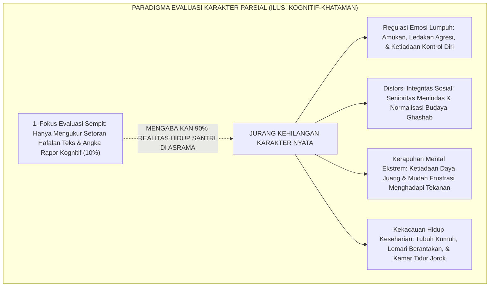
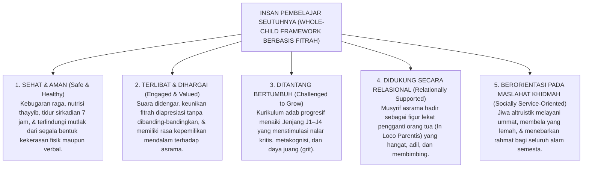
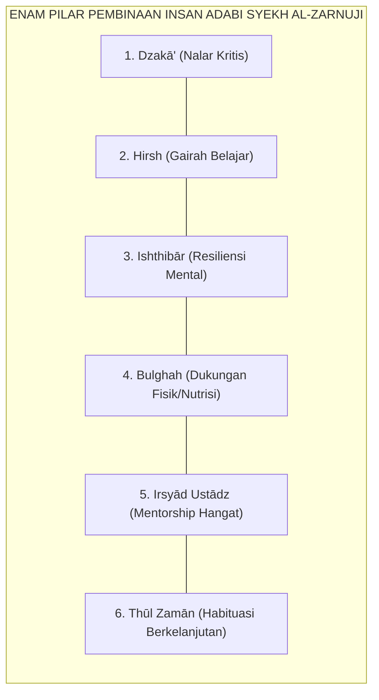

# DEKONSTRUKSI KARAKTER PARSIAL MENUJU WHOLE-CHILD

---

### 🧭 PETA POSISI PANDUAN DALAM SISTEM TUMBUH (DARI HULU KE HILIR)
* **Posisi Arsitektur**: `BATANG EKOSISTEM I (Taksonomi 10 Muwashafat Adab & Tangga Kemandirian J1–J4)`
* **Peruntukan Pengguna**: Wali Kelas, Musyrif Kamar, Guru Pengampu Adab, & Mentor Santri
* **Fokus Panduan**: Memandu tahapan penanaman 10 Karakter Adab Nabawi dari fase Adaptasi (J1), Pembiasaan (J2), Kematangan (J3), hingga Kader Penggerak (J4/Tahap 7).
* **Hasil Akhir yang Dituju**: Terwujudnya santri berkarakter *Insan Adabi* yang mandiri, musyrif yang mengasuh dengan kasih sayang tanpa *burnout*, dan pesantren yang aman berbasis data (*Safe Boarding School*).

---

### 🎯 Mengapa Panduan Ini Ada & Masalah Nyata yang Dipecahkan
1. **Latar Masalah di Lapangan**: Sering kali pengasuhan di pesantren berjalan tanpa SOP yang jelas atau terjebak dalam pola reaktif—menunggu santri berbuat salah baru dihukum dengan emosional.
2. **Solusi Sistem TUMBUH**: Panduan ini memberikan langkah preventif dan terstruktur agar setiap pembiasaan adab berjalan terencana, konsisten, dan terukur.
3. **Sasaran Perubahan**: Memastikan nilai-nilai Islam menyatu dalam perilaku harian santri melalui keteladanan nyata (*Qudwah Hasanah*).

---
### 🎯 Tujuan & Manfaat Panduan
Panduan ini dirancang sebagai petunjuk operasional terapan agar pendidik dan musyrif dapat:
1. Menjalankan pembinaan adab santri dengan pendekatan kasih sayang (*Rahmah*) dan ketegasan yang mendidik (*Firm & Kind*).
2. Menghindari cara-cara kekerasan fisik, bentakan verbal, maupun hukuman yang mempermalukan santri.
3. Menciptakan suasana asrama dan kelas yang aman, tertib, dan menumbuhkan kesadaran diri (*Bi'ah Shalihah*).

---

### 💡 Intisari Cepat (3 Menit Memahami Esensi)
* **Kunci Pengasuhan**: Karakter santri tumbuh melalui keteladanan nyata (*Qudwah Hasanah*), komunikasi empatik, dan pembiasaan terstruktur 24 jam.
* **Tindakan Utama**: Terapkan panduan langkah demi langkah di bawah ini secara konsisten, pantau perkembangan santri secara objektif, dan berikan apresiasi atas setiap perbaikan diri yang mereka capai.
* **Prinsip Disiplin**: Fokus pada pemulihan hubungan dan tanggung jawab nyata (*Restoratif*), bukan sekadar melampiaskan amarah atau menghukum.

---

---

### 💬 ILUSTRASI NYATA & ANALOGI SEDERHANA
Bayangkan sebuah skenario yang sering kita lihat sehari-hari di asrama:
* Ketika seorang santri baru melakukan kekeliruan (misalnya terlambat bangun Subuh atau kasurnya berantakan), respon pertama yang sering muncul adalah bentakan keras atau hukuman fisik (seperti push-up atau jemur di lapangan).
* **Hasilnya?** Santri tersebut mungkin tampak patuh seketika karena takut, tetapi di dalam hatinya tumbuh rasa dongkol, dendam tersembunyi, atau kebiasaan "bersandiwara"—hanya tertib ketika ada pengawas di dekatnya.

Dalam Sistem TUMBUH, kita menggunakan cara yang jauh lebih cerdas, sejuk, dan membumi:
1. **Analogi "Rem dan Pedal Gas Otak"**: Santri usia remaja (usia MTs dan Aliyah) memiliki bagian otak emosi (*Sistem Limbik*) yang sudah menyala sangat kuat seperti *pedal gas mobil sport*, namun otak pengendali logikanya (*Prefrontal Cortex*) masih dalam proses tumbuh seperti *sistem rem yang baru dipasang*. Tugas guru dan musyrif bukan memarahi mobilnya, melainkan menjadi **"Sopir Teladan & Sabuk Pengaman"** yang mendampingi santri belajar menginjak rem dengan bijak.
2. **Kekuatan Contoh Nyata (*Qudwah Hasanah*)**: Santri jauh lebih cepat meniru apa yang mereka **lihat** setiap hari daripada apa yang mereka **dengar** dari ribuan nasihat panjang. Jika musyrif datang tepat waktu, tersenyum ramah, dan kamarnya rapi, santri akan menirunya dengan sukarela.

---

### 🛠️ PANDUAN LANGKAH PRAKTIS LAPANGAN (BISA LANGSUNG DIPRAKTIKKAN HARI INI)

| Tahapan Aksi | Tindakan Nyata Musyrif / Guru di Lapangan | Hal yang Harus Diperhatikan |
| :--- | :--- | :--- |
| **1. Langkah Persiapan (Sebelum Kejadian)** | Sepakati aturan bersama santri di awal pekan dengan kalimat positif (contoh: *"Kamar rapi membuat istirahat kita berkah"*). | Buat poster visual sederhana yang mudah dibaca di dinding kamar. |
| **2. Langkah Respon (Saat Terjadi Masalah)** | Tarik napas, tenangkan diri, ajak santri berbicara empat mata tanpa mempermalukannya di depan teman-temannya. | Gunakan nada bicara yang tenang namun tegas (*Firm & Kind*). |
| **3. Langkah Perbaikan (Tanggung Jawab Nyata)** | Minta santri memperbaiki kesalahannya secara langsung (contoh: merapikan kembali barang yang berantakan atau meminta maaf). | Berikan apresiasi seketika santri telah menuntaskan perbaikannya. |

---

### 🗣️ CONTOH DIALOG LAPANGAN (YANG HARUS DIUCAPKAN VS DIHINDARI)

* ❌ **JANGAN UCAPKAN (Membuat Santri Menutup Diri & Dendam)**:
  > *"Kamu ini pemalas sekali ya, sudah dibilangi berkali-kali masih saja kasur berantakan! Push-up 50 kali sekarang!"*
* ✅ **UCAPKAN INI (Mendidik Tanggung Jawab & Kesadaran Diri)**:
  > *"Akhi, antum tahu kesepakatan kamar kita tentang kerapian tempat tidur setelah Subuh. Coba lihat kasur antum sekarang, apa yang perlu disempurnakan? Mari rapikan bersama sekarang agar kamar kita nyaman dan berkah."*

---

### 📋 3 POIN EMAS RANGKUMAN (UNTUK SANTRI SENIOR & MUSYRIF MUDA)
1. **Didik dengan Kasih Sayang, Tegakkan Batas dengan Adil**: Jangan pernah mencampuradukkan ketegasan aturan dengan pelampiasan amarah pribadi.
2. **Apresiasi 4x Lebih Banyak daripada Teguran (*Magic Ratio 4:1*)**: Jangan hanya bersuara ketika santri berbuat salah. Saat mereka berbuat baik (salat di shaf depan, menolong kawan, membaca Al-Qur'an), segera berikan pujian tulus.
3. **Fokus pada Perbaikan Hubungan (*Restoratif*)**: Masalah perilaku adalah peluang emas untuk mendidik santri menjadi pribadi yang lebih dewasa dan bertanggung jawab.

---

### 📖 Uraian Lengkap Landasan & Rujukan Sistem

---

### I. Ilusi Kesalehan Tunggal: Jebakan Reduksionisme Pendidikan Pesantren

Setiap tahun, ribuan panggung wisuda pesantren dihiasi dengan tepuk tangan meriah dan isak tangis haru. Di bawah sorotan lampu panggung, santri-santri berprestasi dipanggil satu per satu: mereka yang telah menuntaskan setoran 30 juz Al-Qur'an, yang meraih nilai 100 (*Mumtaz*) dalam ujian hafalan matan *Alfiyyah Ibnu Malik*, atau yang memenangkan perlombaan pidato tiga bahasa. Predikat "Santri Teladan" disematkan, selempang kejuaraan dikalungkan, dan orang tua menyeka air mata kebanggaan karena meyakini buah hati mereka telah bertransformasi menjadi pribadi yang shalih seutuhnya.

Namun, mari kita berani menyingkap tabir panggung tersebut dan menatap realitas keseharian yang sesungguhnya di lorong-lorong asrama.

Ketika tirai perayaan wisuda usai dan kehidupan nyata 24 jam di asrama bergulir, sistem evaluasi lembaga kerap kali mengalami kebutaan massal (*systemic institutional blindness*). Santri yang sama—yang dielu-elukan di atas panggung karena capaian hafalan kognitifnya—tidak jarang ditemukan di bilik asrama dalam kondisi karakter yang terfragmentasi parah:
1. **Kelumpuhan Regulasi Emosi**: Mengamuk hebat, menendang pintu loker, atau membentak adik kelas hanya karena antrean kamar mandinya diserobot saat fajar (*emotional dysregulation*).
2. **Distorsi Integritas Sosial & Budaya *Ghashab***: Memakai sandal, gayung, sajadah, bahkan uang saku milik teman sekamarnya tanpa izin (*ghashab*), lalu merasa tanpa dosa karena menganggapnya sebagai "kelumrahan tradisi pondok".
3. **Kerapuhan Mental & *Learned Helplessness***: Sangat mudah putus asa, mengunci diri di kamar, atau mengalami kecemasan akut saat menghadapi teguran musyrif dan kegagalan ujian, akibat ketiadaan daya lentur psikologis (*resilience deficit*).
4. **Kehampaan Empati Altruistik**: Bersikap acuh tak acuh ketika melihat kawan sekamarnya terbaring demam tinggi di ranjang bawah, enggan mengambilkan makanan ke dapur umum, dan memilih asyik bercengkerama sendiri.

<b>Gambar 1.1.1:</b> Jebakan Reduksionisme Evaluasi Karakter Parsial dalam Praktik Pendidikan Pesantren Konvensional.

Diagram di atas menyingkap ironi terdalam institusi pendidikan: lembaga mengira telah mendidik manusia seutuhnya, padahal yang terjadi hanyalah pelatihan memori mekanis jangka pendek. Ketika institusi menyempitkan definisi keberhasilan santri semata-mata pada capaian hafalan verbal (10% permukaan kognitif), maka 90% dimensi kemanusiaan santri—regulasi emosi, interaksi sosial, ketahanan mental, dan kebersihan hidup—terbiarkan tumbuh liar tanpa bimbingan sistemik.

Fenomena ini dalam psikologi moral modern dikenal sebagai fenomena *moral licensing*[^1]: ketika seseorang merasa telah melakukan perbuatan "besar" yang diakui publik (seperti menghafal sekian juz atau membaca kitab tebal), alam bawah sadarnya secara keliru memberi izin moral (*license*) untuk meremehkan pelanggaran adab-adab mendasar di sekitarnya. Santri merasa bahwa status hafalannya telah menghapus kewajiban membersihkan loker, menghormati hak milik kawan, atau bersikap santun kepada pelayan dapur pondok.

Pakar kurikulum dan etika kepedulian global **Nel Noddings**[^2] menegaskan kritik mendasar terhadap sistem persekolahan yang terobsesi pada prestasi kognitif terisolasi:
> *"Sekolah yang hanya merayakan skor ujian sempit tanpa merawat kapasitas kepedulian relasional (*caring relations*) sesungguhnya sedang memproduksi manusia-manusia yang terasing dari nurani dan kemanusiaannya sendiri. Pendidikan moral tidak bisa diajarkan sebagai materi hafalan ceramah, melainkan harus dialami dalam perjumpaan relasional yang hangat, adil, dan bermakna."*

Dalam khazanah peradaban Islam, **Prof. Dr. Syed Muhammad Naquib al-Attas**[^3] telah merumuskan kritik epistemologis yang sangat tajam terhadap penyempitan pendidikan. Beliau menegaskan bahwa tujuan utama pendidikan Islam bukanlah sekadar *Ta'lim* (pengajaran informasi dan transfer data kognitif semata), melainkan *Ta'dib*:
> *"Ta'dib adalah proses penanaman adab ke dalam totalitas jiwa, akal, dan raga manusia. Adab adalah pengenalan dan pengakuan akan hakikat bahwa segala ciptaan memiliki martabat dan tempatnya yang tepat dalam susunan wujud, sehingga melahirkan tindakan yang benar, adil, dan selaras terhadap Allah, sesama makhluk, dan alam semesta."*

Ketika pendidikan pesantren tereduksi menjadi sekadar *Ta'lim* hafalan teks tanpa *Ta'dib* yang membumi, lahirlah generasi yang cerdas melafalkan dalil namun tumpul dalam kepekaan nurani.

---

### II. Pendekatan Anak Utuh (*Whole-Child Approach*) dalam Pandangan Fitrah

Untuk membedah kebuntuan reduksionisme di atas, **Ekosistem TUMBUH** mengadopsi dan merekonstruksi pendekatan **Anak Utuh (*Whole-Child Approach*) Berbasis Fitrah**[^4].

Pendekatan ini memandang santri bukan sebagai "kertas kosong yang harus dijejali teks", bukan pula sebagai "mesin pemenang kejuaraan musabaqah", melainkan sebagai **makhluk ciptaan Allah yang utuh, mulia, dan unik (*al-Insan al-Kamil bi al-Quwwah*)**, yang memiliki spektrum kebutuhan perkembangan fitrah yang saling berkelindan dan tidak boleh dipisahkan satu sama lain:

<b>Gambar 1.1.2:</b> Lima Pilar Perkembangan Anak Utuh (Whole-Child Framework) Ekosistem TUMBUH.

Pemaparan lima pilar perkembangan anak utuh di atas menegaskan bahwa pembinaan karakter santri harus berjalan serempak dan simfoni:

1. **Pilar Sehat & Aman (*Safe & Healthy*)**: Santri tidak akan mampu menghafal Al-Qur'an secara mendalam jika tubuhnya diserang penyakit kulit menular (skabies), perutnya kelaparan karena gizi rendah, atau otaknya didera teror ketakutan akibat ancaman senior. Rasa aman fisiologis dan psikologis adalah fondasi mutlak pembentukan karakter.
2. **Pilar Terlibat & Dihargai (*Engaged & Valued*)**: Santri yang merasa dirinya hanya diposisikan sebagai "objek penderita aturan" akan mengembangkan mekanisme pertahanan diri berupa kepatuhan palsu (*passive defiance*). Sebaliknya, ketika santri dilibatkan dalam merumuskan kesepakatan adab kamar, ia memiliki rasa tanggung jawab moral dari dalam hatinya.
3. **Pilar Ditantang Bertumbuh (*Challenged to Grow*)**: Pendidikan karakter bukanlah indoktrinasi pasif, melainkan petualangan menaklukkan tantangan. Melalui progresi Jenjang Kemandirian TUMBUH (J1–J4) (T1 Adaptasi, T2 Habituasi, T3 Internalisasi, T4 Transformasi), santri ditantang melampaui batas kenyamanan egonya menuju kematangan adab.
4. **Pilar Didukung Relasional (*Relationally Supported*)**: Karakter tidak tumbuh dari mikrofon pengeras suara yang membentak-bentak santri dari menara asrama. Karakter menular lewat tatapan mata yang hangat, senyuman tulus, dan sentuhan pundak musyrif asrama yang mendengarkan keluh kesah santri saat mereka dilanda rindu rumah (*homesickness*).
5. **Pilar Berorientasi Khidmah (*Socially Service-Oriented*)**: Muara akhir dari kematangan adab santri bukanlah kepuasan individualistis kesalehan pribadi, melainkan kerelaan berkorban untuk kemaslahatan sesama (*altruisme khidmah*).

Ketika kelima pilar ini bekerja secara terintegrasi:
* Santri tidak hanya mampu menghafal dalil thaharah, tetapi bilik kamarnya harum, ranjangnya tertata rapi, dan pakaiannya suci bebas kuman.
* Santri tidak hanya memahami konsep *Ukhuwah Islamiyyah*, tetapi tangannya tergerak membasuh piring temannya yang sedang terbaring sakit.
* Santri tidak hanya menghafal hukum larangan mencuri, tetapi hatinya diliputi *Muraqabatullah* sehingga pantang menyentuh barang orang lain tanpa kerelaan pemiliknya.

---

### III. Menghidupkan Kembali Taksonomi Adab Ulama Klasik: Az-Zarnuji, Ibn Sahnun, & Al-Ghazali

Kritik terhadap pendidikan yang mengerdilkan potensi kemanusiaan murid sesungguhnya bukanlah barang baru impor dari Barat, melainkan ruh inti dari khazanah agung pedagogi Islam (*Turats at-Tarbiyyah wal Adab*).

Para ulama salaf terdahulu telah meletakkan taksonomi pendidikan yang menempatkan kesiapan mental, ketahanan fisik, dan pendampingan kasih sayang guru sebagai syarat mutlak keberhasilan ilmu.

#### 1. Syarah Wasiat Syekh Burhanuddin Al-Zarnuji (*Ta'lim al-Muta'allim*)
Dalam kitab pedoman penuntut ilmu yang melegenda, *Ta'lim al-Muta'allim Thariq at-Ta'allum*[^5], **Syekh Burhanuddin Al-Zarnuji** menukilkan syair agung Sayyidina Ali bin Abi Thalib RA mengenai enam pilar utuh pembinaan penuntut ilmu:

$$\text{أَلَا لَا تَنَالُ الْعِلْمَ إِلَّا بِسِتَّةٍ ۞ سَأُنْبِيكَ عَنْ مَجْمُوعِهَا بِبَيَانِ:}$$
$$\text{ذَكَاءٍ وَحِرْصٍ وَاصْطِبَارٍ وَبُلْغَةٍ ۞ وَإِرْشَادِ أُسْتَاذٍ وَطُولِ زَمَانِ}$$

**Terjemahan Berjiwa:**
> *"Ingatlah! Engkau tidak akan pernah mereguk hakikat ilmu kecuali dengan enam perkara yang terpadu utuh, yang akan kubentangkan kepadamu keterangannya secara benderang:*
> 1. *Kecerdasan akal yang diasah nalar kritisnya (*Dzakā'*),*
> 2. *Semangat menggelora yang pantang menyerah (*Hirsh*),*
> 3. *Kesabaran jiwa menanggung beban tempaan (*Ishthibār*),*
> 4. *Bekal kecukupan fisik dan material yang menopang (*Bulghah*),*
> 5. *Bimbingan guru beradab yang hadir mengasuh (*Irsyādu Ustādz*), dan*
> 6. *Rentang waktu pembiasaan yang panjang dan berkelanjutan (*Thūlu Zamān*)."*

<b>Gambar 1.1.3:</b> Rekonstruksi Enam Syarat Menuntut Ilmu Imam Al-Zarnuji dalam Dimensi Kapasitas Holistik.

Perhatikan bagaimana Syekh Al-Zarnuji meletakkan *Ishthibār* (ketahanan mental/resiliensi), *Bulghah* (kecukupan gizi dan fisik), serta *Irsyād Ustādz* (pendampingan relasional guru) sejajar dengan *Dzakā'* (kapasitas intelektual). Ini membuktikan bahwa sejak abad ke-13 Masehi, pendidikan Islam telah menolak reduksionisme kognitif murni!

#### 2. Risalah Perlindungan Anak Imam Muhammad bin Sahnun (*Adab al-Mu'allimin*)
Pakar hukum dan pendidik agung Afrika Utara abad ke-3 Hijriyah, **Imam Muhammad bin Sahnun at-Tanukhi** dalam kitabnya *Adab al-Mu'allimin*[^6] (risalah pedagogi tertulis pertama dalam sejarah Islam) menetapkan aturan ketat bahwa seorang pendidik diharamkan memperlakukan santri dengan diskriminatif berdasarkan status sosial atau kecepatan belajarnya:
> *"Wajib bagi guru untuk menyamakan pandangan kasih sayangnya kepada seluruh anak didik, baik anak orang kaya maupun anak orang miskin. Dilarang keras guru memukul anak dalam keadaan marah, dan dilarang memukul bagian tubuh yang mematikan atau melukai kehormatan fisiknya. Tugas guru adalah menjaga amanah fitrah anak sebagaimana ia menjaga anak kandungnya sendiri."*

#### 3. Kritik Tajam Hujjatul Islam Imam Al-Ghazali
Dalam kitab monumentalnya *Ayyuhal Walad*[^7], **Imam Al-Ghazali** mengingatkan murid kesayangannya dengan peringatan yang menggetarkan dada:

$$\text{أَيُّهَا الْوَلَدُ، الْعِلْمُ بِلَا عَمَلٍ جُنُونٌ، وَالْعَمَلُ بِغَيْرِ عِلْمٍ لَا يَكُونُ}$$

**Terjemahan Berjiwa:**
> *"Wahai anakku tercinta! Ilmu yang bertumpuk di kepala tanpa diwujudkan dalam amal perbuatan nyata adalah kegilaan (*junūn*); dan amal perbuatan tanpa didasari ilmu yang lurus tidak akan pernah tegak berdiri."*

Imam Al-Ghazali menegaskan bahwa menghafal beribu kitab tidak akan menyelamatkan santri jika hatinya masih dipenuhi dengki, lidahnya gemar menggunjing kawan, dan perilakunya menindas sesama penuntut ilmu.

---

### IV. Solusi Sistemik TUMBUH: Transformasi Kurikulum Menjadi Arsitektur Kapasitas

Menjawab kegagalan paradigma reduksionis konvensional, **Ekosistem TUMBUH** mentransformasikan kurikulum pembinaan karakter pesantren dari sekadar "jadwal hafalan kognitif linear" menjadi **Arsitektur Kapasitas Holistik Berbasis Fitrah**:

| Dimensi Transformasi | Paradigma Pesantren Konvensional (Reduksionis) | Paradigma Ekosistem TUMBUH (Whole-Child Fitrah) |
| :--- | :--- | :--- |
| **Fokus Evaluasi** | Setoran hafalan ayat/hadits & angka rapor kognitif sempit (10% permukaan). | Panca Dimensi Kapasitas: Spiritual, Sosio-Emosional, Kognitif, Fisik, & Vokasional (100% Utuh). |
| **Metode Pembinaan** | Ceramah doktrin podium, instruksi satu arah, & hafalan teks pasif. | Habituasi 24 jam terbimbing, simulasi lingkaran emosi, & rekayasa lingkungan *Bi'ah Shalihah*. |
| **Penanganan Pelanggaran** | Hukuman fisik, bentakan verbal, botak paksa, & sanksi mempermalukan (*punitive*). | Disiplin Restoratif (*Firm & Kind*), restitusi logis pemulihan hak kawan, & bimbingan bertingkat PBIS. |
| **Peran Musyrif Asrama** | "Polisi Malam" / Pengawas Disiplin yang ditakuti santri. | Figur Lekat *In Loco Parentis* & *External Prefrontal Cortex* yang membimbing dengan kasih sayang. |
| **Orientasi Hasil Akhir** | Memproduksi "Piala & Bintang Wisuda" yang rapuh secara karakter. | Melahirkan **Insan Adabi Seutuhnya**: kokoh tauhidnya, luhur adabnya, mandiri hidupnya, & bermanfaat bagi ummat. |

Dengan meletakkan fondasi *Whole-Child* ini, kita melangkah menuju **Sub-Bab 1.2** untuk membedah secara rinci dan terukur **Lima Dimensi Kapasitas Holistik Santri** yang menjadi pilar utama pembinaan karakter di bumi pesantren.

---

## 📌 Catatan Kaki & Rujukan Primer

[^1]: **Benoît Monin & Dale T. Miller**, "Moral credentials and the expression of prejudice", *Journal of Personality and Social Psychology*, Vol. 81, No. 1 (2001), hlm. 33–43; serta **Sonya Sachdeva, Rumen Iliev, & Douglas L. Medin**, "Sinning and saintliness: How the pursuit of moral consistency shapes moral choice", *Psychological Science*, Vol. 20, No. 4 (2009), hlm. 523–528.
[^2]: **Nel Noddings**, *The Challenge to Care in Schools: An Alternative Approach to Education* (New York: Teachers College Press, 1992; Edisi ke-2, 2005), Bab 2: "Caring: A Relational Approach to Ethics and Moral Education", hlm. 15–42; serta **Nel Noddings**, *Caring: A Relational Approach to Ethics and Moral Education* (Berkeley: University of California Press, 1984; Edisi ke-2, 2013), hlm. 25–68.
[^3]: **Prof. Dr. Syed Muhammad Naquib al-Attas**, *The Concept of Education in Islam: A Framework for an Islamic Philosophy of Education* (Kuala Lumpur: International Institute of Islamic Thought and Civilization / ISTAC, 1980), hlm. 15–38; serta **Prof. Dr. Syed Muhammad Naquib al-Attas**, *Prolegomena to the Metaphysics of Islam* (Kuala Lumpur: ISTAC, 1995), Bab 1: "Islam: The Concept of Religion and the Foundation of Ethics and Morality", hlm. 41–89.
[^4]: **ASCD (Association for Supervision and Curriculum Development)**, *Making the Case for Educating the Whole Child* (Alexandria: ASCD Publications, 2014); serta **James P. Comer**, *Child by Child: The Comer Process for Change in Education* (New York: Teachers College Press, 1999), hlm. 18–45.
[^5]: **Al-Imam Burhanuddin al-Zarnuji**, *Ta'lim al-Muta'allim Thariq at-Ta'allum*, Tahqiq: Syaikh Mustafa Asyur (Kairo: Dar al-I'tisham, 1986), hlm. 14–25; serta Syarah oleh **Syaikh Ibrahim bin Ismail**, *Syarh Ta'lim al-Muta'allim* (Surabaya: Maktabah Muhammad bin Ahmad Nabhan, t.th.), hlm. 21–28.
[^6]: **Al-Imam Abu Abdillah Muhammad bin Sahnun at-Tanukhi**, *Adab al-Mu'allimin*, Tahqiq: Dr. Hasan Husni Abdul Wahhab (Tunis: Dar al-Kutub asy-Syarqiyyah, 1972), hlm. 28–45.
[^7]: **Hujjatul Islam Imam Abu Hamid Muhammad bin Muhammad al-Ghazali**, *Ayyuhal Walad fi Nashihat at-Talamidz*, Tahqiq: Dr. Ahmad Ahmad Badawi (Kairo: Dar al-Qalam, 1986), hlm. 12–28.
