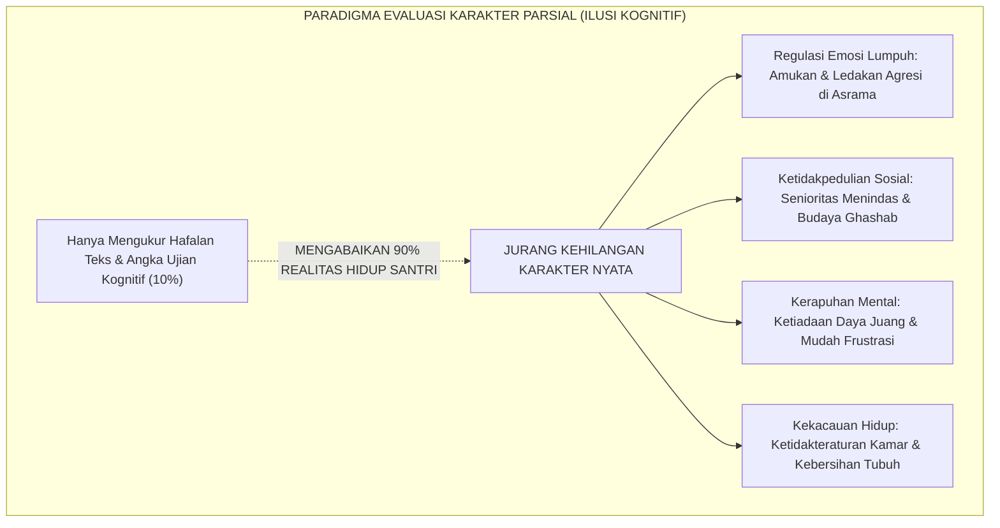
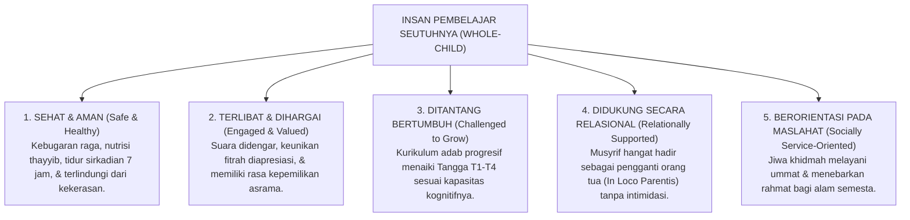

# SUB-BAB 1.1: DEKONSTRUKSI KARAKTER PARSIAL MENUJU WHOLE-CHILD
## *Melampaui Reduksionisme Kognitif-Khataman Menuju Pembinaan Utuh Seluruh Dimensi Kemanusiaan Santri*

**Kode Klasifikasi**: `BOOK-02/BAB-01/SUB-01/MONOGRAF-MASTER-VIBRANT`  
**Disiplin Ilmu**: Desain Kurikulum Holistik, Teori *Whole-Child Development*, & Epistemologi Pendidikan Islam  
**Penanggung Jawab Keilmuan**: Dewan Pakar Ekosistem TUMBUH (*Pakar Desain Kurikulum Adab & Pakar Psikologi Belajar*)

---

### Ilusi Kesalehan Tunggal: Jebakan Reduksionisme Pendidikan Pesantren

Selama beberapa dekade terakhir, dunia pesantren terjebak dalam sebuah ilusi evaluasi yang sangat berbahaya: **reduksionisme karakter parsial**.

Dalam sistem evaluasi konvensional, seorang santri kerap kali dinilai "berhasil" atau "shalih" hanya berdasarkan satu atau dua indikator kognitif yang mudah diukur secara kuantitatif:
* Seberapa banyak juz Al-Qur'an yang telah ia setorkan ke ustadz tahfizh.
* Seberapa tinggi nilai angka rapor yang ia peroleh pada ujian hafalan matan kitab kuning di madrasah.

Namun, apa yang sering luput dari pengamatan sistemik lembaga?
Santri yang sama—yang berpredikat *Mumtaz* (istimewa) di atas panggung wisuda—kerap kali ditemukan di bilik asrama dalam kondisi:
1. Tidak mampu mengendalikan amarah saat berebut antrean kamar mandi (*kelumpuhan regulasi emosi*).
2. Membiarkan loker dan kasurnya kotor berantakan serta gemar memakai barang milik adik kelas tanpa izin (*distorsi integritas sosial*).
3. Sangat rapuh dan mudah putus asa ketika menghadapi kegagalan hafalan atau teguran pembina (*kehampaan resiliensi mental*).
4. Tidak memiliki kepedulian sosial untuk menolong kawan sekamarnya yang sedang sakit (*ketiadaan empati altruistik*).

<b>Gambar 1.1.1:</b> Jebakan Reduksionisme Evaluasi Karakter Parsial dalam Praktik Pendidikan Pesantren.

Pakar kurikulum internasional **Nel Noddings**[^1] menegaskan bahwa sekolah yang hanya berfokus pada capaian akademis sempit tanpa merawat kepedulian (*caring relations*) sesungguhnya sedang memproduksi manusia yang teralienasi dari kemanusiaannya. 

Dalam konteks Islam, **Prof. Dr. Syed Muhammad Naquib al-Attas**[^2] menegaskan bahwa pendidikan Islam bukanlah sekadar *Ta'lim* (pengajaran informasi akademis), melainkan *Ta'dib*: penanaman adab yang menyentuh seluruh totalitas jiwa, raga, dan eksistensi manusia agar mampu menempatkan segala sesuatu pada tempatnya yang benar.

---

### Pendekatan Anak Utuh (*Whole-Child Approach*) dalam Pandangan Fitrah

Menjawab krisis fragmentasi di atas, **Ekosistem TUMBUH** mengadopsi pendekatan **Anak Utuh (*Whole-Child Approach*) Berbasis Fitrah**[^3].

Pendekatan ini memandang santri bukan sebagai "wadah kosong penghafal teks", bukan pula sebagai "mesin pemenang lomba", melainkan sebagai **makhluk ciptaan Allah yang utuh dan mulia**, yang memiliki spektrum kebutuhan perkembangan yang saling berkelindan:

<b>Gambar 1.1.2:</b> Lima Pilar Perkembangan Anak Utuh (Whole-Child Framework) Ekosistem TUMBUH.

Ketika kelima pilar perkembangan anak utuh ini dipenuhi secara harmonis:
* Santri tidak hanya menghafal ayat-ayat tentang kebersihan, tetapi tubuh dan bilik kamarnya memancarkan kesucian yang menyejukkan pandangan.
* Santri tidak hanya memahami dalil persaudaraan (*Ukhuwah*), tetapi tangannya secara spontan membagikan makanan kepada kawan sekamar yang membutuhkan.
* Santri tidak hanya membaca kaidah fiqih tentang hak milik, tetapi kakinya pantang mengenakan sandal orang lain tanpa izin tertulis.

---

### Menghidupkan Kembali Taksonomi Adab Imam Al-Zarnuji & Ibn Sahnun

Kritik terhadap pendidikan yang mengabaikan keutuhan kepribadian santri sesungguhnya merupakan inti dari pesan klasik ulama pedagogi Islam.

**Syekh Burhanuddin Al-Zarnuji** dalam mahakaryanya *Ta'lim al-Muta'allim Thariq at-Ta'allum*[^4] menegaskan bahwa keberhasilan seorang penuntut ilmu ditentukan oleh integrasi antara niat yang bersih, kesungguhan beramal (*al-Jidd*), keteraturan hidup, penghormatan kepada sesama, dan penjagaan diri dari sifat tamak serta kemalasan:

> [!NOTE]
> ### 📜 Wasiat Syekh Al-Zarnuji tentang Keutuhan Syarat Menuntut Ilmu:
> 
> $$\text{أَلَا لَا تَنَالُ الْعِلْمَ إِلَّا بِسِتَّةٍ ۞ سَأُنْبِيكَ عَنْ مَجْمُوعِهَا بِبَيَانِ:}$$
> $$\text{ذَكَاءٍ وَحِرْصٍ وَاصْطِبَارٍ وَبُلْغَةٍ ۞ وَإِرْشَادِ أُسْتَاذٍ وَطُولِ زَمَانِ}$$
> 
> **Artinya:**  
> *"Ingatlah! Engkau tidak akan pernah memperoleh hakikat ilmu kecuali dengan enam perkara yang utuh: kecerdasan akal, semangat pantang menyerah, kesabaran jiwa menahan beban, bekal hidup yang cukup, bimbingan ustadz yang beradab, serta rentang waktu pembiasaan yang panjang."*

Senada dengan itu, pakar pendidikan Islam terawal **Imam Muhammad bin Sahnun** dalam risalahnya *Adab al-Mu'allimin*[^5] menggarisbawahi bahwa seorang pendidik diharamkan memperlakukan murid dengan diskriminatif, dan wajib mendampingi perkembangan akhlak santri dalam kesehariannya secara adil dan penuh kasih sayang.

---

### Solusi Sistemik TUMBUH: Transformasi Kurikulum Menjadi Arsitektur Kapasitas

Sistem **TUMBUH** menolak tegas sistem ranking tunggal yang mengadu santri dalam perlombaan hafalan kognitif sempit. 

Sebagai gantinya, Sistem TUMBUH mentransformasikan kurikulum pembinaan karakter pesantren menjadi **Arsitektur Kapasitas Holistik**: sebuah peta pertumbuhan yang mendiagnosis, memetakan, dan membimbing setiap santri menumbuhkan seluruh potensi fitrah yang telah dianugerahkan Allah kepadanya.

Inilah gerbang pembuka Volume 02: meletakkan fondasi bahwa keberhasilan santri diukur dari **sejauh mana ia bertumbuh menjadi manusia yang beradab utuh (*Insan Adabi*)**, yang siap menebarkan manfaat bagi agama, bangsa, dan peradaban dunia.

---

## 📌 Catatan Kaki & Rujukan Primer

[^1]: **Nel Noddings**, *The Challenge to Care in Schools: An Alternative Approach to Education* (New York: Teachers College Press, 1992; Edisi ke-2, 2005), Bab 2: "Caring: A Relational Approach to Ethics and Moral Education", hlm. 15–42.
[^2]: **Prof. Dr. Syed Muhammad Naquib al-Attas**, *The Concept of Education in Islam: A Framework for an Islamic Philosophy of Education* (Kuala Lumpur: International Institute of Islamic Thought and Civilization / ISTAC, 1980), hlm. 15–38.
[^3]: **ASCD (Association for Supervision and Curriculum Development)**, *Making the Case for Educating the Whole Child* (Alexandria: ASCD Publications, 2014); serta **James P. Comer**, *Child by Child: The Comer Process for Change in Education* (New York: Teachers College Press, 1999).
[^4]: **Al-Imam Burhanuddin al-Zarnuji**, *Ta'lim al-Muta'allim Thariq at-Ta'allum*, Tahqiq: Syaikh Mustafa Asyur (Kairo: Dar al-I'tisham, 1986), hlm. 14–25.
[^5]: **Al-Imam Abu Abdillah Muhammad bin Sahnun at-Tanukhi**, *Adab al-Mu'allimin*, Tahqiq: Dr. Hasan Husni Abdul Wahhab (Tunis: Dar al-Kutub asy-Syarqiyyah, 1972), hlm. 28–45.
