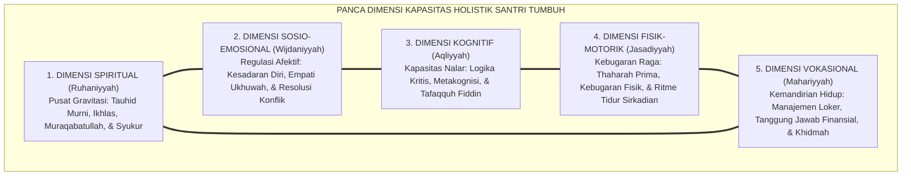
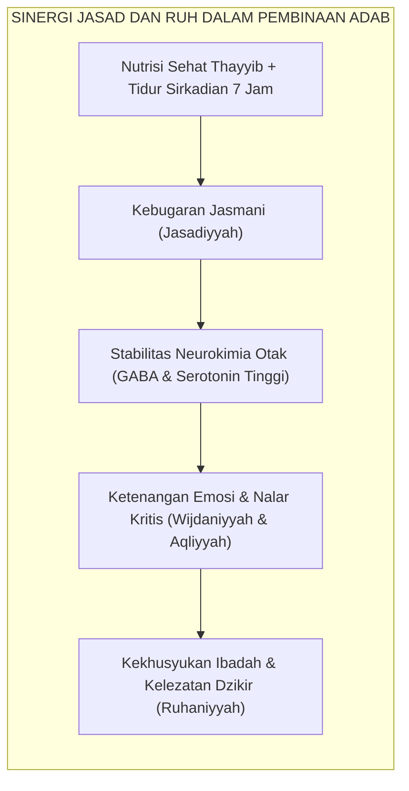

# SUB-BAB 1.2: LIMA DIMENSI KAPASITAS HOLISTIK SANTRI
## *Strukturisasi Panca Dimensi Pertumbuhan: Ruhaniyyah, Wijdaniyyah, Aqliyyah, Jasadiyyah, dan Mahariyyah*

**Kode Klasifikasi**: `BOOK-02/BAB-01/SUB-02/MONOGRAF-MASTER-VIBRANT`  
**Disiplin Ilmu**: Taksonomi Pendidikan Islam, Psikologi Perkembangan Terpadu, & Teori Inteligensi Majemuk  
**Penanggung Jawab Keilmuan**: Dewan Pakar Ekosistem TUMBUH (*Pakar Desain Kurikulum Adab & Pakar Psikometri*)

---

### Peta Utuh Potensi Kemanusiaan Santri

Untuk menerjemahkan konsep *Whole-Child* ke dalam operasional pengasuhan pesantren yang terukur, **Ekosistem TUMBUH** merumuskan **Panca Dimensi Kapasitas Holistik Santri**:

Kelima dimensi ini bukanlah bagian-bagian yang terpisah secara mekanistik, melainkan lima untaian tali yang saling memperkuat dalam membentuk kepribadian seorang *Insan Adabi*:

<b>Gambar 1.2.1:</b> Arsitektur Saling Keterhubungan Panca Dimensi Kapasitas Holistik Ekosistem TUMBUH.

Pakar psikologi pendidikan **Howard Gardner**[^1] dalam teorinya tentang *Multiple Intelligences* menegaskan bahwa potensi kecerdasan manusia bersifat jamak (*pluralistic*), bukan tunggal. 

Dalam tradisi Islam, **Hujjatul Islam Imam Abu Hamid Al-Ghazali**[^2] telah jauh hari merumuskan bahwa kesempurnaan manusia tercapai apabila terdapat keseimbangan antara daya kognitif (*Quwwah al-'Ilm*), daya pengendalian nafsu syahwat (*Quwwah asy-Syahwah*), dan daya regulasi emosi amarah (*Quwwah al-Ghadhab*) di bawah naungan cahaya keadilan rohani (*al-'Adl*).

---

### Bedah Operasional Panca Dimensi Kapasitas dalam Keseharian

Mari kita bedah masing-masing dari kelima dimensi ini dan bagaimana ia termanifestasikan dalam perilaku konkret santri:

| Dimensi Kapasitas | Landasan Epistemologis | Indikator Perilaku Faktual di Lapangan (24 Jam) | Dampak Kegagalan jika Terabaikan |
| :--- | :--- | :--- | :--- |
| **1. Ruhaniyyah (Spiritual)** | Tauhid, *Tazkiyatun Nufus*, & *Ikhlas* (QS. Al-Ikhlas: 1–4) | Shalat berjamaah di shaf pertama tanpa disuruh, melazimi wirid ba'da shalat, beramal ikhlas tanpa riya'. | Jiwa munafik transaksional: beribadah hanya ketika diawasi ustadz. |
| **2. Wijdaniyyah (Sosio-Emosional)** | *Rahmah*, *Ukhuwah*, & *Hilim* (QS. Al-Hujurat: 10) | Mengakui kesalahan tanpa defensif, meredam emosi saat disenggol kawan, menghibur teman yang bersedih. | Maraknya tawuran antarkamar, perundungan verbal, dan dendam asrama. |
| **3. Aqliyyah (Kognitif)** | *Tafakkur*, *Tafaqquh*, & *Hikmah* (QS. Az-Zumar: 9) | Mampu menganalisis masalah fiqih kontekstual, aktif bertanya di halaqah, memiliki strategi metakognisi belajar. | Santri menjadi penghafal teks dogmatis yang kaku dan mudah terprovokasi hoaks. |
| **4. Jasadiyyah (Fisik-Motorik)** | *Thaharah*, *Quwwah*, & *Afiyat* (HR. Muslim no. 223) | Mandi teratur dan pakaian suci, menjaga postur duduk tegap saat muthala'ah, tidur tepat waktu 7 jam. | Santri rentan terkena penyakit kulit (skabies), lesu, dan tertidur di kelas. |
| **5. Mahariyyah (Vokasional-Mandiri)** | *Khabirah*, *Kifayah*, & *Khidmah* (QS. Al-Qashash: 26) | Melipat baju rapi di lemari pribadi, mengelola uang saku mingguan secara hemat, mampu memimpin piket kebersihan. | Santri manja yang tidak mampu hidup mandiri setelah lulus dari pondok. |

---

### Integrasi Psiko-Fisiologis: Hubungan Erat Tubuh (*Jasad*) dan Jiwa (*Ruh*)

Banyak institusi memisahkan antara pembinaan spiritual dan kesehatan jasmani. Dianggap bahwa mengaji kitab kuning tidak ada hubungannya dengan kualitas tidur malam atau menu makanan di kantin.

Sains modern dan kedokteran Islam menolak keras dikotomi keliru ini. Filsuf dan dokter agung peradaban Islam **Ibnu Sina (Avicenna)** dalam *Al-Qanun fi at-Tibb*[^3] menegaskan bahwa kondisi kesehatan fisik dan keseimbangan cairan tubuh (*al-akhlat*) berdampak langsung terhadap ketenangan jiwa dan ketajaman daya ingat otak:

<b>Gambar 1.2.2:</b> Alur Sinergi Psiko-Fisiologis antara Kesehatan Jasmani dan Kekhusyukan Ruhani.

Pakar psikologi afektif **David R. Krathwohl & Benjamin S. Bloom**[^4] dalam taksonomi domain afektif membuktikan bahwa penanaman nilai moral tidak akan pernah berhasil jika peserta didik berada dalam kondisi kelelahan fisik, rasa lapar biologis, atau ancaman rasa takut kronis.

Ketika tubuh santri sakit atau kurang tidur, hormon stres kortisol membanjiri otaknya, mematikan fungsi empati di lobus frontal, dan membuat santri mudah tersulut amarah di bilik asrama.

---

### Solusi Sistemik TUMBUH: Pemetaan Kapasitas Multi-Dimensi Melalui Logbook PBIS

Sistem **TUMBUH** memastikan kelima dimensi kapasitas ini dipantau secara seimbang melalui **Instrumen Rubrik Perkembangan Multi-Dimensi**:

1. Musyrif asrama tidak hanya mencatat absensi shalat (Dimensi Spiritual), melainkan juga mencatat skor keteraturan loker (Dimensi Vokasional) dan kemampuan menyelesaikan konflik kamar (Dimensi Sosio-Emosional).
2. Wali kelas madrasah tidak hanya menilai skor ujian nahwu-sharaf (Dimensi Kognitif), melainkan juga mengobservasi kebugaran dan kebersihan seragam santri (Dimensi Fisik-Motorik).

Dengan pendekatan panca dimensi ini, setiap santri dihargai keunikan fitrahnya. Santri yang belum unggul dalam hafalan Qur'an mungkin memiliki kepemimpinan sosial yang luar biasa dalam mendamaikan perselisihan kawan; santri yang pendiam mungkin memiliki ketertiban hidup dan kesucian hati yang menjadi teladan bagi seluruh kamar.

Inilah perwujudan keadilan pendidikan sejati di bumi pesantren: **memuliakan setiap anak titipan umat sesuai rancangan fitrah terbaik yang diciptakan Allah padanya**.

---

## 📌 Catatan Kaki & Rujukan Primer

[^1]: **Howard Gardner**, *Frames of Mind: The Theory of Multiple Intelligences* (New York: Basic Books, 1983; Edisi Peringatan 30 Tahun, 2011), Bab 10: "Personal Intelligences", hlm. 240–280.
[^2]: **Hujjatul Islam Imam Abu Hamid al-Ghazali**, *Ihya' 'Ulumiddin*, Kitab Riyadhatin Nafs wa Tahdzibil Akhlaq (Kairo & Beirut: Dar al-Ma'rifah, t.th.), Jilid III, hlm. 53–58.
[^3]: **Al-Syaikh ar-Ra'is Ibnu Sina (Avicenna)**, *Al-Qanun fi at-Tibb*, Tahqiq: Idwar al-Qasy (Beirut: Dar al-Kutub al-'Ilmiyyah, 1999), Jilid I, Buku 1: "Fi Kulliyyat 'Ilmit Thibb", hlm. 25–48.
[^4]: **David R. Krathwohl, Benjamin S. Bloom, & Bertram B. Masia**, *Taxonomy of Educational Objectives: The Classification of Educational Goals. Handbook II: Affective Domain* (New York: David McKay Company, 1964), hlm. 45–85.
