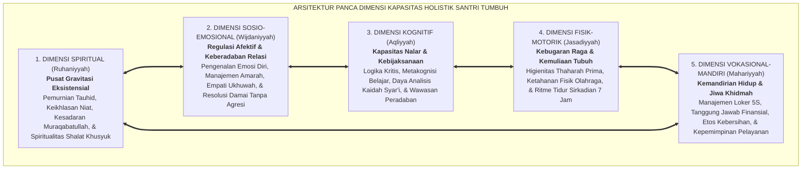
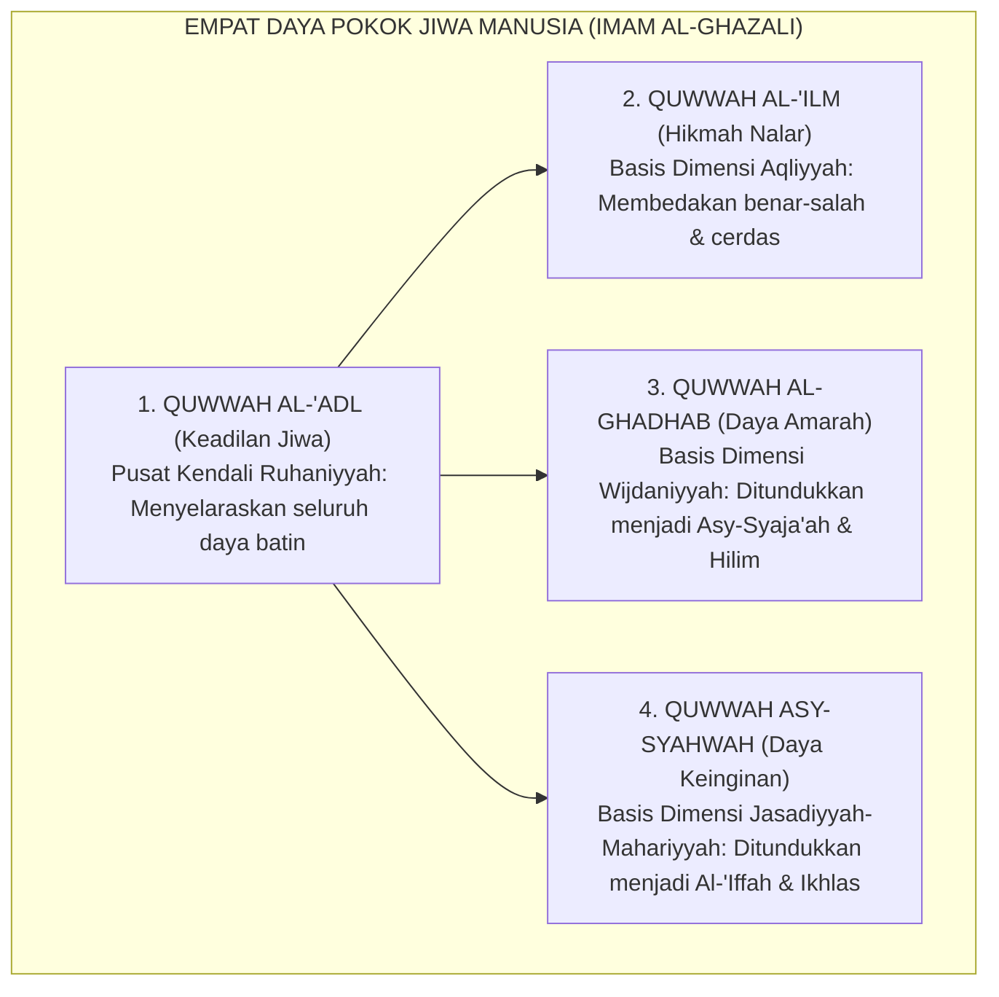
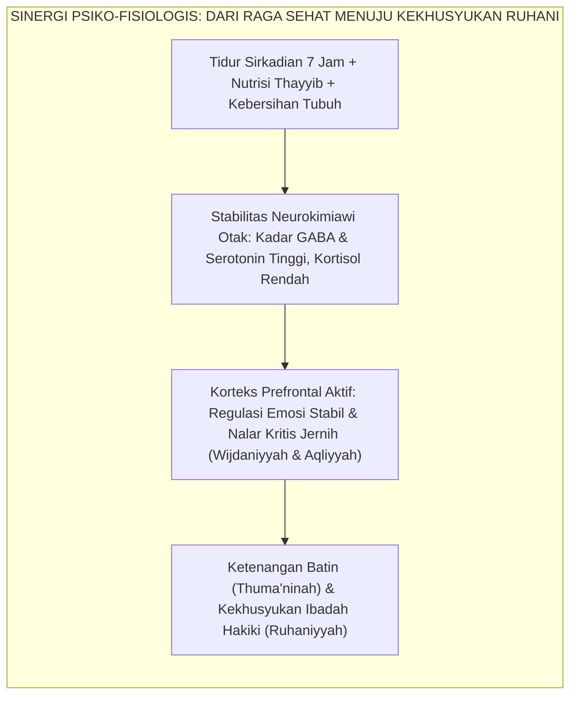
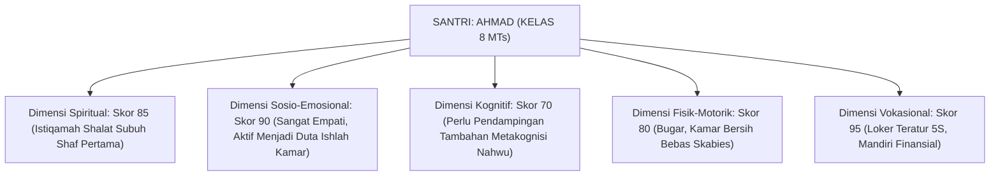

# PANDUAN PRAKTIS 1.2: LIMA DIMENSI KAPASITAS HOLISTIK SANTRI

**Sasaran Pengguna**: Pimpinan Pondok, Kepala Pengasuhan, Wali Kelas, & Musyrif Asrama  
**Fokus Penerapan**: Panduan Kerja Lapangan & Pembiasaan Karakter Harian Sistem TUMBUH  

---

### 🎯 Tujuan & Manfaat Panduan
Panduan ini dirancang sebagai petunjuk operasional terapan agar pendidik dan musyrif dapat:
1. Menjalankan pembinaan adab santri dengan pendekatan kasih sayang (*Rahmah*) dan ketegasan yang mendidik (*Firm & Kind*).
2. Menghindari cara-cara kekerasan fisik, bentakan verbal, maupun hukuman yang mempermalukan santri.
3. Menciptakan suasana asrama dan kelas yang aman, tertib, dan menumbuhkan kesadaran diri (*Bi'ah Shalihah*).

---

### 💡 Intisari Cepat (3 Menit Memahami Esensi)
* **Kunci Pengasuhan**: Karakter santri tumbuh melalui keteladanan nyata (*Qudwah Hasanah*), komunikasi empatik, dan pembiasaan terstruktur 24 jam.
* **Tindakan Utama**: Terapkan panduan langkah demi langkah di bawah ini secara konsisten, pantau perkembangan santri secara objektif, dan berikan apresiasi atas setiap perbaikan diri yang mereka capai.
* **Prinsip Disiplin**: Fokus pada pemulihan hubungan dan tanggung jawab nyata (*Restoratif*), bukan sekadar melampiaskan amarah atau menghukum.

---

### 📖 Uraian Panduan & Langkah Aksi Lapangan

---

### I. Peta Utuh Anatomi Insan Adabi: Menolak Silo Perkembangan

Dalam merancang kurikulum pembinaan karakter pesantren, kesalahan paling fatal yang kerap dilakukan institusi pendidikan adalah **memperlakukan santri secara parsial (terkotak-kotak dalam silo)**.

Pendidikan spiritual diserahkan sepenuhnya ke bilik halaqah tahfizh ba'da subuh; pendidikan kognitif dikurung di ruang madrasah dari pagi hingga siang; sementara kehidupan fisik, emosional, dan kemandirian hidup santri di asrama terbiarkan berjalan secara anarkis tanpa sentuhan pedagogis. Akibatnya, lahir kepribadian santri yang timpang: memiliki hafalan Al-Qur'an yang melimpah, namun fisiknya ringkih diserang penyakit menular, emosinya meledak-ledak saat disenggol kawan, dan kamarnya menyerupai kapal karam karena pakaian kotor bertumpuk berhari-hari.

Untuk mengakhiri kekacauan fragmentasi tersebut, **Ekosistem TUMBUH** merumuskan **Panca Dimensi Kapasitas Holistik Santri (*The Five Holistic Capacities Framework*)**:

<b>Gambar 1.2.1:</b> Arsitektur Saling Keterhubungan Panca Dimensi Kapasitas Holistik Ekosistem TUMBUH.

Diagram di atas menegaskan bahwa kelima dimensi kapasitas holistik ini bukanlah bagian-bagian yang terpisah secara mekanistik, melainkan lima helai benang sutra yang saling menganyam membentuk kain kepribadian seorang *Insan Adabi*:
* **Dimensi Spiritual (*Ruhaniyyah*)** berperan sebagai kompas moral tertinggi yang mengarahkan seluruh niat dan orientasi eksistensial santri semata-mata mengharap ridha Allah.
* **Dimensi Sosio-Emosional (*Wijdaniyyah*)** menjadi bantalan peredam ego dan jembatan ukhuwah yang memungkinkan santri hidup berdampingan secara damai dalam kultur komunal asrama yang padat.
* **Dimensi Kognitif (*Aqliyyah*)** memberikan ketajaman nalar untuk membedakan antara yang haq dan yang batil, menimbang maslahat dan mafsadat dalam setiap keputusan hidup.
* **Dimensi Fisik-Motorik (*Jasadiyyah*)** menyediakan wadah biologis yang bugar, bersih, dan energetik untuk menopang ibadah panjang dan pembelajaran tanpa kelelahan kronis.
* **Dimensi Vokasional-Mandiri (*Mahariyyah*)** melatih keterampilan hidup praktis agar santri tidak menjadi beban bagi sesama, melainkan mampu mengurus diri sendiri dan berkhidmah melayani ummat.

---

### II. Dialog Epistemologi: Gardner & Bloom Bertemu Hujjatul Islam Al-Ghazali

Konstruksi panca dimensi ini berdiri kokoh di atas sintesis harmonis antara konsensus psikologi perkembangan modern dan kedalaman mutiara *Turats Nafsani*.

#### 1. Landasan Sains Kontemporer: Multiple Intelligences & Domain Afektif
Pakar psikologi kognitif dari Harvard University, **Prof. Howard Gardner**[^1] dalam teorinya tentang *Multiple Intelligences* (Kecerdasan Majemuk) mematahkan mitos lama bahwa manusia hanya dinilai dari kecerdasan logis-linguistik sempit (skor IQ). Gardner membuktikan bahwa manusia dianugerahi spektrum kecerdasan yang luas, termasuk kecerdasan intrapersonal (pemahaman diri batiniah), interpersonal (keterampilan sosial dan empati), kinestetik-badani, dan eksistensial-spiritual.

Senada dengan itu, **David R. Krathwohl & Benjamin S. Bloom**[^2] dalam taksonomi domain afektif membuktikan bahwa penanaman karakter tidak akan pernah berhasil jika pengajaran berhenti pada tingkat kognitif (*knowing*). Nilai karakter harus melalui proses penyerapan afektif: mulai dari penerimaan sadar (*receiving*), respons emosional aktif (*responding*), penghargaan nilai (*valuing*), pengorganisasian prinsip hidup (*organization*), hingga menjadi karakter watak yang mendarah daging (*characterization by a value complex*).

#### 2. Hakikat Empat Daya Jiwa Menurut Hujjatul Islam Imam Al-Ghazali
Jauh sebelum sains Barat merumuskan taksonomi pendidikan, **Hujjatul Islam Imam Abu Hamid Al-Ghazali** dalam *Ihya' 'Ulumiddin* (Kitab *Riyadhatin Nafs wa Tahdzibil Akhlaq*)[^3] telah membongkar anatomi jiwa manusia ke dalam empat daya pokok (*al-Quwa al-Arba'*):

$$\text{فَأُمَّهَاتُ الْأَخْلَاقِ وَأُصُولُهَا أَرْبَعَةٌ: الْحِكْمَةُ، وَالشَّجَاعَةُ، وَالْعِفَّةُ، وَالْعَدْلُ.}$$
$$\text{وَالْعَدْلُ عِبَارَةٌ عَنْ حَالَةٍ لِلنَّفْسِ وَقُوَّةٍ بِهَا تَسُوسُ الْغَضَبَ وَالشَّهْوَةَ وَتَحْمِلُهُمَا عَلَى مُقْتَضَى الْحِكْمَةِ}$$

**Terjemahan Berjiwa:**
> *"Induk kemuliaan akhlak dan pokok fondasinya berpijak pada empat pilar utama: Al-Hikmah (Kebijaksanaan Nalar Aqliyyah), Asy-Syaja'ah (Keberanian & Regulasi Emosi Wijdaniyyah), Al-'Iffah (Kesucian Diri & Pengendalian Syahwat Jasadiyyah), dan Al-'Adl (Keadilan Ruhaniyyah).*
> 
> *Adapun Al-'Adl adalah kondisi batin dan kekuatan rohani yang melaluinya jiwa mampu mengendalikan daya amarah (*Quwwah al-Ghadhab*) dan daya syahwat (*Quwwah asy-Syahwah*), serta menundukkan keduanya di bawah bimbingan kebijaksanaan nalar (*al-Hikmah*) demi menggapai ridha Ilahi."*

<b>Gambar 1.2.2:</b> Struktur Empat Daya Jiwa Imam Al-Ghazali sebagai Fondasi Panca Dimensi Kapasitas TUMBUH.

Analisis Imam Al-Ghazali di atas memberikan legitimasi teologis yang sangat kokoh: kesalehan bukanlah pengebirian daya-daya manusia, melainkan penyelarasan dan pembinaan adil terhadap seluruh potensi fitrah yang telah dianugerahkan Allah SWT.

---

### III. Bedah Operasional Panca Dimensi Kapasitas dalam Ritme 24 Jam

Untuk memastikan panca dimensi ini tidak berhenti sebagai wacana teoritis di atas kertas, Ekosistem TUMBUH menerjemahkannya ke dalam **Matriks Indikator Perilaku Faktual 24 Jam**:

| Dimensi Kapasitas | Fondasi Syar'i & Teoretis | Indikator Perilaku Faktual di Lapangan (24 Jam) | Gejala Distorsi Jika Dimensi Diabaikan | Protokol Pendampingan Sistemik TUMBUH |
| :--- | :--- | :--- | :--- | :--- |
| **1. Ruhaniyyah (Spiritual)** | Tauhid Murni, *Ikhlas*, & *Muraqabatullah* (QS. Al-Bayyinah: 5) | • Menjaga shalat fardhu berjamaah di shaf awal tanpa perlu digiring rotan. • Melazimi dzikir matsurat pagi-petang. • Ibadah ikhlas saat ada maupun tiada ustadz. | **Jiwa Munafik Transaksional**: Beribadah giat hanya ketika disorot kamera / diawasi pembina pondok. | Halaqah tadabbur asmaul husna, pembiasaan qiyamul lail sukarela, dan eliminasi sistem reward bernilai uang. |
| **2. Wijdaniyyah (Sosio-Emosional)** | *Hilim*, *Rahmah*, & *Ishlah al-Bain* (QS. Al-Hujurat: 10) | • Mengakui kesalahan secara jantan tanpa defensif. • Mampu meredam amarah saat diejek kawan. • Segera meminta maaf dan memaafkan sebelum tidur. | **Tawuran & Perundungan**: Dendam membara antarkamar, pengucilan sosial santri yunior, agresi verbal. | Protokol *Emotion Circle* 10-menit, mediasi restoratif antarteman, dan latihan pernapasan de-eskalasi amigdala. |
| **3. Aqliyyah (Kognitif)** | *Tafakkur*, *Hikmah*, & *Nalar Kritis* (QS. Ali 'Imran: 190–191) | • Menganalisis korelasi dalil dengan konteks zaman. • Berani mengajukan pertanyaan kritis di kelas. • Memiliki strategi metakognisi dalam menghafal. | **Dogmatisme Kaku**: Santri menjadi penghafal teks pasif yang mudah terprovokasi hoaks dan ekstrimisme. | Pengajaran berbasis studi kasus fiqih kontekstual, forum munazharah adabi, dan teknik peta konsep (*mind-map*). |
| **4. Jasadiyyah (Fisik-Motorik)** | *Thaharah*, *Quwwah*, & *Afiyat* (HR. Muslim no. 223) | • Mandi teratur 2 kali sehari, pakaian bebas najis. • Menjaga kebersihan rambut dan kulit (Zero Scabies). • Tidur sirkadian cukup 7 jam setiap malam. | **Wabah Penyakit & Keletihan**: Santri terserang skabies massal, mata sayu, dan tertidur pulas saat ustadz mengajar. | Inspeksi sanitasi kamar berkala, penataan menu gizi seimbang (*thayyib*), dan pemadaman lampu tepat 22.00 WIB. |
| **5. Mahariyyah (Vokasional-Mandiri)** | *Khabirah*, *Kifayah*, & *Khidmah* (QS. Al-Qashash: 26) | • Melipat dan menata baju rapi di loker pribadi (5S). • Mencatat dan mengelola uang saku mingguan secara hemat. • Memimpin regu piket kebersihan asrama. | **Ketergantungan Manja**: Tidak bisa mencuci pakaian sendiri, boros menghabiskan sangu hari pertama, kamar kumuh. | Pelatihan kemandirian asrama (*Life Skills Workshop*), logbook keuangan mandiri, dan jadwal giliran khidmah dapur umum. |

---

### IV. Integrasi Psiko-Fisiologis: Sinergi Raga (*Jasad*) dan Jiwa (*Ruh*)

Banyak pondok pesantren masa lampau memisahkan secara keliru antara kesehatan biologis tubuh dan capaian spiritual jiwa. Muncul anggapan keliru bahwa "santri sejati harus tahan menderita, tidak apa-apa terkena koreng atau gudikan (skabies), tidak apa-apa tidur hanya 3 jam semalam di lantai semen dingin, karena itu tanda kesungguhan *tirakat*".

Pandangan ini dibongkar tuntas oleh kedokteran Islam dan konsensus neurobiologi modern. Tokoh kedokteran terbesar dunia Islam, **Al-Syaikh ar-Ra'is Ibnu Sina (Avicenna)** dalam mahakaryanya *Al-Qanun fi at-Tibb*[^4] menegaskan hubungan psikosomatis timbal balik antara raga dan jiwa:
> *"Ketahuilah bahwa tubuh mempengaruhi jiwa, sebagaimana jiwa mempengaruhi tubuh. Ketidakseimbangan unsur fisik tubuh, kurangnya tidur alami, dan buruknya udara kamar akan menggelapkan daya nalar akal, membakar emosi amarah, serta melemahkan daya ingat otak secara drastis."*

<b>Gambar 1.2.3:</b> Alur Sinergi Psiko-Fisiologis antara Kesehatan Jasmani dan Kekhusyukan Ruhani.

Penelitian neurobiologi tidur oleh **Matthew Walker**[^5] dalam *Why We Sleep* membuktikan bahwa santri yang kurang tidur (kurang dari 6–7 jam) mengalami penurunan kapasitas memori jangka panjang hingga 40% dan peningkatan reaktivitas amigdala emosi hingga 60%. 

Santri yang dibangunkan paksa pada jam 02.00 dini hari setelah baru tidur jam 23.30 malam sesungguhnya berada dalam kondisi keracunan kortisol biologis (*toxic sleep deprivation*). Ketika otak kekurangan tidur, bagian *Prefrontal Cortex* (pusat kendali adab dan kesabaran) mati suri (*hypofrontality*). Akibatnya, santri tersebut menjadi sangat mudah marah di antrean kamar mandi, malas menghafal di kelas, dan melampiaskan stresnya dengan mem-bully adik kelas.

Dengan demikian, menjaga kebersihan asrama, menyediakan menu bergizi, dan menjamin hak tidur 7 jam santri **bukanlah bentuk pemanjaan duniawi, melainkan prasyarat biologis mutlak agar nurani santri mampu beradab secara mulia!**

---

### V. Solusi Sistemik TUMBUH: Pemetaan Kapasitas Multi-Dimensi Melalui Logbook PBIS

Untuk mengoperasionalkan panca dimensi kapasitas ini, Sistem **TUMBUH** menghapuskan tradisi pemeringkatan tunggal (*single-rank leaderboard*) yang memicu kecemburuan sosial, dan menggantikannya dengan **Dashboard Profil Radar Kapasitas Multi-Dimensi**:

<b>Gambar 1.2.4:</b> Contoh Profil Radar Pertumbuhan Kapasitas Multi-Dimensi Santri dalam sistem TUMBUH.

Melalui pemetaan radar di atas:
1. **Tidak Ada Santri yang Dianggap "Gagal"**: Santri seperti Ahmad yang mungkin nilai ujian nahwunya masih rata-rata (skor 70), tidak akan dicap bodoh atau dihina, karena sistem mengakui keunggulan luar biasanya dalam empati sosial (skor 90) dan kemandirian hidup (skor 95).
2. **Intervensi Menjadi Sangat Presisi**: Musyrif asrama dan guru madrasah mengetahui secara tepat pada dimensi mana santri membutuhkan *scaffolding* (bantuan bertahap), tanpa harus merusak harga diri dan rasa percaya diri anak.

Inilah perwujudan keadilan kurikulum sejati: menghormati fitrah kemanusiaan santri seutuhnya sebagaimana Allah menciptakannya. Kita melangkah ke **Sub-Bab 1.3** untuk mengintegrasikan taksonomi adab ulama dengan kerangka ilmiah global *Social Emotional Learning* (CASEL).

---

## 📌 Catatan Kaki & Rujukan Primer

[^1]: **Howard Gardner**, *Frames of Mind: The Theory of Multiple Intelligences* (New York: Basic Books, 1983; Edisi Peringatan 30 Tahun, 2011), Bab 10: "Personal Intelligences", hlm. 240–280; serta **Howard Gardner**, *Intelligence Reframed: Multiple Intelligences for the 21st Century* (New York: Basic Books, 1999), hlm. 33–68.
[^2]: **David R. Krathwohl, Benjamin S. Bloom, & Bertram B. Masia**, *Taxonomy of Educational Objectives: The Classification of Educational Goals. Handbook II: Affective Domain* (New York: David McKay Company, 1964), hlm. 45–85.
[^3]: **Hujjatul Islam Imam Abu Hamid Muhammad bin Muhammad al-Ghazali**, *Ihya' 'Ulumiddin*, Kitab Riyadhatin Nafs wa Tahdzibil Akhlaq wa Mu'alajat Amradhil Qalb (Kairo & Beirut: Dar al-Ma'rifah, t.th.), Jilid III, hlm. 53–58.
[^4]: **Al-Syaikh ar-Ra'is Ibnu Sina (Avicenna)**, *Al-Qanun fi at-Tibb*, Tahqiq: Idwar al-Qasy (Beirut: Dar al-Kutub al-'Ilmiyyah, 1999), Jilid I, Buku 1: "Fi Kulliyyat 'Ilmit Thibb", hlm. 25–48.
[^5]: **Matthew Walker**, *Why We Sleep: Unlocking the Power of Sleep and Dreams* (New York: Scribner, 2017), Bab 7: "Too Extreme for the Guinness Book of World Records: Sleep Deprivation and the Brain", hlm. 133–163.
