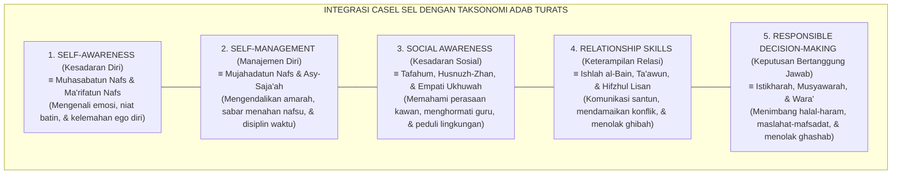
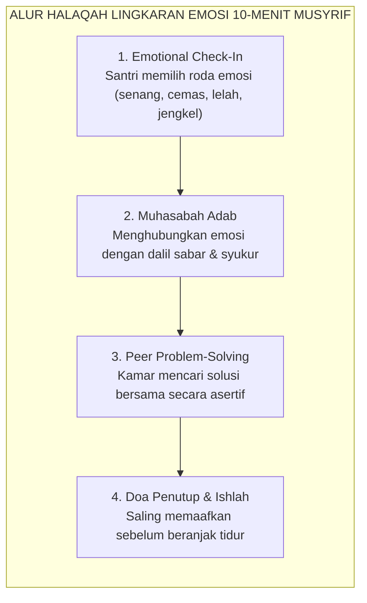

# SUB-BAB 1.3: INTEGRASI TAKSONOMI ADAB TURATS DENGAN CASEL SEL
## *Harmonisasi 5 Kompetensi Sosio-Emosional Kontemporer dengan Matriks Kesantunan Salafus Shalih*

**Kode Klasifikasi**: `BOOK-02/BAB-01/SUB-03/MONOGRAF-MASTER-VIBRANT`  
**Disiplin Ilmu**: *Social Emotional Learning* (SEL), Epistemologi Adab Turats, & Psikologi Karakter Terapan  
**Penanggung Jawab Keilmuan**: Dewan Pakar Ekosistem TUMBUH (*Pakar Social Emotional Learning & Pakar Epistemologi Turats*)

---

### Titik Temu Mutiara Turats dan Konsensus Neurosains Afektif

Salah satu terobosan terbesar dalam **Ekosistem TUMBUH** adalah menyatukan dua khazanah besar peradaban manusia yang selama ini dipisahkan oleh prasangka historis:
1. **Khazanah Adab Turats Islam**: Mutiara panduan perilaku mulia yang diwariskan oleh para ulama salaf seperti Imam Al-Qabisi, Al-Ghazali, Ibn Sahnun, dan Az-Zarnuji.
2. **Konsensus CASEL SEL (*Collaborative for Academic, Social, and Emotional Learning*)**[^1] yaitu kerangka ilmiah global berbasis bukti yang merumuskan 5 Kompetensi Inti Pembelajaran Sosio-Emosional.

TUMBUH membuktikan bahwa 5 kompetensi CASEL SEL bukanlah konsep asing yang bertentangan dengan syariat, melainkan **terjemahan metodologis modern dari nilai-nilai adab nabawiyyah** yang telah diajarkan oleh Rasulullah SAW empat belas abad silam:

<b>Gambar 1.3.1:</b> Peta Integrasi Lima Kompetensi CASEL SEL dengan Taksonomi Adab Turats Ekosistem TUMBUH.

Meta-analisis berskala masif yang dilakukan oleh **Joseph A. Durlak et al.**[^2] terhadap 213 studi dan lebih dari 270.000 siswa membuktikan bahwa program sekolah yang mengintegrasikan pembelajaran sosio-emosional secara terstruktur mampu meningkatkan capaian akademis hingga 11 persentil, menurunkan tingkat stres emosional secara signifikan, serta menekan perilaku agresif dan perundungan hingga 40%.

---

### Matriks Komparasi: Menghubungkan Teks Kitab Kuning dengan Kompetensi CASEL

Tabel berikut menyajikan pemetaan komparatif antara dalil Turats ulama dengan indikator operasional CASEL SEL di pesantren TUMBUH:

| Kompetensi CASEL SEL | Rujukan Turats Klasik | Konseptualisasi Syar'i | Praktik Nyata di Asrama & Madrasah TUMBUH |
| :--- | :--- | :--- | :--- |
| **1. Self-Awareness** | **Imam Al-Ghazali**, *Mizan al-'Amal*[^3] | *Ma'rifatun Nafs*: Memahami dorongan nafsu, batas kekuatan diri, dan kelemahan emosi. | Santri mampu mengidentifikasi pemicu amarahnya (*trigger*) dan segera mengambil wudhu saat merasa jengkel. |
| **2. Self-Management** | **Syekh Az-Zarnuji**, *Ta'lim al-Muta'allim* | *As-Shabr wa Mujahadah*: Ketahanan mental menahan kantuk dan disiplin bangun subuh. | Santri mampu menolak ajakan kawan untuk begadang dan tertib memadamkan lampu kamar pukul 22.00 WIB. |
| **3. Social Awareness** | **Imam Al-Qabisi**, *Ar-Risalah al-Mufashshilah*[^4] | *Husnul Mu'asyarah*: Memahami latar belakang kawan yang berbeda daerah dan bersikap toleran. | Santri peka ketika kawan sekamarnya tampak murung karena rindu orang tua (*homesick*) lalu mengajaknya bicara hangat. |
| **4. Relationship Skills** | **KH. M. Hasyim Asy'ari**, *Adab al-'Alim* | *Ishlah & Husnul Khuluq*: Berbicara lemah lembut, mendengarkan aktif, dan menjauhi caci maki. | Menggunakan bahasa krama/santun kepada pengurus, melarang panggilan julukan binatang, dan aktif mediasi damai. |
| **5. Responsible Decision-Making** | **Imam Asy-Syathibi**, *Al-Muwafaqat* | *I'tibarul Ma'alat*: Menimbang dampak jangka panjang suatu perbuatan bagi akhirat dan sesama. | Santri menolak meminjam barang kawan tanpa izin (*ghashab*) karena memahami dosanya dan dampaknya bagi ukhuwah. |

---

### Mengapa Integrasi Ini Sangat Krusial bagi Pesantren Modern?

Selama ini, terdapat dua kelemahan ekstrem dalam pembinaan adab santri di lapangan:
1. **Kelemahan Pendekatan Tradisionalis Dogmatis**: Mengajarkan kitab adab hanya sebagai materi hafalan teks pasif. Santri disuruh hafal nadham atau matan kitab, namun ustadz tidak pernah melatihkan simulasi konkret cara menenangkan diri saat tersinggung (*Emotional Self-Regulation Protocol*).
2. **Kelemahan Pendekatan Sekuler**: Mengajarkan SEL semata-mata demi keterampilan sosial duniawi dan efisiensi korporasi, membuang dimensi tauhid, pahala, dan kesadaran *Muraqabatullah*.

Ekosistem TUMBUH mempertemukan keduanya dalam satu sinergi sempurna:
* **Ruh dan Fondasinya** bersumber dari **Turats Nabawi**: berniat ikhlas mencari ridha Allah, mengharap pahala akhirat, dan meneladani Baginda Rasulullah SAW.
* **Metode dan Rubrik Pengukurannya** mengadopsi **Teknologi CASEL SEL**: sistematis, berjenjang, dapat diobservasi, dan divalidasi dengan data faktual harian.

---

### Solusi Sistemik TUMBUH: Halaqah Lingkaran Emosi (*Emotion Circle*) Harian

Di dalam ritme keseharian asrama TUMBUH, integrasi CASEL SEL ini diwujudkan melalui agenda rutin **Halaqah Lingkaran Emosi (10 Menit Ba'da Maghrib/Isya)**:

<b>Gambar 1.3.2:</b> Alur Operasional Halaqah Lingkaran Emosi 10-Menit di Kamar Asrama.

Melalui halaqah 10 menit ini, santri dilatih setiap hari untuk mengenali perasaannya, mengekspresikan keluhannya secara santun, dan menyelesaikan konflik tanpa kekerasan fisik. Inilah laboratorium adab nyata di mana teori kitab kuning diubah menjadi keterampilan hidup yang hidup di dalam jiwa santri.

---

## 📌 Catatan Kaki & Rujukan Primer

[^1]: **CASEL (Collaborative for Academic, Social, and Emotional Learning)**, *Core SEL Competencies: The CASEL 5* (Chicago: CASEL, 2020); serta **Roger P. Weissberg et al.**, "Social and emotional learning: Past, present, and the future", dalam J. A. Durlak et al. (Eds.), *Handbook of Social and Emotional Learning: Research and Practice* (New York: Guilford Press, 2015), hlm. 3–19.
[^2]: **Joseph A. Durlak, Roger P. Weissberg, Allison B. Dymnicki, Rebecca D. Taylor, & Kriston B. Schellinger**, "The impact of enhancing students' social and emotional learning: A meta-analysis of school-based universal interventions", *Child Development*, Vol. 82, No. 1 (2011), hlm. 405–432.
[^3]: **Hujjatul Islam Imam Abu Hamid al-Ghazali**, *Mizan al-'Amal*, Tahqiq: Dr. Sulaiman Dunya (Kairo: Dar al-Ma'arif, 1964), Bab 5: "Tahdzib an-Nafs wa Ta'dil al-Akhlaq", hlm. 68–95.
[^4]: **Al-Imam Abu al-Hasan Ali bin Muhammad al-Qabisi**, *Ar-Risalah al-Mufashshilah li Ahwal al-Mu'allimin wa Ahkam al-Mu'allimin wal Muta'allimin*, Tahqiq: Ahmad Khalid Jam'ah (Damaskus: Dar al-Fikr, 1986), hlm. 55–82.
