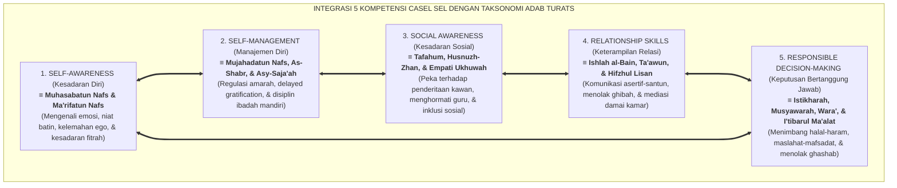
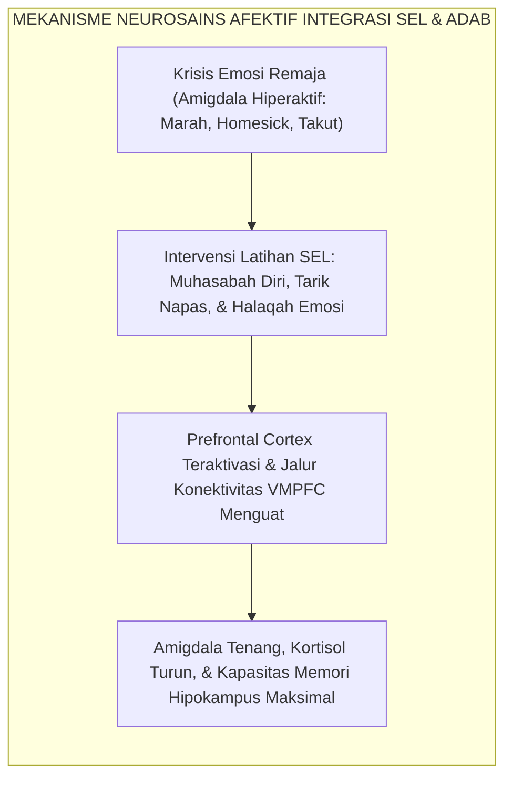
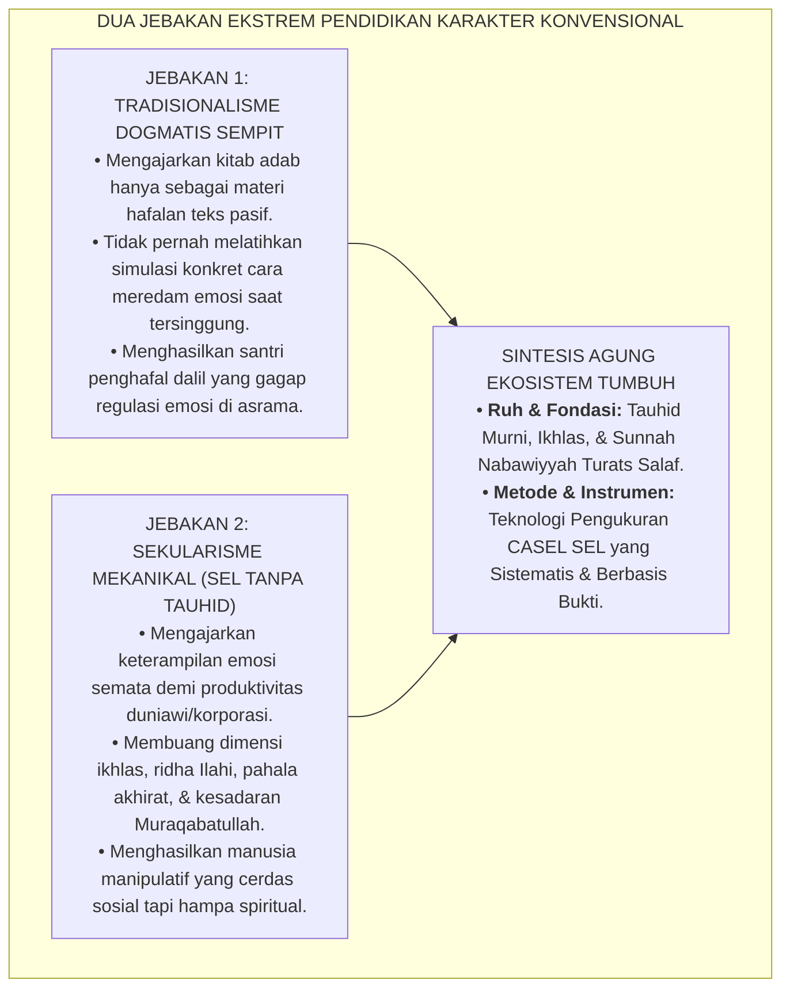
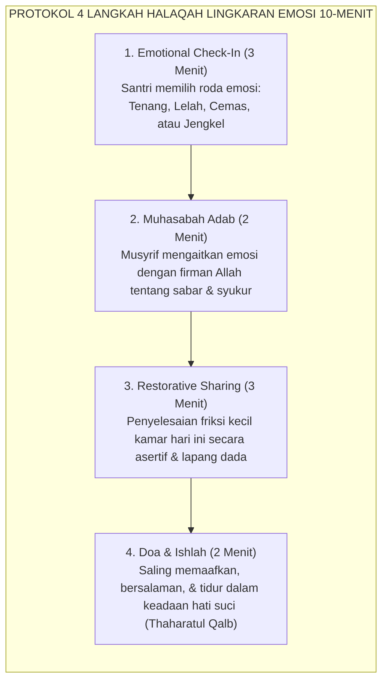

# INTEGRASI TAKSONOMI ADAB TURATS DENGAN CASEL SEL

---
### I. Titik Temu Mutiara Turats dan Konsensus Neurosains Afektif

Salah satu terobosan peradaban terbesar yang dihadirkan oleh **Ekosistem TUMBUH** adalah menjembatani dua khazanah keilmuan raksasa yang selama berabad-abad dipisahkan oleh sekat prasangka metodologis:
1. **Khazanah Adab Turats Islam**: Warisan agung para ulama salaf—seperti Imam Al-Ghazali, Al-Qabisi, Ibn Sahnun, Az-Zarnuji, dan Hadhratusy Syaikh KH. M. Hasyim Asy'ari—yang sarat dengan kedalaman spiritual (*tazkiyatun nafs*), etika relasional (*mu'asyarah*), dan orientasi ukhrawi.
2. **Konsensus Ilmiah CASEL SEL (*Collaborative for Academic, Social, and Emotional Learning*)**[^1]: Kerangka kerja psikologi global berbasis bukti (*evidence-based framework*) yang merumuskan 5 Kompetensi Inti Pembelajaran Sosio-Emosional yang teruji secara empiris di ribuan institusi pendidikan dunia.

TUMBUH membuktikan secara benderang bahwa 5 kompetensi CASEL SEL bukanlah konsep sekuler yang asing dari ajaran Islam. Sebaliknya, CASEL SEL adalah **terjemahan metodologis dan operasional modern dari nilai-nilai adab nabawiyyah** yang memungkinkan guru dan musyrif mengukur, melatihkan, dan membiasakan akhlak mulia secara konkret dalam kehidupan santri 24 jam:

<b>Gambar 1.3.1:</b> Peta Integrasi Lima Kompetensi CASEL SEL dengan Taksonomi Adab Turats Ekosistem TUMBUH.

Diagram di atas meruntuhkan anggapan keliru bahwa pendidikan adab cukup diajarkan lewat ceramah teks kitab kuning. Adab adalah keterampilan hidup (*life skills*) yang melibatkan konektivitas dinamis antara kesadaran batin (*Self-Awareness*), ketahanan menahan hawa nafsu (*Self-Management*), kepekaan membaca perasaan sesama (*Social Awareness*), kemahiran berkomunikasi tanpa menyakiti (*Relationship Skills*), dan kematangan menimbang akibat dari setiap perbuatan (*Responsible Decision-Making*).

---

### II. Bukti Ilmiah Meta-Analisis & Mekanisme Neurosains Afektif

Mengapa integrasi pembelajaran sosio-emosional ke dalam pesantren menjadi kebutuhan yang teramat mendesak? Bukti empiris sains internasional memberikan konfirmasi yang sangat meyakinkan.

Meta-analisis monumental yang dipimpin oleh **Joseph A. Durlak et al.**[^2] terhadap 213 program sekolah dan melibatkan lebih dari 270.034 siswa membuktikan dampak luar biasa dari integrasi SEL:
* **Peningkatan Prestasi Akademis**: Rata-rata capaian akademis dan nilai ujian siswa melonjak hingga **11 persentil** dibanding kelompok kontrol.
* **Penurunan Perilaku Negatif & Agresi**: Insiden perundungan (*bullying*), perkelahian fisik, dan pelanggaran disiplin menurun drastis sebesar **40%**.
* **Peredaan Distres Emosional**: Tingkat stres kronis, kecemasan (*anxiety*), dan depresi siswa turun signifikan hingga **24%**.

<b>Gambar 1.3.2:</b> Alur Mekanisme Neurosains Afektif dari Intervensi SEL Menuju Kestabilan Kognitif Santri.

Pakar neurosains afektif ternama **Prof. Richard J. Davidson & Daniel Goleman**[^3] membuktikan bahwa ketika seorang remaja dilatih melakukan regulasi emosi secara sadar (sebagaimana diajarkan dalam konsep *Muraqabatullah* dan *Tazkiyatun Nafs*), struktur otak mengalami neuroplastisitas positif: sirkuit saraf antara *Prefrontal Cortex* (PFC) dan *Amygdala* semakin kokoh. 

Akibatnya, santri yang terlatih SEL tidak mudah meledak amarahnya saat diprovokasi kawan, tidak larut dalam kesedihan berlarut-larut saat rindu rumah, dan memiliki kapasitas konsentrasi (*working memory*) yang jauh lebih prima untuk menghafal ayat-ayat Al-Qur'an dan memahami logika rumit ilmu ushul fiqih.

---

### III. Matriks Komparasi: Menghubungkan Teks Kitab Kuning dengan Kompetensi CASEL

Tabel berikut menyajikan dekonstruksi mendalam dan pemetaan komparatif antara teks dalil Turats ulama dengan indikator operasional CASEL SEL dalam sistem TUMBUH di pesantren:

| Kompetensi CASEL SEL | Rujukan Turats & Teks Arab Syar'i | Konseptualisasi Epistemologis | Indikator Perilaku Faktual di Asrama & Madrasah |
| :--- | :--- | :--- | :--- |
| **1. Self-Awareness (Kesadaran Diri)** | **Imam Al-Ghazali**, *Mizan al-'Amal*[^4]: $$\text{مَنْ لَمْ يَعْرِفْ نَفْسَهُ لَمْ يَعْرِفْ عَيْبَهَا، وَمَنْ لَمْ يَعْرِفْ عَيْبَهَا لَمْ يُمْكِنْهُ مُعَالَجَتُهَا}$$ *"Barangsiapa tidak mengenali jiwanya, ia takkan kenal cacat dirinya; dan barangsiapa tak kenal cacat dirinya, mustahil mampu mengobatinya."* | **Ma'rifatun Nafs & Muhasabah**: Kesadaran mendalam akan dorongan emosi, pemicu amarah (*triggers*), kelemahan ego, serta posisi kehambaan di hadapan Allah. | • Santri mampu mengenali kapan dirinya mulai merasa jengkel sebelum meluapkannya dalam bentakan. • Mampu mengakui keterbatasan diri tanpa gengsi. • Menyadari motif niat batin saat beramal. |
| **2. Self-Management (Manajemen Diri)** | **Syekh Burhanuddin Az-Zarnuji**, *Ta'lim al-Muta'allim*[^5]: $$\text{وَأَصْلُ الْأَخْلَاقِ كُلِّهَا: ضَبْطُ النَّفْسِ عَنِ الْهَوَى وَحَبْسُهَا عَلَى مَا يُرْضِي الرَّحْمَنَ}$$ *"Pokok dari seluruh kemuliaan akhlak adalah mengendalikan jiwa dari hawa nafsu dan mengekangnya di atas jalan keridhaan ar-Rahman."* | **Mujahadatun Nafs & As-Shabr**: Kemampuan menunda kepuasan sesaat (*delayed gratification*), meregulasi agresi, serta memelihara motivasi belajar berkelanjutan. | • Santri mampu mengendalikan dorongan membalas saat disenggol kawan di antrean wudhu. • Disiplin memadamkan lampu kamar pukul 22.00 WIB. • Mampu menahan godaan begadang yang tidak bermanfaat. |
| **3. Social Awareness (Kesadaran Sosial)** | **Imam Ali bin Muhammad Al-Qabisi**, *Ar-Risalah al-Mufashshilah*[^6]: $$\text{يَنْبَغِي لِلْمُتَعَلِّمِ أَنْ يَكُونَ رَفِيقًا بِإِخْوَانِهِ، مُتَفَقِّدًا لِأَحْوَالِهِمْ، غَيْرَ مُسْتَطِيلٍ عَلَيْهِمْ}$$ *"Sepatutnya penuntut ilmu bersikap lembut kepada kawan-kawannya, peka memeriksa keadaan mereka, dan pantang berlaku sombong menindas mereka."* | **Husnul Mu'asyarah & Empati Ukhuwah**: Kepekaan membaca bahasa tubuh dan emosi orang lain, memahami latar belakang kawan yang majemuk, serta menolak perundungan. | • Peka ketika melihat kawan sekamar tampak murung karena *homesick* lalu mendekati dan mendengarkan keluhannya. • Menghargai santri yang berasal dari daerah terpencil. • Melindungi adik kelas dari intimidasi senior. |
| **4. Relationship Skills (Keterampilan Relasi)** | **Hadhratusy Syaikh KH. M. Hasyim Asy'ari**, *Adab al-'Alim wal Muta'allim*[^7]: $$\text{أَنْ يَكُونَ كَلَامُهُ مَعَ أَقْرَانِهِ بِاللُّطْفِ وَحُسْنِ الْأَدَبِ، وَأَنْ يَجْتَنِبَ الْغَيْبَةَ وَالْمِرَاءَ وَالْفَحْشَ}$$ *"Hendaklah tutur katanya kepada sesama kawan diliputi kelembutan dan keluhuran adab, serta menjauhi ghibah, debat kusir yang melukai, dan kata-kata kotor."* | **Ishlah al-Bain, Ta'awun, & Hifzhul Lisan**: Kemampuan komunikasi asertif tanpa agresi, mendengar aktif, menyelesaikan konflik secara restoratif, dan membangun kolaborasi tim. | • Menggunakan bahasa santun saat mengingatkan kawan yang melanggar jadwal piket. • Menolak panggilan julukan yang merendahkan fisik (*body shaming*). • Bersedia menjadi penengah damai saat terjadi salah paham. |
| **5. Responsible Decision-Making (Keputusan Bertanggung Jawab)** | **Imam Abu Ishaq Asy-Syathibi**, *Al-Muwafaqat fi Ushul asy-Syari'ah*[^8]: $$\text{النَّظَرُ فِي مَآلَاتِ الْأَفْعَالِ مُعْتَبَرٌ مَقْصُودٌ شَرْعًا، حَيْثُ إِنَّ الْفِعْلَ يُحْكَمُ عَلَيْهِ بِحَسَبِ مَا يَئُولُ إِلَيْهِ}$$ *"Mempertimbangkan dampak jangka panjang dari setiap perbuatan adalah prinsip yang diperhitungkan dan menjadi tujuan syariat, di mana suatu tindakan dinilai dari muara dampaknya."* | **I'tibarul Ma'alat, Wara', & Istikharah**: Kematangan menimbang konsekuensi etis, legal, dan ukhrawi dari setiap pilihan tindakan sebelum bertindak. | • Menolak ajakan melanggar aturan keluar pondok tanpa izin karena memahami risiko bahaya dan dosanya. • Pantang melakukan *ghashab* barang kawan sekamar. • Memilih menggunakan waktu luang untuk membaca kitab. |

---

### IV. Mengapa Integrasi Ini Sangat Krusial? Menghindari Dua Jebakan Ekstrem

Pentingnya integrasi ini terlihat ketika kita menelaah dua kelemahan ekstrem yang selama ini menjangkiti dunia pendidikan:

<b>Gambar 1.3.3:</b> Rekonsiliasi Sintesis Ekosistem TUMBUH Melampaui Dua Jebakan Ekstrem Pendidikan Karakter.

Ekosistem TUMBUH menolak kedua jebakan di atas:
* Kami **tidak membuang Turats**, melainkan menghidupkannya dari sekadar teks mati di atas kertas menjadi protokol tindakan hidup yang berdenyut dalam keseharian asrama.
* Kami **tidak meniru sains Barat secara membabi buta**, melainkan mengambil metodologi terbaiknya (*hikmah*) dan membingkainya dalam tauhid dan kesucian syariat Islam.

---

### V. Solusi Sistemik TUMBUH: Halaqah Lingkaran Emosi (*Emotion Circle*) Harian

Sebagai aplikasi praksis dari integrasi CASEL SEL dan taksonomi adab Turats, setiap kamar asrama di ekosistem TUMBUH menjalankan protokol rutin: **Halaqah Lingkaran Emosi (*Halaqah Dawair al-Wijdaniyyah*) 10 Menit Setiap Malam Ba'da Isya**:

<b>Gambar 1.3.4:</b> Alur Operasional Halaqah Lingkaran Emosi 10-Menit di Kamar Asrama Santri.

Melalui halaqah 10 menit ini:
1. **Santri Belajar Menamai Emosi (*Name it to Tame it*)**: Ketika santri mampu berkata: *"Ustadz, hari ini saya merasa sangat lelah dan agak jengkel karena antrean mandi tadi pagi sangat padat"*, otaknya beralih dari amukan impulsif amigdala menuju pemrosesan rasional di korteks prefrontal.
2. **Friksi Diselesaikan Sebelum Menjadi Api Permusuhan**: Konflik kecil mengenai pemakaian sandal atau tugas piket yang belum tuntas diselesaikan malam itu juga dengan kepala dingin, sehingga dendam tidak pernah sempat mengendap menjadi api perkelahian di kemudian hari.
3. **Menghidupkan Sunnah Tidur Bersih Hati**: Menghidupkan hadits shahih tentang sahabat Anshar yang dijamin masuk surga oleh Rasulullah SAW bukan karena banyaknya shalat sunnah, melainkan karena setiap kali hendak tidur di malam hari, hatinya telah memaafkan dan membersihkan seluruh rasa dendam kepada sesama kaum muslimin.

Dengan integrasi taksonomi adab dan CASEL SEL ini, pembinaan karakter santri berpijak pada fondasi sains afektif dan syariat yang kokoh. Kita melangkah ke **Sub-Bab 1.4** untuk membedah bagaimana motivasi batin ini diperkuat melalui **Teori Penentuan Diri (*Self-Determination Theory*) dan Rekayasa Lingkungan Asrama 24-Jam**.

---

## 📌 Catatan Kaki & Rujukan Primer

[^1]: **CASEL (Collaborative for Academic, Social, and Emotional Learning)**, *Core SEL Competencies: The CASEL 5* (Chicago: CASEL Publications, 2020); serta **Roger P. Weissberg, Joseph A. Durlak, Celene E. Domitrovich, & Thomas P. Gullotta**, "Social and emotional learning: Past, present, and the future", dalam J. A. Durlak et al. (Eds.), *Handbook of Social and Emotional Learning: Research and Practice* (New York: Guilford Press, 2015), hlm. 3–19.
[^2]: **Joseph A. Durlak, Roger P. Weissberg, Allison B. Dymnicki, Rebecca D. Taylor, & Kriston B. Schellinger**, "The impact of enhancing students' social and emotional learning: A meta-analysis of school-based universal interventions", *Child Development*, Vol. 82, No. 1 (2011), hlm. 405–432.
[^3]: **Richard J. Davidson, Daren C. Jackson, & Ned H. Kalin**, "Emotion, plasticity, context, and regulation: Perspectives from affective neuroscience", *Psychological Bulletin*, Vol. 126, No. 6 (2000), hlm. 890–909; serta **Daniel Goleman & Richard J. Davidson**, *Altered Traits: Science Reveals How Meditation Changes Your Mind, Brain, and Body* (New York: Avery / Penguin Random House, 2017), Bab 5–7, hlm. 91–152.
[^4]: **Hujjatul Islam Imam Abu Hamid Muhammad bin Muhammad al-Ghazali**, *Mizan al-'Amal*, Tahqiq: Dr. Sulaiman Dunya (Kairo: Dar al-Ma'arif, 1964), Bab 5: "Tahdzib an-Nafs wa Ta'dil al-Akhlaq", hlm. 68–95.
[^5]: **Al-Imam Burhanuddin al-Zarnuji**, *Ta'lim al-Muta'allim Thariq at-Ta'allum*, Tahqiq: Syaikh Mustafa Asyur (Kairo: Dar al-I'tisham, 1986), hlm. 35–48.
[^6]: **Al-Imam Abu al-Hasan Ali bin Muhammad al-Qabisi**, *Ar-Risalah al-Mufashshilah li Ahwal al-Mu'allimin wa Ahkam al-Mu'allimin wal Muta'allimin*, Tahqiq: Ahmad Khalid Jam'ah (Damaskus: Dar al-Fikr, 1986), hlm. 55–82.
[^7]: **Hadhratusy Syaikh KH. M. Hasyim Asy'ari**, *Adab al-'Alim wal Muta'allim fi ma Yahtaju Ilayhi al-Muta'allim fi Ahwal Ta'allumihi wa ma Yatawaqqafu 'alayhi al-Mu'allim fi Maqamat Ta'limihi* (Jombang: Maktabah at-Turats al-Islami, 1415 H), Bab 2: "Fi Adabil Muta'allim fi Nafsihi wa ma'a Aqranihi", hlm. 24–38.
[^8]: **Al-Imam Abu Ishaq Ibrahim bin Musa asy-Syathibi**, *Al-Muwafaqat fi Ushul asy-Syari'ah*, Tahqiq: Syaikh Masyhur Hasan Salman (Kairo: Dar Ibn Affan, 1997), Jilid V: "Kitab al-Ijtihad wa al-Ma'alat", hlm. 177–210.
