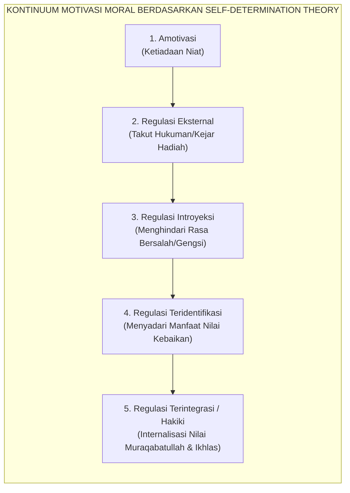
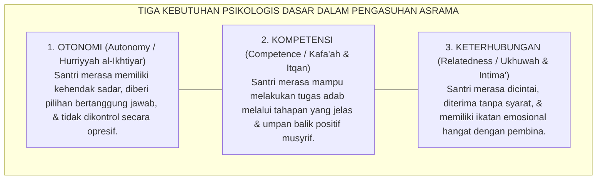

# SUB-BAB 1.4: TEORI PENENTUAN DIRI (SDT) DALAM PENGASUHAN ASRAMA
## *Memupuk Tiga Kebutuhan Psikologis Dasar: Otonomi, Kompetensi, dan Keterhubungan Relasional*

**Kode Klasifikasi**: `BOOK-02/BAB-01/SUB-04/MONOGRAF-MASTER-VIBRANT`  
**Disiplin Ilmu**: *Self-Determination Theory* (SDT), Psikologi Motivasi Pendidikan, & Teologi Niat Islam  
**Penanggung Jawab Keilmuan**: Dewan Pakar Ekosistem TUMBUH (*Pakar Psikologi Belajar & Pakar Epistemologi Turats*)

---

### Misteri Kepatuhan Semu: Mengapa Santri Menjadi Pembangkang Saat Ustadz Pulang?

Salah satu keluhan yang paling sering dilontarkan oleh para pengurus pondok pesantren adalah fenomena **kepatuhan semu (*superficial compliance*)**:
* Ketika musyrif berdiri di depan pintu kamar dengan membawa tongkat, seluruh santri bergegas membuka mushaf Al-Qur'an dan duduk rapi menunduk.
* Namun, begitu ustadz melangkah pergi dan lampu lorong dimatikan, santri yang sama langsung melempar kitabnya, saling melempar bantal, dan mengabaikan seluruh aturan adab.

Mengapa disiplin yang ditegakkan dengan ketat selama bertahun-tahun tidak pernah mengakar menjadi karakter permanen di dalam dada anak?

Pakar psikologi motivasi terkemuka **Edward L. Deci & Richard M. Ryan**[^1] memberikan jawaban ilmiah melalui **Teori Penentuan Diri (*Self-Determination Theory / SDT*)**: motivasi manusia tidak bersifat hitam-putih (antara rajin vs malas), melainkan bergerak di sepanjang **kontinuum regulasi motivasi**:

<b>Gambar 1.4.1:</b> Kontinuum Regulasi Motivasi Berdasarkan Self-Determination Theory (SDT) Deci & Ryan.

Ketika pesantren hanya mengandalkan ancaman rotan dan razia malam, lembaga tersebut sesungguhnya sedang memenjarakan santri pada tingkat paling rendah: **Regulasi Eksternal (*External Regulation*)**. Santri taat bukan karena mencintai kebaikan, melainkan semata-mata demi menghindari rasa sakit fisik atau rasa malu di depan umum.

Akibatnya, ketika pengawas eksternal itu hilang, motivasi beradab runtuh seketika. Dalam perspektif Turats, kondisi ini adalah bibit lahirnya kepribadian terbelah dan kemunafikan amali (*nifaq amali*).

---

### Tiga Kebutuhan Psikologis Dasar (*Basic Psychological Needs*)

Menurut Teori Penentuan Diri, manusia secara alamiah memiliki dorongan fitrah untuk bertumbuh dan berbuat baik. Dorongan intrinsik ini hanya akan mekar apabila lingkungan pengasuhan memenuhi **Tiga Kebutuhan Psikologis Dasar**:

<b>Gambar 1.4.2:</b> Tiga Kebutuhan Psikologis Dasar Santri dalam Ekosistem Asrama TUMBUH.

1. **Kebutuhan akan Otonomi (*Autonomy*)**:  
   Santri butuh merasa bahwa ia memilih untuk shalat dan belajar atas kemauannya sendiri demi Allah, bukan sekadar dipaksa seperti robot tahanan. Penelitian oleh **Johnmarshall Reeve**[^2] membuktikan bahwa guru dan musyrif yang mendukung otonomi (*autonomy-supportive*) melahirkan santri yang memiliki resiliensi belajar 3 kali lebih tangguh dibanding guru yang bergaya mengontrol (*controlling style*).
2. **Kebutuhan akan Kompetensi (*Competence*)**:  
   Santri butuh merasa mampu meraih standar adab yang ditetapkan. Jika aturan dibuat terlalu rumit dan santri selalu divonis gagal tanpa diajarkan langkah-langkah praktisnya, santri akan mengalami keputusasaan belajar (*learned helplessness*).
3. **Kebutuhan akan Keterhubungan Relasional (*Relatedness*)**:  
   Santri butuh merasa bahwa dirinya disayangi secara tulus oleh musyrifnya. Teguran yang dilayangkan oleh musyrif yang hangat akan diterima sebagai nasihat cinta; sebaliknya, teguran dari musyrif yang dingin dan kejam akan dianggap sebagai serangan permusuhan.

---

### Integrasi Teologis: Hakikat Ibadah Ikhlas & *'Ubudiyyah* Syaikhul Islam

Konsep pemenuhan otonomi dan kerelaan batin ini berpadu secara mendalam dengan ajaran teologi Islam mengenai hakikat ibadah yang ikhlas.

**Syaikhul Islam Ibnu Taimiyyah** dalam risalah monumentalnya *Al-'Ubudiyyah*[^3] menegaskan bahwa hakikat penghambaan (*Ibadah*) kepada Allah menuntut dua syarat yang menyatu: **puncak ketundukan (*Ghayat az-Zull*) yang berpadu dengan puncak kecintaan (*Ghayat al-Hubb*)**:

> [!NOTE]
> ### 📜 Hakikat Penghambaan Sejati Menurut Ibnu Taimiyyah:
> 
> $$\text{وَالْعِبَادَةُ الْمَأْمُورُ بِهَا تَتَضَمَّنُ مَعْنَى الذُّلِّ وَمَعْنَى الْحُبِّ، فَهِيَ تَتَضَمَّنُ غَايَةَ الذُّلِّ لِلَّهِ تَعَالَى بِغَايَةِ الْمَحَبَّةِ لَهُ}$$
> 
> **Artinya:**  
> *"Ibadah yang diperintahkan oleh Allah mencakup makna ketundukan sekaligus kecintaan; ia mengandung puncak ketundukan di hadapan Allah yang bersanding dengan puncak kecintaan yang tulus kepada-Nya."*

Jika santri beribadah hanya karena takut rotan ustadz tanpa ada rasa cinta (*al-Mahabbah*) di hatinya, maka amalnya kehilangan esensi ibadah sejati. 

Senada dengan itu, **Hujjatul Islam Imam Abu Hamid Al-Ghazali** dalam *Ihya' 'Ulumiddin* (Kitab *an-Niyyah wal Ikhlas*)[^4] menegaskan bahwa niat adalah penggerak jiwa yang bersumber dari dorongan batin (*ba'itsun nafsi*), bukan sekadar ucapan lisan yang dipaksakan dari luar.

---

### Solusi Sistemik TUMBUH: Transformasi Pendampingan Berbasis Dukungan Otonomi

Sistem **TUMBUH** mengubah total gaya kepengasuhan musyrif di asrama:

| Pola Asuh Mengontrol Lama (*Controlling Trap*) | Pola Asuh Pendukung Otonomi TUMBUH (*Autonomy-Supportive*) |
| :--- | :--- |
| Memerintah santri dengan kata-kata mutlak: *"Cepat bangun! Jangan banyak alasan!"* | Menyampaikan alasan logis bernilai ibadah (*Rationale*): *"Ayo bangun, Nak. Waktu subuh sebentar lagi, mari kita jemput keberkahan pagi bersama Allah."* |
| Mengancam dengan sanksi fisik atau hukuman denda uang saku. | Melibatkan santri menyepakati konsekuensi logis 4R bersama di awal semester. |
| Melarang santri berekspresi: *"Santri tidak boleh membantah!"* | Memberikan ruang validasi emosi: *"Ustadz tahu kamu lelah setelah piket tadi, tapi merapikan kasur adalah adab kamar kita bersama."* |
| Memberikan reward materiil ekstrinsik (stiker/uang) yang merusak ikhlas. | Memberikan penguatan apresiasi relasional 4:1 yang menyentuh kalbu. |

Dengan memuaskan tiga kebutuhan dasar ini, santri bertumbuh menjadi pribadi yang memiliki **kemerdekaan jiwa (*Hurriyyah al-Iradah*)** yang memilih tunduk kepada Allah atas dasar cinta, keimanan, dan kerinduan meraih ridha-Nya.

---

## 📌 Catatan Kaki & Rujukan Primer

[^1]: **Edward L. Deci & Richard M. Ryan**, *Intrinsic Motivation and Self-Determination in Human Behavior* (New York: Plenum Press, 1985); serta **Richard M. Ryan & Edward L. Deci**, *Self-Determination Theory: Basic Psychological Needs in Motivation, Development, and Wellness* (New York: Guilford Press, 2017), Bab 1: "Overview of Self-Determination Theory", hlm. 3–25.
[^2]: **Johnmarshall Reeve**, "Why teachers adopt a controlling motivating style toward students and how they can become more autonomy supportive", *Educational Psychologist*, Vol. 44, No. 3 (2009), hlm. 159–175.
[^3]: **Syaikhul Islam Ahmad bin Abdul Halim Ibnu Taimiyyah**, *Al-'Ubudiyyah*, Tahqiq: Ali Hasan al-Halabi (Beirut: Al-Maktab al-Islami, 1425 H / 2005 M), hlm. 15–35.
[^4]: **Hujjatul Islam Imam Abu Hamid al-Ghazali**, *Ihya' 'Ulumiddin*, Kitab an-Niyyah wal Ikhlas wash-Shidq (Kairo & Beirut: Dar al-Ma'rifah, t.th.), Juz IV, hlm. 360–375.
