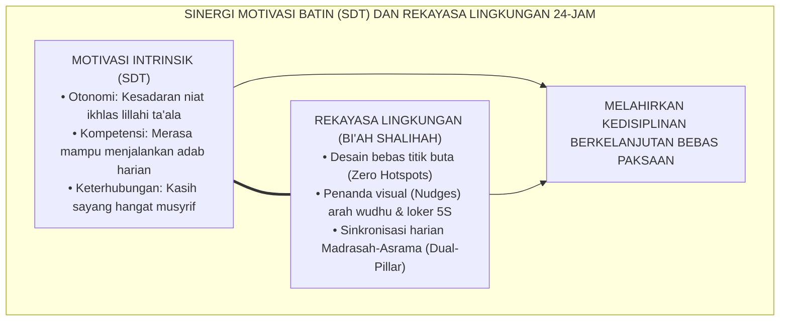

# SUB-BAB 1.4: TEORI PENENTUAN DIRI & REKAYASA LINGKUNGAN ASRAMA
## *Memadukan Otonomi Psikologis (SDT), Rekayasa Tata Ruang Bi'ah Shalihah, dan Penghapusan Titik Rawan 24-Jam*

**Kode Klasifikasi**: `BOOK-02/BAB-01/SUB-04/MONOGRAF-MASTER-VIBRANT`  
**Disiplin Ilmu**: *Self-Determination Theory* (SDT), Psikologi Lingkungan (*Environmental Psychology*), & Arsitektur Pesantren  
**Penanggung Jawab Keilmuan**: Dewan Pakar Ekosistem TUMBUH (*Pakar Psikologi Belajar & Pakar Intervensi Preventif*)

---

### Titik Temu Motivasi Batin dan Rekayasa Ekologi Asrama

Kepatuhan yang lahir dari ancaman rotan adalah kepatuhan semu (*superficial compliance*). Ketika ustadz meninggalkan bilik asrama, kedisiplinan mekanis tersebut runtuh seketika.

Untuk menumbuhkan kesadaran adab yang otonom dan permanen, **Ekosistem TUMBUH** memadukan dua pilar transformatif:
1. **Teori Penentuan Diri (*Self-Determination Theory / SDT*)**[^1], yaitu Memenuhi tiga kebutuhan psikologis dasar santri (Otonomi, Kompetensi, dan Keterhubungan Relasional) agar nilai adab terinternalisasi menjadi motivasi intrinsik *Muraqabatullah*.
2. **Rekayasa Lingkungan Hidup 24-Jam (*Environmental Architecture*)**[^2], yaitu Menata ruang fisik asrama sebagai "guru bisu" yang mendorong perilaku beradab secara spontan tanpa perlu teriakan dan ancaman.

<b>Gambar 1.4.1:</b> Sinergi Teori Penentuan Diri (SDT) dan Rekayasa Lingkungan 24-Jam.

Pakar psikologi motivasi **Edward L. Deci & Richard M. Ryan** membuktikan bahwa lingkungan yang mendukung otonomi (*autonomy-supportive environment*) melahirkan ketahanan belajar dan kestabilan karakter 3 kali lebih kuat dibanding lingkungan yang mengontrol secara opresif.

Pakar psikologi lingkungan **Gary W. Evans** membuktikan bahwa kepadatan berlebih (*crowding*) dan kesemrawutan ruang (*chaos*) memicu lonjakan hormon stres kortisol, yang memicu amarah dan perkelahian di kalangan remaja asrama.

---

### Empat Pilar Rekayasa Lingkungan Bi'ah Shalihah TUMBUH

Pemenang Nobel **Richard H. Thaler & Cass R. Sunstein**[^3] membuktikan bahwa penataan pilihan (*choice architecture*) dan dorongan visual sederhana (*nudges*) mampu mengarahkan perilaku manusia menuju kebaikan tanpa membatasi kebebasan memilihnya.

Di asrama TUMBUH, rekayasa lingkungan diwujudkan melalui empat pilar konkret:
1. **Desain Bebas Titik Buta (*Zero Hotspots Architecture*)**: Memasang penerangan terang di lorong belakang, gudang, dan area toilet; mengeliminasi sudut-sudut mati yang kerap disalahgunakan untuk perpeloncoan senior.
2. **Arsitektur Dorongan Visual (*Visual Nudge Cues*)**: Garis antrean wudhu yang jelas di lantai, wadah sandal bersusun dengan label nama santri, dan papan panduan adab di setiap dinding kamar.
3. **Zonasi Fungsional 24-Jam**: Pemisahan tegas zona hening belajar (*muthala'ah zone*), zona privasi istirahat kamar, dan zona interaksi sosial santri.
4. **Sinkronisasi Dua Pilar (*Dual-Pillar Synchronization*)**: Protokol serah terima harian 15 menit antara Wali Kelas Madrasah dan Musyrif Asrama untuk memastikan kontinuitas pendampingan psikologis santri.

---

### Wawasan Turats: Memurnikan Niat & Menjaga *Bi'ah Shalihah*

**Syaikhul Islam Ibnu Taimiyyah** dalam *Al-'Ubudiyyah*[^4] menegaskan bahwa hakikat ibadah yang diterima Allah adalah ibadah yang memadukan puncak ketundukan (*Ghayat az-Zull*) dengan puncak kecintaan (*Ghayat al-Hubb*); ketaatan yang dipaksakan dengan kekerasan kehilangan esensi keikhlasan.

**Hujjatul Islam Imam Abu Hamid Al-Ghazali** dalam *Ihya' 'Ulumiddin* (Kitab *Adab al-Ulfah wal Ukhuwwah*)[^5] menegaskan kaidah agung bahwa watak dasar manusia memiliki sifat mudah meniru lingkungan sekitarnya (*Innat thiba'a sarraqah*). Ketika lingkungan fisik dan sosial asrama tertata bersih, damai, dan terang, jiwa santri akan menyerap ketertiban tersebut menjadi tabiat alaminya.

Dengan sinergi antara dorongan batin yang merdeka dan ekosistem asrama yang memuliakan, arsitektur kapasitas holistik berbasis fitrah siap menopang penanaman **10 Muwashafat Karakter Santri pada Bab 02**.

---

## 📌 Catatan Kaki & Rujukan Primer

[^1]: **Richard M. Ryan & Edward L. Deci**, *Self-Determination Theory: Basic Psychological Needs in Motivation, Development, and Wellness* (New York: Guilford Press, 2017), Bab 1: "Overview of Self-Determination Theory", hlm. 3–25.
[^2]: **Gary W. Evans**, "The built environment and children's development", *Annual Review of Public Health*, Vol. 27 (2006), hlm. 423–441.
[^3]: **Richard H. Thaler & Cass R. Sunstein**, *Nudge: Improving Decisions About Health, Wealth, and Happiness* (New Haven: Yale University Press, 2008; Edisi Revisi, Penguin Books, 2009), Bab 1: "Biases and Blunders", hlm. 17–39.
[^4]: **Syaikhul Islam Ahmad bin Abdul Halim Ibnu Taimiyyah**, *Al-'Ubudiyyah*, Tahqiq: Ali Hasan al-Halabi (Beirut: Al-Maktab al-Islami, 1425 H / 2005 M), hlm. 15–35.
[^5]: **Hujjatul Islam Imam Abu Hamid al-Ghazali**, *Ihya' 'Ulumiddin*, Kitab Adab al-Ulfah wal Ukhuwwah wash-Shuhbah (Kairo & Beirut: Dar al-Ma'rifah, t.th.), Jilid II, hlm. 175–190.
