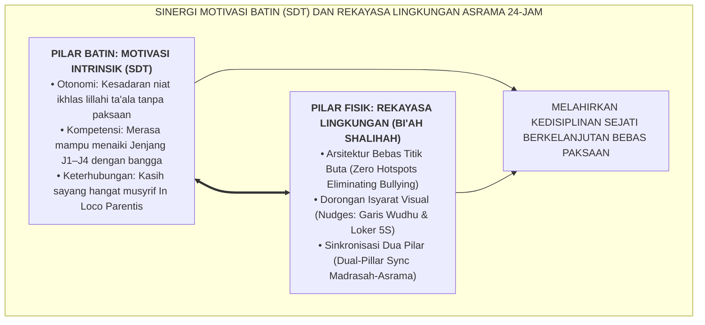
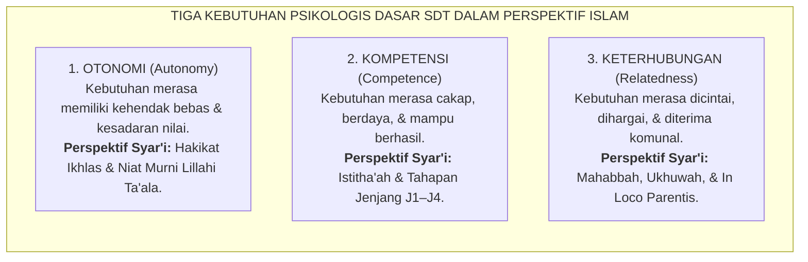
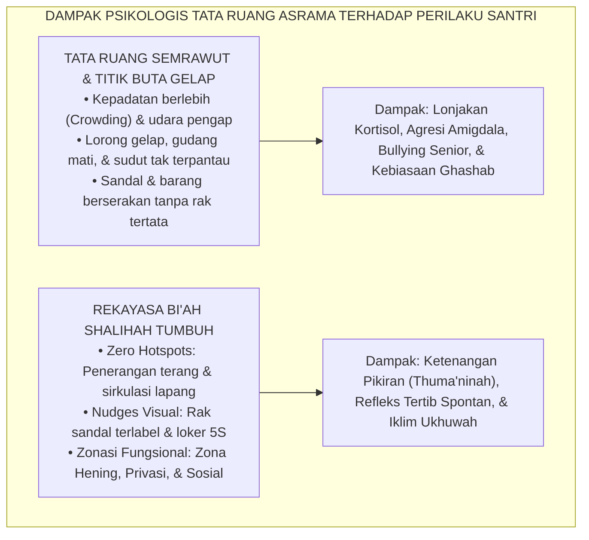
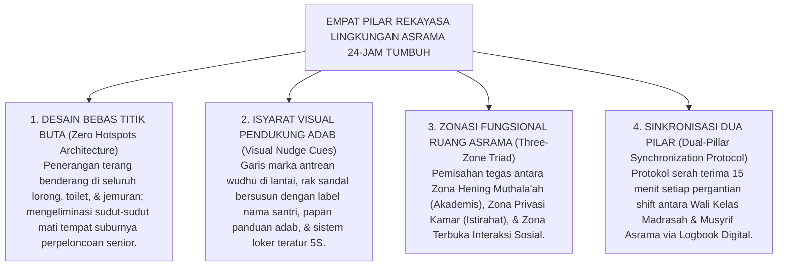
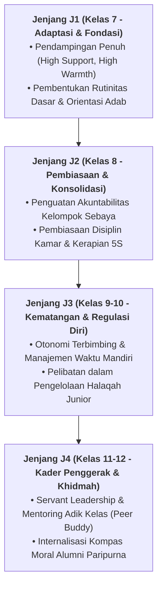

# TEORI PENENTUAN DIRI & REKAYASA LINGKUNGAN ASRAMA

---
### I. Titik Temu Motivasi Batin dan Rekayasa Ekologi Asrama

Di banyak pesantren konvensional, kedisiplinan santri sering kali ditegakkan dengan instrumen yang sangat rapuh: **teriakan pengurus, ancaman sanksi fisik, dan desingan rotan**.

Ketika seorang pembina asrama berjalan melintasi lorong dengan wajah garang dan tongkat di tangan, suasana mendadak sunyi senyap. Santri-santri langsung bergegas merapikan kasur, berlari mengambil air wudhu, dan menundukkan kepala. Para pengurus merasa bangga dan menyimpulkan: *"Lihatlah, metode kekerasan ini sangat ampuh membuat santri disiplin!"*

Namun, apa yang terjadi begitu sang pembina melangkahkan kaki keluar dari pintu gerbang asrama?
Hanya dalam hitungan detik, suasana asrama kembali riuh tak terkendali. Sandal kembali berserakan di depan pintu, sampah makanan dilempar sembarangan ke bawah ranjang, dan adab saling menghormati lenyap seketika.

Fenomena ini dalam psikologi motivasi disebut sebagai **kepatuhan semu (*superficial compliance*)** yang lahir dari regulasi eksternal murni (*external regulation*). Kepatuhan yang didorong semata-mata oleh rasa takut akan ancaman tidak pernah meresap ke dalam lubuk kalbu. Begitu sumber rasa takut tersebut hilang, perilaku buruk akan kembali meletup dengan intensitas yang bahkan jauh lebih destruktif.

Untuk membangun kedisiplinan yang sejati, langgeng, dan mandiri, **Ekosistem TUMBUH** memadukan dua pilar transformatif yang saling mengunci:
1. **Teori Penentuan Diri (*Self-Determination Theory / SDT*)**[^1]: Memenuhi tiga kebutuhan psikologis dasar santri (Otonomi, Kompetensi, dan Keterhubungan Relasional) agar motivasi beradab bertransformasi dari keterpaksaan eksternal menjadi dorongan intrinsik yang tulus karena Allah (*Muraqabatullah*).
2. **Rekayasa Lingkungan Hidup 24-Jam (*Environmental Architecture & Bi'ah Shalihah*)**[^2]: Menata ruang fisik, pencahayaan, alur sirkulasi, dan dorongan visual (*nudges*) di asrama sedemikian rupa sehingga lingkungan bertindak sebagai "guru bisu (*the silent educator*)" yang secara alami memandu santri berbuat tertib tanpa perlu diawasi dengan intimidasi.

<b>Gambar 1.4.1:</b> Diagram Sinergi Teori Penentuan Diri (SDT) dan Rekayasa Lingkungan 24-Jam.

Diagram di atas menegaskan bahwa pembentukan karakter membutuhkan kerja sama dua sayap yang seimbang: menyalakan api kesadaran dari dalam jiwa santri (*internal motivation*), sembari menyediakan sarang ekologi fisik yang mendukung dan menuntun perilaku mulia tersebut dalam realitas nyata (*enabling environment*).

---

### II. Tiga Kebutuhan Psikologis Dasar SDT dalam Terang Ubudiyyah

Pakar psikologi motivasi terkemuka dunia, **Prof. Edward L. Deci & Prof. Richard M. Ryan**[^3] dari University of Rochester, membuktikan melalui riset empiris puluhan tahun bahwa manusia memiliki **Tiga Kebutuhan Psikologis Dasar (*Basic Psychological Needs*)** yang wajib dipenuhi agar potensi karakternya dapat bertumbuh optimal:

<b>Gambar 1.4.2:</b> Tiga Kebutuhan Psikologis Dasar SDT dalam Perspektif Ubudiyyah Islam.

Mari kita bedah korelasi mendalam antara ketiga kebutuhan psikologis ini dengan khazanah spiritual Islam:

#### 1. Kebutuhan Otonomi (*Autonomy*) $\equiv$ Hakikat Ikhlas dan Pembebasan Jiwa
Santri yang dididik dengan doktrin intimidasi merasa dirinya tidak memiliki kendali atas hidupnya. Akibatnya, ia menganggap aturan pondok sebagai "penjara penindas". Sebaliknya, ketika musyrif berdialog secara dialogis dan menjelaskan *hikmah* (alasan filosofis dan maslahat) di balik setiap aturan, santri merasa dihargai kemerdekaan akalnya.

Dalam kitab monumentalnya *Al-'Ubudiyyah*[^4], **Syaikhul Islam Ibnu Taimiyyah** menegaskan bahwa hakikat ibadah yang diterima di sisi Allah adalah perpaduan antara kesadaran tunduk (*at-tadzallul*) dan kecintaan yang mendalam (*al-mahabbah*):
> *"Ketaatan yang dipaksakan semata-mata karena takut kepada ancaman sesama makhluk bukanlah hakikat ubudiyyah kepada Allah. Ubudiyyah sejati adalah penyerahan diri yang merdeka, di mana hati digerakkan oleh rasa cinta dan kerinduan menggapai ridha-Nya tanpa pamrih duniawi."*

#### 2. Kebutuhan Kompetensi (*Competence*) $\equiv$ Tangga Kapasitas *Istitha'ah*
Santri sering kali melanggar aturan bukan karena berniat jahat, melainkan karena **merasa tidak mampu (*incompetent*)** memenuhi tuntutan yang melampaui kapasitas adaptasinya. Santri baru yang belum pernah mencuci pakaian sendiri atau belum lancar membaca pegon akan merasa cemas luar biasa. Melalui progresi Jenjang Kemandirian TUMBUH (J1–J4) (T1 Adaptasi hingga T4 Transformasi), kurikulum adab dipecah menjadi langkah-langkah kecil yang realistis, sehingga santri merasakan keberhasilan bertahap (*sense of mastery*) yang membangkitkan harga dirinya.

#### 3. Kebutuhan Keterhubungan Relasional (*Relatedness*) $\equiv$ Kehangatan *Ukhuwah* & Pengasuhan
Seorang anak yang terpisah ratusan kilometer dari pelukan ayah dan ibunya mengalami kerentanan relasional yang sangat tinggi (*attachment disruption*). Jika di pesantren ia hanya menjumpai pengurus yang berwajah dingin dan suka membentak, jiwanya akan merasa terasing (*alienated*). 

Sebagaimana dicontohkan oleh Rasulullah SAW ketika mengasuh Anas bin Malik RA selama sepuluh tahun tanpa sekalipun membentak atau mencelanya, musyrif dalam sistem TUMBUH hadir sebagai figur lekat pengganti orang tua (*In Loco Parentis*) yang mendengarkan, merangkul, dan memvalidasi emosi santri.

---

### III. Sains Psikologi Lingkungan & Dorongan Arsitektural (*Nudge Theory*)

Di samping pembinaan motivasi batin, lingkungan fisik asrama memegang peranan krusial yang kerap diabaikan. 

Pakar psikologi lingkungan terkemuka **Prof. Gary W. Evans**[^5] dari Cornell University dalam riset komprehensifnya membuktikan bahwa tata ruang fisik yang buruk berdampak langsung terhadap kerusakan psikologis anak:
* **Kepadatan Berlebih (*Crowding*)**: Menempatkan 30 santri dalam satu kamar sempit tanpa privasi memicu lonjakan hormon stres kortisol secara kronis, menurunkan empati sosial, dan melipatgandakan insiden perkelahian fisik hingga **3 kali lipat**.
* **Kesemrawutan Visual (*Spatial Chaos*)**: Kamar yang gelap, sirkulasi udara pengap, dan barang-barang yang berserakan di lantai membuat otak anak mengalami kelebihan beban kognitif (*cognitive overload*), yang memicu keputusasaan dan kebiasaan malas.

<b>Gambar 1.4.3:</b> Komparasi Dampak Tata Ruang Fisik terhadap Stabilitas Perilaku Santri.

Pemenang Hadiah Nobel Ekonomi **Prof. Richard H. Thaler & Prof. Cass R. Sunstein**[^6] dalam mahakaryanya *Nudge* merumuskan konsep **Arsitektur Pilihan (*Choice Architecture*)**: bahwa penataan lingkungan fisik dengan memberikan isyarat visual halus (*nudges*) mampu mengarahkan manusia untuk secara otomatis memilih perilaku yang baik tanpa perlu pemaksaan hukum atau ancaman hukuman.

---

### IV. Empat Pilar Rekayasa Lingkungan Bi'ah Shalihah TUMBUH

Menerjemahkan sains psikologi lingkungan dan teori *Nudge* ke dalam operasional pesantren, Ekosistem TUMBUH menetapkan **Empat Pilar Rekayasa Lingkungan Asrama 24-Jam**:

<b>Gambar 1.4.4:</b> Arsitektur Empat Pilar Rekayasa Lingkungan Asrama 24-Jam Ekosistem TUMBUH.

Mari kita bedah keempat pilar ini secara rinci:

1. **Desain Bebas Titik Buta (*Zero Hotspots Architecture*)**:
   Mayoritas kasus perpeloncoan, kekerasan senior, dan perundungan di pesantren terjadi di tempat-tempat yang luput dari pandangan ustadz: lorong belakang kamar mandi, kamar pojok yang gelap, atau gudang terbengkalai. TUMBUH mewajibkan audit tata ruang: seluruh area publik asrama harus memiliki pencahayaan minimal 200 lux di malam hari, pintu-pintu transparan parsial, dan jalur patroli terjadwal musyrif (*proactive visibility*).

2. **Isyarat Visual Pendukung Adab (*Visual Nudge Cues*)**:
   Santri tidak perlu diteriaki untuk merapikan sandal jika di depan pintu kamar telah disediakan rak sandal bertingkat yang setiap kotaknya bertuliskan nama santri dengan warna yang jelas. Ketika sebuah sandal diletakkan di luar kotaknya, ketidakteraturan tersebut langsung terlihat mencolok secara visual, memicu dorongan psikologis santri untuk segera mengembalikannya ke tempat semula (*visual feedback loop*). Begitu pula dengan sistem manajemen loker 5S (*Seiri, Seiton, Seiso, Seiketsu, Shitsuke*).

3. **Zonasi Fungsional Tiga Zona (*Three-Zone Triad*)**:
   * **Zona Hening (*Quiet Zone*)**: Khusus untuk muthala'ah kitab dan menghafal Al-Qur'an; dilarang bercengkerama suara keras di area ini.
   * **Zona Privasi (*Rest Zone*)**: Bilik kamar tidur yang tenang dengan pencahayaan redup ba'da 22.00 WIB untuk menjamin kualitas tidur sirkadian 7 jam.
   * **Zona Sosial (*Community Zone*)**: Ruang bersama, teras, dan lapangan tempat santri bebas berolahraga, berdiskusi, dan menyalurkan ekspresi dinamis remajanya.

4. **Sinkronisasi Dua Pilar (*Dual-Pillar Synchronization Protocol*)**:
   Pemisahan informasi antara guru sekolah di pagi hari dan musyrif asrama di sore hari adalah penyebab utama tidak terdeteksinya problem perilaku santri. Melalui protokol serah terima harian 15 menit pukul 15.30 WIB, wali kelas menyampaikan catatan observasi (misalnya: *"Santri Zaid hari ini tampak mengantuk dan murung di kelas"*) kepada musyrif, sehingga musyrif dapat langsung memberikan pendampingan personal (*check-in*) malam harinya.

---

### V. Wawasan Turats: Kaidah 'Innat Thiba'a Sarraqah' dan Ekosistem Kebajikan

Prinsip bahwa penataan lingkungan fisik dan pergaulan sosial membentuk jiwa manusia secara otomatis adalah kaidah agung yang telah diuraikan oleh **Hujjatul Islam Imam Abu Hamid Al-Ghazali** dalam *Ihya' 'Ulumiddin* (Kitab *Adab al-Ulfah wal Ukhuwwah*)[^7]:

$$\text{إِنَّ الطِّبَاعَ سَرَّاقَةٌ، وَالنُّفُوسَ مَجْبُولَةٌ عَلَى التَّشَبُّهِ وَالِاقْتِدَاءِ، فَمُجَالَوَرَةُ أَهْلِ الْخَيْرِ تُكْسِبُ الْخَيْرَ، كَمَا أَنَّ مُجَاوَرَةَ أَهْلِ الشَّرِّ تُعْدِي بِالشَّرِّ}$$

**Terjemahan Berjiwa:**
> *"Sesungguhnya watak dasar manusia memiliki tabiat 'mencuri' (menyerap secara diam-diam keadaan di sekelilingnya), dan jiwa manusia diciptakan dengan kecenderungan alami untuk meniru dan mengikuti figur di dekatnya.*
> 
> *Maka bertetangga dan hidup berdampingan dengan lingkungan orang-orang yang berbuat kebaikan akan memancarkan kebaikan ke dalam jiwanya, sebagaimana hidup berdampingan dengan lingkungan yang rusak akan menularkan keburukan tanpa disadari."*

Kaidah *Innat Thiba'a Sarraqah* membuktikan kearifan ulama: karakter tidak bisa ditanamkan di ruang hampa yang terisolasi. Jika asrama berantakan, kotor, dan penuh teror senioritas, maka jiwa santri akan "mencuri" tabiat kekerasan dan kekacauan tersebut. Sebaliknya, ketika asrama ditata bersih, damai, penuh kasih sayang, dan sarat dengan dorongan adab, maka jiwa santri secara spontan menyerap keteraturan dan kemuliaan adab menjadi tabiat permanennya.

Dengan tuntasnya peletakan fondasi Arsitektur Kapasitas Holistik pada Bab 01 ini, kita telah membangun landasan filosofis, taksonomis, sosio-emosional, dan ekologis yang sangat kokoh. Seluruh instrumen ini siap menopang pembahasan inti pada **Bab 02: Profil 10 Muwashafat Karakter Santri dalam sistem TUMBUH**.

---

## 📌 Catatan Kaki & Rujukan Primer

[^1]: **Richard M. Ryan & Edward L. Deci**, *Self-Determination Theory: Basic Psychological Needs in Motivation, Development, and Wellness* (New York: Guilford Press, 2017), Bab 1: "Overview of Self-Determination Theory", hlm. 3–25; serta **Edward L. Deci & Richard M. Ryan**, *Intrinsic Motivation and Self-Determination in Human Behavior* (New York: Plenum Press, 1985), hlm. 43–88.
[^2]: **Gary W. Evans**, "The built environment and children's development", *Annual Review of Public Health*, Vol. 27 (2006), hlm. 423–441; serta **Gary W. Evans**, "Child development and the physical environment", *Annual Review of Psychology*, Vol. 57 (2006), hlm. 423–451.
[^3]: **Edward L. Deci, Richard M. Ryan, & Maarten Vansteenkiste**, "Self-determination theory in educational settings", dalam K. R. Wentzel & D. B. Miele (Eds.), *Handbook of Motivation at School* (New York: Routledge, 2016), hlm. 105–129.
[^4]: **Syaikhul Islam Ahmad bin Abdul Halim Ibnu Taimiyyah**, *Al-'Ubudiyyah*, Tahqiq: Ali Hasan al-Halabi (Beirut: Al-Maktab al-Islami, 1425 H / 2005 M), hlm. 15–35; serta **Al-Imam Syamsuddin Ibnu Qayyim al-Jawziyyah**, *Al-Fawa'id*, Tahqiq: Syaikh Syu'aib al-Arnauth (Kairo: Dar al-Afaq al-Jadidah, t.th.), hlm. 88–104.
[^5]: **Gary W. Evans & Stephen J. Lepore**, "Moderating and mediating processes in environment-behavior research", dalam G. T. Moore & R. W. Marans (Eds.), *Advances in Environment, Behavior, and Design* (New York: Plenum Press, 1997), Vol. 4, hlm. 255–285.
[^6]: **Richard H. Thaler & Cass R. Sunstein**, *Nudge: Improving Decisions About Health, Wealth, and Happiness* (New Haven: Yale University Press, 2008; Edisi Revisi, Penguin Books, 2009), Bab 1: "Biases and Blunders", hlm. 17–39; serta Bab 5: "Choice Architecture", hlm. 81–100.
[^7]: **Hujjatul Islam Imam Abu Hamid Muhammad bin Muhammad al-Ghazali**, *Ihya' 'Ulumiddin*, Kitab Adab al-Ulfah wal Ukhuwwah wash-Shuhbah wa Mu'asyaratil Khalq (Kairo & Beirut: Dar al-Ma'rifah, t.th.), Jilid II, hlm. 175–190.

---

### IV. Pembedahan Kapasitas Lanjutan & Trajektori Progresi Teori Penentuan Diri & Rekayasa Lingkungan Asrama

Pengembangan kompetensi **TEORI PENENTUAN DIRI & REKAYASA LINGKUNGAN ASRAMA** pada santri memerlukan strategi diferensiasi yang selaras dengan tahapan usia perkembangan remaja (*Developmental Milestones*):

1. **Dekomposisi Indikator Kematangan Perilaku**:
   Untuk memastikan karakter **TEORI PENENTUAN DIRI & REKAYASA LINGKUNGAN ASRAMA** tertanam secara operasional, dewan asatidz dan musyrif memetakan indikator perilakunya ke dalam 3 ranah capaian:
   * **Ranah Kognitif-Reflektif (*Ma'rifah*)**: Santri memahami dalil syar'i, urgensi akhlak, dan konsekuensi logis dari setiap pilihannya.
   * **Ranah Afektif-Ruhiyyah (*Wijdan*)**: Tumbuhnya kepekaan nurani, rasa malu berbuat dosa (*Haya'*), dan kenikmatan dalam berbuat kebajikan.
   * **Ranah Psikomotorik-Habituasi (*'Amal*)**: Terwujudnya keterampilan bertindak nyata secara spontan, konsisten, dan mandiri tanpa perlu disuruh.

2. **Matriks Penahapan Lintas Jenjang Kemandirian (J1–J4)**:

3. **Rubrik Evaluasi Kualitatif & Indikator Pencapaian**:

| Level Kemandirian | Karakteristik Perilaku Teramati (*Behavioral Anchor*) | Pendekatan Bimbingan Musyrif |
| :--- | :--- | :--- |
| **Level 1 (Emerging)** | Memerlukan instruksi berulang dan pengawasan langsung musyrif. | *Direct Prompting* & pengingat visual harian. |
| **Level 2 (Developing)** | Mampu menjalankan adab saat diingatkan oleh teman sebaya. | Penguatan positif melalui pujian deskriptif. |
| **Level 3 (Proficient)** | Menjalankan adab secara mandiri dan konsisten tanpa diawasi. | Pemberian kepercayaan dan peran tanggung jawab kamar. |
| **Level 4 (Exemplary)** | Menjadi teladan (*Qudwah*) dan mampu membimbing kawan-kawannya. | Pelibatan aktif dalam struktur Dewan Santri & Mentor. |

---

### V. Panduan Praksis Pendampingan Musyrif di Asrama

Agar penanaman **TEORI PENENTUAN DIRI & REKAYASA LINGKUNGAN ASRAMA** berhasil maksimal di lapangan, musyrif disarankan menerapkan protokol pendampingan berikut:
* **Fokus pada Usaha (*Effort-Oriented Praise*)**: Berikan apresiasi atas proses perjuangan santri dalam memperbaiki diri, bukan semata-mata hasil akhir yang sempurna.
* **Dialog Sokratik Saat Santri Mengalami Kesulitan**: Ajukan pertanyaan reflektif seperti: *"Apa yang membuat antum merasa berat menjalankan adab ini hari ini? Bagaimana kita bisa mengatasinya bersama besok?"*
* **Menjaga Iklim Ukhuwah Bebas Perundungan**: Pastikan senioritas dimaknai sebagai amanah pengayoman dan perlindungan kepada yang lebih muda, bukan hak istimewa untuk memerintah.
