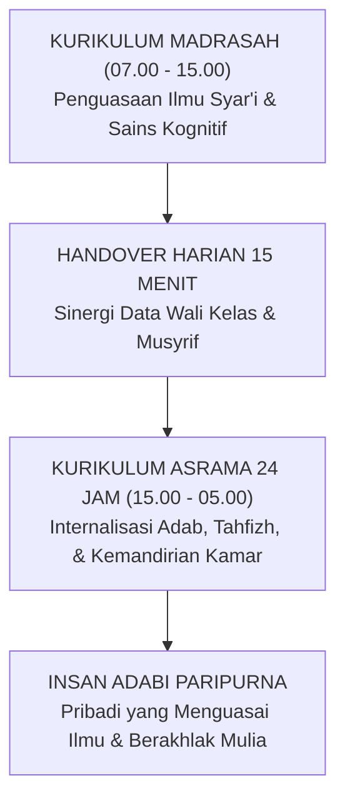
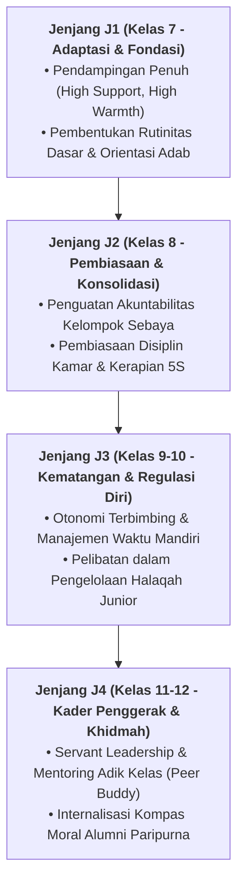

# IMPLIKASI KURIKULER DESAIN PEMBELAJARAN HOLISTIK

---
### Kurikulum yang Tidak Berhenti Saat Bel Sekolah Berbunyi

Kurikulum dalam Sistem TUMBUH dirancang sebagai satu kesatuan utuh antara kurikulum intrakurikuler (Madrasah), kokurikuler (Halaqah & Pembiasaan), dan ekstrakurikuler (Khidmah & Organisasi). Setiap mata pelajaran madrasah memiliki benang merah adab yang beresonansi dengan kehidupan asrama malam hari.

#### A. Desain Kurikulum 24-Jam: Menghubungkan Madrasah Pagi dan Asrama Malam
Kurikulum Sistem TUMBUH tidak memisahkan antara ranah kognitif madrasah (pagi) dengan pembiasaan adab asrama (malam). Konsep ini diwujudkan melalui:
1. **Penyelarasan Nilai Tematik**: Jika di kelas pagi santri belajar tentang adab menghormati guru dan ilmu (*Tadzkirat as-Sami'*), maka pada malam hari di asrama musyrif memfasilitasi sesi refleksi tentang bagaimana santri memperlakukan buku, kerapian meja belajar, dan saling menyimak hafalan sesama teman.
2. **Kemitraan Dual-Pillar**: Wali Kelas dan Musyrif Asrama melakukan *handover* harian selama 15 menit untuk saling memperbarui data santri yang sedang mengalami kesulitan emosional atau membutuhkan apresiasi khusus.
3. **Praktik Pembelajaran Berbasis Proyek Karakter**: Santri tidak hanya mengerjakan tugas teori, melainkan diberi misi nyata seperti merawat taman asrama, mengelola kebersihan masjid, atau membimbing adik kelas yang baru belajar makhraj huruf.

#### B. Strategi Integrasi Guru Mata Pelajaran
* Setiap guru mata pelajaran wajib menyisipkan pesan adab praktis selama 3–5 menit di awal pelajaran (*Adab Embedding*).
* Melarang keras penggunaan ancaman nilai akademik untuk menghukum pelanggaran asrama, menjaga objektivitas penilaian dan rasa keadilan santri.

---

### IV. Pembedahan Kapasitas Lanjutan & Trajektori Progresi Implikasi Kurikuler Desain Pembelajaran Holistik

Pengembangan kompetensi **IMPLIKASI KURIKULER DESAIN PEMBELAJARAN HOLISTIK** pada santri memerlukan strategi diferensiasi yang selaras dengan tahapan usia perkembangan remaja (*Developmental Milestones*):

1. **Dekomposisi Indikator Kematangan Perilaku**:
   Untuk memastikan karakter **IMPLIKASI KURIKULER DESAIN PEMBELAJARAN HOLISTIK** tertanam secara operasional, dewan asatidz dan musyrif memetakan indikator perilakunya ke dalam 3 ranah capaian:
   * **Ranah Kognitif-Reflektif (*Ma'rifah*)**: Santri memahami dalil syar'i, urgensi akhlak, dan konsekuensi logis dari setiap pilihannya.
   * **Ranah Afektif-Ruhiyyah (*Wijdan*)**: Tumbuhnya kepekaan nurani, rasa malu berbuat dosa (*Haya'*), dan kenikmatan dalam berbuat kebajikan.
   * **Ranah Psikomotorik-Habituasi (*'Amal*)**: Terwujudnya keterampilan bertindak nyata secara spontan, konsisten, dan mandiri tanpa perlu disuruh.

2. **Matriks Penahapan Lintas Jenjang Kemandirian (J1–J4)**:

3. **Rubrik Evaluasi Kualitatif & Indikator Pencapaian**:

| Level Kemandirian | Karakteristik Perilaku Teramati (*Behavioral Anchor*) | Pendekatan Bimbingan Musyrif |
| :--- | :--- | :--- |
| **Level 1 (Emerging)** | Memerlukan instruksi berulang dan pengawasan langsung musyrif. | *Direct Prompting* & pengingat visual harian. |
| **Level 2 (Developing)** | Mampu menjalankan adab saat diingatkan oleh teman sebaya. | Penguatan positif melalui pujian deskriptif. |
| **Level 3 (Proficient)** | Menjalankan adab secara mandiri dan konsisten tanpa diawasi. | Pemberian kepercayaan dan peran tanggung jawab kamar. |
| **Level 4 (Exemplary)** | Menjadi teladan (*Qudwah*) dan mampu membimbing kawan-kawannya. | Pelibatan aktif dalam struktur Dewan Santri & Mentor. |

---

### V. Panduan Praksis Pendampingan Musyrif di Asrama

Agar penanaman **IMPLIKASI KURIKULER DESAIN PEMBELAJARAN HOLISTIK** berhasil maksimal di lapangan, musyrif disarankan menerapkan protokol pendampingan berikut:
* **Fokus pada Usaha (*Effort-Oriented Praise*)**: Berikan apresiasi atas proses perjuangan santri dalam memperbaiki diri, bukan semata-mata hasil akhir yang sempurna.
* **Dialog Sokratik Saat Santri Mengalami Kesulitan**: Ajukan pertanyaan reflektif seperti: *"Apa yang membuat antum merasa berat menjalankan adab ini hari ini? Bagaimana kita bisa mengatasinya bersama besok?"*
* **Menjaga Iklim Ukhuwah Bebas Perundungan**: Pastikan senioritas dimaknai sebagai amanah pengayoman dan perlindungan kepada yang lebih muda, bukan hak istimewa untuk memerintah.
