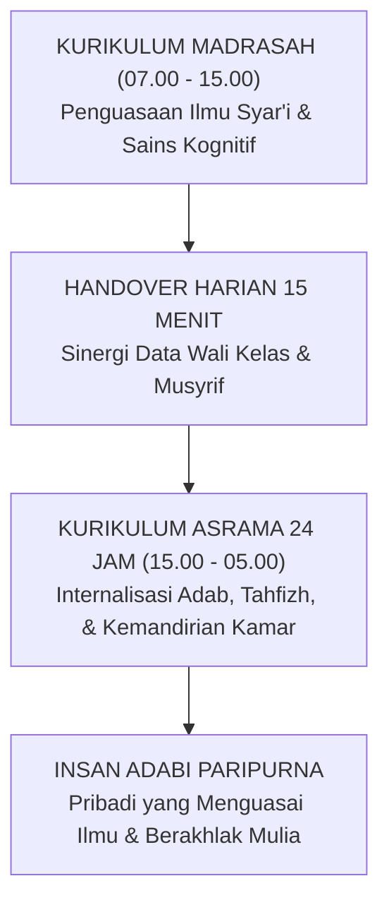

# IMPLIKASI KURIKULER DESAIN PEMBELAJARAN HOLISTIK

---
### Kurikulum yang Tidak Berhenti Saat Bel Sekolah Berbunyi

Kurikulum dalam Sistem TUMBUH dirancang sebagai satu kesatuan utuh antara kurikulum intrakurikuler (Madrasah), kokurikuler (Halaqah & Pembiasaan), dan ekstrakurikuler (Khidmah & Organisasi). Setiap mata pelajaran madrasah memiliki benang merah adab yang beresonansi dengan kehidupan asrama malam hari.

#### A. Desain Kurikulum 24-Jam: Menghubungkan Madrasah Pagi dan Asrama Malam
Kurikulum Sistem TUMBUH tidak memisahkan antara ranah kognitif madrasah (pagi) dengan pembiasaan adab asrama (malam). Konsep ini diwujudkan melalui:
1. **Penyelarasan Nilai Tematik**: Jika di kelas pagi santri belajar tentang adab menghormati guru dan ilmu (*Tadzkirat as-Sami'*), maka pada malam hari di asrama musyrif memfasilitasi sesi refleksi tentang bagaimana santri memperlakukan buku, kerapian meja belajar, dan saling menyimak hafalan sesama teman.
2. **Kemitraan Dual-Pillar**: Wali Kelas dan Musyrif Asrama melakukan *handover* harian selama 15 menit untuk saling memperbarui data santri yang sedang mengalami kesulitan emosional atau membutuhkan apresiasi khusus.
3. **Praktik Pembelajaran Berbasis Proyek Karakter**: Santri tidak hanya mengerjakan tugas teori, melainkan diberi misi nyata seperti merawat taman asrama, mengelola kebersihan masjid, atau membimbing adik kelas yang baru belajar makhraj huruf.

#### B. Strategi Integrasi Guru Mata Pelajaran
* Setiap guru mata pelajaran wajib menyisipkan pesan adab praktis selama 3–5 menit di awal pelajaran (*Adab Embedding*).
* Melarang keras penggunaan ancaman nilai akademik untuk menghukum pelanggaran asrama, menjaga objektivitas penilaian dan rasa keadilan santri.
