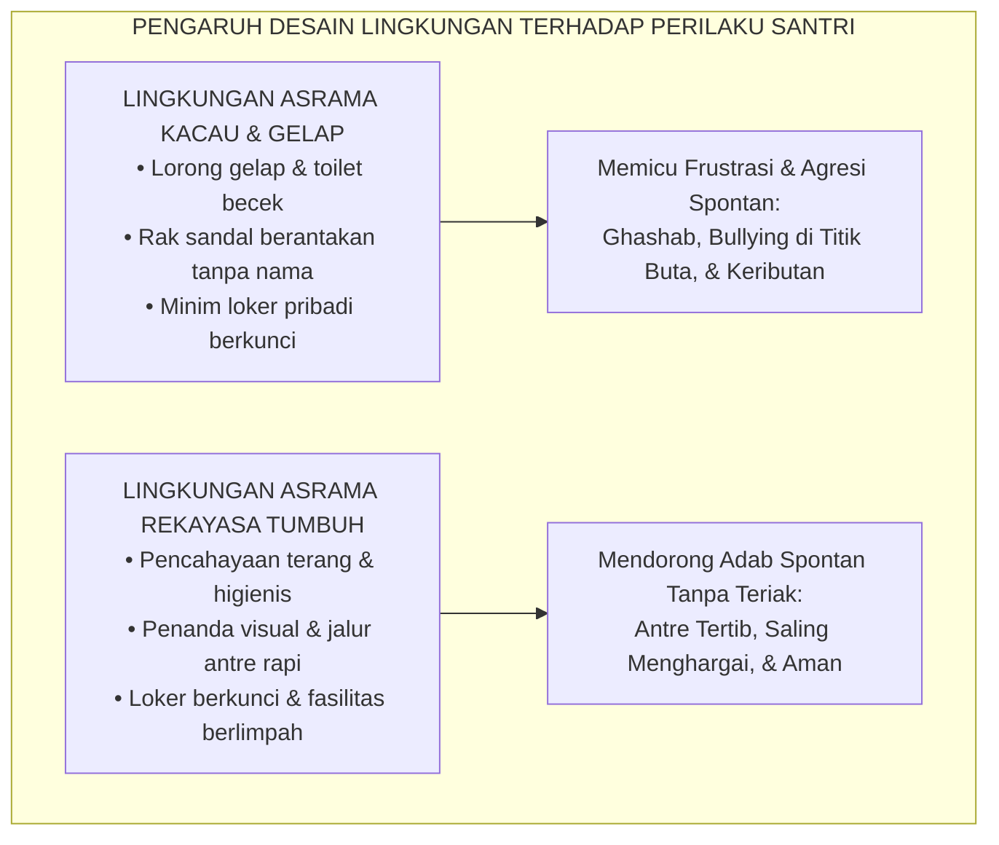
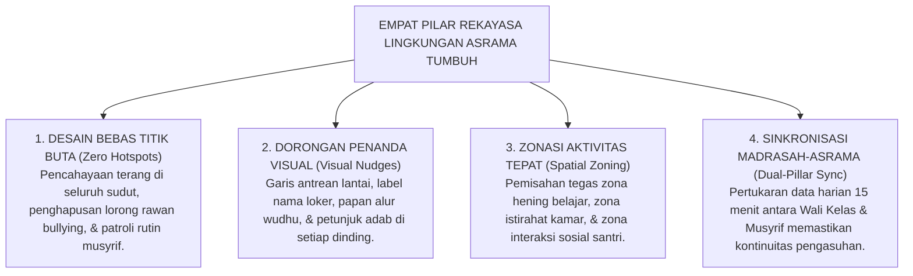

# SUB-BAB 1.5: REKAYASA LINGKUNGAN PEMBELAJARAN KARAKTER 24-JAM
## *Membangun Ekosistem Total Bi'ah Shalihah: Tata Ruang, Penanda Visual, Mitigasi Titik Rawan, dan Sinkronisasi Sinergis*

**Kode Klasifikasi**: `BOOK-02/BAB-01/SUB-05/MONOGRAF-MASTER-VIBRANT`  
**Disiplin Ilmu**: Psikologi Lingkungan (*Environmental Psychology*), Rekayasa Ekologi Pembinaan, & Arsitektur Pesantren  
**Penanggung Jawab Keilmuan**: Dewan Pakar Ekosistem TUMBUH (*Pakar Intervensi Preventif & Pakar Pengasuhan Asrama*)

---

### Ruang Fisik sebagai Guru Bisu: Pengaruh Tata Lingkungan terhadap Perilaku Santri

Banyak pendidik beranggapan bahwa karakter santri semata-mata dibentuk oleh ceramah ustadz di mimbar masjid atau nasihat musyrif di kamar. 

Namun sains psikologi lingkungan membuktikan sebuah kenyataan yang tak terbantahkan: **tata ruang fisik dan desain lingkungan bertindak sebagai "guru bisu" yang mengarahkan 80% perilaku spontan manusia**.

Jika asrama pesantren:
* Memiliki lorong-lorong gelap tanpa penerangan yang memadai.
* Memiliki antrean kamar mandi yang sempit, becek, dan minim ventilasi.
* Membiarkan rak sepatu berantakan tanpa sekat pemisah dan tanpa label nama.
* Tidak menyediakan lemari loker berkunci untuk menjaga privasi barang santri.

Maka secara alamiah lingkungan tersebut sedang **memicu lahirnya pelanggaran adab**: perebutan fasilitas, senggolan emosi yang berujung perkelahian, pencurian uang saku, dan normalisasi budaya *ghashab* sandal.

<b>Gambar 1.5.1:</b> Komparasi Pengaruh Desain Lingkungan Asrama terhadap Pembentukan Karakter Santri.

Pakar psikologi lingkungan **Gary W. Evans**[^1] membuktikan bahwa kebisingan kronis (*chronic noise*), kesemrawutan tata ruang (*chaos*), dan kepadatan berlebih (*crowding*) di lingkungan tempat tinggal anak memicu lonjakan hormon stres kortisol dan menurunkan kapasitas kontrol diri secara drastis.

Dalam tradisi pesantren modern Indonesia, pendiri Pondok Modern Gontor **KH. Imam Zarkasyi**[^2] merumuskan filosofi legendaris bahwa:
$$\text{"Apa yang santri lihat, apa yang santri dengar, dan apa yang santri rasakan di pondok—semuanya adalah pendidikan."}$$

---

### Empat Pilar Rekayasa Lingkungan Ekosistem TUMBUH

Untuk mewujudkan *Bi'ah Shalihah* yang mendidik secara aktif selama 24 jam penuh, **Sistem TUMBUH** menetapkan **Empat Pilar Rekayasa Lingkungan Pembinaan**:

<b>Gambar 1.5.2:</b> Empat Pilar Arsitektur Rekayasa Lingkungan Pengasuhan 24-Jam TUMBUH.

1. **Desain Bebas Titik Buta (*Zero Hotspots Engineering*)**:  
   Area kamar mandi belakang, gudang, dan lorong lantai atas yang kerap menjadi lokasi perpeloncoan senior direkayasa ulang: dipasang lampu penerangan terang benderang, pintu tanpa celah tersembunyi, dan dimasukkan ke dalam rute patroli aktif musyrif.
2. **Arsitektur Dorongan Visual (*Visual Nudge Architecture*)**[^3]:  
   Pemenang Nobel **Richard H. Thaler & Cass R. Sunstein**[^3] membuktikan bahwa dorongan visual sederhana (*nudges*) mampu mengubah perilaku manusia secara signifikan tanpa paksaan. Di asrama TUMBUH, stiker penanda arah wudhu di lantai, garis batas antrean rapi, dan wadah sandal bertingkat dengan label nama santri membuat anak tertib secara otomatis tanpa perlu diteriaki musyrif.
3. **Zonasi Spasial Fungsional (*Functional Spatial Zoning*)**:  
   Kamar asrama difungsikan khusus untuk istirahat dan menjaga privasi; ruang belajar komunal difungsikan untuk muthala'ah bersama; dan serambi masjid difungsikan untuk dzikir khusyuk. Pemisahan fungsi ini menjaga ritme sirkadian dan fokus kognitif santri.
4. **Sinkronisasi Sinergis Dua Pilar (*Dual-Pillar Synchronization*)**:  
   Madrasah dan asrama tidak lagi berjalan sendiri-sendiri. Setiap sore pukul 16.30 WIB, Wali Kelas mengirimkan ringkasan 3 poin kondisi psikologis dan adab santri kepada Musyrif, dan setiap pagi pukul 06.30 WIB Musyrif menyerahkan kembali data stabilitas malam anak kepada Wali Kelas melalui **Protokol Handover 15-Menit**.

---

### Tinjauan Turats: Menjaga Kesucian *Bi'ah Shalihah* Imam Al-Ghazali

Pentingnya rekayasa lingkungan pertemanan dan ruang hidup yang bersih ini telah digarisbawahi secara mendalam oleh **Imam Abu Hamid Al-Ghazali** dalam *Ihya' 'Ulumiddin* (Kitab *Adab al-Ulfah wal Ukhuwwah wash-Shuhbah*)[^4] sebagai berikut:

> [!NOTE]
> ### 📜 Kaidah Imam Al-Ghazali tentang Daya Serap Jiwa terhadap Lingkungan:
> 
> $$\text{إِنَّ الطِّبَاعَ سَرَّاقَةٌ، تَنْتَحِلُ مِنَ النُّفُوسِ الْمُجَاوِرَةِ أَخْلَاقَهَا وَعَادَاتِهَا مِنْ حَيْثُ لَا يَدْرِي الْإِنْسَانُ}$$
> 
> **Artinya:**  
> *"Sesungguhnya watak dasar jiwa manusia memiliki sifat 'pencuri ulung' (sangat mudah meniru); ia akan menyerap secara bawah sadar akhlak, perangai, dan kebiasaan dari orang-orang dan lingkungan di sekitarnya tanpa disadari oleh manusia itu sendiri."*

Ketika lingkungan fisik asrama bersih, tertib, terang, dan dipenuhi suasana persaudaraan yang hangat, watak dasar santri baru akan secara otomatis "mencuri" dan meniru ketertiban tersebut menjadi karakternya sendiri.

---

### Solusi Sistemik TUMBUH: Transformasi Total Menuju Rumah Kedua yang Memuliakan

Dengan rekayasa lingkungan holistik 24 jam ini, Bab 01 resmi meletakkan cetak biru paripurna bagi arsitektur kapasitas karakter santri:
* Dimulai dari dekonstruksi reduksionisme parsial menuju pendekatan *Whole-Child* (Sub-Bab 1.1).
* Distrukturisasikan ke dalam Panca Dimensi Kapasitas Holistik (Sub-Bab 1.2).
* Diintegrasikan secara harmonis dengan 5 Kompetensi CASEL SEL (Sub-Bab 1.3).
* Diberi bahan bakar motivasi intrinsik melalui Teori Penentuan Diri / SDT (Sub-Bab 1.4).
* Ditopang secara kokoh oleh ekosistem fisik dan kultural *Bi'ah Shalihah* 24-jam (Sub-Bab 1.5).

Inilah fondasi kokoh yang siap menerima penerjemahan kurikuler selanjutnya pada **Bab 02: Profil 10 Muwashafat Karakter Santri TUMBUH**.

---

## 📌 Catatan Kaki & Rujukan Primer

[^1]: **Gary W. Evans**, "The built environment and children's development", *Annual Review of Public Health*, Vol. 27 (2006), hlm. 423–441; serta **Gary W. Evans**, "Child development and the physical environment", *Annual Review of Psychology*, Vol. 57 (2006), hlm. 423–451.
[^2]: **K.H. Imam Zarkasyi**, *Pondok Pesantren sebagai Lembaga Pendidikan Karakter dan Pencetak Kader Umat* (Ponorogo: Gontor Press, 1988), hlm. 15–38.
[^3]: **Richard H. Thaler & Cass R. Sunstein**, *Nudge: Improving Decisions About Health, Wealth, and Happiness* (New Haven: Yale University Press, 2008; Edisi Revisi, Penguin Books, 2009), Bab 1: "Biases and Blunders", hlm. 17–39.
[^4]: **Hujjatul Islam Imam Abu Hamid al-Ghazali**, *Ihya' 'Ulumiddin*, Kitab Adab al-Ulfah wal Ukhuwwah wash-Shuhbah (Kairo & Beirut: Dar al-Ma'rifah, t.th.), Jilid II, hlm. 175–190.
