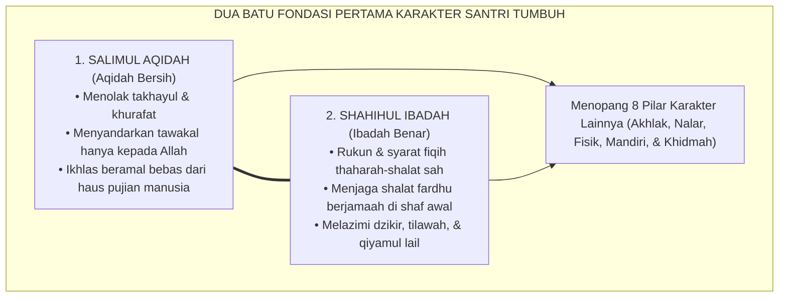
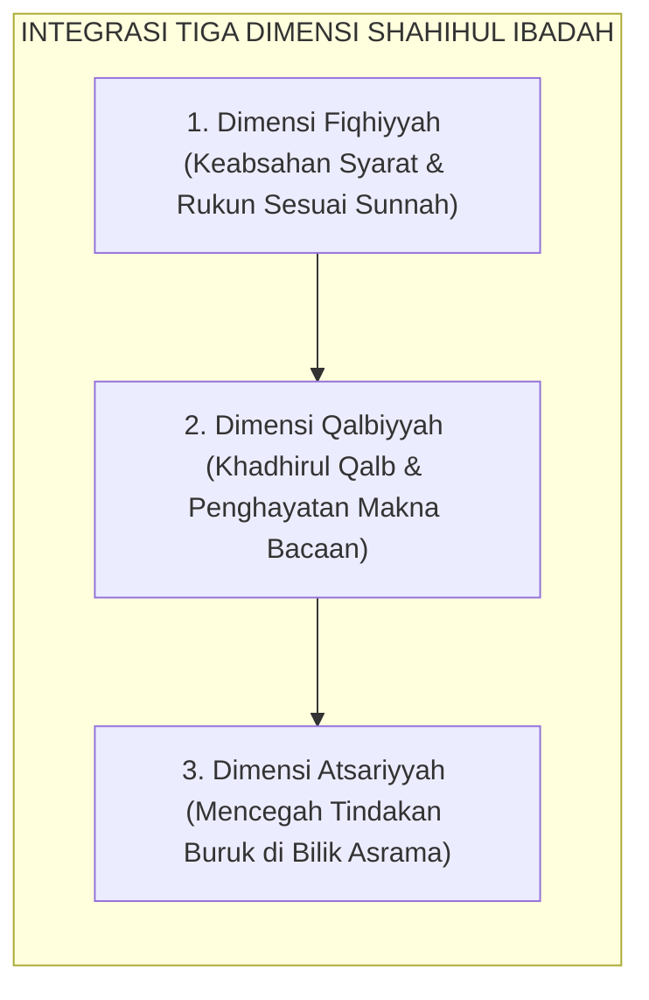

# SUB-BAB 2.1: SALIMUL AQIDAH & SHAHIHUL IBADAH
## *Fondasi Tauhid Murni, Pembebasan dari Kemunafikan Amali, dan Standarisasi Ibadah Khusyuk Sesuai Sunnah*

**Kode Klasifikasi**: `BOOK-02/BAB-02/SUB-01/MONOGRAF-MASTER-VIBRANT`  
**Disiplin Ilmu**: Teologi Islam Terapan, Fiqih Ibadah Syafi'iyyah, & Psikologi Spiritualitas  
**Penanggung Jawab Keilmuan**: Dewan Pakar Ekosistem TUMBUH (*Pakar Epistemologi Turats & Pakar Desain Kurikulum Adab*)

---

### Dua Batu Fondasi Pertama: Mengapa Karakter Bermula dari Aqidah dan Ibadah?

Dalam taksonomi sepuluh profil karakter (*Muwashafat*) Ekosistem TUMBUH, **Salimul Aqidah** (Aqidah yang Bersih) dan **Shahihul Ibadah** (Ibadah yang Benar) menempati posisi sebagai dua batu fondasi pertama (*The Twin Bedrocks*).

Tanpa aqidah yang kokoh dan ibadah yang benar:
* Keterampilan sosial santri mudah tergelincir menjadi kepura-puraan diplomatik (*riya' dan nifaq*).
* Kedisiplinan fisik santri mudah runtuh menjadi kepatuhan mekanis yang dingin.
* Prestasi intelektual santri rawan berubah menjadi kesombongan nalar (*kibr*) yang membinasakan jiwanya.

<b>Gambar 2.1.1:</b> Kedudukan Salimul Aqidah dan Shahihul Ibadah sebagai Fondasi Utama Ekosistem Karakter.

**Syaikhul Islam Ibnu Taimiyyah** dalam *Al-Aqidah al-Wasithiyyah*[^1] menegaskan bahwa poros kebahagiaan dan kelurusan akhlak manusia bergantung mutlak pada kemurnian tauhid uluhiyyah: memurnikan segala bentuk ketaatan, harapan, dan rasa takut hanya kepada Allah semata, terbebas dari syirik tersembunyi (*asy-syirk al-khafi*).

---

### Indikator Perilaku Faktual Salimul Aqidah (24 Jam Asrama)

Sering kali pemahaman aqidah di madrasah hanya diuji lewat hafalan 20 sifat wajib Allah di lembar ujian. Sistem TUMBUH menerjemahkan kemurnian aqidah menjadi **indikator perilaku faktual yang dapat diamati (*observable behaviors*)**:

1. **Bebas dari Keputusasaan Batin (*High Spiritual Resilience*)**:  
   Ketika santri menghadapi kesulitan dalam menghafal Al-Qur'an atau mendapatkan musibah sakit, ia tidak mengeluh menyalahkan takdir, melainkan mengambil wudhu, mendirikan shalat istirahat (*shalat hajat/taubat*), dan memohon pertolongan Allah.
2. **Ketiadaan Jimat & Takhayul (*Tawakkul Pureness*)**:  
   Santri tidak mempercayai mitos-mitos keramat yang merusak tauhid, tidak menyimpan rajah/jimat pembuka hafalan, melainkan menempuh sebab-sebab syar'i dan saintifik (muthala'ah tekun dan menjaga nutrisi halal).
3. **Kesucian Niat Beramal (*Tazkiyatun Niyyah*)**:  
   Santri menolak pamer hafalan (*sum'ah*) demi mengejar tepuk tangan panggung wisuda; ia melatih batinnya untuk merasa cukup dengan pandangan dan keridhaan Allah SWT.

---

### Indikator Perilaku Faktual Shahihul Ibadah (24 Jam Asrama)

Ibadah yang benar bukan hanya sekadar sah menurut fiqih formal, melainkan juga memancarkan kekhusyukan yang mencegah perbuatan keji dan munkar:

<b>Gambar 2.1.2:</b> Tiga Dimensi Integratif Shahihul Ibadah Ekosistem TUMBUH.

1. **Kesempurnaan Thaharah & Wudhu**:  
   Santri mempraktikkan thaharah secara higienis dan hemat air (*la tusrif*), membersihkan najis secara tuntas, dan merapikan pakaian shalatnya agar harum dan suci.
2. **Kelaziman Shalat Berjamaah di Shaf Pertama**:  
   Santri hadir di masjid sebelum adzan berkumandang atau tepat saat adzan, merapatkan dan meluruskan shaf dengan santun, serta tidak bercanda di ruang shalat.
3. **Kekhusyukan Dzikir & Doa Ma'tsurat**:  
   Mengikuti panduan **Imam An-Nawawi** dalam *Al-Adzkar*[^2], santri membiasakan dzikir pagi dan petang (*Al-Ma'tsurat*), melafalkan doa sebelum tidur, saat bangun, dan saat keluar bilik kamar dengan penghayatan makna yang mendalam.

---

### Tinjauan Neurosains & Psikologi Spiritualitas

Riset psikologi spiritualitas oleh **Robert A. Emmons & Michael E. McCullough**[^3] membuktikan bahwa individu yang mempraktikkan doa dan rasa syukur transendental secara teratur memiliki tingkat kecemasan 45% lebih rendah, stabilitas detak jantung (*heart-rate variability / HRV*) yang lebih harmonis, serta memiliki kapasitas empati sosial yang jauh lebih tinggi.

**Hujjatul Islam Imam Abu Hamid Al-Ghazali** dalam *Ihya' 'Ulumiddin* (Kitab *Qawa'id al-'Aqa'id*)[^4] menjelaskan bahwa akidah yang ditanamkan pada usia belia melalui pembiasaan ibadah praktis akan meresap ke dalam sumsum tulang anak, menjadi benteng pertahanan jiwa yang kokoh saat ia dewasa menghadapi badai fitnah zaman.

---

### Solusi Sistemik TUMBUH: Pembiasaan Tanpa Teror Fisik

Sistem TUMBUH menolak keras tradisi membangunkan shalat subuh dengan menyiram air es ke kasur atau mencambuk betis santri dengan sajadah basah. 

Sebagai gantinya, musyrif mendampingi santri dengan **Protokol Bangun Berkah 3-Fase**:
* **Fase 1 (03.30 WIB)**: Lampu lorong dinyalakan remang dan murottal Al-Qur'an diputar dengan volume lembut (*gentle acoustic cue*).
* **Fase 2 (03.45 WIB)**: Musyrif masuk bilik kamar, memanggil nama santri dengan panggilan sayang, dan menyentuh pundaknya dengan hangat.
* **Fase 3 (04.00 WIB)**: Santri yang telah bangun diajak saling menyapa dan bersama-sama melangkah ke tempat wudhu dengan senyuman.

Hasilnya: santri bangun dengan hati lapang dan memandang shalat bukan sebagai siksaan penjara, melainkan sebagai oase pertemuan terindah bersama Sang Maha Pencipta.

---

## 📌 Catatan Kaki & Rujukan Primer

[^1]: **Syaikhul Islam Ahmad bin Abdul Halim Ibnu Taimiyyah**, *Al-'Aqidah al-Wasithiyyah*, Tahqiq: Syaikh Muhammad Khalil Harras (Riyadh: Dar al-Hidayah, 1413 H), hlm. 12–35.
[^2]: **Al-Imam Abu Zakariyya Yahya bin Syaraf an-Nawawi**, *Al-Adzkar al-Muntakhabah min Kalami Sayyidil Abrar*, Tahqiq: Syaikh Syu'aib al-Arnauth (Damaskus: Dar al-Mallah, 1971; cetak ulang Beirut: Dar Ibnu Katsir, 2004), hlm. 45–98.
[^3]: **Robert A. Emmons & Michael E. McCullough**, "Counting blessings versus burdens: An experimental investigation of gratitude and subjective well-being in daily life", *Journal of Personality and Social Psychology*, Vol. 84, No. 2 (2003), hlm. 377–389.
[^4]: **Hujjatul Islam Imam Abu Hamid al-Ghazali**, *Ihya' 'Ulumiddin*, Kitab Qawa'id al-'Aqa'id (Kairo & Beirut: Dar al-Ma'rifah, t.th.), Jilid I, hlm. 85–112.
